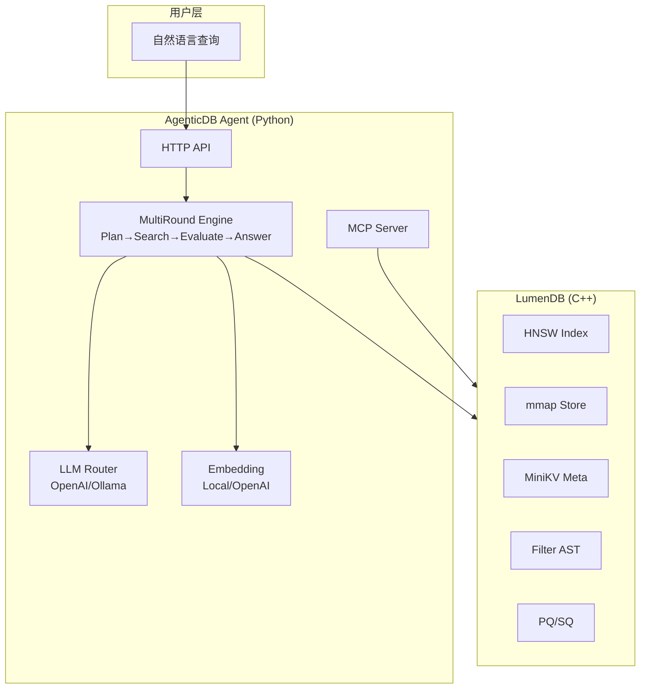

# 第一章：项目概览与架构

> LumenDB 是一个 C++ 零拷贝向量数据库，AgenticDB 在其上构建了智能检索层。

## 前置知识

> 📎 **参考**: [构建环境配置](../prerequisites/01_构建环境配置_zh.md) | [Python环境](../prerequisites/02_Python环境_zh.md)

---

## 学习目标

- 理解 LumenDB + AgenticDB 的整体架构
- 掌握各模块的职责与关系
- 了解项目的技术栈和设计哲学

---

## 1.1 AgenticDB 是什么？



AgenticDB 不是一个独立的项目，而是在 LumenDB C++ 向量数据库之上**增加了一层 Python Agent 层**，使数据库具备以下能力：

| 能力 | 说明 | 对应模块 |
|------|------|----------|
| 自然语言理解 | LLM 分析问题类型 | `QueryPlanner` |
| 自主规划策略 | 选择 DIRECT/FILTERED/MULTI_QUERY | `engine/strategy.py` |
| 多轮检索 | 自动迭代优化结果 | `MultiRoundEngine` |
| 质量自评估 | LLM 判断结果是否足够 | `ResultEvaluator` |
| 查询重构 | 生成改进的搜索查询 | `QueryReformulator` |
| MCP 集成 | 标准协议供 Agent 框架调用 | `MCP Server` |

---

## 1.2 项目结构

```
LumenDB/
├── agent/            ← Python Agent 层 (新增)
│   ├── config.py         全局配置
│   ├── llm/              LLM 集成 (router/schemas/prompts)
│   ├── embedding/        文本嵌入服务
│   ├── engine/           检索引擎 (planner/evaluator/reformulator)
│   ├── server/           HTTP 服务器
│   └── mcp/              MCP 协议实现
├── src/               ← C++ 数据库核心
│   ├── collection.cpp    集合 API
│   ├── index/hnsw.cpp    HNSW 索引
│   ├── storage/          mmap 存储
│   └── server/           HTTP 服务器
├── include/           ← C++ 头文件
├── python/            ← pybind11 绑定
├── tests/             ← 测试
│   └── agent/            17 个 Agent 单元测试
├── docs/              ← 文档
│   ├── AGENTICDB.md      架构文档
│   ├── OPERATIONS.md     操作手册
│   └── PRODUCTION_QA.md  面试题集
└── course/            ← 课程文档 (本目录)
```

---

## 1.3 技术栈

| 层级 | 技术 | 版本 | 用途 |
|------|------|------|------|
| 向量引擎 | C++17 + AVX2 | g++-12 | HNSW 索引 + mmap 存储 |
| 网络框架 | C++20 协程 (SkyNet) | - | HTTP 服务器 |
| 元数据存储 | MiniKV (LSM-Tree) | - | 文档元数据 |
| Agent 层 | Python 3.11+ | 3.11 | LLM 交互、检索编排 |
| LLM 后端 | OpenAI / Ollama | - | 模型推理 |
| 嵌入模型 | sentence-transformers | 5.x | 文本向量化 |
| 协议 | MCP (JSON-RPC 2.0) | 1.27 | Agent 框架集成 |
| 容器化 | Docker + Compose | 24+ | 部署 |

---

## 1.4 设计哲学

1. **C++ 做计算，Python 做 AI** — 向量搜索需要极致性能，LLM 调用是 IO 密集
2. **Protocol over SDK** — 通过 HTTP API + MCP 协议集成，而非 SDK
3. **Quality-driven retrieval** — 用质量评分决定是否继续检索，而非固定轮数
4. **Strategy pattern** — 4 种检索策略，由 LLM 自主选择
5. **Provider abstraction** — LLM 和 Embedding 都支持多后端切换

---

## 思考题

1. 为什么 Agent 层用 Python 而非 C++？如果改写成纯 C++ 会有哪些优势和劣势？
2. MCP 协议和直接 HTTP API 调用的区别是什么？各自适合什么场景？
3. "质量驱动检索"相比"固定 top-k"有什么优缺点？

## 动手练习

1. 运行 `python -c "from agent.config import load_config; print(load_config())"` 查看默认配置
2. 阅读 `agent/config.py`，找出所有可用的环境变量
3. 在 `agent/__init__.py` 中添加版本号打印
