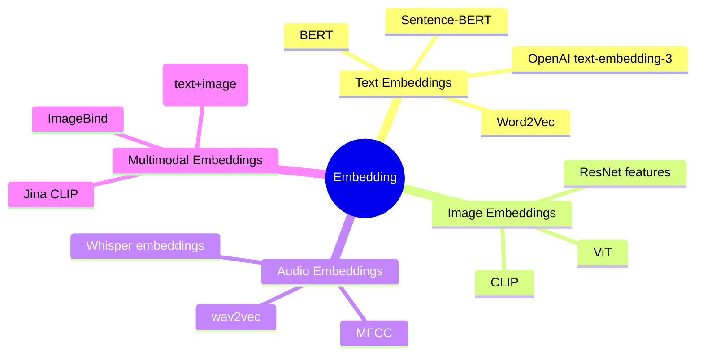
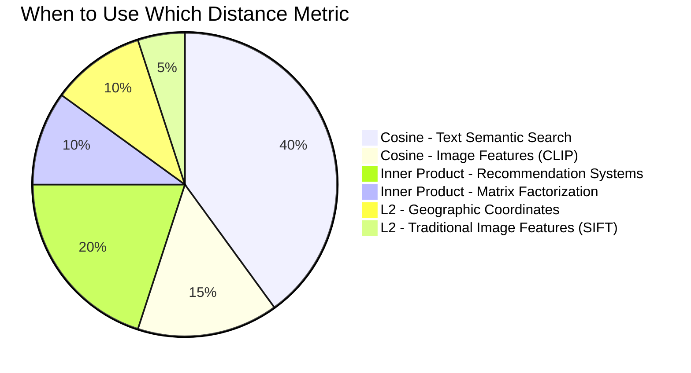

# Chapter 2: Vector Fundamentals and Distance Metrics

## Prerequisites

> 📎 **Reference**: [Vector Distance Metrics](../prerequisites/05_向量距离度量.md) — L2, Inner Product, Cosine: formulas, properties, and when to use each
> 📎 **Reference**: [SIMD & Hardware Optimization](../prerequisites/06_SIMD与硬件优化.md) — CPU registers, SIMD instruction sets (SSE→AVX2→AVX-512), FMA, and the memory wall

## Learning Objectives
- Understand the origin, principles, and search applications of embeddings
- Master the mathematical intuition and use cases for L2, inner product, and cosine distance metrics
- Understand the hardware principles behind CPU registers, SIMD instruction sets, and FMA
- Recognize the "memory wall" — why the real bottleneck of vector search is not computation
- Hands-on implementation of AVX2-accelerated distance functions, comparing scalar and vectorized performance

---

## 2.1 Why Do We Need Vectors? — Teaching Computers to Understand "Meaning"

### 2.1.1 The "Illiteracy" Problem of Computers

Let's start with a fundamental question: **Can computers understand text?**

The answer is: **Not at all**. When you type "this cat is cute," the computer sees only a string of numeric encodings — in UTF-8 encoding, those five Chinese characters become a hexadecimal byte sequence like `E8 BF 99 E5 8F AA E7 8C AB E5 BE 88 E5 8F AF E7 88 B1`. The computer doesn't know that "cat" and "dog" are related, doesn't know that "cute" is a positive word, and certainly doesn't know that a photo of a cat and the character "cat" refer to the same thing.

The same problem exists for images, audio, and video — computers only see pixel values, waveform samples, and frame sequences, completely oblivious to the "meaning" within.

**This creates a massive engineering challenge**: search engines want to find "results semantically similar to the query," recommendation systems want to find "content matching user interests" — but computers cannot measure "semantic similarity" at all.

### Embedding Types Overview



### 2.1.2 Embedding: Giving "Meaning" a Digital Address

**Embedding** is a technique that maps discrete objects (text, images, audio, code, even protein sequences) to a **continuous vector space**. Let's break down each term in this definition:

- **Discrete object**: Something that cannot be directly represented by continuous numerical values. For example, the word "cat" — it's not a number, you can't add, subtract, multiply, or divide it. An image is composed of discrete pixels; audio is composed of discrete samples.
- **Continuous vector space**: A mathematical space where each point is determined by a set of real-number coordinates. "Continuous" means coordinates can take any real value with arbitrary precision (unlike integers which can only be 0, 1, 2...), meaning the distance between two points in the space can be infinitely subdivided.
- **Vector**: In mathematics, a vector is an ordered set of numbers, like `[0.12, -0.34, 0.56]`. You can think of a vector as a point in space — with 3 numbers, the point is in 3D space; with 768 numbers, the point is in 768-dimensional space.

The core idea of embedding is: train a mathematical model (usually a neural network) to learn to convert each discrete object into a vector, such that **semantically similar objects are close to each other in the vector space**.

```
"cat"   → [0.12, -0.34, 0.56, 0.89, -0.21, ..., 0.78]  (768 floating-point numbers)
"dog"   → [0.11, -0.32, 0.55, 0.87, -0.19, ..., 0.79]  (L2 distance ≈ 0.04 — almost overlapping!)
"car"   → [-0.45, 0.67, -0.23, 0.11, 0.52, ..., 0.01]  (L2 distance ≈ 1.52 — far apart)
```

A few terms need defining:

- **Floating-point number (float)**: How computers represent decimals. A 32-bit float (float32) occupies 4 bytes of memory and can represent values in the range of approximately ±3.4×10³⁸, with about 7 significant digits of precision. Each number in a vector is typically represented as float32.
- **Dimension**: The number of elements in a vector. In the example above, the vector has 768 floating-point numbers, so the dimension is 768. Dimension determines a vector's "expressive capacity" — higher dimensions can encode richer semantic information, but computation and storage costs increase too.
- **Feature**: Each dimension in a vector is a feature. For example, in a "cat" vector, dimension 0 might encode "is it an animal," dimension 1 might encode "does it have fur" — though in practice, learned features are abstract and humans can't easily interpret individual dimensions.
- **L2 distance (detailed later)**: A mathematical formula for measuring "how far apart" two vectors are. A small L2 distance means two vectors are close in space — in this example, the L2 distance between "cat" and "dog" is only 0.04, indicating very similar semantics.

> **Why is it called "embedding"?** The name comes from a mathematical concept: "embedding" a high-dimensional, sparse representation (where each word is just an ID or category label) into a low-dimensional, dense vector space. Like embedding a nail into wood — the nail's (discrete object) certain properties (semantic relationships) are now preserved on the wood's surface (vector space).


### Text-to-Vector Conversion Flow


### 2.1.3 Why Can Vectors Be Used for Search?

In traditional database searches, you query for exact matches: "find all articles where `category='sports'`." But real-world search is fuzzy: a user types "How to read CSV in Python?" and they want to find a document titled "How to import data with pandas" — no keyword overlap, but semantically identical.

Vector search solves this by: if two documents encoded by the same embedding model produce vectors that are close together, they're likely talking about the same thing. Search becomes "find the document vectors closest to the query vector" — pure mathematical operation, no need to understand the text itself.

A key term here:

- **Similarity**: A measure of "how alike" two objects are. Note that similarity and distance have an **inverse relationship** — the smaller the distance, the higher the similarity; the larger the distance, the lower the similarity. Many algorithms and systems adopt the "smaller distance = more similar" paradigm, which allows efficient searching using data structures like min-heaps.

> **Core formula**: relevance(Q, D) = similarity(embed(Q), embed(D))
>
> Q = query text, D = candidate document, embed() = embedding model, similarity() = distance/similarity function

### 2.1.4 Brief History of Embedding: From Bag-of-Words to Large Models

Understanding this evolution helps you see why certain design choices (like normalization, inner product distance) are so prevalent today.

| Era | Technology | Core Idea | Limitations |
|---|---|---|---|
| 1970s | **TF-IDF** | Term Frequency × Inverse Document Frequency: a word appearing more in a document is more important, but appearing more in the overall corpus is less important (like "the", "is") | Sparse vectors (as many dimensions as words in the dictionary — millions), cannot capture semantics: synonyms score completely differently |
| 2013 | **Word2Vec** (Google, Mikolov et al.) | Uses a shallow neural network to predict word contexts. As a byproduct, each word is embedded into a 100-300 dimensional dense vector. Astonishing discovery: vec("king") - vec("man") + vec("woman") ≈ vec("queen") | Can only handle word level; requires additional methods to get sentence/document vectors (e.g., averaging, TF-IDF weighting) |
| 2018 | **BERT** (Google, Devlin et al.) | Deep Transformer network pre-trained on massive text, learning to generate word vectors based on context. "Apple" in "I ate an apple" and "I bought an Apple" have different vectors. | Without fine-tuning, single-sentence BERT vectors don't work well for semantic search — requires contrastive training |
| 2019 | **Sentence-BERT** | Adds a siamese network structure on top of BERT, specifically trained to make semantically similar sentence vectors close. This is the true starting point of modern vector search. | — |
| 2024 | **OpenAI text-embedding-3** | Large-scale contrastive training + model distillation. Supports variable dimensions (compresses 3072 dimensions to 256 via PCA with minimal information loss) | Closed-source model, API is paid |
| 2024+ | **Multimodal Embeddings** (CLIP, Nomic, Jina CLIP) | Text and images use the same embedding space: the text vector for "a cat" and the image vector of a cat photo are close in space | Cross-modal search: search images with text, search text with images |

Let's review the key milestones in this history and understand their technical context:

**The TF-IDF Era (1970s-2010s)**: This was the "Stone Age" of information retrieval. The core idea came from statistics — if a word appears frequently in a document (high TF) but rarely in the overall corpus (high IDF), it's important for that document. Simple and effective, but with one fatal flaw: it treats each word as an independent symbol. "Good" and "excellent" are completely unrelated in TF-IDF — they're two entirely different words, with orthogonal vector representations (cosine similarity of 0).

**Word2Vec's Revolution (2013)**: Tomas Mikolov and others proposed an elegant idea — a word's meaning is determined by its context (originating from linguist J.R. Firth's 1957 quote: "You shall know a word by the company it keeps"). They trained a simple neural network: given a word, predict surrounding words (Skip-gram model), or given surrounding words, predict the middle word (CBOW model). After training, each word was mapped to a 100-300 dimensional vector. The most famous discovery was **linear relationships in word vectors**: vec("king") - vec("man") + vec("woman") ≈ vec("queen"). This means direction in the vector space encodes semantic relationships.

**BERT's Context Revolution (2018)**: One limitation of Word2Vec was that each word had only one fixed vector. But "apple" means completely different things in "I ate an apple" and "I bought an Apple phone." BERT (Bidirectional Encoder Representations from Transformers) solved this through the Transformer architecture — it dynamically generates each word's vector based on context. BERT was pre-trained on deep neural networks with 12-24 layers using bidirectional attention (looking at both left and right context simultaneously), breaking records on 11 NLP tasks.

**Sentence-BERT's Practicalization (2019)**: While BERT is powerful, using it directly for semantic search doesn't work well. BERT was originally designed for sentence pair classification (determining if two sentences are similar), not for generating sentence-level vector representations. Nils Reimers and Iryna Gurevych proposed Sentence-BERT: adding a siamese network structure on top of BERT (two BERTs sharing weights), trained with contrastive learning — making semantically similar sentence vectors close and dissimilar ones far apart. This is the true starting point of modern vector search.

**OpenAI's Scaling (2022)**: The text-embedding-3 series represents the "scaling" approach — larger models, more training data, better training techniques (like hard negative mining in contrastive learning). It also introduced a practical feature: variable dimensions — the original output is 3072 dimensions, but can be compressed to 256 via PCA while retaining most of the information, significantly reducing storage and computation costs.

The core trend of this evolution: deeper networks + more contrastive training data → vectors become increasingly "semantic-understanding." The work of vector databases (like LumenDB) is completely orthogonal to these embedding models — they don't care how vectors are generated, only how to efficiently store and search them.

---

## 2.2 Three Distance Metrics: How to Define "Similarity"

The core operation of vector search is: given two vectors a and b, compute a **scalar** (single number) representing how "dissimilar" they are. Before we begin, let's clarify a commonly confused concept:

- **Distance**: Smaller means more similar. A distance of 0 means identical.
- **Similarity**: Larger means more similar. A similarity of 1 means identical.

Many systems adopt the "distance" paradigm (smaller = more similar), enabling efficient searching with data structures like min-heaps. All three metrics below follow the "smaller = more similar" convention.

### 2.2.1 L2 Distance (Euclidean Distance)

$$d(a,b) = \sqrt{\sum_{i=1}^{n}(a_i - b_i)^2}$$

**Historical background**: L2 distance is named after the ancient Greek mathematician Euclid (circa 300 BC). In his work "Elements," he gave the formula for the distance between two points in a plane: $\sqrt{(x_2-x_1)^2 + (y_2-y_1)^2}$ — a direct application of the Pythagorean theorem. L2 distance is the natural generalization of this formula to arbitrary dimensions. The "L" in "L2" stands for the norm in "Lp space," and "2" means the exponent is 2 (i.e., square root of sum of squares).

**Intuition**: This is the "straight-line distance between two points" you learned in middle school — the Pythagorean theorem generalized to n-dimensional space. Imagine each vector as a point in high-dimensional space; L2 distance is the length of the straight line connecting them.

**Geometric imagination**: In 2D space, the L2 distance between point A=(1,2) and point B=(4,6) is $\sqrt{(4-1)^2+(6-2)^2} = \sqrt{9+16} = 5$. You can imagine a straight line from A to B; L2 distance is the length of that segment. In 768-dimensional space, although we can't "see" it, the mathematical formula is exactly the same.

**Use case**: When the **absolute position** of vectors is meaningful. A typical example is geographic coordinates: the distance between Beijing and Shanghai is absolute, and scaling by 10x should make the distance 10x larger too.

**Key properties**:
- **Sensitive to magnitude**: If every component of vector a is multiplied by 10, the L2 distance between a and b will change dramatically — even if the direction doesn't change. This means if you care about whether "apple" and "fruit" are semantically similar (direction is similar) but the magnitudes of the two vectors differ by 10x due to model training, L2 distance will be overwhelmed by the magnitude difference
- **Satisfies the triangle inequality**: $d(a,c) \le d(a,b) + d(b,c)$ — this ensures correctness of search algorithms based on triangle pruning (like KD-Tree). Intuition: detouring is always longer than going straight
- **Linear gradients**: Friendly for deep learning backpropagation

**Scalar implementation**:
```cpp
float l2_distance(const float* a, const float* b, size_t dim) {
    float sum = 0.0f;
    for (size_t i = 0; i < dim; i++) {
        float diff = a[i] - b[i];
        sum += diff * diff;
    }
    return std::sqrt(sum);
}
```

**Practical optimization**: During search, you only need to compare the **order** of distances, not the exact distance values. Since for any non-negative numbers, $\sqrt{x} > \sqrt{y} \iff x > y$, you can directly compare squared sums during search, skipping the `std::sqrt()` computation. LumenDB's internal search uses `l2_squared` throughout, only taking the square root when returning final results (if configuration requires distance values).

### 2.2.2 Inner Product Distance

$$d(a,b) = -\sum_{i=1}^{n} a_i \cdot b_i$$

**Historical background**: The inner product (also called dot product) is one of the most fundamental operations in linear algebra. Its history traces back to William Rowan Hamilton's work on quaternions in the 19th century. The geometric meaning of the inner product is given by the Cauchy-Schwarz inequality: $|a \cdot b| \le |a| \cdot |b|$, with equality if and only if the two vectors are collinear. In machine learning, the inner product is widely used as the core of "attention mechanisms" — in Transformer models (like BERT, GPT), the similarity between "query" and "key" is computed using inner products.

**Intuition**: The dot product of two vectors can be understood as "the length of a's projection onto b multiplied by b's magnitude." If a and b point in the same direction, the dot product is positive and large; if perpendicular, it's 0; if opposite, it's negative. The negative sign converts "more similar → larger dot product" into "more similar → smaller distance," consistent with the other two distance metrics' semantics.

**Geometric imagination**: Imagine two arrows originating from the same point. If they point in nearly the same direction, the dot product is large (positive); if perpendicular, it's zero; if in opposite directions, it's negative. The dot product includes both "direction information" and "magnitude information" — two long arrows with aligned directions will have a very large dot product.

**Use case**: When the embedding model's training objective (loss function) directly maximizes the dot product of positive pairs. A typical example is **recommendation systems**: the dot product of user and item vectors is trained to predict user ratings for items. In matrix factorization, user i's rating of item j ≈ user_i · item_j.

**Key properties**:
- **Lowest computation**: Only multiply-add operations, no subtraction, squaring, or square roots — the fastest of the three metrics
- **Extremely sensitive to magnitude**: Vectors with large magnitudes have large inner products with almost every vector. This can cause the "hub effect": a few high-magnitude vectors rank at the top for all queries
- **Unbounded**: Unlike cosine distance fixed in the [0, 2] range, inner product distance can be arbitrarily large

**Equivalence between normalization and inner product**: If all vectors are L2-normalized (each vector scaled to magnitude 1), then:

$$d_{L2\_squared}(a,b) = 2 - 2 \cdot (a \cdot b) \quad \text{(when |a| = |b| = 1)}$$

At this point, L2 distance and inner product are completely equivalent. This is why many systems (like OpenAI) normalize before outputting embeddings — letting you freely choose which metric to use.

An important term here:

- **Normalization**: The process of scaling vectors to unit length (magnitude = 1). Specifically, divide each component of the vector by its L2 norm. After normalization, all vectors lie on the "unit hypersphere" of the high-dimensional space.
- **Unit vector**: A vector with magnitude 1. A normalized vector is a unit vector. Unit vectors preserve direction information but discard magnitude information.

### 2.2.3 Cosine Distance

$$d(a,b) = 1 - \frac{a \cdot b}{|a| \cdot |b|}$$

**Historical background**: The mathematical basis of cosine similarity comes from trigonometry — in a right triangle, the cosine equals the adjacent side divided by the hypotenuse. Generalizing this to high-dimensional space, the cosine between two vectors equals their dot product divided by the product of their magnitudes. This metric became popular in information retrieval in the 1990s because document length (corresponding to vector magnitude) shouldn't affect semantic similarity judgment — a 1000-word article and a 500-word article discussing the same topic should be considered similar.

**Intuition**: Cosine similarity measures the **angle** between two vectors, not the distance between them. "Apple" and "fruit" in the vector space should point in roughly the same direction, even though the "apple" vector's magnitude might be 3x that of "fruit." Cosine distance captures this "directional similarity" while ignoring magnitude differences.

> **Analogy**: If you and a friend stand at the same spot, each pointing forward — your pointing direction represents the semantic direction of "apple," and your friend's represents "fruit." Cosine distance measures the **angle between your pointing directions**, while L2 distance measures **the distance between your fingertips**.

**Geometric imagination**: Imagine two arrows starting from the origin. Cosine distance only looks at the angle between these two arrows — regardless of how long they are. When the angle is 0°, the cosine is 1, cosine distance is 0 (perfect match); when the angle is 90°, cosine is 0, cosine distance is 1 (completely unrelated); when the angle is 180°, cosine is -1, cosine distance is 2 (completely opposite).

**Use case**: Default output of OpenAI text-embedding-3 series and most Sentence-BERT models — these models' outputs are typically normalized after training, with output vector magnitudes naturally equal to 1.

**Key properties**:
- **Fixed range [0, 2]**: 0 means direction is exactly the same (perfect match), 1 means orthogonal (unrelated), 2 means direction is completely opposite
- **Highest computation cost**: Requires computing both vectors' magnitudes (one sum-of-squares + square root each), plus one dot product
- **Degrades to inner product after normalization**: If both vectors are already normalized (magnitude = 1), denominator = 1 × 1 = 1, $d = 1 - a \cdot b$, equivalent to inner product plus a constant offset

**Scalar implementation**:
```cpp
float cosine_distance(const float* a, const float* b, size_t dim) {
    float dot = 0.0f, norm_a = 0.0f, norm_b = 0.0f;
    for (size_t i = 0; i < dim; i++) {
        dot += a[i] * b[i];
        norm_a += a[i] * a[i];
        norm_b += b[i] * b[i];
    }
    float denom = std::sqrt(norm_a) * std::sqrt(norm_b);
    if (denom < 1e-9f) return 1.0f;  // Zero vector protection
    return 1.0f - dot / denom;
}
```

**Pre-normalization optimization**: If data is already normalized at insertion time (|v| = 1), cosine distance degrades to one minus the dot product. LumenDB supports configuring `normalize_on_insert` to automatically normalize all vectors at write time, reducing cosine distance computation to the same cost as inner product.

### 2.2.4 Why Different Metrics Suit Different Problems?

The key to understanding these three metrics is: they assign different weights to "vector magnitude."

**A vivid analogy**: Suppose you're comparing two books for content similarity.

- **L2 distance** considers both "content" and "length" — a 1000-page novel and a 10-page short story, even with the exact same theme, may have a large L2 distance (because magnitude differs greatly).
- **Cosine distance** only cares about "content direction," ignoring "length" — two books discussing the same topic, regardless of length, have a small cosine distance.
- **Inner product distance** considers both "content" and "length," with the length effect amplified — a very long novel has a large inner product with almost every book.

**Practical recommendations**:
- **Text search**: Most cases use cosine distance (or normalized inner product). Because document length shouldn't affect semantic judgment.
- **Recommendation systems**: Use inner product. Because user ratings (like 1-5) already encode "intensity" information, and normalization would lose this.
- **Image features**: If using multimodal models like CLIP, typically cosine distance. If using traditional image features (like SIFT), L2 distance may be appropriate.

### Distance Metric Selection Decision Tree

### Distance Metric Use Cases



```
Do you only care about direction (not absolute magnitude)? → Yes → Cosine or pre-normalized Inner Product
       ↓ No
Does vector magnitude have physical meaning (like frequency, confidence)? → Yes → L2
       ↓ No
Is it a recommendation system (model optimization objective is inner product)? → Yes → Inner Product
       ↓ No
Can't determine? → Default to Cosine (most universal, OpenAI/Cohere/Jina all support normalization)
```

| Metric | Computation per Dimension | Sensitive to Magnitude | Range | Typical Users |
|---|---|---|---|---|
| L2 | subtract + multiply + add | Yes | [0, +∞) | Facebook FAISS default, Annoy |
| Inner Product | multiply + add | Yes (extremely) | (-∞, +∞) | Recommendation systems, matrix factorization, Cohere v2 |
| Cosine | 2× multiply + 3× add (extra squares) | No | [0, 2] | OpenAI, Sentence-BERT, most modern embeddings |
| Normalized IP | multiply + add | No (magnitude=1) | [0, 2] equivalent | LumenDB recommended path: normalize at insert, search with IP |

---

## 2.3 SIMD: One Instruction Operating on Multiple Data

### 2.3.1 Why Do We Need SIMD?

The essence of vector distance computation is a massive "multiply-add loop": for a 768-dimensional vector, you need 768 multiplications and 768 additions — doesn't seem like much. But when a database has 1 million vectors, each query requires 768 million floating-point operations. CPU execution speed is limited by two factors:

1. **Instruction throughput**: How many instructions a CPU can execute per clock cycle
2. **Data movement**: The speed of data transfer from memory to CPU registers

**SIMD** (Single Instruction, Multiple Data) is a class of CPU instruction set extensions that let one instruction operate on multiple data points simultaneously. Without SIMD, processing 8 floats requires 8 multiply instructions. With AVX2 SIMD instructions, only 1 is needed — theoretically an 8x speedup.

An important term here:

- **Instruction Set Architecture (ISA)**: The complete set of machine instructions that a CPU can understand and execute. Different CPUs may support different instruction set extensions — SSE, AVX, AVX2, AVX-512 are all SIMD extensions on the x86 architecture. The compiler needs to know which instruction sets the target CPU supports to generate corresponding code.

### 2.3.2 What is a CPU Register?

Before understanding SIMD, you need to understand **registers**. Registers are the smallest, fastest storage units inside the CPU — they're directly "soldered" next to the ALU (Arithmetic Logic Unit), with an access latency of 0 clock cycles (synchronized with instruction execution).

```
Data travel speed in a computer:
  CPU Register  →  0 ns (inside CPU, instant)
  L1 Cache      →  ~1 ns (4 CPU cycles, still on the CPU chip)
  L2 Cache      →  ~4 ns
  L3 Cache      →  ~12 ns
  Main Memory (RAM) →  ~60-100 ns (requires going through memory bus, off the CPU chip)
  SSD Disk      →  ~10-100 µs (microseconds, 1000-10000x slower than RAM)
```

A single load from memory to register takes about 60-100 ns. During this time, the CPU can execute about 200-400 pure arithmetic instructions. This is why "making the CPU wait for data" is the biggest performance bottleneck in modern computing.

A few terms:

- **ALU (Arithmetic Logic Unit)**: The core component in the CPU responsible for executing arithmetic and logical operations like addition, subtraction, multiplication, division, and bitwise operations. Registers are right next to the ALU so data doesn't need to "travel far" to be computed.
- **Clock cycle**: The CPU's basic time unit. A 5 GHz CPU has 5 billion clock cycles per second. Each instruction execution takes several clock cycles.
- **Cache**: Small, fast memory between the CPU and main memory. L1 cache is smallest and fastest (typically 32-64 KB), L2 is larger and slower (256 KB-1 MB), L3 is largest and slowest (several MB to tens of MB). Cache exploits "temporal locality" and "spatial locality" — recently accessed data and nearby data are likely to be accessed again.

A general-purpose **scalar register** can hold only one value at a time. An x86-64 CPU has 16 64-bit general-purpose registers (named RAX, RBX, RCX, ..., R15). When you write `float x = a[i] + b[i]`, `a[i]` and `b[i]` are each loaded into two registers, the addition instruction operates on those two registers, and the result is written back to memory.

**SIMD registers** are special, wider registers: SSE registers are 128 bits wide (4 floats), AVX2 registers are 256 bits wide (8 floats), AVX-512 registers are 512 bits wide (16 floats). "Loading 8 floats at once" means one `vmovups` instruction copies 32 bytes (8 × 4) of contiguous memory into the 256-bit YMM0 register — one memory call, 8x the data.

### 2.3.3 Five Generations of x86 SIMD Evolution

| Instruction Set | Register Width | Register Name | Floats per Operation | CPU Introduction Year | Representative CPU |
|---|---|---|---|---|---|
| MMX | 64 bit | MM0-MM7 | 2 (integers only) | 1997 | Pentium MMX |
| SSE | 128 bit | XMM0-XMM15 | 4 | 1999 | Pentium III |
| AVX | 256 bit | YMM0-YMM15 | 8 | 2011 | Sandy Bridge |
| AVX2 + FMA | 256 bit | YMM0-YMM15 | 8 (+ fused multiply-add) | 2013 | Haswell |
| AVX-512 | 512 bit | ZMM0-ZMM31 | 16 | 2017 | Skylake-X (Intel), Zen 4 (AMD) |

> **MMX** (MultiMedia eXtensions, Intel 1997): The earliest x86 SIMD, could only handle integers and shared registers with the floating-point unit (annoying context switching). Largely phased out by history.
>
> **SSE** (Streaming SIMD Extensions, Intel 1999): First to bring 128-bit, independent SIMD registers to x86 (XMM0-XMM7, later extended to XMM15). Supports processing 4 single-precision floats simultaneously. Still the minimum "safe baseline" — almost all x86-64 CPUs support it.
>
> **AVX** (Advanced Vector Extensions, Intel 2011): Doubled register width to 256-bit. Introduced three-operand instruction format (`a = b + c` without destroying b), more efficient encoding.
>
> **AVX2 + FMA** (Intel 2013, Haswell architecture): 256-bit integer SIMD + FMA (see below). This is LumenDB's **default acceleration baseline** — almost all Intel/AMD CPUs after 2015 support it.
>
> **AVX-512** (Intel 2017, Skylake-X): 512-bit, 16 floats per operation. Powerful computation capability, but can trigger core downclocking on certain Intel CPUs (see below).

### 2.3.4 FMA: Multiply and Add in One Step

**FMA** (Fused Multiply-Add) is a remarkable instruction:

```
fma(a, b, c) = a × b + c     // One instruction, approximately 4-5 clock cycles latency
```

Traditional approach:
```
tmp = a × b    // One multiply instruction, ~4-5 latency cycles
result = tmp + c    // One add instruction, ~3-4 latency cycles
// Total 7-9 cycles
```

Why is FMA faster?

1. **Fewer instructions**: One instruction replaces two. For hot operations in loop bodies (like the inner loop of vector dot product), fewer instructions mean less pressure on the CPU's decode bandwidth (frontend).

2. **Higher precision** (an underappreciated advantage): In the traditional approach, `a × b`'s result is rounded to IEEE 754 single precision (32-bit) before being passed to the addition. FMA only rounds **once at the very end** (after adding c), keeping intermediate results in extended precision. For numerically sensitive algorithms (like Kahan summation, numerical integration), FMA significantly reduces accumulated error.

3. **AVX2 intrinsics**: `_mm256_fmadd_ps(a, b, c)` is equivalent to `c + a * b`, operating on 8 floats simultaneously. One instruction completes 8 × 2 = 16 floating-point operations.

```cpp
#include <immintrin.h>   // Header for AVX intrinsics

__m256 sum = _mm256_setzero_ps();   // Zero YMM register (8 × 0.0f)
//  __m256 is GCC/Clang's type name for 256-bit SIMD variables

for (int i = 0; i < dim; i += 8) {
    __m256 va = _mm256_loadu_ps(a + i);   // Load 8 floats from memory (unaligned OK)
    __m256 vb = _mm256_loadu_ps(b + i);
    sum = _mm256_fmadd_ps(va, vb, sum);   // sum = va * vb + sum (8-way parallel)
}
```

> **`_mm256_loadu_ps` vs `_mm256_load_ps`**: The `u` in `loadu` stands for unaligned — it can load from any address. `_mm256_load_ps` requires 32-byte aligned addresses (the low 5 bits of the address are 0). The aligned version is slightly faster but error-prone. Unless you're sure the data is aligned, use `loadu`.

### 2.3.5 AVX-512 Downclocking Issue

This is an awkwardness of Intel's early AVX-512 implementations: when the CPU executes 512-bit SIMD instructions, the 512-bit execution units consume far more power than 256-bit units. To prevent overheating, the CPU automatically reduces core frequency — called "AVX-512 offset" or "license-based downclocking." The reduction can be 200-700 MHz (depending on CPU model and instruction type — lightweight 512-bit instructions reduce less, heavy FMA instructions reduce more).

**Consequence**: If only 50% of a program's instructions are AVX-512 (the rest being scalar code), then:
- Vector parts are 2x faster (512-bit vs 256-bit)
- Scalar parts are 10-15% slower (due to downclocking)
- Overall may actually be slower

AMD's Zen 4 solution is more elegant: using two 256-bit execution units to "stitch together" simulated AVX-512, without needing a 512-bit physical unit, therefore no downclocking. LumenDB defaults to AVX2, with AVX-512 as an optional compile flag (`-DENABLE_AVX512=ON`), letting users evaluate the benefits themselves.

---

## 2.4 The Memory Wall: Why Bandwidth is More Deadly Than Computation

### 2.4.1 What is the "Memory Wall"?

The **Memory Wall** is a term in computer architecture coined by Wulf and McKee in a 1995 paper: CPU computation speed has grown much faster than memory access speed, causing processors to "compute fast, wait long." From the 1980s to the 2020s:

- CPU single-core performance improved approximately 40,000x (with SIMD)
- Memory latency (from issuing a request to receiving data) only improved approximately 3x (from ~200 ns to ~60 ns)
- Memory bandwidth (data transfer rate per second) improved approximately 100x (from MB/s to GB/s)

Result: Modern CPUs spend over 90% of their time waiting for data to arrive from memory to registers.

A few terms:

- **Memory latency**: The time from CPU issuing a read request to data actually arriving in registers. High latency means the CPU must "wait."
- **Memory bandwidth**: The total amount of data that can be transferred from memory to CPU per second. High bandwidth means more data can be transferred simultaneously.
- **Arithmetic intensity**: How many floating-point operations (FLOP) are needed per byte of data loaded. High intensity = compute bottleneck, low intensity = bandwidth bottleneck.

### 2.4.2 Concrete Numbers in Vector Search

Taking 768-dimensional float vectors as an example, brute-force searching 1 million vectors:

- Each vector size: 768 × 4 bytes = 3,072 bytes ≈ 3 KB
- Total size of 1 million vectors: approximately 3 GB
- For each query, all 3 GB of data must be traversed

```
DDR4-3200 single-channel memory bandwidth:     ~25 GB/s (theoretical peak)
Maximum vectors loadable per second:     25 GB ÷ 3 KB ≈ 8.3 million vectors
```

**CPU Computation Capability**:
```
Modern CPU (e.g., AMD Zen 4 single-core @ 5 GHz):
  FMA throughput (AVX2):          2 FMA per cycle × 8 floats = 16 FLOP/cycle
  Floating-point operations per second:  16 FLOP × 5 GHz = 80 GFLOPS (80 billion/sec)

Computing L2 distance for 3 GB of data requires: ~100M × 768 × 2 ≈ 153.6 billion FLOPs
  Pure computation time:           153.6B ÷ 80B ≈ 2 milliseconds
  But actual CPU time:             ~3 GB ÷ 25 GB/s ≈ 0.12 seconds (limited by memory bandwidth)

A faster approach is to reduce the amount of data that needs to be loaded.
```

Conclusion: **This scenario is memory-bandwidth bottlenecked, not compute-bottlenecked**. The CPU can do 80 billion FLOPs per second but can only read 8.3 million vectors per second from memory — the CPU spends over 90% of its time waiting for data. This is why:

- **Quantization** (PQ, Product Quantization): Approximate each vector with a few bytes, compressing 3 KB/vector to ~100 bytes — 30x reduction in memory bandwidth requirements
- **Proximity graph indices** (HNSW): Don't traverse all vectors, only walk through dozens to hundreds of nodes in the graph — 10,000x reduction in access volume
- **Pruning**: Discard vectors that cannot be most-similar candidates in early stages

The essence of all three techniques is the same: **reduce the amount of data that needs to be moved from memory to CPU registers**.

### 2.4.3 Measuring If Your Program Has Hit the Memory Wall

```bash
# perf stat is Linux's performance counter tool (perf is a built-in Linux kernel profiler)
perf stat -e cycles,instructions,cache-misses,cache-references,LLC-load-misses ./your_binary
```

Key metrics:
- **`cache-misses / cache-references` > 0.05**: Cache miss rate exceeds 5%, indicating poor memory access patterns
- **`instructions / cycles` (IPC, instructions per cycle) < 1.5**: CPU is spending lots of time waiting for data, not doing work
- **`LLC-load-misses` is high**: Last-level cache (L3) misses, requiring main memory access — approximately 100 ns per access

---

## 2.5 Hands-on Implementation: Complete Distance Calculator

Below is a complete compilable program implementing all concepts from this chapter. Implement in `ch02_vectors_distance/code/distance.cpp`:

```cpp
#include <cmath>
#include <vector>
#include <iostream>
#include <chrono>
#include <random>
#include <immintrin.h>  // AVX intrinsics

// ============================================================
// Task 1: Scalar L2 squared distance (for internal search comparison, no square root)
// ============================================================
float l2_squared(const float* a, const float* b, size_t dim) {
    float sum = 0.0f;
    for (size_t i = 0; i < dim; i++) {
        float diff = a[i] - b[i];
        sum += diff * diff;
    }
    return sum;
}

// ============================================================
// Task 2: Scalar inner product distance (with negative sign, maintaining "smaller = more similar" convention)
// ============================================================
float ip_distance(const float* a, const float* b, size_t dim) {
    float sum = 0.0f;
    for (size_t i = 0; i < dim; i++) {
        sum += a[i] * b[i];
    }
    return -sum;
}

// ============================================================
// Task 3: Scalar cosine distance
// ============================================================
float cosine_distance(const float* a, const float* b, size_t dim) {
    float dot = 0.0f, norm_a = 0.0f, norm_b = 0.0f;
    for (size_t i = 0; i < dim; i++) {
        dot += a[i] * b[i];
        norm_a += a[i] * a[i];
        norm_b += b[i] * b[i];
    }
    float denom = std::sqrt(norm_a) * std::sqrt(norm_b);
    if (denom < 1e-9f) return 1.0f;  // Zero vector protection
    return 1.0f - dot / denom;
}

// ============================================================
// Task 4: AVX2 + FMA accelerated inner product distance
// ============================================================
float ip_distance_avx2(const float* a, const float* b, size_t dim) {
    // __m256: C type for 256-bit registers in GCC/Clang
    // _mm256_setzero_ps(): creates a SIMD vector of 8 × 0.0f
    __m256 sum = _mm256_setzero_ps();
    size_t i = 0;

    // Main loop: process 8 floats per iteration (32 bytes)
    for (; i + 8 <= dim; i += 8) {
        __m256 va = _mm256_loadu_ps(a + i);   // Load 8 floats
        __m256 vb = _mm256_loadu_ps(b + i);
        // _mm256_fmadd_ps(va, vb, sum): sum = va * vb + sum (Fused Multiply-Add)
        sum = _mm256_fmadd_ps(va, vb, sum);
    }

    // Horizontal sum: add the 8 floats in the YMM register into a scalar
    // Method: write to a memory array, then use a scalar loop to accumulate (see Exercise 3 for a more efficient approach)
    float result = 0.0f;
    float buf[8];
    _mm256_storeu_ps(buf, sum);
    for (int j = 0; j < 8; j++) result += buf[j];

    // Tail handling: remaining elements less than 8 use scalar loop
    for (; i < dim; i++) {
        result += a[i] * b[i];
    }

    return -result;
}

// ============================================================
// Testing and Performance Comparison
// ============================================================
int main() {
    const size_t DIM = 1024;
    const size_t N = 100000;

    // Use fixed-seed Mersenne Twister for reproducible random vectors
    std::mt19937 rng(42);
    std::uniform_real_distribution<float> dist(-1.0f, 1.0f);

    std::vector<float> va(DIM), vb(DIM);
    for (size_t i = 0; i < DIM; i++) {
        va[i] = dist(rng);
        vb[i] = dist(rng);
    }

    // Correctness verification: "AVX2 results should match the scalar version"
    std::cout << "=== Correctness Check ===" << std::endl;
    std::cout << "L2 squared: " << l2_squared(va.data(), vb.data(), DIM) << std::endl;
    std::cout << "IP (scalar): " << ip_distance(va.data(), vb.data(), DIM) << std::endl;
    std::cout << "IP (AVX2):   " << ip_distance_avx2(va.data(), vb.data(), DIM) << std::endl;
    std::cout << "Cosine:      " << cosine_distance(va.data(), vb.data(), DIM) << std::endl;

    // Performance comparison: execute 100,000 times, measure average time
    std::cout << "\n=== Performance (" << N << " iterations x " << DIM << " dims) ===" << std::endl;
    {
        auto t0 = std::chrono::high_resolution_clock::now();
        volatile float sink = 0;  // volatile prevents compiler from optimizing away the loop
        for (size_t i = 0; i < N; i++)
            sink += ip_distance(va.data(), vb.data(), DIM);
        auto t1 = std::chrono::high_resolution_clock::now();
        auto us = std::chrono::duration_cast<std::chrono::microseconds>(t1 - t0).count();
        std::cout << "Scalar: " << us / 1000.0 << " ms" << std::endl;
    }
    {
        auto t0 = std::chrono::high_resolution_clock::now();
        volatile float sink = 0;
        for (size_t i = 0; i < N; i++)
            sink += ip_distance_avx2(va.data(), vb.data(), DIM);
        auto t1 = std::chrono::high_resolution_clock::now();
        auto us = std::chrono::duration_cast<std::chrono::microseconds>(t1 - t0).count();
        std::cout << "AVX2:   " << us / 1000.0 << " ms" << std::endl;
    }

    return 0;
}
```

**Compile and run**:
```bash
g++-12 -O3 -mavx2 -mfma -std=c++17 distance.cpp -o distance
./distance
```

> **`-mavx2 -mfma`**: Tells the compiler "the target CPU supports AVX2 and FMA instructions." Without these flags, the compiler will error on intrinsics like `_mm256_loadu_ps` because it doesn't know if the corresponding hardware instructions exist.

Expected result: The AVX2 version should be approximately 4-7x faster than the scalar version (in 1024-dimensional scenarios where data can fit in L2/L3 cache). If data comes from main memory, the speedup narrows to 1.5-2x (because memory bandwidth becomes the bottleneck, see Section 2.4).

---

## Knowledge Checklist
- [ ] Embedding: mapping discrete objects to a continuous vector space
- [ ] Vector: an ordered set of real numbers representing a point in space
- [ ] Dimension: the number of elements in a vector, determining expressive capacity
- [ ] Feature: each dimension in a vector
- [ ] Float32: a 4-byte decimal representation format
- [ ] Similarity vs distance: inverse relationship — smaller distance means more similar
- [ ] Normalization: scaling vectors to unit length
- [ ] Unit vector: a vector with magnitude 1
- [ ] Embedding technology history: TF-IDF → Word2Vec → BERT → Sentence-BERT → Modern embeddings
- [ ] L2 distance: Pythagorean theorem generalized to high dimensions, sensitive to vector magnitude
- [ ] Inner product distance: projection length, fastest to compute but sensitive to magnitude
- [ ] Cosine distance: angle measurement, ignores magnitude, default choice for modern embeddings
- [ ] Equivalence under normalization: when |a|=|b|=1, the three metrics are interconvertible
- [ ] What is a CPU register: CPU-internal storage with 0-cycle access latency
- [ ] SIMD register widths and generations: MMX (64b) → SSE (128b) → AVX (256b) → AVX-512 (512b)
- [ ] `_mm256_fmadd_ps`: one instruction completes 8-way multiply-add while maintaining higher precision
- [ ] AVX-512 downclocking: Intel's power management issue vs AMD's dual-pump implementation
- [ ] Memory wall: CPU waiting for data time far exceeds computation time
- [ ] Arithmetic intensity: FLOP / byte — high intensity = compute bottleneck, low intensity = bandwidth bottleneck
- [ ] High-dimensional space: vector spaces with dimensions far greater than 3, not intuitively imaginable by humans
- [ ] Curse of dimensionality: in high-dimensional spaces, all distances tend toward equality, traditional spatial indices fail

---

## Discussion Questions

1. Why does inner product distance use a negative sign? What would happen to HNSW's greedy search logic if the negative sign were removed?
   > Hint: Consider the min-heap's sorting direction — search always moves toward "smaller distance"

2. If vector a's magnitude is 100 times that of vector b, how different would their L2 distance and cosine distance be? Write code to verify your expectations.
   > Hint: Construct a = [100, 0, 0, ...], b = [1, 0, 0, ...] — they have the same direction, so cosine distance should be 0

3. AVX-512 is theoretically 2x faster than AVX2 (512/256). Why might the actual speedup be much less than 2? List at least three reasons.
   > Hint: Downclocking, memory bandwidth bottleneck, proportion of non-vectorized code, register pressure

4. Under what conditions would the memory-bandwidth bottleneck conclusion not hold? What vector dimensions would make a program compute-bottlenecked?
   > Hint: How many CPU operations does computing a quantized (PQ) vector require vs how much memory bandwidth does loading it need?

---

## Hands-on Exercises

1. Implement scalar versions of all three distance functions, test correctness with known simple vectors (e.g., [1,0,0] vs [0,1,0] should have L2 distance of √2).

2. Compare AVX2 vs scalar throughput at DIM = 64, 128, 256, 512, 1024 (distance computations per second). Plot speedup vs dimension — as dimensions increase, speedup approaches theoretical values (because vectorization proportion increases).

3. Improve the AVX2 horizontal sum above: the current approach of writing results to a stack array then accumulating is inefficient. Research and implement pure-register horizontal sum using `_mm256_hadd_ps` (horizontal add) or `_mm256_permute2f128_ps` (128-bit lane swap).

4. Use `perf stat -e cache-misses,cache-references ./distance` to measure your program's cache miss rate. Then modify the test so the total number of vectors exceeds L3 cache size (typically 8-32 MB), and observe how the cache miss rate changes.

5. Research OpenBLAS's `cblas_sdot` implementation, comparing its remainder handling (when remaining elements are less than SIMD width), register allocation strategy, and prefetch instruction usage with your implementation.
