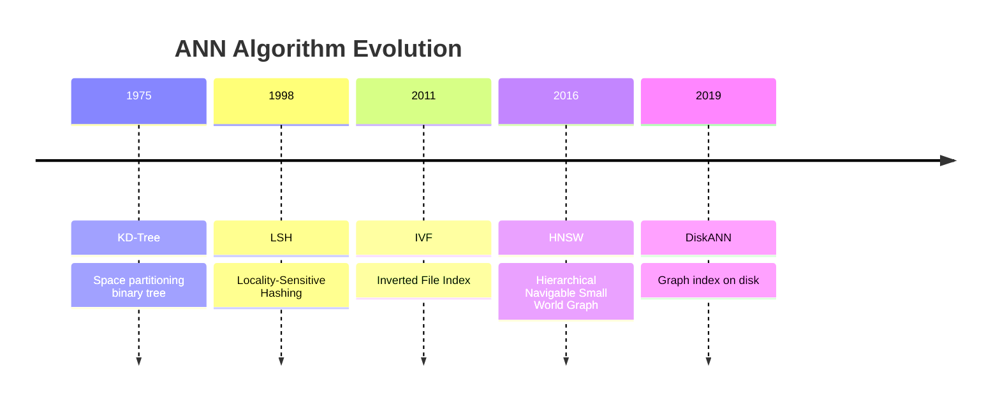
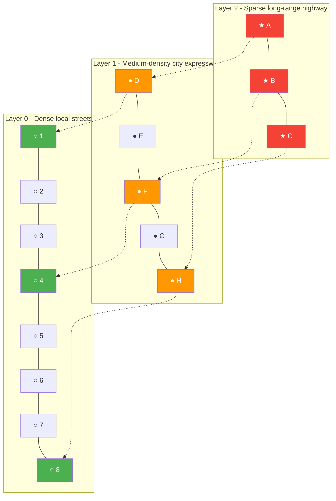
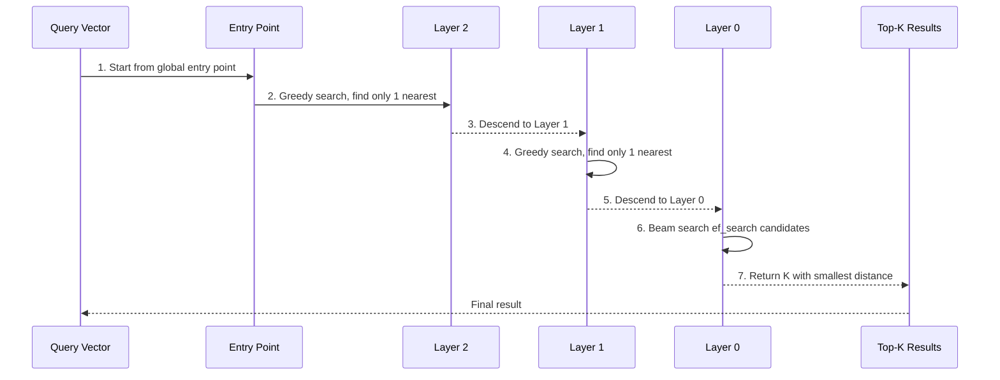

# Chapter 3: HNSW — Hierarchical Navigable Small World Graphs and Approximate Nearest Neighbor Search

> "A lecture for computer science students on vector indexing: from the dilemma of brute force search, to the mathematical beauty of small world networks, to how HNSW brings the skip list idea into graph structures to achieve logarithmic-level search."

## Prerequisites

> 📎 **Reference**: [Vector Distance Metrics](../prerequisites/05_向量距离度量.md) — L2, Inner Product, Cosine: formulas, properties, and when to use each
> 📎 **Reference**: [SIMD & Hardware Optimization](../prerequisites/06_SIMD与硬件优化.md) — Memory wall, CPU registers, and why memory bandwidth is the real bottleneck in vector search

---

## Learning Objectives

- Understand the essence of the **Nearest Neighbor Search (NNS)** problem, and why **Brute Force** search is infeasible on large-scale data
- Master the **Curse of Dimensionality**: why tree structures based on space partitioning fail in high-dimensional spaces
- Understand the evolution of ANN algorithms over the past 50 years: from KD-Tree (1975) → LSH (1998) → IVF (2011) → HNSW (2016) → DiskANN (2019), understanding what problems each generation solved and what problems remained
- Deeply understand the core idea of **Graph Index**: replacing "space partitioning" with "friendship connections"
- Master **Small World Network** theory and its relationship with **Six Degrees of Separation**
- Understand the construction principle of **Navigable Small World (NSW)** graphs
- Master HNSW's multi-layer structure — how it borrows from **Skip List** to achieve logarithmic-level navigation
- Understand the intuitive meaning of greedy search, beam search, and ef parameters
- Learn to tune HNSW's three key hyperparameters (M, ef_construction, ef_search)
- Implement a single-layer NSW index and compute recall rate

---

## 3.1 The Fundamental Problem: How to Find the Most Similar Vector Among a Billion Vectors?

### 3.1.1 What is Nearest Neighbor Search?
**Nearest Neighbor Search (NNS)** is a fundamental operation in computer science. Defined in one sentence: given a **query** (the target vector you want to search for) and a **database** (a collection of stored vectors), find the k vectors in the database most similar to the query.
The definition of "similarity" is determined by the **distance metric** introduced in the previous chapter:
- **L2 Distance** (Euclidean distance): the straight-line distance between two vectors in Euclidean space; smaller values mean more similar
- **Inner Product**: the dot product of two vectors; larger values mean more similar
- **Cosine Distance**: the supplementary angle of the angle between two vectors; smaller values mean more similar

This seemingly simple operation is the core module of the following systems:

| Application Scenario | Query | Database | Meaning of "Similarity" |
|---|---|---|---|
| Image Search (Google Photos) | The embedding vector of a dog photo you took | Embedding vectors of all your photos | Visually similar dog photos |
| Recommendation System (TikTok For You) | The embedding vector of a video you recently interacted with | Vectors of all candidate videos | Content you might like |
| RAG (ChatGPT Retrieval-Augmented Generation) | Embedding vector of user question | Embedding vectors of knowledge base documents | Semantically most relevant documents |
| Bioinformatics | Drug molecule fingerprint vectors | Known drug database | Structurally similar molecules |
| Audio Fingerprinting | MFCC feature vectors of song segments | Copyright database | Whether this song matches a song in the copyright database |

**Embedding Vector**: mapping real-world objects (images, text, molecules, music) into fixed-length numerical vectors through neural networks or traditional feature extraction methods. For example, an image can be represented by a 768-dimensional vector, where each dimension encodes some abstract feature of the image.
All these applications reduce to the same mathematical problem: among N D-dimensional vectors, find the k vectors with the smallest distance to the query vector. This is Nearest Neighbor Search (NNS).

### 3.1.2 Why Can't You Just Compare One by One? The Dilemma of Brute Force Search

**Brute Force** search is the most straightforward solution: compute the distance between the query vector and every vector in the database, then take the smallest k. It is 100% accurate — because you checked every candidate.
But the problem lies in computational complexity:
```
Computational cost of brute force search: O(N × D + N × log k)

Where:
  N = total number of vectors in the database (e.g., 10,000,000 = 10 million)
  D = dimensionality of vectors (e.g., 768, the commonly used embedding dimension for GPT series models)
  k = number of most similar entries to return (e.g., 10, i.e., Top-10 results)
```

Let's plug in concrete numbers to feel this computational load:
- N = 10,000,000 (10 million), D = 768
- Each search requires: 10,000,000 × 768 ≈ 7,680,000,000 (7.68 billion) floating-point multiplications, and the same number of additions
- Total: approximately **15 billion floating-point operations (FLOPs)**
- On a single CPU core, assuming AVX2 instruction set acceleration, approximately ~24 GFLOPS (24 billion floating-point operations per second) can be executed per second
- One search takes: 7.68B ÷ 24G ≈ **640 milliseconds**
- **Only about 10 queries can be processed per second**

This is completely unacceptable for applications that need to serve thousands of concurrent users simultaneously (such as search engines and recommendation systems). And this is only at the 10 million scale. GPT-4's knowledge base may have billions of embedding vectors. Facebook has billions of newly uploaded photos every day that need deduplication. Brute force search is not only slow in these scenarios — it is economically infeasible (requiring thousands of CPU cores).
**Conclusion**: We need a method that can find "good enough" approximate results with high probability without checking all vectors.

### 3.1.3 Approximate Nearest Neighbor: Trading a Little Accuracy for Orders of Magnitude Speed Improvement

**Approximate Nearest Neighbor (ANN)** search has the core idea that: *we don't need to find the strict nearest neighbor (the vector with the absolutely smallest distance), we only need to find "good enough" results — the k nearest don't necessarily have to be ranked 1st; being ranked 2nd or 3rd is also acceptable.*

To use an analogy: you want to find the nearest Starbucks coffee shop to your current location. The brute force approach is to take out the city map and measure the straight-line distance to every Starbucks one by one. The ANN approach is: first roughly determine which district you're in (e.g., Chaoyang District), then only search in that district and adjacent districts — saving 95% of the distance calculations. You might miss a Starbucks in a corner near the district boundary (because the straight-line distance is close but the actual path is circuitous), but in 99% of cases you can give the correct result.
ANN systems need to balance four metrics:

| Metric | Meaning | Optimization Direction |
|---|---|---|
| **Accuracy/Recall** | The proportion of true Top-k results found out of the brute force results | Higher is better |
| **Query Throughput** (QPS, Queries Per Second) | Number of queries processed per second | Higher is better |
| **Memory Usage** | Memory size occupied by the index | Smaller is better |
| **Build Time** | Time needed to build the index | Shorter is better |

**Pareto Frontier**: These four metrics cannot be simultaneously optimized. If you increase recall, speed drops; if you reduce memory, recall may decrease. HNSW's cleverness lies in achieving the best known trade-off as of 2024 between recall and query throughput — maintaining millisecond-level latency even at above 95% recall.

---

## 3.2 Curse of Dimensionality: Why KD-Tree Fails in High-Dimensional Space

### 3.2.1 KD-Tree and the Space Partitioning Approach

**KD-Tree** (K-Dimensional Tree, proposed by Bentley in 1975) is a data structure for fast nearest neighbor search in K-dimensional space. Its core idea is **space partitioning**: find the median of the data along each dimension, splitting the space in two to form a binary tree.
During search, the algorithm walks down the tree to a leaf node, then **backtracks** to check whether it needs to cross the split plane — if the other side of the split plane might contain closer points, it must go back to search. In low-dimensional space (e.g., D=2 or D=3), backtracking rarely happens, and search efficiency is O(log N).
But when dimensions increase, the situation deteriorates dramatically. This is the **Curse of Dimensionality** — a concept proposed by Richard Bellman in 1957, describing various counterintuitive mathematical properties of high-dimensional spaces.

### 3.2.2 Intuitive Understanding of the Curse of Dimensionality
**Intuitive Understanding**: In 2D space, if you divide the space into 4 quadrants, each quadrant contains approximately 25% of the data points. But in 768D space, if you cut along each dimension, you get 2^768 "hyper-quadrants" — this number far exceeds the total number of atoms in the universe (approximately 10^80). Mapping 768 data points to this space, at most one point per hyper-quadrant — most regions are completely empty.
**Mathematical Statement**: A key high-dimensional phenomenon — in a uniformly distributed D-dimensional space, the ratio of the nearest distance to the farthest distance between two random points approaches 1 (as D → ∞). In other words, *all points in high-dimensional space are approximately equidistant — the distinction between "near" and "far" disappears.*

```
Empirical verification with code (Python pseudocode):

for D in [2, 10, 50, 200, 768]:
    Generate 1000 D-dimensional random points
    Calculate distances of all points to the origin
    Print the ratio of (minimum distance / maximum distance)

Output:
  D=2:   0.02    (some near, some far, clear distinction)
  D=10:  0.31
  D=50:  0.72
  D=200: 0.91    (almost all points are on a thin shell)
  D=768: 0.97    (distances are almost identical — the most extreme manifestation of the "curse of dimensionality")
```

### 3.2.3 What Does This Mean for KD-Tree?

This is fatal for KD-Tree. KD-Tree search requires backtracking to check "whether there are closer points on the other side of the split plane." In low-dimensional space, this backtracking rarely happens — because the distribution of points on both sides of the split plane is uneven, one side is clearly closer to the query. But in high-dimensional space, the distance from each point to the split plane is approximately the same (due to the curse of dimensionality), and the algorithm degrades to traversing the entire tree — which is O(N), essentially no different from brute force search.
> **Conclusion**: Any method that relies on "partitioning space along a dimension" (KD-Tree, VP-Tree, Ball-Tree, R*-Tree) will fail in high dimensions. This is why modern vector databases almost all use **graph-based** indices — graphs don't partition space; they directly establish connections between nodes.

---

## 3.3 Evolution of ANN Algorithms: Each Generation Solves the Previous Generation's Problems

ANN was not invented overnight. It has undergone nearly 50 years of evolution, with each generation solving the previous generation's core problems while introducing new trade-offs.

### ANN Algorithm Evolution Timeline



| Era | Algorithm | Core Idea | Advantage | Fatal Problem |
|---|---|---|---|---|
| 1975 | **KD-Tree** (Bentley) | Find the median along each dimension to partition space, forming a binary tree. During search, walk to a leaf, backtrack to check if you need to cross the split plane. | O(log N) search (in low dimensions), clear approach | After dimensions > 20, performance collapses to nearly O(N) (curse of dimensionality) |
| 1998 | **LSH** (Locality-Sensitive Hashing, Indyk & Motwani) | Design a family of hash functions so that similar vectors have a higher probability of being hashed into the same bucket. During search, only check vectors in the same bucket. | Theoretical guarantee: with probability 1-δ find neighbors within distance (1+ε) | Requires a large number of hash tables (hundreds) to achieve high recall, enormous memory overhead |
| 2011 | **IVF** (Inverted File, Jégou et al.) | First use K-means to cluster vectors into C clusters. Search only performs brute force lookup within the P clusters closest to the query. | Search volume reduced from N to N × P/C, simple and effective | Cluster boundary problem: when query falls on the boundary between two clusters, the nearest neighbor may be outside the search range |
| 2016 | **HNSW** (Hierarchical Navigable Small World, Malkov & Yashunin) | Multi-layer small world graph: upper layers sparse for fast navigation, lower layers dense for precise positioning. | Search speed ≈ O(log N), recall > 0.95, build speed acceptable | Memory overhead O(N × M), incremental deletion difficult |
| 2019 | **DiskANN** (Microsoft, Subramanya et al.) | Store HNSW's graph on SSD (rather than memory), combined with quantization and product quantization to compress vectors. | Effective for billion-level data, SSD cost is far lower than RAM | Latency increases (SSD seek time, approximately 100 µs vs RAM's 100 ns) |
| 2022+ | **SPANN / Hybrid Approaches** | Combination of coarse-grained clustering (like IVF) and fine-grained graph index (like HNSW) | Combines the advantages of both methods | Increased system complexity |

Core insights of each generation:
- **KD-Tree**'s insight: space can be recursively partitioned
- **LSH**'s insight: by designing good hash functions, similarity can be "probabilistically preserved"
- **IVF**'s insight: clustering can dramatically reduce search range, but boundary handling is critical
- **HNSW**'s insight: **Graph structures** are naturally suited for high-dimensional space navigation, and hierarchicalization can achieve logarithmic-level complexity
- **DiskANN**'s insight: memory is the bottleneck, SSD sequential read speed is sufficient to support graph traversal

---

## 3.4 Graph Index: Let Vectors Connect Through "Friendship"

### 3.4.1 What is a Graph?

In **Graph Theory**, a **Graph** consists of two sets:
- **Vertex / Node**: the basic element in the graph
- **Edge**: a line connecting two nodes

In the vector search scenario:
- **Node** = a vector (i.e., an embedding vector, corresponding to one record in the database)
- **Edge** = the relationship that "these two nodes are among each other's nearest neighbors." If there is an edge connecting nodes A and B, it means that starting from A and following neighbor relationships, you can quickly reach B without checking all nodes.

The search algorithm's workflow becomes: starting from some initial node, walk along neighbors in the graph, each time moving toward the node closer to the query, until no closer neighbor can be found. If the graph is well-designed, the search path only needs to visit tens to hundreds of nodes, rather than all N nodes.

### 3.4.2 Small World Networks and "Six Degrees of Separation"

**Small World Network** is a phenomenon discovered by sociologist Stanley Milgram in his famous 1967 experiment. Milgram asked ordinary people in the American Midwest to pass a letter through acquaintances to a specific target person in Boston. The result: only about **22% of letters** were successfully delivered, and those that arrived required an average of **4.4 intermediaries** — this is the famous **Six Degrees of Separation** theory: any two people in the world are connected through approximately six intermediaries on average.

After studying the Milgram experiment and subsequent extensive social network analysis, people found that small world networks have two key properties:

1. **High Clustering Coefficient**: your friends are likely also friends with each other. If you know A and B, the probability that A also knows B is high. This ensures that connections in local regions are dense and reliable — you and your neighbors form a tight "social circle."
2. **Short Average Path Length**: any two nodes need very few hops — because some "super-connectors" (people who know many people, and whose friend circles span diverse groups) serve as long-distance bridges. These bridges are called **long-range edges**, connecting regions of the network that are far apart.

> **Analogy for vector search**: A well-designed search graph needs both properties simultaneously — locally dense enough (to ensure finding exact matches), while having "shortcuts" for search to quickly jump to distant but related regions in the space. Local density = high clustering coefficient, long-range shortcuts = short path length.

### 3.4.3 Navigable Small World (NSW): Basic Graph Construction
**NSW** (Navigable Small World) is the predecessor of HNSW, proposed by Malkov et al. in 2014. It solved a practical problem of small world networks: although theoretically the average path is short, there was no efficient method to "navigate" — i.e., starting from a node, efficiently walk toward the target along neighbor relationships. NSW's core contribution is designing a graph construction method that enables greedy search to navigate efficiently on the graph.

**NSW Insertion Algorithm**:
```
INSERT(nsw, new_node, M):
  1. If the graph is empty: new_node becomes the sole node (entry point), return
  2. Start from any existing node, perform greedy search (see 3.4.4),
     find the efConstruction candidate nodes closest to new_node
     (efConstruction is a preset parameter, controlling search width —
      larger means more precise search, but slower)

  3. From the candidates, select the M closest as neighbors
  4. Establish bidirectional connections between new_node and these M neighbors
     (i.e., both A→B and B→A exist simultaneously)
  5. For each neighbor: if its neighbor count reaches M_max (typically 2×M),
     do not prune (keep the connection, even if it exceeds the limit)
     (M_max is a hard upper limit, preventing any node from becoming a "super-connector")
```

This seemingly simple strategy of "connecting to the nearest M neighbors during insertion" naturally produces small world properties:
- Because each new node connects to existing nearby nodes, the graph becomes highly clustered — local connections are dense
- Due to the randomness of insertion order, early-inserted nodes span a wide spatial range, serving as "bridges" for long jumps — path length is short

### 3.4.4 Greedy Search: The Always-Go-Downhill Strategy

**Greedy Search** is a fundamental operation in graph search. Its intuition is very simple: you are in a mountainous terrain and want to reach the lowest point of the valley. Each time you only observe the surrounding neighbors, then take one step in the direction of the lowest elevation.

```
Pseudocode for Greedy Search:

GREEDY_SEARCH(query, entry_point, k):
  current_node ← entry_point        # Start from the entry point
  while true:
    check all neighbors of current_node     # Look at surrounding nodes
    nearest_neighbor ← the node among neighbors closest to query  # Pick the nearest

    if nearest_neighbor is the current node itself:
      break                     # Already reached the local optimum — cannot get any closer
    current_node ← nearest_neighbor         # Move toward the nearest neighbor

  return current_node               # Return the current best node
```

This algorithm can always find the closest point to the query in the local region. But it has a fatal weakness: **local minimum**. Like when walking downhill, you might get stuck in a small hollow rather than the lowest valley bottom — all your neighbors are farther from the target than your current position, but the global optimum is actually in another valley.

**Solution: Expand the search width** — instead of only following the single "best" node, maintain a **candidate set** and explore multiple paths simultaneously. This is the **Beam Search** concept: maintain W "most promising" candidate nodes, explore neighbors from each of the W nodes, select the best W to continue. The larger the parameter W, the less likely to fall into local minima, but the slower the search.

---

## 3.5 HNSW's Core Innovation: Multi-Layer Structure and Skip Lists

### 3.5.1 Why Layer?
A plain NSW graph starting from an arbitrary entry point may require many steps for greedy search to reach the target area — because although the graph's average path length is short, for million-scale data it may still require tens or even hundreds of steps. Each step computes distances for M neighbors, and the cumulative cost is still not fast enough.

**HNSW** (Hierarchical Navigable Small World) is the core algorithm proposed by Malkov & Yashunin in their 2016 paper. Its key innovation is introducing **hierarchical layers**, inspired by the **Skip List** (proposed by William Pugh in 1989).

**What is a Skip List?** A Skip List is a multi-layer index structure built on an ordered linked list. The bottom layer is a complete ordered linked list; each layer up keeps only a subset of nodes as copies (i.e., "express lanes"). During search, start from the highest layer, and when encountering a node larger than the target, descend to the next layer, eventually finding the precise position at the bottom layer. The Skip List optimizes the ordered linked list's O(N) search to O(log N).

**HNSW's Core Insight**: transplanting the Skip List's idea from "linked lists" to "graphs." A normal Skip List's "express lanes" are linear (unidirectional pointers), while HNSW's "express lanes" are graph structures (bidirectional edges), thus enabling navigation in arbitrary-dimensional space.

### 3.5.2 "Highway" Analogy: Understanding HNSW's Layers
Imagine a city's transportation system:

```
HNSW Layer "Highway" Analogy:

Layer 3:  ★──────────────────────────────────          ← Cross-state highway (long-distance direct)
Layer 2:  ★────★────────★────★──────────────          ← Highway (cross-city)
Layer 1:  ★─★─★──★─★─★─★─★──★─★─★─★─★──★          ← City-level road (cross-district)
Layer 0:  ★★★★★★★★★★★★★★★★★★★★★★★★★★           ← Local roads (streets and alleys)
          ← dense local connections →          ← long-range shortcuts →
```

- **Layer 0** (local roads): contains all N nodes, densely connected — for final precise comparison. Like finding a store in your neighborhood, you need to check each street and alley.
- **Layer 1** (city-level road): contains only a subset of nodes (approximately 25%), with longer connections — for quickly jumping from one area to another. Like driving from Chaoyang District to Haidian District, taking the Fourth Ring Road is much faster than taking small alleys.
- **Layer 2** (highway): even fewer nodes (approximately 6%), with connections spanning larger ranges — for cross-city navigation.
- **Layer 3** (cross-state highway): very few nodes, connections spanning the entire map — for the coarsest-grained navigation.

Search starts from the **highest layer**'s entry point and descends layer by layer. At high layers, only coarse-grained positioning is done ("approximately which area"); at low layers, fine-grained search is performed ("exactly which location").

### HNSW Multi-Layer Structure Diagram



### 3.5.3 Layer Assignment Formula: Why Exponential Decay?
Each newly inserted node is randomly assigned a **maximum layer** l, with the formula:

$$l = \lfloor -\ln(\text{uniform}(0, 1)) \cdot m_L \rfloor$$

Where:
- $\text{uniform}(0, 1)$ is a random number uniformly distributed in the (0, 1) interval
- $\ln$ is the natural logarithm
- $m_L = 1 / \ln(M)$, where M is the number of connections per node (see the definition of parameter M below)
- $\lfloor x \rfloor$ is the **floor function** (rounding down to the nearest integer)

**Why does this formula produce exponential decay?** Because $-\ln(U)$ generates random numbers following an **Exponential Distribution** — most values are concentrated near 0, but occasionally there are large values. $m_L$ is a scaling factor that controls the decay rate of the distribution.

**Intuitive Analysis**:
- Most nodes are assigned to Layer 0 (because $-\ln(U)$ is usually very small, and after multiplying by $m_L$, it rounds down to 0)
- A few nodes are assigned to Layer 1
- Very few nodes are assigned to Layer 2 or higher

```
Layer Distribution (M = 16, m_L = 1/ln(16) ≈ 0.3607):

P(level ≥ 0) = 1.0             ← 100%     of nodes are in layer 0
P(level ≥ 1) = 1/M = 1/16     ← 6.25%    of nodes are in layer 1
P(level ≥ 2) = 1/M² = 1/256   ← 0.39%    of nodes are in layer 2
P(level ≥ 3) = 1/M³ = 1/4096  ← 0.024%   of nodes are in layer 3
P(level ≥ 4) = 1/M⁴           ← 0.0015%  of nodes are in layer 4

For 1 million vectors (M=16):
  Layer 0: 1,000,000 nodes (all nodes are here)
  Layer 1:    62,500 nodes (1 out of every 16 nodes)
  Layer 2:     3,906 nodes
  Layer 3:       244 nodes (long-distance flight "hubs")
  Layer 4:        15 nodes
  Layer 5:         1 node (if this is it, it is the global entry point)
```

**Why $m_L = 1/\ln(M)$?** This specific value ensures that the relative proportion of nodes at layer ≥ 1 is exactly 1/M — neither too high nor too low. If $m_L$ is larger (layers decay slowly), there will be too many nodes at high layers, and search lingers too long at each layer. If smaller, there are too few high-layer nodes, and jumping ability is insufficient. This value is the optimal scaling factor derived in the HNSW paper.

---

## 3.6 Complete HNSW Search and Insertion Algorithms

### 3.6.1 Search Algorithm: From Highway to Street

HNSW's search process is like driving to a destination: first take the highway to the general area, then take city roads to the neighborhood, and finally take small alleys to the door number.

```
SEARCH(hnsw, query, k, ef_search):

  Input:
    hnsw     = constructed HNSW index
    query    = query vector
    k        = number of results to return
    ef_search = search precision control parameter (see explanation below)
  Output:
    k vectors closest to query
  Process:
  Step 1: Get global entry point
    ep ← hnsw.entry_point
    (The entry point is the highest-layer node determined during index construction.
     It has representation rights at the highest layer and is the first step
     for entering the graph from outside.)

  Step 2: Descend from the highest layer to layer 1 — find only 1 nearest node per layer
    for level = hnsw.max_level down to 1:
      ep ← GREEDY_SEARCH_ONE(query, ep, level)
      (Execute greedy search at each high layer, but only keep 1 best node.
       Because high-layer nodes are very few, 1 is sufficient to locate the general area.)

  Step 3: Fine-grained search at Layer 0 — find ef_search candidates
    results ← SEARCH_LAYER(query, ep, ef_search, layer=0)
    (Layer 0 contains all nodes, requiring a wider search width.
     ef_search is the number of candidates maintained simultaneously —
     larger means more precise, but slower.)

  Step 4: Return top-k
    return the k nodes with smallest distances from results
```

**What is ef_search?**

**ef** (extension factor) is a key parameter in HNSW that controls the width and precision of search.
- **ef_search**: at the Layer 0 fine-grained search phase, the size of the candidate set maintained simultaneously (there are ef_search nodes in the candidate set)
- ef_search must be ≥ k (otherwise you can't even gather k results)
- Increasing ef_search captures more candidates, improving recall, at the cost of linear increase in search time

**Intuitive understanding of ef_search**: Imagine you're looking for a book in a library. ef_search=1 means you only look at the nearest book on the current shelf; ef_search=10 means you simultaneously examine 10 books on the current shelf, then decide which shelf to go to next. The larger ef_search, the less likely you miss the target, but the slower you move.

### HNSW Search Process Sequence Diagram



### 3.6.2 Detailed Implementation of SEARCH_LAYER
This is the core function of HNSW search — a beam search with extension factor. It maintains two data structures:
1. **Candidate Set** (min-heap): stores nodes "to be explored", sorted by distance to query — nearest at the top
2. **Result Set** (max-heap): stores "best nodes found so far", maintaining ef nodes — farthest at the top

```
SEARCH_LAYER(query, entry_point, ef, layer):

  candidates.push(entry_point)      # min-heap: nearest at top
  results.push(entry_point)         # max-heap: farthest at top
  visited_set.add(entry_point)

  while candidates is not empty:
    current_node ← candidates.pop()    # get the nearest unexplored node
    farthest_result ← results.top()    # the farthest among current results

    if distance(current_node, query) > distance(farthest_result, query):
      break                    # ★ Key termination condition:
                               # If the nearest unexplored node is farther
                               # than the "ef-th nearest result",
                               # remaining candidates can only be farther — stop early

    for each neighbor n of current_node (on the current layer):
      if n has not been visited:
        visited_set.add(n)
        dist ← distance(query, n)

        if results.size() < ef OR dist < results.top().dist:
          candidates.push(n)       # n is eligible to become a candidate
          results.push(n)          # n is eligible to enter results
          if results.size() > ef:
            results.pop()          # maintain only ef results

  return the first k nodes in results set (sorted by distance)
```

**Intuition of termination condition**: If even the nearest unexplored node in the candidate set is farther than the "ef-th nearest node" I've already found, the remaining candidates can only be farther (because the candidate set is sorted by distance). Early stopping saves significant computation without losing precision.

### 3.6.3 Insertion Algorithm: How Does a New Node Join the Graph?

Inserting a new node has three phases: layer assignment, descent positioning, and connection establishment.

```
INSERT(hnsw, new_node, M, M_max, ef_construction, m_L):

  Step 1: Random layer assignment
    l ← floor(-ln(uniform(0,1)) × m_L)
    (Most of the time l=0, occasionally l=1, very rarely l≥2)
  Step 2: Handle the special case of the first node
    if graph is empty:
      hnsw.entry_point ← new_node
      hnsw.max_level ← l
      return

  Step 3: Descent phase — descend from the highest layer to the new node's layer
    ep ← hnsw.entry_point    # Start from the global highest layer entry

    for level = hnsw.max_level down to l+1:
      ep ← GREEDY_SEARCH_ONE(new_node, ep, level)
      # At each high layer, find only 1 node closest to new_node
      # Purpose: precisely locate the region where new_node should be
      # (High layers have few nodes, only 1 is needed for positioning)

  Step 4: Connection establishment phase
    for level = min(l, hnsw.max_level) down to 0:
      # Search for the nearest ef_construction candidates at the current layer
      candidate_nodes ← SEARCH_LAYER(new_node, ep, ef_construction, level)

      # Select M from candidates (using SelectNeighbors heuristic)
      selected ← SELECT_NEIGHBORS(new_node, candidate_nodes, M)

      # Establish bidirectional connections between new_node and selected neighbors
      for each connected neighbor n:
        new_node ↔ n establish bidirectional edge (at this level)

      # If a neighbor's degree exceeds M_max, prune its connections
      for each connected neighbor n:
        if n has connections > M_max at this level:
          prune n's connections (keep the M_max closest)

      # Update entry point for the next layer's search
      ep ← best node among candidate nodes

  Step 5: Update global layer information
    if l > hnsw.max_level:
      hnsw.max_level ← l
      hnsw.entry_point ← new_node
      (If the new node's layer is higher than the current highest layer,
       it becomes the new global entry point)
```

**Why is random layer assignment effective?**

This is one of HNSW's most elegant designs. Random layer assignment ensures:
1. **Statistical Uniformity**: every node has a chance to become a high-layer "hub", but the probability is very small (1/M per level), which prevents any single node from bearing too much navigation responsibility.
2. **Natural Layer Formation**: high-layer nodes are few but have long connections (spanning large areas), while bottom-layer nodes are many but have short connections (local), naturally producing a "highway → local road" layer structure.
3. **Logarithmic Height**: the expected height of the highest layer is $\log_M(N)$ (because each layer's node count decays by 1/M), ensuring the search has O(log N) layers.

### 3.6.4 SelectNeighbors Heuristic: Avoiding Redundant Edges
If you simply connect to the nearest M neighbors, many **redundant edges** are introduced. Redundant edges mean there are many unnecessary connections in the graph, increasing memory overhead without helping search quality.

For example: node A is at distance 0.1 from node B and distance 0.9 from node C, but B and C are at distance 0.85. Here, the A→C connection is redundant — search can reach C through A→B→C, and each step on the A→B→C path doesn't exceed the distance of A→C.

```
SELECT_NEIGHBORS(query, candidates, M):

  Input:
    query      = reference vector for determining direction
    candidates = list of candidate nodes sorted by distance (closest first)
    M          = number of neighbors to select
  Output:
    M selected neighbors (covering different directions around query as much as possible)

  Process:
  R ← []                    # Result: selected neighbors
  Discard ← []              # Discarded candidates
  for c in candidates (sorted by distance to query, closest first):
    should_keep ← true
    for r in R:
      if distance(c, r) < distance(c, query):
        # c is closer to some already-selected neighbor r than to query
        # → r has already "represented" the space around c
        # → no need to keep the connection between c and r simultaneously
        should_keep ← false
        break
    if should_keep:
      R.add(c)
      if len(R) == M:
        break
    else:
      Discard.add(c)

  # If R has fewer than M, supplement from Discard
  # (Relax pruning criteria, ensure gathering M nodes)
  for d in Discard (sorted by distance):
    if len(R) >= M: break
    R.add(d)

  return R
```

**Core intuition of this heuristic**: selected neighbors should be "in different directions of query" — they collectively cover the space around query, each covering one "sector", minimizing overlap between them. This is similar to selecting gas stations on a map: you wouldn't pick 5 gas stations at the same intersection, but rather pick one in each different direction, ensuring coverage of all possible routes.

---

## 3.7 Three Key Hyperparameters: M, ef_construction, ef_search

### 3.7.1 M — Number of Connections Each Node Maintains per Layer
**M** (sometimes written as `M` or `num_neighbors`): the maximum number of neighbors each node maintains at each layer. It directly determines the graph's **degree** (the average number of connections per node).

**Analogy**: M is like "how many friends each person has on average" in a social network.

| M Value | Graph Characteristics | Applicable Scenarios |
|---|---|---|
| M = 4 | Sparse graph, less memory, fast construction. But many search hops (because paths are not straight), recall may not be high enough | Embedded scenarios with extremely limited memory |
| **M = 16** | The optimal "degree" balance point: moderate memory, short search paths, high recall. This is the default value recommended by the HNSW paper and mainstream implementations | **Recommended value for most scenarios** |
| M = 64 | Dense graph, large memory (memory proportional to M), slow construction. Shortest search paths, highest recall, but diminishing marginal returns | Offline scenarios requiring extremely high recall |

**Rule of thumb**: each doubling of M improves recall by approximately 2-5%, but increases memory by ~100% (because each node has more neighbors to store). Recommended range: 4-64.

**M_max** is typically 2 × M (some implementations use M or 1.5 × M). It is a "hard upper limit" on each node's neighbor count, preventing some nodes from becoming connection hubs and growing excessively. If a node's neighbor count reaches M_max, insertion will prune its excess connections — keeping only the M_max closest.

### 3.7.2 ef_construction — Search Width During Construction

**ef_construction** (also written as `efC`): the ef value used by SEARCH_LAYER when inserting each new node. It controls search precision during graph construction — each time a new node is inserted, the algorithm searches for how many candidates in the graph to decide which neighbors to connect.

| ef_construction Value | Effect |
|---|---|
| ef_c = 100 | Fast construction — each node only does a "shallow" search. But graph quality may be insufficient — nodes connected to "locally suboptimal" neighbors |
| **ef_c = 200** | **Optimal balance point for most scenarios.** Build time is acceptable, graph quality sufficient to support high recall |
| ef_c = 500 | Slow construction — each insertion explores more candidates. Graph quality approaches optimal. But marginal returns diminish rapidly after ef_c > 300 |

**Key Relationship**: ef_search can be increased at query time (compensating for failing to find optimal neighbors during construction), but **the ceiling of recall is determined by ef_construction**. If you only explored 100 candidates during construction, searching 1000 at query time still cannot find connections that were never established during construction. Therefore, ef_construction is the "budget" for graph quality.

### 3.7.3 ef_search — Search Width at Query Time

**ef_search**: the ef value used during the search phase (in SEARCH_LAYER). It controls the precision-speed trade-off at query time.

| ef_search Value | Effect |
|---|---|
| ef_search = k | Fastest, lowest recall — only finds just k candidates, easily falls into local minimum |
| **ef_search = 2×k** | **Common default value, recall typically > 95%** |
| ef_search = 10×k | High recall (> 99%), speed begins to noticeably decrease |
| ef_search = 50×k or above | Approaches brute force search recall, but speed also approaches brute force search |

**Constraint**: ef_search ≥ k (otherwise you can't even find k results). ef_search can be greater than ef_construction (search explores more, construction explores less).

### 3.7.4 Tuning Workflow
```
Step 1: Start with default values: M=16, ef_c=200, ef_s=50
Step 2: Sweep ef_s: [k, 2k, 5k, 10k, 20k, 50k]
        Measure recall@k and QPS each time
Step 3: Plot recall–QPS curve (typically logarithmic curve shape)
Step 4: Find the recall threshold required by the business (e.g., 99%)
        Choose the fastest ef_s that meets the threshold
Step 5: If default M and ef_c can't reach the target:
        → Increase M and ef_c, rebuild the index, repeat steps 2-4
```

**Real-world data reference** (sift-128-euclidean dataset, 1 million vectors, M=16):
```
ef_search=10:  recall@10=87%,   QPS=12,000
ef_search=40:  recall@10=97%,   QPS=5,000
ef_search=100: recall@10=99%,   QPS=2,200
ef_search=400: recall@10=99.7%, QPS=600
```

You can see that the tiny improvement in recall from 97% to 99.7% (2.7 percentage points) corresponds to an 8× drop in QPS — this is the typical "precision-speed Pareto frontier." In production environments, you need to find a balance point between recall and latency that the business can accept.

---

## 3.8 Complexity Analysis

| Operation | Theoretical Complexity | Actual Observation (1M vectors, D=768) |
|---|---|---|
| Build | O(N × log N × M × ef_construction) | Approximately 5-15 minutes (single-threaded) |
| Search | O(log N × M × ef_search) | Approximately 0.1-1 ms (depending on ef_search) |
| Memory | O(N × M × (D × 4 + 16) bytes) | Approximately 4-8 GB |

### Why is Search O(log N)?
In a hierarchical small world graph, search complexity is jointly determined by three factors:

1. **High-layer descent**: descending from the highest layer to Layer 1, a total of approximately $\log_M(N)$ layers (because the highest layer's expected height is $\log_M(N)$). Each layer only needs O(1) steps (because high-layer nodes are sparse with large jump spans), totaling O(log N) steps.
2. **Layer 0 search**: local search at the bottom layer, with steps proportional to the graph's diameter. But the NSW graph's diameter is empirically approximately O(log N) — because the small world property ensures the existence of short paths.
3. **Neighbor checking per step**: each node's degree is approximately M, i.e., O(M). Checking one neighbor requires O(D) distance computation.

Combined: O(log N × M × D), with the ef_search factor coming from the overhead of maintaining the candidate set at each step.

---

## 3.9 Malkov & Yashunin (2016) Paper Background

HNSW's original paper is **"Efficient and robust approximate nearest neighbor search using Hierarchical Navigable Small World graphs"**, published by Yu A. Malkov and D. A. Yashunin in 2016 (arXiv:1603.09320, later published in IEEE TPAMI 2018).

**Paper's Core Contributions**:
1. First proposed the multi-layer index structure combining skip list ideas with small world graphs
2. Proved theoretically that the search complexity of this structure is O(log N) (empirically validated)
3. Demonstrated state-of-the-art recall-speed trade-offs on multiple benchmark datasets (SIFT, GIST, GloVe, etc.)
4. Proposed the SelectNeighbors heuristic, effectively reducing redundant edges

**Paper's Key Insights**:
- The problem with plain NSW is "navigation difficulty" — although average paths are short, starting from an arbitrary point may require many steps to reach the target area
- After introducing the hierarchical structure, high layers provide "highways", enabling search to quickly jump to near the target area
- Layer assignment uses exponential distribution decay, ensuring the layer structure is self-adaptive — naturally producing more layers when data volume is large

**Impact on Subsequent Work**:
- Faiss (Facebook), Milvus, Weaviate, Qdrant and other mainstream vector databases all implemented HNSW
- HNSW became the most widely used ANN index algorithm in 2024
- Subsequent research focused on: memory optimization (such as HNSW+quantization), disk storage (DiskANN), dynamic updates, parallelization, and other directions

---

## 3.10 Hands-on Implementation: Single-Layer NSW Index

Implement a pure-memory single-layer NSW index in `ch03_hnsw_theory/code/nsw.cpp`:

```cpp
#include <vector>
#include <queue>
#include <unordered_set>
#include <cmath>
#include <iostream>
#include <random>
#include <algorithm>

struct Node {
    int id;
    std::vector<float> vec;
    std::vector<int> neighbors;
};

class NSWIndex {
public:
    int M;           // Maximum number of connections per node
    int M_max;       // Hard upper limit on connections per node (typically 2×M)
    int ef_search;   // Candidate set size maintained during search phase
    int dim;         // Vector dimensionality
    std::vector<Node> nodes;
    int entry_point = -1;

    NSWIndex(int M_, int M_max_, int ef_s, int dim_)
        : M(M_), M_max(M_max_), ef_search(ef_s), dim(dim_) {}

    float l2_distance(const float* a, const float* b) const {
        float sum = 0.0f;
        for (int i = 0; i < dim; i++) {
            float d = a[i] - b[i];
            sum += d * d;
        }
        return std::sqrt(sum);
    }

    // Beam search: returns the ef nodes closest to the query
    // This is a simplified version of Algorithm 2 (SEARCH-LAYER) from the HNSW paper
    std::vector<std::pair<float, int>> search_layer(
        const float* query, int ep, int ef) const
    {
        // Candidate set: min-heap (nearest at top) — stores nodes "to be explored"
        auto cmp = [](const std::pair<float, int>& a, const std::pair<float, int>& b) {
            return a.first < b.first;
        };
        std::priority_queue<std::pair<float, int>,
            std::vector<std::pair<float, int>>, decltype(cmp)> candidates(cmp);

        // Result set: max-heap (farthest at top) — stores "best nodes found so far"
        auto cmp_min = [](const std::pair<float, int>& a, const std::pair<float, int>& b) {
            return a.first > b.first;
        };
        std::priority_queue<std::pair<float, int>,
            std::vector<std::pair<float, int>>, decltype(cmp_min)> results(cmp_min);

        std::unordered_set<int> visited;  // Track visited nodes to avoid duplicates

        float d = l2_distance(query, nodes[ep].vec.data());
        candidates.push({d, ep});
        results.push({d, ep});
        visited.insert(ep);

        while (!candidates.empty()) {
            auto [dist_c, c] = candidates.top(); candidates.pop();
            auto [dist_f, f] = results.top();

            // Termination condition: nearest candidate is farther than farthest result
            if (dist_c > dist_f) break;

            // Check all neighbors of c
            for (int n : nodes[c].neighbors) {
                if (visited.count(n)) continue;
                visited.insert(n);

                float dist = l2_distance(query, nodes[n].vec.data());
                if (results.size() < (size_t)ef || dist < results.top().first) {
                    candidates.push({dist, n});
                    results.push({dist, n});
                    if (results.size() > (size_t)ef)
                        results.pop();  // Maintain only ef
                }
            }
        }

        // Extract elements from result heap, sort by distance ascending
        std::vector<std::pair<float, int>> out;
        while (!results.empty()) {
            out.push_back(results.top());
            results.pop();
        }
        std::reverse(out.begin(), out.end());
        return out;
    }

    // Simple neighbor selection (without SelectNeighbors pruning, implemented in exercise)
    std::vector<int> select_neighbors_simple(
        const float* query,
        const std::vector<std::pair<float, int>>& candidates,
        int M_sel) const
    {
        std::vector<int> result;
        for (size_t i = 0; i < candidates.size() && result.size() < (size_t)M_sel; i++) {
            result.push_back(candidates[i].second);
        }
        return result;
    }

    // Insert a node
    void insert(const float* vec) {
        int new_id = nodes.size();
        nodes.push_back({new_id,
            std::vector<float>(vec, vec + dim), {}});

        if (new_id == 0) {
            entry_point = 0;  // First node is the entry point
            return;
        }

        // Search to find the nearest neighbors
        auto candidates = search_layer(vec, entry_point, ef_search);
        auto sel = select_neighbors_simple(vec, candidates, M);

        // Establish bidirectional connections
        for (int nid : sel) {
            nodes[new_id].neighbors.push_back(nid);
            if (nodes[nid].neighbors.size() < (size_t)M_max) {
                nodes[nid].neighbors.push_back(new_id);
            }
        }
    }

    // KNN search
    std::vector<std::pair<float, int>> knn_search(const float* query, int k) {
        if (nodes.empty()) return {};
        auto results = search_layer(query, entry_point, std::max(ef_search, k));
        results.resize(std::min((int)results.size(), k));
        return results;
    }

    void print_stats() const {
        std::cout << "Nodes: " << nodes.size() << std::endl;
        int total_edges = 0;
        for (auto& n : nodes) total_edges += n.neighbors.size();
        std::cout << "Total edges: " << total_edges << std::endl;
        std::cout << "Avg degree: "
                  << (nodes.empty() ? 0.0 : (double)total_edges / nodes.size())
                  << std::endl;
    }
};

int main() {
    const int DIM = 128;
    const int N = 1000;
    const int M = 16;
    const int M_max = 32;
    const int ef_search = 100;

    NSWIndex idx(M, M_max, ef_search, DIM);

    // Generate random data
    std::mt19937 rng(42);
    std::uniform_real_distribution<float> dist(-1.0f, 1.0f);

    std::vector<std::vector<float>> data(N);
    for (int i = 0; i < N; i++) {
        data[i].resize(DIM);
        for (int j = 0; j < DIM; j++)
            data[i][j] = dist(rng);
        idx.insert(data[i].data());
    }

    idx.print_stats();

    // Test search
    std::vector<float> query(DIM);
    for (int j = 0; j < DIM; j++)
        query[j] = dist(rng);

    auto results = idx.knn_search(query.data(), 5);
    std::cout << "\nTop-5 results:" << std::endl;
    for (auto& [d, id] : results) {
        std::cout << "  id=" << id << " dist=" << d << std::endl;
    }

    // Compare with brute force search, compute recall
    std::vector<std::pair<float, int>> brute(N);
    for (int i = 0; i < N; i++) {
        brute[i] = {idx.l2_distance(query.data(), data[i].data()), i};
    }
    std::sort(brute.begin(), brute.end());

    int matches = 0;
    std::unordered_set<int> result_ids;
    for (auto& [d, id] : results) result_ids.insert(id);
    for (int i = 0; i < 5; i++) {
        if (result_ids.count(brute[i].second)) matches++;
    }
    std::cout << "\nRecall@5: " << matches << "/5 = "
              << (matches / 5.0 * 100) << "%" << std::endl;

    return 0;
}
```

Compile and run:
```bash
g++-12 -O3 -std=c++17 nsw.cpp -o nsw
./nsw
```

---

## Knowledge Checklist
- [ ] **Nearest Neighbor Search (NNS)**: given a query and database, find the k vectors closest to the query
- [ ] **Brute Force Search**: compare all vectors one by one, complexity O(N×D), infeasible for large-scale data
- [ ] **Approximate Nearest Neighbor (ANN)**: trade a small amount of accuracy loss for orders of magnitude speed improvement
- [ ] **Curse of Dimensionality**: distances between all points in high-dimensional space converge to being the same, causing tree structures based on space partitioning to fail
- [ ] **ANN Evolution**: KD-Tree (1975) → LSH (1998) → IVF (2011) → HNSW (2016) → DiskANN (2019)
- [ ] **Graph Index**: use nodes (vectors) and edges (nearest neighbor relationships) to replace space partitioning
- [ ] **Small World Network**: network structure with high clustering coefficient + short average path length
- [ ] **Six Degrees of Separation**: popular description of small world networks — any two people connected through approximately 6 intermediaries on average
- [ ] **NSW (Navigable Small World)**: connect to the nearest M neighbors during insertion, naturally producing small world properties
- [ ] **Greedy Search**: always move toward the nearest neighbor, may fall into local minimum
- [ ] **Beam Search**: maintain multiple candidates and explore simultaneously, avoiding local minimum
- [ ] **ef (Extension Factor)**: parameter controlling search width — ef_search (at query time) and ef_construction (at construction time)
- [ ] **Skip List**: the inspiration for HNSW's multi-layer structure — multiple "express lanes" achieving O(log N) search
- [ ] **HNSW Multi-Layer Structure**: Layer 0 contains all nodes, higher layers decay by 1/M — analogous to highway system
- [ ] **Layer Assignment Formula**: `l = floor(-ln(U) × mL)`, where mL = 1/ln(M), producing exponential decay distribution
- [ ] **SearchLayer Algorithm**: candidate heap + result heap + termination condition — beam search with extension factor
- [ ] **SelectNeighbors Heuristic**: avoid redundant edges, ensure selected neighbors cover different directions around query
- [ ] **M**: number of connections each node maintains per layer (recommended: 16)
- [ ] **ef_construction**: search width during construction, determines the ceiling of graph quality (recommended: 200)
- [ ] **ef_search**: search width at query time, controls precision-speed trade-off
- [ ] **M_max**: hard upper limit on each node's neighbor count (typically 2×M), prevents hub nodes
- [ ] **Complexity**: build O(N log N), search O(log N) (empirically validated)

---

## Discussion Questions

1. Why does KD-Tree degrade in high dimensions? Write a mathematical proof: as dimensionality D increases, in a uniformly distributed hypercube, the ratio of distances from two random points to a query point approaches 1.
2. Derivation of $m_L = 1/\ln(M)$ in HNSW's layer assignment formula: prove that this ensures the expected ratio of node counts between layers is exactly $1/M$. If M=32, what value should m_L take?

3. Under what extreme conditions does SelectNeighbors degenerate to simple Top-M selection? If pruning is too aggressive (vectors in the dataset happen to cluster into a few very tight clusters), what are the risks?

4. HNSW's deletion operation is inherently difficult — if a node is removed, edges depending on it become "dangling references." Why is it generally preferable to use tombstone deletion (tombstone + periodic rebuilding) rather than actual graph modification? Compare the pros and cons of these two approaches.
5. If vectors are continuously added and deleted (streaming data), will HNSW's graph quality degrade over time? What strategies exist to address this? (Hint: consider the "stale edges" problem — edges established early may no longer point to true nearest neighbors.)

---

## Hands-on Exercises

1. Run the above NSW code, measure search time and recall at N = 100, 1,000, 10,000, 100,000. Plot a scatter chart of recall vs. time.
2. Add the SelectNeighbors heuristic to NSW (see the pseudocode in 3.6.4), and compare before and after pruning:
   - Graph average degree (average number of neighbors per node)
   - Search path length (average number of steps to reach the target)
   - Recall (given the same ef_search)
3. Implement HNSW's multi-layer construction — this is the most challenging exercise in this chapter. Key difficulties:
   - Maintain neighbor relationships per layer (can add a `vector<vector<int>> neighbors_per_level` to Node)
   - Layer assignment randomness needs to match the paper (use `<random>`'s `exponential_distribution`)
   - The descent phase's `GREEDY_SEARCH_ONE` only finds 1 nearest node
4. Download ann-benchmarks standard datasets (http://ann-benchmarks.com), such as sift-128-euclidean (128 dimensions, 1 million vectors, L2 distance), test your implementation and compare with FAISS's HNSW implementation. Focus on recall@10 and QPS.
5. Try different combinations of M and ef_search, and plot a heat map (M on Y-axis, ef_search on X-axis, color represents recall). Observe the interaction effect between M and ef_search.
