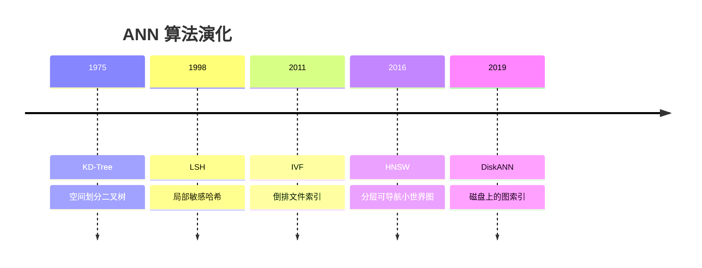
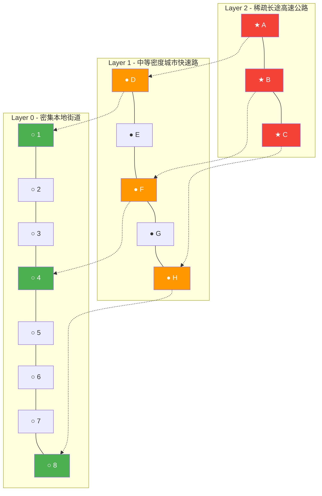
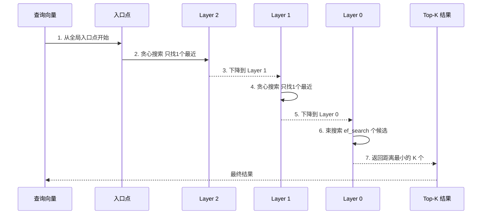

# 第三章：HNSW — 层次化可导航小世界图与近似最近邻搜索

## 前置知识

> 📎 **参考**: [向量距离度量](../prerequisites/05_向量距离度量.md)
> 📎 **参考**: [SIMD 与硬件优化](../prerequisites/06_SIMD与硬件优化.md)

---

## 学习目标

- 理解**最近邻搜索**（NNS）问题的本质，以及为什么**暴力搜索**在大规模数据上不可行
- 掌握**维度诅 Curse of Dimensionality**：为什么基于空间划分的树结构会在高维空间失效
- 了解 ANN 算法近 50 年的演化脉络
- 深入理解**图索引**（Graph Index）的核心思想：用"友谊关系"替代"空间划分"
- 掌握**小世界网络**（Small World Network）理论及其与"六度分隔"的关系
- 理解**可导航小世界**（NSW）图的构建原理
- 掌握 HNSW 的多层结构 — 如何借鉴**跳表**（Skip List）实现对数级导航
- 理解贪心搜索、束搜索、ef 参数的直觉含义
- 学会调优 HNSW 的三个关键超参数（M, ef_construction, ef_search）
- 动手实现单层 NSW 索引并计算召回率

---

## 3.1 根本问题：如何在十亿向量中快速找到最相似的那一个？

### 3.1.1 什么是最邻近搜索？

**最邻近搜索**（Nearest Neighbor Search, NNS）是计算科学中的基础操作。给定一个**查询**（query）和一个**数据库**（database），找出数据库中与查询最相似的 k 个向量。

| 应用场景 | 查询（Query） | 数据库（Database） | "相似"的含义 |
|---|---|---|---|
| 图像搜索 | 一张照片的嵌入向量 | 所有照片的嵌入向量 | 视觉上相似的照片 |
| 推荐系统（TikTok For You） | 用户最近交互的视频向量 | 所有候选视频向量 | 用户可能喜欢的内容 |
| RAG（ChatGPT 检索增强生成） | 用户问题的嵌入向量 | 知识库文档的嵌入向量 | 语义上最相关的文档 |
| 药物信息学 | 药物分子指纹向量 | 已知药物库 | 结构上相似的分子 |

所有这些应用都归结为同一个数学问题：在 N 个 D 维向量中，找到与查询向量距离最小的 k 个。

### 3.1.2 为什么不能直接一一比较？暴力搜索的困境

**暴力搜索**（Brute Force）是 100% 准确的——因为你检查了每一个候选。但计算复杂度是 O(N × D)。

代入具体数字：
- N = 10,000,000（一千万），D = 768
- 每次搜索需要：~150 亿次浮点运算
- 在单核 CPU 上（AVX2 加速，~24 GFLOPS），一次搜索耗时：~640 毫秒
- **每秒只能处理约 10 个查询**

对于需要同时服务成千上万在线用户的应用，这是完全不可接受的。

### 3.1.3 近似最邻近：用一点点精度换取数量级的速度提升

**近似最邻近搜索**（Approximate Nearest Neighbor, ANN）的核心思想是：*不需要找到严格的最邻近，只需要找到"足够近"的结果*。

ANN 系统需要在四个指标之间进行权衡：

| 指标 | 含义 | 优化方向 |
|---|---|---|
| **精度/召回率**（Recall） | 找到的真正 Top-k 结果占暴力搜索结果的比例 | 越高越好 |
| **查询吞吐量**（QPS） | 每秒能处理的查询数量 | 越高越好 |
| **内存占用** | 索引占用的内存大小 | 越小越好 |
| **构建时间** | 建立索引需要的时间 | 越短越好 |

**Pareto 前沿**：这四个指标无法同时优化。HNSW 的巧妙之处在于，在召回率和查询吞吐量之间取得了 2024 年已知的最佳折中。

---

## 3.2 维度诅咒：为什么 KD-Tree 在高维空间中失效

### 3.2.1 KD-Tree 与空间划分的思路

**KD-Tree**（K-Dimensional Tree, Bentley 1975）的核心思想是**空间划分**：在每个维度上找到数据的中位数，将空间一分为二，形成一棵二叉树。

但维度一高，情况急剧恶化。这就是**维度诅咒**（Curse of Dimensionality）。

### 3.2.2 维度诅咒的直观理解

```
用代码直观验证：
D=2:   距离比 0.02    （有近有远，差异明显）
D=10:  0.31
D=50:  0.72
D=200: 0.91    （几乎所有点都在一个薄壳上）
D=768: 0.97    （距离几乎完全相同 — 维度诅咒的最极端表现）
```

> **结论**：任何依赖"在某个维度上划分空间"的方法（KD-Tree, VP-Tree, Ball-Tree, R*-Tree）都会在高维下失败。这就是为什么现代向量数据库几乎全部使用基于**图**的索引。

---

## 3.3 ANN 算法的历史演化：每一代解决上一代的问题

### ANN 算法演进时间线



| 年代 | 算法 | 核心思想 | 致命问题 |
|---|---|---|---|
| 1975 | **KD-Tree** | 在每个维度上找中位数分割空间 | 维度 > 20 后性能退化到接近 O(N) |
| 1998 | **LSH** | 设计哈希函数让相似向量被哈希到同一个桶 | 需要大量哈希表，内存开销巨大 |
| 2011 | **IVF** | 先用 K-means 把向量聚成 C 个簇 | 边界问题：查询在簇边界时最近邻可能在搜索范围外 |
| 2016 | **HNSW** | 多层小世界图：上层稀疏用于快速导航，底层稠密用于精确定位 | 内存开销 O(N × M)，增量删除困难 |
| 2019 | **DiskANN** | 把图存储在 SSD 上，配合量化和乘积量化压缩 | 延迟增加（SSD 寻道约 100 µs vs RAM 的 100 ns） |

---

## 3.4 图索引：让向量通过"友谊"连接彼此

### 3.4.1 什么是图？

在**图论**（Graph Theory）中，一个**图**（Graph）由两个集合组成：**节点**（vertex/node）和**边**（edge）。

在向量搜索中：
- **节点** = 一个向量（对应数据库中的一条记录）
- **边** = "这两个节点是彼此的最近邻之一"的关系

搜索算法的流程变成了：从某个起始节点出发，在图中沿着邻居走，每次走向更接近查询的节点，直到无法靠近为止。

### 3.4.2 小世界网络与"六度分隔"

**小世界网络**（Small World Network）是社会学家 Stanley Milgram 在 1967 年的著名实验中发现的现象。实验让内布拉斯加州奥马哈市的普通人将一封信通过熟人传递给波士顿的一位股票经纪人。在 296 封信中，只有 64 封（约 22%）成功送达，平均经过 4.4 个中间人。这就是著名的"六度分隔"理论。

小世界网络有两个关键属性：
1. **高聚类系数**：你的朋友之间大概率也互相是朋友
2. **短平均路径长度**：任意两个节点之间只需很少的跳跃——因为有"超级连接者"（认识很多人的人）充当长途桥梁

> **向量搜索的类比**：一个设计良好的搜索图需要同时具备这两个属性——在局部要足够密集（确保能找到精确匹配），同时要有"捷径"让搜索快速跳转到空间中遥远但相关的区域。

### 3.4.3 Navigable Small World (NSW)：基础图构建

**NSW** 是 HNSW 的前身，由 Malkov 等人在 2014 年提出。它的核心贡献是设计了一种构建图的方法，使得贪心搜索能在图上高效导航。

**NSW 的插入算法**：
```
INSERT(nsw, new_node, M):
  1. 如果图是空的：new_node 成为唯一的节点（入口点），返回
  2. 从任意已有节点出发，进行贪心搜索，找到与 new_node 最近的 efConstruction 个候选节点
  3. 从候选中选择距离最近的 M 个作为邻居
  4. 在 new_node 和这 M 个邻居之间建立双向连接
  5. 对于每个邻居：如果其邻居数达到 M_max（通常 2×M），不做修剪
```

### 3.4.4 贪心搜索：永远下山的策略

**贪心搜索**（Greedy Search）是图搜索中的基本操作。直觉非常简单：你在山地地形中，每次只观察周围的邻居，然后往海拔最低的方向走一步。

```
贪心搜索的伪代码：
GREEDY_SEARCH(query, entry_point, k):
  当前节点 → entry_point
  while true:
    检查 当前节点 的所有邻居
    最近邻居 → 邻居中与 query 距离最小的节点
    if 最近邻居就是当前节点本身?  break   # 已经走到局部最优
    当前节点 → 最近邻居
  return 当前节点
```

贪心搜索有一个致命弱点：**局部最优**。解决方法是**束搜索**（Beam Search）——同时保留 W 个最有希望的"候选节点"，从 W 个中各探索邻居，选出最好的 W 个继续。

---

## 3.5 HNSW 的核心创新：多层结构与跳表

### 3.5.1 为什么要分层？

普通的 NSW 从任意入口点出发，贪心搜索可能需要很多步才能到达目标区域。**HNSW** 的关键创新是引入了**层级**（hierarchical layers），灵感来自 **Skip List**（跳表，William Pugh 1989）。

**什么是跳表？** 跳表是一种在有序链表上建立的多层索引结构。底层是完整的有序链表，每往上一层，只保留部分节点的副本。跳表将有序链表的 O(N) 搜索优化到 O(log N)。

**HNSW 的核心洞察**：把跳表的思想从"链表"搬到了"图"上。普通跳表的"快捷通道"是线性的（单向指针），而 HNSW 的"快捷通道"是图结构（双向边），因此可以在任意维度的空间中导航。

### "高速公路"类比

```
Layer 3:  ★──────────────────────          ← 跨州高速公路（长途直达）
Layer 2:  ★───★───────────★─────          ← 高速公路（跨城市）
Layer 1:  ●─●─●───●─●─●─●───●─●          ← 市级公路（跨区）
Layer 0:  ○○○○○○○○○○○○○○○○○○           ← 本地道路（小巷）
```

- **Layer 0**（本地道路）：包含全部 N 个节点，连接密集——用于最终的精确比较
- **Layer 1**（市级公路）：只包含一部分节点（约 25%），连接更长——用于从一个区域快速跳到另一个区域
- **Layer 2+**（高速公路）：节点更少，连接跨越更大范围——用于跨城市导航

### HNSW 多层结构图



### 3.5.2 层级分配公式：为什么是指数衰减？

每个新插入的节点被随机分配一个*最大层级* l，公式为：

$$l = \lfloor -\ln(\text{uniform}(0, 1)) \cdot m_L \rfloor$$

其中 $m_L = 1 / \ln(M)$。

```
层级分布（M = 16, m_L ≈ 0.3607）：

P(level = 0) = 1.0             → 100% 的节点在 layer 0
P(level = 1) = 1/M = 1/16     → 6.25% 的节点在 layer 1
P(level = 2) = 1/M² = 1/256   → 0.39% 的节点在 layer 2
```

---

## 3.6 HNSW 搜索与插入的完整算法

### 3.6.1 搜索算法：从高速公路到小巷

HNSW 的搜索过程就像开车找目的地：先走高速公路到大致区域，再走街道到街区，最后走小巷到门牌号。

### HNSW 搜索过程时序图



### 3.6.2 SEARCH_LAYER 详细实现

这是 HNSW 搜索的核心函数——一个带扩展因子的束搜索（Beam Search）。维护两个数据结构：
1. **候选集**（candidates，最小堆）：存放"待探索"的节点
2. **结果集**（results，最大堆）：存放"已找到"的最佳节点

**停止条件的直觉**：如果连候选集中"最近的未探索节点"都比"当前第 ef 个最佳节点"还远，那剩余候选只会更远——提前停止可以节省大量计算。

### 3.6.3 插入算法：新节点如何加入图？

插入一个新节点分三个阶段：分配层级、下降定位、建立连接。

**为什么随机层级分配是有效的？**
1. **统计均匀性**：每个节点都有机会成为高层"锚点"，但概率很小
2. **自然形成层级**：高层节点少但连接长（跨大区域），底层节点多但连接短（局部）
3. **对数级高度**：最高层的期望高度是 $\log_M(N)$，保证搜索层数是 O(log N)

### 3.6.4 SelectNeighbors 启发式：避免冗余边

如果只是简单地连接到距离最近的 M 个邻居，会引入很多冗余边。启发式的核心直觉：被选中的邻居应该"在 query 的不同方向上"——它们共同覆盖 query 周围的空间，每个覆盖一个"扇区"。

---

## 3.7 三个关键超参数：M, ef_construction, ef_search

### 3.7.1 M — 每个节点在每层保持的连接数

| M 值 | 图的特性 | 适用场景 |
|---|---|---|
| M = 4 | 图稀疏，内存少，构建快，但搜索路径多 | 内存极度受限的嵌入式场景 |
| **M = 16** | **最佳平衡点** | **多数场景的推荐值** |
| M = 64 | 图稠密，内存大，构建慢，但路径最短 | 对召回率要求极高的离线场景 |

### 3.7.2 ef_construction — 构建时的搜索宽度

| ef_construction 值 | 效果 |
|---|---|
| ef_c = 100 | 构建快，但图质量可能不够好 |
| **ef_c = 200** | **多数场景的最佳平衡点** |
| ef_c = 500 | 构建慢，图质量接近最优 |

**关键关系**：ef_search 可以在查询时增大，但*召回率的天花板由 ef_construction 决定*。

### 3.7.3 ef_search — 查询时的搜索宽度

| ef_search 值 | 效果 |
|---|---|
| ef_search = k | 最快，最低召回率 |
| **ef_search = 2×k** | **常用默认值，召回率通常 > 95%** |
| ef_search = 10×k | 高召回率（> 99%），速度开始下降明显 |

---

## 3.8 复杂度分析

| 操作 | 理论复杂度 | 实际观测（100 万向量 D=768） |
|---|---|---|
| 构建 | O(N × log N × M × ef_construction) | 约 5-15 分钟（单线程） |
| 搜索 | O(log N × M × ef_search) | 约 0.1-1 ms |
| 内存 | O(N × M × (D × 4 + 16) bytes) | 约 4-8 GB |

---

## 3.9 动手实现：单层 NSW 索引

在 `ch03_hnsw_theory/code/nsw.cpp` 实现纯内存的单层 NSW 索引：

```cpp
#include <vector>
#include <queue>
#include <unordered_set>
#include <cmath>
#include <iostream>
#include <random>
#include <algorithm>

struct Node {
    int id;
    std::vector<float> vec;
    std::vector<int> neighbors;
};

class NSWIndex {
public:
    int M;
    int M_max;
    int ef_search;
    int dim;
    std::vector<Node> nodes;
    int entry_point = -1;

    NSWIndex(int M_, int M_max_, int ef_s, int dim_)
        : M(M_), M_max(M_max_), ef_search(ef_s), dim(dim_) {}

    float l2_distance(const float* a, const float* b) const {
        float sum = 0.0f;
        for (int i = 0; i < dim; i++) {
            float d = a[i] - b[i];
            sum += d * d;
        }
        return std::sqrt(sum);
    }

    std::vector<std::pair<float, int>> search_layer(
        const float* query, int ep, int ef) const
    {
        auto cmp = [](const std::pair<float, int>& a, const std::pair<float, int>& b) {
            return a.first < b.first;
        };
        std::priority_queue<std::pair<float, int>,
            std::vector<std::pair<float, int>>, decltype(cmp)> candidates(cmp);

        auto cmp_min = [](const std::pair<float, int>& a, const std::pair<float, int>& b) {
            return a.first > b.first;
        };
        std::priority_queue<std::pair<float, int>,
            std::vector<std::pair<float, int>>, decltype(cmp_min)> results(cmp_min);

        std::unordered_set<int> visited;

        float d = l2_distance(query, nodes[ep].vec.data());
        candidates.push({d, ep});
        results.push({d, ep});
        visited.insert(ep);

        while (!candidates.empty()) {
            auto [dist_c, c] = candidates.top(); candidates.pop();
            auto [dist_f, f] = results.top();
            if (dist_c > dist_f) break;

            for (int n : nodes[c].neighbors) {
                if (visited.count(n)) continue;
                visited.insert(n);

                float dist = l2_distance(query, nodes[n].vec.data());
                if (results.size() < (size_t)ef || dist < results.top().first) {
                    candidates.push({dist, n});
                    results.push({dist, n});
                    if (results.size() > (size_t)ef)
                        results.pop();
                }
            }
        }

        std::vector<std::pair<float, int>> out;
        while (!results.empty()) {
            out.push_back(results.top());
            results.pop();
        }
        std::reverse(out.begin(), out.end());
        return out;
    }

    std::vector<int> select_neighbors_simple(
        const float* query,
        const std::vector<std::pair<float, int>>& candidates,
        int M_sel) const
    {
        std::vector<int> result;
        for (size_t i = 0; i < candidates.size() && result.size() < (size_t)M_sel; i++) {
            result.push_back(candidates[i].second);
        }
        return result;
    }

    void insert(const float* vec) {
        int new_id = nodes.size();
        nodes.push_back({new_id,
            std::vector<float>(vec, vec + dim), {}});

        if (new_id == 0) {
            entry_point = 0;
            return;
        }

        auto candidates = search_layer(vec, entry_point, ef_search);
        auto sel = select_neighbors_simple(vec, candidates, M);

        for (int nid : sel) {
            nodes[new_id].neighbors.push_back(nid);
            if (nodes[nid].neighbors.size() < (size_t)M_max) {
                nodes[nid].neighbors.push_back(new_id);
            }
        }
    }

    std::vector<std::pair<float, int>> knn_search(const float* query, int k) {
        if (nodes.empty()) return {};
        auto results = search_layer(query, entry_point, std::max(ef_search, k));
        results.resize(std::min((int)results.size(), k));
        return results;
    }

    void print_stats() const {
        std::cout << "Nodes: " << nodes.size() << std::endl;
        int total_edges = 0;
        for (auto& n : nodes) total_edges += n.neighbors.size();
        std::cout << "Total edges: " << total_edges << std::endl;
        std::cout << "Avg degree: "
                  << (nodes.empty() ? 0.0 : (double)total_edges / nodes.size())
                  << std::endl;
    }
};

int main() {
    const int DIM = 128;
    const int N = 1000;
    const int M = 16;
    const int M_max = 32;
    const int ef_search = 100;

    NSWIndex idx(M, M_max, ef_search, DIM);

    std::mt19937 rng(42);
    std::uniform_real_distribution<float> dist(-1.0f, 1.0f);

    std::vector<std::vector<float>> data(N);
    for (int i = 0; i < N; i++) {
        data[i].resize(DIM);
        for (int j = 0; j < DIM; j++)
            data[i][j] = dist(rng);
        idx.insert(data[i].data());
    }

    idx.print_stats();

    std::vector<float> query(DIM);
    for (int j = 0; j < DIM; j++)
        query[j] = dist(rng);

    auto results = idx.knn_search(query.data(), 5);
    std::cout << "\nTop-5 results:" << std::endl;
    for (auto& [d, id] : results) {
        std::cout << "  id=" << id << " dist=" << d << std::endl;
    }

    // 与暴力搜索对比，计算召回率
    std::vector<std::pair<float, int>> brute(N);
    for (int i = 0; i < N; i++) {
        brute[i] = {idx.l2_distance(query.data(), data[i].data()), i};
    }
    std::sort(brute.begin(), brute.end());

    int matches = 0;
    std::unordered_set<int> result_ids;
    for (auto& [d, id] : results) result_ids.insert(id);
    for (int i = 0; i < 5; i++) {
        if (result_ids.count(brute[i].second)) matches++;
    }
    std::cout << "\nRecall@5: " << matches << "/5 = "
              << (matches / 5.0 * 100) << "%" << std::endl;

    return 0;
}
```

编译运行：
```bash
g++-12 -O3 -std=c++17 nsw.cpp -o nsw
./nsw
```

---

## 思考题

1. 为什么 KD-Tree 在高维下退化？写出数学证明。
2. HNSW 的层级分配公式中，$m_L = 1/\ln(M)$ 的推导：证明这保证了每层节点数的期望比例恰好为 $1/M$。
3. SelectNeighbors 在什么极端情况下会退化为简单的 Top-M 选择？
4. HNSW 的删除操作天然困难——为什么通常使用标记删除（tombstone + 周期性重建）而不是真正的图修改？
5. 如果向量不断被加入和删除（流式数据），HNSW 的图质量会随时间退化吗？有什么应对策略？

---

## 动手练习

1. 运行上述 NSW 代码，在 N = 100、1,000、10,000、100,000 下分别测量搜索时间和召回率。
2. 给 NSW 加上 SelectNeighbors 启发式（见 3.6.4），对比剪枝前后的图的平均度、搜索路径长度、召回率。
3. 实现 HNSW 的多层构建——关键难点：每层单独维护邻居关系、层级分配的随机性、下降阶段的 GREEDY_SEARCH_ONE 只找 1 个最近节点。
4. 下载 ann-benchmarks 的标准数据集，测试你的实现并与 FAISS 的 HNSW 实现对比。关注 recall@10 和 QPS。
