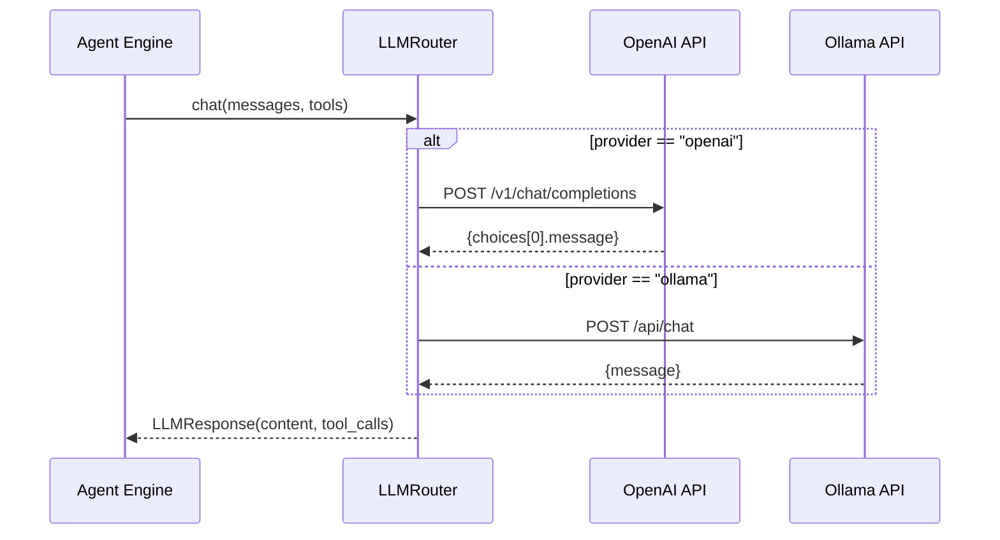

# Chapter 4: LLM Integration Layer

> LLM Router design — a unified async interface for OpenAI and Ollama.

## Prerequisites

> 📎 **Reference**: [Python Environment](../prerequisites/02_Python环境_en.md)

---

## Learning Objectives

- Understand the Strategy pattern in LLM Router
- Master the API differences between OpenAI and Ollama
- Learn how Function Calling works

---

## 4.1 Architecture Overview



---

## 4.2 Core Implementation

```python
class LLMRouter:
    async def chat(self, messages, tools=None) -> LLMResponse:
        if self.config.provider == "openai":
            return await self._chat_openai(messages, tools)
        elif self.config.provider == "ollama":
            return await self._chat_ollama(messages, tools)
```

> **Design highlights**:
> - Strategy pattern via `config.provider`
> - Lazy HTTP client initialization
> - Unified `LLMResponse` return type

---

## 4.3 OpenAI vs Ollama API Differences

| Feature | OpenAI | Ollama |
|---------|--------|--------|
| Endpoint | `/v1/chat/completions` | `/api/chat` |
| Tool args format | JSON string in `function.arguments` | dict in `function.arguments` |
| Token stats | `usage.prompt_tokens` | `prompt_eval_count` |
| Auth | Bearer token | None (default) |

---

## 4.4 Function Calling Schema

```python
SEARCH_TOOL = {
    "type": "function",
    "function": {
        "name": "vector_search",
        "description": "Search for semantically similar documents",
        "parameters": {
            "type": "object",
            "properties": {
                "query": {"type": "string"},
                "k": {"type": "integer", "default": 10},
            },
            "required": ["query"],
        },
    },
}
```

---

## Review Questions

1. How should the system handle OpenAI API timeouts? Design a circuit-breaker strategy.
2. Where can `LLMResponse.latency_ms` be used?
3. How to ensure LLM tool_call arguments are valid?

## Hands-on Exercises

1. Add Anthropic Claude support to `LLMRouter`
2. Implement retry logic: auto-retry up to 3 times on LLM failure
3. Write unit tests for provider switching
