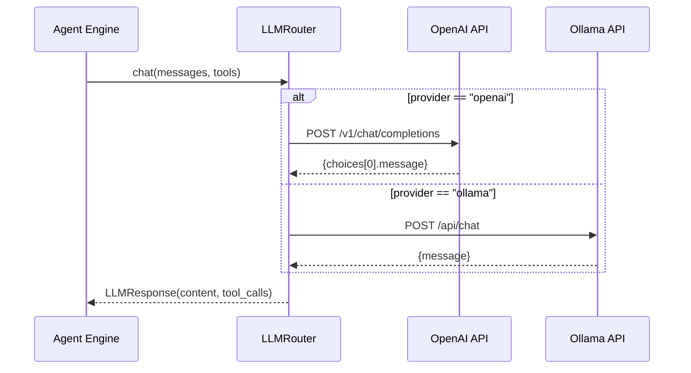

# 第四章：LLM 集成层

> LLM Router 的设计 — 统一 OpenAI 和 Ollama 的异步接口。

## 前置知识

> 📎 **参考**: [Python环境](../prerequisites/02_Python环境_zh.md)

---

## 学习目标

- 理解 LLM Router 的策略模式设计
- 掌握 OpenAI 和 Ollama 的 API 差异
- 学会 Function Calling 的工作原理

---

## 4.1 架构概览



---

## 4.2 LLMRouter 核心实现

```python
class LLMRouter:
    def __init__(self, config: LLMConfig):
        self.config = config
        self._client: Optional[httpx.AsyncClient] = None

    async def chat(
        self,
        messages: List[Dict[str, str]],
        tools: Optional[List[Dict[str, Any]]] = None,
        temperature: Optional[float] = None,
        max_tokens: Optional[int] = None,
    ) -> LLMResponse:
        await self._ensure_client()
        if self.config.provider == "openai":
            return await self._chat_openai(messages, tools, temp, tokens)
        elif self.config.provider == "ollama":
            return await self._chat_ollama(messages, tools, temp, tokens)
        else:
            raise ValueError(f"Unknown provider: {self.config.provider}")
```

> **设计要点**：
> - 策略模式：根据 `config.provider` 分发到不同实现
> - 延迟初始化：HTTP 客户端在首次调用时创建
> - 统一返回类型：`LLMResponse` 抹平 API 差异

---

## 4.3 OpenAI vs Ollama API 差异

| 特性 | OpenAI | Ollama |
|------|--------|--------|
| 端点 | `/v1/chat/completions` | `/api/chat` |
| Tool calls 格式 | `message.tool_calls[i].function.arguments` 为 JSON 字符串 | `message.tool_calls[i].function.arguments` 为 dict |
| Token 统计 | `usage.prompt_tokens` | `prompt_eval_count` |
| 认证 | Bearer token | 无 (默认) |

---

## 4.4 Function Calling Schema

```python
SEARCH_TOOL = {
    "type": "function",
    "function": {
        "name": "vector_search",
        "description": "在向量数据库中搜索语义相似的文档",
        "parameters": {
            "type": "object",
            "properties": {
                "query": {"type": "string"},
                "k": {"type": "integer", "default": 10},
            },
            "required": ["query"],
        },
    },
}
```

LLM 返回的 tool_call 解析:

```python
{
    "id": "call_abc123",
    "name": "vector_search",
    "arguments": {"query": "What is RAG?", "k": 5}
}
```

---

## 思考题

1. 如果 OpenAI API 超时，系统应该怎么处理？熔断降级策略怎么设计？
2. `LLMResponse` 中的 `latency_ms` 可以用在哪些地方？
3. 如何保证 LLM 返回的 tool_call 参数一定是有效的？

## 动手练习

1. 在 `LLMRouter` 中添加 Anthropic Claude 的支持
2. 实现一个 retry 机制：LLM 调用失败时自动重试 (最多 3 次)
3. 编写单元测试验证 OpenAI 和 Ollama 两种 provider 的切换
