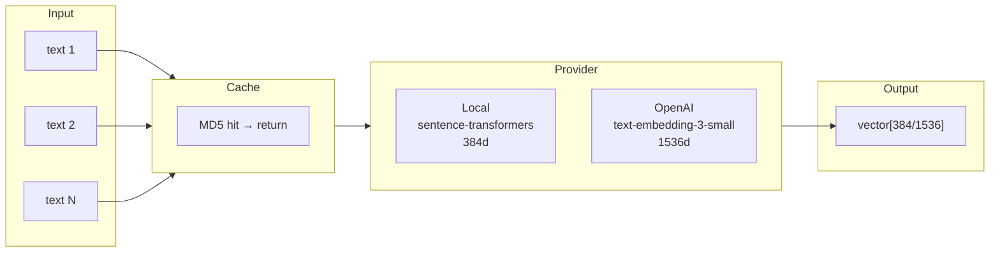

# Chapter 5: Embedding Service

> Embedding Service — the bridge between text and vectors.

## Prerequisites

> 📎 **Reference**: [Python Environment](../prerequisites/02_Python环境_en.md) | [Distance Metrics](../prerequisites/05_距离度量_en.md)

---

## Learning Objectives

- Understand the differences between local and cloud embeddings
- Master embedding cache design
- Learn batch text vectorization

---

## 5.1 Architecture



---

## 5.2 Provider Comparison

| Feature | Local (all-MiniLM-L6-v2) | OpenAI (text-embedding-3-small) |
|---------|------------------------|-------------------------------|
| Dimension | 384 | 1536 |
| Speed | ~100 text/s (CPU) | ~500 text/min (rate-limited) |
| Cost | Free | $0.0001/1K tokens |
| Privacy | 100% local | Data sent to OpenAI |
| Warmup | ~3s (first load) | 0 |

---

## 5.3 Cache Design

```python
async def _embed_openai(self, texts):
    uncached = [t for t in texts if self._cache_key(t) not in self._cache]
    if uncached:
        vectors = await self._fetch_openai_embeddings(uncached)
        for text, vec in zip(uncached, vectors):
            self._cache[self._cache_key(text)] = vec
```

> **Strategy**: MD5 hash → vector. Persisted to JSON, survives restarts.
> For production, replace with Redis.

---

## Review Questions

1. What happens if embedding dimension (384) doesn't match LumenDB config (768)?
2. What concurrency issues can arise with JSON file caching?
3. When should you use OpenAI embeddings over local ones?

## Hands-on Exercises

1. Benchmark `all-MiniLM-L6-v2` speed on your machine (vary batch_size)
2. Replace the JSON cache backend with Redis
3. Add auto-dimension detection: check vector dimension before insert
