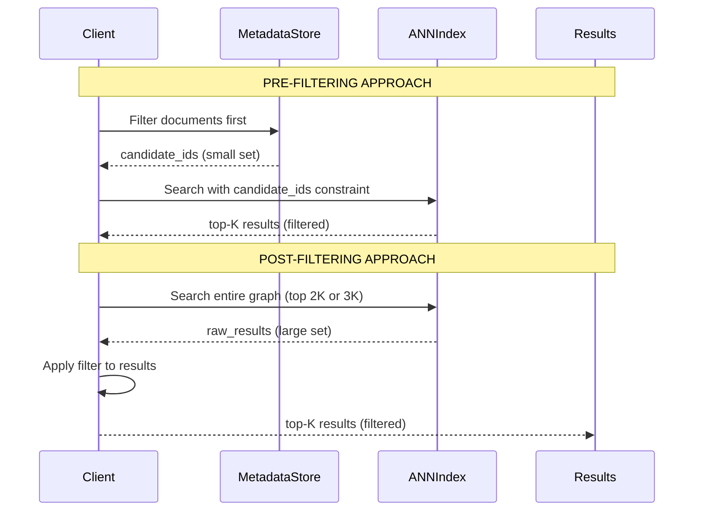
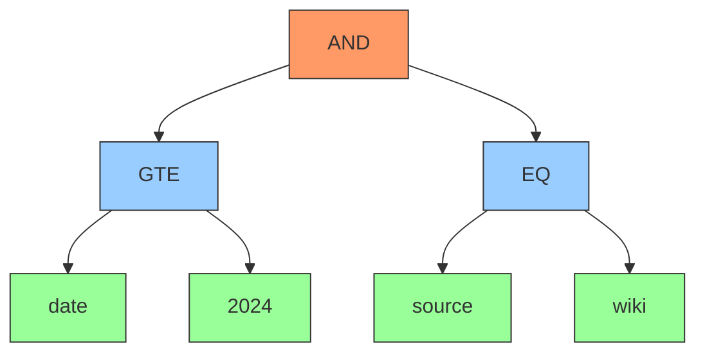
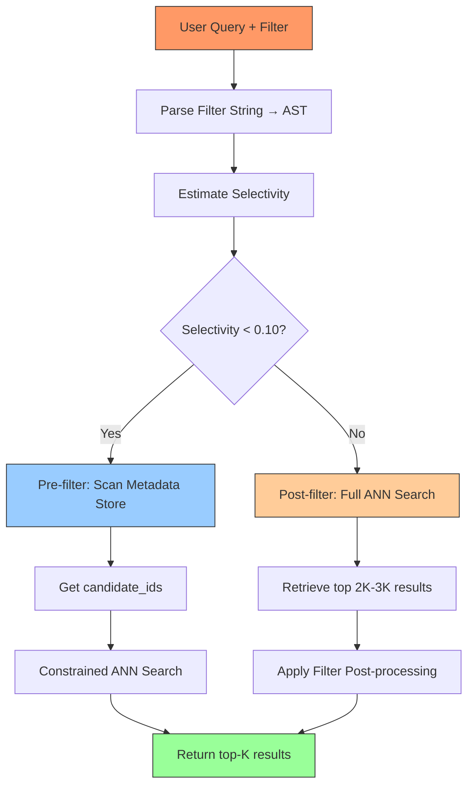

# Chapter 6 — Metadata & Filtered Search

## Prerequisites

> 📎 **Reference**: [Vector Distance Metrics](../prerequisites/05_向量距离度量.md) — L2, Inner Product, Cosine: formulas and when to use each
> 📎 **Reference**: [SIMD & Hardware Optimization](../prerequisites/06_SIMD与硬件优化.md) — Memory wall and why memory bandwidth matters for vector search
> 📎 **Reference**: [Build Environment Configuration](../prerequisites/01_构建环境配置_en.md) — CMake and build commands

## 6.1 The Problem: Semantic Search Is Not Enough

Vector search returns the most semantically similar results. But real users don't ask "find me the 10 most similar documents." They ask:

- *"Find documents about climate policy published after 2023"*
- *"Search emails from alice@corp.com containing 'Q4 roadmap'"*
- *"Retrieve code snippets in Python, not JavaScript"*
- *"Find similar products under $50, in stock, rated 4+ stars"*

The vector handles "about climate policy." The constraints — date, author, programming language, price, availability, rating — need something else. That something else is **metadata filtering**.

**Metadata filtering** is the process of restricting vector search results to documents that satisfy structured constraints on their non-vector attributes. It is the bridge between "semantically similar" and "semantically similar AND meets my requirements."

Without metadata filtering, a vector database is a research curiosity. With it, it becomes a production-ready retrieval system.

### 6.1.1 Core Concepts (Definitions)

Before we go further, we need a shared vocabulary. Every technical term in this chapter is defined here. Read this section once, then refer back as needed.

#### Vector, Embedding, and Distance Metrics

A **vector** (also called an **embedding**) is a dense numerical array — typically 128 to 4096 floating-point numbers — that captures the *semantic meaning* of a document as a point in high-dimensional space. Two documents with similar meaning produce vectors that are close together in this space, even if they share no words.

> For detailed explanations of vectors, embeddings, and the three distance metrics (L2, Inner Product, Cosine), see Chapter 2: [Vector Fundamentals and Distance Metrics](../ch02_vectors_distance/02_向量与距离度量_en.md) and the prerequisite documents listed above.

#### ANN (Approximate Nearest Neighbor)

**ANN** stands for **Approximate Nearest Neighbor**. Finding the *exact* nearest neighbor in high dimensions is slow — it requires comparing the query vector against every vector in the database (brute force, O(N) time). ANN algorithms trade a small amount of accuracy for dramatic speedups. Instead of guaranteeing the true nearest neighbor, they return a vector that is *likely* near the top-K, often within 95-99% recall.

The dominant ANN algorithm for production vector databases is **HNSW** (Hierarchical Navigable Small World). HNSW builds a multi-layer graph where each vector is a node, connected to its approximate neighbors. Search starts at a coarse top layer and progressively descends to finer layers, "hopping" toward the query's region of the space. It achieves O(log N) search time with high recall.

> For a complete explanation of HNSW's multi-layer structure, search algorithm, and hyperparameters, see Chapter 3: [HNSW — Hierarchical Navigable Small World Graphs](../ch03_hnsw_theory/03_HNSW近似搜索_en.md).

The critical point: **HNSW (and most ANN indexes) are built for pure nearest-neighbor search. They have no concept of metadata.** When you add a filter, the index doesn't know which nodes satisfy it. This mismatch is the root of all filtering challenges.

#### Metadata

**Metadata** is the non-vector attributes of each document. Think of it as the card catalog in a library. The books on the shelves are the "vectors" — their actual content. The card catalog cards tell you the title, author, publication date, subject, and shelf location. You wouldn't browse every book in the library to find all books published after 2020 about climate change. You'd check the catalog first.

In a vector database, metadata typically includes:
- **Document identifiers**: `doc_id`, `source_id`, `URL`
- **Temporal information**: `created_at`, `updated_at`, `date_published`
- **Categorical labels**: `source` (wiki, pdf, email), `language`, `content_type`
- **Numerical attributes**: `word_count`, `page_number`, `importance_score`
- **Free-form tags**: `"python, ml, vector, database"`

Metadata lives in a **metadata store** — a separate data structure from the vector index. The vector index stores vectors and their IDs; the metadata store maps IDs to their attributes. Keeping them separate means the vector index stays compact and cache-friendly.

#### Filter Expression

A **filter expression** is a boolean predicate over metadata fields. It is the structured representation of the user's constraints. Examples:

```
date >= 2024 AND source = "wiki"
price < 50 AND in_stock = true
author = "alice" OR author = "bob"
tags IN ("python", "rust") AND NOT tags LIKE "legacy%"
```

A filter expression evaluates to `true` or `false` for each document. Documents where the expression is `true` are said to **match the filter**.

#### Conjunctive vs. Disjunctive

These terms describe how filter clauses are combined:

- **Conjunctive** (AND): all clauses must be true. `A AND B AND C` is true only when A, B, and C are all true. This is *restrictive* — it narrows results.
- **Disjunctive** (OR): any clause being true is sufficient. `A OR B OR C` is true when at least one of A, B, C is true. This is *expansive* — it broadens results.

The distinction matters for performance: conjunctive filters tend to be more selective (matching fewer documents), while disjunctive filters tend to be less selective (matching more). The database's filtering strategy differs based on this.

#### Selectivity

**Selectivity** is the fraction of documents that pass a filter. It is the single most important metric for deciding how to execute a filtered search:

```
selectivity = number_of_documents_matching_filter / total_documents
```

- **selectivity < 0.01** (1%): very selective. Only 1 in 100 documents passes.
- **selectivity 0.01–0.10** (1-10%): moderately selective.
- **selectivity > 0.10** (10%+): broad. Most documents pass.

Selectivity drives the choice between pre-filtering and post-filtering (explained in 6.2). A database that cannot estimate selectivity is flying blind.

---

## 6.2 Pre-filtering vs. Post-filtering: The Core Trade-off

There are two fundamental strategies for combining filtering with vector search. They sit on opposite ends of a spectrum, and each has a different failure mode.

### 6.2.1 Pre-filtering

**How it works**: apply the filter *before* the ANN search. Scan the metadata store to find all document IDs that match the filter. Then run the ANN search, but only consider vectors belonging to those IDs.

```
User query: vector q, filter F
         │
         ▼
    ┌──────────────────┐
    │  Scan metadata   │
    │  Find IDs where  │
    │  F is true       │
    │  → candidate_ids │
    └──────────────────┘
         │
         ▼
    ┌──────────────────┐
    │  ANN search with │
    │  candidate_ids   │
    │  as constraint   │
    │  → top-K results │
    └──────────────────┘
```

**Analogy**: you're looking for a cookbook published in 2025 at a library. Pre-filtering is: "Go to the 'new books' shelf first, then browse only that shelf." If the "new books" shelf is small, this is fast.

**Pros**:
- Fewer distance computations (only search matching vectors).
- Works well when the filter is highly selective (small candidate set).
- The result set is *guaranteed* to satisfy the filter (no wasted work).

**Cons**:
- **Graph fragmentation**: HNSW is a graph. If the filter excludes many nodes, the remaining nodes may form disconnected components — islands with no edges between them. The search starts at some entry point, and if that entry point's neighbors are all filtered out, the search gets stuck on its island and cannot reach the true nearest neighbors in another island. This causes **recall to drop dramatically**.
- **Overhead when filter is broad**: if the filter matches 50% of documents, you've barely reduced the search space but added the cost of filtering.

```
    HNSW graph (unfiltered)           After pre-filtering
    ┌─────────────────┐               ┌─────────────────┐
    │  A ── B ── C    │               │  A ── B    C    │
    │  │ ╲  │  ╱  │   │               │  │ ╲  │         │
    │  D ── E ── F    │               │  D ── E    F    │
    │  │  ╱ │ ╲  │   │               │       ╱         │
    │  G ── H ── I    │               │  G ── H         │
    └─────────────────┘               └─────────────────┘
                                         ↑ C, F, I are
                                         disconnected
```

### 6.2.2 Post-filtering

**How it works**: run the ANN search *first*, retrieving more results than you need (say, top 2×K or top 3×K). Then apply the filter to this result set, keeping only matching documents. Return the top K from the survivors.

```
User query: vector q, filter F, top K
         │
         ▼
    ┌──────────────────┐
    │  ANN search      │
    │  (no filter)     │
    │  Retrieve top    │
    │  M = 2K results  │
    └──────────────────┘
         │
         ▼
    ┌──────────────────┐
    │  Apply filter F  │
    │  Keep only docs  │
    │  where F is true │
    │  Return top K    │
    └──────────────────┘
```

**Analogy**: "Browse the entire cooking section, find 20 cookbooks similar to what I like, then keep only the ones published in 2025."

**Pros**:
- **Full ANN recall**: the search sees the entire graph. No fragmentation. The ANN does what it does best.
- Simple implementation — the filter is just a post-processing step.

**Cons**:
- **Over-fetching**: if the filter is very selective (e.g., only 2% of documents match), you may need to fetch K / 0.02 = 50×K vectors to get K results after filtering. That's expensive — you compute 50×K distances just to throw most of them away.
- **Wasted computation**: distance calculations are performed on vectors that will be discarded.
- **Latency**: fetching 50×K vectors from disk/network takes time.

### 6.2.3 Visual Comparison



```
PRE-FILTERING                              POST-FILTERING

┌──────────┐     ┌──────────┐             ┌──────────┐     ┌──────────┐
│ Metadata │────▶│ Filter   │             │ Vector   │────▶│ ANN      │
│ Store    │     │ Engine   │             │ Index    │     │ Search   │
└──────────┘     └────┬─────┘             └──────────┘     └────┬─────┘
                      │                                         │
                      ▼                                         ▼
              ┌──────────────┐                           ┌──────────────┐
              │ Candidate IDs│                           │ Top M results│
              │ (small set)  │                           │ (may be large│
              └──────┬───────┘                           └──────┬───────┘
                     │                                          │
                     ▼                                          ▼
              ┌──────────────┐                           ┌──────────────┐
              │ ANN search   │                           │ Filter       │
              │ (constrained)│                           │ (post-filter)│
              └──────┬───────┘                           └──────┬───────┘
                     │                                          │
                     ▼                                          ▼
              ┌──────────────┐                           ┌──────────────┐
              │ Top K results│                           │ Top K results│
              │ (filtered)   │                           │ (filtered)   │
              └──────────────┘                           └──────────────┘

  Filter-first, search-later          Search-first, filter-later
  Recall risk: graph fragmentation    Recall risk: none (full graph)
  Compute risk: low (few vectors)     Compute risk: high (over-fetch)
```

### 6.2.4 LumenDB's Adaptive Strategy

Neither pre-filtering nor post-filtering is universally better. LumenDB makes the decision at query time based on estimated selectivity:

1. Estimate selectivity using per-field histograms (built during indexing, see 6.7).
2. If selectivity < 0.10 (less than 10% of data passes): **pre-filter**. The candidate set is small enough that constrained ANN works well.
3. If selectivity ≥ 0.10 (10%+ passes): **post-filter**. The ANN graph is mostly intact, so full search + post-filtering preserves recall.

```cpp
if (estimated_selectivity < 0.10) {
    auto candidate_ids = EvaluateFilterOnIndex(filter);  // scan metadata
    results = hnsw_.Search(query, top_k, candidate_ids);  // constrained search
} else {
    auto raw_results = hnsw_.Search(query, top_k * 2);    // full search
    results = PostFilter(raw_results, filter, top_k);      // apply filter, take top K
}
```

The threshold (0.10) is a heuristic. Production systems like Milvus use more sophisticated approaches, sometimes combining both strategies or using a third approach called **ranked filtering** (see 6.9).

---

## 6.3 The Filter AST — From Text to Expression Tree

Filters arrive as human-readable strings:

```
date >= 2024 AND source = "wiki"
price < 50 AND (category = "electronics" OR category = "computers")
tags IN ("python", "rust") AND NOT tags LIKE "legacy%"
```

The database needs to turn this string into code it can execute against millions of documents. This is a classic **compiler front-end** problem: parsing text into a structured representation that can be evaluated efficiently.

### 6.3.1 The Pipeline: String → Tokens → AST → Evaluation

The transformation has three stages:

**Stage 1: Lexical Analysis (Tokenization)**

A **lexer** (also called a **tokenizer** or **scanner**) converts the raw character string into a sequence of **tokens**. A token is a categorized chunk of the input — the smallest meaningful unit. The lexer discards whitespace and comments, and classifies each token by type.

For the input `date >= 2024 AND source = "wiki"`:

```
Token 1: IDENTIFIER("date")     — a field name
Token 2: GTE(">=")              — a comparison operator
Token 3: INTEGER(2024)          — a numeric literal
Token 4: AND("AND")             — a logical connective
Token 5: IDENTIFIER("source")   — a field name
Token 6: EQ("=")                — a comparison operator
Token 7: STRING("wiki")         — a string literal
```

The lexer is a simple state machine. It reads characters one at a time, accumulating them until it can classify a complete token. It handles edge cases like: is `>=` one token or two (`>` then `=`)? The answer depends on whether you're at `>=` or `> x`. The lexer resolves this by peeking at the next character.

**Stage 2: Syntactic Analysis (Parsing)**

A **parser** converts the token stream into an **Abstract Syntax Tree (AST)**, also called an **expression tree**. The AST is a tree data structure that captures the *structure* of the expression — what depends on what — independent of the concrete syntax.

The AST for `date >= 2024 AND source = "wiki"`:



Each node in the AST is either:
- A **leaf node**: represents a single comparison (e.g., `date >= 2024`). Contains the field name, the operator, and the value.
- An **internal node**: represents a logical combination (AND, OR, NOT). Contains the operator and pointers to child nodes.

The AST captures operator precedence without needing parentheses. In `A AND B OR C`, the parser knows (from the grammar) that AND binds tighter than OR, so the tree is:

```
         OR
        / \
      AND   C
     / \
    A   B
```

This means `(A AND B) OR C`, not `A AND (B OR C)`.

**Stage 3: Evaluation**

Once we have the AST, evaluating it against a document is a **tree traversal**. Starting at the root:
- An AND node returns true only if *all* children return true.
- An OR node returns true if *any* child returns true.
- A NOT node returns the negation of its single child.
- A leaf node (EQ, GT, etc.) evaluates the comparison against the document's metadata.

This is inherently **recursive** — each node delegates to its children. The evaluation naturally handles nested expressions.

### 6.3.2 The Recursive Descent Parser

A **recursive descent parser** is the simplest way to implement a parser for a small language. It is a **top-down parser** — it starts at the root of the AST and works downward, calling itself recursively for sub-expressions.

The key insight: each function in the parser corresponds to a *precedence level* in the grammar. This is how operator precedence (the rule that `*` binds tighter than `+`) is encoded:

```
expression  →  or_expr
or_expr     →  and_expr ( "OR" and_expr )*
and_expr    →  comparison ( "AND" comparison )*
comparison  →  field ( ">=" | "<=" | "=" | "!=" | ">" | "<" ) value
field       →  IDENTIFIER
value       →  INTEGER | FLOAT | STRING
```

Each function consumes tokens at its precedence level. The `or_expr` function calls `and_expr`, which calls `comparison`, which handles the leaf comparisons. This nesting ensures that `A AND B OR C` is parsed as `(A AND B) OR C` — the OR at the top level sees the result of AND as its operands.

**Operator precedence** is the rule determining which operations are evaluated first in an expression without parentheses. Just as in arithmetic where `2 + 3 * 4` equals `2 + (3 * 4) = 14` (not `(2 + 3) * 4 = 20`), in filter expressions `A AND B OR C` means `(A AND B) OR C`. The parser encodes this precedence through the nesting of functions.

### 6.3.3 LumenDB's FilterNode

```cpp
enum class FilterOp {
    EQ, NE, GT, GTE, LT, LTE,       // scalar comparison
    IN, NOT_IN,                      // set membership
    LIKE,                            // substring / regex
    AND, OR, NOT                     // logical
};

struct FilterNode {
    FilterOp op;
    std::string field;               // e.g. "date", "source", "tags"
    union {
        int64_t  int_val;
        double   float_val;
        std::string str_val;
    };
    std::vector<FilterNode> children;  // for AND/OR/NOT
    std::vector<std::string> set_vals; // for IN/NOT_IN

    static FilterNode Eq(const std::string& field, const std::string& val);
    static FilterNode Gt(const std::string& field, int64_t val);
    static FilterNode Contains(const std::string& field, const std::string& val);
    static FilterNode And(FilterNode a, FilterNode b);
    static FilterNode Or(FilterNode a, FilterNode b);
};
```

The static factory methods (`Eq`, `Gt`, `And`, `Or`) are a common C++ pattern for building ASTs without exposing constructors. They make client code readable:

```cpp
auto filter = FilterNode::And(
    FilterNode::Gt("date", 1700000000000),
    FilterNode::Eq("source", "wiki")
);
```

The AST is a plain data structure — no virtual functions, no inheritance. This makes it trivially serializable (for caching or network transfer) and cache-friendly (the compiler lays out nodes contiguously in a `std::vector<FilterNode>`).

---

## 6.4 The FieldAccessor Pattern

Once we have the AST, we need to evaluate it against actual documents. The naive approach: for every filter check, deserialize the entire metadata blob into a struct, then access the field. This is slow — most of the work is wasted on fields the filter doesn't reference.

Instead, LumenDB uses the **FieldAccessor** pattern. For each field in the schema, we store:
- Its **byte offset** into the metadata blob (how many bytes from the start to find this field)
- Its **size** in bytes
- Its **type** (INT32, INT64, FLOAT32, STRING)

Evaluating `source = 2` then becomes a single pointer dereference and integer comparison:

```cpp
const FieldDesc& fd = schema["source"];
int32_t val = *reinterpret_cast<const int32_t*>(meta_blob + fd.offset);
return val == 2;
```

No parsing. No allocation. No function calls. The CPU branch predictor can even train on the pattern if "source = 2" is a common query.

```cpp
using FieldAccessor = std::function<void(const char* meta_blob, FieldValue* out)>;

struct FieldDesc {
    std::string name;
    int offset;      // byte offset into the blob
    int size;        // bytes
    FieldType type;  // INT32, INT64, FLOAT32, STRING
};

std::unordered_map<std::string, FieldDesc> schema = {
    {"doc_id",     {0,  8, FieldType::INT64}},
    {"source",     {8,  4, FieldType::INT32}},
    {"created_at", {12, 8, FieldType::INT64}},
    {"updated_at", {20, 8, FieldType::INT64}},
    {"word_count", {28, 4, FieldType::INT32}},
    {"importance", {32, 4, FieldType::FLOAT32}},
    {"tags",       {36, 128, FieldType::STRING}},
};
```

FieldAccessor decouples filter evaluation from storage. MiniKV doesn't need to know about the metadata schema — it just stores binary blobs and passes them to the evaluator with the right accessor table. This means you can change the schema without touching MiniKV.

### Why This Is Fast

The performance advantage comes from CPU architecture:

1. **No heap allocation**: the metadata blob is a contiguous buffer. Reading a field is a pointer arithmetic + dereference. No `new`, no `malloc`, no `std::string` copy.
2. **Cache-friendly**: the entire metadata blob fits in cache lines. Sequential field accesses are prefetch-friendly.
3. **Branch prediction**: if a filter like `source = 2` is executed millions of times, the CPU's branch predictor learns the pattern and speculatively executes the comparison before the data arrives.
4. **Zero-copy**: the filter evaluator reads directly from the blob. No intermediate data structures.

Compare this to JSON deserialization, which requires: parsing the JSON string, allocating `std::string` objects for keys, converting values from text to numbers, building a `std::unordered_map<std::string, std::any>` — all per-document, all per-query. The FieldAccessor approach does none of this.

---

## 6.5 Numeric vs. String Comparison: A Subtle Trap

Consider this query:

```
score > 700
```

If `score` is stored as a string (because the schema was designed loosely), the comparison becomes **lexicographic** (dictionary order):
- `"700" > "2000"` → TRUE (because '7' > '2' in the first character position)

But the user meant numeric comparison:
- `700 > 2000` → FALSE

This is the classic "string vs. number" confusion that has plagued CSV files, JavaScript, and loosely-typed databases since the beginning. LumenDB handles it explicitly: the schema declares each field's type, and comparison operators use the appropriate comparison.

For fields that might be either (user-uploaded data), LumenDB uses a `tryNumeric()` strategy:

```cpp
bool CompareValues(const std::string& field_val, const std::string& filter_val, FilterOp op) {
    // Try numeric comparison first
    try {
        double fv = std::stod(field_val);
        double qv = std::stod(filter_val);
        return NumericCompare(fv, qv, op);
    } catch (...) {
        // Fall back to lexicographic
        return StringCompare(field_val, filter_val, op);
    }
}
```

This isn't perfect (what if the field contains "1e5"? is that 100000 or a string?), but it captures the common case: numeric-looking strings are compared numerically.

**The lesson**: always declare your schema types explicitly. A field called "score" that contains "700" is a time bomb waiting to explode in a filter query.

---

## 6.6 When to Index Metadata Fields

**Indexing** is the process of building an auxiliary data structure that allows fast lookup on a field without scanning every document. Without an index, answering "find all documents where source = 'wiki'" requires reading every document's metadata (a **full scan**). With an index, you look up "wiki" in the index and get a list of matching document IDs directly.

Indexing is never free. Every index costs:
- **Memory**: the index structure (B-tree, hash map, bitmap) must live in RAM.
- **Write time**: every insert/update must also update the index. More indexes = slower writes.
- **Complexity**: more indexes means more code paths, more bugs, more things to keep consistent.

### 6.6.1 Index Data Structures

Two common structures for metadata indexing:

**Hash Index** (for EQ, IN queries):
```
source_index:
  "wiki"   → [doc_1, doc_4, doc_7, ...]
  "email"  → [doc_2, doc_3, ...]
  "pdf"    → [doc_5, doc_6, ...]
```

A **hash map** (also called a **hash table** or **dictionary**) maps keys to values using a hash function. Given a key, the hash function computes an array index in O(1) time. For "find all docs with source = wiki", you hash "wiki" and get the bucket containing `[doc_1, doc_4, doc_7]` — no scanning needed. The lookup is O(1) average case, O(N) worst case (hash collisions).

**B-tree Index** (for range queries: GT, LT, BETWEEN):
```
sorted source values:
  doc_1: "blog"  ─┐
  doc_5: "email"  │  sorted order
  doc_7: "pdf"   │
  doc_2: "wiki"  ─┘
```

A **B-tree** (balanced tree) is a self-balancing tree data structure that maintains sorted data. Each node contains a sorted array of keys and pointers to child nodes. A B-tree with branching factor B can search N items in O(log_B(N)) time. For range queries like `date BETWEEN 2024 AND 2025`, you find the start of the range in O(log N) time, then scan forward — no need to check every document.

### 6.6.2 Heuristics for Adding an Index

1. **The field is used in >10% of queries** (measure it!).
2. **The field is selective** (high cardinality — many distinct values). Indexing `gender` (2 values) rarely helps; indexing `user_id` (millions of values) often does.
3. **Point queries** (EQ, IN) benefit from hash indexes. **Range queries** (GT, LT, BETWEEN) benefit from sorted indexes (B-tree).

### 6.6.3 When NOT to Index

- **Tiny datasets** (<10K documents). Scanning is faster than index traversal overhead.
- **Frequently-updated fields**. Index maintenance cost dominates the scan savings.
- **Fields with low selectivity**. An index on `is_active` (90% true, 10% false) helps for the 10% case but adds overhead for the 90% case.

For LumenDB, the default is to **NOT index metadata fields** — because the typical use case is batch inserts followed by many reads, and the read path already has a fast filter evaluator. Indexing is opt-in, recommended only when profiling shows a bottleneck.

```cpp
class MetadataStore {
    std::vector<DocumentMeta> cache_;                      // always scanned
    std::unordered_map<int32_t, std::vector<size_t>> source_index_;  // optional
    std::unordered_map<std::string, std::vector<size_t>> tag_index_;  // optional
};
```

---

## 6.7 Selectivity Estimation in Practice

Accurate selectivity estimation is one of the hardest problems in **query optimization** — the process by which a database decides the best execution plan for a query. Commercial databases (Oracle, SQL Server) invest decades of research into histograms, sketches, and sampling. LumenDB takes a pragmatic approach.

### 6.7.1 Equal-Width Histograms

For integer fields, LumenDB maintains an **equal-width histogram**: divide the range [min, max] into B buckets, count how many documents have values in each bucket.

A **histogram** is a statistical summary of a data distribution. Think of it as a bar chart where each bar represents a range of values, and the bar's height tells you how many documents fall in that range. Equal-width histograms divide the range into equal-sized bins.

```cpp
struct Histogram {
    std::vector<int> buckets;  // count per bucket
    int64_t min_val, max_val;
    int total_count;
};
```

To estimate `P(date >= 2024)`: find which buckets overlap with [2024, ∞], sum their counts, divide by total_count. For `P(source = "wiki")`: count the number of documents with source = wiki, divided by total_count (stored as per-value counters, not a histogram).

### 6.7.2 The Independence Assumption

For compound filters like `date >= 2024 AND source = "wiki"`, we multiply the individual selectivities:

```
P(A AND B) ≈ P(A) × P(B) = 0.30 × 0.15 = 0.045
```

This assumes A and B are **independent** — knowing that a document satisfies A tells you nothing about whether it satisfies B. They often aren't independent. For example, `source = "wiki"` and `word_count > 10000` might be correlated (Wikipedia articles tend to be long). When the assumption breaks, we might choose pre-filtering when post-filtering would be better, or vice versa.

The real cost of a wrong selectivity estimate is rarely catastrophic for vector search — the worst case is we fetch a few extra candidates or do a few extra distance computations. This isn't a SQL join where a bad estimate can turn a 1-second query into a 1-hour query.

### 6.7.3 Inclusion-Exclusion for OR

For disjunctive filters, we use the inclusion-exclusion principle from probability:

```
P(A OR B) = P(A) + P(B) - P(A AND B)
           ≈ P(A) + P(B) - P(A) × P(B)
```

This corrects for double-counting documents that satisfy both A and B.

---

## 6.8 Integration with ANN Search — Full Pipeline

### Filter Pipeline Overview



```
User query arrives:
  vector q = embed("climate policy")
  filter f = "date >= 2024 AND source = 'wiki'"
                    │
                    ▼
  ┌─────────────────────────────────────┐
  │ 1. Parse filter string → AST       │
  │    FilterNode f = {AND,            │
  │      {GT, "date", 2024},           │
  │      {EQ, "source", "wiki"}}       │
  └─────────────────────────────────────┘
                    │
                    ▼
  ┌─────────────────────────────────────┐
  │ 2. Estimate selectivity            │
  │    P(date>=2024) = 0.30            │
  │    P(source=wiki) = 0.15           │
  │    P(AND) = 0.30 × 0.15 = 0.045    │
  │    0.045 < 0.10 → PRE-FILTER       │
  └─────────────────────────────────────┘
                    │
                    ▼
  ┌─────────────────────────────────────┐
  │ 3. Pre-filter                      │
  │    candidate_ids = []              │
  │    for each doc in metadata_store: │
  │        if eval(f, doc):            │
  │            candidate_ids += doc.id │
  │    → 4.5% of docs match            │
  └─────────────────────────────────────┘
                    │
                    ▼
  ┌─────────────────────────────────────┐
  │ 4. Constrained ANN search          │
  │    hnsw.Search(q, top_k=10,        │
  │                 allowed=candidate_ids)│
  │    → results with metadata         │
  └─────────────────────────────────────┘
```

---

## 6.9 How Production Systems Handle This

The approach described above is the foundation. Production vector databases add sophistication.

### Milvus

**Milvus** (https://milvus.io) is an open-source vector database. Its approach to filtered search:

- Uses **segment-level filtering**: each segment (a partition of the index) has its own bloom filter or index for metadata fields. At query time, it prunes entire segments that cannot match the filter, then runs ANN on remaining segments.
- Supports **scalar indexing** with inverted indexes on string fields and sorted indexes on numeric fields.
- Offers both pre-filtering and post-filtering modes, with the user able to choose via query parameters.
- For high-selectivity filters, uses **index-assisted filtering**: the metadata index produces a candidate set, and the ANN index searches only within that set.

### Weaviate

**Weaviate** (https://weaviate.io) uses a different architecture:

- Inverts the problem: instead of filtering the ANN results, it uses **BM25 + vector hybrid search**. Metadata fields are indexed using inverted indexes (like a search engine), and the vector search is combined with keyword search.
- For pure vector + filter, it uses a **bitmap-based approach**: a bitmap (a bit vector where each bit represents a document) is computed for each filter clause. Bitmaps are combined with bitwise AND/OR operations, and the resulting bitmap masks the vector search.
- This is extremely fast for conjunctive filters (bitwise AND is a single CPU instruction on 64-bit words).

### Pinecone

**Pinecone** (a managed vector database) uses **namespace-based filtering**: you partition your data into namespaces (like collections), and each namespace can have its own metadata filter. This avoids the graph fragmentation problem entirely because each namespace's HNSW graph is built independently.

### Common Patterns

All production systems share these principles:
1. **Metadata indexes are optional but recommended** for fields used in frequent filters.
2. **Selectivity estimation drives the strategy** — the system adapts based on how selective the filter is.
3. **Bitmap intersections** are used for high-selectivity conjunctive filters.
4. **Over-fetching with post-filter** is the safe default — it preserves recall at the cost of extra computation.

---

## Code Exercise

### Part A — Filter AST Evaluator

Build a filter evaluator for a tag-based system:

```cpp
struct FilterNode {
    enum Op { EQ, NE, AND, OR, NOT } op;
    std::string field;
    std::string value;
    std::vector<FilterNode> children;

    static FilterNode MakeEq(const std::string& f, const std::string& v) {
        return {EQ, f, v, {}};
    }
    static FilterNode MakeAnd(FilterNode a, FilterNode b) {
        return {AND, "", "", {a, b}};
    }
    static FilterNode MakeOr(FilterNode a, FilterNode b) {
        return {OR, "", "", {a, b}};
    }
    static FilterNode MakeNot(FilterNode a) {
        return {NOT, "", "", {a}};
    }
};

class FilterEvaluator {
public:
    bool Evaluate(const FilterNode& node, const DocumentMeta& meta) const;
private:
    std::string GetField(const std::string& name, const DocumentMeta& meta) const {
        if (name == "tags") return meta.tags;
        if (name == "source") return std::to_string(meta.source);
        return "";
    }
};

bool FilterEvaluator::Evaluate(const FilterNode& node, const DocumentMeta& meta) const {
    switch (node.op) {
        case FilterNode::EQ:  return GetField(node.field, meta) == node.value;
        case FilterNode::NE:  return GetField(node.field, meta) != node.value;
        case FilterNode::AND: {
            for (auto& c : node.children)
                if (!Evaluate(c, meta)) return false;
            return true;
        }
        case FilterNode::OR: {
            for (auto& c : node.children)
                if (Evaluate(c, meta)) return true;
            return false;
        }
        case FilterNode::NOT:
            return !Evaluate(node.children[0], meta);
    }
    return false;
}
```

**Test it**:

```cpp
auto filter = FilterNode::MakeAnd(
    FilterNode::MakeOr(
        FilterNode::MakeEq("source", "0"),
        FilterNode::MakeEq("source", "1")
    ),
    FilterNode::MakeEq("tags", "python")
);

FilterEvaluator eval;
DocumentMeta doc1 = {0, "python,ml"};
DocumentMeta doc2 = {2, "python,rust"};
DocumentMeta doc3 = {1, "cpp,rust"};

assert(eval.Evaluate(filter, doc1) == true);
assert(eval.Evaluate(filter, doc2) == false);
assert(eval.Evaluate(filter, doc3) == false);
```

### Part B — Flat-File Metadata Store

Store a corpus of documents in a flat binary file:

```cpp
class MetadataStore {
public:
    void Insert(const DocumentMeta& meta);
    std::vector<DocumentMeta> Search(const FilterNode& filter);
private:
    int fd_;
    std::vector<DocumentMeta> cache_;
    FilterEvaluator eval_;
};
```

**Requirements**:
- `Insert`: append serialized `DocumentMeta` to the file (fixed 164 bytes). Also push to cache.
- `Search`: iterate cache, evaluate filter, collect matches.
- On construction, load the file into cache.
- **Bonus**: for `tags` field with EQ, pre-build a hash map `tag → vector<int> indices`. Use it to accelerate queries that filter by a single tag.

### Part C — Selectivity Estimator

Add a simple selectivity estimator:

```cpp
struct Histogram {
    std::vector<int> buckets;
    int64_t min_val, max_val;
    int total_count;
};

class SelectivityEstimator {
    std::unordered_map<std::string, Histogram> histograms_;
public:
    void Record(const DocumentMeta& meta);
    double Estimate(const FilterNode& filter) const;
};
```

Estimate `source = 0` as: `histograms_["source"].buckets[0] / total_count`. For AND, multiply child estimates (naive independence). For OR, use inclusion-exclusion: `P(A) + P(B) - P(A)*P(B)`.

---

## Thought Questions

1. **Why is the FieldAccessor pattern with hardcoded offsets faster than JSON deserialization?** Consider CPU cache behavior and branch prediction. How many instructions does each approach execute?

2. **When would pre-filtering actually hurt recall?** Think about ANN graph traversal when the filter partitions the graph into disconnected components. Draw the graph before and after filtering.

3. **Our selectivity estimator assumes independence of filter clauses. When does this break?** Give a concrete example with `source` and `tags` fields. What would the estimated selectivity be, and what would the true selectivity be?

4. **For integer range filters (`date BETWEEN x AND y`), how would a B-tree index on the metadata field help?** Compare the I/O cost of scanning all metadata vs probing a B-tree with 100K entries. Estimate the number of disk reads in each case.

5. **What is the worst-case complexity of `LIKE "%pattern%"` on a tag field?** How would a trigram index (breaking strings into 3-character n-grams) help?

---

## References

- Chaudhuri, Surajit. "An overview of query optimization in relational systems." *Proceedings of PODS*, 1998.
- Garcia-Molina, Ullman, Widom. *Database Systems: The Complete Book*. Chapters on query execution and selectivity estimation.
- Milvus Filtered Search Documentation: https://milvus.io/docs/filtered-search.md
- Weaviate Hybrid Search: https://weaviate.io/developers/weaviate/search/hybrid
- CockroachDB Cost-based Optimizer: details on histogram-based selectivity estimation.
