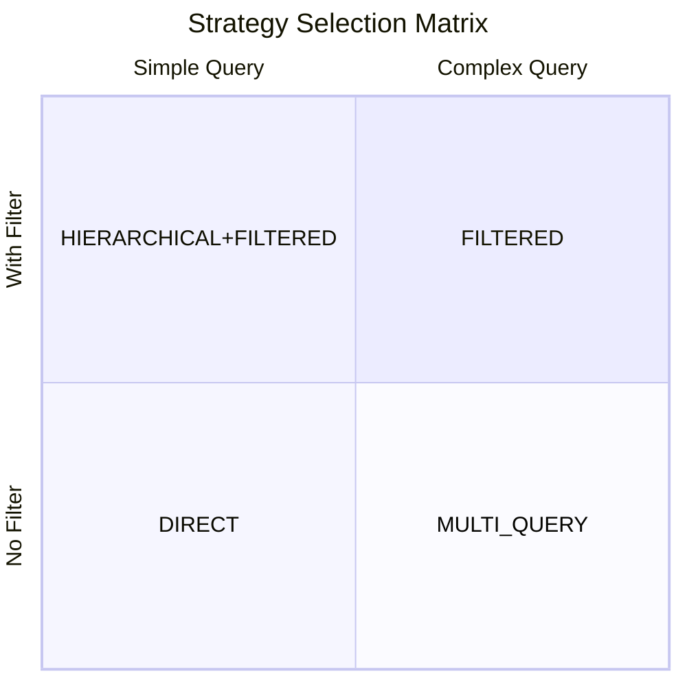

# Chapter 6: Retrieval Strategy & Planning

> Query Planner — let the LLM decide how to search.

## Prerequisites

> 📎 **Reference**: [Distance Metrics](../prerequisites/05_距离度量_en.md)

---

## Learning Objectives

- Understand the four retrieval strategies and their use cases
- Master QueryPlanner design
- Learn to parse LLM-generated retrieval plans

---

## 6.1 The Four Strategies



| Strategy | Scenario | Example | Rounds |
|----------|----------|---------|--------|
| DIRECT | Simple fact | "What is RAG?" | 1 |
| FILTERED | With constraints | "RAG papers from 2024" | 1 |
| MULTI_QUERY | Multi-aspect | "Compare HNSW and IVF" | 1-2 |
| HIERARCHICAL | Broad exploration | "Latest in deep learning" | 2-5 |

---

## 6.2 QueryPlanner Workflow

Priority: tool_call > JSON content:

```
tool_call (reliable):
  {"name": "vector_search", "arguments": {"query": "..."}}
  → deterministic structure, no parsing needed

JSON text (needs cleanup):
  ```json
  {"strategy": "MULTI_QUERY", ...}
  ```
  → requires markdown fence removal, JSON parsing
```

---

## 6.3 Fallback Mechanism

```python
def _fallback_plan(self, question: str) -> RetrievalPlan:
    # When LLM response can't be parsed, degrade to DIRECT
    return RetrievalPlan(
        strategy=SearchStrategy.DIRECT,
        reasoning="Fallback: LLM response parsing failed",
        steps=[SearchStep(query=question, k=10)],
    )
```

---

## Review Questions

1. What advantages does tool_call have over JSON text? What other approaches exist?
2. What happens if the LLM selects the wrong strategy?
3. How should HIERARCHICAL be implemented? What's its core difference from MULTI_QUERY?

## Hands-on Exercises

1. Add `confidence: float` to `RetrievalPlan`
2. Implement a simple HIERARCHICAL strategy
3. Allow the user to override the strategy (skip LLM)
