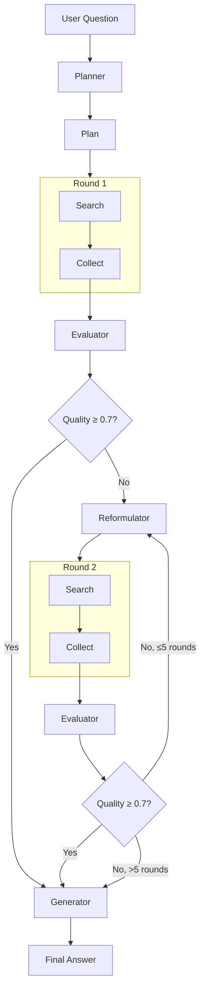

# Chapter 7: Multi-Round Retrieval Engine

> MultiRoundEngine — the core orchestrator of AgenticDB.

## Prerequisites

> 📎 **Reference**: [Search Strategy](../ch06_strategy/06_检索策略_en.md) | [LLM Integration](../ch04_llm/04_LLM集成层_en.md)

---

## Learning Objectives

- Understand the complete multi-round retrieval flow
- Master the quality evaluation mechanism
- Learn query reformulation design patterns

---

## 7.1 Complete Flow



---

## 7.2 Quality Evaluation

Three dimensions scored by LLM:

| Dimension | Meaning | Scale |
|-----------|---------|-------|
| Relevance | Are results related? | 0.0-1.0 |
| Coverage | All aspects covered? | 0.0-1.0 |
| Sufficiency | Enough info to answer? | 0.0-1.0 |

Combined score decides:
```python
score < 0.7  → continue searching
score ≥ 0.7  → stop, generate answer
```

---

## 7.3 Query Reformulation

When results are insufficient, generate better queries:

```python
# Improvement strategies:
1. Synonym substitution: "deep learning" → "neural networks"
2. Add qualifiers: "RAG" → "RAG architecture performance"
3. Change perspective: "What is HNSW" → "HNSW vs IVF"
4. Narrow down: "database" → "vector database performance optimization"
```

---

## Review Questions

1. If round 1 results are excellent (0.9) but round 2 results are poor (0.3), how should the combined score be calculated?
2. `all_results` grows unboundedly, increasing token consumption. How to control this?
3. How to detect when query reformulation is stuck in synonym cycles?

## Hands-on Exercises

1. Add `max_tokens_per_query` limit to `MultiRoundEngine`
2. Implement a `DiversityEvaluator` to stop early when new results are too similar
3. Add JSON serialization to `RetrievalResult` for detailed logging
