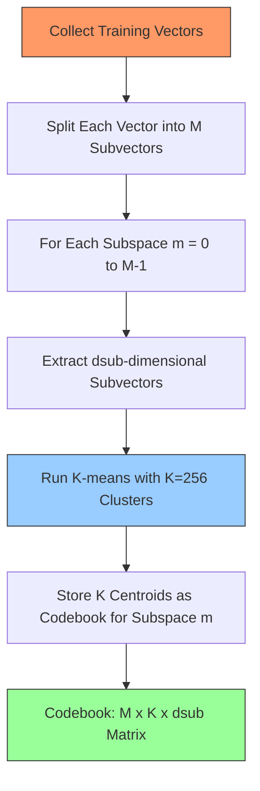
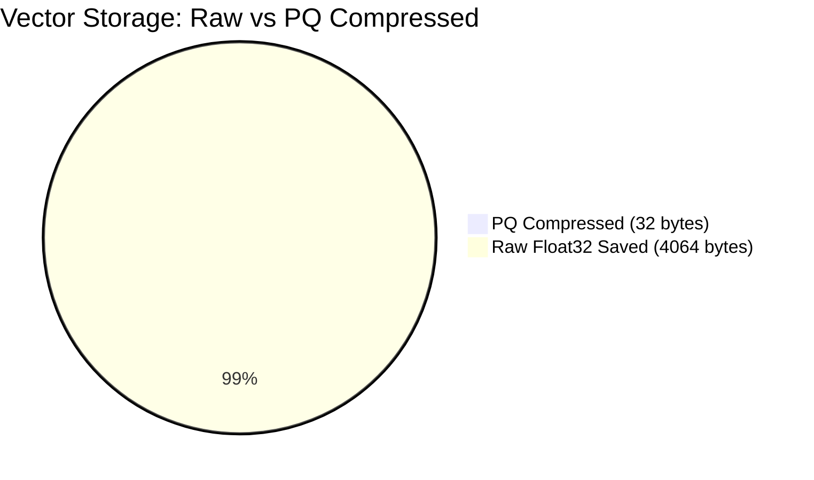
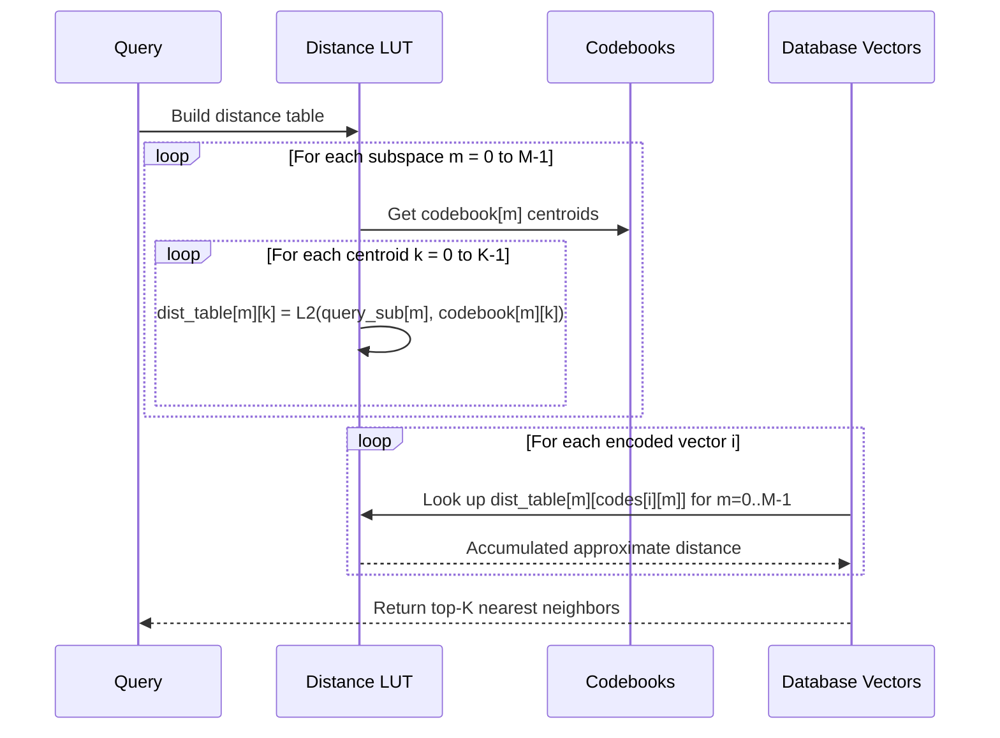

# Chapter 7 — Vector Quantization

## Prerequisites

This chapter assumes familiarity with the following concepts. Review these shared documents before proceeding:

> 📎 **Reference**: [Vector Distance Metrics](../prerequisites/05_向量距离度量_en.md) — L2 (Euclidean) distance used throughout quantization
> 📎 **Reference**: [SIMD & Hardware Optimization](../prerequisites/06_SIMD与硬件优化.md) — SIMD acceleration for distance computations

---

## 7.1 The Problem: You Cannot Afford to Store Everything

Let's do the arithmetic that keeps vector database engineers awake at night.

A modern embedding model produces vectors with 1024 dimensions, each stored as a 32-bit float (4 bytes):

```
1 vector  = 1024 × 4 bytes  = 4,096 bytes  = 4 KB
1 million = 1,000,000 × 4 KB = 4,000,000 KB ≈ 4 GB
```

Four gigabytes — for just one million vectors. Your workstation has maybe 64 GB of RAM. Your high-end GPU has 80 GB. A real-world production system with 100 million vectors needs 400 GB. A billion-vector system needs 4 TB. These numbers exceed the capacity of any single machine's fast memory.

Even if you page the data to an NVMe SSD (sequential read ~6 GB/s, random access ~500K IOPS), each vector read costs 4 KB / 3 MB per IOPS ≈ ~2 microseconds per vector. At a million comparisons per query, that's 1.3 seconds — far too slow for real-time search.

This is the **memory wall**: computing power has grown exponentially (Moore's law), but memory bandwidth and capacity have lagged far behind. The gap between what we can compute and what we can store in fast memory is the fundamental bottleneck of modern systems.

### A Brief Memory Hierarchy Refresher

Computer memory is a hierarchy of progressively larger and slower storage:

| Level | Typical Size | Latency | Bandwidth |
|-------|-------------|---------|-----------|
| L1 cache | 32 KiB | ~1 ns | ~1 TB/s |
| L2 cache | 256 KiB per core | ~4 ns | ~500 GB/s |
| L3 cache | 16 MB (shared) | ~12 ns | ~200 GB/s |
| RAM (DDR5) | 64–256 GB | ~100 ns | ~50 GB/s |
| NVMe SSD | 2–8 TB | ~10 µs | ~6 GB/s |
| HDD | 20 TB | ~10 ms | ~200 MB/s |

Each level is 10–100× slower and 100× larger than the one above it. The key insight: a program that fits in L2 cache runs 25× faster than one that hits RAM, and 100× faster than one that hits SSD.

**Quantization** is the technique we use to push data *up* the memory hierarchy. By compressing vectors from 32-bit floats to 8-bit integers (or fewer), we make them smaller — small enough to fit in a higher level of cache or RAM. The price: we lose precision. Each vector is an approximation of the original. The art of quantization is minimizing the error while maximizing the compression.

### The Color Palette Analogy

Think of quantization like reducing a photograph's color palette. A raw digital photo uses 24 bits per pixel — 16,777,216 possible colors. That's the float32 world: vast, precise, expensive. Now imagine you can only use 256 colors (8 bits per pixel). You pick 256 representative colors and map every pixel to the nearest one. The image still looks recognizable — a human eye can barely tell the difference at normal viewing distance. But the file shrinks by 8×.

That is quantization. You replace a continuous, high-precision signal with a discrete, low-precision approximation drawn from a fixed set of representative values. The set of representative values is called a **codebook**. The process of choosing the codebook is called **training**. The process of mapping a new value to its nearest codebook entry is called **encoding**.

Vector quantization does the same thing for embeddings: we lose some fidelity in the distance computations, but the overall ranking of nearest neighbors remains nearly identical. The JPEG analogy is apt — JPEG compresses images to 1/20th their size with imperceptible loss; vector quantization compresses embeddings to 1/4th–1/64th their size with tolerable loss in search quality.

## 7.2 Scalar Quantization (SQ): The Simplest Compression

**Scalar quantization** is the most straightforward form: quantize each dimension independently. Each dimension is treated as a separate signal with its own range and its own quantization levels.

### The Algorithm

For a dataset of N vectors, each D-dimensional:

1. **Training**: for each dimension d (0 to D-1), find the minimum value `min[d]` and maximum value `max[d]` across all N vectors. This step requires a single pass over the training data — O(N × D) time.

2. **Encoding**: for a vector `v`, compute for each dimension:
   ```
   normalized = (v[d] - min[d]) / (max[d] - min[d])    // maps to [0, 1]
   code[d] = round(normalized × 255)                     // maps to [0, 255]
   ```
   The `round` function maps the continuous value to the nearest integer in [0, 255]. This is the **quantization step**: the moment where precision is discarded.

3. **Decoding**: reconstruct the approximate value:
   ```
   approx[d] = min[d] + (code[d] / 255.0) × (max[d] - min[d])
   ```
   The reconstructed vector is an approximation of the original. The difference between them is the **quantization error** — the information lost during compression.

### Why 255?

A `uint8_t` stores values 0 through 255 — that's 256 distinct levels. Each level represents (max[d] - min[d]) / 255 of the original range. The maximum quantization error per dimension is half a bucket:

```
max_error_per_dim = (max[d] - min[d]) / (2 × 255) = (max[d] - min[d]) / 510
```

For a typical embedding with values in [-2, 2], the per-dimension error is at most 4/510 ≈ 0.008. Across 1024 dimensions, the L2 error accumulates — but in practice, recall@10 remains above 99% for most datasets.

### Compression Ratio

Float32: 4 bytes per dimension.
Int8: 1 byte per dimension.
**Compression ratio: 4×**.

This is the "free lunch" of quantization. 4× smaller, nearly identical recall, fast encode/decode (just multiply-add). If you can afford 1 byte per dimension (1 GB for 1M × 1024-dim vectors), SQ is almost always the right answer.

### Code Sketch

```cpp
void ScalarQuantizer::Train(const float* vectors, size_t N, size_t D) {
    mins_.resize(D,  INFINITY);
    maxs_.resize(D, -INFINITY);
    for (size_t i = 0; i < N * D; i++) {
        mins_[i % D] = std::min(mins_[i % D], vectors[i]);
        maxs_[i % D] = std::max(maxs_[i % D], vectors[i]);
    }
}

void ScalarQuantizer::Encode(const float* vec, uint8_t* out) const {
    for (size_t d = 0; d < D_; d++) {
        float norm = (vec[d] - mins_[d]) / (maxs_[d] - mins_[d]);
        out[d] = static_cast<uint8_t>(norm * 255.0f);
    }
}
```

Distance computation: decode the stored uint8 vector to float32 (or directly compute in int domain), then compute L2 distance against the query. The decode step is O(D) — cheap, but still O(D) per comparison.

### The Limitation

SQ treats each dimension as independent. But real embedding vectors have **correlated dimensions** — dimension 0 and dimension 1 might carry related information. SQ ignores this structure. It compresses each dimension to 8 bits regardless of whether those bits are actually needed. This wastes capacity on dimensions that are redundant and under-allocates capacity on dimensions that carry unique information.

For 4× compression, SQ is fine. For 16× or 64× compression, we need a method that exploits the structure *between* dimensions.

## 7.3 Product Quantization (PQ): Divide, Quantize, Compress

If 4× compression isn't enough (and for billion-scale datasets, it usually isn't), we need something more aggressive. **Product Quantization**, introduced by Jégou, Douze, and Schmid in 2010, achieves 16–64× compression by decomposing the problem.

### Terminology: Every Concept Defined

Before diving in, let's define every term we'll use:

- **Vector**: a point in high-dimensional space, typically the output of a neural network embedding. For us, a 1024-dimensional float32 array.

- **Dimension**: a single coordinate of a vector. A 1024-dim vector has 1024 dimensions, each a float32 value.

- **Quantization**: replacing a continuous-valued signal with a discrete approximation drawn from a finite set of representative values. The set of representative values is called a **codebook**.

- **Codebook**: the set of representative vectors used for quantization. In PQ, each subspace has its own codebook containing K centroids.

- **Centroid**: a single representative vector in a codebook. It is the "average" of all training vectors assigned to a particular cluster. The term comes from geometry — the centroid of a set of points is their arithmetic mean, analogous to the center of mass.

- **Subvector**: a contiguous slice of a vector. If we split a 1024-dim vector into 32 subvectors, each subvector is a 32-dim slice. This is the unit that PQ quantizes independently.

- **Subspace**: the lower-dimensional space that a subvector lives in. If the original vector is in ℝ^1024, a 32-dim subvector lives in ℝ^32 — a subspace.

- **K-means**: a clustering algorithm that partitions N points into K groups (clusters) by iteratively assigning points to the nearest centroid and recomputing centroids as the mean of assigned points. The goal is to minimize the within-cluster sum of squares (WCSS).

- **Lloyd's algorithm**: the specific iterative procedure underlying k-means, invented by Stuart Lloyd at Bell Labs in 1957 (classified, not published until 1982). It alternates between two steps: (1) assign each point to its nearest centroid, (2) recompute each centroid as the mean of its assigned points.

- **Voronoi cell**: the region of space consisting of all points closer to a particular centroid than to any other centroid. In k-means, the assignment step is equivalent to partitioning space into Voronoi cells, and the update step moves each centroid to the center of its Voronoi cell.

- **Reconstruction error**: the distance (typically L2) between the original vector and the vector reconstructed from its quantized representation. Lower reconstruction error means the quantization preserves more information.

- **Subvector**: same as a sub-vector — a contiguous block of dimensions from the original vector. In PQ, each subvector is quantized independently.

- **PQ code**: the compressed representation of a vector under Product Quantization. It is a sequence of M bytes, where each byte is the index of the nearest centroid in the corresponding subspace's codebook.

- **Byte-packing**: the act of storing multiple small integers into bytes. Since K=256 centroids fit in one byte (uint8_t), each subspace's centroid index occupies exactly one byte. M subspaces yield M bytes total.

- **Lookup table**: in ADC, a precomputed table of distances from the query to every centroid in every subspace. This table converts an O(D) distance computation into an O(M) table lookup.

### The Key Idea: Divide and Quantize

Instead of quantizing the entire 1024-dimensional vector as one unit, PQ splits it into M equal **subvectors**, each of dimension `dsub = D / M`. Each subvector is quantized independently using k-means clustering with K centroids.

```
Original vector (D=1024, M=32, dsub=32):
[v0..v31 | v32..v63 | v64..v95 | ... | v992..v1023]
  sub 0     sub 1     sub 2           sub 31

Quantized (M=32, K=256):
[  c42  |  c7   |  c31  | ... |  c15  ]
 1 byte   1 byte   1 byte       1 byte
```

The compressed representation: M bytes (one byte per subvector, indexing K=256 centroids).

### PQ Training Process



Now the memory math for our running example:

```
Original size:  D × 4 = 1024 × 4 = 4,096 bytes per vector
Compressed size: M × 1 = 32 × 1  = 32 bytes per vector
Compression ratio: 4096 / 32 = 128×
```

One million vectors: 4 GB compressed to 32 MB. That fits in L3 cache on most modern CPUs.

### Memory Savings Visualization



### Why Does PQ Work?

The insight is counterintuitive: the Cartesian product of M small codebooks creates an exponentially large *effective* codebook. With M=32 subspaces and K=256 centroids each, the total number of possible quantized vectors is:

```
K^M = 256^32 = 2^256 ≈ 10^77
```

That approaches the order of magnitude of atoms in the observable universe (~10^80). The space is astronomically large enough to represent fine distinctions, even though each vector is stored in just 32 bytes.

The catch: not all combinations are equally good. The centroids are trained independently per subspace, so the reconstructed vector is the concatenation of the nearest centroid from each subspace. There's no global constraint ensuring that the concatenated result is the true nearest centroid in the full 1024-dimensional space. This is the **PQ encoding error** — the L2 distance between the original vector and its reconstruction.

### The PQ Pipeline

1. **Training**: for each subspace m (0 to M-1):
   - Extract the dsub-dimensional subvectors from all training vectors.
   - Run k-means with K clusters on these subvectors.
   - Store the K centroids as the codebook for subspace m.

2. **Encoding**: for a new vector:
   - Split into M subvectors.
   - For each subvector, find the nearest centroid in that subspace's codebook.
   - Store the centroid index (0–255) as one byte.

3. **Search**: we'll cover this in the ADC section below.

### A Historical Note: From Scalar to PQ to OPQ

The progression of quantization methods follows a clear intellectual arc:

**Scalar Quantization (1940s–1980s)**: the oldest technique, rooted in signal processing and PCM (Pulse Code Modulation) for telephone systems. Each sample is quantized independently. Simple, fast, but ignores inter-dimensional correlations. Used in early information retrieval for document vectors.

**Product Quantization (2010)**: Jégou, Douze, and Schmid realized that splitting high-dimensional vectors into independent subspaces and quantizing each separately yields exponential compression with manageable error. The key insight was that the *product* of small codebooks creates a large effective codebook. This made billion-scale vector search feasible for the first time.

**Optimized Product Quantization / OPQ (2013)**: Ge et al. noticed that PQ's performance degrades when dimensions within a subspace are highly correlated. The fix: apply a **rotation matrix** (a linear transformation) to the vectors *before* PQ encoding. The rotation is optimized during training to minimize reconstruction error. OPQ rotates the vector space so that each subspace captures an approximately independent direction, reducing the correlation that hurts PQ. The rotation is a fixed matrix — it costs nothing at query time beyond a single matrix-vector multiply.

The trajectory: SQ → PQ → OPQ. Each step addresses the previous method's limitation. SQ ignores inter-dimensional structure; PQ exploits it but assumes independent subspaces; OPQ explicitly optimizes the subspace decomposition.

## 7.4 K-means Clustering: The Engine Under PQ

K-means is the workhorse of vector quantization. It's simple, fast, and works well for the subspace distributions that embeddings produce. But it has a fascinating history and subtle properties.

### What Is k-means?

Given N points in d-dimensional space and a target number of clusters K, k-means finds K points (centroids) that minimize the sum of squared distances from each point to its nearest centroid. This sum is called the **Within-Cluster Sum of Squares** (WCSS):

```
WCSS = Σ_i ||x_i - centroid(assignment[i])||²
```

The WCSS measures how well the centroids represent the data. Lower WCSS means tighter, more representative clusters.

### Lloyd's Algorithm (1957, published 1982)

Stuart Lloyd invented the most common k-means algorithm at Bell Labs in 1957, but it was classified and only published in 1982. The algorithm alternates between two steps:

1. **Assignment step**: assign each point to the nearest centroid. This partitions the space into **Voronoi cells** — regions where every point in a cell is closer to that cell's centroid than to any other centroid.

2. **Update step**: recompute each centroid as the mean (arithmetic average) of its assigned points. This moves each centroid to the center of its Voronoi cell.

Each iteration strictly decreases (or leaves unchanged) the WCSS. Since WCSS is bounded below by 0, the algorithm converges — but to a **local minimum**, not necessarily the global one. The quality of the local minimum depends heavily on initialization.

### Step-by-Step Convergence

Here is what happens geometrically during k-means, iteration by iteration:

**Iteration 0 (Initialization)**: K centroids are placed at initial positions (random or k-means++). The space is partitioned into K Voronoi cells. Most points are probably assigned to the wrong centroid.

**Iteration 1**: Each centroid moves to the center of its Voronoi cell. The Voronoi boundaries shift. Some points switch assignments. The WCSS drops significantly — this is usually the largest improvement.

**Iteration 2–5**: Centroids continue to migrate toward the true cluster centers. Points near Voronoi boundaries flip assignments. WCSS decreases with each iteration, but the improvements shrink.

**Iteration 6+**: Fewer and fewer points change assignments. The centroids barely move. The algorithm is converging. When no point changes assignment between iterations, the algorithm has reached a fixed point.

**Convergence guarantee**: the WCSS decreases monotonically. Since it is bounded below by 0, the algorithm must terminate. In practice, k-means converges in 10–30 iterations for well-separated clusters.

**The local minimum problem**: k-means can converge to different solutions depending on initialization. Two runs with different seeds may produce different clusterings. The WCSS tells you which is better — always run k-means multiple times (3–5) and keep the run with the lowest WCSS.

```cpp
void KMeans(const float* data, size_t N, size_t D, size_t K,
            float* centroids, int max_iters = 25) {

    // Assignment
    for (size_t i = 0; i < N; i++) {
        float best = INFINITY;
        for (size_t k = 0; k < K; k++) {
            float dist = L2Sqr(data + i * D, centroids + k * D, D);
            if (dist < best) { best = dist; assignments[i] = k; }
        }
    }
    // Update
    std::vector<float> sum(K * D, 0);
    std::vector<int> cnt(K, 0);
    for (size_t i = 0; i < N; i++) {
        int c = assignments[i];
        for (size_t d = 0; d < D; d++) sum[c * D + d] += data[i * D + d];
        cnt[c]++;
    }
    for (size_t k = 0; k < K; k++)
        if (cnt[k] > 0)
            for (size_t d = 0; d < D; d++)
                centroids[k * D + d] = sum[k * D + d] / cnt[k];
}
```

### k-means++ Initialization (2007)

Random initialization can produce bad clusterings (some centroids land in low-density regions, nearby points claim everything, remote centroids starve). David Arthur and Sergei Vassilvitskii solved this with **k-means++**:

1. Choose the first centroid uniformly at random from the data.
2. For each subsequent centroid: choose a data point with probability proportional to its squared distance from the nearest *already-chosen* centroid.
3. Repeat until K centroids are chosen.

Intuition: points far from existing centroids are more likely to be chosen. This spreads the initial centroids across the data, avoiding the "two centroids in the same cluster" failure mode. k-means++ achieves O(log K) competitive ratio to the optimal clustering, compared to no guarantees for random initialization.

### Practical Notes for PQ

- For PQ training, run k-means independently per subspace. Each subspace has dsub dimensions and K clusters.
- With K=256, dsub=32, N=10000 training vectors per subspace: each k-means iteration costs N × K × dsub ≈ 80M operations. That's ~4 ms on a modern CPU. 25 iterations × 32 subspaces = ~3 seconds for training. Fast.
- Always run k-means 3–5 times with different seeds and pick the run with the lowest WCSS. The stability of the result is a good indicator of whether K is appropriate.

## 7.5 Asymmetric Distance Computation (ADC)

Now for the elegant part: how do we search PQ-encoded vectors efficiently?

### Terminology: ADC and SDC Defined

- **ADC (Asymmetric Distance Computation)**: a search method where the query remains in full float32 precision, but the database vectors are PQ-encoded. The "asymmetry" refers to the fact that the two sides of the distance computation are treated differently — one is exact, the other is quantized.

- **SDC (Symmetric Distance Computation)**: a search method where *both* the query and the database vectors are PQ-encoded. The "symmetry" means both sides undergo the same quantization process.

- **Distance table**: in ADC, a precomputed matrix of size M × K where entry [m][k] holds the L2 distance from the query's m-th subvector to the k-th centroid in subspace m's codebook. Building this table costs O(M × K × dsub) — done once per query.

- **Residual**: in quantization, the residual is the difference between the original vector and its quantized reconstruction: `residual = original - reconstructed`. The reconstruction error is the norm of this residual. PQ minimizes the expected residual norm.

- **Reconstruction**: the approximate vector obtained by decoding a quantized representation. For PQ, reconstruction means replacing each centroid index with the corresponding centroid vector and concatenating the results.

### The Naive Approach (Don't Do This)

```cpp
// For each database vector:
for each i:
    decoded = reconstruct(codes[i])  // M × dsub multiply-adds
    dist = L2(query, decoded)        // D multiply-adds
```

This is O(N × D) — no better than brute force. We've compressed the storage but not the search.

### ADC: Precompute, Then Look Up

The key observation: the query vector doesn't change during a search. We can precompute its distance to every centroid in every subspace **once**, then look up distances from a table for each database vector.

### ADC Search Process



```
Step 1: Build distance table
  For each subspace m (0 to M-1):
    For each centroid k (0 to K-1):
      dist_table[m][k] = L2(query_sub[m], codebook[m][k])

Step 2: Scan database
  For each encoded vector i:
    dist = 0
    For each subspace m (0 to M-1):
      dist += dist_table[m][codes[i][m]]
    // dist is the approximate L2 distance from query to vector i
```

Step 1 costs O(M × K × dsub). With M=32, K=256, dsub=32: ~260K multiply-adds — negligible.

Step 2 costs O(M) per database vector. With M=32: 32 table lookups + 32 additions per comparison. Compare this to O(D) = O(1024) for exact L2 distance. That's a **32× speedup in distance computation**, on top of the storage compression.

```cpp
class PQIndex {
    std::vector<std::vector<std::vector<float>>> codebooks_;  // [M][K][dsub]
    std::vector<std::vector<uint8_t>> codes_;                 // [N][M]
    int M_, K_, dsub_, D_;

public:
    void Search(const float* query, int top_k,
                std::vector<std::pair<float, int>>* results) {
        // Build distance table
        std::vector<std::vector<float>> dist_table(M_, std::vector<float>(K_));
        for (int m = 0; m < M_; m++) {
            const float* sub_q = query + m * dsub_;
            for (int k = 0; k < K_; k++) {
                dist_table[m][k] = L2Sqr(sub_q, codebooks_[m][k].data(), dsub_);
            }
        }
        // Scan and accumulate
        std::vector<std::pair<float, int>> heap;
        for (size_t i = 0; i < codes_.size(); i++) {
            float dist = 0;
            for (int m = 0; m < M_; m++)
                dist += dist_table[m][codes_[i][m]];
            // Maintain top-k heap
            if (heap.size() < top_k) {
                heap.push_back({dist, i});
                std::push_heap(heap.begin(), heap.end());
            } else if (dist < heap[0].first) {
                std::pop_heap(heap.begin(), heap.end());
                heap.back() = {dist, i};
                std::push_heap(heap.begin(), heap.end());
            }
        }
        *results = heap;
    }
};
```

### Why ADC Beats SDC: A Geometric Explanation

Consider two vectors in a 2D subspace. The true query vector is `q = (3.0, 4.0)`. The true database vector is `x = (3.2, 3.8)`. The true L2 distance is `||q - x|| = sqrt(0.04 + 0.04) ≈ 0.283`.

**ADC**: the query is exact. The database vector is quantized to its nearest centroid `c_x = (3.0, 4.0)`. The distance table stores `||q - c_x|| = 0`. The ADC distance is 0 — an underestimate, but the *direction* of error is consistent: ADC always underestimates distance (the reconstructed centroid is closer to the query than the original vector might be, on average). The ranking is preserved because the error is systematic.

**SDC**: the query is also quantized to its nearest centroid `c_q = (3.0, 4.0)`. The database vector is quantized to `c_x = (3.0, 4.0)`. The SDC distance is `||c_q - c_x|| = 0`. But now there are *two* sources of error: the query quantization error AND the database quantization error. These errors are independent and can compound.

Geometrically: ADC measures distance from the exact query point to the nearest centroid of each database vector. SDC measures distance between two centroids — both the query and database centroids. The centroid-to-centroid distance discards information from *both* sides, while ADC preserves full information on the query side.

Imagine you're standing at a precise GPS coordinate (the query) and measuring distance to a building (the database vector). ADC is like using a laser rangefinder to measure from your exact position to the building's address (centroid). SDC is like using a map: you look up YOUR address (centroid of your area) and the building's address (centroid of its area), then measure between the two addresses. Both methods have error, but ADC's error comes from only one side (the building's address vs. its actual location), while SDC's error comes from both sides.

**Rule of thumb**: always use ADC for search. Use SDC only when you need to compare two sets of encoded vectors (e.g., clustering centroids against the database) where both sides are already quantized.

### The Encoding Error

Every PQ-encoded vector is an approximation. The error — the L2 distance between the original vector and its reconstruction — depends on:

- **dsub** (subspace dimension): smaller dsub means each subspace has less structure to capture. dsub ≥ 8 is recommended; dsub < 8 produces poor k-means clusters with high reconstruction error.
- **K** (centroids per subspace): more centroids = finer granularity = lower error. But K=256 fits in 1 byte; K=65536 requires 2 bytes (halving compression).
- **M** (number of subspaces): M = D / dsub. More subspaces means more compression (M bytes per vector) but more approximation error (each subspace is quantized independently).

### Residual and Byte-Packing

Two additional concepts that complete the PQ picture:

- **Residual quantization**: a related technique where the quantization error (residual) of one stage is quantized by a second stage, then a third, and so on. Each stage reduces the residual. This is the basis of **Residual Quantization (RQ)**, an alternative to PQ that can achieve similar compression with different error characteristics.

- **Byte-packing**: the act of packing M centroid indices (each 0–255) into M bytes. This is trivial in C++ (`uint8_t codes[M]`), but the concept matters for storage: PQ codes are compact, fixed-size, and cache-friendly. A 32-byte PQ code fits in a single cache line. Reading 32 bytes from L1 cache takes ~1 ns. Reading 4096 bytes (the original float32 vector) takes ~100 ns from RAM. The compression doesn't just save space — it makes the data faster to access.

## 7.6 PQ Parameter Guide

Given dimension D and memory budget B bytes per vector:

| D | M | dsub | K | Bytes/vec | Compression vs float32 | Notes |
|---|---|------|---|---|---|---|
| 1024 | 32 | 32 | 256 | 32 | 128× | Our running example |
| 128 | 8 | 16 | 256 | 8 | 16× | Good baseline |
| 128 | 16 | 8 | 256 | 16 | 8× | Finer granularity, better recall |
| 128 | 4 | 32 | 256 | 4 | 32× | Aggressive compression, lower recall |
| 768 | 48 | 16 | 256 | 48 | 16× | Large dim, balanced |
| 768 | 96 | 8 | 256 | 96 | 8× | dsub=8 is often the sweet spot |
| 1536 | 96 | 16 | 256 | 96 | 16× | Very large embeddings |

**Rules of thumb**:
- **dsub ≥ 8**: subspaces with fewer than 8 dimensions have too little structure for k-means to find meaningful clusters.
- **K = 256 is standard**: fits in one byte, enough centroids for dsub ≤ 16. For dsub > 16, consider K=65536 (2 bytes).
- **Training data**: at minimum K × 10 vectors per subspace. For K=256: 2560 training vectors. More is better — FAISS uses 30K–100K for PQ training.
- **M = D / dsub**: the number of subspaces determines compression. 8 bytes/vector at D=128 (M=8, dsub=16, 1 byte each). 48 bytes/vector at D=768 (M=48, dsub=16).

### Memory Budget Worked Example

Suppose you have 100 million 1024-dim vectors and a 10 GB RAM budget (for the vectors, excluding the index overhead):

```
Bytes per vector = 10 GB / 100M = 100 bytes
Target compression: (1024 × 4) / 100 = 40.96×
Try: M=32, dsub=32, K=256 → 32 bytes/vector → 128× compression → 3.2 GB
Try: M=64, dsub=16, K=256 → 64 bytes/vector → 64× compression → 6.4 GB
Both fit. The 64-byte option gives better recall (more subspaces, finer granularity).
```

---

## Code Exercise

### Part A — K-means on Synthetic 2D Data

Generate 500 points from 3 Gaussian clusters, run k-means, visualize:

```cpp
#include <random>
#include <vector>

std::vector<std::array<float, 2>> GenerateData() {
    std::mt19937 rng(42);
    std::normal_distribution<float> n;
    std::vector<std::array<float, 2>> data;

    // Cluster 1: centered at (2, 2)
    for (int i = 0; i < 150; i++)
        data.push_back({2.0f + n(rng) * 0.5f, 2.0f + n(rng) * 0.5f});
    // Cluster 2: centered at (-2, -1)
    for (int i = 0; i < 200; i++)
        data.push_back({-2.0f + n(rng) * 0.7f, -1.0f + n(rng) * 0.7f});
    // Cluster 3: centered at (0, -3)
    for (int i = 0; i < 150; i++)
        data.push_back({ 0.0f + n(rng) * 0.4f, -3.0f + n(rng) * 0.4f});

    return data;
}
```

**Tasks**:
1. Implement `KMeans` for 2D data with `K=3`.
2. Output CSV: `x, y, cluster_id, centroid_x, centroid_y`.
3. Plot with Python/matplotlib or any tool — color points by cluster, mark centroids with an 'X'.
4. Run 10 times with different random seeds. Does k-means always find the same 3 clusters? Compute WCSS for each run.

### Part B — Product Quantization

Implement PQ with M=4 subspaces on 16-dimensional vectors:

```cpp
class ProductQuantizer {
public:
    ProductQuantizer(int D, int M)
        : D_(D), M_(M), dsub_(D / M), K_(256) {
        codebooks_.resize(M_, std::vector<std::vector<float>>(K_, std::vector<float>(dsub_)));
    }

    void Train(const float* vectors, size_t N);
    void Encode(const float* vec, uint8_t* codes) const;
    float ADCDistance(const float* query, const uint8_t* codes,
                      const std::vector<std::vector<float>>& dist_table) const;
    void PrecomputeDistTable(const float* query,
                             std::vector<std::vector<float>>* dist_table) const;

private:
    int D_, M_, dsub_, K_;
    std::vector<std::vector<std::vector<float>>> codebooks_;
};
```

**Tasks**:
1. Generate 10000 random 16-dimensional vectors as "database" and 100 as "queries".
2. Train PQ on the database: for each of the M=4 subspaces, run k-means with K=256 on the subspace slices.
3. Encode all database vectors to M-byte codes.
4. Compute **true top-10** neighbors for each query using brute-force float32 L2.
5. Compute **ADC top-10** using your PQ codes + dist table.
6. Report **Recall@10** = (# common neighbors between ADC top-10 and true top-10) / 10, averaged over queries.

### Part C — SQ vs PQ Comparison

Add Scalar Quantization encoding. For each query, compute:
- Exact top-10 (ground truth)
- SQ top-10 (decode then compute L2)
- PQ top-10 (ADC)

Report for both methods: recall@10, average query latency (ms), bytes per vector. Which gives the better recall-per-byte trade-off on your synthetic data?

---

## Thought Questions

1. **Why does ADC give better recall than SDC?** Explain in terms of quantization error accumulation. Where does the extra error in SDC come from? Think geometrically: ADC measures from the exact query to an approximate database point; SDC measures from an approximate query to an approximate database point. Two approximations compound.

2. **PQ trains codebooks on a sample dataset. What happens if the query distribution differs from the training distribution?** Think about out-of-distribution embeddings in a production system where the data evolves over time. The codebook was trained on old data; new data may cluster differently, leading to higher reconstruction error.

3. **How would you extend PQ to support inner product (dot product) similarity instead of L2?** The ADC precompute table changes. Derive the expression for the dot product approximation. Hint: `⟨q, x⟩ ≈ Σ_m ⟨q_sub[m], codebook[m][codes[m]]⟩`.

4. **K-means is O(NKD) per iteration. With N=10^6, K=256, D=32, that's ~8 billion operations per iteration. How can you accelerate it?** Consider SIMD vectorization (AVX2 can do 8 floats at once), mini-batch assignment (sample a subset for assignment), and inverted-file indexing (precompute which centroids are nearby).

5. **Suppose you have 10M 1024-dim vectors and want ≤ 8 bytes per vector in RAM. What PQ parameters would you choose, and what dsub does that imply?** Check whether dsub is reasonable — if not, what alternatives exist (OPQ, IVFPQ)? With 8 bytes and K=256 (1 byte each), you get M=8 subspaces and dsub=128. That's a large subspace — k-means with K=256 on 128-dim space may underfit. OPQ could help by rotating the space to reduce effective dimensionality before splitting.

---

## References

- Jégou, Hervé, Matthijs Douze, and Cordelia Schmid. "Product quantization for nearest neighbor search." *IEEE Transactions on Pattern Analysis and Machine Intelligence* 33.1 (2010): 117–128. (The original PQ paper.)
- Ge, Tiezheng, et al. "Optimized product quantization." *IEEE TPAMI* 36.4 (2013): 744–755. (OPQ — rotation before PQ to reduce subspace correlation.)
- Arthur, David, and Sergei Vassilvitskii. "k-means++: The advantages of careful seeding." *Proceedings of SODA*, 2007.
- Lloyd, Stuart P. "Least squares quantization in PCM." *IEEE Transactions on Information Theory* 28.2 (1982): 129–137. (The original k-means algorithm, written in 1957, published 25 years later.)
- FAISS PQ documentation: https://github.com/facebookresearch/faiss/wiki/Faiss-building-blocks
