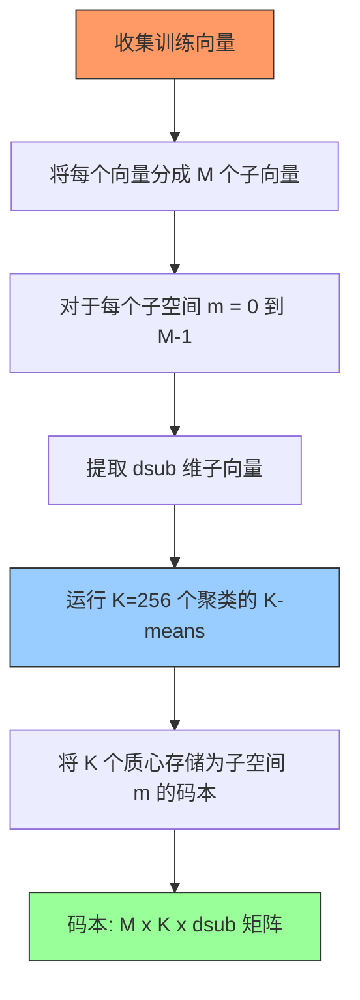
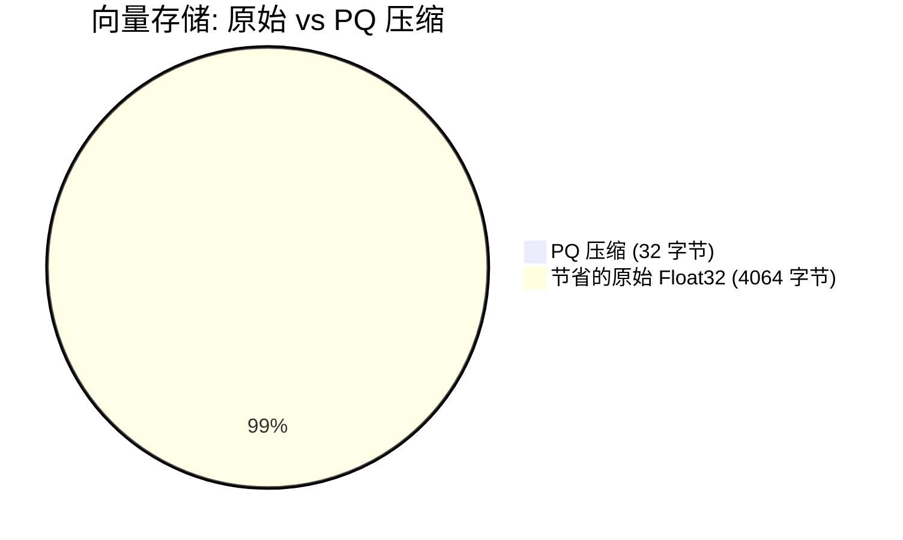
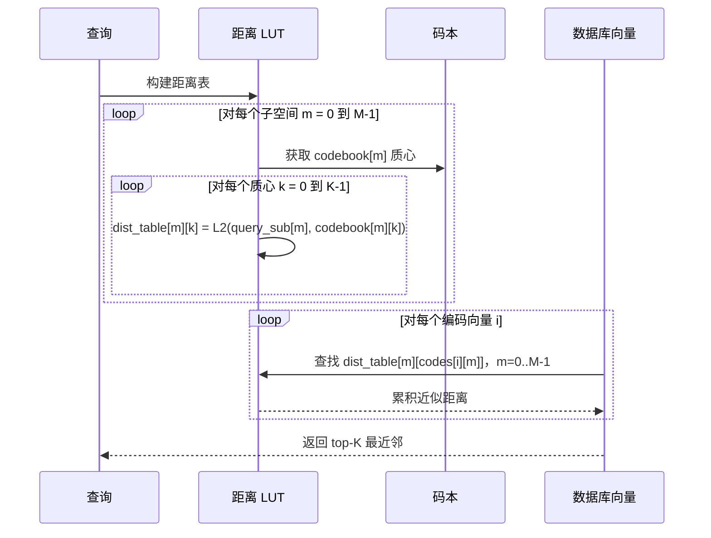

# 第7章 — 向量量化

## 前置知识

> 📎 **参考**: [SIMD与硬件优化](../prerequisites/06_SIMD与硬件优化.md) — 内存层次结构、缓存层级和硬件特性。
> 📎 **参考**: [向量距离度量](../prerequisites/05_向量距离度量.md) — L2、内积、余弦距离的定义。

---

## 7.1 问题：你负担不起存储一切的代价

让我们来算一笔让向量数据库工程师夜不能寐的算术题。

一个现代嵌入模型生成 1024 维的向量，每个维度存储为 32 位浮点数（4 字节）：

```
1 个向量  = 1024 × 4 字节  = 4,096 字节  = 4 KB
100 万    = 1,000,000 × 4 KB = 4,096,000 KB ≈ 4 GB
```

四 GB——仅仅用于一百万个向量。你的工作站可能有 64 GB 内存。你的高端 GPU 有 80 GB。一个拥有 1 亿个向量的真实生产系统需要 400 GB。一个十亿向量的系统需要 4 TB。这些数字超出了任何单台机器快速存储的容量。

即使你将数据分页到 NVMe SSD（顺序读取约 6 GB/s，随机访问约 500K IOPS），每次向量读取成本为 每次随机读取约 2 微秒（500K IOPS 意味着每次读取 1/500,000 秒）。以每次查询一百万次比较计算，那是 1.3 秒——对于实时搜索来说太慢了。

这就是**内存墙**：计算能力呈指数增长（摩尔定律），但内存带宽和容量远远落后。我们能计算的和能在快速存储中存储的之间的差距是现代系统的基本瓶颈。

> 📎 **参考**: [SIMD与硬件优化](../prerequisites/06_SIMD与硬件优化.md) — 详细的内存层次结构（L1/L2/L3 缓存、RAM、SSD、HDF）及其延迟和带宽特性。

**量化**是我们用来将数据*向上推*内存层次结构的技术。通过将向量从 32 位浮点数压缩为 8 位整数（或更少），我们使它们变小——小到可以适合更高层次的缓存或 RAM。代价：我们失去精度。每个向量都是原始的近似值。量化的艺术是在最小化误差的同时最大化压缩。

### 调色板类比

把量化想象成减少照片的调色板。原始数码照片使用每像素 24 位——16,777,216 种可能的颜色。这就是 float32 的世界：广阔、精确、昂贵。现在想象你只能使用 256 种颜色（每像素 8 位）。你选择 256 种代表色，并将每个像素映射到最近的一种。图像看起来仍然可以识别——人眼在正常观看距离下几乎分辨不出区别。但文件缩小了 8 倍。

这就是量化。你用从固定代表值集中抽取的离散、低精度近似值替换连续、高精度的信号。代表值集称为**码本**。选择码本的过程称为**训练**。将新值映射到其最近码本条目的过程称为**编码**。

向量量化对嵌入做同样的事情：我们在距离计算中失去一些保真度，但最近邻的整体排序几乎保持不变。JPEG 的类比很恰当——JPEG 将图像压缩到 1/20 大小，损失不可察觉；向量量化将嵌入压缩到 1/4 到 1/64 大小，搜索质量损失可容忍。

## 7.2 标量量化（SQ）：最简单的压缩

**标量量化**是最直接的形式：独立量化每个维度。每个维度被视为具有自己的范围和量化级别的独立信号。

### 算法

对于一个有 N 个向量、每个 D 维的数据集：

1. **训练**：对于每个维度 d（0 到 D-1），在所有 N 个向量中找到最小值 `min[d]` 和最大值 `max[d]`。此步骤需要对训练数据进行单次遍历——O(N × D) 时间。

2. **编码**：对于向量 `v`，计算每个维度：
   ```
   normalized = (v[d] - min[d]) / (max[d] - min[d])    // maps to [0, 1]
   code[d] = round(normalized × 255)                     // maps to [0, 255]
   ```
   `round` 函数将连续值映射到 [0, 255] 中最近的整数。这是**量化步骤**：精度被丢弃的时刻。

3. **解码**：重构近似值：
   ```
   approx[d] = min[d] + (code[d] / 255.0) × (max[d] - min[d])
   ```
   重构的向量是原始的近似值。它们之间的差异是**量化误差**——压缩过程中丢失的信息。

### 为什么是 255？

`uint8_t` 存储值 0 到 255——即 256 个不同级别。每个级别代表 (max[d] - min[d]) / 255 的原始范围。每个维度的最大量化误差是半个桶：

```
max_error_per_dim = (max[d] - min[d]) / (2 × 255) = (max[d] - min[d]) / 510
```

对于值在 [-2, 2] 的典型嵌入，每个维度的误差最多为 4/510 ≈ 0.008。在 1024 个维度上，L2 误差会累积——但在实践中，大多数数据集的 recall@10 仍保持在 99% 以上。

### 压缩比

Float32：每维度 4 字节。
Int8：每维度 1 字节。
**压缩比：4 倍**。

这是量化的"免费午餐"。缩小 4 倍，几乎相同的召回率，快速编码/解码（只需乘加）。如果你能负担每维度 1 字节（1M × 1024 维向量为 1 GB），SQ 几乎总是正确答案。

### 代码草图

```cpp
void ScalarQuantizer::Train(const float* vectors, size_t N, size_t D) {
    mins_.resize(D,  INFINITY);
    maxs_.resize(D, -INFINITY);
    for (size_t i = 0; i < N * D; i++) {
        mins_[i % D] = std::min(mins_[i % D], vectors[i]);
        maxs_[i % D] = std::max(maxs_[i % D], vectors[i]);
    }
}

void ScalarQuantizer::Encode(const float* vec, uint8_t* out) const {
    for (size_t d = 0; d < D_; d++) {
        float norm = (vec[d] - mins_[d]) / (maxs_[d] - mins_[d]);
        out[d] = static_cast<uint8_t>(norm * 255.0f);
    }
}
```

距离计算：将存储的 uint8 向量解码为 float32（或直接在 int 域中计算），然后计算与查询的 L2 距离。解码步骤是 O(D)——便宜，但每次比较仍然是 O(D)。

### 局限性

SQ 将每个维度视为独立的。但真实的嵌入向量具有**相关维度**——维度 0 和维度 1 可能携带相关信息。SQ 忽略了这种结构。它将每个维度压缩为 8 位，不管这些位是否真的需要。这在冗余的维度上浪费了容量，在携带独特信息的维度上分配不足。

对于 4 倍压缩，SQ 没问题。对于 16 倍或 64 倍压缩，我们需要一种利用维度*之间*结构的方法。

## 7.3 产品量化（PQ）：分解、量化、压缩

如果 4 倍压缩不够（对于十亿级数据集通常不够），我们需要更激进的方法。**产品量化**由 Jégou、Douze 和 Schmid 于 2010 年引入，通过分解问题实现 16-64 倍压缩。

### 术语：每个概念定义

在深入之前，让我们定义我们将使用的每个术语：

- **向量**：高维空间中的一个点，通常是神经网络嵌入的输出。对我们来说，是一个 1024 维的 float32 数组。

- **维度**：向量的单个坐标。1024 维的向量有 1024 个维度，每个是 float32 值。

- **量化**：用从有限代表值集中抽取的离散近似值替换连续值信号。代表值集称为**码本**。

- **码本（Codebook）**：用于量化的代表向量集。在 PQ 中，每个子空间有自己的码本，包含 K 个质心。

- **质心（Centroid）**：码本中的单个代表向量。它是分配给特定聚类的所有训练向量的"平均值"。该术语来自几何学——一组点的质心是它们的算术平均值，类似于质量中心。

- **子向量（Subvector）**：向量的连续切片。如果我们把一个 1024 维的向量分成 32 个子向量，每个子向量是一个 32 维的切片。这是 PQ 独立量化的单元。

- **子空间（Subspace）**：子向量所在的低维空间。如果原始向量在 ℝ^1024 中，32 维的子向量在 ℝ^32 中——一个子空间。

- **K-means**：一种聚类算法，通过迭代地将点分配给最近的质心并重新计算质心为分配点的均值，将 N 个点分为 K 组（聚类）。目标是最小化组内平方和（WCSS）。

- **Lloyd 算法**：k-means 的具体迭代过程，由 Stuart Lloyd 于 1957 年在贝尔实验室发明（机密，直到 1982 年才发表）。它在两个步骤之间交替：(1) 将每个点分配给其最近的质心，(2) 将每个质心重新计算为其分配点的均值。

- **Voronoi 单元**：由所有离特定质心比离任何其他质心更近的点组成的空间区域。在 k-means 中，分配步骤等价于将空间划分为 Voronoi 单元，更新步骤将每个质心移动到其 Voronoi 单元的中心。

- **重构误差（Reconstruction error）**：原始向量与其量化重构向量之间的距离（通常是 L2）。更低的重构误差意味着量化保留了更多信息。

- **PQ 码（PQ code）**：向量在产品量化下的压缩表示。它是一个 M 字节的序列，其中每个字节是相应子空间码本中最近质心的索引。

- **字节打包（Byte-packing）**：将多个小整数存储到字节中的行为。由于 K=256 个质心适合一个字节（uint8_t），每个子空间的质心索引恰好占据一个字节。M 个子空间总共产生 M 个字节。

- **查找表（Lookup table）**：在 ADC 中，一个预计算的距离表，存储查询到每个子空间中每个质心的距离。此表将 O(D) 距离计算转换为 O(M) 表查找。

### 关键思想：分解和量化

PQ 不是将整个 1024 维向量作为一个单元量化，而是将其分成 M 个相等的**子向量**，每个维度为 `dsub = D / M`。每个子向量使用 K 个质心的 k-means 聚类独立量化。

```
原始向量 (D=1024, M=32, dsub=32):
[v0..v31 | v32..v63 | v64..v95 | ... | v992..v1023]
  sub 0     sub 1     sub 2           sub 31

量化后 (M=32, K=256):
[  c42  |  c7   |  c31  | ... |  c15  ]
 1字节   1字节   1字节       1字节
```

压缩表示：M 个字节（每个子向量一个字节，索引 K=256 个质心）。

### PQ 训练过程



现在我们的运行示例的内存计算：

```
原始大小:  D × 4 = 1024 × 4 = 4,096 字节/向量
压缩后大小: M × 1 = 32 × 1  = 32 字节/向量
压缩比: 4096 / 32 = 128 倍
```

一百万个向量：4 GB 压缩到 32 MB。这适合大多数现代 CPU 的 L3 缓存。

### 内存节省可视化



### 为什么 PQ 有效？

洞察是反直觉的：M 个小码本的笛卡尔积创建了一个指数级大的*有效*码本。M=32 个子空间、每个 K=256 个质心时，可能的量化向量总数为：

```
K^M = 256^32 = 2^256 ≈ 10^77
```

这接近可观测宇宙中的原子数量级（约10^80）。这个空间大到足以表示细微的区别，即使每个向量只存储 32 字节。

问题在于：并非所有组合都同样好。质心是每个子空间独立训练的，因此重构的向量是每个子空间中最近质心的串联。没有全局约束确保串联的结果是完整 1024 维空间中真正的最近质心。这就是 **PQ 编码误差**——原始向量与其重构之间的 L2 距离。

### PQ 流水线

1. **训练**：对于每个子空间 m（0 到 M-1）：
   - 从所有训练向量中提取 dsub 维子向量。
   - 对这些子向量运行 K 个聚类的 k-means。
   - 将 K 个质心存储为子空间 m 的码本。

2. **编码**：对于新向量：
   - 分成 M 个子向量。
   - 对于每个子向量，在该子空间的码本中找到最近的质心。
   - 将质心索引（0–255）存储为一个字节。

3. **搜索**：我们将在下面的 ADC 部分介绍。

### 历史注记：从标量到 PQ 到 OPQ

量化方法的演进遵循一条清晰的智识弧线：

**标量量化（1940s–1980s）**：最古老的技术，源于信号处理和电话系统的 PCM（脉冲编码调制）。每个样本独立量化。简单、快速，但忽略维度间相关性。早期用于文档向量的信息检索。

**产品量化（2010）**：Jégou、Douze 和 Schmid 意识到，将高维向量分成独立子空间并分别量化每个子空间，可以实现指数级压缩和可管理的误差。关键洞察是小码本的*乘积*创建了一个大的有效码本。这使得十亿级向量搜索首次变得可行。

**优化产品量化 / OPQ（2013）**：Ge 等人注意到当子空间内的维度高度相关时，PQ 的性能会下降。修复方法：在 PQ 编码*之前*对向量应用**旋转矩阵**（线性变换）。旋转在训练期间优化以最小化重构误差。OPQ 旋转向量空间，使每个子空间捕获近似独立的方向，减少损害 PQ 的相关性。旋转是一个固定矩阵——除了单个矩阵-向量乘法外，查询时没有额外成本。

轨迹：SQ → PQ → OPQ。每一步都解决了前一种方法的限制。SQ 忽略维度间结构；PQ 利用它但假设独立子空间；OPQ 显式优化子空间分解。

## 7.4 K-means 聚类：PQ 的引擎

K-means 是向量量化的主力。它简单、快速，对嵌入产生的子空间分布效果很好。但它有着迷人的历史和微妙的特性。

### 什么是 k-means？

给定 d 维空间中的 N 个点和目标聚类数 K，k-means 找到 K 个点（质心），使每个点到其最近质心的距离平方和最小。这个和称为**组内平方和**（WCSS）：

```
WCSS = Σ_i ||x_i - centroid(assignment[i])||²
```

WCSS 衡量质心代表数据的程度。更低的 WCSS 意味着更紧凑、更有代表性的聚类。

### Lloyd 算法（1957，1982年发表）

Stuart Lloyd 于 1957 年在贝尔实验室发明了最常见的 k-means 算法，但它是机密的，直到 1982 年才发表。该算法在两个步骤之间交替：

1. **分配步骤**：将每个点分配给最近的质心。这将空间划分为 **Voronoi 单元**——单元中每个点离该单元的质心比离任何其他质心更近的区域。

2. **更新步骤**：将每个质心重新计算为其分配点的均值（算术平均）。这将每个质心移动到其 Voronoi 单元的中心。

每次迭代严格减少（或保持不变）WCSS。由于 WCSS 下界为 0，算法收敛——但收敛到**局部最小值**，不一定是全局最小值。局部最小值的质量严重依赖于初始化。

### 逐步收敛

以下是 k-means 在几何上逐迭代发生的情况：

**迭代 0（初始化）**：K 个质心被放置在初始位置（随机或 k-means++）。空间被划分为 K 个 Voronoi 单元。大多数点可能被分配到错误的质心。

**迭代 1**：每个质心移动到其 Voronoi 单元的中心。Voronoi 边界移动。一些点切换分配。WCSS 显著下降——这通常是最大的改进。

**迭代 2–5**：质心继续向真正的聚类中心迁移。Voronoi 边界附近的点切换分配。WCSS 每次迭代都减少，但改进在缩小。

**迭代 6+**：越来越少的点改变分配。质心几乎不移动。算法正在收敛。当没有点在迭代之间改变分配时，算法达到了不动点。

**收敛保证**：WCSS 单调递减。由于它下界为 0，算法必须终止。在实践中，对于良好分离的聚类，k-means 在 10-30 次迭代内收敛。

**局部最小值问题**：k-means 可能收敛到不同的解，取决于初始化。使用不同种子的两次运行可能产生不同的聚类。WCSS 告诉你哪个更好——始终运行 k-means 多次（3-5 次），并保留 WCSS 最低的运行。

```cpp
void KMeans(const float* data, size_t N, size_t D, size_t K,
            float* centroids, int max_iters = 25) {

    // Assignment
    for (size_t i = 0; i < N; i++) {
        float best = INFINITY;
        for (size_t k = 0; k < K; k++) {
            float dist = L2Sqr(data + i * D, centroids + k * D, D);
            if (dist < best) { best = dist; assignments[i] = k; }
        }
    }
    // Update
    std::vector<float> sum(K * D, 0);
    std::vector<int> cnt(K, 0);
    for (size_t i = 0; i < N; i++) {
        int c = assignments[i];
        for (size_t d = 0; d < D; d++) sum[c * D + d] += data[i * D + d];
        cnt[c]++;
    }
    for (size_t k = 0; k < K; k++)
        if (cnt[k] > 0)
            for (size_t d = 0; d < D; d++)
                centroids[k * D + d] = sum[k * D + d] / cnt[k];
}
```

### k-means++ 初始化（2007）

随机初始化可能产生不好的聚类（一些质心落在低密度区域，附近的点获得一切，远处的质心饥饿）。David Arthur 和 Sergei Vassilvitskii 用 **k-means++** 解决了这个问题：

1. 从数据中均匀随机选择第一个质心。
2. 对于每个后续质心：选择一个数据点，概率与其到最近*已选择*质心的距离平方成正比。
3. 重复直到选择 K 个质心。

直觉：离现有质心远的点更有可能被选择。这将初始质心分散在数据中，避免了"两个质心在同一聚类"的失败模式。k-means++ 实现了 O(log K) 的竞争比到最优聚类，而随机初始化没有保证。

### PQ 的实践注意事项

- 对于 PQ 训练，对每个子空间独立运行 k-means。每个子空间有 dsub 维度和 K 个聚类。
- K=256，dsub=32，每个子空间 N=10000 个训练向量：每次 k-means 迭代成本 N × K × dsub ≈ 80M 次操作。在现代 CPU 上约 4 ms。25 次迭代 × 32 个子空间 = 训练约 3 秒。很快。
- 始终使用不同种子运行 k-means 3-5 次，并选择 WCSS 最低的运行。结果的稳定性是 K 是否合适的好指标。

## 7.5 非对称距离计算（ADC）

现在是最优雅的部分：我们如何高效搜索 PQ 编码的向量？

### 术语：ADC 和 SDC 定义

- **ADC（Asymmetric Distance Computation，非对称距离计算）**：一种搜索方法，查询保持完整的 float32 精度，但数据库向量是 PQ 编码的。"非对称"指的是距离计算的两侧被区别对待——一侧是精确的，另一侧是量化的。

- **SDC（Symmetric Distance Computation，对称距离计算）**：一种搜索方法，*查询和*数据库向量都是 PQ 编码的。"对称"意味着两侧经历相同的量化过程。

- **距离表**：在 ADC 中，一个预计算的 M × K 矩阵，其中条目 [m][k] 存储查询的第 m 个子向量到子空间 m 码本中第 k 个质心的 L2 距离。构建此表成本 O(M × K × dsub)——每个查询执行一次。

- **残差（Residual）**：在量化中，残差是原始向量与其量化重构之间的差异：`residual = original - reconstructed`。重构误差是此残差的范数。PQ 最小化期望残差范数。

- **重构（Reconstruction）**：通过解码量化表示获得的近似向量。对于 PQ，重构意味着将每个质心索引替换为对应的质心向量并串联结果。

### 朴素方法（别这么做）

```cpp
// For each database vector:
for each i:
    decoded = reconstruct(codes[i])  // M × dsub multiply-adds
    dist = L2(query, decoded)        // D multiply-adds
```

这是 O(N × D)——不比暴力搜索好。我们压缩了存储但没有压缩搜索。

### ADC：预计算，然后查找

关键观察：查询向量在搜索期间不会改变。我们可以**一次**预计算它到每个子空间中每个质心的距离，然后为每个数据库向量从表中查找距离。

### ADC 搜索过程



```
步骤 1: 构建距离表
  对每个子空间 m (0 到 M-1):
    对每个质心 k (0 到 K-1):
      dist_table[m][k] = L2(query_sub[m], codebook[m][k])

步骤 2: 扫描数据库
  对每个编码向量 i:
    dist = 0
    对每个子空间 m (0 到 M-1):
      dist += dist_table[m][codes[i][m]]
    // dist 是查询到向量 i 的近似 L2 距离
```

步骤 1 成本 O(M × K × dsub)。M=32，K=256，dsub=32 时：约 260K 次乘加——可以忽略。

步骤 2 每个数据库向量成本 O(M)。M=32 时：每次比较 32 次表查找 + 32 次加法。与精确 L2 距离的 O(D) = O(1024) 相比。这是距离计算的 **32 倍加速**，在存储压缩之上。

```cpp
class PQIndex {
    std::vector<std::vector<std::vector<float>>> codebooks_;  // [M][K][dsub]
    std::vector<std::vector<uint8_t>> codes_;                 // [N][M]
    int M_, K_, dsub_, D_;

public:
    void Search(const float* query, int top_k,
                std::vector<std::pair<float, int>>* results) {
        // Build distance table
        std::vector<std::vector<float>> dist_table(M_, std::vector<float>(K_));
        for (int m = 0; m < M_; m++) {
            const float* sub_q = query + m * dsub_;
            for (int k = 0; k < K_; k++) {
                dist_table[m][k] = L2Sqr(sub_q, codebooks_[m][k].data(), dsub_);
            }
        }
        // Scan and accumulate
        std::vector<std::pair<float, int>> heap;
        for (size_t i = 0; i < codes_.size(); i++) {
            float dist = 0;
            for (int m = 0; m < M_; m++)
                dist += dist_table[m][codes_[i][m]];
            // Maintain top-k heap
            if (heap.size() < top_k) {
                heap.push_back({dist, i});
                std::push_heap(heap.begin(), heap.end());
            } else if (dist < heap[0].first) {
                std::pop_heap(heap.begin(), heap.end());
                heap.back() = {dist, i};
                std::push_heap(heap.begin(), heap.end());
            }
        }
        *results = heap;
    }
};
```

### 为什么 ADC 优于 SDC：几何解释

考虑二维子空间中的两个向量。真正的查询向量是 `q = (3.0, 4.0)`。真正的数据库向量是 `x = (3.2, 3.8)`。真正的 L2 距离是 `||q - x|| = sqrt(0.04 + 0.04) ≈ 0.283`。

**ADC**：查询是精确的。数据库向量被量化到其最近的质心 `c_x = (3.0, 4.0)`。距离表存储 `||q - c_x|| = 0`。ADC 距离是 0——低估了，但误差的*方向*是一致的：ADC 总是低估距离（重构的质心平均比原始向量更接近查询）。排名被保留因为误差是系统性的。

**SDC**：查询也被量化到其最近的质心 `c_q = (3.0, 4.0)`。数据库向量被量化到 `c_x = (3.0, 4.0)`。SDC 距离是 `||c_q - c_x|| = 0`。但现在有*两个*误差来源：查询量化误差和数据库量化误差。这些误差是独立的，可能复合。

几何上：ADC 从精确查询点测量到每个数据库向量最近质心的距离。SDC 测量两个质心之间的距离——查询质心和数据库质心。质心到质心的距离从*两侧*丢弃信息，而 ADC 在查询侧保留完整信息。

想象你站在精确的 GPS 坐标（查询）上测量到建筑物（数据库向量）的距离。ADC 就像使用激光测距仪从你的精确位置测量到建筑物的地址（质心）。SDC 就像使用地图：你查找你的地址（你所在区域的质心）和建筑物的地址（其区域的质心），然后测量两个地址之间的距离。两种方法都有误差，但 ADC 的误差只来自一侧（建筑物的地址 vs. 其实际位置），而 SDC 的误差来自两侧。

**经验法则**：始终使用 ADC 进行搜索。只在需要比较两组编码向量（例如聚类质心与数据库）时使用 SDC，此时两侧都已量化。

### 编码误差

每个 PQ 编码的向量都是近似值。误差——原始向量与其重构之间的 L2 距离——取决于：

- **dsub**（子空间维度）：更小的 dsub 意味着每个子空间需要捕获的结构更少。推荐 dsub ≥ 8；dsub < 8 会产生不好的 k-means 聚类和高重构误差。
- **K**（每个子空间的质心数）：更多质心 = 更细粒度 = 更低误差。但 K=256 适合 1 字节；K=65536 需要 2 字节（减半压缩）。
- **M**（子空间数量）：M = D / dsub。更多子空间意味着更多压缩（每向量 M 字节），但更多近似误差（每个子空间独立量化）。

### 残差与字节打包

两个完善 PQ 图景的附加概念：

- **残差量化**：一种相关技术，一个阶段的量化误差（残差）由第二个阶段量化，然后是第三个，依此类推。每个阶段减少残差。这是**残差量化（RQ）**的基础，它是 PQ 的替代方案，可以实现类似的压缩但具有不同的误差特性。

- **字节打包**：将 M 个质心索引（每个 0–255）打包到 M 个字节中的行为。在 C++ 中这很简单（`uint8_t codes[M]`），但这个概念对存储很重要：PQ 码是紧凑的、固定大小的且缓存友好的。32 字节的 PQ 码适合单个缓存行。从 L1 缓存读取 32 字节约 1 ns。从 RAM 读取 4096 字节（原始 float32 向量）约 100 ns。压缩不仅节省空间——它使数据访问更快。

## 7.6 PQ 参数指南

给定维度 D 和每向量内存预算 B 字节：

| D | M | dsub | K | 字节数/向量 | 相比 float32 压缩比 | 备注 |
|---|---|------|---|---|---|---|
| 1024 | 32 | 32 | 256 | 32 | 128 倍 | 我们的运行示例 |
| 128 | 8 | 16 | 256 | 8 | 16 倍 | 良好基线 |
| 128 | 16 | 8 | 256 | 16 | 8 倍 | 更细粒度，更好召回率 |
| 128 | 4 | 32 | 256 | 4 | 32 倍 | 激进压缩，更低召回率 |
| 768 | 48 | 16 | 256 | 48 | 16 倍 | 大维度，平衡 |
| 768 | 96 | 8 | 256 | 96 | 8 倍 | dsub=8 通常是最佳点 |
| 1536 | 96 | 16 | 256 | 96 | 16 倍 | 非常大的嵌入 |

**经验法则**：
- **dsub ≥ 8**：少于 8 维的子空间结构太少，k-means 无法找到有意义的聚类。
- **K = 256 是标准**：适合一个字节，对 dsub ≤ 16 足够的质心。对 dsub > 16，考虑 K=65536（2 字节）。
- **训练数据**：最少每个子空间 K × 10 个向量。K=256 时：2560 个训练向量。越多越好——FAISS 对 PQ 训练使用 30K–100K。
- **M = D / dsub**：子空间数量决定压缩。D=128 时 8 字节/向量（M=8，dsub=16，每子空间 1 字节）。D=768 时 48 字节/向量（M=48，dsub=16）。

### 内存预算实例

假设你有 1 亿个 1024 维向量和 10 GB RAM 预算（用于向量，不含索引开销）：

```
每向量字节数 = 10 GB / 100M = 100 字节
目标压缩比: (1024 × 4) / 100 = 40.96 倍
尝试: M=32, dsub=32, K=256 → 32 字节/向量 → 128 倍压缩 → 3.2 GB
尝试: M=64, dsub=16, K=256 → 64 字节/向量 → 64 倍压缩 → 6.4 GB
两者都适合。64 字节选项给出更好的召回率（更多子空间，更细粒度）。
```

---

## 代码练习

### 第 A 部分 — 合成 2D 数据上的 K-means

从 3 个高斯聚类生成 500 个点，运行 k-means，可视化：

```cpp
#include <random>
#include <vector>

std::vector<std::array<float, 2>> GenerateData() {
    std::mt19937 rng(42);
    std::normal_distribution<float> n;
    std::vector<std::array<float, 2>> data;

    // Cluster 1: centered at (2, 2)
    for (int i = 0; i < 150; i++)
        data.push_back({2.0f + n(rng) * 0.5f, 2.0f + n(rng) * 0.5f});
    // Cluster 2: centered at (-2, -1)
    for (int i = 0; i < 200; i++)
        data.push_back({-2.0f + n(rng) * 0.7f, -1.0f + n(rng) * 0.7f});
    // Cluster 3: centered at (0, -3)
    for (int i = 0; i < 150; i++)
        data.push_back({ 0.0f + n(rng) * 0.4f, -3.0f + n(rng) * 0.4f});

    return data;
}
```

**任务**：
1. 为 2D 数据实现 `KMeans`，K=3。
2. 输出 CSV：`x, y, cluster_id, centroid_x, centroid_y`。
3. 用 Python/matplotlib 或任何工具绘图——按聚类着色点，用 'X' 标记质心。
4. 使用不同随机种子运行 10 次。k-means 是否总是找到相同的 3 个聚类？计算每次运行的 WCSS。

### 第 B 部分 — 产品量化

在 16 维向量上实现 M=4 个子空间的 PQ：

```cpp
class ProductQuantizer {
public:
    ProductQuantizer(int D, int M)
        : D_(D), M_(M), dsub_(D / M), K_(256) {
        codebooks_.resize(M_, std::vector<std::vector<float>>(K_, std::vector<float>(dsub_)));
    }

    void Train(const float* vectors, size_t N);
    void Encode(const float* vec, uint8_t* codes) const;
    float ADCDistance(const float* query, const uint8_t* codes,
                      const std::vector<std::vector<float>>& dist_table) const;
    void PrecomputeDistTable(const float* query,
                             std::vector<std::vector<float>>* dist_table) const;

private:
    int D_, M_, dsub_, K_;
    std::vector<std::vector<std::vector<float>>> codebooks_;
};
```

**任务**：
1. 生成 10000 个随机 16 维向量作为"数据库"，100 个作为"查询"。
2. 在数据库上训练 PQ：对 M=4 个子空间中的每一个，在子空间切片上运行 K=256 的 k-means。
3. 将所有数据库向量编码为 M 字节码。
4. 使用暴力 float32 L2 计算每个查询的**真实 top-10** 邻居。
5. 使用你的 PQ 码 + 距离表计算 **ADC top-10**。
6. 报告 **Recall@10** =（ADC top-10 和真实 top-10 之间的共同邻居数）/ 10，在查询上取平均。

### 第 C 部分 — SQ vs PQ 比较

添加标量量化编码。对每个查询，计算：
- 精确 top-10（ground truth）
- SQ top-10（解码后计算 L2）
- PQ top-10（ADC）

报告两种方法的：recall@10、平均查询延迟（ms）、每向量字节数。在你的合成数据上，哪种方法给出更好的每字节召回率权衡？

---

## 思考题

1. **为什么 ADC 比 SDC 给出更好的召回率？** 从量化误差累积的角度解释。SDC 中额外的误差来自哪里？从几何角度思考：ADC 从精确查询点测量到近似数据库点；SDC 从近似查询点测量到近似数据库点。两个近似值复合。

2. **PQ 在样本数据集上训练码本。如果查询分布与训练分布不同会怎样？** 思考生产系统中数据随时间演变的分布外嵌入。码本是在旧数据上训练的；新数据可能有不同的聚类，导致更高的重构误差。

3. **如何扩展 PQ 以支持内积（点积）相似度而不是 L2？** ADC 预计算表会改变。推导点积近似的表达式。提示：`<q, x> ≈ Σ_m <q_sub[m], codebook[m][codes[m]]>`。

4. **K-means 每次迭代是 O(NKD)。N=10^6，K=256，D=32 时，每次迭代约 80 亿次操作。如何加速它？** 考虑 SIMD 向量化（AVX2 可以一次处理 8 个浮点数）、小批量分配（采样子集进行分配）和倒排文件索引（预计算哪些质心是附近的）。

5. **假设你有 10M 个 1024 维向量，想在 RAM 中每向量 ≤ 8 字节。你会选择什么 PQ 参数，这意味着什么 dsub？** 检查 dsub 是否合理——如果不合理，有什么替代方案（OPQ、IVFPQ）？8 字节和 K=256（每子空间 1 字节）时，你得到 M=8 个子空间和 dsub=128。这是一个大的子空间——在 128 维空间上 K=256 的 k-means 可能欠拟合。OPQ 可以通过在分割前旋转向量空间来减少有效维度。

---

## 参考文献

- Jégou, Hervé, Matthijs Douze, and Cordelia Schmid. "Product quantization for nearest neighbor search." *IEEE Transactions on Pattern Analysis and Machine Intelligence* 33.1 (2010): 117–128.（原始 PQ 论文。）
- Ge, Tiezheng, et al. "Optimized product quantization." *IEEE TPAMI* 36.4 (2013): 744–755.（OPQ——PQ 前旋转以减少子空间相关性。）
- Arthur, David, and Sergei Vassilvitskii. "k-means++: The advantages of careful seeding." *Proceedings of SODA*, 2007.
- Lloyd, Stuart P. "Least squares quantization in PCM." *IEEE Transactions on Information Theory* 28.2 (1982): 129–137.（原始 k-means 算法，1957 年编写，25 年后发表。）
- FAISS PQ documentation: https://github.com/facebookresearch/faiss/wiki/Faiss-building-blocks
