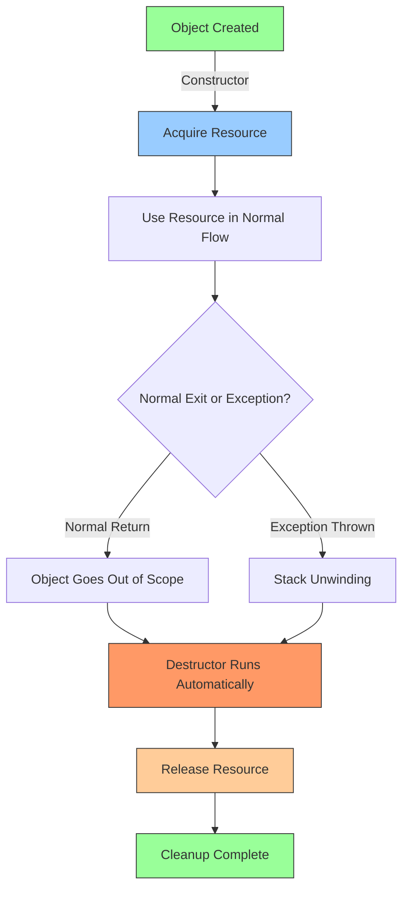
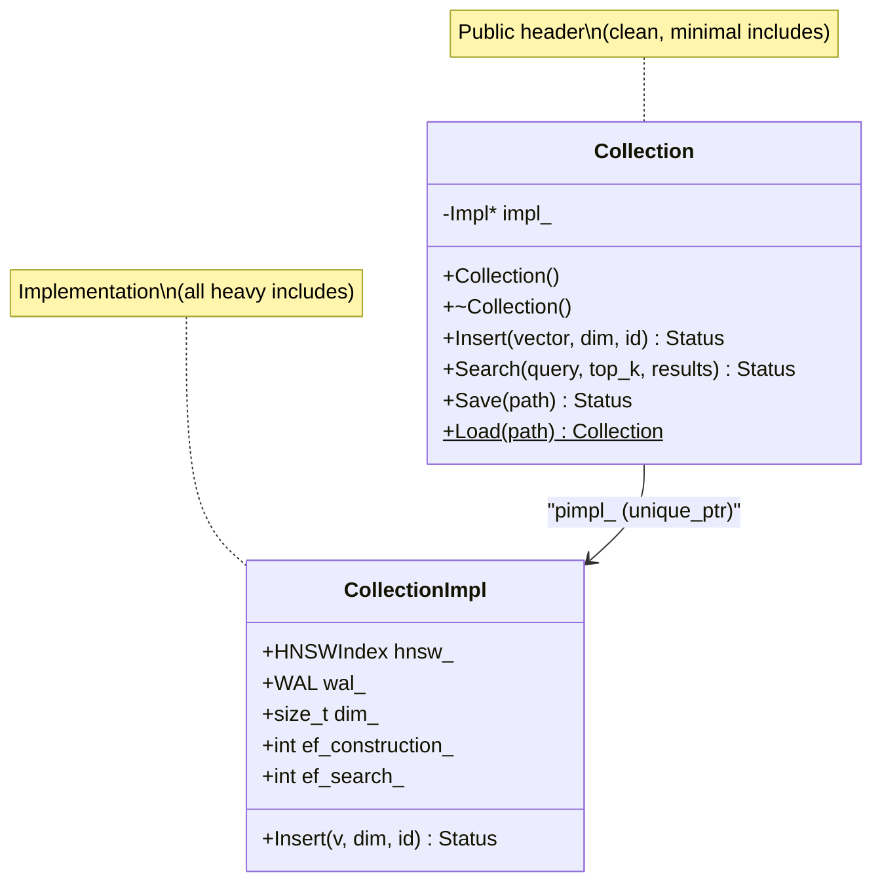
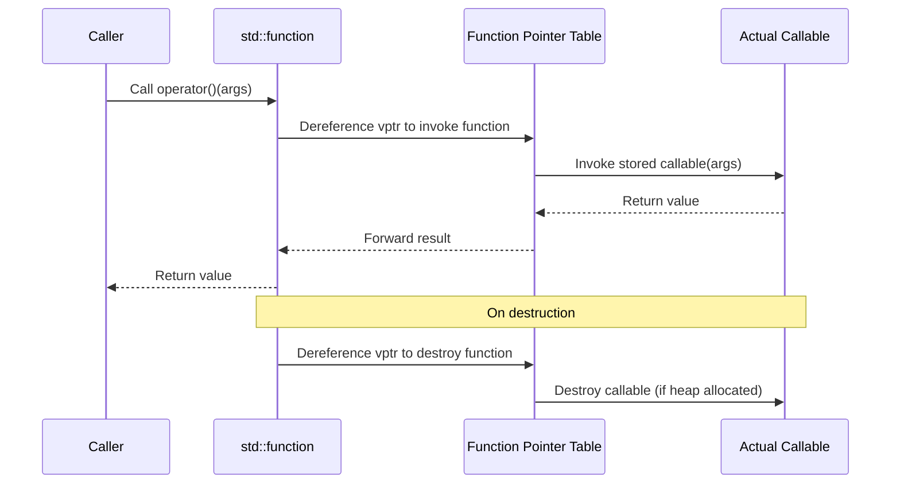

# Chapter 8 — C++ Design Patterns in LumenDB

## Prerequisites

This chapter assumes familiarity with the following concepts. Review these shared documents before proceeding:

> 📎 **Reference**: [SIMD & Hardware Optimization](../prerequisites/06_SIMD与硬件优化.md) — AVX2/SSE intrinsics used in SIMD dispatch pattern
> 📎 **Reference**: [Vector Distance Metrics](../prerequisites/05_向量距离度量_en.md) — L2 distance used in type erasure and distance function examples

---

## Why Design Patterns Matter More in C++

Every language has patterns, but C++ makes them *load-bearing* in ways that Java, Python, or Go do not. The reason is control. C++ gives you direct memory management, zero-cost abstractions, compile-time computation, and access to hardware intrinsics. These are powerful tools — but they are also traps. In a garbage-collected language, you can forget to release a resource and the runtime cleans up. In C++, you get a leak, a dangling pointer, or undefined behavior. In a managed language, you can't accidentally read memory from another thread without synchronization. In C++, you can, and the bug will manifest days later on a different machine.

Design patterns in C++ are not decoration. They are survival strategies. RAII exists because C++ has no garbage collector and exceptions can fly at any point. PIMPL exists because C++ exposes implementation details in headers and the build system pays for every include. Type erasure exists because C++ templates generate a separate function body for every concrete type, and you need a way to say "I don't care what type you are, just call me."

This chapter covers the patterns that LumenDB actually uses. Each pattern is presented with: the problem it solves, its history, how it works, the trade-offs, and where it appears in LumenDB. We start with the foundational concepts and build toward concurrency.

---

## 8.1 What Is a Design Pattern?

A **design pattern** is a named, documented, reusable solution to a commonly occurring problem in software design. The term was popularized by the "Gang of Four" — Erich Gamma, Richard Helm, Ralph Johnson, and John Vlissides — in their 1994 book *Design Patterns: Elements of Reusable Object-Oriented Software*. But the patterns themselves predate the book. They were discovered, not invented. The book merely named and cataloged what experienced programmers already knew.

Why bother naming them? Because shared vocabulary is powerful. Saying "use PIMPL here" is faster than explaining "hide your private members behind an opaque pointer so that changes to the implementation don't force recompilation of all dependent translation units." A good pattern name captures the problem, the solution, and the trade-offs in two words.

This chapter covers the patterns that LumenDB actually uses — not a comprehensive catalog, but the ones that solve real problems in a real C++ codebase.

---

## 8.2 RAII — Resource Acquisition Is Initialization

### The Problem

Resources must be released. File descriptors must be closed. Memory must be freed. Mutexes must be unlocked. If you acquire a resource and forget to release it, you have a leak. If you release it twice, you have a double-free. If an exception is thrown between acquire and release, you have a leak *and* potentially corrupted state.

C doesn't help you here. `malloc` and `free` are entirely the programmer's responsibility. Every C programmer has spent hours tracking down a leak caused by an early return between `fopen` and `fclose`.

### The History

**RAII** — **Resource Acquisition Is Initialization** — is arguably the single most important idiom in C++. The term was coined by Bjarne Stroustrup, the creator of C++, in his 1984 paper "Data Abstraction in C" and later formalized in *The C++ Programming Language* (1985, 1st edition). Stroustrup needed a way to manage resources without a garbage collector. His insight: the C++ language already guarantees that destructors run when objects go out of scope. If you acquire a resource in a constructor and release it in the destructor, you get automatic cleanup — no runtime overhead, no GC pauses, no programmer discipline required.

This is unique to C++ for a subtle reason: C++ has deterministic destruction. In Java, when you call `close()` on a file, the runtime *eventually* runs the finalizer, but you don't know when. In C++, when an object goes out of scope, the destructor runs *immediately*, on the same stack frame. This determinism is what makes RAII safe under exceptions — the stack unwinding mechanism calls destructors in reverse order of construction, guaranteeing cleanup.

No other mainstream language has this property to the same degree. Rust borrowed the concept (its `Drop` trait), but Rust doesn't have C++'s constructor/destructor symmetry. Python has `__del__`, but it's called by the garbage collector, which may run at any time or never.

### The Solution

Tie resource lifetime to object lifetime: acquire the resource in the constructor, release it in the destructor. When the object goes out of scope — whether by normal return, early return, or exception — the destructor runs automatically and releases the resource.

### RAII Lifecycle



Think of RAII like an automatic door closer. You push the door open (constructor), and the closer mechanism (destructor) swings it shut behind you. You don't need to remember to close the door. You can't forget. Even if you trip (exception), the door still closes.

### Key RAII Types in C++

| Type | Resource Managed | Constructor Acquires | Destructor Releases |
|------|-----------------|---------------------|---------------------|
| `std::unique_ptr<T>` | Heap memory | `new T` | `delete ptr` |
| `std::lock_guard<M>` | Mutex ownership | `mutex.lock()` | `mutex.unlock()` |
| `std::ifstream` | File handle | `open()` | `close()` |
| `std::vector<T>` | Heap buffer | `allocate()` | `deallocate()` |
| `FILE*` wrapper | C file descriptor | `fopen()` | `fclose()` |

### RAII in LumenDB

```cpp
class MMapFile {
public:
    MMapFile(const std::string& path, bool read_only = true)
        : fd_(-1), data_(nullptr), size_(0) {
        int flags = read_only ? O_RDONLY : O_RDWR | O_CREAT;
        fd_ = open(path.c_str(), flags, 0644);
        if (fd_ < 0) throw std::runtime_error("open failed: " + path);

        struct stat st;
        fstat(fd_, &st);
        size_ = st.st_size;
        if (size_ == 0 && !read_only) size_ = 4096;

        int prot = read_only ? PROT_READ : PROT_READ | PROT_WRITE;
        data_ = static_cast<char*>(mmap(nullptr, size_, prot, MAP_SHARED, fd_, 0));
        if (data_ == MAP_FAILED) {
            close(fd_);
            throw std::runtime_error("mmap failed");
        }
    }

    ~MMapFile() {
        if (data_ && data_ != MAP_FAILED) munmap(data_, size_);
        if (fd_ >= 0) close(fd_);
    }

    MMapFile(const MMapFile&) = delete;
    MMapFile& operator=(const MMapFile&) = delete;
    MMapFile(MMapFile&& other) noexcept
        : fd_(other.fd_), data_(other.data_), size_(other.size_) {
        other.fd_ = -1;
        other.data_ = nullptr;
        other.size_ = 0;
    }

    const char* Data() const { return data_; }
    size_t Size() const { return size_; }

private:
    int fd_;
    char* data_;
    size_t size_;
};
```

Every resource in LumenDB follows this pattern:
- `HNSWIndex` constructor allocates the graph's adjacency lists; destructor deletes them.
- `VectorStore` constructor memory-maps the data file; destructor munmaps it.
- `Collection` destructor flushes the MemTable and syncs the WAL.

**The destructor should never throw.** The C++ committee's guidance (ISO C++ Core Guidelines C.36): if a destructor throws during stack unwinding (i.e., you're already handling an exception), `std::terminate` is called. LumenDB logs errors in destructors but never propagates them.

### Before and After

Without RAII (C style):
```cpp
void ProcessFile(const char* path) {
    FILE* f = fopen(path, "rb");
    if (!f) return;
    char* buf = (char*)malloc(4096);
    if (!buf) { fclose(f); return; }
    // ... use buf and f ...
    // Early return here leaks both buf and f
    if (error_condition) return;  // LEAK: fclose(f) and free(buf) never called
    free(buf);
    fclose(f);
}
```

With RAII (C++ style):
```cpp
void ProcessFile(const std::string& path) {
    std::ifstream f(path, std::ios::binary);  // acquires file handle
    std::vector<char> buf(4096);              // acquires heap buffer
    // ... use buf and f ...
    if (error_condition) return;  // safe: destructors run automatically
    // buf and f released here when scope ends
}
```

---

## 8.3 PIMPL — Pointer to Implementation

### The Problem

In C++, class definitions in header files must declare *everything* — public methods, private methods, private member variables. There's no way to say "these details are private, trust me." The compiler needs to know the size of every object to allocate it, and it can't compute the size without seeing all the members.

This means that if you change a private field in `collection.h`, every `.cpp` file that includes `collection.h` must be recompiled. In a large project, that could be hundreds of files. A 30-second edit becomes a 10-minute rebuild.

Worse, the private fields drag in their own headers. If `Collection` has a private member of type `HNSWIndex`, then `collection.h` must include `hnsw_index.h`, which includes `distance.h`, which includes SIMD intrinsics headers... and now your entire codebase recompiles when you change anything.

### The History

The PIMPL idiom — **Pointer to Implementation**, also called the **"Cheshire Cat"** idiom (after the grinning cat in *Alice in Wonderland* that fades away, leaving only its smile) — was first described by David Reed in 1992 and popularized by John Torjo in early C++ GUI frameworks. The name "Compiler Firewall" came later, emphasizing its role as a barrier between the public header and the private implementation.

The idiom became essential as C++ codebases grew. In the 1990s, compile times of 30+ minutes were common for large projects. PIMPL was one of the first "build time optimization" patterns. It also solved a practical problem for library vendors: **binary compatibility** (also called **ABI stability**). If a library vendor ships a new version that changes a private member, all clients must relink. With PIMPL, changing the `Impl` class doesn't change the public header's layout, so clients don't need to recompile or relink.

### Key Terms Defined

- **Compilation firewall**: A technique that prevents changes in one translation unit (`.cpp` file) from forcing recompilation of other translation units. PIMPL is the primary compilation firewall in C++.
- **Binary compatibility (ABI stability)**: The ability to replace a shared library (`.dll`, `.so`) without recompiling or relinking programs that use it. PIMPL preserves ABI stability because the public class's size and layout never change.
- **Translation unit**: What the compiler sees after preprocessing a `.cpp` file and all the headers it includes. Each `.cpp` file compiles into one translation unit.
- **Forward declaration**: Declaring a name (class, function) without defining it. `class Impl;` tells the compiler "Impl exists, but its details are elsewhere." This lets you use `Impl*` without including its definition.

### The Solution

PIMPL hides everything behind an opaque pointer. The public header declares only the public API and a forward-declared pointer to the implementation class. All private details live in the `.cpp` file, invisible to includers.

### PIMPL Class Diagram



Think of it like a diplomatic embassy. The public header is the embassy's front desk — anyone can see it, interact with it. The implementation file is the secure interior — only the embassy staff (the `.cpp` file) knows what's inside. Changing the interior layout doesn't affect what visitors see at the front desk.

### The Before-and-After

Before: `bad_widget.h` includes `expensive_dep.h` (which pulls in 50+ headers), exposes `std::unordered_map` in its declaration. Any change to the map type or the dependency forces a global rebuild.

```cpp
// BEFORE: all dependents pay for expensive_dep.h
class BadWidget {
    ExpensiveDep dep_;                                // pulls in 50 headers
    std::unordered_map<std::string, int> data_;       // exposes implementation
public:
    void Set(const std::string& k, int v) { /* inline */ }
};
```

After PIMPL:

```cpp
// collection.h — PUBLIC HEADER (clean, minimal includes)
#include <memory>
#include <vector>

class Collection {
public:
    Collection();
    ~Collection();                      // must be defined in .cpp

    Collection(Collection&&) noexcept;
    Collection& operator=(Collection&&) noexcept;

    Collection(const Collection&) = delete;
    Collection& operator=(const Collection&) = delete;

    Status Insert(const float* vector, int dim, int64_t id);
    Status Search(const float* query, int top_k,
                  std::vector<std::pair<float, int64_t>>* results) const;
    Status Save(const std::string& path) const;
    static Collection Load(const std::string& path);

private:
    class Impl;
    std::unique_ptr<Impl> impl_;
};

// collection.cpp — IMPLEMENTATION (all the heavy includes live here)
#include "hnsw_index.h"
#include "wal.h"
#include "bloom_filter.h"

class Collection::Impl {
public:
    HNSWIndex  hnsw_;
    WAL        wal_;
    size_t     dim_;
    int        ef_construction_ = 200;
    int        ef_search_       = 64;

    Status Insert(const float* v, int dim, int64_t id) { /* ... */ }
};

Collection::Collection() : impl_(std::make_unique<Impl>()) {}
Collection::~Collection() = default;
```

### How PIMPL Reduces Build Times

Consider a project with 200 `.cpp` files that include `collection.h`:

| Scenario | Files to recompile when private field changes |
|----------|----------------------------------------------|
| Without PIMPL | 200 files (all includers) |
| With PIMPL | 1 file (`collection.cpp`) |

The savings are multiplicative: each of those 200 files might include other headers, each of which includes other headers. PIMPL eliminates this cascade at the root.

### When to Use PIMPL

**Yes:**
- Public API classes with many dependents (`Collection`, `Database`, `Snapshot`).
- Classes whose private members pull in expensive headers.
- When you need ABI stability (changing `Impl` doesn't change the vtable layout).

**No:**
- Value types created millions of times. PIMPL requires a heap allocation — 1 million PIMPL objects = 1 million heap allocations.
- Internal classes with few dependents (one or two `.cpp` files include them).
- Classes already behind an interface (virtual base class) — the vtable already provides the indirection.

### Costs of PIMPL

- **One heap allocation per object**: `std::make_unique<Impl>()`. For long-lived objects (Collection lives for the process lifetime), this is negligible.
- **One pointer indirection per call**: `impl_->Search(...)`. The CPU branch predictor handles this fine for non-trivial functions.
- **No inline methods**: the implementation is in the `.cpp` file, so the compiler can't inline across the PIMPL boundary. For hot-path methods, LumenDB exposes `getRaw()` methods that return internal pointers, bypassing PIMPL.

---

## 8.4 Type Erasure

### The Problem

You want to let users provide their own distance function. It could be a free function, a lambda, a functor (struct with `operator()`), a `std::bind` expression, or even a pointer-to-member-function. All have different types. How do you store "any callable with signature `float(const float*, const float*, int)`" in a single variable?

In C++ without type erasure, you'd need a virtual base class:

```cpp
class DistanceMetric {
    virtual float Compute(const float* a, const float* b, int dim) const = 0;
    virtual ~DistanceMetric() = default;
};
```

This forces users to subclass, prevents inline lambdas, and adds a vtable pointer to every metric object. It's heavy machinery for what should be simple.

### The History

**Type erasure** as a concept predates C++. The idea: store objects of different concrete types behind a uniform interface, where the concrete type is "erased" — the holder only knows about the interface. In C++, the technique was formalized by Kevlin Henney around 2000 and is the mechanism behind `std::function` (introduced in C++11, standardized 2011), `std::any` (C++17), and `std::packaged_task`.

The key insight: you don't need inheritance if you can dispatch through a function pointer stored alongside the object. The "vtable" isn't a class vtable — it's a pair of function pointers (one for the operation, one for destruction) stored in the type-erased wrapper.

### How `std::function` Works Internally

Under the hood, `std::function<float(const float*, const float*, int)>` contains:

1. **A function pointer table** (like a manual vtable): pointers to `invoke`, `destroy`, and `clone` operations.
2. **A storage buffer**: either on the stack (**Small Buffer Optimization**, SBO) or on the heap.

### Type Erasure Internal Structure



```
std::function signature:
┌─────────────────────────────────┐
│  function pointer table (vptr)  │  ← points to type-specific invoke/destroy/clone
├─────────────────────────────────┤
│  storage buffer (SBO or heap)   │  ← holds the actual callable
└─────────────────────────────────┘
```

**Small Buffer Optimization (SBO)**: Most implementations reserve ~16–32 bytes inside the `std::function` object itself. If the callable fits (a simple lambda with no captures, a function pointer), it's stored inline — no heap allocation. If it's larger (a lambda capturing a vector), it allocates on the heap and the buffer holds a pointer.

You can measure this on your platform:
```cpp
#include <iostream>
#include <functional>

int main() {
    std::cout << "sizeof(std::function<void()>) = "
              << sizeof(std::function<void()>) << "\n";
}
```

Typical results: 32 bytes on libstdc++ (GCC), 32 bytes on libc++ (Clang), 64 bytes on MSVC.

### Type Erasure in LumenDB

```cpp
// Without type erasure: every distance metric must subclass
class DistanceMetric {
    virtual float Compute(const float* a, const float* b, int dim) const = 0;
};

// With type erasure: std::function accepts any callable (lambda, functor, free function)
class Index {
    using DistanceFn = std::function<float(const float*, const float*, int)>;
    DistanceFn dist_;
public:
    template <typename F>
    void SetDistance(F&& fn) { dist_ = std::forward<F>(fn); }

    void Search(const float* q, const float** base, int N, int dim) {
        for (int i = 0; i < N; i++)
            float d = dist_(q, base[i], dim);
    }
};
```

### When to Use Each Strategy

- **`std::function`** (type erasure): infrequently-changing callbacks, small captures (SBO fits). Virtual call overhead is amortized over heavy work.
- **Virtual + inheritance**: multiple related methods, shared state in hierarchy. Classic OOP polymorphism.
- **`template <typename F>`**: zero-cost (monomorphized). Use in hot paths where the type is known at compile time. LumenDB's SIMD layer uses this.

LumenDB uses `std::function` for the distance metric in `Index`: set once at construction, called millions of times. The SBO (typically 32 bytes on libstdc++) fits most simple lambdas.

### Type Erasure vs. Inheritance: A Comparison

| Aspect | `std::function` (type erasure) | Virtual inheritance |
|--------|-------------------------------|---------------------|
| User effort | Pass any callable | Must subclass |
| Heap allocation | Only if SBO fails | Always (vtable pointer) |
| Inlining | No (function pointer call) | No (virtual call) |
| Multiple methods | One signature only | Multiple virtual methods |
| Compile-time type known | Can optimize at call site | Never |

---

## 8.5 shared_mutex — Reader-Writer Lock

### Why Not Just `std::mutex`?

A **`std::mutex`** (mutual exclusion lock) serializes all access. If 8 threads try to read the HNSW graph simultaneously, only one can hold the mutex at a time. The other 7 spin or sleep, wasting CPU cores. On a 32-core server handling 100 queries/second, this is a disaster — 31 cores idle while one works.

A **mutex** (from "mutual exclusion") is a synchronization primitive that ensures only one thread can access a critical section at a time. It's the simplest concurrency tool, but it treats all operations identically — reads and writes get the same lock.

### The Reader-Writer Pattern

A **reader-writer lock** (also called a **read-write lock**) distinguishes between two operations:

- **Read**: observing data without modifying it. Multiple readers can proceed simultaneously because they don't conflict.
- **Write**: modifying data. Only one writer can proceed at a time, and no readers can be active during a write.

This is the key insight: reads are commutative (multiple reads don't interfere), but writes are exclusive. A reader-writer lock exploits this asymmetry.

**`std::shared_mutex`** (C++17) implements this pattern:
- **Shared (read) lock** (`std::shared_lock`): multiple threads can hold it simultaneously. Use when you only need to read data — no mutations.
- **Exclusive (write) lock** (`std::unique_lock`): only one thread can hold it. All other readers and writers are blocked.

This is perfect for the HNSW index: searches are readers (check adjacency lists, compute distances), inserts are writers (add nodes, update edges). 100 concurrent searches all hold shared locks and run in parallel. When an insert comes along, it waits for all ongoing searches to finish, acquires the exclusive lock, modifies the graph, and releases.

### Key Terms Defined

- **`std::shared_mutex`**: C++17 standard library class implementing a reader-writer lock. Supports `std::shared_lock` (read) and `std::unique_lock` (write).
- **Spinlock**: A lock that busy-waits (spins) instead of sleeping. Faster for very short critical sections (nanoseconds) because it avoids the overhead of putting the thread to sleep and waking it. Worse for long waits because it burns CPU cycles. Linux's `spinlock_t` is an example.
- **Lock-free**: A data structure or algorithm that guarantees at least one thread makes progress in a finite number of steps, even if other threads are suspended. Lock-free doesn't mean "no locks" — it means the algorithm doesn't use traditional locks (mutexes). It typically uses atomic operations instead.
- **Concurrent data structure**: A data structure designed to be accessed by multiple threads simultaneously without external synchronization, or with minimal fine-grained synchronization. Examples: concurrent hash maps, lock-free queues, skip lists.

### The Code

```cpp
#include <shared_mutex>

class ThreadSafeCache {
public:
    std::optional<Value> Get(const Key& key) const {
        std::shared_lock lock(mutex_);  // multiple readers OK
        auto it = cache_.find(key);
        if (it != cache_.end()) return it->second;
        return std::nullopt;
    }

    void Put(const Key& key, const Value& val) {
        std::unique_lock lock(mutex_);  // exclusive — blocks everyone
        cache_[key] = val;
    }

private:
    mutable std::shared_mutex mutex_;
    std::unordered_map<Key, Value> cache_;
};
```

### Writer Starvation

There's a problem: if readers keep arriving, a writer may wait indefinitely. The C++ standard does not specify fairness guarantees for `std::shared_mutex`. Some implementations (MSVC) prioritize writers; others (libstdc++) may allow writer starvation — where a stream of readers prevents a writer from ever acquiring the lock.

LumenDB uses a custom **fair reader-writer lock** that prevents starvation:

```cpp
class FairRWLock {
    std::mutex m_;
    std::condition_variable cv_read_, cv_write_;
    int readers_ = 0, waiting_writers_ = 0;
    bool writing_ = false;

public:
    void LockRead() {
        std::unique_lock lk(m_);
        cv_read_.wait(lk, [this] { return !writing_ && waiting_writers_ == 0; });
        readers_++;
    }
    void UnlockRead() {
        std::unique_lock lk(m_);
        if (--readers_ == 0 && waiting_writers_ > 0) cv_write_.notify_one();
    }
    void LockWrite() {
        std::unique_lock lk(m_);
        waiting_writers_++;
        cv_write_.wait(lk, [this] { return readers_ == 0 && !writing_; });
        waiting_writers_--;
        writing_ = true;
    }
    void UnlockWrite() {
        std::unique_lock lk(m_);
        writing_ = false;
        waiting_writers_ > 0 ? cv_write_.notify_one() : cv_read_.notify_all();
    }
};
```

When a writer arrives, it increments `waiting_writers_`. New readers see this and block — "holding the door" for the waiting writer. When the writer finishes, it notifies the next writer (FIFO) or wakes all readers.

---

## 8.6 Const-Correctness and `mutable`

### The Philosophy

**Const-correctness** is the practice of marking variables, parameters, and member functions with `const` whenever they are not intended to be modified. It communicates intent to both human readers and the compiler. The compiler enforces it: if you declare a member function `const` and then try to modify a member, the compiler stops you.

Why is this a "pattern" and not just a keyword? Because const permeates an entire codebase — you can't be "kinda const." Either every function that reads data is const, or the system doesn't work. It's an all-or-nothing discipline.

### `mutable` — The Escape Hatch

Sometimes a method is logically const (it doesn't change the observable state) but physically needs to modify something (a cache, a mutex, a lazy-initialization flag). `mutable` is the keyword that says "this field is allowed to change even in const methods."

Valid uses of `mutable`:
- **Caches**: a `block_offset_cache_` that memoizes expensive lookups.
- **Mutexes**: a `mutable std::shared_mutex` — locking a mutex changes its state, but it's an implementation detail invisible to callers.
- **Lazy initialization**: a flag `index_parsed_` that's set on first access.

```cpp
class SSTableReader {
public:
    Status Get(const Slice& key, std::string* value) const;
private:
    MMapFile file_;

    mutable std::shared_mutex cache_mutex_;
    mutable std::unordered_map<uint64_t, uint32_t> block_offset_cache_;
    mutable std::unique_ptr<BloomFilter> bloom_;
    mutable bool bloom_parsed_ = false;

    const BloomFilter& GetBloomFilter() const {
        std::shared_lock lock(cache_mutex_);
        if (!bloom_parsed_) {
            lock.unlock();
            std::unique_lock ulock(cache_mutex_);
            if (!bloom_parsed_) {           // double-checked locking
                bloom_ = ParseBloomFilter(file_);
                bloom_parsed_ = true;
            }
        }
        return *bloom_;
    }
};
```

**Rule**: `mutable` is for caches, mutexes, and lazy-initialization flags. Never use it for fields that change observable behavior. If a const `Get()` modifies the stored value, it should not be const.

---

## 8.7 SFINAE and SIMD Dispatch

> 📎 **Reference**: For SIMD intrinsics fundamentals (AVX2, SSE, register operations), see [SIMD & Hardware Optimization](../prerequisites/06_SIMD与硬件优化.md).

### What Is SFINAE?

**SFINAE** stands for **Substitution Failure Is Not An Error**. When the compiler tries to substitute template parameters into a function signature and the substitution produces invalid code, it doesn't emit an error — it simply removes that overload from consideration and continues.

This is the mechanism behind `std::enable_if`, `if constexpr`, and concepts (C++20). It allows conditional compilation based on type properties, without preprocessor macros.

The term was coined by Dave Abrahams in 2003 at a C++ committee meeting. The concept existed before (the compiler was already doing this), but naming it made it teachable.

### SIMD Dispatch with `if constexpr`

LumenDB's distance functions are the single hottest code path — called billions of times per query batch. The performance difference between scalar (1 float per operation), SSE (4 floats), and AVX2 (8 floats) is 4-8x. We want to compile one binary that uses the best SIMD instruction set available on the target CPU.

The old way (`#ifdef`): text substitution before the compiler runs. Only the matching branch survives — the others are never type-checked, so bugs in non-matching branches go undetected until someone compiles with different flags. `#ifdef` also forces you to ship separate binaries per CPU (or a lowest-common-denominator build).

The modern way (`if constexpr`):

```cpp
enum class SIMDLevel { None, SSE, AVX2, AVX512, NEON };

#ifdef __AVX512F__
constexpr SIMDLevel kBestSIMD = SIMDLevel::AVX512;
#elif defined(__AVX2__)
constexpr SIMDLevel kBestSIMD = SIMDLevel::AVX2;
#elif defined(__SSE2__)
constexpr SIMDLevel kBestSIMD = SIMDLevel::SSE;
#elif defined(__ARM_NEON)
constexpr SIMDLevel kBestSIMD = SIMDLevel::NEON;
#else
constexpr SIMDLevel kBestSIMD = SIMDLevel::None;
#endif

template <SIMDLevel L>
float L2Distance(const float* a, const float* b, size_t dim) {
    if constexpr (L == SIMDLevel::AVX2) {
        // AVX2: 8 floats per register — see prerequisites for intrinsics details
        __m256 sum = _mm256_setzero_ps();
        size_t i = 0;
        for (; i + 8 <= dim; i += 8) {
            __m256 va = _mm256_loadu_ps(a + i);
            __m256 vb = _mm256_loadu_ps(b + i);
            __m256 diff = _mm256_sub_ps(va, vb);
            sum = _mm256_fmadd_ps(diff, diff, sum);
        }
        float result = horizontal_sum_avx(sum);
        for (; i < dim; i++) { float d = a[i] - b[i]; result += d * d; }
        return std::sqrt(result);
    } else if constexpr (L == SIMDLevel::SSE) {
        // SSE: 4 floats per register
        // ...
    } else {
        // Scalar fallback
        float sum = 0;
        for (size_t i = 0; i < dim; i++) { float d = a[i] - b[i]; sum += d * d; }
        return std::sqrt(sum);
    }
}

// Dispatch at the API boundary
float L2Distance(const float* a, const float* b, size_t dim) {
    return L2Distance<kBestSIMD>(a, b, dim);
}
```

`if constexpr` evaluates the condition at compile time. Only one branch is compiled for each template instantiation. But crucially: **all branches are parsed and checked for syntactic correctness**, even the dead ones. This means if you break the SSE branch, the compiler tells you — even if you're compiling with AVX2. This is the critical advantage over `#ifdef`.

---

## 8.8 Error Handling: Status, Exception, and optional

There is no one-size-fits-all error handling strategy. LumenDB uses four mechanisms, each suited to a different context:

| Mechanism | When to Use | Example in LumenDB |
|-----------|-------------|---------------------|
| `Status` | I/O operations, network calls, user-facing API | `Status s = db.Open(path);` |
| `std::optional<T>` | Lookup that may not find a result (not an error) | `auto v = cache.Get(key);` |
| Exception | Invariant violations, programmer bugs, OOM | `throw std::invalid_argument("dim mismatch");` |
| `assert()` | Debug-only checks, pre/post conditions | `assert(dim > 0 && dim % 8 == 0);` |

### The Status Pattern

```cpp
enum class StatusCode { OK, NotFound, IOError, CorruptData, InvalidArg, OOM };

class Status {
public:
    static Status OK() { return Status(StatusCode::OK); }
    static Status NotFound(const std::string& msg) { return Status(StatusCode::NotFound, msg); }
    static Status IOError(const std::string& msg) { return Status(StatusCode::IOError, msg); }

    bool ok() const { return code_ == StatusCode::OK; }
    StatusCode code() const { return code_; }
    const std::string& message() const { return msg_; }

    explicit operator bool() const { return ok(); }

private:
    StatusCode code_;
    std::string msg_;
};
```

**Why not exceptions everywhere?** Exceptions require stack unwinding, which in a 100K-QPS search loop would destroy throughput. `Status` is a simple value return — no unwinding, no allocation (for OK), easily checked. The caller decides whether to propagate, log, or retry.

**Why not `std::expected<T, E>` (C++23)?** It's a valid alternative — cleaner than out-parameters for success values. But at the time LumenDB was designed, `expected` wasn't available. `Status` with out-parameters is the pragmatic choice.

### Factory Pattern: Create vs Load

A `Collection` can come from two paths — newly created or loaded from disk. These have different semantics and failure modes. LumenDB separates them:

```cpp
class Collection {
    class Impl;
    std::unique_ptr<Impl> impl_;
    Collection() = default;  // private

public:
    static Collection Create(const CollectionConfig& config) {
        Collection c;
        c.impl_ = std::make_unique<Impl>();
        c.impl_->InitEmpty(config);
        return c;
    }

    static Collection Load(const std::string& path) {
        Collection c;
        c.impl_ = std::make_unique<Impl>();
        c.impl_->LoadFromDisk(path);  // may return Status on failure
        return c;
    }
};
```

The private constructor + static factory methods make intent explicit. `Collection c;` won't compile — you must say whether you're creating or loading. This is a mild form of the "named constructor" idiom, which is preferable to overloaded constructors that differ only by parameter types.

---

## 8.9 Concurrency Patterns: Thread Pool, ABA Problem, Memory Ordering

These patterns appear in LumenDB's background compaction and WAL flushing threads. They are more advanced — study them after mastering the earlier patterns.

### Thread Pool

A **thread pool** maintains a fixed number of threads that wait for work items. Instead of spawning a new thread for each task (expensive: thread creation costs ~10 microseconds, plus 1MB stack), you submit work to the pool and reuse existing threads.

```
┌─────────┐  ┌─────────┐  ┌─────────┐  ┌─────────┐
│ Thread 1 │  │ Thread 2 │  │ Thread 3 │  │ Thread 4 │
└────┬─────┘  └────┬─────┘  └────┬─────┘  └────┬─────┘
     │              │              │              │
     └──────────────┴──────────────┴──────────────┘
                          │
                   ┌──────┴──────┐
                   │  Work Queue  │
                   └─────────────┘
```

**Work stealing**: When a thread's local queue is empty, it "steals" work from another thread's queue. This balances load without a central lock. Intel's TBB (Threading Building Blocks) and Folly (Facebook's C++ library) implement work-stealing thread pools.

**Dead letter queue**: A queue that holds work items that failed to process (e.g., a compaction task that hit a corrupted SSTable). Instead of retrying indefinitely or dropping the work, you move it to a dead letter queue for manual inspection or later retry.

### The ABA Problem

The **ABA problem** occurs in lock-free algorithms that use compare-and-swap (CAS). Consider a thread reading value A from a shared pointer, getting preempted, and another thread changing the pointer from A to B and back to A. When the first thread resumes and does CAS(expected=A, new=C), the CAS succeeds — but the object at address A may be a *different object* than the one the first thread originally read.

```
Thread 1: reads ptr = A (object at address 0x1000)
Thread 1: preempted
Thread 2: ptr = B (object at address 0x2000)
Thread 2: ptr = A (new object at address 0x3000, but value is "A")
Thread 1: resumes, CAS(ptr, A, C) succeeds — but ptr points to a different object!
```

**Solutions**: tagged pointers (append a counter to the pointer, increment on every change), hazard pointers (track which pointers each thread is reading), or epoch-based reclamation (defer deletion until no thread could be holding a reference).

### Memory Ordering

When Thread A writes `x = 1; y = 2;` and Thread B reads `if (y == 2) assert(x == 1);`, is the assertion guaranteed to pass? **Not necessarily.** Modern CPUs and compilers can reorder instructions for performance.

**Memory ordering** defines the rules for when reads and writes become visible to other threads. C++11 introduced `<atomic>` with five memory orderings:

| Ordering | Guarantee | Use Case |
|----------|-----------|----------|
| `memory_order_relaxed` | Atomicity only, no ordering | Counters, statistics |
| `memory_order_acquire` | Reads after this see all writes before the releasing write | Lock acquisition, loading a pointer |
| `memory_order_release` | All writes before this are visible to threads that acquire | Lock release, storing a pointer |
| `memory_order_acq_rel` | Both acquire and release | Read-modify-write operations |
| `memory_order_seq_cst` | Total order across all threads (default) | When in doubt |

**Acquire/release semantics**: A **release** store makes all preceding writes visible. An **acquire** load sees all writes that happened before the release. Together, they create a happens-before relationship: if Thread A does a release store and Thread B does an acquire load that reads the stored value, all of Thread A's writes are guaranteed to be visible to Thread B.

This is the foundation of lock-free data structures. A lock-free queue might use `memory_order_release` when enqueueing and `memory_order_acquire` when dequeuing, ensuring that the data written by the producer is visible to the consumer.

---

## Code Exercise

### Part A — Refactor to PIMPL

Take this class (inline methods, expensive header dependency) and refactor into a clean `widget.h` + `widget.cpp` using PIMPL:

```cpp
// BEFORE: bad_widget.h
#include <unordered_map>
#include <shared_mutex>
#include "expensive_dep.h"

class BadWidget {
public:
    void Set(const std::string& k, int v) {
        std::unique_lock lock(mutex_);
        data_[k] = v;
    }
    std::optional<int> Get(const std::string& k) const {
        std::shared_lock lock(mutex_);
        auto it = data_.find(k);
        if (it != data_.end()) return it->second;
        return std::nullopt;
    }
private:
    mutable std::shared_mutex mutex_;
    std::unordered_map<std::string, int> data_;
    ExpensiveDep dep_;
};
```

```cpp
// AFTER: widget.h — clean public header
class Widget {
public:
    Widget(); ~Widget();
    Widget(Widget&&) noexcept;
    Widget& operator=(Widget&&) noexcept;
    Widget(const Widget&) = delete;
    Widget& operator=(const Widget&) = delete;

    void Set(const std::string& k, int v);
    std::optional<int> Get(const std::string& k) const;
private:
    class Impl;
    std::unique_ptr<Impl> impl_;
};
```

**Verify**: include `widget.h` from another file — `ExpensiveDep` is not included.

### Part B — Type-Erased Callback

Add a type-erased callback to `Widget`:

```cpp
// In Widget::Impl:
using ChangeCallback = std::function<void(const std::string& key, int old_val, int new_val)>;
std::vector<ChangeCallback> callbacks_;
```

Add public methods:
```cpp
void Widget::OnChange(ChangeCallback cb);   // register callback
void Widget::Set(const std::string& k, int v);  // now fires callbacks
```

Test with three different callback types:
1. A free function `void log_change(const std::string& k, int old_v, int new_v) { ... }`
2. A lambda that captures a counter: `[&count](auto...) { count++; }`
3. A functor (struct with `operator()`) that writes to a file.

Verify all three work with the same `OnChange` registration.

### Part C — Thread-Safe LRU Cache with shared_mutex

Implement a thread-safe LRU cache:

```cpp
template <typename K, typename V>
class LRUCache {
public:
    explicit LRUCache(size_t capacity) : capacity_(capacity) {}

    std::optional<V> Get(const K& key) {
        std::shared_lock lock(mutex_);
        auto it = map_.find(key);
        if (it == map_.end()) return std::nullopt;
        return it->second->second;
    }

    void Put(const K& key, const V& value) {
        std::unique_lock lock(mutex_);
        auto it = map_.find(key);
        if (it != map_.end()) {
            it->second->second = value;
            list_.splice(list_.begin(), list_, it->second);
            return;
        }
        if (list_.size() >= capacity_) {
            auto last = list_.back();
            map_.erase(last.first);
            list_.pop_back();
        }
        list_.emplace_front(key, value);
        map_[key] = list_.begin();
    }

private:
    size_t capacity_;
    mutable std::shared_mutex mutex_;
    std::list<std::pair<K, V>> list_;
    std::unordered_map<K, typename std::list<std::pair<K, V>>::iterator> map_;
};
```

**Write a multithreaded test**: spawn 4 writer threads and 16 reader threads. Readers query random keys, writers insert random keys. Use `std::atomic<size_t>` to count cache hits/misses. Run for 5 seconds and print the hit ratio.

**Thought**: why is updating LRU order under a shared_lock problematic? The `list_.splice` call modifies the list, which is a write operation. A shared lock doesn't permit writes. Real high-performance caches (like Facebook's `ConcurrentLRUCache`) solve this with lock-per-shard or lock-free data structures.

---

## Thought Questions

1. **PIMPL requires a heap allocation. If `Collection` is created millions of times (one per document), is PIMPL still appropriate?** What alternatives exist for small, frequently-created objects?

2. **`std::function` uses Small Buffer Optimization. What is the typical SBO size on your platform?** Measure with `sizeof(std::function<void()>)`. What happens when a lambda captures more data than the SBO buffer?

3. **In the SIMD dispatch example, why use `if constexpr` instead of `#ifdef` blocks?** Think about what happens when someone refactors the code and accidentally introduces a syntax error in a dead branch.

4. **The `FairRWLock` gives writers priority over new readers but not over existing readers. Is this strictly fair?** Design a truly fair lock that services readers and writers in arrival order. What are the trade-offs?

5. **When would you use `Status` vs `std::expected<T,E>` (C++23) vs exceptions?** Consider the call graph depth — does the error need to propagate through 10 stack frames, or just one?

6. **The ABA problem: why can't you solve it with a simple `std::atomic<T*>`?** What additional information is needed, and how do tagged pointers or hazard pointers provide it?

---

## References

- Stroustrup, Bjarne. *The C++ Programming Language* (4th Edition). Chapters on RAII, templates, and exception safety.
- Stroustrup, Bjarne. "Data Abstraction in C." *Bell Labs Technical Journal*, 1984. (Origin of RAII.)
- Gamma, Erich, Richard Helm, Ralph Johnson, and John Vlissides. *Design Patterns: Elements of Reusable Object-Oriented Software*. Addison-Wesley, 1994.
- Meyers, Scott. *Effective Modern C++*. Items 18, 20 on `std::unique_ptr` and `std::function`.
- Henney, Kevlin. "Curiously Recurring C++ Problems at C++ and Beyond." 2000. (Type erasure formalization.)
- ISO C++ Core Guidelines: [PIMPL](https://isocpp.github.io/CppCoreGuidelines/CppCoreGuidelines#pimpl), [RAII](https://isocpp.github.io/CppCoreGuidelines/CppCoreGuidelines#Rr-raii).
- Intel Intrinsics Guide: https://www.intel.com/content/www/us/en/docs/intrinsics-guide/index.html
- Facebook Folly `SharedMutex`: https://github.com/facebook/folly/blob/main/folly/SharedMutex.h
- Williams, Anthony. *C++ Concurrency in Action* (2nd Edition). Chapters on memory ordering and lock-free data structures.
