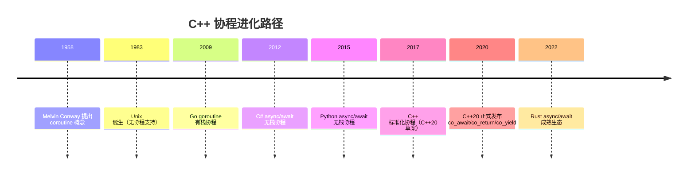
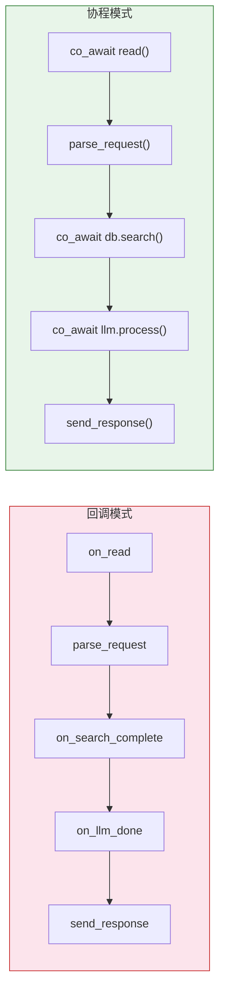
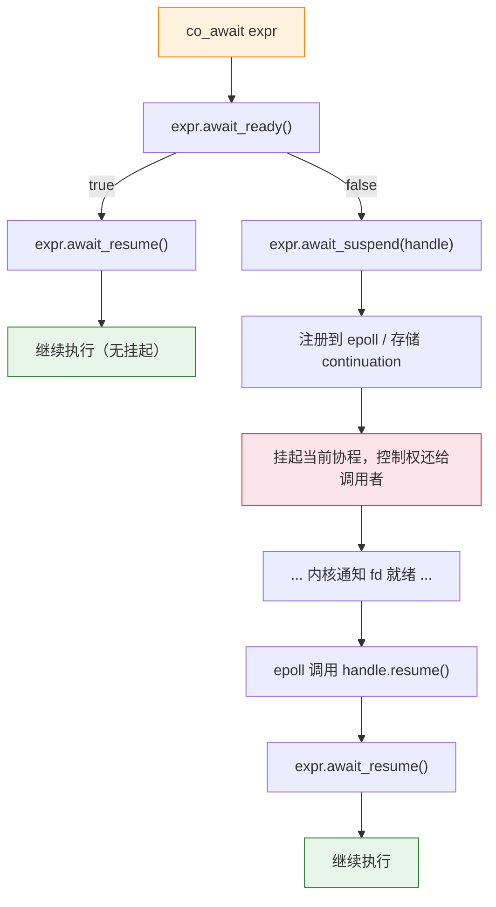
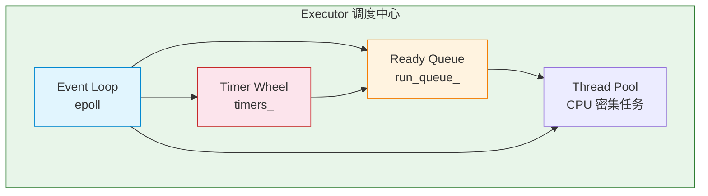

# 第 11 章：C++20 协程 & SkyNet

## 前置知识

> 📎 **参考**: [SIMD与硬件优化](../prerequisites/06_SIMD与硬件优化.md) — CPU 并行计算与缓存优化原理
> 📎 **参考**: [构建环境配置](../prerequisites/01_构建环境配置.md) — C++20 编译器支持与构建配置

---

## 目录
1. [从回调地狱到协程：异步编程进化史](#1-从回调地狱到协程异步编程进化史)
2. [C++20 协程关键字](#2-c20-协程关键字)
3. [协程帧与状态机](#3-协程帧与状态机)
4. [Promise 类型](#4-promise-类型)
5. [Awaitable 概念](#5-awaitable-概念)
6. [对称转移](#6-对称转移)
7. [SkyNet Task\<T\> 设计](#7-skynet-taskt-设计)
8. [Epoll + 协程集成](#8-epoll--协程集成)
9. [Executor 设计](#9-executor-设计)
10. [跨语言对比](#10-跨语言对比)
11. [思考题](#11-思考题)
12. [动手练习](#12-动手练习)

---

## 1. 从回调地狱到协程：异步编程进化史

### 1.1 第一代：回调（Callback）——逻辑碎片化的代价

回调模式是异步编程最古老的范式。当一个 I/O 操作完成时，系统调用你注册的函数。

**回调地狱（Callback Hell）**：当多个异步操作需要顺序执行时，每个后续步骤都必须嵌套在前一个的回调函数里。

```
on_read(fd) {
    parse_request(buf, n);
    db.search_async(req, on_search_complete);
}
on_search_complete(results) {
    llm.process_async(results, on_llm_done);
}
on_llm_done(llm_result) {
    send_response(fd, final);
}
```

### 1.2 第二代：Future/Promise——让代码看起来线性的

```
auto f1 = read_async(fd);
auto f2 = f1.then([](auto buf) { return parse(buf); });
auto f3 = f2.then([](auto req) { return db.search(req); });
auto f4 = f3.then([](auto res) { return llm.process(res); });
f4.then([](auto final) { send_response(fd, final); });
```

### 1.3 第三代：协程（Coroutine）——同步写法，异步执行

协程解决的核心问题是：**让异步代码看起来像同步代码，但底层保持异步**。

到 2017 年 C++20 标准化时，协程已经是主流语言的标配：

| 语言 | 异步模型 | 引入年份 |
|------|---------|---------|
| Go | goroutine（有栈协程） | 2009 |
| C# | async/await（无栈协程） | 2012 |
| Python | async/await（无栈协程） | 2015 |
| Rust | async/await（无栈协程） | 2019 |
| JavaScript | async/await（无栈协程） | 2017 |
| **C++** | **co_await/co_return/co_yield（无栈协程）** | **2020** |



### 1.4 线程模型的困境

```
场景：一台服务器要同时处理 10,000 个 HTTP 长连接

方案 A: 每连接一个线程
  10,000 × 8MB = 80GB 内存 ── 仅用于栈！❌

方案 B: epoll 事件驱动
  1 个线程处理所有连接，但代码变成了回调地狱 ❌

方案 C: 协程
  1 个线程运行多个协程，每个协程 ~1KB 开销
  代码看起来像同步的，但执行是异步的 ✅
```



**协程（Coroutine）** 最简单的定义：**一个可以暂停和恢复的函数**。

**与线程的区别**：线程由操作系统调度（**抢占式调度**），协程由**程序员显式控制**挂起和恢复（**协作式调度**）。

---

## 2. C++20 协程关键字

### 2.1 三个魔法词

```cpp
co_await   // "在这里等着，直到某个操作完成"
co_return  // "返回一个值并结束协程"
co_yield   // "产出一个值然后暂停，等下次被恢复"（用于生成器）
```

**识别规则**：如果一个函数体里出现了 `co_await`、`co_return` 或 `co_yield` 中的任何一个，编译器就将它视为**协程函数（Coroutine Function）**。

### 2.2 co_await：挂起点

```cpp
auto result = co_await async_operation();
// ↑ 执行到这一行时，协程可能暂停
// ↑ 暂停期间，线程可以去执行其他协程或处理其他事件
// ↑ 恢复后，result 被赋值，继续向下执行
```

### 2.3 co_return：终值返回

```cpp
Task<int> compute() {
    co_return 42;  // 协程结束，值 42 存入 promise
}
```

### 2.4 co_yield：生产者-消费者模式

```cpp
Generator<int> fibonacci() {
    int a = 0, b = 1;
    while (true) {
        co_yield a;       // 产出当前值，暂停
        int tmp = a + b;  // 下次恢复时从这里继续
        a = b;
        b = tmp;
    }
}
```

---

## 3. 协程帧与状态机

### 3.1 什么是协程帧（Coroutine Frame）？

**协程帧**是编译器为每个协程实例在**堆上**分配的一块内存，包含：

| 成员 | 说明 |
|------|------|
| **Promise 对象** | 协程的"控制面板" |
| **局部变量副本** | 所有需要跨**挂起点**存活的局部变量 |
| **参数副本** | 协程参数 |
| **状态机状态** | 标记当前执行到哪个挂起点 |
| **异常指针** | `std::exception_ptr` |

### 3.2 编译器如何将协程编译成状态机

```cpp
Task<int> process(HttpRequest req) {
    auto db_result = co_await query_database(req);    // 挂起点 1
    auto llm_result = co_await call_llm(db_result);    // 挂起点 2
    auto final = merge(db_result, llm_result);
    co_return final;
}
```

编译器将其转换为等价的**状态机**：

```cpp
void process_resume(process_Frame* f) {
    switch (f->state) {
    case 0:
        query_database_async(f->req, f);
        f->state = 1;
        return;
    case 1:
        call_llm_async(f->db_result, f);
        f->state = 2;
        return;
    case 2:
        f->final = merge(f->db_result, f->llm_result);
    case 3:
        f->promise.return_value(f->final);
        return;
    }
}
```

### 3.3 哪些变量需要进帧？

编译器只将**跨挂起点存活**的局部变量放入协程帧。

```cpp
Task<void> example() {
    int a = 1;                    // ❌ 不进帧：在第一个 co_await 前就用完了
    co_await some_op();           // 挂起点
    int b = 2;                    // ✅ 进帧：在第二个 co_await 后仍被使用
    co_await another_op();
    printf("%d\n", b);
}
```

### 3.4 什么是 HALO？

**HALO** 是编译器的一项优化：如果编译器能证明协程的整个生命周期都包含在其调用者内部，帧可以分配在**调用者的栈上**而不是堆上。

---

## 4. Promise 类型

### 4.1 什么是 promise_type？

**promise_type** 是协程的**"控制面板"**——编译器在协程帧中创建它的实例，并通过它控制协程的生命周期行为。

| 方法 | 调用时机 | 作用 |
|------|---------|------|
| `get_return_object()` | 协程开始时 | 创建返回给调用者的对象 |
| `initial_suspend()` | 协程帧分配后 | 决定协程是立即执行还是先挂起 |
| `final_suspend()` | 协程即将结束时 | 决定协程结束后是否保持帧存活 |
| `return_value(T)` | 执行 `co_return` 时 | 存储协程的最终返回值 |
| `unhandled_exception()` | 协程内未捕获异常 | 存储异常 |

### 4.2 initial_suspend：冷启动 vs 热启动

- **冷启动**：协程创建后立即挂起，等外部调用 `handle.resume()` 才开始执行
- **热启动**：协程创建后立即开始执行，直到遇到第一个 `co_await` 才可能挂起

### 4.3 final_suspend：帧的生死

- **保持存活**：协程结束后帧仍然存在，外部必须调用 `handle.destroy()` 才能释放
- **自动销毁**：协程结束后帧立即被销毁，之后 `handle` 成为悬垂指针

### 4.4 最小的 Task\<T\> 实现

```cpp
#include <coroutine>
#include <exception>

template<typename T>
struct Task {
    struct promise_type {
        T value_;
        std::exception_ptr exception_;

        std::suspend_never initial_suspend() { return {}; }
        std::suspend_always final_suspend() noexcept { return {}; }

        Task<T> get_return_object() {
            return Task<T>{
                std::coroutine_handle<promise_type>::from_promise(*this)
            };
        }

        void return_value(T value) { value_ = std::move(value); }
        void unhandled_exception() { exception_ = std::current_exception(); }
    };

    std::coroutine_handle<promise_type> handle_;
    explicit Task(std::coroutine_handle<promise_type> h) : handle_(h) {}
    ~Task() { if (handle_) handle_.destroy(); }

    Task(const Task&) = delete;
    Task& operator=(const Task&) = delete;
    Task(Task&& other) noexcept : handle_(other.handle_) {
        other.handle_ = nullptr;
    }

    T get() {
        if (!handle_.done()) handle_.resume();
        if (handle_.promise().exception_)
            std::rethrow_exception(handle_.promise().exception_);
        return handle_.promise().value_;
    }
};
```

### 4.5 什么是 coroutine_handle？

**coroutine_handle\<P\>** 是一个**非拥有型的指针**，指向协程帧。

| 方法 | 作用 |
|------|------|
| `h.resume()` | 恢复协程的执行 |
| `h.destroy()` | 销毁协程帧，释放内存 |
| `h.done()` | 检查协程是否已结束 |
| `h.promise()` | 访问关联的 promise_type 对象 |

---

## 5. Awaitable 概念

### 5.1 什么是 Awaitable？

**Awaitable（可等待对象）** 是任何实现了 `co_await` 所需三个方法的类型。

### 5.2 三个方法的详细含义

| 方法 | 含义 | 返回值 |
|------|------|--------|
| **await_ready()** | 结果是否已经就绪？ | `true` → 跳过等待；`false` → 需要挂起 |
| **await_suspend(handle)** | 挂起时做什么？ | `void`/`bool`/`coroutine_handle<>` |
| **await_resume()** | 恢复执行后返回给 `co_await` 的值 | 任意类型 |

### 5.3 实际例子：异步读取 Awaitable

```cpp
struct AsyncRecv {
    int fd_;
    char* buf_;
    size_t len_;
    ssize_t result_;

    bool await_ready() {
        ssize_t n = recv(fd_, buf_, len_, MSG_DONTWAIT);
        if (n > 0) { result_ = n; return true; }
        if (n == 0) { result_ = 0; return true; }
        return false;
    }

    void await_suspend(std::coroutine_handle<> h) {
        g_io_context.register_read(fd_, h);
    }

    ssize_t await_resume() {
        ssize_t n = recv(fd_, buf_, len_, 0);
        return n;
    }
};
```

### 5.4 co_await 的完整执行流程图



---

## 6. 对称转移

### 6.1 什么是对称转移（Symmetric Transfer）？

当 `await_suspend` 返回一个 `coroutine_handle<>` 时，编译器执行**尾调用优化**，直接跳转到目标协程的 resume 函数。

```cpp
// 对称转移：await_suspend 返回一个 handle
std::coroutine_handle<> await_suspend(std::coroutine_handle<> h) noexcept {
    return continuation_;  // 直接跳转，不增加调用栈深度
}
```

### 6.2 为什么重要？

深层嵌套的协程链：A → B → C → D。非对称转移会栈溢出，对称转移保持栈深度恒定。

```
栈帧（非对称转移）：
  main() → executor.run() → D.resume() → C.resume() → B.resume()
  每层 ~64 字节，1000 个协程 = 64KB 栈增长 → 可能爆栈

栈帧（对称转移）：
  main() → executor.run() → D.resume()
  栈深度恒定，无论嵌套多深
```

### 6.3 在 SkyNet Task 中的应用

```cpp
struct FinalAwaiter {
    bool await_ready() noexcept { return false; }

    std::coroutine_handle<> await_suspend(
        std::coroutine_handle<promise_type> h) noexcept {
        if (h.promise().continuation_) {
            return h.promise().continuation_;
        }
        return std::noop_coroutine();
    }

    void await_resume() noexcept {}
};
```

---

## 7. SkyNet Task\<T\> 设计

### 7.1 核心设计理念

SkyNet 的 Task\<T\> 将 C++20 协程与 epoll 事件循环深度结合。它的核心创新是 **Continuation Passing**（续体传递）：当一个 Task 完成时，它自动恢复等待它的协程。

### 7.2 完整的 Task\<T\> 实现

```cpp
template<typename T = void>
class Task {
public:
    struct promise_type {
        T result_;
        std::exception_ptr exception_;
        std::coroutine_handle<> continuation_;

        Task get_return_object() {
            return Task{std::coroutine_handle<promise_type>::from_promise(*this)};
        }

        std::suspend_always initial_suspend() { return {}; }

        struct FinalAwaiter {
            bool await_ready() noexcept { return false; }
            std::coroutine_handle<> await_suspend(
                std::coroutine_handle<promise_type> h) noexcept {
                if (h.promise().continuation_) {
                    return h.promise().continuation_;
                }
                return std::noop_coroutine();
            }
            void await_resume() noexcept {}
        };

        FinalAwaiter final_suspend() noexcept { return {}; }
        void return_value(T value) { result_ = std::move(value); }
        void unhandled_exception() { exception_ = std::current_exception(); }
    };

    std::coroutine_handle<promise_type> handle_;
    explicit Task(std::coroutine_handle<promise_type> h) : handle_(h) {}
    ~Task() { if (handle_) handle_.destroy(); }
    Task(const Task&) = delete;
    Task& operator=(const Task&) = delete;
    Task(Task&& o) noexcept : handle_(std::exchange(o.handle_, nullptr)) {}

    bool await_ready() const { return false; }
    void await_suspend(std::coroutine_handle<> continuation) {
        handle_.promise().continuation_ = continuation;
        handle_.resume();
    }
    T await_resume() {
        if (handle_.promise().exception_)
            std::rethrow_exception(handle_.promise().exception_);
        return std::move(handle_.promise().result_);
    }

    T get() {
        while (!handle_.done()) handle_.resume();
        if (handle_.promise().exception_)
            std::rethrow_exception(handle_.promise().exception_);
        return handle_.promise().result_;
    }
};
```

---

## 8. Epoll + 协程集成

### 8.1 IoContext：协程感知的事件循环

```cpp
class IoContext {
    int epoll_fd_;
    static constexpr int MAX_EVENTS = 256;

    struct PendingRead {
        char* buf; size_t len;
        std::coroutine_handle<> coro;
        ssize_t result;
    };
    std::unordered_map<int, PendingRead> pending_reads_;

public:
    IoContext() : epoll_fd_(epoll_create1(0)) {}

    void async_read(int fd, char* buf, size_t len,
                    std::coroutine_handle<> coro) {
        pending_reads_[fd] = {buf, len, coro};
        struct epoll_event ev{};
        ev.events = EPOLLIN | EPOLLONESHOT;
        ev.data.fd = fd;
        epoll_ctl(epoll_fd_, EPOLL_CTL_ADD, fd, &ev);
    }

    void run() {
        struct epoll_event events[MAX_EVENTS];
        while (!stop_) {
            int n = epoll_wait(epoll_fd_, events, MAX_EVENTS, 10);
            for (int i = 0; i < n; i++) {
                int fd = events[i].data.fd;
                auto it = pending_reads_.find(fd);
                if (it != pending_reads_.end()) {
                    it->second.result = recv(fd, it->second.buf, it->second.len, 0);
                    it->second.coro.resume();
                    pending_reads_.erase(it);
                }
            }
            process_timers();
        }
    }
private:
    bool stop_ = false;
};
```

### 8.2 使用示例：异步 Echo 服务器

```cpp
Task<void> handle_client(IoContext& ctx, int client_fd) {
    char buf[4096];
    while (true) {
        ssize_t n = co_await AsyncRecv{client_fd, buf, sizeof(buf), &ctx};
        if (n <= 0) break;
        ssize_t sent = co_await AsyncSend{client_fd, buf, (size_t)n, &ctx};
        if (sent != n) break;
    }
    close(client_fd);
}

Task<void> accept_loop(IoContext& ctx, int server_fd) {
    while (true) {
        int client_fd = co_await AsyncAccept{server_fd, &ctx};
        if (client_fd < 0) break;
        handle_client(ctx, client_fd);
    }
}
```

---

## 9. Executor 设计

### 9.1 什么是 Executor（执行器）？

**Executor** 是协程的调度中心。它负责：
1. **调度协程**：维护就绪队列
2. **监听 I/O 事件**：通过 epoll 监控文件描述符
3. **管理定时器**：处理超时、心跳等
4. **协调线程池**：将 CPU 密集任务分发到线程池



### 9.2 简化实现

```cpp
class Executor {
    int epoll_fd_;
    std::queue<std::coroutine_handle<>> ready_queue_;
    std::unordered_map<int, std::coroutine_handle<>> fd_to_coro_;

public:
    Executor() : epoll_fd_(epoll_create1(0)) {}

    void schedule(std::coroutine_handle<> h) {
        ready_queue_.push(h);
    }

    void run() {
        struct epoll_event events[256];
        while (!stop_) {
            while (!ready_queue_.empty()) {
                auto h = ready_queue_.front();
                ready_queue_.pop();
                h.resume();
            }

            int timeout = ready_queue_.empty() ? 10 : 0;
            int n = epoll_wait(epoll_fd_, events, 256, timeout);

            for (int i = 0; i < n; i++) {
                int fd = events[i].data.fd;
                auto it = fd_to_coro_.find(fd);
                if (it != fd_to_coro_.end()) {
                    schedule(it->second);
                    fd_to_coro_.erase(it);
                }
            }
            process_timers();
        }
    }
private:
    bool stop_ = false;
};
```

---

## 10. 跨语言对比

### 10.1 Go goroutine（有栈协程）

```go
func main() {
    go func() {
        data := <-ch  // 挂起点
        fmt.Println(data)
    }()
}
```

**优势**：可以在任意位置暂停。**劣势**：每个 goroutine 需要独立的栈。

### 10.2 Python async/await（无栈协程）

```python
async def fetch_data():
    async with aiohttp.ClientSession() as session:
        async with session.get('http://example.com') as resp:
            return await resp.json()
```

### 10.3 JavaScript async/await

```javascript
async function fetchData() {
    const response = await fetch('http://example.com');
    return await response.json();
}
```

### 10.4 Rust async/await（无栈协程）

```rust
async fn fetch_data() -> Result<Data, Error> {
    let response = reqwest::get("http://example.com").await?;
    response.json::<Data>().await
}
```

### 10.5 对比总结

| 特性 | C++20 | Go | Python | JavaScript | Rust |
|------|-------|-----|--------|-----------|------|
| 协程类型 | 无栈 | 有栈 | 无栈 | 无栈 | 无栈 |
| 调度方式 | 手动/协作式 | 运行时抢占式 | 事件循环 | 事件循环 | 手动/协作式 |
| 零成本抽象 | ✅ | ❌ | ❌ | ❌ | ✅ |
| 栈开销 | ~几十字节帧 | ~2KB 起始 | ~几KB | ~几KB | ~几十字节帧 |
| 任意位置暂停 | ❌（仅 await 点） | ✅ | ❌（仅 await 点） | ❌（仅 await 点） | ❌（仅 await 点） |

---

## 11. 思考题

1. C++20 无栈协程和 Go goroutine 的有栈协程在什么场景下各有优劣？
2. 编译器如何判断哪些局部变量需要放入堆帧？
3. 如果 `final_suspend` 返回 `suspend_never`，会发生什么？
4. `co_await` 调用链最深处抛出的异常如何穿过多个协程边界？
5. 画一张 SkyNet Task\<T\> 的父子协程关系图
6. 对称转移解决的核心问题是什么？
7. 线程池和协程应该如何交互？
8. 为什么 C++20 没有提供标准的 Task 类型？

---

## 12. 动手练习

### 练习 1：Generator\<T\> (25 min)
实现一个 `Generator<T>` 协程类，支持 `for (auto v : generator)` 循环。用斐波那契数列验证。

### 练习 2：Task\<T\> 串联 (30 min)
实现 Task\<T\>，支持 `co_await` 串联。

### 练习 3：异步 Echo 服务器 (40 min)
使用自己实现的 Task\<void\> + IoContext 写一个 TCP echo 服务器。

### 练习 4：协程版 HTTP 服务器 (40 min)
在第 10 章 HTTP 服务器的基础上，用协程重写。

### 练习 5：Timer 超时机制 (30 min)
为 executor 添加定时器支持。

---

## 本章总结

| 概念 | 关键点 |
|------|--------|
| **协程动机** | 线程太重（8MB/线程），回调太碎（逻辑分散），协程取平衡（~1KB/协程） |
| **进化路径** | 回调 → Future/.then() → async/await，每一步都在减少代码碎片化 |
| **两种协程** | 有栈（Go goroutine，任意位置切换） vs 无栈（C++20，只在 await 点切换） |
| **关键字** | `co_await` 挂起 / `co_return` 返回终值 / `co_yield` 产生中间值 |
| **协程帧** | 堆分配的内存块，含 promise + 局部变量 + 状态机状态 |
| **promise_type** | 协程"控制面板"：initial_suspend, final_suspend, return_value, unhandled_exception |
| **Awaitable** | 实现 await_ready/await_suspend/await_resume 的任何类型 |
| **Task\<T\>** | continuation passing 模式：final_suspend 恢复等待者 |
| **对称转移** | await_suspend 返回 coroutine_handle → 无额外栈增长 |
| **epoll** | Linux 高效事件通知机制，监控文件描述符的 I/O 事件 |
| **Executor** | ready queue + epoll loop + timer wheel，统一协程调度 |

> 下一章：[第 12 章：生产部署](../ch12_production/README.md)