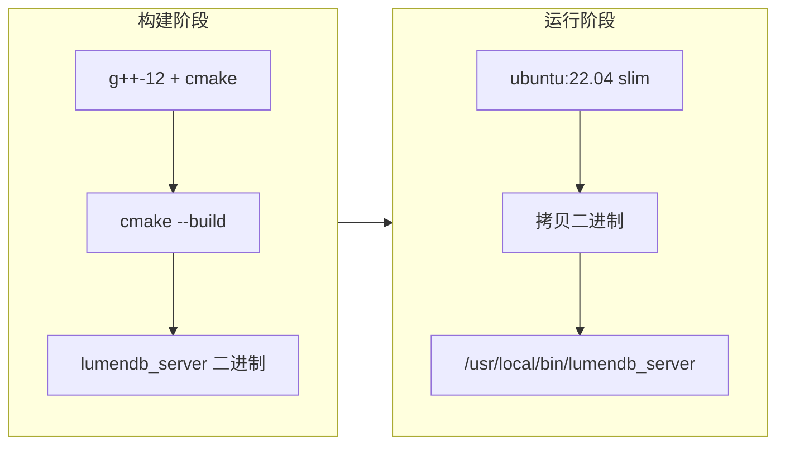

# 第十一章：Docker 与部署

> 容器化 LumenDB + Agent 生产部署方案。

## 前置知识

> 📎 **参考**: [Docker容器化](../prerequisites/03_Docker容器化_zh.md) | [构建环境配置](../prerequisites/01_构建环境配置_zh.md)

---

## 学习目标

- 理解多阶段 Docker 构建
- 掌握 docker-compose 多服务编排
- 学会生产部署检查清单

---

## 11.1 多阶段构建



```dockerfile
# Stage 1: 构建 / Build
FROM ubuntu:22.04 AS builder
RUN apt-get install -y g++-12 cmake ninja-build
COPY . .
RUN cmake -B build && cmake --build build --target lumendb_server

# Stage 2: 运行 / Runtime
FROM ubuntu:22.04
COPY --from=builder /build/build/lumendb_server /usr/local/bin/
EXPOSE 8080
CMD ["lumendb_server", "--port", "8080"]
```

---

## 11.2 Docker Compose 编排

```yaml
version: "3.9"
services:
  lumendb:
    build:
      context: .
      target: lumendb-runtime
    ports: ["8080:8080"]
    volumes: ["./data:/data"]
    healthcheck:
      test: ["CMD", "curl", "-f", "http://localhost:8080/health"]
      
  agent:
    build:
      context: .
      target: agent-runtime
    ports: ["8090:8090"]
    depends_on:
      lumendb:
        condition: service_healthy
    environment:
      - AGENTICDB_LLM_PROVIDER=${LLM_PROVIDER:-ollama}
      - OPENAI_API_KEY=${OPENAI_API_KEY:-}
      
  ollama:
    image: ollama/ollama:latest
    profiles: ["full"]
    volumes: ["ollama_data:/root/.ollama"]
```

---

## 11.3 生产检查清单

| 类别 | 检查项 | 说明 |
|------|--------|------|
| 安全 | API Key | LumenDB `--api-key` 防止未授权 |
| 安全 | HTTPS | Let's Encrypt 反向代理 |
| 可靠性 | 自动重启 | systemd/docker restart policy |
| 可靠性 | 健康检查 | Docker HEALTHCHECK |
| 监控 | 日志 | 日志轮转 (logrotate) |
| 监控 | 告警 | 搜索延迟 P99 > 500ms |
| 性能 | 资源限制 | CPU/Memory cgroups |
| 数据 | 备份 | 定期备份 data 目录 |

---

## 思考题

1. 多阶段构建中，为什么 builder 阶段不直接使用 `python:3.11` 而用 `ubuntu:22.04`？
2. docker-compose 的 `profiles` 参数有什么用？"full" profile 适合什么场景？
3. 如何实现零停机部署？两个容器轮流升级？

## 动手练习

1. 给 Docker 镜像添加健康检查，确保 lumendb 启动后再启动 agent
2. 创建一个 `.env.example` 文件，列出所有可用的环境变量
3. 编写一个 `docker-compose.prod.yml`，添加资源限制和日志配置
