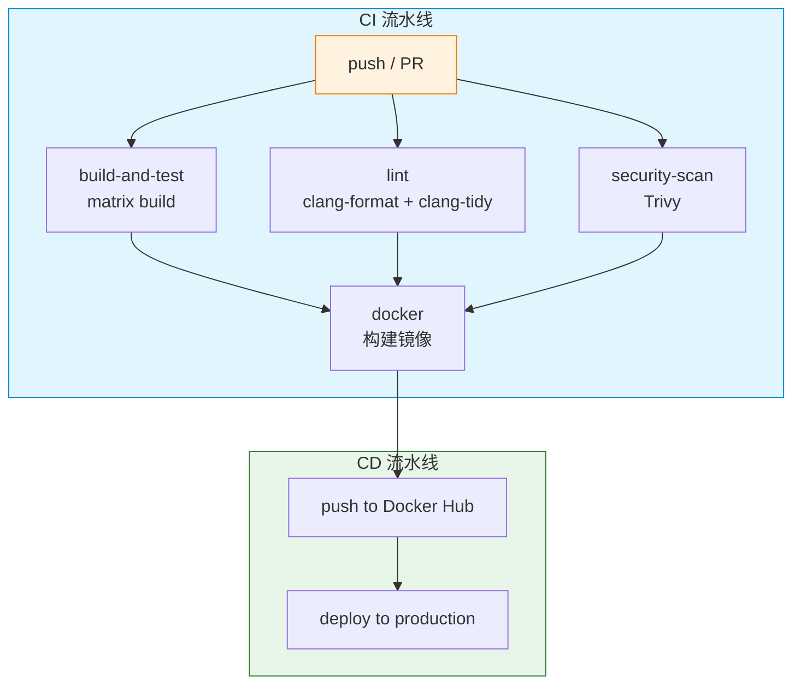
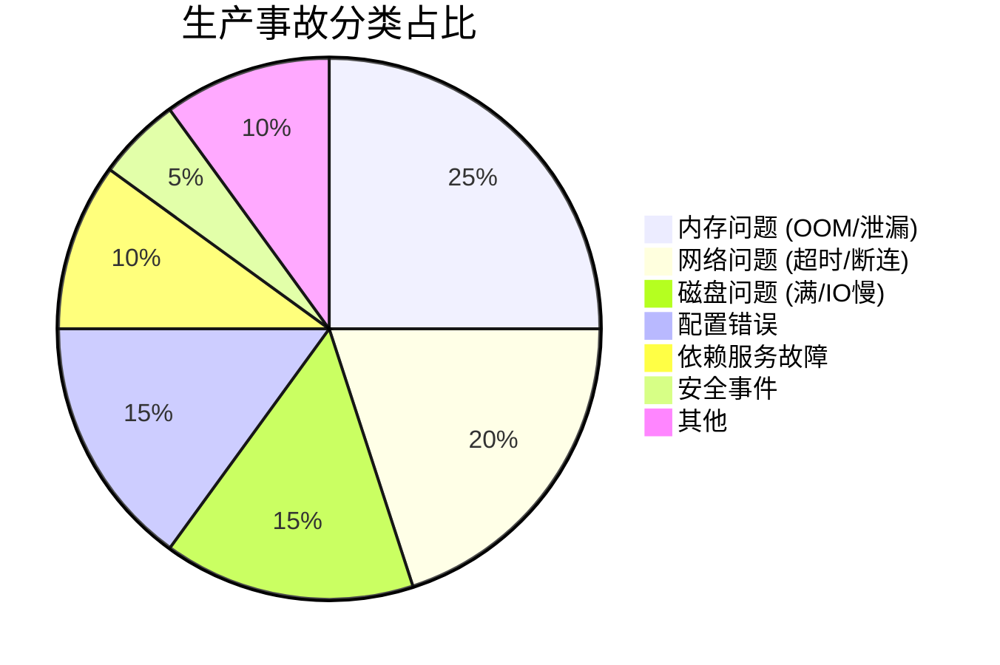

# 第 12 章：生产部署

> **"代码能跑在你的笔记本上 ≠ 代码能在生产环境运行。"**

---

## 前置知识

> 📎 **参考**: [Docker容器化](../prerequisites/02_Docker容器化.md) — Docker 容器基础、镜像构建与 docker-compose
> 📎 **参考**: [测试框架](../prerequisites/04_测试框架.md) — 单元测试与基准测试方法
> 📎 **参考**: [构建环境配置](../prerequisites/01_构建环境配置.md) — CMake 构建与 CI/CD 基础

---

## 目录

1. [Dockerfile 与多阶段构建](#1-dockerfile-与多阶段构建)
2. [docker-compose 编排](#2-docker-compose-编排)
3. [CI/CD：GitHub Actions](#3-cicdgithub-actions)
4. [性能基准测试](#4-性能基准测试)
5. [监控与可观测性](#5-监控与可观测性)
6. [结构化日志](#6-结构化日志)
7. [安全加固](#7-安全加固)
8. [资源限制](#8-资源限制)
9. [思考题](#9-思考题)
10. [动手练习](#10-动手练习)

---

## 1. Dockerfile 与多阶段构建

> Docker 容器基础概念（namespace、cgroup、镜像、容器、Dockerfile）请参阅 [Docker容器化](../prerequisites/02_Docker容器化.md)。本节聚焦多阶段构建和层缓存优化。

### 1.1 为什么需要多阶段构建

单阶段构建的问题——镜像里还有 g++, cmake, git, 源码，体积通常在 500MB-1.5GB。**运行时根本不需要编译器。**

```mermaid
flowchart LR
    subgraph Stage1["Stage 1: 编译阶段"]
        A[ubuntu:22.04] --> B[g++-12 + cmake]
        B --> C[CMakeLists.txt]
        C --> D[make -j$(nproc)]
        D --> E[lumendb 二进制]
    end

    subgraph Stage2["Stage 2: 运行时阶段"]
        F[ubuntu:22.04 slim] --> G[libstdc++]
        G --> H[COPY --from=builder]
        H --> I[最终镜像 ~80MB]
    end

    E --> H

    style Stage1 fill:#e1f5fe,stroke:#0288d1
    style Stage2 fill:#e8f5e9,stroke:#2e7d32
```

### 1.2 完整 Dockerfile

```dockerfile
FROM ubuntu:22.04 AS builder
ENV DEBIAN_FRONTEND=noninteractive

RUN apt-get update && apt-get install -y --no-install-recommends \
    build-essential g++-12 cmake git libssl-dev \
    && rm -rf /var/lib/apt/lists/*

# 先 COPY 依赖描述文件，再 COPY 源码（利用层缓存）
COPY CMakeLists.txt /app/
COPY cmake/ /app/cmake/
WORKDIR /app

RUN cmake -B build -DCMAKE_BUILD_TYPE=Release \
    && cmake --build build --target lumendb -j$(nproc)

# Stage 2: 运行时
FROM ubuntu:22.04
RUN apt-get update && apt-get install -y --no-install-recommends \
    libstdc++ ca-certificates \
    && rm -rf /var/lib/apt/lists/*

RUN useradd --create-home --shell /bin/bash lumendb
USER lumendb

COPY --from=builder /app/build/lumendb /usr/local/bin/lumendb
COPY --from=builder /app/build/liblumen.so /usr/local/lib/
COPY lumendb.json /etc/lumendb/config.json

EXPOSE 8080

HEALTHCHECK --interval=30s --timeout=3s --retries=3 \
    CMD curl -f http://localhost:8080/health || exit 1

ENTRYPOINT ["/usr/local/bin/lumendb"]
CMD ["--config", "/etc/lumendb/config.json"]
```

### 1.3 Dockerfile 层缓存机制

**缓存规则：** 一旦某一层缓存失效，其后所有层都必须重新构建。

```
COPY CMakeLists.txt /app/     ← 层 1: 缓存有效
COPY cmake/ /app/cmake/       ← 层 2: 缓存有效
RUN cmake ...                 ← 层 3: 缓存有效
COPY src/ /app/src/           ← 层 4: 缓存失效（源码改了）
RUN cmake --build ...         ← 层 5: 必须重新构建
```

这就是为什么我们**先 `COPY CMakeLists.txt`，再 `COPY src/`**。

---

## 2. docker-compose 编排

> docker-compose 基础用法请参阅 [Docker容器化](../prerequisites/02_Docker容器化.md)。本节展示生产级配置。

### 2.1 生产级 docker-compose.yml

```yaml
version: "3.8"

services:
  lumendb:
    build:
      context: .
      dockerfile: Dockerfile
    image: lumendb:latest
    container_name: lumendb
    ports:
      - "8080:8080"
    volumes:
      - lumendb_data:/var/lib/lumendb
      - ./lumendb.json:/etc/lumendb/config.json:ro
    environment:
      - LUMENDB_LOG_LEVEL=info
      - LUMENDB_MAX_MEMORY=2GB
    command: ["--config", "/etc/lumendb/config.json"]
    restart: unless-stopped
    healthcheck:
      test: ["CMD", "curl", "-f", "http://localhost:8080/health"]
      interval: 30s
      timeout: 3s
      retries: 3
      start_period: 10s
    deploy:
      resources:
        limits:
          memory: 2G
          cpus: "2"
        reservations:
          memory: 512M
    logging:
      driver: "json-file"
      options:
        max-size: "10m"
        max-file: "3"

  prometheus:
    image: prom/prometheus:latest
    ports:
      - "9090:9090"
    volumes:
      - ./prometheus.yml:/etc/prometheus/prometheus.yml:ro
      - prometheus_data:/prometheus
    depends_on:
      lumendb:
        condition: service_healthy

  grafana:
    image: grafana/grafana:latest
    ports:
      - "3000:3000"
    volumes:
      - grafana_data:/var/lib/grafana
    environment:
      - GF_SECURITY_ADMIN_PASSWORD=admin
    depends_on:
      - prometheus

volumes:
  lumendb_data:
  prometheus_data:
  grafana_data:
```

### 2.2 Readiness vs Liveness 的区别

```
场景 1: 数据库正在重建索引（暂时无法处理查询）
  → Readiness Probe 失败（不接收新请求）
  → Liveness Probe 通过（进程还活着，不该重启）

场景 2: 进程死锁，无法响应任何请求
  → Liveness Probe 失败 → 容器被重启
```

---

## 3. CI/CD：GitHub Actions

### 3.1 完整 GitHub Actions 流水线



```yaml
name: LumenDB CI/CD
on:
  push:
    branches: [main, develop]
  pull_request:
    branches: [main]

env:
  BUILD_TYPE: Release

jobs:
  build-and-test:
    name: Build ${{ matrix.os }} gcc-${{ matrix.gcc }}
    runs-on: ${{ matrix.os }}
    strategy:
      fail-fast: true
      matrix:
        os: [ubuntu-22.04, ubuntu-24.04]
        gcc: [12, 13]
        exclude:
          - os: ubuntu-22.04
            gcc: 13

    steps:
      - uses: actions/checkout@v4
      - name: Install dependencies
        run: |
          sudo apt-get update
          sudo apt-get install -y g++-${{ matrix.gcc }} cmake

      - name: Cache build
        uses: actions/cache@v3
        with:
          path: build/
          key: ${{ runner.os }}-gcc${{ matrix.gcc }}-${{ hashFiles('CMakeLists.txt') }}

      - name: Configure
        run: |
          cmake -B build -DCMAKE_BUILD_TYPE=$BUILD_TYPE \
            -DCMAKE_CXX_COMPILER=g++-${{ matrix.gcc }}

      - name: Build
        run: cmake --build build -j$(nproc)

      - name: Unit tests
        run: cd build && ctest --output-on-failure -j$(nproc)

  lint:
    runs-on: ubuntu-22.04
    steps:
      - uses: actions/checkout@v4
      - name: clang-format check
        run: |
          sudo apt-get install -y clang-format-16
          find . -name '*.cpp' -o -name '*.h' | xargs clang-format-16 --dry-run --Werror

  docker:
    needs: [build-and-test, lint]
    if: github.ref == 'refs/heads/main' && github.event_name == 'push'
    runs-on: ubuntu-22.04
    steps:
      - uses: actions/checkout@v4
      - name: Set up Docker Buildx
        uses: docker/setup-buildx-action@v2
      - name: Login to Docker Hub
        uses: docker/login-action@v2
        with:
          username: ${{ secrets.DOCKER_USERNAME }}
          password: ${{ secrets.DOCKER_TOKEN }}
      - name: Build and push
        uses: docker/build-push-action@v5
        with:
          context: .
          push: true
          tags: |
            ${{ secrets.DOCKER_USERNAME }}/lumendb:latest
            ${{ secrets.DOCKER_USERNAME }}/lumendb:${{ github.sha }}
          cache-from: type=gha
          cache-to: type=gha,mode=max
```

---

## 4. 性能基准测试

### 4.1 HTTP 压测：wrk

```bash
wrk -t 4 -c 100 -d 30s --latency \
    -s post_search.lua \
    http://localhost:8080/api/v1/search
```

### 4.2 C++ 内部基准

```cpp
#include <chrono>
#include <vector>
#include <algorithm>
#include <numeric>

struct BenchmarkResult {
    double mean_us;
    double p50_us;
    double p90_us;
    double p99_us;
    double ops_per_sec;
};

template<typename F>
BenchmarkResult benchmark(F&& fn, int warmup_iterations = 1000,
                          int iterations = 10000) {
    // 预热：消除冷启动效应
    for (int i = 0; i < warmup_iterations; i++) fn();

    std::vector<double> times;
    times.reserve(iterations);

    for (int i = 0; i < iterations; i++) {
        auto start = std::chrono::high_resolution_clock::now();
        fn();
        auto end = std::chrono::high_resolution_clock::now();
        double us = std::chrono::duration<double, std::micro>(end - start).count();
        times.push_back(us);
    }

    std::sort(times.begin(), times.end());
    BenchmarkResult r;
    r.mean_us = std::accumulate(times.begin(), times.end(), 0.0) / times.size();
    r.p50_us  = times[times.size() * 50 / 100];
    r.p90_us  = times[times.size() * 90 / 100];
    r.p99_us  = times[times.size() * 99 / 100];
    r.ops_per_sec = 1e6 / r.mean_us;
    return r;
}
```

### 4.3 关键性能指标

| 指标 | 定义 | 含义 |
|------|------|------|
| **QPS** | 每秒处理的查询数 | 系统吞吐量 |
| **P50** | 50% 的请求在此时间内完成 | "典型"用户体验 |
| **P99** | 99% 的请求在此时间内完成 | "最差"用户体验 |
| **SLI** | 衡量服务质量的具体数值 | SLA 的量化基础 |
| **SLO** | 内部目标，如"P99 < 10ms" | 比 SLA 更严格 |

---

## 5. 监控与可观测性

### 5.1 三大支柱

| 支柱 | 工具/方法 | 回答的问题 |
|------|-----------|-----------|
| **指标（Metrics）** | Prometheus, Grafana | "系统现在怎么样？趋势如何？" |
| **日志（Logs）** | ELK, Loki, 结构化 JSON | "刚才发生了什么？" |
| **追踪（Traces）** | Jaeger, OpenTelemetry | "一个请求经过了哪些服务？" |

### 5.2 RED 方法

| 字母 | 含义 | 对应指标 |
|------|------|----------|
| **R** | **Rate**（速率） | QPS / 请求速率 |
| **E** | **Errors**（错误） | 错误率 |
| **D** | **Duration**（耗时） | P50 / P95 / P99 延迟 |

### 5.3 Prometheus 端点实现

```cpp
#include <prometheus/counter.h>
#include <prometheus/exposer.h>
#include <prometheus/registry.h>

class Metrics {
    prometheus::Exposer exposer_{"8081"};
    std::shared_ptr<prometheus::Registry> registry_ =
        std::make_shared<prometheus::Registry>();

    prometheus::Counter* search_requests_;
    prometheus::Histogram* search_latency_us_;

public:
    Metrics() {
        search_requests_ = &prometheus::BuildCounter()
            .Name("lumendb_search_requests_total")
            .Help("Total search requests")
            .Register(*registry_);

        search_latency_us_ = &prometheus::BuildHistogram()
            .Name("lumendb_search_latency_us")
            .Help("Search latency in microseconds")
            .Register(*registry_);

        exposer_.RegisterCollectable(registry_);
    }

    void record_search(double latency_us) {
        search_requests_->Increment();
        search_latency_us_->Observe(latency_us);
    }
};
```

### 5.4 健康检查详解

| 术语 | 定义 |
|------|------|
| **Health Check** | 定期探测服务是否正常运行 |
| **Readiness Probe** | "我准备好接收流量了吗？" |
| **Liveness Probe** | "我还活着吗？" |

### 5.5 流量控制

| 术语 | 定义 |
|------|------|
| **限流（Rate Limiting）** | 限制客户端在单位时间内的请求数 |
| **熔断器（Circuit Breaker）** | 当下游服务连续失败时，暂时停止调用 |
| **退避（Backoff）** | 失败后等待一段时间再重试（指数退避） |
| **降级（Degradation）** | 压力大时主动关闭非核心功能 |

---

## 6. 结构化日志

### 6.1 为什么需要结构化日志

传统日志难以解析。结构化日志（JSON 格式）：
```json
{
  "ts": "2024-01-15T14:30:02.123Z",
  "level": "info",
  "msg": "search completed",
  "user_id": "42",
  "latency_ms": 2.3,
  "req_id": "a1b2c3d4"
}
```

### 6.2 轻量级实现

```cpp
enum class LogLevel { DEBUG, INFO, WARN, ERROR };

class Logger {
    std::ostream& out_;
    LogLevel min_level_;
public:
    Logger(std::ostream& out = std::cerr, LogLevel level = LogLevel::INFO)
        : out_(out), min_level_(level) {}

    LogEntry log(LogLevel level, const std::string& message) {
        if (level < min_level_) return LogEntry(out_, false);
        // ... 格式化 JSON 输出
    }
};
```

### 6.3 全局 Request ID

```cpp
thread_local std::string t_request_id;

#define LOG_INFO(msg) \
    g_logger.log(LogLevel::INFO, msg).field("req_id", t_request_id)
```

### 6.4 结构化日志 vs 二进制日志

| 维度 | JSON 结构化日志 | 二进制日志 |
|------|----------------|------------|
| 可读性 | 人类可读 | 需要专用工具 |
| 性能 | 序列化开销大 | 高效 |
| 灵活性 | 加字段不需要改 schema | 需要重新编译 |
| 适用 | 中小规模，开发友好 | 高吞吐、低延迟要求 |

---

## 7. 安全加固

### 7.1 TLS 终止

**方案 1: 反向代理（推荐）**

```nginx
server {
    listen 443 ssl;
    server_name lumendb.example.com;
    ssl_certificate     /etc/letsencrypt/live/lumendb.example.com/fullchain.pem;
    ssl_certificate_key /etc/letsencrypt/live/lumendb.example.com/privkey.pem;
    location / {
        proxy_pass http://localhost:8080;
    }
}
```

**方案 2: C++ 内嵌 OpenSSL**

```cpp
#include <openssl/ssl.h>
class TlsServer {
    SSL_CTX* ctx_;
public:
    TlsServer(const char* cert_file, const char* key_file) {
        SSL_library_init();
        ctx_ = SSL_CTX_new(TLS_server_method());
        SSL_CTX_use_certificate_file(ctx_, cert_file, SSL_FILETYPE_PEM);
        SSL_CTX_use_PrivateKey_file(ctx_, key_file, SSL_FILETYPE_PEM);
    }
};
```

### 7.2 输入验证

```cpp
if (content_length > 10 * 1024 * 1024)
    return HttpResponse(413, "Payload too large");

if (vector.size() != expected_dim)
    return HttpResponse(422, "Dimension mismatch");

for (float v : vector) {
    if (std::isnan(v) || std::isinf(v))
        return HttpResponse(400, "Vector contains NaN or Inf");
}
```

---

## 8. 资源限制

### 8.1 三层防护

```yaml
deploy:
  resources:
    limits:
      memory: 2G
      cpus: "2"
    reservations:
      memory: 512M
```

```cpp
#include <sys/resource.h>
void apply_resource_limits() {
    struct rlimit rl;
    rl.rlim_cur = 2ULL * 1024 * 1024 * 1024;
    setrlimit(RLIMIT_AS, &rl);

    rl.rlim_cur = 10000;
    setrlimit(RLIMIT_NOFILE, &rl);
}
```

### 8.2 内存规划

```
总内存 = 索引占用 + 向量存储 + OS overhead + 缓冲池 + Headroom

示例：100万向量 × 768维 × 4 bytes = 3GB
      HNSW 图边存储 (M=16, int64 IDs)：~128MB（1M 节点 × 16 边 × 8 字节）
      mmap 缓存: 1GB
      总计: ~4.2GB，规划 6GB

Headroom: 总工作内存的 20-30%
```



---

## 9. 思考题

1. 多阶段 Docker 构建中，为什么 `COPY CMakeLists.txt` 要在 `COPY src/` 之前？
2. CI 矩阵构建中，为什么 `key: ${{ hashFiles('CMakeLists.txt') }}` 能安全地复用缓存？
3. P99 延迟远高于 P50，可能是什么原因？
4. 如果反向代理终止 TLS，后端服务通过 HTTP 通信，这安全吗？
5. OOM 时，cgroup 的 OOM killer 和 Linux 内核的 OOM killer 有什么区别？
6. 设计一个滚动更新策略
7. 监控中 QPS 突然降到 0 但进程还在，最可能是什么原因？
8. 熔断器的三个状态是什么？
9. 为什么 SLO 要比 SLA 更严格？

---

## 10. 动手练习

### 练习 1：Dockerfile（20 min）
为 LumenDB 写一个多阶段 Dockerfile，验证镜像大小 < 150MB。

### 练习 2：docker-compose 部署（15 min）
编写 docker-compose.yml，包含持久化、健康检查、日志轮转。

### 练习 3：性能基准（25 min）
使用预热 + 多次运行，测量搜索 P50/P90/P99 延迟和 QPS。

### 练习 4：结构化日志（15 min）
在关键路径（插入、搜索、删除）记录 JSON 结构化日志。

### 练习 5：CI Pipeline（可选，30 min）
创建 GitHub Actions workflow：matrix build + clang-format + Docker push。

### 练习 6：压力测试（可选，20 min）
使用 wrk 找到最大 QPS 和内存泄漏。

---

## 本章总结

| 领域 | 关键实践 | 核心概念 |
|------|----------|----------|
| **Docker** | 多阶段构建 → 镜像从 1.5GB 降到 80MB | 容器 = namespace + cgroup（不是 VM）；层缓存 |
| **编排** | docker-compose 一键启停 + 健康检查 | Volume 持久化、Readiness/Liveness Probe |
| **CI/CD** | GitHub Actions matrix build + 缓存 | 从 Jenkins 手动到 GitHub Actions 自动化 |
| **基准** | wrk + C++ benchmark (P50/P90/P99) | 预热消除 cold cache，统计严谨性 |
| **监控** | Prometheus metrics + /proc 自省 | RED 方法，SLI/SLO/SLA |
| **日志** | JSON 结构化 + request ID | 分布式追踪、OpenTelemetry |
| **安全** | TLS (nginx) + 输入验证 + 依赖扫描 | mTLS、限流、熔断器 |
| **资源** | Docker limits + cgroups + rlimit | OOM killer、内存规划 |

> **记住：** 生产环境不是开发环境的"放大版"。它需要不同的思维方式——监控、告警、降级、回滚、SLA……这些才是让你凌晨三点被叫醒时能安然入睡的东西。
>
> 下一章：[第 13 章：终极项目 — 手写向量数据库](../ch13_capstone/README.md)