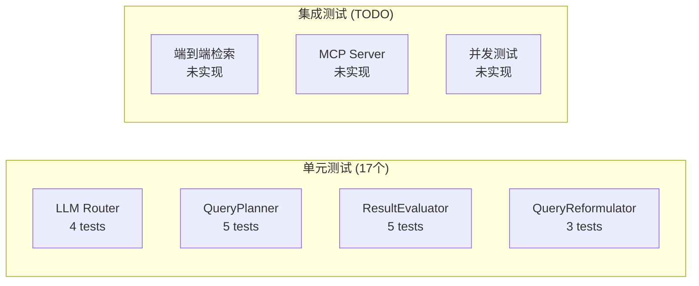

# 第十二章：测试与质量保障

> 17 个单元测试背后的设计哲学。

## 前置知识

> 📎 **参考**: [测试框架](../prerequisites/04_测试框架_zh.md)

---

## 学习目标

- 理解 Agent 层的测试策略
- 掌握 Mock LLM 的测试技巧
- 学会设计可测试的异步代码

---

## 12.1 测试架构



当前 17 个测试覆盖了 4 个核心组件：

| 组件 | 测试数 | 覆盖内容 |
|------|--------|----------|
| LLM Router | 4 | Provider 切换、客户端延迟初始化、默认值、响应格式 |
| QueryPlanner | 5 | 4 种策略、JSON 回退、Tool call 解析 |
| ResultEvaluator | 5 | 高质量、低质量、空结果、边界值、JSON 解析失败 |
| QueryReformulator | 3 | 正常重构、JSON 失败回退、上下文包含验证 |

---

## 12.2 Mock LLM 测试

```python
from unittest.mock import AsyncMock

def mock_llm_response(content: str):
    return LLMResponse(
        content=content,
        tool_calls=[],
        usage={},
        latency_ms=100.0,
        model="test",
        provider="test",
    )

@pytest.mark.asyncio
async def test_plan_direct_strategy():
    llm = AsyncMock(spec=LLMRouter)
    llm.chat.return_value = mock_llm_response(
        json.dumps({
            "strategy": "DIRECT",
            "reasoning": "Simple question",
            "searches": [{"query": "What is RAG?", "k": 10}],
            "expected_rounds": 1,
        })
    )

    planner = QueryPlanner(llm, "default")
    plan = await planner.plan("What is RAG?")

    assert plan.strategy == SearchStrategy.DIRECT
    assert len(plan.steps) == 1
    assert plan.steps[0].query == "What is RAG?"
```

> **关键技巧**: 使用 `AsyncMock` 模拟异步 LLM 调用，
> 通过 `return_value` 控制不同场景的 LLM 输出，验证各组件的容错逻辑。

---

## 12.3 未来需要添加的测试

| 测试 | 优先级 | 说明 |
|------|--------|------|
| 端到端测试 | P0 | Agent + LumenDB 完整流程 |
| MCP 测试 | P0 | Mock HTTP, 验证工具调用 |
| 并发测试 | P1 | 多请求同时检索 |
| LLM 异常测试 | P1 | 超时、非 JSON 返回 |
| 性能回归 | P2 | CI 中运行 benchmark |

---

## 思考题

1. 为什么 `ResultEvaluator` 的测试不需要真实的 LLM？Mock 测试有什么局限性？
2. 端到端测试中，如何确保 LumenDB 的状态是可重复的？
3. 并发测试应该关注哪些指标？结果正确性还是性能？

## 动手练习

1. 为 `LLMRouter._chat_openai` 添加测试：模拟 HTTP 超时场景
2. 为 `MultiRoundEngine` 添加集成测试 (Mock LumenDB)
3. 添加一个新的测试覆盖率检查：确保所有 `except` 分支都被测试覆盖
