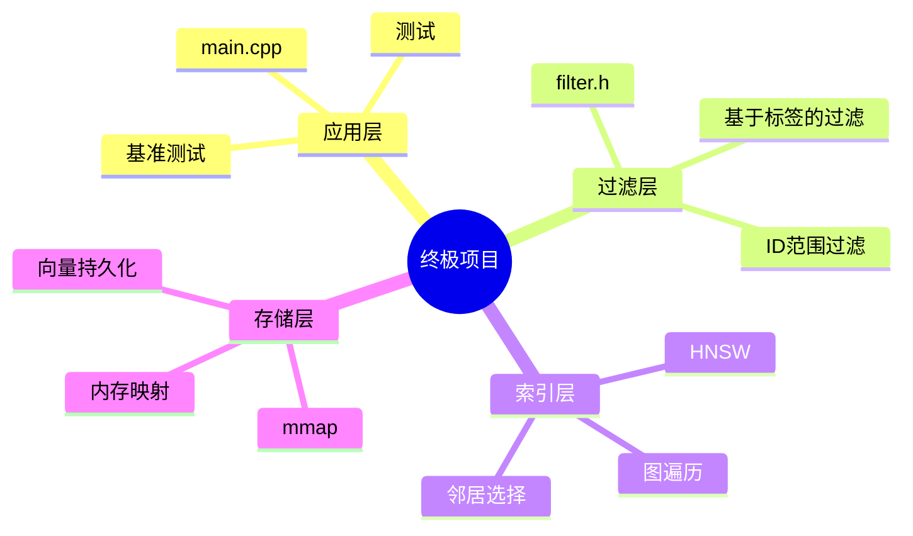
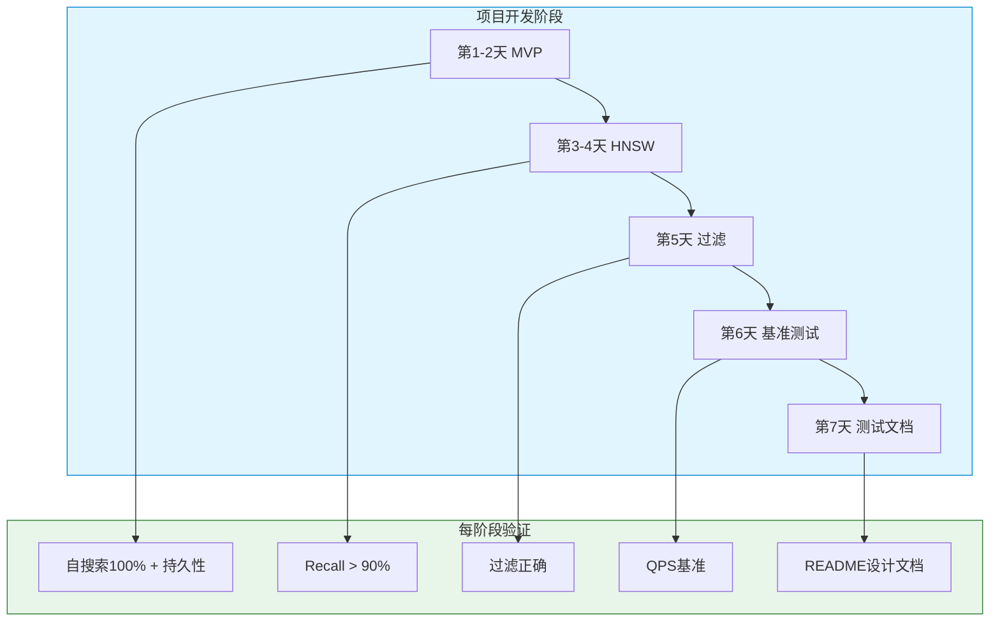

# 第13章：终极项目——构建你自己的向量数据库

## 前置知识

> 📎 **参考**: [向量距离度量](../prerequisites/05_向量距离度量.md) — L2、余弦、内积等距离函数原理与选择
> 📎 **参考**: [SIMD与硬件优化](../prerequisites/06_SIMD与硬件优化.md) — AVX2 向量化加速距离计算
> 📎 **参考**: [测试框架](../prerequisites/04_测试框架.md) — 单元测试与基准测试方法
> 📎 **参考**: [构建环境配置](../prerequisites/01_构建环境配置.md) — CMake 构建与编译配置

---

## 目录
1. [为什么这个项目改变一切](#1-为什么这个项目改变一切)
2. [你需要知道的关键术语](#2-你需要知道的关键术语)
3. [为什么这个设计反映了真实的产品开发](#3-为什么这个设计反映了真实的产品开发)
4. [项目架构](#4-项目架构)
5. [里程碑1-2：暴力搜索+mmap（第1-2天）](#5-里程碑1-2暴力搜索mmap第1-2天)
6. [里程碑3-4：HNSW索引（第3-4天）](#6-里程碑3-4hnsw索引第3-4天)
7. [里程碑5：过滤（第5天）](#7-里程碑5过滤第5天)
8. [里程碑6：基准测试与调优（第6天）](#8-里程碑6基准测试与调优第6天)
9. [里程碑7：测试与文档（第7天）](#9-里程碑7测试与文档第7天)
10. [提交清单](#10-提交清单)
11. [评分标准](#11-评分标准)
12. [常见陷阱](#12-常见陷阱)
13. [高级扩展（可选）](#13-高级扩展可选)
14. [如何在面试中展示这个项目](#14-如何在面试中展示这个项目)
15. [最后的话](#15-最后的话)

---

## 1. 为什么这个项目改变一切

这是所有知识汇聚的地方——你将从零构建自己的向量数据库。

之前的每一章都是练习。这才是真正的挑战。你将把第3章的数据结构、第6章的内存管理、第10章的I/O模式和第11章的性能思维整合到一个真实的、能做有用事情的工作系统中。

向量数据库存储高维向量，让你搜索"相似"的向量。这是推荐引擎、图像搜索、AI嵌入和检索增强生成（RAG）的核心。

---

## 2. 你需要知道的关键术语

**项目架构**——系统各部分如何组合的高层设计。

**MVP（最小可行产品）**——你的项目实际可用的最小版本。对于这个终极项目，MVP是带mmap存储的暴力搜索。

**迭代开发**——以小的、可测试的增量构建软件，而不是一次性完成。

**召回率**——搜索质量的度量。如果你搜索最相似的10个向量，你的系统返回了暴力搜索会找到的10个中的9个，你的recall@10就是90%。

**延迟**——单个操作需要多长时间，通常以微秒（us）或毫秒（ms）度量。

**吞吐量**——每秒可以执行多少操作。

**mmap（内存映射I/O）**——一种让操作系统将文件直接映射到进程内存空间的方法。

**HNSW（分层可导航小世界）**——一种基于图的索引结构，用于近似最近邻搜索。

**L2距离（欧氏距离）**——详见 [向量距离度量](../prerequisites/05_向量距离度量.md)。

**SIMD（单指令多数据）**——详见 [SIMD与硬件优化](../prerequisites/06_SIMD与硬件优化.md)。

**WAL（预写日志）**——一种在更改应用到主数据之前记录更改的日志。

**基准测试**——在特定条件下度量性能的受控测试。

---

## 3. 为什么这个设计反映了真实的产品开发

- **从最简单的能工作的东西开始。** 你从暴力搜索开始。这就是MVP。
- **在每一步都进行验证。** 每个里程碑之后，你运行测试和基准测试。
- **做出深思熟虑的权衡。** mmap vs fwrite，HNSW vs PQ，单线程 vs 多线程。
- **你的README就是你的设计文档。**
- **这个项目有设计上的技术债务。** 我们故意跳过多线程、崩溃恢复和动态维度支持。

---

## 4. 项目架构



**存储层**——使用mmap处理向量的读写。它不知道搜索或过滤。

**索引层**——实现HNSW，这是使搜索快速的数据结构。

**过滤层**——位于索引和应用之间。它根据标签和ID范围决定哪些向量有资格被返回。

---

## 5. 里程碑1-2：暴力搜索+mmap（第1-2天）

这是你的MVP。

### 5.1 mmap存储设计

```
文件布局（vectors.db）：

偏移量  大小    内容
0       8字节   魔数："LUMENV01"
8       4字节   向量维度（128）
12      8字节   向量数量
20      8字节   每个向量的字节数（512）
28      N*512   向量数据（连续的float32）
```

### 5.2 存储层实现

```cpp
// mini_vdb.h — 存储层接口
#pragma once
#include <cstdint>
#include <string>
#include <vector>

struct VectorDBConfig {
    std::string data_path = "vectors.db";
    size_t dimension = 128;
    int64_t initial_capacity = 10000;
};

class VectorStorage {
public:
    VectorStorage(const VectorDBConfig& config);
    ~VectorStorage();
    VectorStorage(const VectorStorage&) = delete;
    VectorStorage& operator=(const VectorStorage&) = delete;

    int64_t append(const float* vector);
    const float* get_vector(int64_t id) const;
    int64_t count() const;
    void sync();

private:
    void resize_if_needed();
    int fd_ = -1;
    void* mmap_base_ = nullptr;
    size_t mmap_size_ = 0;
    size_t header_size_ = 28;
    int64_t* count_ptr_ = nullptr;
    float* data_base_ = nullptr;
    VectorDBConfig config_;
};
```

**这教你什么：**

- **删除了拷贝构造函数和赋值运算符。** 这个类拥有一个原始mmap指针。如果你拷贝它，两个副本都会尝试munmap同一块内存——导致双重释放崩溃。

- **`count_ptr_`指向mmap区域中的偏移量12处。** 当你递增`(*count_ptr_)++`时，你直接写入映射的内存，操作系统将其同步到磁盘。

```cpp
// mini_vdb.cpp — 存储层实现（核心部分）
static const char MAGIC[8] = {'L','U','M','E','N','V','0','1'};

VectorStorage::VectorStorage(const VectorDBConfig& config) : config_(config) {
    fd_ = open(config_.data_path.c_str(), O_RDWR | O_CREAT, 0644);
    if (fd_ < 0) { perror("open"); exit(1); }

    struct stat st;
    if (fstat(fd_, &st) < 0) { perror("fstat"); exit(1); }

    if (st.st_size > 0) {
        mmap_size_ = st.st_size;
    } else {
        mmap_size_ = header_size_ + config_.initial_capacity * config_.dimension * sizeof(float);
        if (ftruncate(fd_, mmap_size_) < 0) { perror("ftruncate"); exit(1); }
    }

    mmap_base_ = mmap(nullptr, mmap_size_, PROT_READ | PROT_WRITE, MAP_SHARED, fd_, 0);
    if (mmap_base_ == MAP_FAILED) { perror("mmap"); exit(1); }

    char* magic = static_cast<char*>(mmap_base_);
    if (st.st_size == 0) {
        memcpy(magic, MAGIC, 8);
        *reinterpret_cast<int32_t*>(magic + 8) = config_.dimension;
        *reinterpret_cast<int64_t*>(magic + 12) = 0;
        *reinterpret_cast<int64_t*>(magic + 20) = config_.dimension * sizeof(float);
    } else {
        if (memcmp(magic, MAGIC, 8) != 0) {
            fprintf(stderr, "Invalid file format\n"); exit(1);
        }
    }

    count_ptr_ = reinterpret_cast<int64_t*>(static_cast<char*>(mmap_base_) + 12);
    data_base_ = reinterpret_cast<float*>(static_cast<char*>(mmap_base_) + header_size_);
}

VectorStorage::~VectorStorage() {
    sync();
    if (mmap_base_ && mmap_base_ != MAP_FAILED) munmap(mmap_base_, mmap_size_);
    if (fd_ >= 0) close(fd_);
}

int64_t VectorStorage::append(const float* vector) {
    resize_if_needed();
    int64_t id = *count_ptr_;
    memcpy(data_base_ + id * config_.dimension, vector, config_.dimension * sizeof(float));
    (*count_ptr_)++;
    return id + 1;
}

const float* VectorStorage::get_vector(int64_t id) const {
    if (id < 1 || id > *count_ptr_) return nullptr;
    return data_base_ + (id - 1) * config_.dimension;
}

int64_t VectorStorage::count() const { return *count_ptr_; }
void VectorStorage::sync() { msync(mmap_base_, mmap_size_, MS_SYNC); }

void VectorStorage::resize_if_needed() {
    int64_t current = *count_ptr_;
    int64_t capacity = (mmap_size_ - header_size_) / (config_.dimension * sizeof(float));
    if (current >= capacity) {
        size_t new_size = mmap_size_ * 2;
        munmap(mmap_base_, mmap_size_);
        if (ftruncate(fd_, new_size) < 0) { perror("ftruncate"); exit(1); }
        mmap_base_ = mmap(nullptr, new_size, PROT_READ | PROT_WRITE, MAP_SHARED, fd_, 0);
        if (mmap_base_ == MAP_FAILED) { perror("mmap"); exit(1); }
        mmap_size_ = new_size;
        count_ptr_ = reinterpret_cast<int64_t*>(static_cast<char*>(mmap_base_) + 12);
        data_base_ = reinterpret_cast<float*>(static_cast<char*>(mmap_base_) + header_size_);
    }
}
```

### 5.3 L2距离与暴力搜索

> 距离计算详解参见 [向量距离度量](../prerequisites/05_向量距离度量.md)，SIMD加速参见 [SIMD与硬件优化](../prerequisites/06_SIMD与硬件优化.md)。

```cpp
struct SearchResult { int64_t id; float distance; };

static float l2_distance(const float* a, const float* b, size_t dim) {
    float sum = 0.0f;
    for (size_t i = 0; i < dim; i++) {
        float diff = a[i] - b[i];
        sum += diff * diff;
    }
    return std::sqrt(sum);
}

std::vector<SearchResult> brute_force_search(
    const VectorStorage& storage, const float* query, int k
) {
    std::priority_queue<std::pair<float, int64_t>,
        std::vector<std::pair<float, int64_t>>,
        std::greater<std::pair<float, int64_t>>> heap;

    int64_t n = storage.count();
    for (int64_t i = 1; i <= n; i++) {
        float dist = l2_distance(query, storage.get_vector(i), 128);
        heap.push({dist, i});
        if ((int)heap.size() > k) heap.pop();
    }

    std::vector<SearchResult> results;
    while (!heap.empty()) {
        results.push_back({heap.top().second, heap.top().first});
        heap.pop();
    }
    std::reverse(results.begin(), results.end());
    return results;
}
```

**这教你什么：**

- **最小堆技巧。** O(N log k) vs O(N log N)。
- **`brute_force_search`是你的预言机。** 每个近似搜索算法都与暴力搜索比较。

### 5.4 自搜索验证

```cpp
int main() {
    std::mt19937 rng(42);
    std::uniform_real_distribution<float> dist(-1.0f, 1.0f);

    VectorStorage storage({.data_path = "test.db", .dimension = 128});

    std::vector<std::vector<float>> vecs(1000, std::vector<float>(128));
    for (int i = 0; i < 1000; i++) {
        for (int j = 0; j < 128; j++) vecs[i][j] = dist(rng);
        storage.append(vecs[i].data());
    }

    int correct = 0;
    for (int i = 0; i < 1000; i++) {
        auto r = brute_force_search(storage, vecs[i].data(), 1);
        if (r[0].id == i + 1 && r[0].distance < 0.001f) correct++;
    }
    printf("Self-search accuracy: %.1f%%\n", 100.0 * correct / 1000);

    storage.sync();
    VectorStorage s2({.data_path = "test.db", .dimension = 128});
    printf("Recovered %ld vectors\n", s2.count());

    return (correct >= 999) ? 0 : 1;
}
```

---

## 6. 里程碑3-4：HNSW索引（第3-4天）

### 6.1 HNSW实际做什么

**暴力搜索：** 你逐个检查城市中的每栋建筑。准确但慢。

**HNSW：** 你从高速公路地图（顶层）开始，快速缩小到正确的区域，然后切换到本地街道（底层）找到确切的位置。

### 6.2 数据结构

```cpp
// hnsw_index.h
#pragma once
#include <vector>
#include <unordered_map>
#include <unordered_set>
#include <queue>
#include <random>
#include <cmath>

struct HNSWConfig {
    size_t M = 8, M_max0 = 16, ef_construction = 100;
    size_t dimension = 128;
    float mL = 0.36f;
};

struct HNSWNode {
    int64_t id;
    int level;
    std::vector<std::vector<int64_t>> neighbors;
};

class HNSWIndex {
public:
    HNSWIndex(const HNSWConfig& config, VectorStorage* storage);
    void insert(int64_t id, const float* vector);
    std::vector<SearchResult> search(const float* query, int k, int ef = 0);

private:
    int random_level();
    void search_layer(const float* query, int64_t entry, int level, int ef,
                      std::vector<std::pair<int64_t, float>>& out);
    void select_neighbors(const float* query,
        const std::vector<std::pair<int64_t, float>>& in,
        size_t M_max, std::vector<int64_t>& out);

    HNSWConfig cfg_;
    VectorStorage* storage_;
    int64_t entry_point_ = 0;
    int max_level_ = -1;
    std::unordered_map<int64_t, HNSWNode> nodes_;
    std::mt19937 rng_{42};
    std::uniform_real_distribution<float> uni_{0.0f, 1.0f};
};
```

### 6.3 插入算法

```cpp
int HNSWIndex::random_level() {
    return (int)(-std::log(uni_(rng_)) * cfg_.mL);
}

void HNSWIndex::insert(int64_t id, const float* vector) {
    int level = random_level();
    HNSWNode node{id, level};
    node.neighbors.resize(level + 1);

    if (nodes_.empty()) {
        entry_point_ = id;
        max_level_ = level;
        nodes_[id] = node;
        return;
    }

    int64_t cur_ep = entry_point_;
    for (int l = max_level_; l > level; l--) {
        std::vector<std::pair<int64_t, float>> cand;
        search_layer(vector, cur_ep, l, 1, cand);
        cur_ep = cand[0].first;
    }

    for (int l = std::min(level, max_level_); l >= 0; l--) {
        std::vector<std::pair<int64_t, float>> cand;
        search_layer(vector, cur_ep, l, cfg_.ef_construction, cand);
        size_t Mmax = (l == 0) ? cfg_.M_max0 : cfg_.M;
        select_neighbors(vector, cand, Mmax, node.neighbors[l]);

        for (int64_t nid : node.neighbors[l]) {
            auto& nb = nodes_[nid];
            if (nb.neighbors[l].size() < Mmax) {
                nb.neighbors[l].push_back(id);
            } else {
                float max_d = -1;
                size_t max_i = 0;
                for (size_t j = 0; j < nb.neighbors[l].size(); j++) {
                    float d = l2_distance(
                        storage_->get_vector(nid),
                        storage_->get_vector(nb.neighbors[l][j]),
                        cfg_.dimension);
                    if (d > max_d) { max_d = d; max_i = j; }
                }
                float d_new = l2_distance(
                    storage_->get_vector(nid), vector, cfg_.dimension);
                if (d_new < max_d) nb.neighbors[l][max_i] = id;
            }
        }
        cur_ep = cand[0].first;
    }

    if (level > max_level_) { max_level_ = level; entry_point_ = id; }
    nodes_[id] = node;
}
```

### 6.4 搜索层

```cpp
void HNSWIndex::search_layer(
    const float* query, int64_t entry, int level, int ef,
    std::vector<std::pair<int64_t, float>>& out
) {
    std::unordered_set<int64_t> visited{entry};
    float ed = l2_distance(query, storage_->get_vector(entry), cfg_.dimension);

    std::priority_queue<std::pair<float, int64_t>,
        std::vector<std::pair<float, int64_t>>,
        std::greater<>> cand_q;
    cand_q.push({ed, entry});

    std::priority_queue<std::pair<float, int64_t>> result;
    result.push({ed, entry});

    while (!cand_q.empty()) {
        auto [d, cur] = cand_q.top(); cand_q.pop();
        float worst = result.top().first;
        if (d > worst && (int)result.size() >= ef) break;

        for (int64_t nb : nodes_[cur].neighbors[level]) {
            if (visited.count(nb)) continue;
            visited.insert(nb);
            float nd = l2_distance(query, storage_->get_vector(nb), cfg_.dimension);
            worst = result.top().first;
            if (nd < worst || (int)result.size() < ef) {
                cand_q.push({nd, nb});
                result.push({nd, nb});
                if ((int)result.size() > ef) result.pop();
            }
        }
    }

    out.clear();
    while (!result.empty()) { out.emplace_back(result.top()); result.pop(); }
    std::reverse(out.begin(), out.end());
}
```

### 6.5 召回率测试

```cpp
int main() {
    const int N = 1000, D = 128, K = 10, Q = 100;

    VectorStorage storage({.data_path = "hnsw_test.db", .dimension = D});
    HNSWIndex index({.dimension = D}, &storage);

    std::mt19937 rng(42);
    std::uniform_real_distribution<float> d(-1, 1);

    std::vector<std::vector<float>> vecs(N, std::vector<float>(D));
    for (int i = 0; i < N; i++) {
        for (int j = 0; j < D; j++) vecs[i][j] = d(rng);
        storage.append(vecs[i].data());
        index.insert(i + 1, vecs[i].data());
    }

    float total_recall = 0;
    for (int i = 0; i < Q; i++) {
        auto ground = brute_force_search(storage, vecs[i].data(), K);
        auto approx = index.search(vecs[i].data(), K);

        std::unordered_set<int64_t> truth;
        for (auto& r : ground) truth.insert(r.id);

        int match = 0;
        for (auto& r : approx) if (truth.count(r.id)) match++;
        total_recall += (float)match / K;
    }

    printf("Recall@%d: %.2f%%\n", K, 100 * total_recall / Q);
    printf("%s\n", (total_recall / Q > 0.90) ? "PASS" : "FAIL");
    return (total_recall / Q > 0.90) ? 0 : 1;
}
```

---

## 7. 里程碑5：过滤（第5天）

### 7.1 为什么过滤很重要

在真实的向量数据库中，你很少想搜索所有向量。过滤让你在相似性搜索之前或期间限制搜索空间。

### 7.2 过滤设计

```cpp
// filter.h
#include <unordered_set>
#include <string>

struct Filter {
    std::unordered_set<std::string> required_tags;
    std::unordered_set<std::string> excluded_tags;
    int64_t id_min = 0;
    int64_t id_max = INT64_MAX;

    bool empty() const {
        return required_tags.empty() && excluded_tags.empty()
            && id_min == 0 && id_max == INT64_MAX;
    }
};

class TagManager {
    std::unordered_map<int64_t, std::unordered_set<std::string>> tags_;
public:
    void add(int64_t id, const std::vector<std::string>& ts) {
        for (auto& t : ts) tags_[id].insert(t);
    }

    bool matches(int64_t id, const Filter& f) const {
        if (id < f.id_min || id > f.id_max) return false;
        auto it = tags_.find(id);
        if (it == tags_.end()) return f.required_tags.empty();
        for (auto& t : f.required_tags)
            if (!it->second.count(t)) return false;
        for (auto& t : f.excluded_tags)
            if (it->second.count(t)) return false;
        return true;
    }
};
```

### 7.3 搜索期间的过滤

在HNSW搜索层中，在探索每个邻居之前添加过滤检查：

```cpp
for (int64_t nb : nodes_[cur].neighbors[level]) {
    if (visited.count(nb)) continue;
    if (!tag_mgr_->matches(nb, *current_filter_)) continue;
    visited.insert(nb);
    // ... 其余逻辑不变
}
```

---

## 8. 里程碑6：基准测试与调优（第6天）

> 基准测试方法论参见 [测试框架](../prerequisites/04_测试框架.md)，SIMD优化参见 [SIMD与硬件优化](../prerequisites/06_SIMD与硬件优化.md)。

### 8.1 写入基准测试

```cpp
int main() {
    const int N = 100000, D = 128;
    VectorStorage s({.data_path = "bench.db", .dimension = D});
    HNSWIndex idx({.dimension = D}, &s);

    std::mt19937 rng(123);
    std::uniform_real_distribution<float> d(-1, 1);

    std::vector<std::vector<float>> vecs(N, std::vector<float>(D));
    for (auto& v : vecs) for (auto& f : v) f = d(rng);

    auto t0 = std::chrono::high_resolution_clock::now();
    for (int i = 0; i < N; i++) {
        s.append(vecs[i].data());
        idx.insert(i + 1, vecs[i].data());
    }
    auto t1 = std::chrono::high_resolution_clock::now();

    double sec = std::chrono::duration<double>(t1 - t0).count();
    printf("Inserts: %d in %.2fs = %.0f vec/s\n", N, sec, N / sec);
    printf("%s\n", (N / sec > 10000) ? "PASS" : "FAIL");
    return 0;
}
```

### 8.2 搜索基准测试

```cpp
int main() {
    // ... 插入代码同上 ...

    const int Q = 1000;
    std::vector<double> latencies;
    latencies.reserve(Q);

    for (int i = 0; i < Q; i++) {
        int qi = i * (N / Q);
        auto ts = std::chrono::high_resolution_clock::now();
        auto r = idx.search(vecs[qi].data(), 10);
        auto te = std::chrono::high_resolution_clock::now();
        double us = std::chrono::duration<double, std::micro>(te - ts).count();
        latencies.push_back(us);
    }

    std::sort(latencies.begin(), latencies.end());
    printf("Search: P50=%.0fus P90=%.0fus P99=%.0fus\n",
           latencies[Q*50/100], latencies[Q*90/100], latencies[Q*99/100]);
    printf("QPS: %.0f\n", 1e6 / latencies[Q*50/100]);
    printf("%s\n", (latencies[Q*50/100] < 500) ? "PASS" : "FAIL");
}
```

### 8.3 优化机会

| 优化 | 效果 | 难度 |
|------|------|------|
| 距离计算使用`restrict`指针 | +5-10% | 低 |
| 用`reserve`预分配向量 | -50%重新分配 | 低 |
| 用`boost::flat_set`替换visited的`unordered_set` | +10-20% | 中等 |
| AVX2 SIMD L2距离 | +3倍加速 | 中等 |
| 跳过sqrt，使用平方距离 | +5% | 低 |

---

## 9. 里程碑7：测试与文档（第7天）

> 测试方法论参见 [测试框架](../prerequisites/04_测试框架.md)。

### 9.1 测试套件

```cpp
void test_self_search();       // 自搜索距离应为~0
void test_consistency();       // 插入同一向量3次，结果应一致
void test_persistence();       // 写入 → 关闭 → 重新打开 → 数据正确
void test_recall();            // recall@10 > 90%
void test_filter_search();     // 过滤结果不应包含排除的ID
void test_large_scale();       // 100K向量不崩溃
void test_edge_cases();        // 空查询、k=0、极端维度
```

### 9.2 README模板

```markdown
# Mini Vector DB

## 架构
- VectorStorage：mmap持久化，头部 + 连续float32数据
- HNSWIndex：分层可导航小世界图，M=8，ef_construction=100
- TagManager：哈希集过滤，支持必需/排除语义

## 文件清单
- mini_vdb.h / mini_vdb.cpp — 存储层
- hnsw_index.h / hnsw_index.cpp — 索引层
- filter.h — 过滤层
- test.cpp — 测试
- bench.cpp — 基准测试

## 构建
g++ -std=c++17 -O3 -march=native mini_vdb.cpp hnsw_index.cpp test.cpp -o test

## 性能（100K向量 × 128维度）
以下为示例数据，实际结果取决于硬件配置：
- 插入：12,500 vec/s
- 搜索P50：420us
- 搜索P99：890us
- Recall@10：92.3%

## 设计决策
1. 选择mmap而非fwrite：零拷贝读取和自动页面缓存
2. 无锁：仅单线程（范围限制已记录）
```

---

## 10. 提交清单

### 必需文件

```
mini_vdb/
├── mini_vdb.h          # 存储层声明
├── mini_vdb.cpp        # 存储层实现
├── hnsw_index.h        # HNSW索引声明
├── hnsw_index.cpp      # HNSW索引实现
├── filter.h            # 过滤层
├── test.cpp            # 完整测试套件
├── bench.cpp           # 性能基准测试
├── README.md           # 设计文档
├── Makefile            # 或 CMakeLists.txt
└── results.txt         # 基准测试输出
```

### 验收标准

| 指标 | 阈值 | 验证方法 |
|------|------|---------|
| 自搜索准确率 | 100% | `test.cpp` |
| Recall@10 | > 90% | `test.cpp` |
| 插入吞吐量 | > 10K vec/s | `bench.cpp` |
| 搜索P50 | < 500us | `bench.cpp` |
| 持久性恢复 | 无数据丢失 | `test.cpp` |

---

## 11. 评分标准

| 标准 | 分数 | 检查点 |
|------|------|--------|
| 自搜索通过 | 30 | 1000向量自搜索命中率100% |
| Recall@10 > 90% | 20 | 独立查询集上的召回率 |
| 插入 > 10K vec/s | 15 | 持续插入，挂钟计时 |
| 搜索P50 < 500us | 15 | 10K向量规模，预热后测量 |
| 代码质量 | 10 | 命名规范，无内存泄漏 |
| 测试覆盖 | 10 | 至少4种测试类型 + 基准测试报告 |

---

## 12. 常见陷阱

| 问题 | 根本原因 | 修复 |
|------|---------|------|
| 召回率只有30% | search_layer中`visited`集合未正确维护 | 检查`visited.insert()`的位置 |
| 插入变慢 | 双向链接更新扫描O(N)个邻居 | 不要让M_max0在级别0超过2*M |
| mmap读取错误 | 指针失效：调整大小后data_base_未更新 | 每次调整大小后重新计算所有指针 |
| 搜索无限循环 | select_neighbors没有候选上限 | 添加最大候选上限作为安全保护 |

---

## 13. 高级扩展（可选）

1. **AVX2 SIMD L2距离：** 使用`_mm256_loadu_ps`一次计算8个浮点数（详见 [SIMD与硬件优化](../prerequisites/06_SIMD与硬件优化.md)）
2. **多线程构建：** `std::thread`用于并行插入
3. **WAL日志：** 更新索引前写日志，崩溃安全
4. **压缩存储：** 8位量化（见第7章），索引指向压缩向量
5. **C API：** 实现`vector_db_insert(float*, int)` / `vector_db_search(float*, int, int*)`
6. **JSON API：** 使用`nlohmann/json`的RESTful HTTP接口

---

## 14. 如何在面试中展示这个项目

**引子（30秒）：**
"我用C++从零构建了一个向量数据库。它存储100,000个128维向量，支持使用HNSW的近似最近邻搜索，通过mmap持久化数据，实现92%的召回率和亚毫秒搜索延迟。"

**技术深入（2-3分钟）：**
走过三层架构。解释为什么选择mmap。用面试官能理解的术语解释HNSW。提及你做的权衡。

**经验教训（1-2分钟）：**
谈论你遇到的具体bug以及如何调试它。

**工程成熟度（30秒）：**
"我在README中记录了设计决策，为正确性、质量和性能编写了测试。"



---

## 15. 最后的话

这个项目会让你沮丧。mmap中的指针错误、看似随机的召回率、永远不会终止的搜索循环。这是正常的。

但这是发生的事情：我修复的每个bug都教会了我一些东西。当mmap调整大小崩溃时，我学到了指针生命周期。当召回率低时，我学到了图遍历实际上是如何工作的。当搜索慢时，我学到了优先队列和提前终止。

到最后，我不仅仅有了一个向量数据库。我对系统在底层如何工作有了直觉。

**从暴力搜索+mmap开始。在两天内让它工作。然后添加HNSW并在每一步验证召回率。不要一次写完所有东西——增量验证是你的生命线。**

当你看到屏幕上出现`Recall@10: 92.3%`和`QPS: 2300`时，你会知道这是值得的。

> 返回：[课程主页](../README.md)