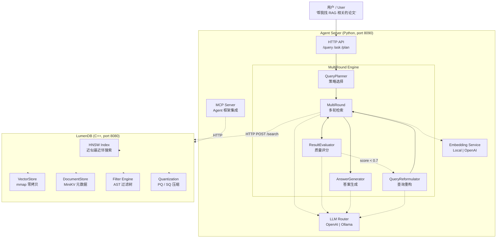
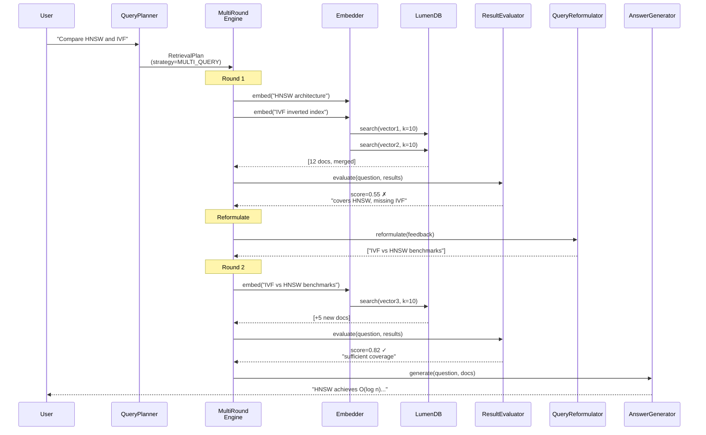
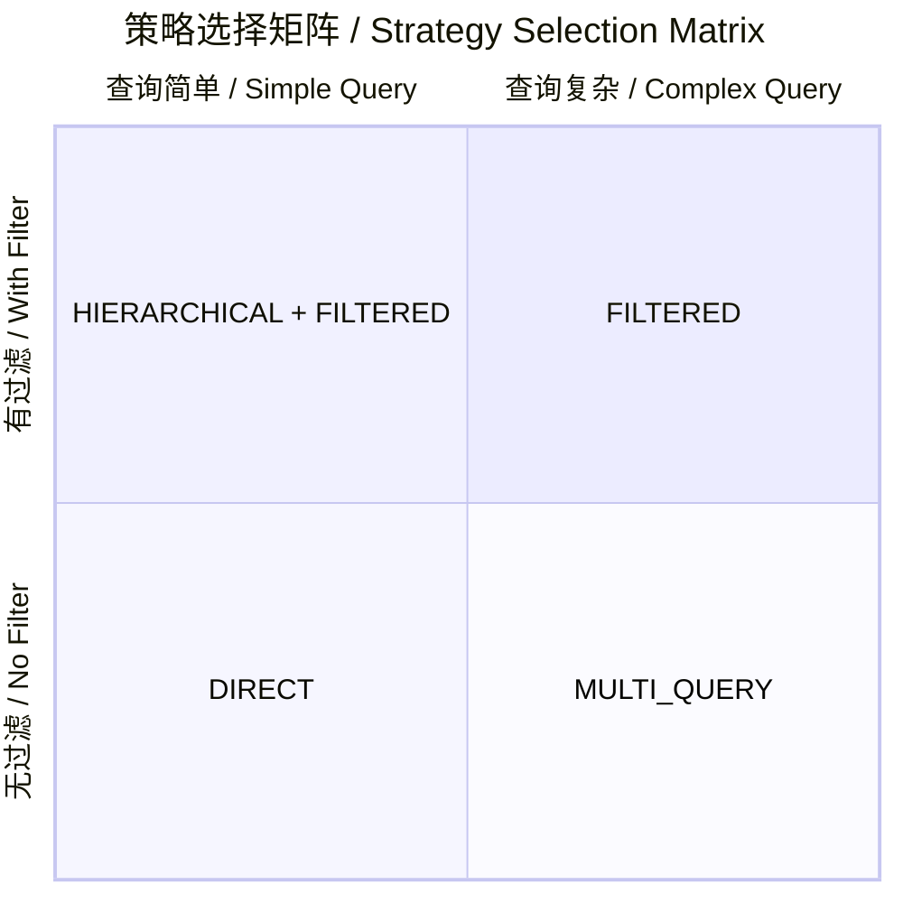

# AgenticDB — Agent-Native Vector Database

> 让向量数据库自己会思考 / Making vector databases think for themselves.

AgenticDB extends [LumenDB](https://github.com/Thezx-a/LumenDB) from a passive vector store into an **agent-native database** that can understand natural language queries, autonomously plan multi-round retrieval strategies, and self-evaluate result quality.

---

## Architecture

### System Overview



### Multi-Round Retrieval Flow




## System Components

### Python Agent Layer (`agent/`)

| Module | File | Purpose |
|--------|------|---------|
| **Config** | `config.py` | Central configuration: LLM provider, embedding, thresholds |
| **LLM Router** | `llm/router.py` | Unified async interface for OpenAI API and Ollama |
| **LLM Schemas** | `llm/schemas.py` | Function calling schemas for tool use |
| **LLM Prompts** | `llm/prompts.py` | 4 system prompts: planning, evaluation, reformulation, answering |
| **Embedding** | `embedding/service.py` | Text embedding: local sentence-transformers or OpenAI API |
| **Strategy** | `engine/strategy.py` | 4 search strategies + RetrievalPlan data structures |
| **Query Planner** | `engine/query_planner.py` | LLM-powered: question → strategy + plan |
| **Multi-Round** | `engine/multi_round.py` | Core orchestration: plan → execute → evaluate → reformulate |
| **Evaluator** | `engine/result_evaluator.py` | LLM-based quality assessment (relevance/coverage/sufficiency) |
| **Reformulator** | `engine/query_reformulator.py` | Generate improved queries when results are insufficient |
| **Agent Server** | `server/app.py` | FastAPI HTTP server: /query, /ask, /plan endpoints |
| **Simple Server** | `server/routes.py` | Zero-dependency fallback HTTP server |
| **MCP Server** | `mcp/server.py` | MCP protocol: 6 tools for agent framework integration |

### C++ Database Layer (LumenDB)

| Component | File | Purpose |
|-----------|------|---------|
| **HNSW Index** | `src/index/hnsw.cpp` | Approximate nearest neighbor search (O(log n)) |
| **Vector Store** | `src/storage/vector_store.cpp` | mmap-backed float32 vector persistence |
| **Document Store** | `src/storage/document_store.cpp` | MiniKV LSM-Tree metadata storage |
| **Filter Engine** | `src/filter.cpp` | AST-based metadata filter evaluation |
| **Quantization** | `src/quantize/pq.cpp` | Product Quantization (up to 48x compression) |
| **Quantization** | `src/quantize/scalar.cpp` | Scalar int8 Quantization (4x compression) |
| **HTTP Server** | `src/server/server.cpp` | REST API: /search, /insert, /collections, /batch |

## Search Strategies



| Strategy | Trigger | Description |
|----------|---------|-------------|
| **DIRECT** | Simple factual questions | Single vector search, k=10. Fastest path. |
| **FILTERED** | Questions with constraints | Extract filter conditions (tags, dates, categories) |
| **MULTI_QUERY** | Multi-part questions | Multiple parallel searches, results merged and deduplicated |
| **HIERARCHICAL** | Broad open-ended questions | Start broad, narrow down iteratively across rounds |

## Data Flow Examples

### Single Round (Simple Query)

```
User: "What is RAG?"
  │
  ▼
[QueryPlanner]  →  Strategy: DIRECT, Query: "RAG overview"
  │
  ▼
[Embedder]  →  vector[384]
  │
  ▼
[LumenDB /search]  →  top-10 results (distance: 0.12 ~ 0.45)
  │
  ▼
[ResultEvaluator]  →  score: 0.85 ✗ (threshold ≥ 0.7 → STOP)
  │
  ▼
[AnswerGenerator]  →  "RAG is Retrieval-Augmented Generation..."
                               Total: ~3s, 1 round
```

### Multi-Round (Complex Query)

```
User: "Compare HNSW and IVF for vector search"
  │
  ▼
[QueryPlanner]  →  Strategy: MULTI_QUERY
  ├─ Query 1: "HNSW architecture performance"
  └─ Query 2: "IVF inverted file index search"
  │
  ▼ Round 1 (~4s)
[MultiRoundEngine]  →  Execute both queries → 12 docs merged
  │
  ▼
[ResultEvaluator]  →  score: 0.55 ✗ (covers HNSW, missing IVF details)
  │
  ▼
[QueryReformulator]  →  Query 3: "IVF vs HNSW comparison benchmarks"
  │
  ▼ Round 2 (~3s)
[MultiRoundEngine]  →  Execute query 3 → +5 new docs (17 total)
  │
  ▼
[ResultEvaluator]  →  score: 0.82 ✓ (threshold met)
  │
  ▼
[AnswerGenerator]
  →  "HNSW achieves O(log n) search time with higher memory cost.
       IVF uses k-means clustering for partitioning, enabling
       faster index build at the expense of search accuracy..."
                               Total: ~7s, 2 rounds
```

## LLM Configuration

| Feature | OpenAI | Ollama |
|---------|--------|--------|
| **Default Model** | gpt-4o | qwen2.5:7b |
| **Function Calling** | Native ✅ | Experimental ⚠️ |
| **Cost per query** | ~$0.01-0.03 | Free (local) |
| **Latency** | 1-3s | 5-15s (CPU) |
| **Requirements** | API Key + internet | 16GB RAM, ~5GB disk |

## API Reference

### Agent Server (port 8090)

| Endpoint | Method | Description |
|----------|--------|-------------|
| `/health` | GET | Server status + model info |
| `/query` | POST | Full agent search: plan → multi-round → answer |
| `/ask` | POST | Simple Q&A (same engine, simplified response) |
| `/plan` | POST | Preview retrieval plan only (no execution) |

### LumenDB Server (port 8080)

| Endpoint | Method | Description |
|----------|--------|-------------|
| `/health` | GET | Server status |
| `/search` | POST | Vector search (with optional filter) |
| `/insert` | POST | Insert vector (single or batch) |
| `/collections` | GET | List all collections |
| `/batch/search` | POST | Batch search (multiple queries) |
| `DELETE /vectors/:id` | DELETE | Delete vector by ID |
| `/vector?id=` | GET | Get vector by ID |

## Project Structure

```
LumenDB/
├── agent/                    # Python Agent Layer (NEW)
│   ├── __init__.py
│   ├── config.py             # Configuration management
│   ├── llm/                  # LLM integration
│   │   ├── router.py         # OpenAI/Ollama unified interface
│   │   ├── schemas.py        # Function calling schemas
│   │   └── prompts.py        # System prompt templates
│   ├── embedding/
│   │   └── service.py        # Text embedding (local + OpenAI)
│   ├── engine/               # Retrieval engine
│   │   ├── strategy.py       # Strategy definitions
│   │   ├── query_planner.py  # LLM-powered query planning
│   │   ├── multi_round.py    # Multi-round orchestration
│   │   ├── result_evaluator.py  # Quality assessment
│   │   └── query_reformulator.py  # Query reformulation
│   ├── server/               # HTTP server
│   │   ├── app.py            # FastAPI application
│   │   └── routes.py         # Simple HTTP fallback
│   └── mcp/
│       └── server.py         # MCP protocol implementation
├── src/                      # C++ LumenDB server
│   ├── collection.cpp        # Core Collection API
│   ├── filter.cpp            # Filter engine
│   ├── index/                # HNSW index
│   ├── quantize/             # PQ/SQ quantization
│   ├── storage/              # mmap + MiniKV storage
│   └── server/               # HTTP server (enhanced)
├── docs/                     # Documentation
│   ├── AGENTICDB.md          # This file
│   ├── OPERATIONS.md         # Operations manual
│   ├── PRODUCTION_QA.md      # Interview Q&A
│   └── ...
├── tests/agent/              # Agent unit tests (17 tests)
├── examples/                 # Demo scripts
├── scripts/                  # Utility scripts
└── Dockerfile                # Multi-stage build
```

## Quick Start

```bash
# Terminal 1: Start LumenDB C++ server
./build/server/lumendb_server --port 8080 --dim 384

# Terminal 2: Start Python agent server
python -m agent.server.app

# Terminal 3: Insert demo data + run the demo
python scripts/demo_data.py
python examples/demo_agentic_search.py
```

See [OPERATIONS.md](./OPERATIONS.md) for complete setup instructions.
See [PRODUCTION_QA.md](./PRODUCTION_QA.md) for production deployment interview preparation.
