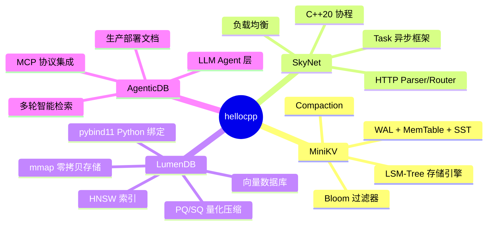
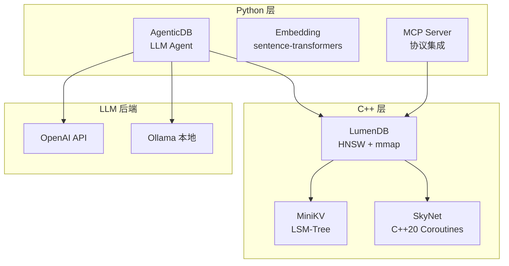

<p align="center">
  
  
  
  
</p>

<h1 align="center">C++ 向量数据库与 Agent 智能检索 · 全栈项目</h1>

<p align="center">
  <b>MiniKV</b> · <b>SkyNet</b> · <b>LumenDB</b> · <b>AgenticDB</b><br/>
  <i>LSM-Tree KV 存储 · C++20 协程网络 · 零拷贝向量数据库 · LLM Agent 智能检索</i>
</p>

<p align="center">
  <a href="#项目概览">中文</a> •
  <a href="#project-overview">English</a>
</p>

---



---

## 项目概览

本项目包含四个紧密关联的 C++/Python 项目，构建了一个完整的向量数据库与 AI 智能检索系统。

| 项目 | 语言 | 说明 | 课程 |
|------|------|------|------|
| **MiniKV** | C++17 | LSM-Tree KV 存储引擎 (WAL, MemTable, SSTable, Compaction) | [课程](./lumendb/course/ch05_lsm_tree/) |
| **SkyNet** | C++20 | 协程网络框架 (Task<T>, HTTP Parser, Load Balancer) | [课程](./lumendb/course/ch11_coroutines/) |
| **LumenDB** | C++17 | 零拷贝向量数据库 (HNSW, mmap, PQ/SQ, pybind11) | [课程](./lumendb/course/) |
| **AgenticDB** | Python | LLM Agent 智能检索层 (多轮搜索, MCP 协议) | [课程](./lumendb/course/#章节列表) |

## 快速开始 / Quick Start

```bash
# 编译 C++ 项目 / Build all C++ projects
cmake -B build -G Ninja -DCMAKE_BUILD_TYPE=Release
cmake --build build -j$(nproc)

# 安装 Python 依赖 / Install Python deps
pip install httpx pydantic sentence-transformers fastapi uvicorn mcp

# 启动 LumenDB 服务器 / Start LumenDB server
./build/lumendb_server --port 8080 --dim 384

# 启动 Agent 层 / Start Agent layer
cd lumendb && python -m agent.server.app
```

## 课程目录 / Course Index

| 课程 | 链接 | 章节数 |
|------|------|--------|
| 🎓 LumenDB C++ 向量数据库 | [course/](./lumendb/course/README.md) | 13 章 |
| 🤖 AgenticDB 智能检索 | [course/ AgenticDB 章节](./lumendb/course/) | 13 章 (+ 5 前置) |

## 文档 / Documentation

| 文档 | 链接 | 内容 |
|------|------|------|
| 📖 架构 | [AGENTICDB.md](./lumendb/docs/AGENTICDB.md) | AgenticDB 系统架构 |
| 🔧 操作手册 | [OPERATIONS.md](./lumendb/docs/OPERATIONS.md) | 安装/配置/排错 |
| 🎯 面试题 | [PRODUCTION_QA.md](./lumendb/docs/PRODUCTION_QA.md) | 生产部署深度问答 |
| 📚 API 参考 | [API_REFERENCE.md](./lumendb/API_REFERENCE.md) | C++/Python/HTTP API |

## 技术栈 / Tech Stack



## License

MIT
