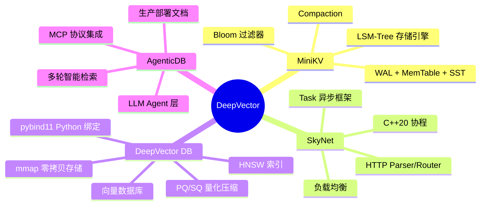
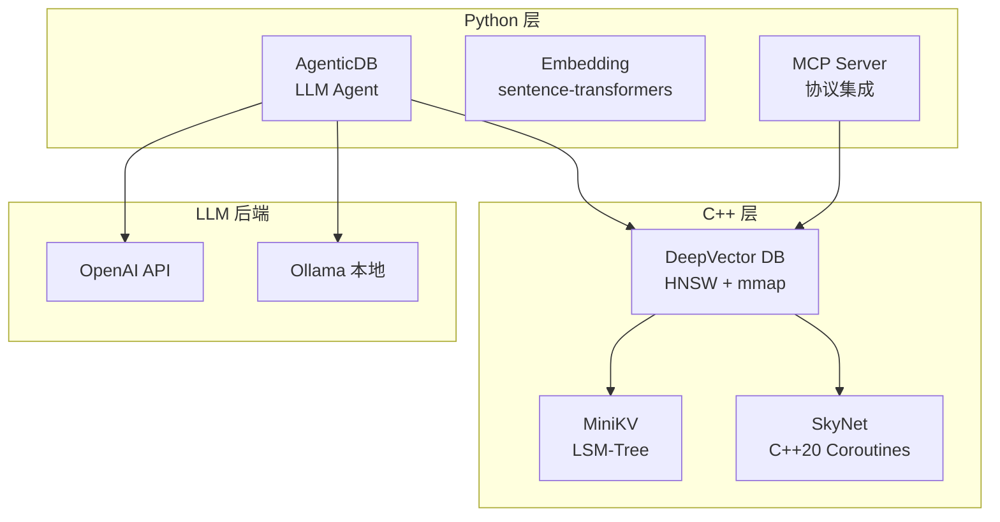

<p align="center">
  
  
  
  
  
</p>

<h1 align="center">DeepVector</h1>

<p align="center">
  <b>全栈向量数据库与 AI Agent 智能检索系统</b><br/>
  <i>Full-Stack Vector Database & AI Agent Retrieval System</i>
</p>

<p align="center">
  <b>MiniKV</b> · <b>SkyNet</b> · <b>DeepVector DB</b> · <b>AgenticDB</b><br/>
  <i>LSM-Tree KV 存储 · C++20 协程网络 · 零拷贝向量数据库 · LLM Agent 智能检索</i>
</p>

<p align="center">
  <a href="#项目概览">中文</a> •
  <a href="#project-overview">English</a> •
  <a href="./deepvector/course/README.md">📚 课程</a> •
  <a href="./deepvector/course/FREE_RESOURCES_zh.md">🆓 免费资源</a> •
  <a href="./RUN.md">▶ 运行</a> •
</p>

---



---

## 项目概览

本项目包含四个紧密关联的 C++/Python 项目，构建了一个完整的向量数据库与 AI 智能检索系统。

| 项目 | 语言 | 说明 | 课程 |
|------|------|------|------|
| **MiniKV** | C++17 | LSM-Tree KV 存储引擎 (WAL, MemTable, SSTable, Compaction) | [课程](./deepvector/course/ch05_lsm_tree/) |
| **SkyNet** | C++20 | 协程网络框架 (Task<T>, HTTP Parser, Load Balancer) | [课程](./deepvector/course/ch11_coroutines/) |
| **DeepVector DB** | C++17 | 零拷贝向量数据库 (HNSW, mmap, PQ/SQ, pybind11) | [课程](./deepvector/course/) |
| **AgenticDB** | Python | LLM Agent 智能检索层 (多轮搜索, MCP 协议) | [课程](./deepvector/course/#章节列表) |

## 快速开始 / Quick Start

完整多平台教程见 [RUN.md](./RUN.md)。技术选型说明见 [TECH.md](./TECH.md)。

```bash
# 编译 C++ 项目 / Build all C++ projects
cmake -B build -G Ninja -DCMAKE_BUILD_TYPE=Release
cmake --build build -j$(nproc)

# 安装 Python 依赖 / Install Python deps
cd deepvector && pip install -r requirements.txt

# 启动 DeepVector DB 服务器（维度需与 embedding 一致，默认 384）
./build/deepvector/deepvector_server --port 8080 --dim 384

# 启动 Agent 层 / Start Agent layer
cd deepvector && python -m agent.server.app
```

## 课程目录 / Course Index

| 课程 | 链接 | 章节数 |
|------|------|--------|
| 🎓 DeepVector 从零到一（点→线→面） | [course/](./deepvector/course/README.md) | 双轨 + Capstone |
| 🧭 学习路线 | [LEARNING_PATH.md](./deepvector/course/LEARNING_PATH.md) | 积木顺序 |
| 🎤 面试题库 | [INTERVIEW_BANK.md](./deepvector/course/INTERVIEW_BANK.md) | 真实考点映射 |
| 🏗 架构 | [ARCHITECTURE.md](./deepvector/ARCHITECTURE.md) | Registry /metrics |

## 文档 / Documentation

| 文档 | 链接 | 内容 |
|------|------|------|
| 📖 架构 | [AGENTICDB.md](./deepvector/docs/AGENTICDB.md) | AgenticDB 系统架构 |
| 🔧 操作手册 | [OPERATIONS.md](./deepvector/docs/OPERATIONS.md) | 安装/配置/排错 |
| 🎯 面试题 | [PRODUCTION_QA.md](./deepvector/docs/PRODUCTION_QA.md) | 生产部署深度问答 |
| 📚 API 参考 | [API_REFERENCE.md](./deepvector/API_REFERENCE.md) | C++/Python/HTTP API |

## 技术栈 / Tech Stack



## Repository / 仓库

原四个独立仓库已合并为这个 monorepo:

| 原仓库 | 新位置 | 状态 |
|--------|--------|------|
| `MiniKV` | `./minikv/` | ✅ 已合并 |
| `SkyNet` | `./skynet/` | ✅ 已合并 |
| `LumenDB` | `./deepvector/` | ✅ 已合并 (已重命名) |
| `lumendb-course` | `./deepvector/course/` | ✅ 已合并 (已删除远端) |

## License

MIT
