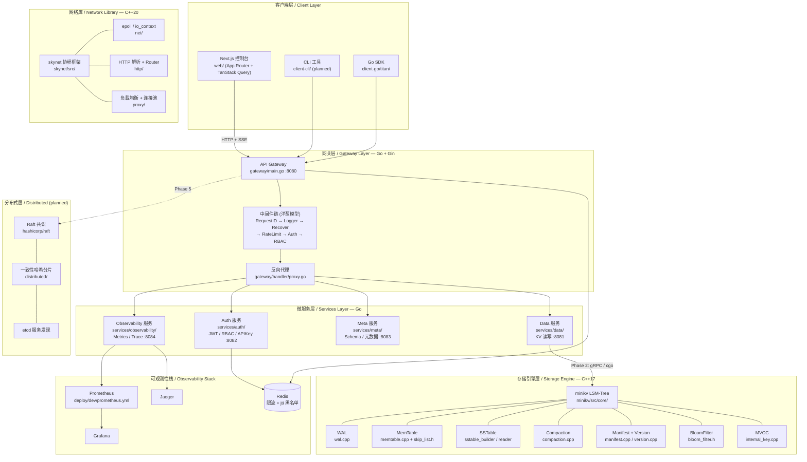

# TitanKV

> 一个从零实现的分布式键值存储平台——C++ 写存储引擎、Go 写业务层、Next.js 写控制台。
>
> A distributed key-value storage platform built from scratch — storage engine in C++, business layer in Go, console in Next.js.

<p align="center">
  
  
  
  
  
</p>

---

## 什么是 TitanKV？ / What is TitanKV？

### 中文

你好，欢迎来到 TitanKV。这不是一个把 RocksDB 或 Redis 包一层壳的练手项目，而是一次从存储引擎、网络层、服务层到前端控制台的完整重写。

如果你正在准备 C++ 后端或分布式系统的求职，TitanKV 想给你一个能讲清楚的完整故事：从一行 `db.Put()` 写入 WAL、落到 MemTable（跳表）、刷盘成 SSTable、被 Compaction 合并，到请求穿过 Gin 网关的 JWT/RBAC 中间件链、反向代理到后端微服务，最后在 Next.js 仪表盘上实时刷新——这条链路上每一行关键代码都在这个仓库里。

我们刻意分了四层技术栈：**C++17/20** 负责存储引擎（minikv）与协程网络库（skynet），**Go 1.23** 负责网关与微服务，**Next.js 14** 负责管理控制台，**Docker + Prometheus + Grafana + Jaeger** 负责部署与可观测性。这不是为了炫技堆技术，而是因为每一层在工业界都有它真实的位置，分开练习才能讲得深。

为什么值得放到简历上？因为面试官最爱追问「这里为什么这么设计」「换个场景你怎么改」——而 TitanKV 让你能从一个真实的、可运行的、有测试的代码库出发去回答，而不是背诵八股。

### English

Hi, welcome to TitanKV. This is not a thin wrapper around RocksDB or Redis — it is a from-scratch rewrite spanning the storage engine, the network layer, the service tier, and the front-end console.

If you are preparing for a C++ backend or distributed-systems job hunt, TitanKV aims to give you one coherent story you can actually explain: from a `db.Put()` call that appends to the WAL, lands in the MemTable (a skip list), flushes to an SSTable, gets merged by Compaction, then travels through the Gin gateway's JWT/RBAC middleware chain, gets reverse-proxied to a backend microservice, and finally shows up live on the Next.js dashboard. Every line of that journey lives in this repository.

We deliberately split the stack into four tiers: **C++17/20** for the storage engine (minikv) and the coroutine network library (skynet), **Go 1.23** for the gateway and microservices, **Next.js 14** for the admin console, and **Docker + Prometheus + Grafana + Jaeger** for deployment and observability. This is not about name-dropping technologies — it is because each layer has a real place in industry, and practising them in isolation is how you go deep.

Why put it on your résumé? Because interviewers love to ask "why did you design it this way" and "how would you change it for a different scenario" — and TitanKV lets you answer from a real, runnable, tested codebase instead of reciting trivia.

---

## 架构总览 / Architecture Overview

### 中文

TitanKV 采用分层架构，每一层都可以独立编译、独立替换。请求自上而下穿过客户端、网关、微服务，最终落到 C++ 存储引擎；可观测性组件横切所有层。



| 层 / Layer | 职责 / Responsibility | 关键代码 / Key Code |
|---|---|---|
| 客户端 / Client | 控制台、CLI、SDK 接入 | `web/`, `client-cli/`, `client-go/titan/` |
| 网关 / Gateway | 鉴权、限流、RBAC、反向代理 | `gateway/` |
| 微服务 / Services | Auth / Data / Meta / Observability | `services/{auth,data,meta,observability}/` |
| 存储引擎 / Storage Engine | LSM-Tree：WAL/MemTable/SST/Compaction/MVCC | `minikv/src/core/` |
| 网络库 / Network Library | C++20 协程、epoll、HTTP、负载均衡 | `skynet/src/` |
| 分布式 / Distributed | Raft 复制、一致性哈希分片 | `distributed/` (planned) |
| 可观测性 / Observability | Metrics、Trace、可视化 | `services/observability/`, `deploy/dev/` |

---

## 仓库结构 / Repository Layout

```
titan-kv/
├── minikv/              # C++17 LSM-Tree 存储引擎 / C++17 LSM-Tree storage engine
│   ├── src/core/        #   WAL / MemTable / SSTable / Compaction / MVCC
│   ├── src/network/     #   原生网络层（epoll + connection）
│   ├── src/utils/       #   coding / crc32 / hash / lru_cache / thread_pool
│   ├── tests/           #   GoogleTest 单元测试
│   └── benches/        #   Google Benchmark 基准
├── skynet/             # C++20 协程网络库 / C++20 coroutine network library
│   ├── src/net/        #   acceptor / io_context / socket / tcp_stream
│   ├── src/core/       #   executor / task / thread_pool / timer_wheel
│   ├── src/http/       #   parser / router / headers / response
│   ├── src/proxy/      #   load_balancer / connection_pool / health_check / upstream
│   └── gateway/        #   skynet 网关示例（gateway.yaml）
├── deepvector/         # (legacy) C++ HNSW 向量索引 / legacy C++ HNSW vector index
├── gateway/            # Go API 网关 (Gin) / Go API gateway (Gin)
│   ├── handler/        #   ping / proxy
│   └── middleware/     #   RequestID / Logger / Recover / RateLimit / Auth / RBAC
├── services/           # Go 微服务 / Go microservices
│   ├── auth/           #   JWT / RBAC / APIKey / bcrypt
│   ├── data/           #   KV 读写服务 / KV data service (planned wiring)
│   ├── meta/          #   Schema / 元数据 / metadata
│   └── observability/  #   metrics / trace 聚合
├── client-go/titan/     # Go SDK / Go SDK
├── client-cli/         # (planned) Cobra CLI 工具 / planned Cobra CLI
├── web/                # Next.js 14 管理控制台 / Next.js 14 admin console
│   ├── app/           #   App Router (dashboard / login)
│   ├── components/    #   live-metrics / metrics-card / nav / providers
│   └── lib/           #   api.ts / types.ts
├── distributed/        # (planned) Raft + 分片 / planned Raft + sharding
├── proto/              # (planned) gRPC / protobuf 定义 / planned gRPC/protobuf
├── deploy/             # 部署配置 / deployment config
│   ├── dev/           #   docker-compose.yml + prometheus.yml
│   ├── k8s/           #   Kubernetes manifests (planned)
│   └── helm/          #   Helm chart (planned)
├── docs/               # 文档 / documentation
│   ├── course/{zh,en}/ #   13 模块中英双语课程 / 13-module bilingual course
│   ├── REFACTORING.md #   重构计划 / refactoring plan
│   └── STORAGE_ENGINE.md
├── tests/course/       # 课程配套手撕题测试 (7 文件 / 37 用例)
├── CMakeLists.txt      # 顶层 CMake 聚合 / top-level CMake
├── go.mod              # Go module 根 / Go module root
└── Makefile            # 统一构建/测试/运行入口 / unified entry
```

---

## 项目状态 / Project Status

> 当前正在从早期的 AI/向量数据库方向重构为通用分布式 KV 存储平台。详见 [`docs/REFACTORING.md`](docs/REFACTORING.md)。
>
> The project is being refactored from an earlier AI/vector-DB direction into a general-purpose distributed KV platform. See [`docs/REFACTORING.md`](docs/REFACTORING.md).

| Phase | 描述 / Description | 状态 / Status |
|---|---|---|
| Phase 0 | 清理 + 仓库重构 / Cleanup + repo restructure | ✅ done |
| Phase 1 | C++ 存储引擎升级（MVCC / WAL / Compaction / CF） / C++ storage engine upgrade | ✅ done |
| Phase 2 | C++ gRPC server + Go cgo 客户端 / C++ gRPC server + Go cgo client | ⏳ planned |
| Phase 3 | Go API 网关 + Auth 服务（JWT/RBAC/APIKey） / Go gateway + auth | ✅ **MVP done** — `gateway/` + `services/auth/` |
| Phase 4 | Go data / meta / observability 服务 / Go data/meta/observability | ✅ **MVP done** — `services/{meta,observability}/` + `client-go/` |
| Phase 5 | 分布式层：etcd + hashicorp/raft + 分片 / Distributed layer | ⏳ planned |
| Phase 6 | Next.js 管理控制台 / Next.js admin console | ✅ **MVP done** — `web/` (App Router + TanStack Query) |
| Phase 7 | 可观测性 + Kubernetes + CI/CD / Observability + K8s + CI/CD | ⏳ planned |
| Phase 8 | CLI 工具 + 多语言 SDK + 文档 / CLI + SDK + docs | ⏳ planned |

> **MVP 说明 / MVP note**：Phase 3/4/6 的 data 服务目前使用内存存储，observability 使用 mock 指标，但已能通过 `make run-all` + `make web-dev` 完整跑通端到端。Phase 2 完成后，内存后端将被真正的 LSM-Tree 引擎替换。
>
> Phase 3/4/6 use in-memory storage (data service) and mock metrics (observability), but run end-to-end via `make run-all` + `make web-dev`. Phase 2 will replace the in-memory backing store with the real LSM-Tree engine.

---

## 快速开始 / Quick Start

### 中文

环境要求详见 [`docs/course/zh/01-overview.md`](docs/course/zh/01-overview.md)：CMake 3.20+、GCC 12+ / Clang 15+、Go 1.23+、Node 20+、Docker 24+。

三步跑起来：

```bash
git clone https://github.com/Thezx-a/LumenDB.git
cd LumenDB

# 1. 启动 5 个 Go 服务（auth/data/meta/observability/gateway）
make run-all

# 2. （新终端）启动 Web 控制台
make web-dev

# 3. 浏览器打开
#    http://localhost:3000
```

### English

Environment requirements are in [`docs/course/en/01-overview.md`](docs/course/en/01-overview.md): CMake 3.20+, GCC 12+ / Clang 15+, Go 1.23+, Node 20+, Docker 24+.

Three steps to run:

```bash
git clone https://github.com/Thezx-a/LumenDB.git
cd LumenDB

# 1. Start the 5 Go services (auth/data/meta/observability/gateway)
make run-all

# 2. (new terminal) Start the web console
make web-dev

# 3. Open in your browser
#    http://localhost:3000
```

---

## 跨平台配置 / Cross-Platform Setup

> 详细教程见 [`docs/course/zh/01-overview.md`](docs/course/zh/01-overview.md)。下方仅列要点。
>
> Full tutorial in [`docs/course/en/01-overview.md`](docs/course/en/01-overview.md). Below is a quick reference.

| 平台 / Platform | 推荐方式 / Recommended | 要点 / Notes |
|---|---|---|
| **Windows** | WSL2 (Ubuntu 22.04) | 在 WSL2 内安装 GCC 12 + CMake；Docker Desktop 开启 WSL2 后端；不要在原生 cmd 跑 `make` |
| **Linux** | Ubuntu 22.04 | `apt install build-essential cmake ninja-build golang nodejs docker.io`；GCC 12 需 PPA |
| **macOS** | Homebrew | `brew install cmake ninja go node docker`;Apple Silicon 用 `g++-13` 编译 C++20 协程 |

---

## 构建与测试 / Build & Test

### C++（minikv + skynet + deepvector）

```bash
cmake -B build -DCMAKE_BUILD_TYPE=Release -DENABLE_TESTS=ON
cmake --build build -j
ctest --test-dir build --output-on-failure
```

### Go（gateway + services + SDK）

```bash
go mod download
go build ./...
go test -race -count=1 ./...
```

### Web（Next.js 控制台 / console）

```bash
cd web && npm install
npm run dev      # 开发服务器 :3000
npm run build    # 生产构建
```

### 统一入口 / Unified entry

```bash
make build   # 构建 C++ + Go
make test    # 运行 C++ (ctest) + Go 测试
make lint    # clang-tidy + golangci-lint + next lint
```

---

## 端到端复现 / End-to-End Reproduction

### 中文

完整复现步骤与排错指南见 [`docs/course/zh/12-go-nextjs.md`](docs/course/zh/12-go-nextjs.md)。下面给出一组 `curl` 验证示例，确认网关 + Auth 服务 + 反向代理链路正常。

### English

Full reproduction steps and troubleshooting are in [`docs/course/en/12-go-nextjs.md`](docs/course/en/12-go-nextjs.md). Below are `curl` examples to verify the gateway + auth + reverse-proxy chain.

```bash
# 1. 健康检查 / health check
curl -s http://localhost:8080/ping
# {"pong":true,"request_id":"..."}

# 2. 注册用户（role 必填：admin/writer/reader）/ register
curl -s -X POST http://localhost:8080/api/auth/register \
  -H "Content-Type: application/json" \
  -d '{"username":"alice","password":"Secret123!","role":"writer"}'

# 3. 登录拿 JWT / login for JWT
TOKEN=$(curl -s -X POST http://localhost:8080/api/auth/login \
  -H "Content-Type: application/json" \
  -d '{"username":"alice","password":"Secret123!"}' | jq -r .access_token)

# 4. 带 token 访问业务接口（反向代理到 data 服务）/ call business API
curl -s http://localhost:8080/api/data/kv/foo \
  -H "Authorization: Bearer $TOKEN"

# 5. 打开控制台 / open the console
#    http://localhost:3000  →  登录 → 仪表盘
```

---

## 课程与面试材料 / Course & Interview Materials

### 中文

[`docs/course/`](docs/course/) 下是一套**紧扣 TitanKV 源码**的中英双语实战课程，从 C++ 基础语法一路讲到分布式系统设计与面试真题。每个模块统一结构：**核心知识 → 内容详解 → 思考题 → 动手题 → 自检**。配套手撕题单元测试在 [`tests/course/`](tests/course/)（7 个文件，37 个用例，覆盖跳表 / LRU / 线程池 / 布隆过滤器 / MurmurHash / SPSC 队列 / unique_ptr）。

### English

[`docs/course/`](docs/course/) hosts a bilingual (zh/en) hands-on course tightly bound to the TitanKV source, from C++ basics all the way to distributed system design and real interview questions. Each module follows: **Core Knowledge → Deep Dive → Thinking Questions → Hands-on Exercises → Self-Check**. Companion hand-written unit tests live in [`tests/course/`](tests/course/) (7 files, 37 cases, covering skip list / LRU / thread pool / bloom filter / MurmurHash / SPSC queue / unique_ptr).

### 模块地图 / Module Map

| # | 模块 / Module | 层 / Layer | 对应源码 / Source |
|---|---|---|---|
| 01 | 环境搭建与项目概览 / Env Setup & Project Overview | 基础 / Foundation | `CMakeLists.txt` / `Makefile` / `go.mod` |
| 02 | C++ 核心语法 / C++ Core Syntax | 基础 / Foundation | `minikv/src/utils/` |
| 03 | 现代 C++ 与并发 / Modern C++ & Concurrency | 基础 / Foundation | `minikv/src/core/skip_list.h` |
| 04 | Go 与 TypeScript 基础 / Go & TS Basics | 基础 / Foundation | `go.mod` / `web/` |
| 05 | 跳表与有序结构 / SkipList & Ordered Structures | 数据结构 / Data Structure | `minikv/src/core/skip_list.h` |
| 06 | 布隆过滤器与哈希 / BloomFilter & Hashing | 数据结构 / Data Structure | `minikv/src/core/bloom_filter.h` |
| 07 | LSM-Tree 存储引擎 / LSM-Tree Engine | 存储引擎 / Storage | `minikv/src/core/{wal,memtable,sstable}` |
| 08 | Compaction 与 MVCC / Compaction & MVCC | 存储引擎 / Storage | `minikv/src/core/{compaction,internal_key}` |
| 09 | epoll 与 C++20 协程 / epoll & C++20 Coroutines | 网络 / Network | `skynet/src/{net,core}` |
| 10 | HTTP 与反向代理 / HTTP & Reverse Proxy | 网络 / Network | `skynet/src/{http,proxy}` |
| 11 | Raft 共识与分片 / Raft & Sharding | 分布式 / Distributed | `distributed/` (planned) |
| 12 | Go 微服务与 Next.js 控制台 / Go µServices & Next.js | 应用 / Application | `services/` / `web/` |
| 13 | 系统设计与面试题汇总 / System Design & Interview Q&A | 面试 / Interview | 全项目 / Whole project |

> 进入 [`docs/course/zh/README.md`](docs/course/zh/README.md) 或 [`docs/course/en/README.md`](docs/course/en/README.md) 开始学习。
>
> Start at [`docs/course/zh/README.md`](docs/course/zh/README.md) or [`docs/course/en/README.md`](docs/course/en/README.md).

---

## 开发指南 / Development Guide

### Make 目标速查 / Make targets

| 目标 / Target | 说明 / Description |
|---|---|
| `make help` | 列出所有目标 / list all targets |
| `make build` | 构建 C++ + Go / build C++ + Go |
| `make test` | 运行 C++ (ctest) + Go 测试 / run all tests |
| `make lint` | clang-tidy + golangci-lint + next lint / lint everything |
| `make cmake-build` | 仅构建 C++ / build C++ only |
| `make cpp-test` | 仅运行 C++ 测试 / run C++ tests only |
| `make go-build` / `make go-test` | 仅 Go 构建 / 测试 / Go build / test |
| `make run-gateway` | 网关 :8080 / gateway |
| `make run-auth` | Auth 服务 :8082 / auth service |
| `make run-data` | Data 服务 :8081 / data service |
| `make run-meta` | Meta 服务 :8083 / meta service |
| `make run-observ` | Observability 服务 :8084 / observability service |
| `make run-all` | 并行启动 5 个 Go 服务 / run all 5 Go services |
| `make web-install` / `make web-dev` / `make web-build` | Next.js 安装 / 开发 / 构建 |
| `make docker-up` / `make docker-down` | 本地开发栈 (Postgres/Redis/etcd/Jaeger/Prometheus/Grafana) |
| `make clean` | 清理构建产物 / clean build artifacts |

### 添加一个新服务 / Add a new service

1. 在 `services/<name>/` 下新建 `main.go` + `handler.go` + `store.go`，参考 [`services/meta/`](services/meta/)。
2. 在 [`Makefile`](Makefile) 加 `run-<name>` 目标，并加入 `run-all`。
3. 在 [`gateway/router.go`](gateway/router.go) 的 `NewReverseProxy` map 加一条 `/api/<name>` → 新服务地址。
4. （可选）在 [`web/lib/api.ts`](web/lib/api.ts) 加调用方法。

### 添加一个新中间件 / Add a new middleware

1. 在 [`gateway/middleware/`](gateway/middleware/) 下新建 `xxx.go`，实现 `func XXX() gin.HandlerFunc`。
2. 在 [`gateway/router.go`](gateway/router.go) 的 `r.Use(...)` 链里按顺序插入（洋葱模型，外层先执行）。
3. 注意：`Auth` 必须在 `RBAC` 之前，`Recover` 必须在 `Logger` 之后。

---

## 可观测性 / Observability

### 中文

TitanKV 的可观测性栈基于三大件：

- **Prometheus**：抓取各服务的 `/metrics` 端点（`services/observability/metrics.go` 暴露 Prometheus 指标）。
- **Grafana**：基于 Prometheus 数据源做仪表盘可视化。
- **Jaeger**：分布式链路追踪，跨网关 → 微服务 → 存储引擎的请求关联。

本地一键拉起：`make docker-up`（依赖 [`deploy/dev/docker-compose.yml`](deploy/dev/docker-compose.yml) + [`deploy/dev/prometheus.yml`](deploy/dev/prometheus.yml)）。Grafana 默认 `http://localhost:3001`，Jaeger UI 默认 `http://localhost:16686`。

### English

TitanKV's observability stack rests on three pillars:

- **Prometheus** scrapes each service's `/metrics` endpoint (`services/observability/metrics.go` exposes Prometheus metrics).
- **Grafana** visualizes the Prometheus data source.
- **Jaeger** provides distributed tracing across gateway → service → storage engine.

Bring it up locally with `make docker-up` (driven by [`deploy/dev/docker-compose.yml`](deploy/dev/docker-compose.yml) + [`deploy/dev/prometheus.yml`](deploy/dev/prometheus.yml)). Grafana defaults to `http://localhost:3001`, Jaeger UI to `http://localhost:16686`.

---

## 路线图 / Roadmap

| Phase | 内容 / Scope | 状态 / Status |
|---|---|---|
| 0 | 仓库重构 / Repo restructure | ✅ done |
| 1 | C++ 存储引擎（WAL/MemTable/SST/Compaction/MVCC） / C++ storage engine | ✅ done |
| 2 | gRPC server 接 minikv + Go cgo 客户端 / gRPC server wrapping minikv | ⏳ planned |
| 3 | Go 网关 + Auth（JWT/RBAC/APIKey） / Go gateway + auth | ✅ MVP done |
| 4 | Go data/meta/observability 服务 / Go services | ✅ MVP done |
| 5 | Raft 复制 + 一致性哈希分片 + etcd / Raft + sharding + etcd | ⏳ planned |
| 6 | Next.js 管理控制台 / Next.js console | ✅ MVP done |
| 7 | K8s 部署 + Prometheus/Grafana/Jaeger + CI/CD | ⏳ planned |
| 8 | Cobra CLI + 多语言 SDK + 文档完善 / CLI + SDK + docs | ⏳ planned |

---

## 贡献 / Contributing

### 中文

欢迎 PR。流程：

1. Fork → 新建分支 `feat/<short-name>` 或 `fix/<issue-id>`。
2. 保证 `make test` 与 `make lint` 全绿。
3. 如果改动存储引擎或网络库，请补对应的 GoogleTest 用例。
4. PR 描述里写清「改了什么、为什么、怎么测」。
5. 等待 review，squash merge。

### English

PRs welcome. The flow:

1. Fork → branch `feat/<short-name>` or `fix/<issue-id>`.
2. Keep `make test` and `make lint` green.
3. If you touch the storage engine or network library, add a GoogleTest case.
4. In the PR description, explain "what changed, why, how to test".
5. Wait for review, squash-merge.

---

## License

MIT — 见 [`minikv/LICENSE`](minikv/LICENSE) / [`skynet/LICENSE`](skynet/LICENSE)。

MIT — see [`minikv/LICENSE`](minikv/LICENSE) / [`skynet/LICENSE`](skynet/LICENSE).

---

## 致谢 / Acknowledgments

### 中文

TitanKV 的存储引擎设计参考了 LevelDB / RocksDB 的公开资料，网络库参考了 muduo 与 libco 的思路，课程模块的面试题来源于真实的求职面经与 LeetCode。感谢这些开源项目与社区分享的内容让从零实现成为可能。

### English

The storage engine design draws on public material from LevelDB / RocksDB, the network library takes cues from muduo and libco, and the course's interview questions come from real job-hunting experience reports and LeetCode. Thanks to these open-source projects and community sharing for making from-scratch implementation possible.
