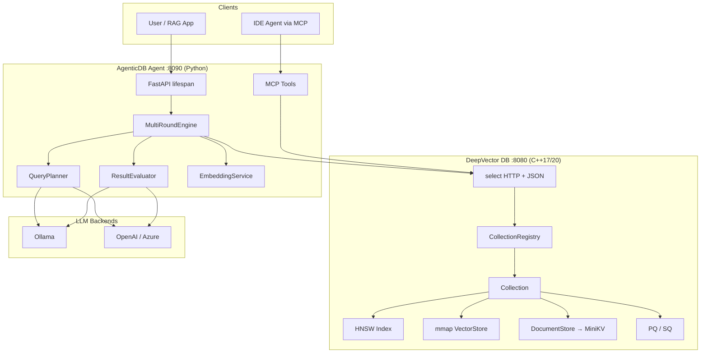

# DeepVector Architecture (Current)

> Updated for multi-collection registry, Prometheus `/metrics`, Agent↔C++ topology.
> Paths use `include/dv/` and namespace `dv` (post LumenDB rename).

## 1. System Topology / 系统拓扑



## 2. Layered Architecture / 分层架构

```
┌────────────────────────────────────────────────────────────┐
│  Agent HTTP (:8090)  FastAPI + Pydantic v2 + lifespan      │
│  /query /ask /plan /health                                 │
├────────────────────────────────────────────────────────────┤
│  MCP Server (optional)  vector_search / filtered_search    │
├────────────────────────────────────────────────────────────┤
│  DeepVector HTTP (:8080)  REST + /metrics (Prometheus)     │
│  /search /insert /collections /vectors/:id[/meta]          │
├────────────────────────────────────────────────────────────┤
│  CollectionRegistry  name → Collection*  (mutex)           │
├────────────────────────────────────────────────────────────┤
│  Collection API  add / search / searchWithFilter / meta    │
├──────────────┬─────────────────────┬───────────────────────┤
│ HNSW Index   │ mmap VectorStore    │ DocumentStore→MiniKV  │
│ + distance.h │ vectors.bin         │ WAL MemTable SST      │
│   (AVX2)     │                     │ MergingIterator       │
├──────────────┴─────────────────────┴───────────────────────┤
│  Quantization  PQ (ADC/SDC)  ·  SQ (int8)                  │
└────────────────────────────────────────────────────────────┘
```

## 3. On-disk Layout / 磁盘布局

```
<data_dir>/
├── default/                 # collection name
│   ├── vectors.bin          # mmap vector store
│   └── docs/                # MiniKV LSM root
│       ├── WAL
│       └── level-0/… SST
├── my_kb/
│   └── …
```

## 4. Key Abstractions Types

| Type | Path | Role |
|------|------|------|
| `CollectionRegistry` | `include/dv/server/collection_registry.h` | Multi-collection map |
| `RequestContext` | `include/dv/server/request_context.h` | Latency / tracing hooks |
| `Collection` | `include/dv/collection.h` | Orchestrates index+store |
| `HNSWIndex` | `include/dv/index/hnsw.h` | ANN graph |
| `MergingIterator` | `minikv/src/core/merging_iterator.h` | LSM read path |

## 5. HTTP Contract (summary)

See `docs/openapi.yaml` for the machine-readable contract.

| Method | Path | Notes |
|--------|------|-------|
| GET | `/health` | status, vectors, dim, collections |
| GET | `/metrics` | Prometheus text |
| GET/POST/DELETE | `/collections` | multi-collection |
| POST | `/search` | `vector`,`k`,`collection?`,`filter?` |
| POST | `/insert` | `meta` / `metadatas` |
| GET | `/vectors/:id/meta` | document text/tags |

**Embedding is Agent-side** (sentence-transformers / OpenAI). C++ expects float32 vectors whose dim matches collection config (default **384**).

## 6. Design Principles

1. **Boring enterprise tech** — HNSW, LSM, mmap, FastAPI, Pydantic v2 (see `TECH.md`).
2. **Linux-first** — POSIX sockets; Windows via WSL2/Docker.
3. **Teach by building** — each course module maps to a real directory.
4. **Observable** — `/stats` JSON + `/metrics` Prometheus.
