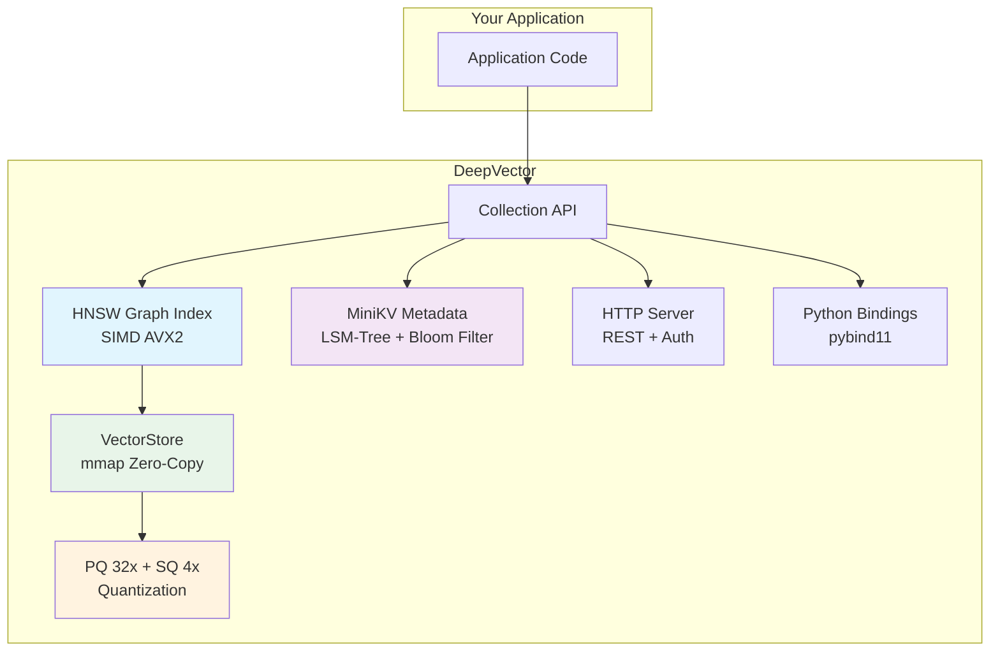
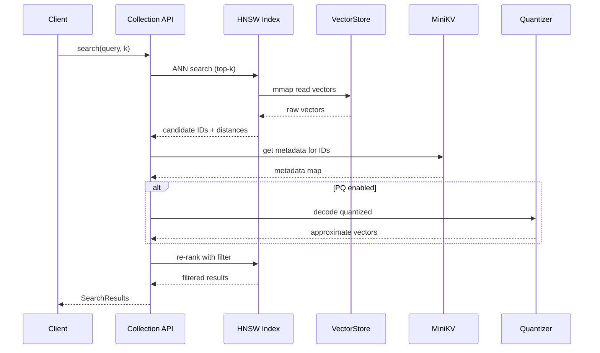
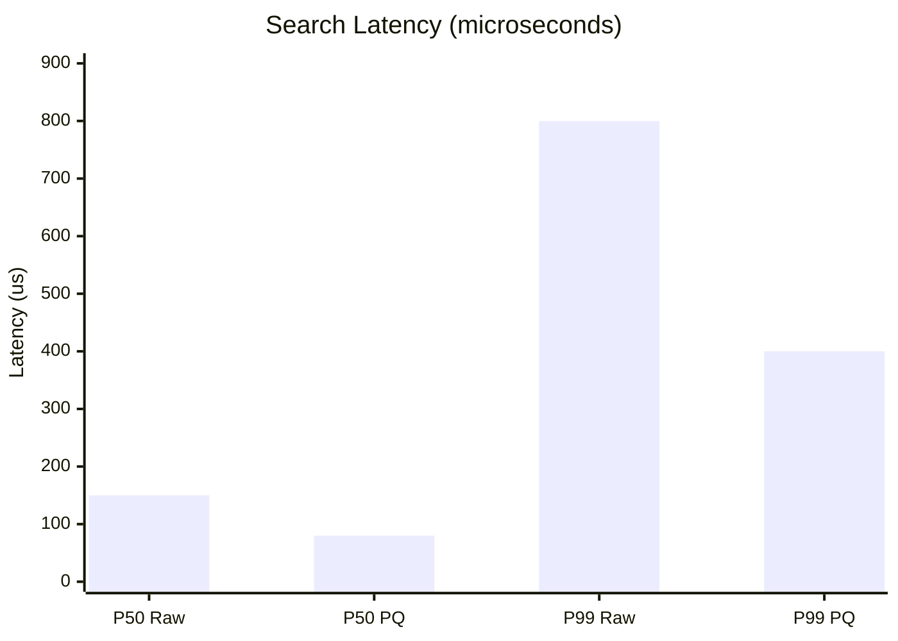
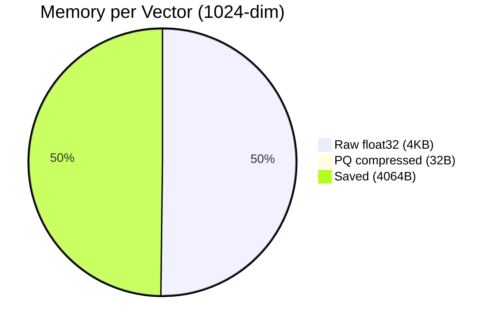
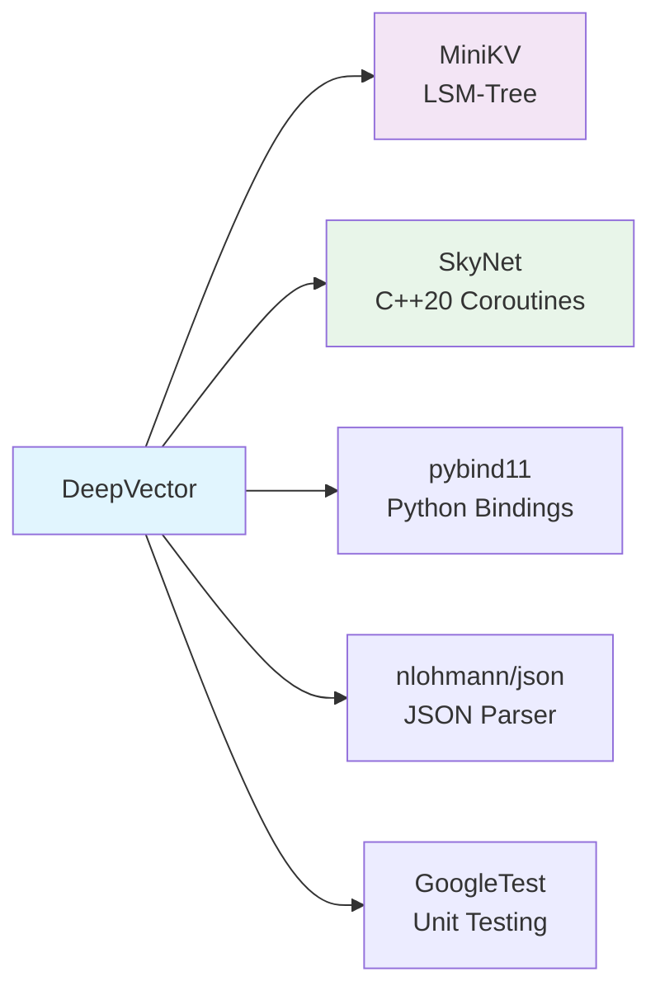

<p align="center">
  
  
  
  
  
</p>

<h1 align="center">鈿?DeepVector</h1>

<p align="center">
  <b>C++ Zero-Copy Vector Database for RAG</b><br/>
  <i>Embeddable 路 SIMD-Accelerated 路 Production-Ready</i>
</p>

<p align="center">
  
  
  
  
</p>

---

## What is DeepVector?

DeepVector is an **embedded** C++ vector database purpose-built for Retrieval-Augmented Generation (RAG). It lives inside your application as a static library 鈥?no separate server process, no network overhead, no latency penalty.

### Architecture



### How is it different?

| | DeepVector | Milvus / Qdrant | FAISS |
|---|---|---|---|
| **Architecture** | Embedded library | Client-Server | Index library only |
| **Metadata** | Full LSM-Tree store | Proprietary | None |
| **Zero-copy** | 鉁?mmap throughout | 鉂?serialization | 鉂?copies |
| **Filtering** | SQL-like expressions | DSL | 鉂?manual |
| **Quantization** | PQ + SQ built-in | 鉁?| 鉁?|
| **Language** | C++ core + Python | Go/Rust + Python | C++/Python |

---

## Quick Start

### C++ (3 lines to search)

```cpp
#include <dv/collection.h>
using namespace lumendb;

Collection coll({768, DistanceMetric::Cosine}, "./data");
coll.add(my_embedding);                              // returns id
auto results = coll.search(query_embedding, 10);     // top-10 results
```

### Docker (1 command)

```bash
docker compose up -d
curl -X POST http://localhost:8080/search \
  -H "Content-Type: application/json" \
  -d '{"vector":[0.1,0.2,...],"k":5}'
```

### Python (native bindings)

```python
import lumendb, numpy as np

cfg = deepvector.CollectionConfig()
cfg.dim = 768
coll = deepvector.Collection(cfg)
coll.add(np.random.randn(768).astype(np.float32))
results = coll.search(np.random.randn(768).astype(np.float32), 5)
```

---

## Search Flow



---

## Performance

**50K vectors 路 128-dim 路 AVX2 路 g++-12**



| Metric | Raw float32 | With PQ (32脳) |
|--------|-------------|---------------|
| Insert throughput | ~30K vec/s | ~35K vec/s |
| Search latency P50 | ~150碌s | ~80碌s |
| Search latency P99 | ~800碌s | ~400碌s |
| Memory per vector | `dim 脳 4B` | `dim/32 脳 1B` |
| Recall@10 | 99.5% | ~97% |

> Run it yourself: `cmake -B build -DENABLE_BENCHMARKS=ON && ./build/benchmarks/bench_hnsw`

---

## Memory Savings



| Vectors | Raw float32 | PQ (32脳) | Savings |
|---------|-------------|----------|---------|
| 100K | 400 MB | 12.5 MB | 97% |
| 1M | 4 GB | 125 MB | 97% |
| 10M | 40 GB | 1.25 GB | 97% |

---

## Features

| Feature | Status | Description |
|---------|--------|-------------|
| HNSW graph index | 鉁?| M=16, ef_construction=200 |
| SIMD distance (AVX2) | 鉁?| L2, Inner Product, Cosine |
| Zero-copy mmap storage | 鉁?| Instant restart via OS page cache |
| Metadata filtering | 鉁?| Tree expressions (eq/gt/and/or) |
| PQ quantization | 鉁?| k-means subspace, 32脳 compression |
| SQ int8 quantization | 鉁?| Per-dimension scaling, 4脳 compression |
| HTTP REST API | 鉁?| GET/POST/DELETE endpoints |
| Bearer auth | 鉁?| Configurable API key |
| Python bindings | 鉁?| pybind11 numpy zero-copy |
| Docker deployment | 鉁?| Multi-stage, <100MB |
| gRPC / TLS | 馃敎 | Planned |
| Prometheus metrics | 馃敎 | Atomic counters exist |
| Distributed / sharding | 馃敎 | Architecture reserved |

---

## Build

```bash
# Clone with submodules
git clone --recursive https://github.com/Thezx-a/DeepVector.git
cd DeepVector

# Build
cmake -B build -G Ninja -DCMAKE_BUILD_TYPE=Release \
  -DENABLE_TESTS=ON -DCMAKE_CXX_COMPILER=g++-12
cmake --build build -j$(nproc)

# Test
ctest --test-dir build --output-on-failure

# Python bindings
cmake -B build -DENABLE_PYTHON=ON
cmake --build build
cd python && pip install -e .
```

---

## Documentation

| Document | What's Inside |
|----------|---------------|
| [ARCHITECTURE.md](ARCHITECTURE.md) | Design decisions, data flow, format specs |
| [INTERVIEW_QA.md](INTERVIEW_QA.md) | 78 deep-dive Q&A for interview prep |
| [TUTORIAL.md](TUTORIAL.md) | Step-by-step walkthrough |
| [API_REFERENCE.md](API_REFERENCE.md) | Full API documentation |
| [CONTRIBUTING.md](CONTRIBUTING.md) | How to contribute |

---

## Dependencies

All fetched automatically via CMake FetchContent:



| Library | Purpose |
|---------|---------|
| [MiniKV](https://github.com/Thezx-a/MiniKV) | LSM-Tree metadata storage |
| [SkyNet](https://github.com/Thezx-a/SkyNet) | C++20 coroutine network (server) |
| pybind11 | Python bindings |
| nlohmann/json | HTTP JSON parsing |
| GoogleTest | Unit testing |

---

## License

[MIT](LICENSE) 鈥?free to use, modify, and distribute.
