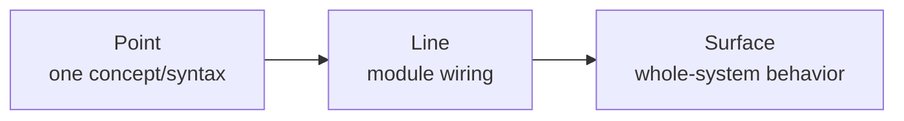

# How to Use This Course (Beginners)

> Pedagogy inspired by [Hello-Agents](https://github.com/datawhalechina/hello-agents) and the Datawhale community: progressive parts, hands-on labs, capstone.  
> Goal: even with basic C++/Python, you can finish DeepVector brick by brick.

---

## 1. Prerequisites Checklist

| Item | Minimum | Notes |
|------|---------|-------|
| OS | Linux / macOS / **Windows + WSL2** | C++ server is POSIX; do not force native MSVC for sockets |
| Compiler | g++12+ or Apple Clang | C++17 libs / C++20 for parts of the server stack |
| Build | CMake ≥ 3.20, Ninja | See `prerequisites/01` |
| Python | 3.11+ | Required for Agent track |
| (Optional) Ollama | Local LLM | C++ track works without it |

Full guide: [RUN.md](../../RUN.md) · Stack rationale: [TECH.md](../../TECH.md)

---

## 2. Point → Line → Surface

| Level | What you do | Example |
|-------|-------------|---------|
| **Point** | Master one idea + minimal demo | Implement `l2_squared`, pass a unit test |
| **Line** | Connect two modules via APIs | `HNSW.search` uses distance + `VectorStore.get` |
| **Surface** | End-to-end path | Agent `/ask` → embed → `/search` → LLM answer |

**Do not skip chapters and copy-paste.** Skipping creates “it runs but I cannot explain it.”

---

## 3. Suggested Routes

### 🟢 Weekend (≈12h)

1. This doc + `prerequisites/01`  
2. Track A: setup → vectors → HNSW  
3. Track B: overview only  
4. Run `deepvector_server` + curl `/search`

### 🟡 Standard engineer (≈40h)

- Full Track A  
- Track B through FastAPI (`ch09_server`)  
- Docker Compose dual services

### 🔴 Interview sprint (≈70h)

- Both tracks + [`INTERVIEW_BANK.md`](INTERVIEW_BANK.md)  
- Oral answers for each chapter’s interview block  
- Capstone: ingest ~1k docs and measure recall

---

## 4. How to Read Each Chapter

1. Learning objectives  
2. **Point** — syntax/formula vs source paths  
3. **Hands-on** — type it yourself  
4. **Line / Surface** — mermaid vs `ARCHITECTURE.md`  
5. Reflection prompts  
6. References — open real papers/docs (no fake links)

Template: [`_CHAPTER_TEMPLATE.md`](_CHAPTER_TEMPLATE.md)

---

## 5. Troubleshooting

| Symptom | Check |
|---------|-------|
| Dim mismatch | Server `--dim` must equal embedding dim (default **384**) |
| Empty filtered results | Inserts need `meta.tags` |
| Windows build fails | Use WSL2 / Docker |
| Empty Agent answers | Run `scripts/demo_data.py` first |

Next → [LEARNING_PATH.md](LEARNING_PATH.md)
