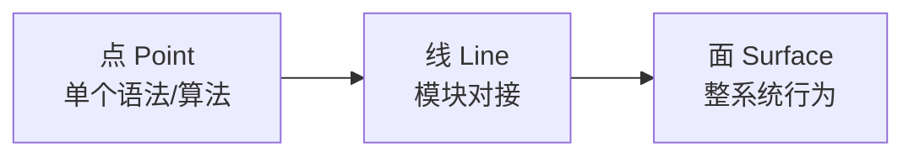

# 如何使用本教程（小白必读）

> 本教程借鉴 [Hello-Agents](https://github.com/datawhalechina/hello-agents) 与 Datawhale 社区的「分篇递进 + 动手实践」写法。  
> 目标：即使你只写过简单 C++/Python，也能像搭积木一样完成 DeepVector。

---

## 1. 你需要准备什么？

| 项 | 最低要求 | 说明 |
|----|----------|------|
| 操作系统 | Linux / macOS / **Windows+WSL2** | C++ 服务是 POSIX；不要强行用原生 MSVC 编译网络层 |
| 编译器 | g++12+ 或 Apple Clang | C++17（库）/ C++20（部分服务器） |
| 构建 | CMake ≥ 3.20、Ninja | 见前置 `prerequisites/01` |
| Python | 3.11+ | Agent 轨必需 |
| （可选）Ollama | 本地 LLM | 没有也能学 C++ 轨；Agent 问答需 LLM |

完整步骤：[RUN.md](../../RUN.md) · 技术选型：[TECH.md](../../TECH.md)

---

## 2. 点 → 线 → 面，怎么学？

| 层级 | 你要做什么 | 例子 |
|------|------------|------|
| **点** | 搞懂一个概念，跑通最小 demo | 写 `l2_squared`，单测通过 |
| **线** | 把两个模块用接口连起来 | HNSW.search 调 distance + VectorStore.get |
| **面** | 从自然语言问到答案整条链路 | Agent `/ask` → embed → `/search` → LLM 回答 |

**禁止跳章硬抄代码。** 跳章会导致「能跑但讲不清」。

---

## 3. 建议学习节奏

### 🟢 周末入门（约 12 小时）

1. `00` 本文 + `prerequisites/01`  
2. Track A：`ch01_setup` → `ch02_vectors_distance` → `ch03_hnsw_theory`  
3. Track B：`ch01_overview`（只看架构）  
4. 跑通 `deepvector_server` + 手工 curl `/search`

### 🟡 标准工程师（约 40 小时）

- Track A 全做（含 mmap、LSM、HTTP）  
- Track B：`ch01`～`ch09`（到 FastAPI）  
- Docker Compose 双服务

### 🔴 面试冲刺（约 70 小时）

- 双轨全部 + `INTERVIEW_BANK.md`  
- 每章「真实面试题」口头复述  
- Capstone：自己灌 1k 文档并做 recall 实验

---

## 4. 每章你怎么读？

1. **学习目标** — 读完能勾选  
2. **点** — 语法/公式，对照源码路径  
3. **动手实践** — 必须自己敲，不要只看  
4. **线 / 面** — 看 mermaid，对照 `ARCHITECTURE.md`  
5. **反思题** — 写在笔记里  
6. **参考文档** — 打开原论文/官方文档核对（保证真实）

章节模板：[`_CHAPTER_TEMPLATE.md`](_CHAPTER_TEMPLATE.md)

---

## 5. 目录对照（避免迷路）

| 你想学… | 去哪 |
|---------|------|
| 向量距离 / SIMD | Track A `ch02` + prerequisites `05`/`06` |
| HNSW | Track A `ch03` |
| 磁盘 / LSM | Track A `ch04`/`ch05` |
| Agent 多轮检索 | Track B `ch07_multi_round` |
| 面试题 | [`INTERVIEW_BANK.md`](INTERVIEW_BANK.md) |
| 生产 metrics | Track A `ch12` + `GET /metrics` |

---

## 6. 遇到报错怎么办？

| 现象 | 检查 |
|------|------|
| 维度不匹配 | 服务 `--dim` 必须 = embedding 维（默认 384） |
| 过滤无结果 | insert 必须带 `meta.tags` |
| Windows 编译失败 | 改用 WSL2 / Docker |
| Agent 答案空洞 | 先跑 `scripts/demo_data.py` |

---

## 7. 学习契约

- [ ] 我按轨道读，不混用同号 C++/Agent 章节  
- [ ] 每章至少完成 1 个动手题  
- [ ] 面试题用自己的话讲给别人听  
- [ ] Capstone 前先能画出「面」上的数据流

下一站 → [LEARNING_PATH.md](LEARNING_PATH.md)
