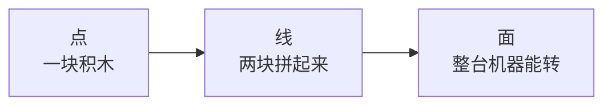

# 如何使用本教程

> 写法参考 [Hello-Agents](https://github.com/datawhalechina/hello-agents) 和 Datawhale：**一小节一小节来，每节都能动手跑。**  
> 目标很简单——你会一点 C++ 或 Python，就能把 DeepVector 从编译到问答跑起来。

---

## 1. 先要准备什么？

| 项 | 最低要求 | 说明 |
|----|----------|------|
| 系统 | Linux / macOS / **Windows + WSL2** | C++ 网络层用的是 POSIX API，原生 MSVC 编不过 |
| 编译器 | g++12+ 或 Apple Clang | 库是 C++17，部分服务器代码用 C++20 |
| 构建 | CMake ≥ 3.20、Ninja | 见 `prerequisites/01` |
| Python | 3.11+ | 学 Agent 轨（Track B）需要 |
| Ollama（可选） | 本机大模型 | 只学 C++ 可以不装；Agent 问答需要 LLM |

不想花钱买 API？看 [FREE_RESOURCES_zh.md](FREE_RESOURCES_zh.md)，里面有 Ollama、ModelScope、硅基流动等配置示例。

动手步骤：[RUN.md](../../RUN.md) · 为什么选这些技术：[TECH.md](../../TECH.md)

---

## 2. 「点 → 线 → 面」是什么意思？

可以把它想成搭乐高：

| 层级 | 你要做到什么 | 举个例子 |
|------|-------------|---------|
| **点** | 搞懂一个小概念，跑通一个小 demo | 写出 `l2_squared`，单测绿灯 |
| **线** | 两个模块通过接口连上 | `HNSW.search` 调距离函数 + `VectorStore.get` |
| **面** | 从提问到出答案，整条链路通 | `/ask` → 嵌入 → `/search` → LLM 组织回答 |

**别跳着抄代码。** 能跑和能讲清楚是两回事；跳章往往只能前者。

---

## 3. 按你的时间选路线

### 🟢 周末入门（大约 12 小时）

1. 本文 + `prerequisites/01`  
2. Track A：`ch01_setup` → `ch02_vectors_distance` → `ch03_hnsw_theory`  
3. Track B：只看 `ch01_overview` 的架构图  
4. 自己启动 `deepvector_server`，用 curl 调 `/search`

### 🟡 标准路线（大约 40 小时）

- Track A 全部做完（含 mmap、LSM、HTTP）  
- Track B 从 `ch01` 到 `ch09`（FastAPI）  
- 用 Docker Compose 跑双服务

### 🔴 面试向（大约 70 小时）

- 双轨全做 + [INTERVIEW_BANK.md](INTERVIEW_BANK.md)  
- 每章面试题用自己的话讲一遍  
- Capstone：自己灌约 1000 条文档，测 recall

---

## 4. 每一章建议怎么读

1. 先看**学习目标**——读完应该能勾选  
2. **点**——对照源码路径，搞懂公式或语法  
3. **动手**——自己敲，不要只复制粘贴  
4. **线 / 面**——看 mermaid 图，对照 [ARCHITECTURE.md](../ARCHITECTURE.md)  
5. **反思题**——写进笔记  
6. **参考链接**——点进去核对（论文、官方文档，不是二手总结）

章节结构模板：[`_CHAPTER_TEMPLATE.md`](_CHAPTER_TEMPLATE.md)

---

## 5. 找内容别迷路

| 你想学… | 去这里 |
|---------|--------|
| 向量距离 / SIMD | Track A `ch02` + prerequisites `05`/`06` |
| HNSW | Track A `ch03` |
| 磁盘 / LSM | Track A `ch04`/`ch05` |
| Agent 多轮检索 | Track B `ch07_multi_round` |
| 面试题 | [INTERVIEW_BANK.md](INTERVIEW_BANK.md) |
| 监控指标 | Track A `ch12` + `GET /metrics` |

**注意：** 仓库里有两套章节编号（C++ 轨和 Agent 轨），同号的 `ch04` 内容完全不同，别混着读。

---

## 6. 常见报错

| 现象 | 先检查这个 |
|------|-----------|
| 维度不匹配 | 服务 `--dim` 必须等于 embedding 维度（默认 **384**） |
| 过滤搜不到东西 | insert 时要带 `meta.tags` |
| Windows 编译挂 | 用 WSL2 或 Docker，别硬编 MSVC |
| Agent 回答很空 | 先跑 `scripts/demo_data.py`，再看 `GET /vectors/0/meta` 有没有 `text` |

---

## 7. 开始前确认一下

- [ ] 我按轨道读，不把 C++ 的 `ch04` 和 Agent 的 `ch04` 混在一起  
- [ ] 每章至少做一道动手题  
- [ ] 面试题能讲给别人听，而不是背答案  
- [ ] 做 Capstone 前，能画出「问一句话到返回答案」的数据流

下一步 → [LEARNING_PATH.md](LEARNING_PATH.md)
