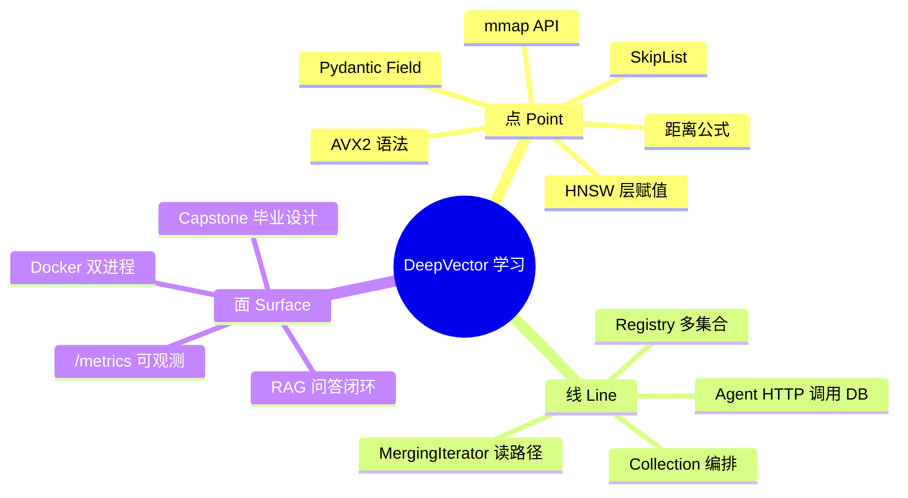

# LEARNING_PATH — 点 · 线 · 面

English summary follows each Chinese section.

---

## 总览 Overview

---

## Part 0 — 点的土壤（Prerequisites）

| ID | 知识点 | 对应文件 |
|----|--------|----------|
| P01 | CMake / Ninja / g++ | `prerequisites/01_*` |
| P02 | Docker | `prerequisites/02_*` |
| P03 | venv / pip | `prerequisites/03_*` |
| P04 | gtest / pytest | `prerequisites/04_*` |
| P05 | L2 / IP / Cosine | `prerequisites/05_向量距离度量_*` |
| P06 | AVX2 / 缓存 | `prerequisites/06_*` |

**验收：** 能解释 `cmake -B build` 与 `ctest` 各自做什么。

---

## Part 1 — 点：搜索积木（Track A 前半）

| 顺序 | 章 | 点（语法/概念） | 线（接到哪） |
|------|----|-----------------|--------------|
| 1 | A1 setup | `add_library` / `target_link_libraries` | 整个 monorepo |
| 2 | A2 distance | `float` 向量、`#ifdef __AVX2__`、`_mm256_fmadd_ps` | HNSW 回调 |
| 3 | A3 HNSW | `priority_queue`、层公式 `-ln(u)/ln(M)` | Collection.search |

**面试锚点：** ANN vs KNN、M / efSearch 权衡（见 INTERVIEW_BANK Q1–Q8）。

---

## Part 2 — 点→线：存储积木

| 顺序 | 章 | 点 | 线 |
|------|----|----|----|
| 4 | A4 mmap | `mmap`/`msync`/`MAP_SHARED` | VectorStore |
| 5 | A5 LSM | WAL、MemTable、SST、`MergingIterator` | DocumentStore |
| 6 | A6 filter | AST `op/field/value/children` | searchWithFilter |
| 7 | A7 PQ/SQ | k-means、ADC | 量化搜索路径 |

**面试锚点：** 写放大、Bloom、mmap vs read（Q15–Q30）。

---

## Part 3 — 线：服务积木

| 顺序 | 章 | 点 | 线 |
|------|----|----|----|
| 8 | A8 patterns | PIMPL、`std::function` 类型擦除 | Server / Collection |
| 9 | A9 pybind11 | `py::array_t`、GIL release | Python SDK |
| 10 | A10 HTTP | `select`、JSON、`CollectionRegistry` | Agent / MCP |
| 11 | A11 coroutines | `co_await` / Task（SkyNet） | 异步网络 |
| 12 | A12 production | Dockerfile、`/metrics` | 运维面 |

---

## Part 4 — 线→面：Agent 积木（Track B）

| 顺序 | 章 | 点 | 线 |
|------|----|----|----|
| 1 | B1 overview | 分层架构图 | 全局 |
| 2–3 | B2–B3 | dataclass、env | 配置面 |
| 4–5 | B4–B5 | Function calling、embedding | LLM↔向量 |
| 6–7 | B6–B7 | Strategy enum、多轮状态机 | 检索引擎 |
| 8–9 | B8–B9 | MCP tools、FastAPI lifespan | 对外 API |
| 10–12 | B10–B12 | 对接、Docker、pytest | 质量面 |

**面试锚点：** RAG 流水线、Agent 何时停止检索、MCP 是什么（Q60+）。

---

## Part 5 — 面：Capstone

`ch13_capstone` 要求你：

1. 编译并启动双服务  
2. `demo_data.py` 灌库  
3. `/ask` 回答中文问题  
4. 观察 `/metrics`  
5. 写一页「架构反思」：为何 HNSW+mmap+LSM 如此组合  

对齐 Hello-Agents「毕业设计」章节精神：自己选题、自己验收。

---

## English Pocket Map

1. **Points** = distance kernels, HNSW math, mmap syscalls, LSM iterators, Pydantic models.  
2. **Lines** = Collection orchestration, Registry, Agent HTTP client, MergingIterator.  
3. **Surface** = RAG Q&A, Docker dual process, Prometheus metrics, Capstone.  
4. Pick 🟢 / 🟡 / 🔴 route in `course/README.md`.  
5. Drill `INTERVIEW_BANK.md` after each brick.
