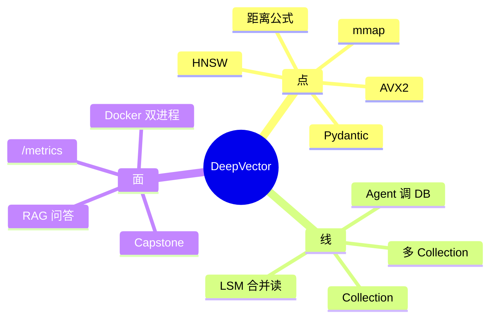

# 学习路线 · 点 · 线 · 面

每段中文后面有简短 English summary。

> 🆓 不花钱跑 Agent：[FREE_RESOURCES_zh.md](FREE_RESOURCES_zh.md) · [EN](FREE_RESOURCES_en.md)

---

## 总览

---

## Part 0 — 先补基础

| ID | 学什么 | 文档 |
|----|--------|------|
| P01 | CMake / Ninja / g++ | `prerequisites/01_*` |
| P02 | Docker | `prerequisites/02_*` |
| P03 | venv / pip | `prerequisites/03_*` |
| P04 | gtest / pytest | `prerequisites/04_*` |
| P05 | L2 / 内积 / 余弦 | `prerequisites/05_向量距离度量_*` |
| P06 | AVX2 | `prerequisites/06_*` |

**怎么算过关：** 你能说清楚 `cmake -B build` 和 `ctest` 各干什么。

---

## Part 1 — 点：搜索相关（Track A 前半）

| 顺序 | 章 | 这一节学什么 | 和后面怎么接 |
|------|----|-------------|-------------|
| 1 | A1 setup | CMake 目标、链接 | 整个 monorepo |
| 2 | A2 distance | 向量、`#ifdef __AVX2__` | HNSW 算距离 |
| 3 | A3 HNSW | 优先队列、分层图 | `Collection.search` |

面试可对照 [INTERVIEW_BANK.md](INTERVIEW_BANK.md) Q1–Q8（ANN、M、efSearch 等）。

---

## Part 2 — 点 → 线：存储

| 顺序 | 章 | 点 | 线 |
|------|----|----|----|
| 4 | A4 mmap | `mmap` / `msync` | VectorStore |
| 5 | A5 LSM | WAL、MemTable、SST | DocumentStore、MiniKV |
| 6 | A6 filter | 过滤 AST | `searchWithFilter` |
| 7 | A7 PQ/SQ | 量化 | 可选压缩搜索 |

面试可对照 Q15–Q30（写放大、Bloom、mmap 等）。

---

## Part 3 — 线：对外服务（Track A 后半）

| 顺序 | 章 | 点 | 线 |
|------|----|----|----|
| 8 | A8 patterns | PIMPL、类型擦除 | Server / Collection |
| 9 | A9 pybind11 | Python 绑定 | SDK |
| 10 | A10 HTTP | REST、`CollectionRegistry` | Agent / MCP 来调 |
| 11 | A11 coroutines | C++20 协程（SkyNet） | 异步网络 |
| 12 | A12 production | Docker、`/metrics` | 上线运维 |

---

## Part 4 — 线 → 面：Agent（Track B）

| 顺序 | 章 | 点 | 线 |
|------|----|----|----|
| 1 | B1 overview | 分层图 | 全局 |
| 2–3 | B2–B3 | 配置、环境变量 | 启动参数 |
| 4–5 | B4–B5 | LLM、embedding | 文本 → 向量 |
| 6–7 | B6–B7 | 检索策略、多轮 | 搜不到就改 query 再搜 |
| 8–9 | B8–B9 | MCP、FastAPI | 对外 HTTP |
| 10–12 | B10–B12 | 对接 C++、Docker、测试 | 质量保障 |

面试可对照 Q60+（RAG 流程、MCP 等）。

---

## Part 5 — 面：Capstone（ch13）

按顺序做这五件事：

1. 编译并启动 C++ + Agent 两个服务  
2. 跑 `demo_data.py` 灌数据  
3. 用 `/ask` 问一个中文问题，看回答是否合理  
4. 打开 `/metrics` 看有没有请求计数  
5. 写一页笔记：为什么这个项目用 HNSW + mmap + LSM 组合  

和 Hello-Agents 毕业项目一样：**自己跑通、自己验收**，没有标准答案抄。

---

## English summary

1. **Points** = distance, HNSW, mmap, LSM, Pydantic — one concept at a time.  
2. **Lines** = wire modules (Collection, Registry, Agent HTTP, MergingIterator).  
3. **Surface** = full RAG Q&A, Docker, metrics, Capstone.  
4. Pick 🟢 / 🟡 / 🔴 route in `course/README.md`.  
5. Use `INTERVIEW_BANK.md` after each part.
