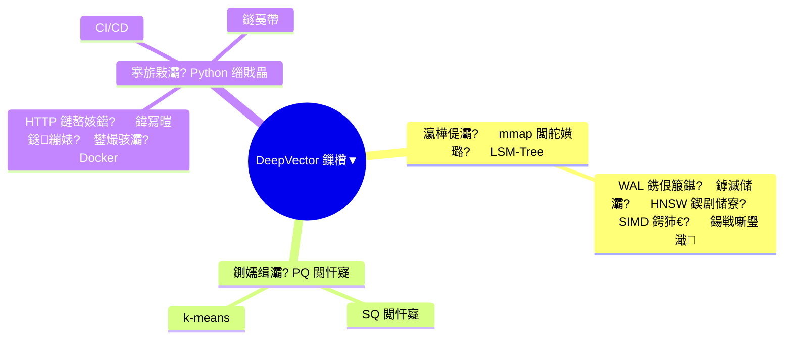
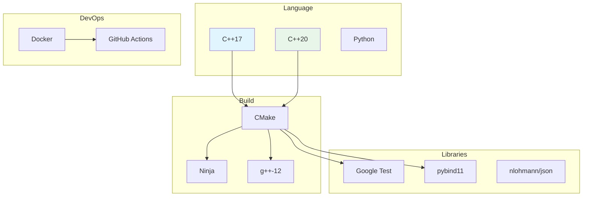

<p align="center">
  
  
  
  
  
  
</p>

<h1 align="center">DeepVector 浠庨浂鍒颁竴</h1>

<p align="center">
  <b>C++ 鍚戦噺鏁版嵁搴撳疄鎴樻暀绋?/b><br/>
  <i>浠庣涓€琛屼唬鐮佸埌鐢熶骇閮ㄧ讲 路 13 绔?路 70+ 灏忔椂鍐呭</i>
</p>

---

## 鍓嶇疆鐭ヨ瘑锛圥rerequisites锛?
鍚勭珷鍏变韩鐨勫熀纭€鐭ヨ瘑宸叉彁鍙栧埌鐙珛鏂囨。锛岄伩鍏嶉噸澶嶏細

| 鏂囨。 | 鍐呭 | 涓枃 | English |
|------|------|------|---------|
| 鏋勫缓鐜閰嶇疆 | CMake, Ninja, g++, 缂栬瘧閫夐」 | [涓枃](prerequisites/01_鏋勫缓鐜閰嶇疆_zh.md) | [English](prerequisites/01_鏋勫缓鐜閰嶇疆_en.md) |
| Docker 瀹瑰櫒鍖?| Dockerfile, docker-compose, 闀滃儚浼樺寲 | [涓枃](prerequisites/02_Docker瀹瑰櫒鍖朹zh.md) | [English](prerequisites/02_Docker瀹瑰櫒鍖朹en.md) |
| Python 鐜 | 铏氭嫙鐜, pip, pybind11 鏋勫缓 | [涓枃](prerequisites/03_Python鐜_zh.md) | [English](prerequisites/03_Python鐜_en.md) |
| 娴嬭瘯妗嗘灦 | Google Test, ctest, 鏂█瀹?| [涓枃](prerequisites/04_娴嬭瘯妗嗘灦_zh.md) | [English](prerequisites/04_娴嬭瘯妗嗘灦_en.md) |
| 鍚戦噺璺濈搴﹂噺 | L2, Cosine, Inner Product | [涓枃](prerequisites/05_鍚戦噺璺濈搴﹂噺_zh.md) | [English](prerequisites/05_鍚戦噺璺濈搴﹂噺_en.md) |
| SIMD 涓庣‖浠朵紭鍖?| AVX2, 鍐呭瓨灞傛, 缂栬瘧閫夐」 | [涓枃](prerequisites/06_SIMD涓庣‖浠朵紭鍖朹zh.md) | [English](prerequisites/06_SIMD涓庣‖浠朵紭鍖朹en.md) |

> 姣忕珷寮€澶寸殑 **鍓嶇疆鐭ヨ瘑** 鍖哄煙浼氭爣娉ㄩ渶瑕佸厛闃呰鍝簺鍙傝€冩枃妗ｃ€?
---

## 涓轰粈涔堝杩欎釜锛?
RAG (Retrieval-Augmented Generation) 鏄澶ц瑷€妯″瀷"鏌ヨ祫鏂欏啀鍥炵瓟"鐨勬牳蹇冩妧鏈€傝€?RAG 鐨勫簳灞傚氨鏄竴涓?*鍚戦噺鏁版嵁搴?*銆?
鏈暀绋嬪甫浣犱粠闆跺紑濮嬶紝鐢?C++ 鎵嬪啓涓€涓畬鏁寸殑鍚戦噺鏁版嵁搴撳紩鎿庘€斺€旀兜鐩?HNSW 鎼滅储銆丼IMD 鍔犻€熴€乵map 瀛樺偍銆侀噺鍖栧帇缂┿€丳ython 缁戝畾銆丠TTP 鏈嶅姟鍣ㄣ€佺敓浜ч儴缃层€?
**涓嶆槸鐢ㄦ鏋舵惌绉湪锛屾槸閫犲彂鍔ㄦ満銆?*



---

## 璇剧▼澶х翰


| 绔?| 涓枃 | English | 闅惧害 | 鏃堕棿 |
|----|------|---------|------|------|
| 01 | [鐜鎼缓](ch01_setup/01_鐜鎼缓涓庣紪璇慱zh.md) | [Setup](ch01_setup/01_鐜鎼缓涓庣紪璇慱en.md) | 猸?| 2h |
| 02 | [鍚戦噺涓庤窛绂籡(ch02_vectors_distance/02_鍚戦噺涓庤窛绂诲害閲廮zh.md) | [Vectors & Distance](ch02_vectors_distance/02_鍚戦噺涓庤窛绂诲害閲廮en.md) | 猸愨瓙 | 3h |
| 03 | [HNSW 绠楁硶](ch03_hnsw_theory/03_HNSW杩戜技鎼滅储_zh.md) | [HNSW Search](ch03_hnsw_theory/03_HNSW杩戜技鎼滅储_en.md) | 猸愨瓙猸?| 4h |
| 04 | [mmap 瀛樺偍](ch04_mmap_storage/04_mmap闆舵嫹璐濆瓨鍌╛zh.md) | [mmap Storage](ch04_mmap_storage/04_mmap闆舵嫹璐濆瓨鍌╛en.md) | 猸愨瓙 | 3h |
| 05 | [LSM-Tree](ch05_lsm_tree/05_LSM-Tree瀛樺偍寮曟搸_zh.md) | [LSM-Tree Engine](ch05_lsm_tree/05_LSM-Tree瀛樺偍寮曟搸_en.md) | 猸愨瓙猸?| 5h |
| 06 | [鍏冩暟鎹繃婊(ch06_metadata_filter/06_鍏冩暟鎹繃婊ゆ悳绱zh.md) | [Metadata Filter](ch06_metadata_filter/06_鍏冩暟鎹繃婊ゆ悳绱en.md) | 猸愨瓙 | 3h |
| 07 | [閲忓寲鍘嬬缉](ch07_quantization/07_鍚戦噺閲忓寲鍘嬬缉_zh.md) | [Quantization](ch07_quantization/07_鍚戦噺閲忓寲鍘嬬缉_en.md) | 猸愨瓙猸?| 4h |
| 08 | [C++ 璁捐妯″紡](ch08_cpp_patterns/08_CPP璁捐妯″紡_zh.md) | [C++ Patterns](ch08_cpp_patterns/08_CPP璁捐妯″紡_en.md) | 猸愨瓙 | 3h |
| 09 | [Python 缁戝畾](ch09_python_bindings/09_Python缁戝畾_zh.md) | [Python Bindings](ch09_python_bindings/09_Python缁戝畾_en.md) | 猸愨瓙 | 3h |
| 10 | [HTTP 鏈嶅姟鍣╙(ch10_http_server/10_HTTP鏈嶅姟鍣ㄨ璁zh.md) | [HTTP Server](ch10_http_server/10_HTTP鏈嶅姟鍣ㄨ璁en.md) | 猸愨瓙 | 4h |
| 11 | [C++20 鍗忕▼](ch11_coroutines/11_CPP20鍗忕▼_zh.md) | [C++20 Coroutines](ch11_coroutines/11_CPP20鍗忕▼_en.md) | 猸愨瓙猸?| 4h |
| 12 | [鐢熶骇閮ㄧ讲](ch12_production/12_鐢熶骇閮ㄧ讲_zh.md) | [Production](ch12_production/12_鐢熶骇閮ㄧ讲_en.md) | 猸愨瓙 | 3h |
| 13 | [缁堟瀬椤圭洰](ch13_capstone/13_缁堟瀬椤圭洰_zh.md) | [Capstone Project](ch13_capstone/13_缁堟瀬椤圭洰_en.md) | 猸愨瓙猸?| 7澶?|

---

## 瀛︿範璺嚎

```mermaid
graph TB
    START((寮€濮?) --> ROUTE{閫夋嫨璺嚎}
    
    ROUTE -->|馃煝 鍏ラ棬| G1[Ch01] --> G2[Ch02] --> G3[Ch03] --> G13A[Ch13 缁堟瀬椤圭洰]
    
    ROUTE -->|馃煛 鏍囧噯| S1[Ch01~Ch08] --> S2[Ch09] --> S3[Ch13 缁堟瀬椤圭洰]
    
    ROUTE -->|馃敶 闈㈣瘯| D1[鍏ㄩ儴 13 绔燷 --> D2[姣忕珷鎬濊€冮] --> D3[INTERVIEW_QA.md]
    
    G13A --> DONE((瀹屾垚))
    S3 --> DONE
    D3 --> DONE

    style G13A fill:#c8e6c9
    style S3 fill:#fff9c4
    style D3 fill:#ffcdd2
    style DONE fill:#e8f5e9
```

| 璺嚎 | 璺緞 | 閫傚悎 |
|------|------|------|
| 馃煝 鍏ラ棬 | Ch1 鈫?Ch2 鈫?Ch3 鈫?Ch13 | 鎯冲揩閫熻窇閫氬叏娴佺▼ |
| 馃煛 鏍囧噯 | Ch1 ~ Ch08 鈫?Ch13 | 鎯冲叏闈㈡帉鎻℃妧鏈爤 |
| 馃敶 闈㈣瘯 | 鍏ㄩ儴 + 鎬濊€冮 + QA | 鍑嗗 C++ 闈㈣瘯 |

---

## 姣忕珷缁撴瀯

```mermaid
graph TB
    CH[姣忕珷鍐呭] --> THEORY[馃摉 鐞嗚鐭ヨ瘑<br/>鍘熺悊 + 鍏紡 + 绫绘瘮]
    CH --> CODE[馃捇 浠ｇ爜缁冧範<br/>3-5 涓€掕繘寮忎换鍔
    CH --> THINK[馃 鎬濊€冮<br/>5-8 閬撴繁搴︽楠宂
    CH --> CHECK[馃搵 鐭ヨ瘑鐐?br/>鍙嬀閫?checklist]

    style THEORY fill:#e1f5fe
    style CODE fill:#e8f5e9
    style THINK fill:#fff3e0
    style CHECK fill:#f3e5f5
```

---

## 鎶€鏈爤



| 灞?| 鎶€鏈?|
|----|------|
| 璇█ | C++17 / C++20 / Python |
| 鏋勫缓 | CMake + Ninja |
| 缂栬瘧鍣?| g++-12 / clang++-14 |
| 娴嬭瘯 | Google Test |
| 缁戝畾 | pybind11 |
| 鏈嶅姟鍣?| HTTP/1.1 + Bearer Auth |
| 閮ㄧ讲 | Docker + docker-compose |
| CI/CD | GitHub Actions |

---

## 鐜瑕佹眰

| 闇€姹?| 鏈€浣?| 鎺ㄨ崘 |
|------|------|------|
| OS | Ubuntu 20.04 / WSL2 | Ubuntu 22.04 |
| 缂栬瘧鍣?| g++-11 | g++-12 |
| 鏋勫缓 | CMake 3.16+ | CMake 3.25+ |
| 鍐呭瓨 | 4GB | 8GB+ (Ch13) |
| 缂栬緫鍣?| 浠绘剰 | VS Code + C/C++ |

---

## 閰嶅浠撳簱

```mermaid
graph LR
    COURSE[DeepVector 鏁欑▼] --> LDB[DeepVector<br/>鍚戦噺鏁版嵁搴揮
    COURSE --> MKV[MiniKV<br/>瀛樺偍寮曟搸]
    COURSE --> SN[SkyNet<br/>缃戠粶妗嗘灦]

    LDB --> MKV
    LDB --> SN

    style COURSE fill:#e1f5fe
    style LDB fill:#fff3e0
    style MKV fill:#f3e5f5
    style SN fill:#e8f5e9
```

| 浠撳簱 | 璇存槑 |
|------|------|
| [DeepVector](https://github.com/Thezx-a/DeepVector) | 鍚戦噺鏁版嵁搴撲富浠撳簱 |
| [MiniKV](https://github.com/Thezx-a/MiniKV) | LSM-Tree 瀛樺偍寮曟搸 |
| [SkyNet](https://github.com/Thezx-a/SkyNet) | C++20 鍗忕▼缃戠粶妗嗘灦 |

---

## 鍙傝€冭祫婧?
- [HNSW 璁烘枃 (Malkov & Yashunin, 2016)](https://arxiv.org/abs/1603.09320)
- [FAISS 婧愮爜](https://github.com/facebookresearch/faiss)
- [LevelDB 婧愮爜](https://github.com/google/leveldb)
- [RocksDB Wiki](https://github.com/facebook/rocksdb/wiki)
- [pybind11 鏂囨。](https://pybind11.readthedocs.io/)
- [DeepVector 闈㈣瘯 78 棰榏(https://github.com/Thezx-a/DeepVector/blob/main/INTERVIEW_QA.md)

---

## License

[MIT](LICENSE) 鈥?鑷敱浣跨敤銆佷慨鏀广€佸垎鍙戙€?
---

<p align="center">
  <i>閫犱竴涓暟鎹簱锛岀悊瑙ｆ暣涓郴缁熴€?/i>
</p>
