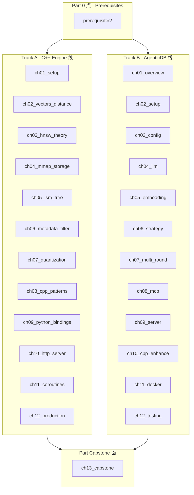
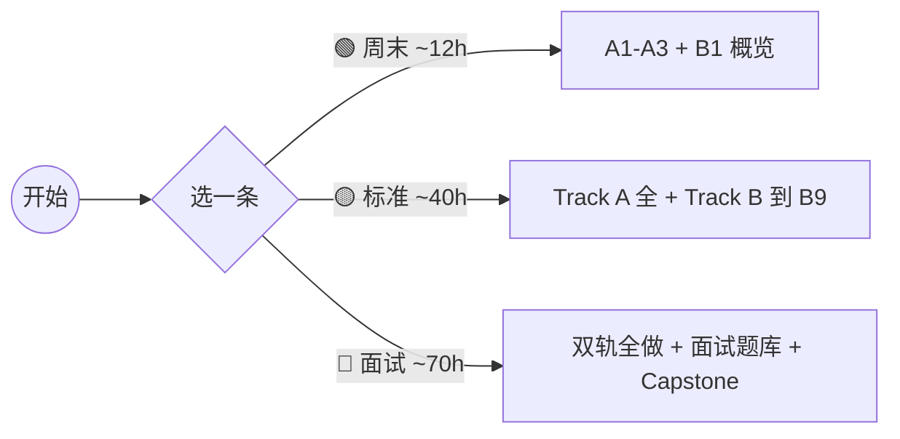

<p align="center">
  
  
  
  
</p>

<h1 align="center">DeepVector 从零到一 · Learning Path</h1>

<p align="center">
  <b>一块一块学：每节能单独跑，连起来就是完整 RAG 系统</b><br/>
  <i>Each chapter runs on its own; wired together you get a working RAG stack</i>
</p>

<p align="center">
  <a href="./00_如何使用本教程_zh.md">🇨🇳 如何使用</a> ·
  <a href="./00_如何使用本教程_en.md">🇺🇸 How to use</a> ·
  <a href="./FREE_RESOURCES_zh.md">🆓 免费资源 Free APIs</a> ·
  <a href="./LEARNING_PATH.md">路线图 Roadmap</a> ·
  <a href="./INTERVIEW_BANK.md">面试题库 Interview Bank</a> ·
  <a href="../ARCHITECTURE.md">架构 Architecture</a> ·
  <a href="../../TECH.md">技术选型 TECH</a>
</p>

---

## 这套教程怎么组织的

| 原则 | 什么意思 |
|------|---------|
| **自己写引擎 + 用现成 LLM** | C++ 部分手写；Agent 调 Ollama / OpenAI 兼容 API |
| **点 → 线 → 面** | 先一个小概念，再模块对接，最后整条问答链路 |
| **每章能跑** | 有代码、有测试、有动手题 |
| **面试题有出处** | 来自向量库/存储常见考点，见 INTERVIEW_BANK |
| **中英各一份** | 中文为主，英文对照 |

社区参考（不是本仓库代码，是学习方法）：
- [Hello-Agents](https://github.com/datawhalechina/hello-agents) — 分章递进、毕业项目
- [Datawhale](https://www.datawhale.cn/) — 开源免费课程

---

## 两套章节，别混编号

仓库里有两条学习线：**C++ 引擎（Track A）** 和 **Agent 检索（Track B）**。  
两边的 `ch04`、`ch05` 内容完全不同——一个是 mmap，一个是 LLM。按轨道读，不要跳着混。



### Track A — C++ 向量引擎（造发动机）

| 积木 | 目录 | 你会得到 |
|------|------|----------|
| A1 环境 | [ch01_setup](ch01_setup/) | CMake/Ninja 跑通 hello |
| A2 距离 | [ch02_vectors_distance](ch02_vectors_distance/) | L2/IP/Cosine + AVX2 |
| A3 HNSW | [ch03_hnsw_theory](ch03_hnsw_theory/) | 图索引搜索 |
| A4 mmap | [ch04_mmap_storage](ch04_mmap_storage/) | 零拷贝持久化 |
| A5 LSM | [ch05_lsm_tree](ch05_lsm_tree/) | MiniKV WAL→SST→Merge |
| A6 过滤 | [ch06_metadata_filter](ch06_metadata_filter/) | Filter AST |
| A7 量化 | [ch07_quantization](ch07_quantization/) | PQ/SQ |
| A8 模式 | [ch08_cpp_patterns](ch08_cpp_patterns/) | PIMPL / 类型擦除 |
| A9 绑定 | [ch09_python_bindings](ch09_python_bindings/) | pybind11 |
| A10 HTTP | [ch10_http_server](ch10_http_server/) | REST + multi-collection |
| A11 协程 | [ch11_coroutines](ch11_coroutines/) | C++20 Task（SkyNet） |
| A12 生产 | [ch12_production](ch12_production/) | Docker / metrics |

### Track B — AgenticDB（造智能检索）

| 积木 | 目录 | 你会得到 |
|------|------|----------|
| B1 概览 | [ch01_overview](ch01_overview/) | 全局架构图 |
| B2 环境 | [ch02_setup](ch02_setup/) | venv + Ollama |
| B3 配置 | [ch03_config](ch03_config/) | dataclass + env |
| B4 LLM | [ch04_llm](ch04_llm/) | Router / tools |
| B5 嵌入 | [ch05_embedding](ch05_embedding/) | local / OpenAI |
| B6 策略 | [ch06_strategy](ch06_strategy/) | DIRECT/FILTERED/… |
| B7 多轮 | [ch07_multi_round](ch07_multi_round/) | Plan→Eval→Reform |
| B8 MCP | [ch08_mcp](ch08_mcp/) | 工具协议 |
| B9 Agent HTTP | [ch09_server](ch09_server/) | FastAPI lifespan |
| B10 增强 | [ch10_cpp_enhance](ch10_cpp_enhance/) | 与引擎对接 |
| B11 Docker | [ch11_docker](ch11_docker/) | compose 双服务 |
| B12 测试 | [ch12_testing](ch12_testing/) | pytest agent |

### Capstone — 面

| | |
|--|--|
| [ch13_capstone](ch13_capstone/) | 端到端：编译 → 灌数 → Agent 问答 → 指标 |

---

## 三条路线，按时间选



| 路线 | 适合 | 做完你能 |
|------|------|---------|
| 🟢 入门 | 会一点 C++/Python | 本地搜索 demo |
| 🟡 标准 | 想做后端/检索 | Docker 跑双服务 |
| 🔴 面试 | 校招/社招 | 讲清 HNSW、LSM、Agent 链路 |

---

## 每章长什么样

见 [`_CHAPTER_TEMPLATE.md`](_CHAPTER_TEMPLATE.md)。大致包括：

1. **点** — 一个知识点 + 对应源码路径  
2. **线** — 和相邻模块怎么接  
3. **面** — 在整体架构里占哪一块  
4. **动手题** — 要自己敲  
5. **反思题** — 写笔记用  
6. **面试题** — 链到 [INTERVIEW_BANK.md](INTERVIEW_BANK.md)  
7. **参考链接** — 论文或官方文档（可点开核对）

---

## 前置知识 Prerequisites

| 文档 | 中文 | English |
|------|------|---------|
| 构建环境 | [01](prerequisites/01_构建环境配置_zh.md) | [01](prerequisites/01_构建环境配置_en.md) |
| Docker | [02](prerequisites/02_Docker容器化_zh.md) | [02](prerequisites/02_Docker容器化_en.md) |
| Python | [03](prerequisites/03_Python环境_zh.md) | [03](prerequisites/03_Python环境_en.md) |
| **免费 API / Ollama** | [FREE_RESOURCES_zh](FREE_RESOURCES_zh.md) | [FREE_RESOURCES_en](FREE_RESOURCES_en.md) |
| 测试 | [04](prerequisites/04_测试框架_zh.md) | [04](prerequisites/04_测试框架_en.md) |
| 距离度量 | [05](prerequisites/05_向量距离度量_zh.md) | [05](prerequisites/05_向量距离度量_en.md) |
| SIMD | [06](prerequisites/06_SIMD与硬件优化_zh.md) | [06](prerequisites/06_SIMD与硬件优化_en.md) |

> 若存在历史重复文件（如 `05_距离度量_*`），以带「向量」字样的文件为准。

---

## 5 分钟检查环境能不能用

```bash
# 在仓库根目录（Linux / WSL / macOS）
cmake -B build -G Ninja -DCMAKE_BUILD_TYPE=Release -DENABLE_TESTS=ON
cmake --build build -j$(nproc)
./build/deepvector/deepvector_server --port 8080 --dim 384 &
cd deepvector && pip install -r requirements.txt
python -c "from agent.server import create_app; print(create_app().title)"
curl -s http://127.0.0.1:8080/health
curl -s http://127.0.0.1:8080/metrics | head
```

Windows 用户看根目录 [RUN.md](../../RUN.md)（推荐 WSL2 或 Docker）。

---

## License

MIT · 欢迎像 Datawhale 一样提 PR 共创章节与题库。
