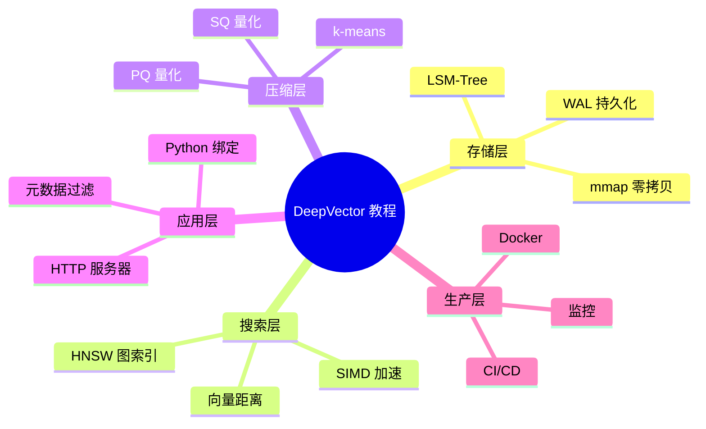
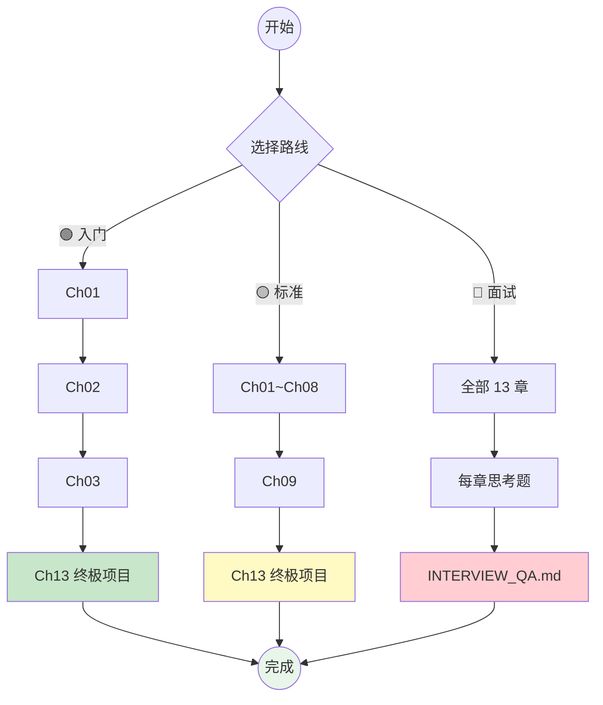
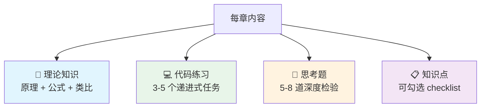
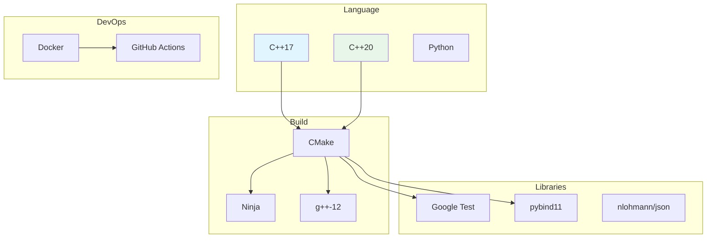
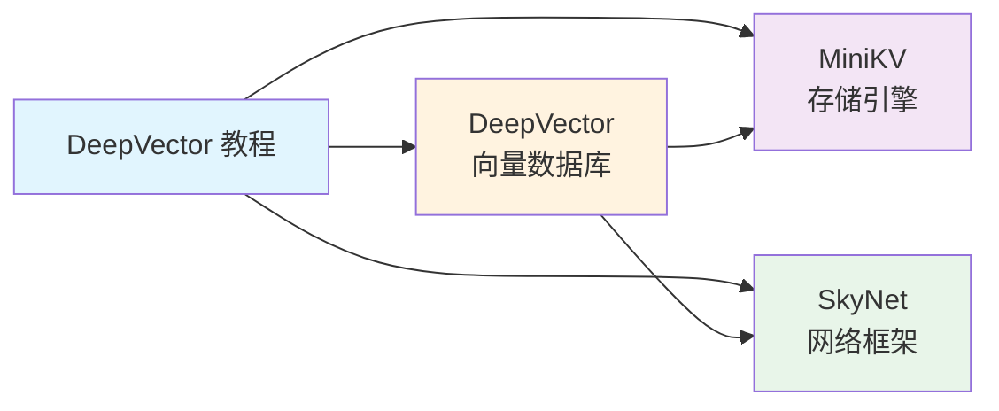

  
  
  
  
  
  

<h1 align="center">DeepVector 从零到一</h1>

  <b>C++ 向量数据库实战教程</b> 
  <i>从第一行代码到生产部署 · 13 章 · 70+ 小时内容</i>

---

## 前置知识（Prerequisites）

各章共享的基础知识已提取到独立文档，避免重复：

| 文档 | 内容 | 中文 | English |
|------|------|------|---------|
| 构建环境配置 | CMake, Ninja, g++, 编译选项 | [中文](prerequisites/01_构建环境配置_zh.md) | [English](prerequisites/01_构建环境配置_en.md) |
| Docker 容器化 | Dockerfile, docker-compose, 镜像优化 | [中文](prerequisites/02_Docker容器化_zh.md) | [English](prerequisites/02_Docker容器化_en.md) |
| Python 环境 | 虚拟环境, pip, pybind11 构建 | [中文](prerequisites/03_Python环境_zh.md) | [English](prerequisites/03_Python环境_en.md) |
| 测试框架 | Google Test, ctest, 断言宏 | [中文](prerequisites/04_测试框架_zh.md) | [English](prerequisites/04_测试框架_en.md) |
| 向量距离度量 | L2, Cosine, Inner Product | [中文](prerequisites/05_向量距离度量_zh.md) | [English](prerequisites/05_向量距离度量_en.md) |
| SIMD 与硬件优化 | AVX2, 内存层次, 编译选项 | [中文](prerequisites/06_SIMD与硬件优化_zh.md) | [English](prerequisites/06_SIMD与硬件优化_en.md) |

> 每章开头的 **前置知识** 区域会标注需要先阅读哪些参考文档。

---

## 为什么学这个？

RAG (Retrieval-Augmented Generation) 是让大语言模型"查资料再回答"的核心技术。而 RAG 的底层就是一个**向量数据库**。

本教程带你从零开始，用 C++ 手写一个完整的向量数据库引擎——涵盖 HNSW 搜索、SIMD 加速、mmap 存储、量化压缩、Python 绑定、HTTP 服务器、生产部署。

**不是用框架搭积木，是造发动机。**

---

## 课程大纲

```mermaid
graph LR
    subgraph "基础 (Ch1-3)"
        C01[Ch01 环境搭建]
        C02[Ch02 向量距离]
        C03[Ch03 HNSW]
    end

    subgraph "存储 (Ch4-5)"
        C04[Ch04 mmap]
        C05[Ch05 LSM-Tree]
    end

    subgraph "功能 (Ch6-9)"
        C06[Ch06 过滤]
        C07[Ch07 量化]
        C08[Ch08 C++模式]
        C09[Ch09 Python]
    end

    subgraph "服务 (Ch10-12)"
        C10[Ch10 HTTP]
        C11[Ch11 协程]
        C12[Ch12 生产]
    end

    subgraph "实战"
        C13[Ch13 终极项目]
    end

    C01 --> C02 --> C03
    C03 --> C04 --> C05
    C05 --> C06 --> C07 --> C08 --> C09
    C09 --> C10 --> C11 --> C12
    C12 --> C13

    style C13 fill:#fff3e0
    style C03 fill:#e1f5fe
    style C05 fill:#f3e5f5
```

| 章 | 中文 | English | 难度 | 时间 |
|----|------|---------|------|------|
| 01 | [环境搭建](ch01_setup/01_环境搭建与编译_zh.md) | [Setup](ch01_setup/01_环境搭建与编译_en.md) | ⭐ | 2h |
| 02 | [向量与距离](ch02_vectors_distance/02_向量与距离度量_zh.md) | [Vectors & Distance](ch02_vectors_distance/02_向量与距离度量_en.md) | ⭐⭐ | 3h |
| 03 | [HNSW 算法](ch03_hnsw_theory/03_HNSW近似搜索_zh.md) | [HNSW Search](ch03_hnsw_theory/03_HNSW近似搜索_en.md) | ⭐⭐⭐ | 4h |
| 04 | [mmap 存储](ch04_mmap_storage/04_mmap零拷贝存储_zh.md) | [mmap Storage](ch04_mmap_storage/04_mmap零拷贝存储_en.md) | ⭐⭐ | 3h |
| 05 | [LSM-Tree](ch05_lsm_tree/05_LSM-Tree存储引擎_zh.md) | [LSM-Tree Engine](ch05_lsm_tree/05_LSM-Tree存储引擎_en.md) | ⭐⭐⭐ | 5h |
| 06 | [元数据过滤](ch06_metadata_filter/06_元数据过滤搜索_zh.md) | [Metadata Filter](ch06_metadata_filter/06_元数据过滤搜索_en.md) | ⭐⭐ | 3h |
| 07 | [量化压缩](ch07_quantization/07_向量量化压缩_zh.md) | [Quantization](ch07_quantization/07_向量量化压缩_en.md) | ⭐⭐⭐ | 4h |
| 08 | [C++ 设计模式](ch08_cpp_patterns/08_CPP设计模式_zh.md) | [C++ Patterns](ch08_cpp_patterns/08_CPP设计模式_en.md) | ⭐⭐ | 3h |
| 09 | [Python 绑定](ch09_python_bindings/09_Python绑定_zh.md) | [Python Bindings](ch09_python_bindings/09_Python绑定_en.md) | ⭐⭐ | 3h |
| 10 | [HTTP 服务器](ch10_http_server/10_HTTP服务器设计_zh.md) | [HTTP Server](ch10_http_server/10_HTTP服务器设计_en.md) | ⭐⭐ | 4h |
| 11 | [C++20 协程](ch11_coroutines/11_CPP20协程_zh.md) | [C++20 Coroutines](ch11_coroutines/11_CPP20协程_en.md) | ⭐⭐⭐ | 4h |
| 12 | [生产部署](ch12_production/12_生产部署_zh.md) | [Production](ch12_production/12_生产部署_en.md) | ⭐⭐ | 3h |
| 13 | [终极项目](ch13_capstone/13_终极项目_zh.md) | [Capstone Project](ch13_capstone/13_终极项目_en.md) | ⭐⭐⭐ | 7天 |

---

## 学习路线

| 路线 | 路径 | 适合 |
|------|------|------|
| 🟢 入门 | Ch1 → Ch2 → Ch3 → Ch13 | 想快速跑通全流程 |
| 🟡 标准 | Ch1 ~ Ch08 → Ch13 | 想全面掌握技术栈 |
| 🔴 面试 | 全部 + 思考题 + QA | 准备 C++ 面试 |

---

## 每章结构

---

## 技术栈

| 层 | 技术 |
|----|------|
| 语言 | C++17 / C++20 / Python |
| 构建 | CMake + Ninja |
| 编译器 | g++-12 / clang++-14 |
| 测试 | Google Test |
| 绑定 | pybind11 |
| 服务器 | HTTP/1.1 + Bearer Auth |
| 部署 | Docker + docker-compose |
| CI/CD | GitHub Actions |

---

## 环境要求

| 需求 | 最低 | 推荐 |
|------|------|------|
| OS | Ubuntu 20.04 / WSL2 | Ubuntu 22.04 |
| 编译器 | g++-11 | g++-12 |
| 构建 | CMake 3.16+ | CMake 3.25+ |
| 内存 | 4GB | 8GB+ (Ch13) |
| 编辑器 | 任意 | VS Code + C/C++ |

---

## 配套仓库

| 仓库 | 说明 |
|------|------|
| [DeepVector](https://github.com/Thezx-a/DeepVector) | 向量数据库主仓库 |
| [MiniKV](https://github.com/Thezx-a/MiniKV) | LSM-Tree 存储引擎 |
| [SkyNet](https://github.com/Thezx-a/SkyNet) | C++20 协程网络框架 |

---

## 参考资源

- [HNSW 论文 (Malkov & Yashunin, 2016)](https://arxiv.org/abs/1603.09320)
- [FAISS 源码](https://github.com/facebookresearch/faiss)
- [LevelDB 源码](https://github.com/google/leveldb)
- [RocksDB Wiki](https://github.com/facebook/rocksdb/wiki)
- [pybind11 文档](https://pybind11.readthedocs.io/)
- [DeepVector 面试 78 题](https://github.com/Thezx-a/DeepVector/blob/main/INTERVIEW_QA.md)

---

## License

[MIT](LICENSE) — 自由使用、修改、分发。

---

  <i>造一个数据库，理解整个系统。</i>

