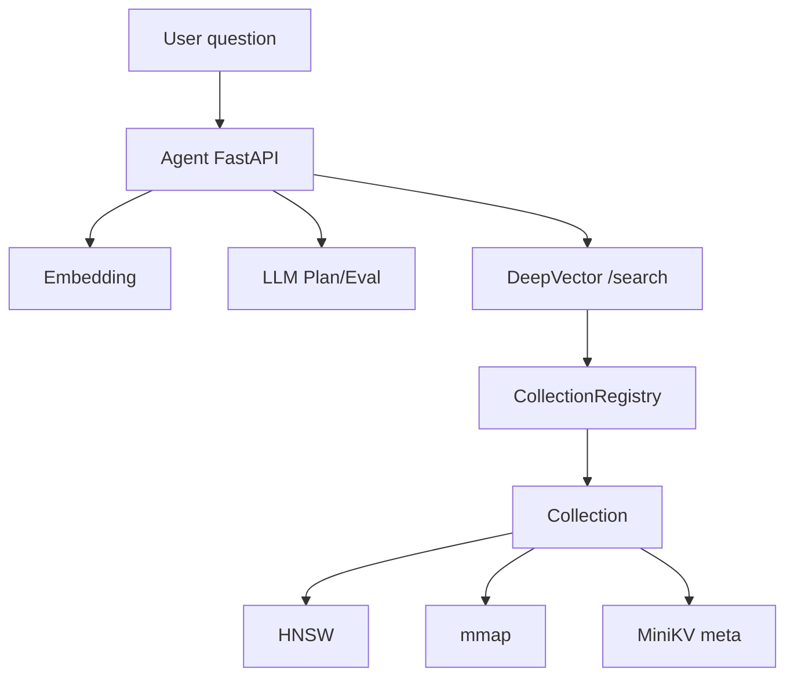

# Chapter 1 (Track B): Project Overview — First Look at the Surface

> See DeepVector = C++ engine + Python Agent in one diagram.  
> Pedagogy aligned with Hello-Agents: surface intuition first, then bricks.

## Prerequisites

> 📎 [How to use](../00_如何使用本教程_en.md) · [Build env](../prerequisites/01_构建环境配置_en.md) · [ARCHITECTURE](../../ARCHITECTURE.md)

## Objectives

- [ ] Sketch Agent(:8090) ↔ DB(:8080) topology from memory  
- [ ] State roles of HNSW / mmap / MiniKV / Registry  
- [ ] Distinguish Track A vs Track B folders (no chapter-number mix-ups)  
- [ ] Know default dim **384** must match embeddings

---

## Surface Context



---

## 1. Point — Concepts & Syntax

### Vector database
Texts → float embeddings → distance search. Exact KNN is too slow → **ANN (HNSW here)**.

### AgenticDB
A Python retrieval layer on DeepVector: plan → multi-round search → evaluate → answer (+ MCP).

### C++ include / namespace

```cpp
#include "dv/collection.h"
namespace dv { class Collection; }
```

### Python entry

```python
from agent.server import create_app
app = create_app()
```

---

## 2. Line — Wiring

Agent embeds locally → `POST /search` with `vector` + optional `collection`/`filter` → DB returns hits (often with `text`/`tags`) → LLM answers.

Contract: [`docs/openapi.yaml`](../../docs/openapi.yaml). **No `/embed` on C++.**

---

## 3. Surface — Repo Map

`deepvector/` (engine+agent), `minikv/` (LSM), `skynet/` (coroutines), `course/` (this curriculum).

---

## 4. Hands-on

1. Read ARCHITECTURE §§1–3  
2. Draw the sequence diagram without looking  
3. `curl /health` and `/metrics`

Challenge: `POST /collections` with `{"name":"demo_kb"}`.

---

## 5. Reflection

1. Why embed in Agent, not C++?  
2. What breaks if `--dim` ≠ model dimension?  
3. Why are Track A/B chapter numbers separated in the README map?

---

## 6. Interview Drills

See `INTERVIEW_BANK.md` Q-H1, Q-I2 (RAG pipeline; Faiss vs Milvus vs embedded DB).

---

## 7. References

1. [ARCHITECTURE.md](../../ARCHITECTURE.md)  
2. [TECH.md](../../TECH.md)  
3. [Hello-Agents](https://github.com/datawhalechina/hello-agents)  
4. [OpenAPI 3.0.3](https://spec.openapis.org/oas/v3.0.3)  
5. HNSW paper (Malkov & Yashunin)  
6. Code: `include/dv/server/collection_registry.h`, `agent/engine/multi_round.py`

---

## Appendix: Interview Bank Mapping

After this chapter, drill the matching section in [INTERVIEW_BANK.md](../INTERVIEW_BANK.md) and self-check against [_CHAPTER_TEMPLATE.md](../_CHAPTER_TEMPLATE.md).

**Architecture:** [ARCHITECTURE.md](../../ARCHITECTURE.md) · **Tech:** [TECH.md](../../../TECH.md) · **Run:** [RUN.md](../../../RUN.md)
