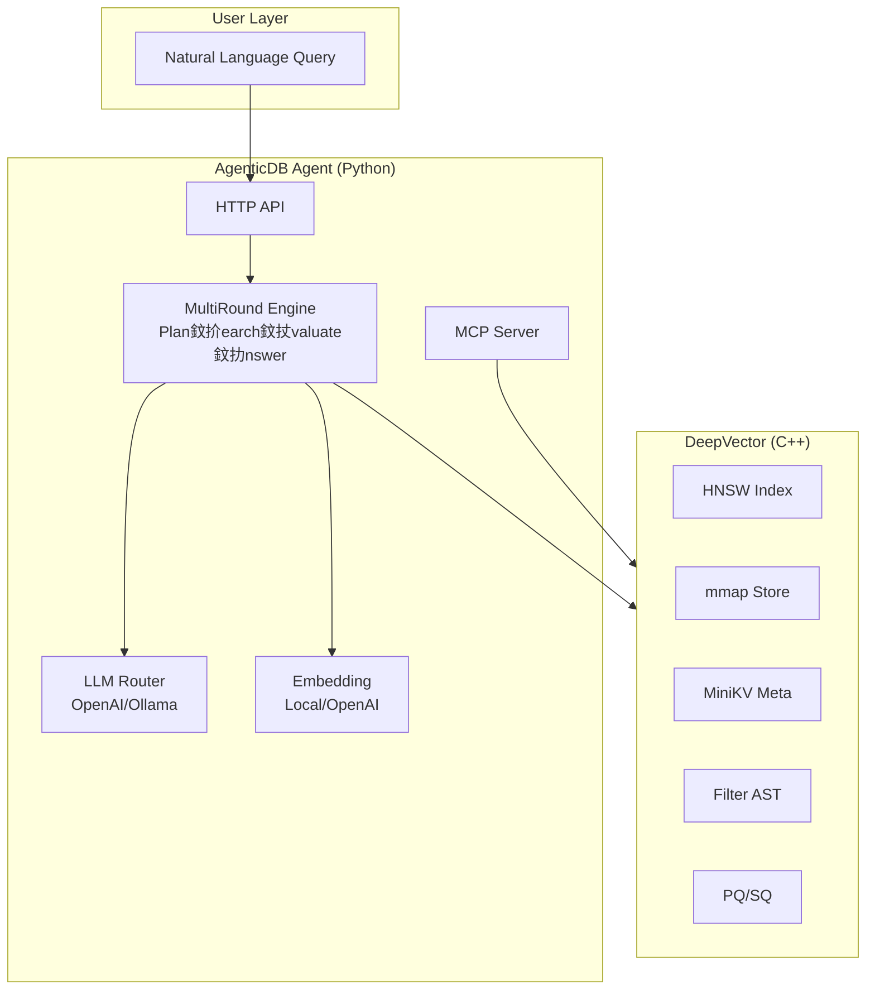

# Chapter 1: Project Overview & Architecture

> DeepVector is a C++ zero-copy vector database. AgenticDB adds an intelligent retrieval layer on top.

## Prerequisites

> 馃搸 **Reference**: [Build Environment](../prerequisites/01_鏋勫缓鐜閰嶇疆_en.md) | [Python Environment](../prerequisites/02_Python鐜_en.md)

---

## Learning Objectives

- Understand the overall architecture of DeepVector + AgenticDB
- Master the responsibilities and relationships of each module
- Understand the tech stack and design philosophy

---

## 1.1 What is AgenticDB?



AgenticDB is not a standalone project. It adds a **Python Agent layer** on top of the DeepVector C++ vector database, enabling:

| Capability | Description | Module |
|-----------|-------------|--------|
| NL Understanding | LLM analyzes question type | `QueryPlanner` |
| Strategy Planning | Choose DIRECT/FILTERED/MULTI_QUERY | `engine/strategy.py` |
| Multi-Round | Iterative result refinement | `MultiRoundEngine` |
| Quality Assessment | LLM judges result sufficiency | `ResultEvaluator` |
| Query Reformulation | Generate improved queries | `QueryReformulator` |
| MCP Integration | Standard protocol for Agent frameworks | `MCP Server` |

---

## 1.2 Project Structure

```
DeepVector/
鈹溾攢鈹€ agent/            鈫?Python Agent Layer (NEW)
鈹?  鈹溾攢鈹€ config.py         Global configuration
鈹?  鈹溾攢鈹€ llm/              LLM integration
鈹?  鈹溾攢鈹€ embedding/        Text embedding service
鈹?  鈹溾攢鈹€ engine/           Retrieval engine
鈹?  鈹溾攢鈹€ server/           HTTP server
鈹?  鈹斺攢鈹€ mcp/              MCP protocol
鈹溾攢鈹€ src/               鈫?C++ DB core
鈹?  鈹溾攢鈹€ collection.cpp    Collection API
鈹?  鈹溾攢鈹€ index/hnsw.cpp    HNSW index
鈹?  鈹溾攢鈹€ storage/          mmap storage
鈹?  鈹斺攢鈹€ server/           HTTP server
鈹溾攢鈹€ tests/             鈫?Tests
鈹?  鈹斺攢鈹€ agent/            17 agent unit tests
鈹溾攢鈹€ docs/              鈫?Documentation
鈹?  鈹溾攢鈹€ AGENTICDB.md      Architecture
鈹?  鈹溾攢鈹€ OPERATIONS.md     Operations manual
鈹?  鈹斺攢鈹€ PRODUCTION_QA.md  Interview Q&A
鈹斺攢鈹€ course/            鈫?Course (this directory)
```

---

## 1.3 Tech Stack

| Layer | Technology | Version | Purpose |
|-------|-----------|---------|---------|
| Engine | C++17 + AVX2 | g++-12 | HNSW index + mmap store |
| Network | C++20 coroutines (SkyNet) | - | HTTP server |
| Metadata | MiniKV (LSM-Tree) | - | Document metadata |
| Agent | Python 3.11+ | 3.11 | LLM orchestration |
| LLM Backend | OpenAI / Ollama | - | Model inference |
| Embeddings | sentence-transformers | 5.x | Text vectorization |
| Protocol | MCP (JSON-RPC 2.0) | 1.27 | Agent framework integration |
| Container | Docker + Compose | 24+ | Deployment |

---

## 1.4 Design Philosophy

1. **C++ for compute, Python for AI** 鈥?Vector search needs extreme perf, LLM calls are IO-bound
2. **Protocol over SDK** 鈥?Integrate via HTTP + MCP, not SDKs
3. **Quality-driven retrieval** 鈥?Quality score decides whether to continue, not fixed rounds
4. **Strategy pattern** 鈥?4 retrieval strategies, LLM chooses autonomously
5. **Provider abstraction** 鈥?Both LLM and embedding support multiple backends

---

## Review Questions

1. Why use Python for the Agent layer instead of C++? What are the trade-offs?
2. What's the difference between MCP protocol and direct HTTP API? When to use each?
3. What are the pros and cons of "quality-driven retrieval" vs. fixed top-k?

## Hands-on Exercises

1. Run `python -c "from agent.config import load_config; print(load_config())"` to see defaults
2. Read `agent/config.py` to find all overridable environment variables
3. Add a version string to `agent/__init__.py`
