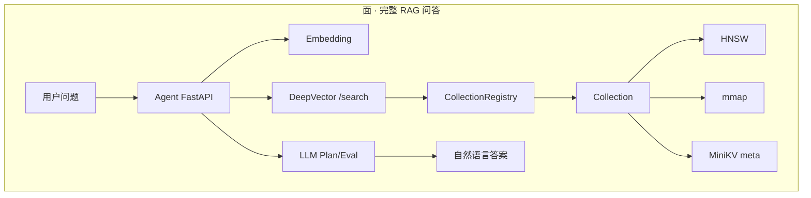
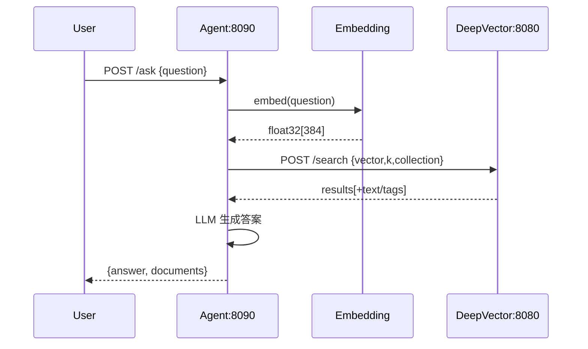

# 第一章（Track B）：项目概览与架构 · 面的第一眼

> 用一张图看清 DeepVector = C++ 引擎 + Python Agent。  
> 教学对齐 Hello-Agents：先建立「面」的直觉，再拆成可搭的积木。

## 前置知识 / Prerequisites

> 📎 [如何使用本教程](../00_如何使用本教程_zh.md) · [构建环境](../prerequisites/01_构建环境配置_zh.md) · [架构总览](../../ARCHITECTURE.md)

## 学习目标 / Objectives

- [ ] 能手绘 Agent(:8090) ↔ DB(:8080) 拓扑  
- [ ] 说出 HNSW / mmap / MiniKV / Registry 各自职责  
- [ ] 区分 Track A（引擎）与 Track B（Agent）目录，不再混章节号  
- [ ] 知道默认向量维度 **384** 与 embedding 对齐

---

## 本章在「面」上的位置 / Surface Context



你现在站在 **面** 的入口：先认识整城地图，后面每一章只造其中一块砖。

---

## 1. 点 Point — 核心概念

### 1.1 什么是向量数据库？

把文本/图片变成 **float 数组（embedding）**，用「距离」找相似项。  
精确找最近邻太慢 → 用 **ANN**（本项目：**HNSW**）。

### 1.2 什么是 AgenticDB？

不是另一个数据库，而是 DeepVector 上的 **Python 智能检索层**：

| 能力 | 模块 | 一句话 |
|------|------|--------|
| 规划 | `QueryPlanner` | 选 DIRECT / FILTERED / … |
| 多轮 | `MultiRoundEngine` | 搜 → 评 → 改写 → 再搜 |
| 嵌入 | `EmbeddingService` | 本地 MiniLM 或 OpenAI |
| 对外 | FastAPI / MCP | `/ask` 与工具协议 |

### 1.3 关键语法：命名空间与头文件（C++）

```cpp
#include "dv/collection.h"   // 注意：是 dv/ 不是旧名 lumendb/
namespace dv {
  class Collection { /* ... */ };
}
```

| 语法 | 含义 |
|------|------|
| `#include "..."` | 工程内头文件，路径相对 `include/` |
| `namespace dv` | 避免符号污染；对应目录 `include/dv/` |
| `std::unique_ptr<T>` | 独占所有权，离开作用域自动 `delete` |

### 1.4 关键语法：Python 包导入

```python
# 在 deepvector/ 目录下
from agent.server import create_app  # FastAPI app 工厂
app = create_app()
```

| 语法 | 含义 |
|------|------|
| `from x import y` | 导入子模块符号 |
| `create_app = create_fastapi_app` | 别名，兼容 `agent.server` 导出 |

---

## 2. 线 Line — 模块如何接线



**接线契约（必须记住）：**

1. Agent **负责 embedding**；C++ **不提供** `/embed`  
2. `collection` 字段进入 `CollectionRegistry::getOrCreate`  
3. insert 要带 `meta`，过滤与回答才有文本  

机器可读契约：[`docs/openapi.yaml`](../../docs/openapi.yaml)

---

## 3. 面 Surface — 仓库地图

```
hellocpp/
├── deepvector/           # 向量库 + Agent
│   ├── include/dv/       # C++ 公共 API
│   ├── src/              # 引擎实现
│   ├── agent/            # Track B 代码
│   ├── course/           # 本教程
│   └── docs/openapi.yaml
├── minikv/               # LSM（元数据）
├── skynet/               # C++20 协程网络（进阶）
├── RUN.md / TECH.md
└── docker-compose.yml
```

---

## 4. 动手实践 / Hands-on

### Lab A（必做）

1. 阅读 [`ARCHITECTURE.md`](../../ARCHITECTURE.md) 第 1–3 节  
2. 在纸上默画「Agent ↔ DB」序列图（不看稿）  
3. 启动服务后执行：

```bash
curl -s http://127.0.0.1:8080/health
curl -s http://127.0.0.1:8080/metrics | head
```

### Lab B（挑战）

用 `POST /collections` 创建 `demo_kb`，再 `GET /collections` 确认列表 ≥ 2。

---

## 5. 反思思考 / Reflection

1. 为什么把 embedding 放在 Agent 而不是 C++？各有何利弊？  
2. 若错误地把 `--dim 768` 配上 384 维模型，会在哪一层失败？  
3. Track A 与 Track B 同号章节为何不能混着读？

---

## 6. 真实面试题 / Interview Drills

> 详见 [`INTERVIEW_BANK.md`](../INTERVIEW_BANK.md) Q-H1、Q-I2。

### Q1：请画一个生产级 RAG 架构，标出 ANN 与 LLM 边界。
**要点：** 检索与生成解耦；索引可 HNSW；元数据过滤；观测。

### Q2：嵌入式向量库 vs Milvus 这类分布式系统如何选型？
**要点：** 数据规模、SLA、运维成本；本项目定位教学/嵌入式。

---

## 7. 参考文档 / References

1. [ARCHITECTURE.md](../../ARCHITECTURE.md) — 本仓库现行架构（含 Registry /metrics）  
2. [TECH.md](../../TECH.md) — 技术选型与企业验证说明  
3. [Hello-Agents](https://github.com/datawhalechina/hello-agents) — 分篇递进与毕业设计思路  
4. [OpenAPI 3.0 Spec](https://spec.openapis.org/oas/v3.0.3) — API 契约标准  
5. Malkov & Yashunin, HNSW — ANN 工业事实标准之一  
6. 本仓库源码：`include/dv/server/collection_registry.h`, `agent/engine/multi_round.py`

---

**下一章（Track B）：** [环境搭建](../ch02_setup/) · **或先走 Track A：** [环境搭建](../ch01_setup/)

---

## 附录：本章与面试题库映射

请完成本章后练习 [INTERVIEW_BANK.md](../INTERVIEW_BANK.md) 中对应分区题目，并阅读 [_CHAPTER_TEMPLATE.md](../_CHAPTER_TEMPLATE.md) 自检是否覆盖「点/线/面/动手/反思/参考」。

**全局架构：** [ARCHITECTURE.md](../../ARCHITECTURE.md) · **选型：** [TECH.md](../../../TECH.md) · **运行：** [RUN.md](../../../RUN.md)
