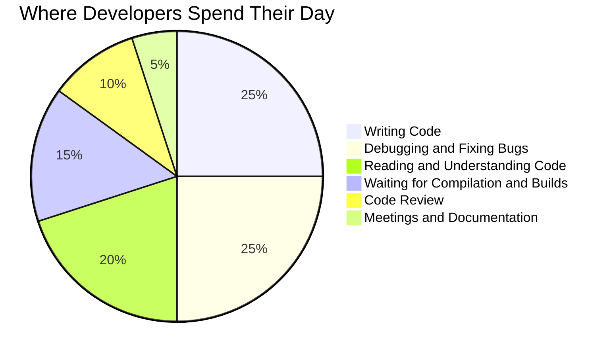
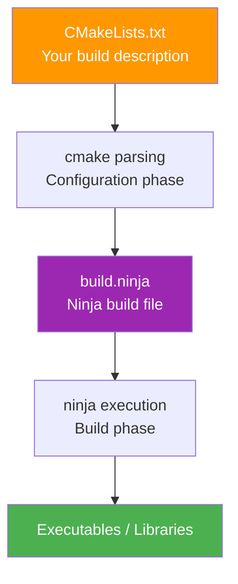

# Chapter 1: Environment Setup and First Compilation

> **Preface**: The goal of this chapter is not to make you a C++ expert, but to help you get your development environment running and understand the "why" behind each step. If you've never used a command line before, that's perfectly fine — we'll start from the most basic concepts. Think of it like learning to drive: first you need to know what the steering wheel, accelerator, and brake are, and then you can hit the road.

## Prerequisites

> 📎 **Reference**: [Build Environment Configuration](../prerequisites/01_构建环境配置_en.md) — CMake, compilers, build systems (Ninja vs Make), and compiler flags
> 📎 **Reference**: [Testing Framework](../prerequisites/04_测试框架_en.md) — CTest, GoogleTest, assertions, and test organization

---

## What is a Vector Database?

Before we write any code, let's clarify a fundamental question: **What exactly are we building?**

### A Look Back at Traditional Databases

You may have used **relational databases** like MySQL or PostgreSQL. They organize data into "rows and columns" tables and use SQL for queries. For example, to find "all users older than 25," the database performs an exact match on the `age` column — 25 is exactly 25, not a bit off.

This is called an **exact query**, which traditional databases excel at.

### But the AI Era Needs Different Queries

Since 2023, large language models (LLMs, such as GPT, Claude, Llama) have fundamentally changed software development. These models have a core ability: **turning anything into a vector**.

What is a **vector**? Simply put, it's a string of numbers. For example:

- A photo of a cat → `[0.23, -0.15, 0.87, 0.04, ...]` (possibly 1024 numbers)
- A piece of text "The weather is nice today" → `[0.12, 0.45, -0.33, 0.78, ...]` (possibly 1536 numbers)
- An audio clip → `[0.56, -0.22, 0.11, 0.93, ...]` (possibly 2048 numbers)

These number strings are called **embeddings**. They are not randomly generated — the model, after training on massive datasets, learns to map "semantically similar" things to nearby positions in the numerical space. For example, the vectors for "The weather is nice today" and "The sun is shining brightly today" would be very close, while the vector for "Quantum mechanics is very complex" would be far apart.

### The Problem Vector Databases Solve

Now here's the question: I have 100 million image vectors, a user uploads a new image, and I want to find the "10 most similar" — how do I do that?

**Brute force**: Compare the new vector against all 100 million vectors one by one. Too slow — it could take minutes.

**Vector databases** were born to solve this problem. They pre-organize these vectors into a special data structure (called an **index**) to bring search speed from O(n) down to near O(log n). It's like a library's classification system — you don't have to search the entire library for a book on machine learning; you go straight to the "Computer Science → Artificial Intelligence → Machine Learning" shelf.

### Vector Database vs Traditional Database

| | Traditional Database (MySQL) | Vector Database (DeepVector) |
|---|---|---|
| **Data** | Rows and columns (structured) | Vectors (unstructured: digital representations of images, text, audio) |
| **Query** | Exact matching (WHERE age > 25) | Similarity search (find the K vectors closest to the query vector) |
| **Index** | B+ tree, hash table | HNSW, IVF, PQ, and other Approximate Nearest Neighbor (ANN) algorithms |
| **Typical Applications** | E-commerce orders, user info | Recommendation systems, image retrieval, RAG (Retrieval-Augmented Generation) |
| **Results** | Exact, 100% correct | Approximate, but orders of magnitude faster |

**RAG** (Retrieval-Augmented Generation) is one of the hottest application scenarios today: when a user asks a question, relevant documents are first retrieved from the vector database, then both the documents and the question are fed to the LLM to generate an answer. This way the LLM won't "make things up" because it has real reference material.

And **DeepVector** is a high-performance vector database engine implemented in C++. This entire course is about understanding it, building it, and using it from scratch.

---


### Developer Time Allocation



## Learning Objectives

- Understand the roles of compilers, build systems, and package managers in the C++ ecosystem
- Set up a C++17/20 development environment (g++-12 + CMake + Ninja)
- Master how Git submodules work
- Clone and compile DeepVector and its dependencies (MiniKV, SkyNet)
- Understand the tradeoffs between static and dynamic libraries, and make informed choices
- Run test suites and understand CI/CD automation workflows
- Write your first CMake project and link DeepVector

---

## Why Use the Command Line?

You might ask: IDEs (Integrated Development Environments, like Visual Studio, VS Code) are so user-friendly now, why should I type commands in a **terminal**?

A **terminal** (also called a **command-line interface**, CLI) is a window where you type text commands to control your computer. On Windows, you might have seen PowerShell or CMD; on macOS/Linux, Bash or Zsh are common. Collectively they're called **Shells** — think of them as a "remote control" for your operating system.

There are several reasons to use the command line:

1. **Reproducibility**: A command produces the same result on anyone's machine. GUI operations are hard to document precisely in text.
2. **Automatability**: Commands can be written into scripts for CI/CD systems to execute automatically. You can't "automatically click buttons."
3. **Remote Operation**: Servers typically only have a command-line interface (no monitor or mouse), so all operations are done through the terminal.
4. **Efficiency**: Once proficient, the command line is much faster than a GUI — like typing is faster than handwriting.

> **Analogy**: A GUI is like an automatic car — easy to get started, but limited by preset gears. The command line is like a manual transmission — steeper learning curve, but you have precise control over every detail.

If you're on Windows, this course recommends using **WSL** (Windows Subsystem for Linux). It lets you run a complete Linux environment on your Windows machine, including the Linux command line and toolchain. To install: run `wsl --install` in PowerShell, then restart your computer.

---

## 1.1 Prerequisites: The C++ "Translation" Pipeline

Before you type your first command, let's understand three easily confused concepts. They form the complete pipeline from source code to executable in C++.

### C++ Compilation Flow


### An Analogy: From Recipe to Dish

Imagine you're cooking a dish:

- **Source code** = the recipe you write (humans can read it, machines can't)
- **Compiler** = the chef (turns the recipe into an actual dish)
- **Build system** = the project manager (coordinates multiple chefs, arranges the workflow, manages raw materials)
- **Library** = pre-made ingredients (someone else already made them, you just use them directly)

Now let's understand each role one by one.

### 1.1.1 What is a Compiler? (g++ vs clang++)

A **compiler** is a program that translates human-readable **source code** (`.cpp` files written in C++ syntax) into machine-readable **binary instructions** (0s and 1s that the CPU can execute directly). This process is called "compilation."

Without a compiler, your C++ code is just a pile of useless text — like writing a cookbook in Chinese, but the chef can only read English. The compiler is that "translator."

The C++ community has two mainstream compilers:

| | GCC (g++) | Clang (clang++) |
|---|---|---|
| **Full Name** | GNU Compiler Collection | Clang/LLVM |
| **Author** | GNU Project (Richard Stallman, 1987) | LLVM Project (Chris Lattner, 2007) |
| **License** | GPLv3 (copyleft, forced open-source) | Apache 2.0 (permissive) |
| **Compilation Speed** | Moderate | 20-30% faster (modular design) |
| **Error Messages** | Somewhat cryptic | World-class, with color and fix suggestions |
| **Platform** | Dominant on Linux | Default on macOS, Apple's primary investment |
| **SIMD Auto-vectorization** | Aggressive, sometimes incorrect | Conservative, more reliable |
| **Binary Size** | Slightly smaller | Slightly larger |

> **What is SIMD?** SIMD (Single Instruction, Multiple Data) is a CPU instruction that can perform the same operation on multiple data points simultaneously. For example, comparing the distances of 8 pairs of floating-point numbers at once, instead of one by one. This is key to high performance in vector databases.

You can think of the compiler as a translator: g++ is an experienced but sometimes unclear translator, while clang++ is a younger translator who gives clear error messages. Both translate C++ into the same machine language, so they're interchangeable in most projects.

**Why does DeepVector use g++?** GCC has more mature vectorization optimizations on Linux servers, with more aggressive support for AVX2/AVX-512 intrinsics (a way to directly control CPU special instructions). But you can absolutely compile with clang++ — you just need to adjust some SIMD intrinsic header file paths.

**When wouldn't you directly invoke the compiler?** When a project has multiple `.cpp` files, multiple dependency libraries, and multiple compile options, manually typing `g++ -c a.cpp b.cpp c.cpp -o myapp` becomes a nightmare. That's why build systems exist.

### 1.1.2 What Does CMake Actually Do?

**CMake** (Cross-Platform Make) is not a compiler, not a build tool — it's a **build system generator**. This distinction is very important.

Let's explain some terms first:

- **Build system**: A set of automation tools responsible for compiling source code into executables. It solves problems like: dependencies between files (A depends on B, B depends on C, so C must be compiled first), parallel compilation (multiple files compiled simultaneously to speed things up), incremental compilation (only recompiling changed files), etc.
- **Build system generator**: Not a tool that directly compiles code, but one that "generates build rules."

> **Analogy**: If the compiler is the chef and the build system is the project manager (deciding which chef does what first), then CMake is the "consultant who writes the project management plan" — it doesn't do the work itself, but the plan it produces determines who does what and in what order.

CMake's core problem to solve: **"One build description, works everywhere."**

Before CMake (before 2000), Linux projects wrote Makefiles, Windows projects wrote Visual Studio `.sln` files, macOS projects wrote Xcode projects — the same C++ code needed three sets of build files maintained separately. It's like writing a cookbook and having to translate it into Chinese, English, and Japanese versions, changing three places every time you modify a single dish.

CMake generates native build files for each platform from a single `CMakeLists.txt`, completely solving this problem.

> **Historical note**: CMake was developed by Bill Hoffman in 2000 for Kitware, with the original purpose of enabling VTK (Visualization Toolkit, a scientific visualization library) to build cross-platform. Today (2026), CMake is the de facto standard in the C++ world — even Microsoft Visual Studio natively supports CMake projects.

### CMake → Ninja Build Flow



CMake's two-phase model:

```
What you write      CMake reads       CMake generates         Build tool executes
CMakeLists.txt  →  cmake parses  →  Makefile / build.ninja  →  make / ninja  →  Executable
                 (Config phase)       (Generate phase)           (Build phase)
```

1. **Configuration phase**: `cmake -B build -G Ninja -DCMAKE_BUILD_TYPE=Release`
   - Reads `CMakeLists.txt`, detects compiler, libraries, header files
   - Parses instructions like `target_link_libraries`, `add_executable`
   - Generates `build.ninja` (or `Makefile`) in the `build/` directory

2. **Build phase**: `cmake --build build -j$(nproc)`
   - CMake invokes the actual build tool (ninja/make) to execute compilation and linking
   - Essentially a cross-platform wrapper around `ninja -C build -j$(nproc)`

### 1.1.3 Ninja: Why Is It Faster Than Make?

Before discussing Ninja, let's explain a term: **Make**.

**Make** is the oldest build tool on Unix/Linux systems (born in 1976). It reads a text file called `Makefile` and decides how to compile code based on rules in the file. For decades it was the standard for C/C++ projects. But Make has a problem: it's too slow.

**Ninja** is a build tool designed by Google engineer Evan Martin in 2010, optimized specifically for "machine-generated build files." It was designed as a "backend" for CMake and GN (Chromium's build system).

> **Analogy**: Make is like an experienced old foreman who re-reads the blueprints and re-arranges the workflow every time work begins. Ninja is like a foreman who already has the workflow memorized and just gets to work without unnecessary talk.

Why is Ninja faster than Make?

| Dimension | Make | Ninja |
|---|---|---|
| **Dependency Resolution** | Must parse variable expansion, function calls, and rule evaluation in the Makefile every build | Build files are static, fully expanded DAGs (Directed Acyclic Graphs) — zero parsing overhead |
| **Parallel Scheduling** | Coarse scheduling granularity based on rule dependency declarations | Precisely knows each task's dependencies, fuller parallelism |
| **Incremental Judgment** | Relies only on file modification time (mtime) | mtime + file content hash (more accurate) |
| **Output** | Decentralized, each Makefile outputs separately | Centralized output management, no messy progress bars |
| **Typical Cold Start** | Chromium project: ~30 seconds | Chromium project: ~3 seconds |

> **What is a DAG?** A DAG (Directed Acyclic Graph) is a data structure representing dependencies between tasks. "Directed" means there is direction (A depends on B, not B depends on A), "acyclic" means no circular dependencies (A depends on B, B depends on C, C depends on A — that would be a problem). Ninja pre-computes all dependencies and doesn't need to analyze them at execution time.

For medium-to-small projects like DeepVector (tens of thousands of lines of code), the gap between Ninja and Make might only be 1-3 seconds. But developing the habit of using Ninja will save you pain when working on large projects. It's like an automatic car — the difference in daily driving isn't much, but in complex road conditions the experience is vastly different.

---

## 1.2 Environment Preparation

### Linux (Ubuntu 22.04) / WSL2

```bash
sudo apt update
sudo apt install -y g++-12 cmake ninja-build git
```

> **What do these commands mean?**
> - `sudo`: Run command with administrator privileges (SuperUser DO)
> - `apt`: Ubuntu/Debian's **package manager**, similar to a phone's app store but operated via command line
> - `update`: Update the list of available software (doesn't install anything, just "refreshes the menu")
> - `install -y`: Install specified packages; `-y` auto-answers "yes"
> - `g++-12`: GCC compiler version 12.x
> - `cmake`: Build system generator
> - `ninja-build`: Ninja build tool (on Ubuntu the package name has a `-build` suffix)
> - `git`: Version control system

### macOS

```bash
brew install gcc@12 cmake ninja git
```

> **What is Homebrew?** Homebrew (aka brew) is the most popular package manager on macOS, similar to Ubuntu's apt. To install: run `/bin/bash -c "$(curl -fsSL https://raw.githubusercontent.com/Homebrew/install/HEAD/install.sh)"` in the terminal.

### Verification

```bash
g++-12 --version   # Should show 12.x
cmake --version    # Should show 3.16+
ninja --version    # Confirm Ninja is available
```

> **What is `--version`?** Almost all command-line tools support the `--version` parameter to display their version number. This is the standard way to confirm a tool is correctly installed.

**Why do we need g++-12 instead of the system's built-in g++?** Ubuntu 22.04's default g++ is 11.x. We need C++20 features like `std::span`, `consteval`, and coroutine headers, which are only fully supported in g++-12.

> **What are C++17 and C++20?** The C++ language is constantly evolving, releasing a new standard every few years. C++17 was released in 2017, and C++20 in 2020. Each new standard adds new features (for example, `std::span` is new in C++20, making it easier to work with arrays). DeepVector requires C++17 or above, with some advanced features needing C++20.

---

## 1.3 Cloning the Repository and Git Submodules

```bash
git clone --recurse-submodules https://github.com/Thezx-a/DeepVector.git
cd DeepVector
```

> **What is Git?** Git is the world's most popular **version control system**. It records every change you make to your code, allowing you to revert to previous versions at any time, see who changed what, and merge changes when multiple people collaborate. Without Git, collaborative development is like a group of people editing the same document simultaneously with no save history — utter chaos.

> **What is `git clone`?** `clone` means "to clone" — making a complete copy of a remote repository (like code on GitHub) onto your computer. `https://github.com/Thezx-a/DeepVector.git` is the repository's address.

### What are Git Submodules?

A **submodule** is a Git feature that allows you to reference a **specific commit** of another Git repository within a Git repository. It solves the problem: "My project depends on another library, I want to precisely control which version I use, while maintaining independent histories for both repositories."

> **Analogy**: A submodule is like a footnote citation in a book, rather than photocopying the entire referenced book. The `vendor/MiniKV/` directory actually points to a specific commit hash in the MiniKV repository, not a full copy of MiniKV's code.

```
DeepVector (main repository)
├── vendor/MiniKV  → Points to commit abc123 in the MiniKV repository
└── vendor/SkyNet  → Points to commit def456 in the SkyNet repository
```

### Why `--recurse-submodules`?

A normal `git clone` only pulls the main repository's code — the submodule directory `vendor/MiniKV/` will be empty! `--recurse-submodules` tells Git: "After cloning the main repository, recursively initialize and pull all submodules."

If you forget this parameter (one of the most common Git beginner mistakes), you can fix it later with:
```bash
git submodule update --init --recursive
```

This command does three things:
1. **`init`**: Registers submodule configuration in `.git/config`
2. **`update`**: Pulls submodule code to the specified commit
3. **`recursive`**: If submodules contain sub-submodules (nested), pulls those too — SkyNet has its own internal sub-dependencies

### Project Structure Overview

```
DeepVector/
├── include/deepvector/     # Public headers (in C++ projects, header files are "interface manuals")
│   ├── collection.h     # Core collection class: responsible for vector CRUD operations
│   ├── config.h         # Global configuration: dimension, distance metric type, etc.
│   ├── distance.h       # Distance calculation interface (supports SIMD acceleration)
│   └── hnsw.h           # HNSW index: graph edges and layer management
├── src/                 # Implementation source files (the actual "working" code)
│   ├── collection.cpp   # Collection class implementation
│   ├── distance.cpp     # Distance function scalar/SIMD implementations
│   ├── hnsw.cpp         # Complete HNSW graph construction and search logic
│   └── storage.cpp      # mmap-based persistent storage layer
├── tests/               # Test files (the "spotlight" for verifying code correctness)
│   ├── test_basic.cpp
│   ├── test_distance.cpp
│   └── test_hnsw.cpp
├── vendor/              # Third-party dependencies (managed via submodules)
│   ├── MiniKV/          # Embedded KV store (lightweight version similar to LevelDB/RocksDB)
│   └── SkyNet/          # Networking/scheduling library (async I/O and thread pool)
├── CMakeLists.txt       # Top-level build description file
└── .github/workflows/   # CI/CD automation configuration
```

> **What are header files (.h) and source files (.cpp)?** In C++, header files (`.h`) describe "what functions are available to call" (interface), while source files (`.cpp`) describe "how those functions are implemented" (implementation). It's like a restaurant menu (header file) telling you what dishes you can order, while the kitchen (source file) is where the actual cooking happens.

> **What is HNSW?** HNSW (Hierarchical Navigable Small World) is currently one of the most commonly used vector index algorithms. It organizes vectors into a multi-layer graph structure, and during search it starts from the top layer and progressively refines — like finding a room in a building: first find the right floor, then the right corridor, then the right room.

> **What is mmap?** mmap (memory-mapped file) is a mechanism provided by the operating system that lets programs access disk files as if they were memory. DeepVector uses it for persistent storage — vector data is stored on disk, but reads and writes are as fast as memory operations.

---

## 1.4 Compiling C++ Libraries and Tests

```bash
cmake -B build -G Ninja \
  -DCMAKE_BUILD_TYPE=Release \
  -DENABLE_TESTS=ON \
  -DCMAKE_CXX_COMPILER=g++-12

cmake --build build -j$(nproc)
ctest --test-dir build --output-on-failure
```

Expected output: 28 tests passed.

### What Does Each Parameter Actually Do?

**`-B build`**: Specifies the build directory as `build/`. This is "out-of-source build" — the `.o` and `.a` files produced during compilation don't pollute the source directory. This is CMake best practice.

> **What is a `.o` file?** `.o` is an **object file**, an intermediate product produced when the compiler translates a single `.cpp` file. It's not the final executable yet — all `.o` files need to be compiled first, then the **linker** "stitches" them together into a complete program.

**`-G Ninja`**: Tells CMake to generate Ninja build files (`build.ninja`) instead of the default Makefile. `-G` stands for "Generator" — you can choose from dozens of backends like `"Unix Makefiles"`, `"Visual Studio 17 2022"`, `"Xcode"`, etc.

**`-DCMAKE_BUILD_TYPE=Release`**: This is probably the most important line. It sets a CMake variable telling the compiler to enable the full suite of optimizations. What does it actually do?

| Setting | Meaning | Compiler Flags |
|---|---|---|
| `Release` | Release-level optimization | `-O2` or `-O3` (aggressive optimization), `-DNDEBUG` (removes assert), **no debug symbols** |
| `Debug` | Zero optimization, full debugging | `-O0` (no optimization, easy for step-by-step debugging), `-g` (generates debug symbols), keeps assert |
| `RelWithDebInfo` | Optimization + debug | `-O2 -g` (optimized but still debuggable, though line numbers may jump) |
| `MinSizeRel` | Size priority | `-Os` (optimizes code size over speed, suitable for embedded) |

> **What is `-O3`?** `-O3` is the compiler's "highest optimization level." It tells the compiler: "Make the code run as fast as possible by any means necessary — a slightly larger binary is fine."

Why can `-O3` make code 5-20x faster? Because the compiler enables:
- **Function inlining**: Embeds short function code directly at the call site, saving the overhead of function call push/jump/return
- **Loop unrolling**: Expands `for (i=0; i<8; i++) sum += a[i]` into 8 independent statements, reducing loop condition check overhead
- **Auto-vectorization**: Identifies loops that can be vectorized and automatically generates AVX2 instructions — this is why you get some speedup without hand-writing `_mm256_fmadd_ps`
- **Constant propagation**: If the compiler can infer that a variable must be 42, it embeds 42 directly into the instruction
- **Dead code elimination**: Removes code branches that can never be executed

**`-DENABLE_TESTS=ON`**: Activates compilation of test targets. In CMake, `-D` defines a variable, `ENABLE_TESTS` is a project-defined switch, and the CMakeLists.txt contains logic like `if(ENABLE_TESTS) add_subdirectory(tests)`.

**`-DCMAKE_CXX_COMPILER=g++-12`**: Explicitly specifies the C++ compiler. Without this parameter, CMake searches `$PATH` for the first compiler named `c++` or `g++`, which might find an older system version, making C++20 features unavailable.

> **What is `$PATH`?** `$PATH` is an **environment variable** that tells the operating system: "When you can't find a command, look in these directories." For example, when you type `g++`, the OS searches each directory listed in `$PATH` for an executable named `g++`.

### The Meaning of `-j$(nproc)`

`-j` stands for "jobs" (number of parallel tasks), and `$(nproc)` returns the number of CPU cores. `-j8` means compiling 8 source files simultaneously. On a 16-core CPU, without `-j` only 1 core is used, and compilation time can differ by over 10x.

> **Rule of thumb**: `-j$(nproc)` is the best starting point for C++ compilation. In some cases `-j$(nproc)+2` is slightly faster (utilizing I/O wait gaps), but the difference is usually less than 5%.

---

## 1.5 Build Artifacts: Static Libraries vs Dynamic Libraries

After compilation, in the `build/` directory:

```
build/
├── libdeepvector.a           # Static library (Release mode)
├── tests/
│   ├── test_basic         # Test executable (linked with libdeepvector.a)
│   ├── test_distance      # Can run directly, no additional installation needed
│   └── ...
├── vendor/
│   └── MiniKV/libminikv.a # Dependency static library
└── CMakeFiles/
```

### What is a Library?

A **library** is a packaged collection of pre-compiled `.o` object files containing reusable functions and data for other programs to link against. Libraries exist for "compile once, reuse many times" — you don't need to recompile `distance.cpp` every time; you just link `libdeepvector.a`.

> **Analogy**: A library is like a LEGO parts pack. You don't need to make each brick from scratch using sand every time — you just take them out of the pack. Someone else has already made the bricks (compiled them), and you're responsible for assembling (linking).

C++ libraries come in two forms, and understanding their difference is a fundamental skill in systems programming:

### Static Libraries (`.a` / `.lib`)

```
Static library (.a): Linked at compile time; library code is copied into the final executable

Your program → Linker extracts needed object files from libdeepvector.a → Embedded in final executable
```

**How it works**: When the linker processes `-ldeepvector`, it extracts the object files (`.o`) for functions you actually use from `libdeepvector.a` and **copies** them into the final executable. Functions that aren't called won't be included.

**Advantages**:
- **Self-contained**: The executable you distribute doesn't need `.so` files — one file runs everything
- **Simple symbol versioning**: No "can't find `libdeepvector.so.2` at runtime" problems
- **More thorough compiler optimization**: Can perform link-time optimization (LTO) across `.o` files, inlining cross-module functions

**Disadvantages**:
- **"Tare weight" problem**: If 100 programs use `libdeepvector.a`, 100 copies of DeepVector's code exist on disk — wasting disk space
- **Update hell**: When a bug is fixed in the library, all downstream programs must be recompiled
- **No shared memory**: The OS can't recognize "these 100 processes are using the same code" — there are 100 copies in physical memory too

### Dynamic Libraries (`.so` / `.dll`)

```
Dynamic library (.so): Loaded at runtime; the OS lets multiple processes share library code in the same physical memory

Program starts → Dynamic linker (ld.so) finds libdeepvector.so → Maps to process address space → Runs
```

**How it works**: At compile time, the linker only writes a reference in the executable saying "I need the `distance_l2` function from `libdeepvector.so`." At runtime, the **dynamic linker** (`ld.so`, which is itself a necessary program for starting processes on Linux) finds the `.so` file and maps it into the process's virtual address space.

> **What are `.so` and `.dll`?** `.so` (Shared Object) is the dynamic library file extension on Linux; `.dll` (Dynamic Link Library) is its Windows counterpart. Same concept, different names on different platforms.

**Advantages**:
- **Disk efficiency**: One `.so` is shared by 100 programs
- **Memory efficiency**: The OS can store only one copy of the `.so` code segment (text segment) in physical memory, shared by all processes — this is the true meaning of "shared library"
- **Hot updates**: Replace the `.so` file → restart the process → bug fixed, no need to recompile all downstream programs

**Disadvantages**:
- **Dependency hell (DLL Hell)**: A program needs `libdeepvector.so.1`, but the system only has `libdeepvector.so.2` — the program can't start. Linux's soname mechanism (`libdeepvector.so → libdeepvector.so.1 → libdeepvector.so.1.0.0` symlink chain) mitigates but doesn't eliminate this problem
- **Symbol conflicts**: Two `.so` files export C++ functions with the same name — which one gets called? The result depends on load order
- **ABI instability**: C++ doesn't have a stable ABI (Application Binary Interface). An `.so` compiled with g++-12 might not be loadable by a program compiled with g++-13 — because name mangling (the C++ compiler encodes function names into strings containing parameter types, like `_ZN7deepvector8distanceEv`) may have changed

### Why DeepVector Chose Static Libraries

1. **SIMD distribution needs**: Different CPUs support different instruction sets (AVX2, AVX-512, etc.). DeepVector generates code optimized for the current CPU at compile time based on `-march=native`. With dynamic libraries, you'd either have to compile to the lowest common denominator (losing performance) or maintain multiple `.so` variants.

2. **Single-process deployment**: Vector search is typically an embedded scenario (embedded in RAG applications), with only one process using DeepVector — no need for multi-process shared memory.

3. **Avoiding ABI compatibility issues**: Name mangling differences between C++ compilers and standard versions are a real pain. Static linking compresses this problem to compile time rather than deferring it to runtime crashes.

---

## 1.6 Your First DeepVector Program

Create `myapp/main.cpp`:
```cpp
#include <deepvector/collection.h>
#include <iostream>
#include <vector>

using namespace deepvector;

int main() {
    CollectionConfig cfg;
    cfg.dim = 3;                    // Use 3-dimensional vectors (easy to visualize)
    cfg.metric = DistanceMetric::L2; // Euclidean distance as similarity metric

    Collection coll(cfg, "./data");

    std::vector<float> v1 = {1.0f, 0.0f, 0.0f};
    std::vector<float> v2 = {0.0f, 1.0f, 0.0f};
    std::vector<float> q  = {1.0f, 0.1f, 0.0f};

    coll.add(v1.data());
    coll.add(v2.data());

    auto results = coll.search(q.data(), 2);
    for (auto& r : results) {
        std::cout << "id=" << r.id << " dist=" << r.distance << std::endl;
    }
    return 0;
}
```

> **Line-by-line explanation**:
> - `#include <deepvector/collection.h>`: Includes DeepVector's header file so the compiler knows what the `Collection` class is
> - `CollectionConfig cfg`: Creates a configuration object, setting vector dimension (dim=3) and distance metric (L2, i.e., Euclidean distance)
> - `Collection coll(cfg, "./data")`: Creates a collection, storing data in the `./data` directory
> - `coll.add(v1.data())`: Inserts vector v1 into the collection
> - `coll.search(q.data(), 2)`: Searches for the 2 vectors closest to query vector q
> - `DistanceMetric::L2`: L2 is Euclidean distance — the straight-line distance between two points. For two vectors a and b, L2 distance = sqrt((a1-b1)² + (a2-b2)² + ... + (an-bn)²)

Create `myapp/CMakeLists.txt`:
```cmake
cmake_minimum_required(VERSION 3.16)
project(MyApp LANGUAGES CXX)
set(CMAKE_CXX_STANDARD 17)
set(CMAKE_CXX_STANDARD_REQUIRED ON)

add_subdirectory(../vendor/MiniKV ${CMAKE_BINARY_DIR}/minikv)
add_executable(myapp main.cpp)
target_include_directories(myapp PRIVATE ../include)
target_link_libraries(myapp PRIVATE deepvector minikv)
```

> **Line-by-line explanation**:
> - `cmake_minimum_required(VERSION 3.16)`: Declares the minimum CMake version required
> - `project(MyApp LANGUAGES CXX)`: Defines the project name and language (CXX = C++)
> - `set(CMAKE_CXX_STANDARD 17)`: Specifies using the C++17 standard
> - `add_subdirectory(...)`: Treats MiniKV's source code as part of your own project for compilation
> - `add_executable(myapp main.cpp)`: Declares that an executable named myapp should be generated
> - `target_include_directories(...)`: Tells the compiler where to find header files (the `../include` directory)
> - `target_link_libraries(...)`: Tells the linker to link against the deepvector and minikv libraries

### CMake Dependency Approaches Compared

In CMake, there are four mainstream ways to tell a project "I need this external library." Each solves the same problem ("Where does the library code come from?"), but with completely different use cases.

| Approach | How It Works | Use Case | Drawbacks |
|---|---|---|---|
| `add_subdirectory` | Treats the subdirectory's CMakeLists.txt as part of your own project. Subdirectory targets (like the `minikv` library) can be used directly in the parent project. | Tightly coupled project groups (Monorepo, all code released together in one repository) | Must place source code inside the project; strong path coupling |
| `FetchContent` | Downloads source code from a Git URL/archive during the configuration phase, then processes it like `add_subdirectory`. `FetchContent_Declare` declares the dependency, `FetchContent_MakeAvailable` downloads and imports it. | Pulling third-party library headers or code from GitHub, like `nlohmann/json` | Requires download on first build (network-sensitive), cached thereafter. Offline environments need pre-populated cache |
| `find_package` | Searches for pre-installed libraries on the system (typically installed via `apt install libxxx-dev`). The library must provide a `FindXXX.cmake` or `XXXConfig.cmake` file. | Large system-installed libraries (Boost, OpenCV, Protobuf) | Requires pre-installation; version mismatches possible; different system configurations across developer machines |
| `ExternalProject` | Downloads and compiles external projects **at build time**, completely isolated from the main project. Similar to `FetchContent` but later in the pipeline. | Giant standalone projects (like LLVM) that you don't want mixed into the main build | Verbose syntax; target projects are ready at build time rather than configuration time |

DeepVector uses `add_subdirectory` because MiniKV and SkyNet are in the same repository and developed together with the main project — they are "source-level dependencies" rather than "binary distribution dependencies." It's like having a `utils/` subdirectory in your own project — no need to publish it as a standalone library.

---

## 1.7 CTest and GoogleTest: A Two-Layer Testing Framework

### What is CTest?

**CTest** is CMake's built-in test runner, shipped with CMake and requiring no additional installation. The question it answers is: "I have a bunch of test programs — how do I conveniently run all of them and know which passed and which failed?"

CTest doesn't provide assertions — it doesn't help you write `EXPECT_EQ(x, 5)`. It only handles:
1. Discovering tests (from `add_test` instructions in CMakeLists.txt)
2. Running tests (can be parallel)
3. Collecting results (pass/fail/timeout/skip statistics)
4. Integrating with CI (generating JUnit XML reports for GitHub Actions/GitLab CI to parse)

Registering tests in `CMakeLists.txt`:
```cmake
enable_testing()                     # Enable CTest functionality
add_executable(test_basic tests/test_basic.cpp)
target_link_libraries(test_basic PRIVATE deepvector)
add_test(NAME basic_test COMMAND test_basic)  # Register as "basic_test"
```

Common CTest commands:
```bash
ctest --test-dir build -N              # List all tests without running (dry run)
ctest --test-dir build -R distance     # Only run tests matching "distance"
ctest --test-dir build --rerun-failed  # Only re-run previously failed tests
ctest --test-dir build -j4             # Run 4 tests in parallel
ctest --test-dir build --output-on-failure # Print full output on failure
```

### What is GoogleTest? (gtest)

**GoogleTest** (aka gtest) is a C++ unit testing framework developed by Google, providing rich assertion macros and test organization structures. The question it answers is: "How do I express 'I expect this function to return 42'?"

```cpp
#include <gtest/gtest.h>

TEST(DistanceTest, L2IdenticalVectors) {
    float a[] = {1.0f, 2.0f, 3.0f};
    float b[] = {1.0f, 2.0f, 3.0f};
    EXPECT_FLOAT_EQ(l2_distance(a, b, 3), 0.0f);
    //      ^-- Use EXPECT_FLOAT_EQ instead of EXPECT_EQ for floating-point comparison,
    //          because floats have rounding errors and can't use exact equality
}

TEST(DistanceTest, L2DifferentVectors) {
    float a[] = {0.0f, 0.0f};
    float b[] = {3.0f, 4.0f};
    EXPECT_FLOAT_EQ(l2_distance(a, b, 2), 5.0f);  // 3-4-5 right triangle
}
```

> **What is an assertion?** An assertion is a "checkpoint" in a test — you tell the test framework: "I expect this condition to be true; if it's false, mark the test as failed." For example, `EXPECT_FLOAT_EQ(x, 5.0f)` means "I expect x to equal 5.0; if it doesn't, the test fails."

> **What is `TEST(DistanceTest, L2IdenticalVectors)`?** This is a GoogleTest macro (a preprocessor directive that expands into a large block of code). The first parameter `DistanceTest` is the **test suite** (equivalent to a "group"), and the second parameter `L2IdenticalVectors` is the **test case** (a specific test).

### The Relationship Between CTest and GoogleTest

```
GoogleTest (gtest)     ← Write test logic: EXPECT_EQ, ASSERT_TRUE, TEST(...)
       ↓
CTest                  ← Run and manage: discover, parallelize, summarize, CI integration
```

> **Analogy**: GoogleTest is the **grading standard** for an exam (how each question is scored), while CTest is the **exam room arrangement** (who sits where, when to start, how to tally scores). They work together: gtest provides assertions like `EXPECT_EQ` and `ASSERT_TRUE`, while CTest provides test discovery, parallel scheduling, and CI integration.

---

## 1.8 CI/CD and GitHub Actions

### What is CI/CD?

**CI/CD** consists of three related but different concepts:

- **CI (Continuous Integration)**: Automatically compile and run tests after every code commit. It solves the problem of "it works on my machine" — CI ensures it works on others' machines too. Typical flow: `push → compile → test → report results`
- **CD (Continuous Delivery)**: Automatically package releasable artifacts after each CI pass. Typical flow: `CI passes → compile Release version → package .tar.gz`
- **CD (Continuous Deployment)**: Automatically deploy new versions to production. As a library, DeepVector doesn't directly use this step, but applications depending on DeepVector might.

> **Analogy**: CI/CD is like a factory assembly line. The traditional way is workers manually moving parts from station A to station B. CI/CD is an automated conveyor belt — once code is pushed, compilation, testing, and packaging are fully automated, and any step that fails triggers a red flag.

### Why GitHub Actions?

**GitHub Actions** is GitHub's built-in CI/CD service (launched in 2019), running directly in your GitHub repository. Configuration is written in YAML files under the `.github/workflows/` directory. Compared to external services like Jenkins, Travis CI, and CircleCI, GitHub Actions' advantage is zero-configuration integration — no need to link third-party services to your GitHub account; code is automatically built and tested upon push.

DeepVector's `.github/workflows/ci.yml` defines the automated testing workflow:

```yaml
name: CI                         # Workflow name, displayed on the GitHub Actions page
on: [push, pull_request]         # Triggers: any push or PR
jobs:
  build-and-test:
    strategy:
      matrix:                    # Matrix strategy: automatically generates all combinations
        os: [ubuntu-22.04, ubuntu-24.04]        # 2 OSes
        build_type: [Release, Debug]            # 2 build modes
      # Total 2×2 = 4 parallel jobs
    runs-on: ${{ matrix.os }}
    steps:
      - uses: actions/checkout@v4              # Official Action: pull code
        with:
          submodules: recursive                 # Pull submodules too
      - name: Configure
        run: cmake -B build -G Ninja -DCMAKE_BUILD_TYPE=${{ matrix.build_type }} -DENABLE_TESTS=ON
      - name: Build
        run: cmake --build build -j$(nproc)
      - name: Test
        run: ctest --test-dir build --output-on-failure
```

The beauty of this **matrix strategy** is: you write the configuration once, and CI automatically generates 4 parallel jobs to verify across two operating systems and two build modes — ensuring the code compiles on both older Ubuntu 22.04 and latest Ubuntu 24.04; runs correctly in zero-optimization Debug mode (catching uninitialized variables, wild pointers, etc.) and in aggressively optimized Release mode (catching logic errors introduced by optimization, like the compiler "optimizing away" undefined behavior).

Every push triggers this workflow, and GitHub displays a green checkmark (✓) or red cross (✗) on the page to tell you whether your code passed all tests.

> **What is a pull_request (PR)?** A PR is Git's collaboration feature. When you've made changes on your own branch and want to merge into the main branch, you can create a PR — like submitting a "merge application" for others to review your changes, confirming everything is fine before merging.

---

## Knowledge Checklist
- [ ] What is a vector database? Why is it needed in the AI era?
- [ ] What is a compiler? Core differences between g++ and clang++
- [ ] CMake's role: build system generator, not the build tool itself
- [ ] Ninja vs Make: why Ninja is faster due to static dependency resolution
- [ ] CMake's two-phase model: configure (generate) → build (execute)
- [ ] Compiler optimizations enabled by `-DCMAKE_BUILD_TYPE=Release`: -O3, -DNDEBUG, inlining, vectorization
- [ ] Differences between static libraries (.a) and dynamic libraries (.so): pros, cons, and use cases
- [ ] Why DeepVector chose static libraries: SIMD distribution, single-process, ABI stability
- [ ] Four CMake dependency approaches: add_subdirectory, FetchContent, find_package, ExternalProject
- [ ] Git submodule principle: references to specific commits, not code copies
- [ ] Division of labor between CTest (test runner and scheduler) and GoogleTest (assertion framework)
- [ ] CI/CD concepts: continuous integration, continuous delivery, continuous deployment
- [ ] How GitHub Actions matrix strategy generates multi-platform, multi-configuration test coverage

---

## Discussion Questions

1. Why did DeepVector choose static libraries over dynamic libraries? Would this choice still hold if DeepVector were shared by 50 microservices?
   > Hint: Consider SIMD instruction variants, deployment simplicity, ABI stability, and the benefits of multi-process shared memory

2. What are the pros and cons of `add_subdirectory(vendor/MiniKV)` vs `FetchContent`? Under what circumstances would you switch from one to the other?
   > Hint: Consider offline builds, version pinning, incremental compilation, CI caching

3. If you change `CMAKE_BUILD_TYPE` to Debug, how much would performance drop? Why? Run `perf stat` to compare in practice.
   > Hint: `-O0` vs `-O3`, and which optimizations are disabled in Debug mode (inlining, vectorization, loop unrolling, constant folding)

4. What are the benefits of Git submodules' "pinned commit" feature? If MiniKV pushes a breaking change to the `main` branch, would DeepVector be automatically affected?
   > Hint: Submodules only track specific commit SHAs, not the latest state of branches

---

## Hands-on Exercises

1. Modify the example program to insert 100 random 3-dimensional vectors and search for the nearest 5. Measure search time using `time` or `std::chrono`.

2. Compare compilation time and runtime between Debug and Release modes. Using 1000 searches as a benchmark, calculate the speedup ratio.

3. Link DeepVector into your own CMake project, using the `FetchContent` approach to simulate pulling from GitHub.

4. Write a shell script that automatically: pulls code → configures → compiles → runs tests → summarizes results. Add this script to your GitHub CI workflow.

5. Add a `clang++` build matrix entry to the CI configuration to verify that DeepVector also compiles with clang++.
