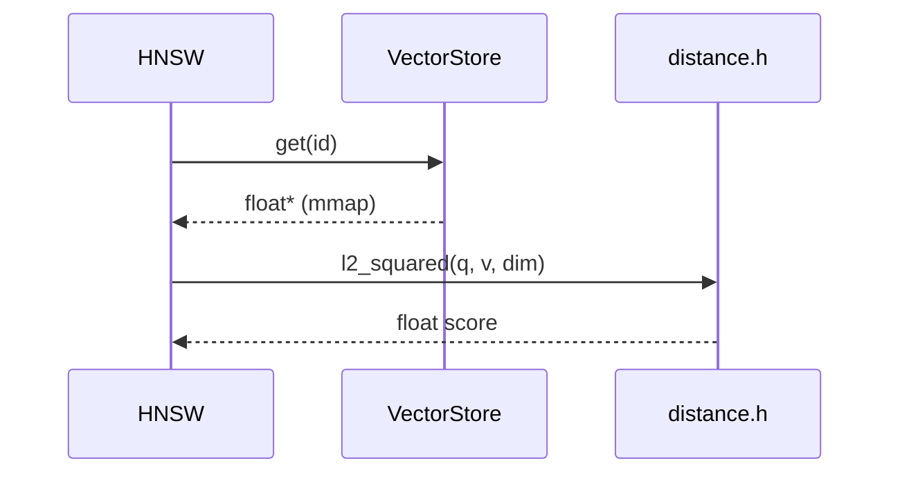

# 第二章（Track A）：向量与距离度量 · 从「点」造第一块砖

> 向量数据库的一切搜索，最终都落成一次次距离计算。  
> 本章把公式、C++ 语法、SIMD 指令拆开讲清楚，再接到 HNSW。

## 前置知识

> 📎 [如何使用](../00_如何使用本教程_zh.md) · [距离预备](../prerequisites/05_向量距离度量_zh.md) · [SIMD 预备](../prerequisites/06_SIMD与硬件优化_zh.md)

## 学习目标

- [ ] 手写标量版 `l2_squared` / `inner_product` / `cosine`  
- [ ] 解释为何排序可用 **平方 L2**（省 `sqrt`）  
- [ ] 读懂 `#ifdef __AVX2__` 与 `_mm256_fmadd_ps`  
- [ ] 知道 Cosine 在本项目为何偏标量路径  

---

## 本章在「面」上的位置


距离函数是 HNSW 里被调用最频繁的「点」。

---

## 1. 点 Point — 公式与语法

### 1.1 三个度量（公式）

设 \(x,y \in \mathbb{R}^d\)：

| 名称 | 公式 | 本项目实现要点 |
|------|------|----------------|
| L2 平方 | \(\sum_i (x_i-y_i)^2\) | 比较大小时不必 `sqrt` |
| 内积（作距离） | \(-\sum_i x_i y_i\) | 取负以适配「越小越好」 |
| Cosine 距离 | \(1 - \frac{x\cdot y}{\|x\|\|y\|}\) | 需两个范数 |

### 1.2 C++ 语法精讲：原始指针与循环

```cpp
inline float l2_squared_scalar(const float* a, const float* b, Dimension d) {
    float sum = 0.f;
    for (Dimension i = 0; i < d; ++i) {
        float diff = a[i] - b[i];
        sum += diff * diff;
    }
    return sum;
}
```

| 语法元素 | 含义 |
|----------|------|
| `const float*` | 指向只读 float 的指针；向量首地址 |
| `Dimension` | 项目类型别名，本质是维度整数 |
| `inline` | 提示编译器内联，降低调用开销 |
| `0.f` | `float` 字面量（相对 `0.0` 双精度） |
| `for (Dimension i = 0; i < d; ++i)` | 经典索引循环；`++i` 避免可能的临时副本习惯 |

### 1.3 语法精讲：条件编译与 AVX2

```cpp
#ifdef __AVX2__
#include <immintrin.h>
// 一次处理 8 个 float
__m256 va = _mm256_loadu_ps(a + i);   // 未对齐加载
__m256 vb = _mm256_loadu_ps(b + i);
__m256 vd = _mm256_sub_ps(va, vb);
sum = _mm256_fmadd_ps(vd, vd, sum); // sum += vd*vd
#endif
```

| 语法 / API | 含义 |
|------------|------|
| `#ifdef __AVX2__` | 仅当编译器定义了 AVX2 宏时编译该分支 |
| `__m256` | 256-bit 寄存器类型，装 8×float |
| `_mm256_loadu_ps` | 从可能未对齐地址加载（安全但略慢于 aligned） |
| `_mm256_fmadd_ps` | Fused Multiply-Add：一次算 `a*b+c`，更准更快 |

编译开关（CMake）：`-mavx2 -mfma`（见根/`deepvector` CMake `USE_AVX2`）。

### 1.4 源码位置

`include/dv/index/distance.h` — 头文件即实现（header-only），便于内联进 HNSW。

---

## 2. 线 Line — 如何接到 HNSW

HNSW 在扩展候选邻居时反复调用：

```text
dist = metric(query, getVector(candidateId))
```

接线约定：

1. `CollectionConfig.metric` 选择 L2 / IP / Cosine  
2. `VectorStore::get(id)` 返回 `const float*`（mmap 区）  
3. **禁止**在可能 `grow()` 的插入过程中长期缓存该指针  

数据流：



---

## 3. 面 Surface — 对整系统的影响

| 场景 | 距离选择 | 注意 |
|------|----------|------|
| sentence-transformers 文本 | Cosine / IP（常先归一化） | 默认 dim=384 |
| 图像特征未归一化 | L2 | 可用 squared |
| 量化 PQ 粗筛 | 近似距离表 | 见 Track A7 |

错误维度 → 未定义行为或垃圾分数 → `/search` 结果异常。故 **Agent embedding dim == server `--dim`**。

---

## 4. 动手实践

### Lab A（必做）

在 `tests/test_distance.cpp` 风格下写断言：

1. 相同向量 L2 平方为 0  
2. Cosine(相同单位向量) 距离接近 0  

运行：`ctest` 或单独跑 `deepvector_tests`。

### Lab B（挑战）

对比标量 vs AVX2（Release）在 d=384、N=10^5 次调用的耗时；记录加速比。

---

## 5. 反思思考

1. 为什么 Top-K 用平方 L2 不会改排序？  
2. `_mm256_load_ps` 与 `loadu` 区别？未对齐会怎样？  
3. 若所有向量已 L2 归一化，Cosine 与 IP 关系是什么？

---

## 6. 真实面试题

> [`INTERVIEW_BANK.md`](../INTERVIEW_BANK.md) Q-A1, Q-A2；长问答见 `INTERVIEW_QA.md` Q9–Q14。

### Q1：生产环境为何常用 Cosine 做文本检索？
**要点：** 文本 embedding 重方向；归一化后实现可简化为 IP。

### Q2：SIMD 加速距离计算的瓶颈可能在哪？
**要点：** 内存带宽、未归一化 Cosine 的额外范数、随机访问向量不连续。

---

## 7. 参考文档 / References

1. Intel Intrinsics Guide — `_mm256_fmadd_ps` 等（官方）  
2. `man`/教材 — 浮点与 FMA 误差  
3. 本仓库：`include/dv/index/distance.h`, `tests/test_distance.cpp`  
4. prerequisites：`05_向量距离度量_*`, `06_SIMD与硬件优化_*`  
5. Faiss 文档中关于 metric type 的说明（Meta Faiss）  
6. [`TECH.md`](../../../TECH.md) — 为何坚持 float32 + 三度量

---

**下一章：** [HNSW 近似搜索](../ch03_hnsw_theory/) （把本砖嵌进图索引）

---

## 附录：本章与面试题库映射

请完成本章后练习 [INTERVIEW_BANK.md](../INTERVIEW_BANK.md) 中对应分区题目，并阅读 [_CHAPTER_TEMPLATE.md](../_CHAPTER_TEMPLATE.md) 自检是否覆盖「点/线/面/动手/反思/参考」。

**全局架构：** [ARCHITECTURE.md](../../ARCHITECTURE.md) · **选型：** [TECH.md](../../../TECH.md) · **运行：** [RUN.md](../../../RUN.md)
