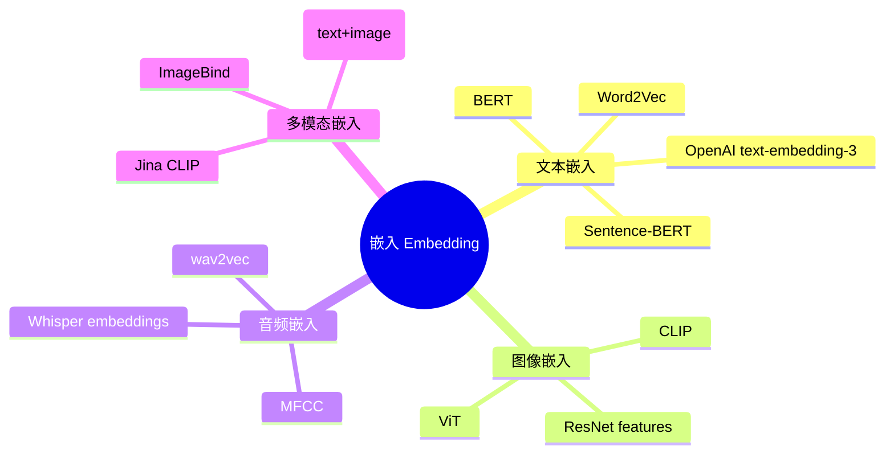
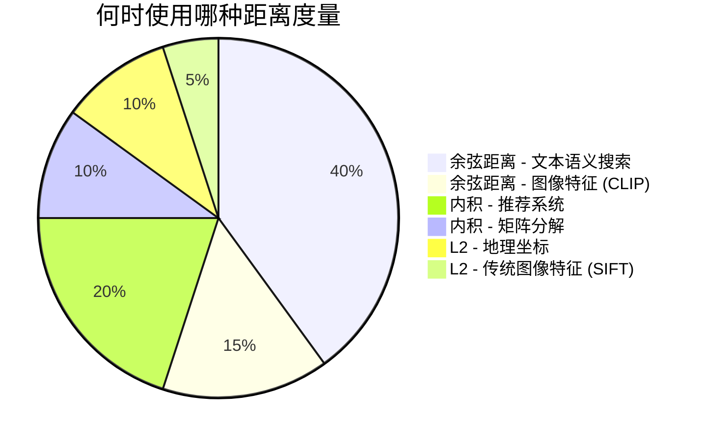

# 第二章：向量基础与距离度量

## 前置知识

> 📎 **参考**: [向量距离度量](../prerequisites/05_向量距离度量.md)
> 📎 **参考**: [SIMD 与硬件优化](../prerequisites/06_SIMD与硬件优化.md)

---

## 学习目标
- 理解嵌入（embedding）的起源、原理和为什么能用于搜索
- 掌握 L2、内积、余弦三种距离度量的数学直觉及适用场景
- 理解 CPU 寄存器、SIMD 指令集和 FMA 的硬件原理
- 认识"内存墙"——为什么向量搜索的真正瓶颈不是计算
- 动手实现 AVX2 加速的距离函数，对比标量和向量化的性能差距

---

## 2.1 为什么需要向量？——让计算机理解"意义"

### 2.1.1 计算机的"文盲"困境

让我们从一个根本问题开始：**计算机能理解文字吗？**

答案是：**完全不能**。你输入"这只猫很可爱"，计算机看到的只是一串数字编码——在 UTF-8 编码下，这五个汉字是 `E8 BF B9 E5 8F AA E7 8C AB E5 BE 88 E5 8F AF E7 88 B1` 这样的十六进制字节序列。计算机不知道"猫"和"狗"有关系，不知道"可爱"是褒义词，更不知道一张猫的图片和"猫"这个字说的是同一件事。

同样的问题存在于图片、音频、视频——计算机只看到像素值、波形采样点、帧序列，完全不懂其中的"含义"。

**这带来一个巨大的工程难题**：搜索引擎想要找到"和查询语义相似的结果"，推荐系统想要找到"和用户兴趣匹配的内容"——但计算机根本无法衡量"语义相似"。

### 嵌入类型全景



### 2.1.2 嵌入（Embedding）：给"意义"一个数字地址

**嵌入**（embedding）是一种将离散对象（文字、图片、音频、代码、甚至蛋白质序列）映射到**连续向量空间**的技术。核心思想是：训练一个数学模型，让它学会把每个离散对象转换成一个向量，并且使得**语义上相似的对象在向量空间中彼此靠近**。

```
"猫"   → [0.12, -0.34, 0.56, 0.89, -0.21, ..., 0.78]  (768 个浮点数)
"狗"   → [0.11, -0.32, 0.55, 0.87, -0.19, ..., 0.79]  (L2距离 ≈ 0.04 — 几乎重叠!)
"汽车" → [-0.45, 0.67, -0.23, 0.11, 0.52, ..., 0.01]  (L2距离 ≈ 1.52 — 很远)
```

### 文本到向量的转换流程


### 2.1.3 嵌入技术简史：从词袋到大模型

| 年代 | 技术 | 核心思想 | 局限 |
|---|---|---|---|
| 1970s | **TF-IDF** | 词频×逆文档频 | 稀疏向量，无法捕捉语义 |
| 2013 | **Word2Vec** | 用浅层神经网络预测上下文 | 只能处理单词级别 |
| 2018 | **BERT** | 深度 Transformer 预训练 | 单句 BERT 向量做语义搜索效果不如预期 |
| 2019 | **Sentence-BERT** | 孪生网络结构，专门训练句子级向量 | 现代向量搜索的真正起点 |
| 2024 | **OpenAI text-embedding-3** | 大规模对比训练 + 模型蒸馏 | 闭源模型 |
| 2024+ | **多模态嵌入**（CLIP, Jina CLIP） | 文本和图片使用同一嵌入空间 | 可以跨模态搜索 |

---

## 2.2 三种距离度量：如何定义"相似"

距离度量的详细数学定义和选择指南见 [向量距离度量](../prerequisites/05_向量距离度量.md)。本节聚焦于**直觉理解和实用建议**。

### 距离度量适用场景



**实际建议**：
- **文本搜索**：大多数情况下用余弦距离（或归一化后的内积）。因为文档长度不应该影响语义判断。
- **推荐系统**：用内积。因为用户对物品的评分本身就编码了"强度"信息。
- **图像特征**：如果使用 CLIP 等多模态模型，通常用余弦距离。

| 度量 | 对模长敏感 | 值域 | 典型使用方 |
|---|---|---|---|
| L2 | 是 | [0, +∞) | FAISS, Annoy |
| Inner Product | 极敏感 | (-∞, +∞) | 推荐系统, Cohere |
| Cosine | 否 | [0, 2] | OpenAI, Sentence-BERT |

**归一化与内积的等价关系**：如果对所有向量做 L2 归一化，那么 $d_{L2\_squared}(a,b) = 2 - 2 \cdot (a \cdot b)$。这就是为什么许多系统在输出嵌入前就做了归一化。

---

## 2.3 SIMD：一条指令操作多个数据

SIMD 的详细硬件原理见 [SIMD 与硬件优化](../prerequisites/06_SIMD与硬件优化.md)。本节聚焦于**向量搜索中的 SIMD 应用**。

### 2.3.1 x86 SIMD 五代演进

| 指令集 | 寄存器宽度 | 一次处理 float | 代表 CPU |
|---|---|---|---|
| SSE | 128 bit | 4 | Pentium III |
| AVX | 256 bit | 8 | Sandy Bridge |
| AVX2 + FMA | 256 bit | 8（+ 熔合乘加） | Haswell |
| AVX-512 | 512 bit | 16 | Skylake-X |

### 2.3.2 AVX-512 的降频问题

Intel 早期 AVX-512 实现：当 CPU 执行 512-bit SIMD 指令时，为了防止过热会自动降低核心频率。如果程序只有 50% 的指令是 AVX-512，整体可能反而更慢。DeepVector 默认使用 AVX2，将 AVX-512 作为可选的编译选项（`-DENABLE_AVX512=ON`）。

---

## 2.4 内存墙：为什么带宽比计算更致命

### 以 768 维 float 向量暴力搜索 100 万个向量为例

- 每个向量大小：768 × 4 bytes = 3 KB
- 100 万个向量总大小：约 3 GB
- DDR4-3200 单通道内存带宽：~25 GB/s
- 每秒最多能加载的向量数：~830 万个
- 纯计算时间：~2 毫秒（800 GFLOPS）
- 受限于内存带宽：~0.12 秒

**结论：这个场景是内存带宽瓶颈而不是计算瓶颈**。这就是为什么量化（PQ）、近邻图索引（HNSW）和裁剪/剪枝的本质思想都是同一个：**减少需要从内存搬运到 CPU 寄存器的数据量**。

---

## 2.5 动手实现：完整距离计算器

下面是一个完整的可编译程序，实践本章的所有概念。在 `ch02_vectors_distance/code/distance.cpp` 实现：

```cpp
#include <cmath>
#include <vector>
#include <iostream>
#include <chrono>
#include <random>
#include <immintrin.h>  // AVX 内在函数

// 任务 1：标量 L2 平方距离
float l2_squared(const float* a, const float* b, size_t dim) {
    float sum = 0.0f;
    for (size_t i = 0; i < dim; i++) {
        float diff = a[i] - b[i];
        sum += diff * diff;
    }
    return sum;
}

// 任务 2：标量内积距离（带负号，保持"越小越相似"的约定）
float ip_distance(const float* a, const float* b, size_t dim) {
    float sum = 0.0f;
    for (size_t i = 0; i < dim; i++) {
        sum += a[i] * b[i];
    }
    return -sum;
}

// 任务 3：标量余弦距离
float cosine_distance(const float* a, const float* b, size_t dim) {
    float dot = 0.0f, norm_a = 0.0f, norm_b = 0.0f;
    for (size_t i = 0; i < dim; i++) {
        dot += a[i] * b[i];
        norm_a += a[i] * a[i];
        norm_b += b[i] * b[i];
    }
    float denom = std::sqrt(norm_a) * std::sqrt(norm_b);
    if (denom < 1e-9f) return 1.0f;
    return 1.0f - dot / denom;
}

// 任务 4：AVX2 + FMA 加速的内积距离
float ip_distance_avx2(const float* a, const float* b, size_t dim) {
    __m256 sum = _mm256_setzero_ps();
    size_t i = 0;

    for (; i + 8 <= dim; i += 8) {
        __m256 va = _mm256_loadu_ps(a + i);
        __m256 vb = _mm256_loadu_ps(b + i);
        sum = _mm256_fmadd_ps(va, vb, sum);
    }

    float result = 0.0f;
    float buf[8];
    _mm256_storeu_ps(buf, sum);
    for (int j = 0; j < 8; j++) result += buf[j];

    for (; i < dim; i++) {
        result += a[i] * b[i];
    }

    return -result;
}

int main() {
    const size_t DIM = 1024;
    const size_t N = 100000;

    std::mt19937 rng(42);
    std::uniform_real_distribution<float> dist(-1.0f, 1.0f);

    std::vector<float> va(DIM), vb(DIM);
    for (size_t i = 0; i < DIM; i++) {
        va[i] = dist(rng);
        vb[i] = dist(rng);
    }

    std::cout << "=== Correctness Check ===" << std::endl;
    std::cout << "L2 squared: " << l2_squared(va.data(), vb.data(), DIM) << std::endl;
    std::cout << "IP (scalar): " << ip_distance(va.data(), vb.data(), DIM) << std::endl;
    std::cout << "IP (AVX2):   " << ip_distance_avx2(va.data(), vb.data(), DIM) << std::endl;
    std::cout << "Cosine:      " << cosine_distance(va.data(), vb.data(), DIM) << std::endl;

    std::cout << "\n=== Performance (" << N << " iterations x " << DIM << " dims) ===" << std::endl;
    {
        auto t0 = std::chrono::high_resolution_clock::now();
        volatile float sink = 0;
        for (size_t i = 0; i < N; i++)
            sink += ip_distance(va.data(), vb.data(), DIM);
        auto t1 = std::chrono::high_resolution_clock::now();
        auto us = std::chrono::duration_cast<std::chrono::microseconds>(t1 - t0).count();
        std::cout << "Scalar: " << us / 1000.0 << " ms" << std::endl;
    }
    {
        auto t0 = std::chrono::high_resolution_clock::now();
        volatile float sink = 0;
        for (size_t i = 0; i < N; i++)
            sink += ip_distance_avx2(va.data(), vb.data(), DIM);
        auto t1 = std::chrono::high_resolution_clock::now();
        auto us = std::chrono::duration_cast<std::chrono::microseconds>(t1 - t0).count();
        std::cout << "AVX2:   " << us / 1000.0 << " ms" << std::endl;
    }

    return 0;
}
```

**编译与运行**：
```bash
g++-12 -O3 -mavx2 -mfma -std=c++17 distance.cpp -o distance
./distance
```

> **`-mavx2 -mfma`**：告诉编译器"目标 CPU 支持 AVX2 和 FMA 指令"。

预期结果：AVX2 版本比标量版本快约 4-7 倍。如果数据来自主存，加速比会缩小到 1.5-2 倍（因为内存带宽成为瓶颈）。

---

## 思考题

1. 为什么内积距离要加负号？如果去掉负号，HNSW 的贪心搜索逻辑会发生什么？
2. AVX-512 比 AVX2 理论上快 2 倍，为什么实际加速比可能远低于 2？
3. 在什么条件下，内存带宽瓶颈的结论会不成立？

---

## 动手练习

1. 实现三种距离函数的标量版本，用已知的简单向量测试正确性。
2. 分别在 DIM = 64、128、256、512、1024 下对比 AVX2 和标量的吞吐量。
3. 改进 AVX2 的水平求和：使用 `_mm256_hadd_ps` 或 `_mm256_permute2f128_ps` 实现纯寄存器的水平求和。
4. 用 `perf stat -e cache-misses,cache-references ./distance` 统计缓存未命中率。
