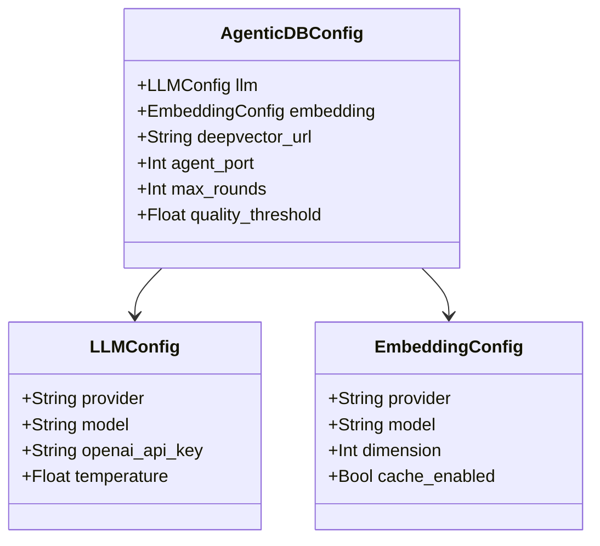

# Chapter 3: Configuration System

> AgenticDB configuration management — from dataclass to environment variables.

## Prerequisites

> 📎 **Reference**: [Python Environment](../prerequisites/02_Python环境_en.md)

---

## Learning Objectives

- Understand the three-layer `AgenticDBConfig` structure
- Master the environment variable override mechanism
- Learn to configure the system for different scenarios

---

## 3.1 Configuration Architecture



Three-layer nested dataclass structure:

| Layer | Class | Responsibility |
|-------|-------|---------------|
| Top | `AgenticDBConfig` | Global: server address, retrieval params |
| Sub | `LLMConfig` | LLM: provider, model, API key |
| Sub | `EmbeddingConfig` | Embedding: model, dimension, cache |

---

## 3.2 Default Values

Defaults are designed for "zero-cost out-of-box" — local Ollama + local embeddings.

---

## 3.3 Environment Variable Override

Every config field can be overridden via env vars:

```bash
# OpenAI mode
export AGENTICDB_LLM_PROVIDER=openai
export OPENAI_API_KEY=sk-xxx
python -m agent.server.app

# Local mode (default)
python -m agent.server.app
```

---

## 3.4 Runtime Configuration

```python
from agent.config import AgenticDBConfig, LLMConfig, EmbeddingConfig

config = AgenticDBConfig(
    llm=LLMConfig(provider="openai", model="gpt-4o-mini"),
    embedding=EmbeddingConfig(provider="openai"),
    max_rounds=2,
    quality_threshold=0.5,
)
```

---

## Review Questions

1. Compare env-var overrides vs. config files (YAML/TOML). Pros and cons?
2. If adding a new LLM provider (e.g., Anthropic Claude), what's the minimal code change?
3. How does setting `quality_threshold` to 0.3 vs. 0.9 change behavior?

## Hands-on Exercises

1. Add `retry_count: int = 3` to `LLMConfig` with env var support
2. Create a `.env` file loader for configuration
3. Write a `print_config.py` script that shows the effective configuration

---

## Appendix: Interview Bank Mapping

After this chapter, drill the matching section in [INTERVIEW_BANK.md](../INTERVIEW_BANK.md) and self-check against [_CHAPTER_TEMPLATE.md](../_CHAPTER_TEMPLATE.md).

**Architecture:** [ARCHITECTURE.md](../../ARCHITECTURE.md) · **Tech:** [TECH.md](../../../TECH.md) · **Run:** [RUN.md](../../../RUN.md)
