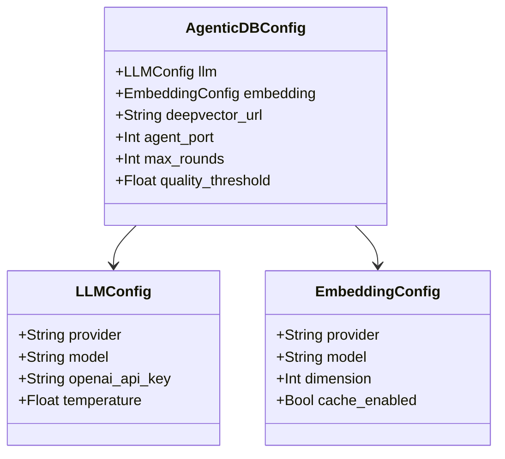

# 第三章：配置系统

> AgenticDB 的配置管理 — 从 dataclass 到环境变量，全面解析配置系统的设计。

## 前置知识

> 📎 **参考**: [Python环境](../prerequisites/02_Python环境_zh.md)

---

## 学习目标

- 理解 `AgenticDBConfig` 的三层配置结构
- 掌握环境变量覆盖机制
- 学会在不同场景下配置系统

---

## 3.1 配置架构



配置采用三层 dataclass 嵌套结构：

| 层级 | 类 | 职责 |
|------|-----|------|
| 顶层 | `AgenticDBConfig` | 全局配置：服务器地址、检索参数 |
| 子层 | `LLMConfig` | LLM 相关：provider、model、API key |
| 子层 | `EmbeddingConfig` | 嵌入相关：model、dimension、缓存 |

---

## 3.2 默认值设计

```python
@dataclass
class AgenticDBConfig:
    llm: LLMConfig = field(default_factory=LLMConfig)
    embedding: EmbeddingConfig = field(default_factory=EmbeddingConfig)

    deepvector_url: str = "http://localhost:8080"
    agent_port: int = 8090
    agent_host: str = "0.0.0.0"
    max_rounds: int = 5
    quality_threshold: float = 0.7
```

> **设计原则**：默认值让用户"开箱即用" — 默认使用本地 Ollama + 本地嵌入，零 API 费用。

---

## 3.3 环境变量覆盖

所有配置项都可通过环境变量覆盖：

```python
def __post_init__(self):
    self.provider = os.getenv("AGENTICDB_LLM_PROVIDER", self.provider)
    self.model = os.getenv("AGENTICDB_LLM_MODEL", self.model)
```

使用示例：

```bash
# OpenAI 模式
export AGENTICDB_LLM_PROVIDER=openai
export OPENAI_API_KEY=sk-xxx
export AGENTICDB_LLM_MODEL=gpt-4o
python -m agent.server.app

# 本地模式 (默认)
python -m agent.server.app
```

---

## 3.4 运行时配置

也可以在代码中直接构造配置：

```python
from agent.config import AgenticDBConfig, LLMConfig, EmbeddingConfig

config = AgenticDBConfig(
    llm=LLMConfig(provider="openai", model="gpt-4o-mini"),
    embedding=EmbeddingConfig(provider="openai"),
    max_rounds=2,  # 快速模式
    quality_threshold=0.5,  # 宽松标准
)
```

---

## 思考题

1. 环境变量覆盖机制和配置文件 (YAML/TOML) 方案相比各有什么优缺点？
2. 如果新增一个 LLM 提供商 (如 Anthropic Claude)，最小需要改哪些代码？
3. `quality_threshold` 设 0.3 和 0.9 会带来什么不同的行为？

## 动手练习

1. 在 `LLMConfig` 中添加 `retry_count: int = 3` 字段，并实现环境变量覆盖
2. 创建一个 `.env` 文件，让系统从文件加载配置
3. 编写一个 `print_config.py` 脚本，打印当前生效的完整配置

---

## 附录：本章与面试题库映射

请完成本章后练习 [INTERVIEW_BANK.md](../INTERVIEW_BANK.md) 中对应分区题目，并阅读 [_CHAPTER_TEMPLATE.md](../_CHAPTER_TEMPLATE.md) 自检是否覆盖「点/线/面/动手/反思/参考」。

**全局架构：** [ARCHITECTURE.md](../../ARCHITECTURE.md) · **选型：** [TECH.md](../../../TECH.md) · **运行：** [RUN.md](../../../RUN.md)
