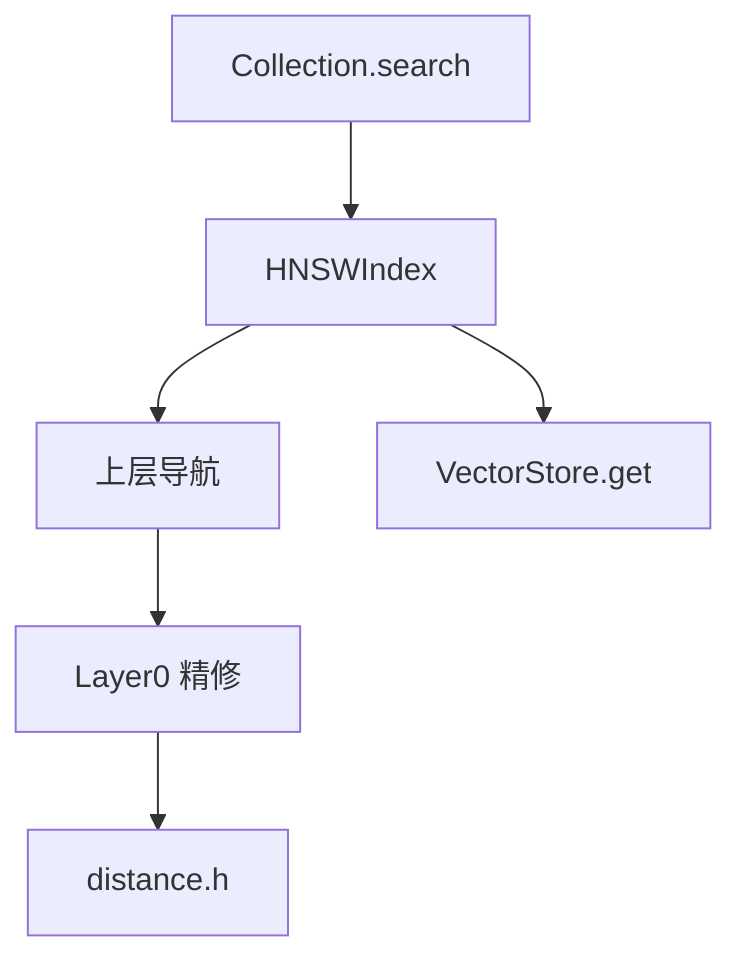

# 第三章（Track A）：HNSW 近似搜索 · 把距离砖砌成「线」

> HNSW 是当代向量库的主流 ANN 索引（MongoDB Atlas、Milvus、Qdrant、pgvector 等均提供）。  
> 本章把「点」（距离）连成「线」（图上的导航与精修）。

## 前置知识

> 📎 [向量与距离](../ch02_vectors_distance/02_向量与距离度量_zh.md) · [INTERVIEW_BANK B 区](../INTERVIEW_BANK.md)

## 学习目标

- [ ] 解释多层图：上层稀疏、Layer0 稠密  
- [ ] 写出层赋值公式并解释 `M`  
- [ ] 描述搜索：顶层贪心 → 下降 → ef 宽度搜索  
- [ ] 在源码中定位 `insert` / `searchLayer`

---

## 面 Surface 位置



---

## 1. 点 Point — 概念与语法

### 1.1 为什么要近似？

精确 KNN：\(O(N\cdot d)\)。十亿级不可接受。  
ANN 牺牲极少召回，换亚线性查询。

### 1.2 层赋值公式

\[
level = \left\lfloor -\ln(U) \cdot \frac{1}{\ln M} \right\rfloor,\quad U\sim Uniform(0,1)
\]

| 符号 | 含义 |
|------|------|
| `M` | 每层最大边数量级；越大越密、越占内存 |
| `U` | 均匀随机数 |

### 1.3 C++ 语法：优先队列做候选集

```cpp
using DistId = std::pair<float, uint64_t>; // dist, id
std::priority_queue<DistId, std::vector<DistId>, std::less<>> candidates;
```

| 语法 | 含义 |
|------|------|
| `std::pair<A,B>` | 二元组 |
| `priority_queue` | 堆；默认大根堆 |
| 比较器 | 控制「最优候选」弹出顺序 |

### 1.4 源码

- `include/dv/index/hnsw.h`  
- `src/index/hnsw.cpp` — `insert`, `search`, `searchLayer`, `selectNeighborsSimple`

---

## 2. 线 Line — 与存储/集合对接

插入：`Collection::add` → `store_->append` 得 id → `index_->insert(id)`。  
搜索：`index_->search(query,k)` 内部 `getVector` 拉 mmap 指针算距离。

过滤搜索：`searchWithFilter` 在候选上评估 Filter AST（后过滤）。

---

## 3. 面 Surface — 参数如何影响产品指标

| 参数 | 增大时 | 减小的代价 |
|------|--------|------------|
| `hnsw_m` | 召回↑ 内存↑ | 图连通变差 |
| `ef_construction` | 建图质量↑ 构建慢 | 召回可能降 |
| `ef_search` | 查询召回↑ 延迟↑ | 召回降 |

默认见 `CollectionConfig`。

---

## 4. 动手实践

### Lab A
读 `hnsw.cpp` 的 `searchLayer`，用注释标出：入口点、候选集、已访问集合。

### Lab B
固定数据 10k×384，画 ef_search∈{16,32,64,128} 的延迟-召回曲线（可用暴力法估召回）。

---

## 5. 反思思考

1. 为何 Layer0 常用 `2*M` 边？  
2. Simple neighbor selection vs heuristic 的工程取舍？  
3. 软删除节点仍留在图中有何风险？

---

## 6. 真实面试题

> INTERVIEW_BANK **Q-B1, Q-B2, Q-B3**（必练）

白板 10 分钟：画出 3 层 HNSW 查询路径。

---

## 7. 参考文档 / References

1. Y. A. Malkov, D. A. Yashunin — *Efficient and robust approximate nearest neighbor search using Hierarchical Navigable Small World graphs*  
2. [MongoDB: What is HNSW](https://www.mongodb.com/resources/basics/hierarchical-navigable-small-world)  
3. Meta Faiss — HNSW index notes  
4. 本仓库：`include/dv/index/hnsw.h`, `src/index/hnsw.cpp`, `tests/test_hnsw.cpp`  
5. [`ARCHITECTURE.md`](../../ARCHITECTURE.md) § HNSW  
6. 系统设计公开题：「Design a vector search engine」（HNSW vs IVF-PQ 权衡）

---

**上一章：** 距离砖 · **下一章：** [mmap 存储](../ch04_mmap_storage/)

---

## 附录：本章与面试题库映射

请完成本章后练习 [INTERVIEW_BANK.md](../INTERVIEW_BANK.md) 中对应分区题目，并阅读 [_CHAPTER_TEMPLATE.md](../_CHAPTER_TEMPLATE.md) 自检是否覆盖「点/线/面/动手/反思/参考」。

**全局架构：** [ARCHITECTURE.md](../../ARCHITECTURE.md) · **选型：** [TECH.md](../../../TECH.md) · **运行：** [RUN.md](../../../RUN.md)
