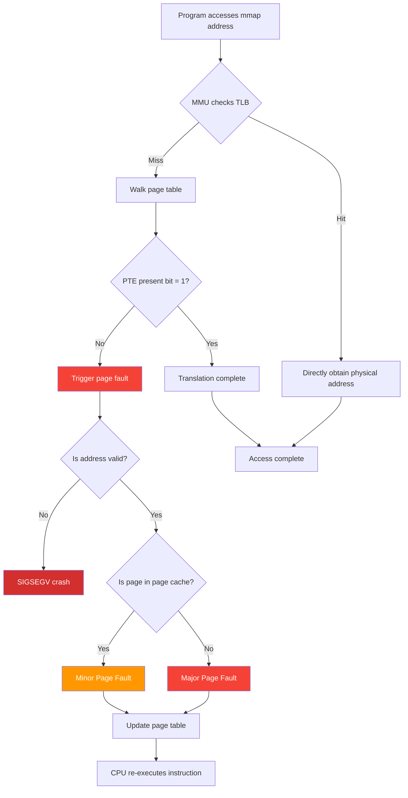
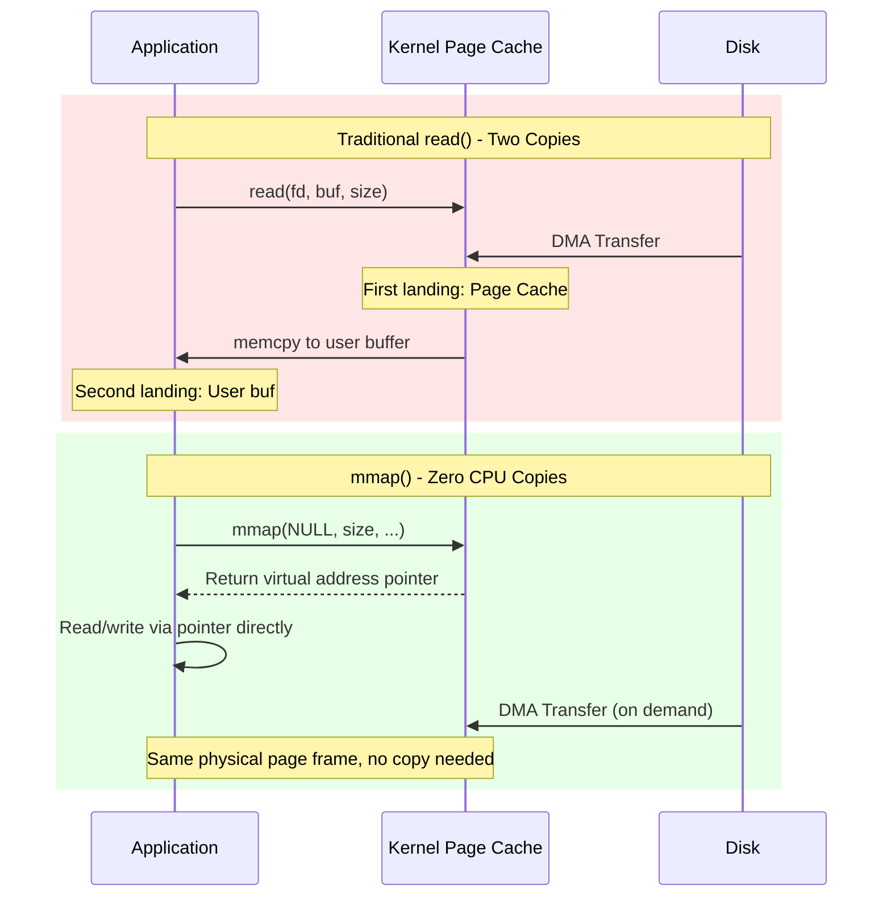

# Chapter 4: Zero-Copy Storage 鈥?Virtual Memory and mmap Persistence

## Prerequisites

> 馃搸 **Reference**: [Build Environment Configuration](../prerequisites/01_鏋勫缓鐜閰嶇疆_en.md) 鈥?CMake build commands, compiler flags, and `CMAKE_BUILD_TYPE`

## Learning Objectives
- Understand core virtual memory concepts: address space, pages, page tables, TLB, page faults
- Understand how mmap works and the true meaning of "zero-copy"
- Master the OS page cache and dirty page writeback mechanism
- Understand the differences between MAP_SHARED vs MAP_PRIVATE and Copy-on-Write (CoW)
- Design a persistent, extensible disk data format
- Safely extend mmap mapped regions (ftruncate + remap)
- Understand msync and data persistence guarantees
- Introduction to WAL (Write-Ahead Log) and crash recovery
- Understand how modern columnar formats like Arrow/Feather leverage mmap for analytical workloads

---

## 4.0 The Starting Point: Reading a 1GB File 鈥?Why Must It Copy 1GB of Data?

When you study databases or any data-intensive program, a fundamental question repeatedly arises: **How do you get data from disk "to" the program for use?**

The most intuitive approach is the `read()` system call (**syscall** 鈥?the formal interface by which a program requests the operating system kernel to perform operations, such as "help me read a file" or "help me allocate memory"). You call `read(fd, buf, size)`, and the OS moves the file contents from disk into the buffer you provided (a memory block you allocated with `malloc`).

But this raises a critical problem: **the data is copied twice**.

```
First copy: Disk 鈫?OS kernel's "page cache" (a file data copy that the OS
            automatically maintains in RAM, transparent to the program)
Second copy: Page cache 鈫?your buf (user-space buffer)
```

If your database file is 1GB, then `read()` must move 1GB of data twice in memory. On DDR4-3200 memory (theoretical bandwidth ~25 GB/s), this wastes ~80ms of pure copy time and additionally consumes 1GB of physical memory (because both the page cache and your buf each hold a copy).

**Key Insight**: If the OS could let your program "directly see" the data in the page cache, without copying it again into your buf, you would simultaneously eliminate the 1GB memory waste and the 1GB copy overhead. This is exactly the problem mmap solves.

---

## 4.1 Virtual Memory: The OS's Greatest Invention

### 4.1.1 What If Physical Memory Were Directly Exposed to Programs?

Before the 1970s, computer programs directly used **physical memory addresses** (real storage location numbers on RAM chips). The `0x0000A000` in `LOAD R1, [0x0000A000]` was a real location on the RAM chip. This design was simple but caused three serious problems:

**Problem 1: No process isolation.** A **process** (a running program instance in the OS, with its own isolated memory space and resources) writes to address `0x00100000`, and process B also reads that address 鈥?B can peek at A's data. There is no hardware-level "my memory, you can't touch it" mechanism. It's like all tenants sharing a single room with zero privacy.

**Problem 2: External fragmentation.** **Fragmentation** (the free space between allocated memory blocks becomes too small to satisfy new allocation requests). Suppose you have 4GB of physical RAM. Process A requests 2GB, B requests 1GB, C requests 1.5GB. A takes addresses 0鈥?GB, B takes 2GB鈥?GB, C takes 3GB鈥?GB (not enough for 1.5GB!). But 1GB of physical memory remains 鈥?it's just fragmented by the already-allocated blocks, with no contiguous 1.5GB region available. It's like a parking lot full of small cars 鈥?the total space is enough, but a bus can't fit.

**Problem 3: No "lazy loading."** A process asks the OS for 1GB of memory, but 99% of that 1GB may never actually be read or written. In the direct-memory model, the OS must still immediately allocate 1GB of physical memory 鈥?because you never said "which parts I won't use."

### 4.1.2 The Virtual Memory Solution

**Virtual Memory** is a hardware + OS collaborative mechanism introduced in the 1970s. It creates an "illusion" for each process 鈥?an independent, zero-based, enormous (2^64 bytes = 16 EB on 64-bit systems) **virtual address space** (the logical address range the process "sees," maintained jointly by the OS and CPU hardware, not directly corresponding to physical RAM). The process allocates memory freely within this virtual space, and the OS and CPU's **MMU** (Memory Management Unit 鈥?a hardware component on the CPU chip responsible for real-time translation of virtual addresses to physical addresses) translate virtual addresses to physical addresses behind the scenes.

```
What your program sees:          Reality managed by OS and MMU:
鈹屸攢鈹€鈹€鈹€鈹€鈹€鈹€鈹€鈹€鈹€鈹€鈹€鈹€鈹€鈹€鈹€鈹€鈹€鈹€鈹€鈹€鈹?   鈹屸攢鈹€鈹€鈹€鈹€鈹€鈹€鈹€鈹€鈹€鈹€鈹€鈹€鈹€鈹€鈹€鈹€鈹€鈹€鈹€鈹€鈹?鈹? 0x00007F0000000000 鈹?   鈹? 0x0000_0001_0000   鈹?鈹? 0x00007F0000001000 鈹?   鈹? (Page Frame 16)    鈹?鈹? 0x00007F0000002000 鈹?   鈹溾攢鈹€鈹€鈹€鈹€鈹€鈹€鈹€鈹€鈹€鈹€鈹€鈹€鈹€鈹€鈹€鈹€鈹€鈹€鈹€鈹€鈹?鈹? ...                鈹?   鈹? 0x0000_0005_A000   鈹?鈹? 0x00007FFFFFF00000 鈹?   鈹? (Page Frame 90)    鈹?鈹? (Contiguous virtual addresses) 鈹?   鈹溾攢鈹€鈹€鈹€鈹€鈹€鈹€鈹€鈹€鈹€鈹€鈹€鈹€鈹€鈹€鈹€鈹€鈹€鈹€鈹€鈹€鈹?鈹?                    鈹?   鈹? ...                鈹?鈹?                    鈹?   鈹? (Scattered physical pages) 鈹?鈹斺攢鈹€鈹€鈹€鈹€鈹€鈹€鈹€鈹€鈹€鈹€鈹€鈹€鈹€鈹€鈹€鈹€鈹€鈹€鈹€鈹€鈹?   鈹斺攢鈹€鈹€鈹€鈹€鈹€鈹€鈹€鈹€鈹€鈹€鈹€鈹€鈹€鈹€鈹€鈹€鈹€鈹€鈹€鈹€鈹?         鈫?                         鈫?    Virtual Address Space          Physical RAM (actual chip)
```

**Key Insight**: The "contiguity" of virtual address space is completely decoupled from the "discontiguity" of physical RAM. Process B can "believe" its memory is one contiguous block, while in reality it's scattered across various locations in RAM. The OS memory manager only needs to maintain a translation table.

> **Historical Note**: Virtual memory's prototype appeared in the 1961 Atlas computer (University of Manchester, UK), originally called "one-level storage." The concept was further refined by IBM in the 1970 System/370 and became the foundation of modern operating systems. From Atlas to System/370, to x86's segmentation + paging, to modern x86-64's pure paging mode, virtual memory evolved from a "luxury experiment" to an "indispensable necessity."

### 4.1.3 What Is a Page?

A **page** is the smallest management unit in the virtual memory system. Just as you can't withdraw "half a bill" from a bank, the OS can't give you "half a page" of memory. Page size is determined by the CPU architecture:

| Platform | Standard Page Size | Huge Page |
|---|---|---|
| x86-64 (4-level paging) | 4 KB (4096 bytes) | 2 MB or 1 GB |
| ARM64 | 4 KB, 16 KB, or 64 KB | Depends on configuration |
| Apple M-series | 16 KB | 鈥?|

Why 4KB? This is a historical compromise:
- **Too small (e.g., 512B)**: Page table entries explode 鈥?recording 4GB of memory requires 8 million entries, and the page table itself would occupy ~64MB
- **Too large (e.g., 64KB)**: Internal fragmentation (the allocated space is larger than what you actually need, and the excess cannot be used by others) is severe. Allocating 1 byte would still consume an entire 64KB page 鈥?the remaining 65,535 bytes cannot be used for other purposes
- **4KB**: Page table size is acceptable (4GB / 4KB = 1 million pages, page table ~8MB), and internal fragmentation wastes at most 4KB - 1 byte (acceptable)

**Analogy**: A page is like a page in a library book 鈥?you can't borrow just a corner of a page; you must borrow and return entire pages. When the OS "swaps" data between physical memory and disk, it does so in page-sized units.

### 4.1.4 Page Table: The Dictionary from Virtual to Physical Address

A **Page Table** is essentially a hierarchical data structure (similar to a 4- or 5-level B+ tree) stored in physical memory, maintained by the OS. Every time the CPU executes a memory access instruction (load or store), it must translate the virtual address in the instruction to a physical address.

```
Translation process for virtual address 0x00007F00_12345678 (x86-64 4-level paging):

鈹屸攢鈹€鈹€鈹€鈹€鈹€鈹€鈹€鈹€鈹€鈹€鈹€鈹€鈹€鈹攢鈹€鈹€鈹€鈹€鈹€鈹€鈹€鈹€鈹€鈹攢鈹€鈹€鈹€鈹€鈹€鈹€鈹€鈹€鈹€鈹攢鈹€鈹€鈹€鈹€鈹€鈹€鈹€鈹€鈹€鈹攢鈹€鈹€鈹€鈹€鈹€鈹€鈹€鈹€鈹€鈹€鈹€鈹€鈹€鈹?鈹?PML4 index   鈹?PDP index鈹?PD index 鈹?PT index 鈹?Page offset  鈹?鈹?(bits 47:39) 鈹?(38:30)  鈹?(29:21)  鈹?(20:12)  鈹?(11:0)       鈹?鈹?  9 bits     鈹? 9 bits  鈹? 9 bits  鈹? 9 bits  鈹?  12 bits    鈹?鈹斺攢鈹€鈹€鈹€鈹€鈹€鈹攢鈹€鈹€鈹€鈹€鈹€鈹€鈹粹攢鈹€鈹€鈹€鈹攢鈹€鈹€鈹€鈹€鈹粹攢鈹€鈹€鈹€鈹攢鈹€鈹€鈹€鈹€鈹粹攢鈹€鈹€鈹€鈹攢鈹€鈹€鈹€鈹€鈹粹攢鈹€鈹€鈹€鈹€鈹€鈹攢鈹€鈹€鈹€鈹€鈹€鈹€鈹?       鈹?           鈹?         鈹?         鈹?           鈹?   Look up 1st level  Look up 2nd level  Look up 3rd level  Look up 4th level   Page offset (0-4095)
   (PML4)       (PDP)     (PD)      (PT)        Used directly, no translation needed
```

**Translation process (done automatically by hardware)**:
1. CPU reads the physical base address of PML4 (1st-level page table) from the CR3 register
2. Uses the PML4 index (bits 39鈥?7) to look up PML4 entry 鈫?gets the physical address of the 2nd-level page table
3. Uses the PDP index (bits 30鈥?8) to look up level 2 鈫?gets the address of level 3
4. Uses the PD index (bits 21鈥?9) to look up level 3 鈫?gets the address of level 4 (the Page Table itself)
5. Uses the PT index (bits 12鈥?0) to look up level 4 鈫?gets the final physical page frame number
6. Physical address = (page frame number << 12) + page offset (bits 0鈥?1)

The entire translation requires at most 4 additional memory accesses 鈥?if this were done every time, performance would degrade to unacceptable levels. This is why TLB exists.

**Key fields in a Page Table Entry (PTE)**:

```
Typical fields of a 64-bit PTE (x86-64):

[Physical Page Frame Number (40 bits)] [Permissions] [Global] [Dirty] [Accessed] [Present] [...Present (bit 0):       1 = This page is in physical RAM, accessible normally
                                  0 = This page is not in RAM 鈫?triggers a page fault

  Read/Write (bit 1):    1 = Readable and writable
                                  0 = Read-only 鈫?writes trigger a protection fault

  Dirty (bit 6):           1 = This page's contents have been modified (inconsistent with disk copy)
                                  0 = Not modified (clean page, no need to write back to disk when swapped out)

  Accessed (bit 5):      1 = This page has been recently accessed
                                  OS uses this bit to implement LRU eviction policy

  User/Supervisor (U/S, bit 2):      Determines whether user-mode code can access this page
                                  (kernel memory is transparent to user mode)

  NX bit (No-Execute, bit 63):    1 = This page is not executable (prevents buffer overflow execution of malicious code)
```

### 4.1.5 TLB: Translation Cache Inside the CPU

**TLB** (Translation Lookaside Buffer) is a hardware cache inside the MMU that caches recently used virtual鈫抪hysical address translation results. Without TLB, every memory access would require a 4-level page table walk (as described above), meaning "reading a single byte" would actually require 5 memory accesses 鈥?a performance disaster.

```
Real-world access latency data (approximate):

  L1 Data Cache hit:    ~1 ns  (4-5 CPU cycles)
  TLB hit:               ~0.5-1 ns (parallel with L1, usually no additional latency)
  Page table walk (TLB miss):  ~50-150 ns (requires 4 memory accesses)
  
  In other words, each TLB miss costs the equivalent of 200-500 CPU cycles of idle waiting.
```

TLB capacity is very limited (typically only 64鈥?56 entries), which is why "reducing memory footprint" directly improves performance 鈥?a smaller data set means more translated pages can simultaneously remain in the TLB.

> **TLB Hit Rate**: Because programs exhibit **spatial locality** (if you accessed address X, you'll likely access X+1, X+2 soon 鈥?e.g., sequential array scanning) and **temporal locality** (if you recently used address Y, you may use it again soon 鈥?e.g., loop variables), most programs achieve TLB hit rates above 99%. Reducing a data set's memory footprint allows more page translations to stay in the TLB simultaneously 鈥?this is one of mmap's memory efficiency advantages.

### 4.1.6 Page Fault: What Happens When RAM Isn't Enough

A **Page Fault** occurs when the CPU tries to access a virtual page where the "present bit = 0." The MMU triggers an exception (similar to a divide-by-zero exception), the CPU suspends execution of the current instruction, and hands control over to the OS **kernel** (the core part of the OS, running in the CPU's privileged mode with access to all hardware, while applications run in user mode with restricted permissions) page fault handler.


### Page Fault Handling Flow



```
Complete page fault handling process (using an mmap file as an example):

1. Your program executes:  float x = data[5000];    鈫?Reading/writing mmap-mapped memory
2. CPU issues virtual address:  0x00007F000000_5000
    
3. MMU checks TLB:
   鈫?TLB miss
   鈫?Walk page table (4 levels)
   鈫?PT entry present bit = 0
   鈫?Trigger page fault (int 14 / #PF)

4. CPU switches to kernel mode, jumps to page fault handler

5. Kernel checks if virtual address is valid:
   - Checks if this address is within the process's VMA (Virtual Memory Area)
     VMA is the metadata the kernel records for each mmap call:
     "Address range 0x00007F... to 0x00007F... belongs to file data.bin, offset 5000"
   
   - If valid:
     a. Allocate a free page frame in physical RAM (or swap out a rarely-used page to free space)
     b. Read data from disk at the corresponding offset in data.bin into that physical page frame
        (If the file data is already in the OS page cache, disk I/O can be skipped)
     c. Update the page table: map the virtual page to the physical page frame, present bit = 1, dirty bit = 0
     d. Return to user mode, CPU re-executes the instruction that caused the page fault

   - If invalid (address was never allocated or mapped):
     Send SIGSEGV signal 鈫?your program sees "Segmentation fault" 鈫?crashes
```

**Performance difference between the two types of page faults**:

| Type | Condition | Latency | Frequency |
|---|---|---|---|
| Minor (minor page fault) | Page is already in physical RAM (e.g., a shared library was already loaded by another process), but the current process's page table doesn't have the mapping. Only a page table update is needed. | ~1鈥?0 碌s | Common, normal operation |
| Major (major page fault) | Page must be read from disk. Requires physical disk I/O. | ~5鈥?0 ms (SSD) / ~10鈥?0 ms (HDD) | Occurs heavily on first access to mmap file |
| Invalid (illegal) | Access to unmapped address, e.g., `*(int*)nullptr`. | Process termination | Always a bug |

> **Analogy**: A minor page fault is like borrowing a book from the library that **someone else is already reading in the building** 鈥?the librarian just needs to update the checkout record with your name. A major page fault is like **retrieving a book from the warehouse** 鈥?someone must find it among hundreds of thousands of books and deliver it to the reading room, taking thousands of times longer. This is why mmap's "lazy loading" cost is in the latency of the first access, while subsequent accesses have nearly zero overhead.

---

## 4.2 mmap: Making Files Accessible Like Memory

### 4.2.1 What Is mmap?

**mmap** (memory map) is a POSIX system call used to create a **memory-mapped region** in a process's virtual address space. This region can be accessed directly through pointers, with the underlying data automatically managed by the kernel 鈥?it may reside in physical RAM or on a disk file (loaded on demand by page faults).

**Analogy**: Imagine you're in a library. The traditional `read()` is like photocopying an entire book and taking it home. mmap is like the library giving you a "seat card" 鈥?you can sit at a desk and read the original book directly, no photocopying needed. If the book is too thick, the library only places the few pages you need on the desk (on-demand loading), and when you've read past some pages, they can be taken away.

From the Linux man page, the signature:
```c
#include <sys/mman.h>

void* mmap(void* addr, size_t length, int prot, int flags,
           int fd, off_t offset);
```

| Parameter | Meaning | Typical Value |
|---|---|---|
| `addr` | Suggested starting virtual address for the mapping | `NULL` (let the kernel choose 鈥?almost always the correct approach) |
| `length` | Mapping size (in bytes) | Rounded up to a multiple of the page size |
| `prot` | **Protection flags** (control access permissions for the mapped region) | `PROT_READ` (read-only), `PROT_WRITE` (write-only), `PROT_EXEC` (executable), combinable (`PROT_READ\|PROT_WRITE`) |
| `flags` | Mapping type flags | See below: MAP_SHARED / MAP_PRIVATE |
| `fd` | **File descriptor** (an integer handle returned by the `open()` syscall, representing an opened file; all subsequent I/O operations reference the file through this number) | An opened file; pass `-1` for `MAP_ANONYMOUS` |
| `offset` | **File offset** (the byte position in the file from which to start the mapping) | **Must be a multiple of the page size (4096)** |

mmap returns the starting address of the mapped region in the process's virtual address space (`void*`). On failure it returns `MAP_FAILED` (i.e., `(void*)-1`; check `errno` for the reason).


### read() vs mmap() Data Flow Comparison



### 4.2.2 Why Is It Called "Zero-Copy"? 鈥?mmap vs read()

Understanding mmap's advantages requires first understanding the traditional `read()` data path.

**Traditional read() data path (two copies)**:
```
Application code:
  char* buf = malloc(4096);
  read(fd, buf, 4096);

What happens inside the kernel:
  Disk (SSD/HDD)
      鈫?DMA (Direct Memory Access: peripherals write data directly to RAM without CPU involvement)
  Kernel page cache  鈫?First data landing (associated with the file system)
      鈫?memcpy executed by CPU (copy_to_user)
  buf (user-space malloc buffer)  鈫?Second data landing

  Data path: Disk 鈫?Page cache 鈫?User buffer (2 copies, 1 CPU involvement)
```

**mmap data path (one copy, zero CPU copies)**:
```
Application code:
  void* ptr = mmap(NULL, file_size, PROT_READ, MAP_SHARED, fd, 0);
  float x = ((float*)ptr)[i];   // Access directly through pointer!

What happens inside the kernel:
  Disk (SSD/HDD)
      鈫?DMA
  Kernel page cache
      鈫?Same physical page frame
  User virtual address space (mapped to the same physical page via page tables)

  Data path: Disk 鈫?Page cache 鈫愨啋 User address space (1 copy, 0 CPU copies)
  The data the user sees and the data in the page cache are the same block of physical memory.
```

**"Zero-copy" (zero-copy)** is a somewhat exaggerated term 鈥?data still needs to be read from disk to RAM (there is a copy), but it **eliminates the second copy from kernel buffer to user buffer**. For a 3GB vector database file, eliminating one 3GB memcpy means:
- Saving 3GB of memory bandwidth (DDR4-3200 bandwidth is precious)
- Not wasting physical memory (no need for two copies to exist simultaneously 鈥?page cache and user buffer)
- Reducing CPU overhead (memcpy itself consists of CPU instructions that consume compute resources)

### 4.2.3 Real-World Performance Comparison: mmap vs read()

| Scenario | mmap | read() | Analysis |
|---|---|---|---|
| Sequential read of 1GB file | ~250ms (limited by disk bandwidth) | ~350ms (one extra memcpy) | mmap eliminates copy overhead |
| 100K random reads (4KB each) | ~80ms (TLB miss + page fault dominated) | ~120ms (memcpy + syscall overhead) | Syscall context switching is the main bottleneck |
| Crash immediately after write | Dirty pages not yet msync'd may be lost | Similarly, depends on fsync policy | Both require explicit flushing |
| Under memory pressure (insufficient RAM) | Page cache can be reclaimed, program degrades to disk speed | Extra user buffers cannot be reclaimed | mmap is more memory-efficient |

**Key conclusion**: mmap has clear advantages in **large file sequential reads** and **memory efficiency**. read() has advantages in **small-data random reads** and **simplicity** (no need to handle page faults). For database systems, mmap's memory efficiency and zero-copy characteristics make it the mainstream choice (e.g., LMDB, RocksDB's BlobDB).

### 4.2.4 What Is the "OS Page Cache"?

The **OS Page Cache** is a cache maintained by the Linux kernel in physical RAM, associated with disk files. It's a transparent mechanism 鈥?you don't need to be aware of its existence, yet it has a massive impact on program performance.

```
Core properties of the page cache:

1. Organized by file + offset: Every 4KB range of every file has a corresponding cache slot
   
2. Automatic readahead: When you sequentially read a file, the kernel predicts and preloads
   subsequent pages into the page cache, making sequential reads approach memory bandwidth (not disk bandwidth)

3. Writeback: Writes to mmap MAP_SHARED mappings mark pages as "dirty"
   The kernel's pdflush/flush threads periodically (default within 30 seconds) write dirty pages back to disk

4. Globally shared: If the same file is mmap'd by two processes, they share the same page cache
   鈥?meaning both processes can see each other's writes (as long as MAP_SHARED is used)

5. Reclamation: When free physical memory is insufficient, the kernel reclaims "clean" page cache pages
   from the LRU list. "Dirty" pages must be written back to disk before they can be reclaimed.
```

The page cache size nearly fills all free physical RAM. Linux reports the current available memory for new allocations in `MemAvailable` (`/proc/meminfo`). If you have 32GB RAM and only 4GB of processes are running, the "free" 28GB is almost entirely occupied by the page cache 鈥?this is not waste; it's free performance: if certain file data is already in the page cache, subsequent access goes from disk speed to memory speed.

**Cache friendliness and sequential access patterns**:

CPU caches (L1/L2/L3) and the page cache all operate on **cache lines** (the smallest data transfer unit in CPU caches, typically 64 bytes). When you sequentially read an array:
- The first access loads an entire cache line (64 bytes = 16 floats), and the next 15 float accesses are "free" (cache hits)
- The readahead mechanism preloads subsequent cache lines, allowing disk I/O and computation to overlap
- Page translations cached in the TLB can cover a larger address range (each page 4KB = 64 cache lines)

This is why database systems typically prefer **sequential I/O** 鈥?it can leverage all three cache layers: L1/L2 cache, TLB, and page cache. Random I/O invalidates all three cache layers, causing performance to plummet.


### OS Memory Usage Patterns


### 4.2.5 MAP_SHARED vs MAP_PRIVATE vs MAP_ANONYMOUS

This is the most important parameter choice in mmap, affecting write behavior.

```
MAP_SHARED (Shared Mapping):
  鈹屸攢鈹€鈹€鈹€鈹€鈹€鈹€鈹€鈹€鈹€鈹€鈹€鈹€鈹€鈹€鈹€鈹€鈹€鈹€鈹€鈹€鈹€鈹€鈹€鈹€鈹€鈹€鈹€鈹€鈹€鈹€鈹€鈹€鈹?  鈹?Writes directly affect pages in the page cache      鈹?  鈹?Dirty pages are eventually written back to disk                鈹?  鈹?Other processes mmap'ing the same file see the writes   鈹?  鈹?This is the most commonly used mode for persistent storage       鈹?  鈹斺攢鈹€鈹€鈹€鈹€鈹€鈹€鈹€鈹€鈹€鈹€鈹€鈹€鈹€鈹€鈹€鈹€鈹€鈹€鈹€鈹€鈹€鈹€鈹€鈹€鈹€鈹€鈹€鈹€鈹€鈹€鈹€鈹€鈹?
MAP_PRIVATE (Private Mapping):
  鈹屸攢鈹€鈹€鈹€鈹€鈹€鈹€鈹€鈹€鈹€鈹€鈹€鈹€鈹€鈹€鈹€鈹€鈹€鈹€鈹€鈹€鈹€鈹€鈹€鈹€鈹€鈹€鈹€鈹€鈹€鈹€鈹€鈹€鈹?  鈹?Reads: Same as SHARED, fetched from page cache 鈹?  鈹?Writes: Trigger Copy-on-Write (COW)          鈹?  鈹?  鈫?Kernel allocates a new physical page frame      鈹?  鈹?  鈫?Copies original page contents to the new frame    鈹?  鈹?  鈫?Updated page table points to the new frame          鈹?  鈹?  鈫?User's write goes into the new frame          鈹?  鈹?Original file unchanged, other processes don't see writes   鈹?  鈹?Suitable for: loading read-only data with occasional local modifications   鈹?  鈹斺攢鈹€鈹€鈹€鈹€鈹€鈹€鈹€鈹€鈹€鈹€鈹€鈹€鈹€鈹€鈹€鈹€鈹€鈹€鈹€鈹€鈹€鈹€鈹€鈹€鈹€鈹€鈹€鈹€鈹€鈹€鈹€鈹€鈹?
MAP_ANONYMOUS (Anonymous Mapping):
  鈹屸攢鈹€鈹€鈹€鈹€鈹€鈹€鈹€鈹€鈹€鈹€鈹€鈹€鈹€鈹€鈹€鈹€鈹€鈹€鈹€鈹€鈹€鈹€鈹€鈹€鈹€鈹€鈹€鈹€鈹€鈹€鈹€鈹€鈹?  鈹?Not associated with any file                 鈹?  鈹?Pass -1 for fd parameter                     鈹?  鈹?Equivalent to the underlying implementation of malloc          鈹?  鈹?Initial contents are zero (zero pages)              鈹?  鈹?Used for: allocating large shared memory blocks, heap expansion    鈹?  鈹斺攢鈹€鈹€鈹€鈹€鈹€鈹€鈹€鈹€鈹€鈹€鈹€鈹€鈹€鈹€鈹€鈹€鈹€鈹€鈹€鈹€鈹€鈹€鈹€鈹€鈹€鈹€鈹€鈹€鈹€鈹€鈹€鈹€鈹?```

### 4.2.6 Copy-on-Write (CoW)

**Copy-on-Write (CoW)** is the key technology behind MAP_PRIVATE. It's also the foundation of the `fork()` system call 鈥?when a parent process forks a child process, the child's page tables point to the same physical pages as the parent, but all these pages are marked read-only. Only when either parent or child process first writes to a page does the kernel actually copy that page (allocate a new physical page frame + copy data + update the page table + mark as writable).

**The beauty of CoW**: Most `fork()` calls are immediately followed by `exec()` (replacing the process image), so the forked page data is discarded within microseconds. CoW avoids copying this large amount of useless data 鈥?only copying pages that "were actually modified."

In the context of mmap MAP_PRIVATE, CoW means: if you only need to read a 1GB file and modify a few kilobytes, CoW saves you 999+ MB of physical memory and the time for memory copies.

---

## 4.3 Data Persistence: msync and Dirty Page Management

### 4.3.1 Writes Don't Immediately Reach Disk

When you execute `ptr[i] = 42.0f` on mmap-mapped memory, the write enters the page cache page in RAM. The CPU marks the page as "dirty" (modifying the PTE/Dirty bit), and then the write instruction completes 鈥?this is typically a sub-microsecond operation.

The actual disk write occurs in one of the following cases:
1. **pdflush/flush kernel thread**: Periodically (`dirty_writeback_centisecs`, default 500, i.e., 5 seconds) scans dirty pages
2. **Dirty page ratio exceeds threshold**: `dirty_background_ratio` (default 10%) 鈥?background writeback; `dirty_ratio` (default 20%) 鈥?blocks writes until dirty pages drop below the threshold
3. **Explicitly calling msync**: User program requests immediate writeback
4. **Calling munmap + close**: Triggers final writeback when unmapping (but not absolutely guaranteed!)

### 4.3.2 msync: "I Need to Guarantee Data Is on Disk Right Now"

```c
int msync(void* addr, size_t length, int flags);

// flags:
//   MS_ASYNC      鈥?Initiates a writeback request, returns immediately (does not guarantee data has been persisted)
//                    Equivalent to telling the kernel "write this data back when you have time"
//   MS_SYNC       鈥?Blocks until dirty pages are written back to the storage device
//                    Equivalent to telling the kernel "I must know the data is on disk, I won't proceed otherwise"
//   MS_INVALIDATE 鈥?Invalidates the cache of the current mapping, forcing the next access to reload from disk
//                    Used for synchronization with other processes
```

**Critical warning**: `close(fd)` **does not guarantee a writeback**. Closing a file only releases the file descriptor, which is independent of the dirty page writeback mechanism. If you don't call `msync` before `close(fd)`, in extreme cases (e.g., the process crashes immediately), dirty pages may never reach disk.

**Correct mmap write shutdown sequence**:
```cpp
msync(ptr, len, MS_SYNC);   // 1. Force flush to disk, block until complete
munmap(addr, len);           // 2. Unmap virtual memory mapping
close(fd);                   // 3. Close file descriptor
```

> Why doesn't `munmap` guarantee writeback? `munmap` only removes the virtual address mapping; dirty pages may still be in the page cache. Once all references are removed, the kernel determines when to write back the dirty pages. Therefore, `msync` must be called before `munmap`.

### 4.3.3 Disk Block vs Filesystem Block vs Memory Page

These three concepts are easy to confuse, but their values may differ:

| Concept | Size | Meaning |
|---|---|---|
| **Disk block** (sector) | 512 B or 4 KB (physical sectors of modern disks) | Smallest unit read/written by disk firmware. The OS typically uses 4KB logical blocks to communicate with the disk. |
| **Filesystem block** | 4 KB (ext4 default, configurable at mkfs time) | Smallest unit for filesystem space allocation. A small file still occupies an entire 4 KB block. |
| **Memory page** | 4 KB (x86-64 standard page) | Smallest unit for MMU virtual memory management. The mmap offset parameter must be aligned to the page size. |

These three are typically the same (4 KB), but they don't have to be. What matters is: when mmap maps, the filesystem and virtual memory system synchronize data at page granularity 鈥?one page fault loads 4KB of data from the corresponding offset in the file.

---

## 4.4 Disk Format Design: How to Persist a Vector Index to File

### 4.4.1 Design Principles

A good file format needs to satisfy:

1. **Self-describing**: The first few bytes of the file contain a **magic number** (special bytes at the start of a file used to identify its file type 鈥?e.g., PDF starts with `%PDF`, PNG starts with `0x89504E47`) and a version number. When a program opens the file, it first validates these two fields 鈥?if the magic number is wrong, the file is corrupted or not a DeepVector file; if the version is incompatible, it can give a clear error message instead of crashing.

2. **Extensible**: Reserve blank fields in the header, allowing future versions to append information without breaking the layout of older structures. If you pack all fields tightly, adding a new field would require rewriting the entire file format.

3. **Aligned**: The data area is aligned to 64 bytes (matching the CPU cache line size). Data access spanning cache lines requires two memory loads (loading two 64-byte cache lines); alignment reduces it to one.

4. **Verifiable**: Optionally include CRC32 or xxHash checksums for detecting bit rot (silent bit flips on storage media due to cosmic rays or hardware aging). When storing billions of records, this probability is no longer negligible.

### 4.4.2 DeepVector's Disk Layout

```
Offset 0
+=====================+
| Magic Number (4B)   |  0x4C4D4442 = "LMDB" in ASCII (identifies file type)
+---------------------+
| Version (4B)        |  1 (file format version, incremented on format upgrades)
+---------------------+
| Dimension (4B)      |  768 (dimensionality of each vector)
+---------------------+
| Vector Count (8B)   |  N (total number of vectors stored in the database)
+---------------------+
| Metric Type (4B)    |  0=L2, 1=IP, 2=Cosine
+---------------------+
| Flags (4B)          |  bit0: normalization flag, bit1: AVX-512 compatibility flag
+---------------------+
| Reserved (40B)      |  Empty, brings header to 64 bytes total (aligned to cache line)
+=====================+  Offset 64 (aligned to cache line boundary)
|                     |
| Index Header (64B)   |  HNSW metadata: M, ef_construction, max_level, entry_point_id
|                     |
+=====================+  Offset 128
|                     |
| Index Graph (variable length)   |  Adjacency list [node_id(4B)][neighbor_count(4B)][neighbor_ids 脳 4B]
|                     |
+=====================+  Offset aligned to next page boundary (multiple of 4096)
|                     |
| Vector Data         |  [id(8B)][vec_0(4B)][vec_1(4B)]...[vec_D-1(4B)] 脳 N
|                     |  Each vector entry: 8 (ID) + 4脳D (float) bytes
+=====================+
```

**Design Decision Analysis**:

- **Magic number `0x4C4D4442`**: Not random. `0x4C` = 'L', `0x4D` = 'M', `0x44` = 'D', `0x42` = 'B' 鈫?"LMDB". If the file doesn't start with this value, it's 100% not a valid DeepVector file 鈥?this is the simplest integrity check.

- **Header 64-byte alignment**: Modern CPUs' L1/L2 caches read data in 64-byte "cache lines" (the smallest data transfer unit between CPU cache and main memory). Aligning the header to exactly 64 bytes means reading the header requires only one cache line load.

- **Graph data and vector data page-aligned and separated**: Variable-length graph data and fixed-length vector data are stored separately, both page-aligned. This allows the OS to independently swap hot graph data (frequently accessed during search) and cold vector data (accessed only during distance computation) into different regions of RAM, improving cache utilization.

### 4.4.3 Arrow/Feather Format: mmap Insights

**Apache Arrow** is a cross-language in-memory columnar data format standard. Its design philosophy has a profound connection with mmap storage:

**Arrow's core ideas**:
- Data is organized in memory in **columnar layout** (data of the same column is stored contiguously, rather than by row), allowing aggregation operations on a single column (e.g., sum, average) to fully leverage CPU cache prefetch
- **Zero-copy**: Different languages (C++, Python, Java) can directly read Arrow memory buffers without serialization/deserialization
- **Fixed offsets**: Each column's starting offset can be computed in O(1) time, enabling random access

**Feather format** (Arrow's disk storage format):
- A Feather file is essentially an Arrow IPC (Inter-Process Communication) stream with a lightweight header
- It is designed to be directly mmap-mapped 鈥?once mapped, column data is directly readable without parsing
- Python's pandas reads Feather files 10鈥?00x faster than CSV, partly because it leverages mmap + zero-copy

**Insights for DeepVector**:
```
Traditional format (row-oriented):
  [row0_id, row0_vec, row1_id, row1_vec, ...]
  鈫?Reading a column requires skipping other columns, cache-unfriendly

Arrow/Feather format (columnar):
  [All IDs stored contiguously] [All vecs stored contiguously]
  鈫?Reading a column is sequential access, cache-friendly

DeepVector's format:
  [Index graph data (hot)] [Vector data (cold)]
  鈫?Graph traversal and vector computation can independently leverage cache
```

DeepVector's disk layout borrows Arrow's columnar separation philosophy: separating frequently accessed index graph data from occasionally accessed vector data, allowing the OS to manage cache more intelligently. In real-world vector database production environments, Arrow format is often used in the data exchange layer (e.g., query result return), while mmap format is used in the storage layer (e.g., persistent indexes).

---

## 4.5 Safely Extending mmap Files

### 4.5.1 The Problem

mmap specifies a `length` parameter at call time 鈥?a fixed size for the mapped region. If the file later grows (because more vectors were inserted), the old mapping won't automatically expand. Calling mmap again to cover the same address range will fail (address already occupied).

### 4.5.2 Cross-Platform Solution: munmap + ftruncate + mmap

```cpp
class GrowableMmapFile {
    int fd;
    void* ptr;
    size_t mapped_size;

public:
    GrowableMmapFile(const char* path, size_t initial_size) {
        fd = open(path, O_RDWR | O_CREAT, 0644);
        if (fd < 0) { perror("open"); exit(1); }
        
        // ftruncate: Sets file size. If the file is shorter than the specified size, zero-fills the difference.
        // If it's longer, truncates the excess.
        if (ftruncate(fd, initial_size) != 0) {
            perror("ftruncate"); exit(1);
        }
        
        ptr = mmap(NULL, initial_size, PROT_READ | PROT_WRITE,
                   MAP_SHARED, fd, 0);
        if (ptr == MAP_FAILED) { perror("mmap"); exit(1); }
        mapped_size = initial_size;
    }

    void grow(size_t new_size) {
        if (new_size <= mapped_size) return;

        new_size = align_up(new_size, 4096);  // Page-aligned
        
        // Step order is extremely important!
        msync(ptr, mapped_size, MS_SYNC);     // 1. First flush dirty data to disk
        munmap(ptr, mapped_size);             // 2. Unmap old mapping
        
        if (ftruncate(fd, new_size) != 0) {   // 3. Extend file (new area filled with zeros)
            perror("ftruncate"); exit(1);
        }
        
        // 4. Remap (pass NULL to let kernel choose address, avoiding conflict with old address)
        ptr = mmap(NULL, new_size, PROT_READ | PROT_WRITE,
                   MAP_SHARED, fd, 0);
        if (ptr == MAP_FAILED) { perror("mmap"); exit(1); }
        
        mapped_size = new_size;
        // 鈿狅笍 Note: ptr may have changed! Cannot rely on old pointer
    }

    ~GrowableMmapFile() {
        msync(ptr, mapped_size, MS_SYNC);
        munmap(ptr, mapped_size);
        close(fd);
    }
};
```

**Critical risk**: After remapping, `ptr` may point to a different virtual address than before. If you saved pointers pointing into the middle of the mapping (e.g., `Node* p = &((Node*)ptr)[10]`), after remapping these become **dangling pointers** (pointers to freed or invalid memory 鈥?dereferencing causes undefined behavior) 鈥?the virtual addresses they point to may no longer map to anything, or may map to the wrong content. Solution: use offsets (indices) instead of absolute pointers.

### 4.5.3 Linux's Efficient Alternative: mremap

Linux provides the `mremap()` system call, which can expand a region without unmapping the old one. This is not a POSIX standard 鈥?it exists only on Linux.

```c
#define _GNU_SOURCE    // mremap is a GNU extension, not POSIX
#include <sys/mman.h>

void* mremap(void* old_addr, size_t old_size, size_t new_size,
             int flags, ... /* void* new_addr */);
```

Using the `MREMAP_MAYMOVE` flag allows the kernel to move the mapping to a new virtual address (if the space after the current location is already occupied):

```c
// Extend the file
ftruncate(fd, new_size);

// Extend the mapping 鈥?don't unmap old mapping, don't flush TLB
void* new_ptr = mremap(old_ptr, old_sz, new_sz, MREMAP_MAYMOVE);
if (new_ptr == MAP_FAILED) {
    perror("mremap");
    // Fallback: use the cross-platform munmap+mmap solution
}
ptr = new_ptr;
mapped_size = new_size;
```

mremap's advantage: it doesn't trigger TLB flushes, doesn't rebuild VMA (Virtual Memory Area descriptors), and is much faster than munmap+mmap. The downside is it's Linux-specific, and `MREMAP_MAYMOVE` invalidates previously saved pointers (same issue as munmap+mmap).

---

## 4.6 Crash Safety: WAL (Write-Ahead Log)

mmap's direct writes are a problem during crashes: the writes go to memory, but data in memory may not have been flushed to disk.

**Scenario**: Your program executes `mmap_ptr[i] = new_vector`, updating an HNSW graph's edges. Then the OS powers off or the process is `kill -9`'d. Among the mmap-mapped pages, the vector data was fully written but the graph edges were only partially written 鈥?the data on disk is now in an inconsistent state.

**Write-Ahead Log (WAL)** is the standard method database systems use to solve this problem:

```
Normal operation flow:
  1. Record "what I'm going to do" to the WAL file (append-only, use fdatasync to ensure persistence)
  2. Execute actual modifications in memory (mmap)
  3. Periodically perform checkpoints: sync all modifications recorded in the WAL to the main data file, then truncate the WAL

Crash recovery flow:
  1. When reopening the database, check the WAL file
  2. Starting from the last checkpoint position, replay all operations recorded in the WAL
  3. Flush the replayed mmap data to the data file
  4. Truncate the WAL, data is restored to a consistent state
```

```
DeepVector WAL entry format:

[8B: CRC32 checksum] [4B: op_type] [8B: data_len] [data_len bytes]

op_type:
  0x01 = INSERT   鈥?New vector record
  0x02 = DELETE   鈥?Mark vector as deleted
  0x03 = UPDATE   鈥?Modify vector data
  0x04 = COMMIT   鈥?Transaction commit marker
  0x05 = CHECKPOINT 鈥?Checkpoint marker (all prior WAL can be safely truncated)
```

The WAL file is **append-only** 鈥?new records are always written at the end of the file. This means that even if a crash occurs mid-write, the previously written WAL entries are intact (either fully written or not written at all 鈥?no "half-written" state). During recovery, you only need to check whether the last record's CRC32 matches 鈥?if it doesn't, it was truncated during the crash, and you simply ignore it.

> **Is WAL "zero-copy"?** No 鈥?WAL is itself an additional copy. This is a "safety vs. performance" tradeoff. If high performance is the only goal (e.g., a pure cache scenario), you can disable WAL and accept the possibility of losing a small amount of data on crash. DeepVector enables WAL by default but supports configuration to disable it.

---

## 4.7 Hands-On Implementation: A Persistent Float Array

Implement a complete example in `ch04_mmap_storage/code/mmap_array.cpp`:

```cpp
#include <sys/mman.h>
#include <sys/stat.h>
#include <fcntl.h>
#include <unistd.h>
#include <cstring>
#include <cstdint>
#include <iostream>
#include <vector>
#include <cassert>

// File header format 鈥?64-byte aligned
struct Header {
    uint32_t magic;        // 0x4C4D4442 = "LMDB"
    uint32_t version;      // 1 (file format version)
    uint64_t element_size; // sizeof(float) = 4
    uint64_t count;        // Current number of used elements
    uint64_t capacity;     // Currently allocated capacity (capacity >= count)
    uint8_t reserved[40];  // Reserved for future extensions (to fill 64 bytes)

    static constexpr uint32_t MAGIC = 0x4C4D4442;
    static constexpr uint32_t VERSION = 1;
};

class MmapFloatArray {
    int fd;
    void* ptr;
    size_t file_size;
    Header* header;

    // Starting offset of the data area (64-byte aligned, ensuring data starts at a cache line boundary)
    size_t data_offset() const {
        return (sizeof(Header) + 63) & ~63ULL;
    }

    void init_file(size_t capacity) {
        file_size = data_offset() + capacity * sizeof(float);
        if (ftruncate(fd, file_size) != 0) {
            perror("ftruncate init"); exit(1);
        }

        ptr = mmap(NULL, file_size, PROT_READ | PROT_WRITE,
                   MAP_SHARED, fd, 0);
        if (ptr == MAP_FAILED) { perror("mmap init"); exit(1); }

        // Write header metadata
        header = reinterpret_cast<Header*>(ptr);
        header->magic = Header::MAGIC;
        header->version = Header::VERSION;
        header->element_size = sizeof(float);
        header->count = 0;
        header->capacity = capacity;
    }

    void load_existing() {
        struct stat st;
        fstat(fd, &st);
        file_size = st.st_size;

        ptr = mmap(NULL, file_size, PROT_READ | PROT_WRITE,
                   MAP_SHARED, fd, 0);
        if (ptr == MAP_FAILED) { perror("mmap load"); exit(1); }

        header = reinterpret_cast<Header*>(ptr);
        if (header->magic != Header::MAGIC) {
            std::cerr << "Error: Bad magic number! "
                      << "File is not a valid DeepVector data file." << std::endl;
            exit(1);
        }
        if (header->version != Header::VERSION) {
            std::cerr << "Error: Version mismatch! "
                      << "File version " << header->version
                      << " is not supported (expected " << Header::VERSION << ")."
                      << std::endl;
            exit(1);
        }
    }

public:
    MmapFloatArray(const char* path, size_t capacity = 1024) {
        fd = open(path, O_RDWR | O_CREAT, 0644);
        if (fd < 0) { perror("open"); exit(1); }

        struct stat st;
        fstat(fd, &st);

        if (st.st_size == 0) {
            init_file(capacity);   // New file
        } else {
            load_existing();       // Existing file, restore state
        }
    }

    ~MmapFloatArray() {
        msync(ptr, file_size, MS_SYNC);   // 1. Flush to disk
        munmap(ptr, file_size);            // 2. Unmap
        close(fd);                         // 3. Close file
    }

    void push_back(float val) {
        if (header->count >= header->capacity) {
            grow(header->capacity * 2);    // Growth strategy: double (amortized O(1))
        }
        float* data = reinterpret_cast<float*>(
            reinterpret_cast<char*>(ptr) + data_offset());
        data[header->count++] = val;
        // 鈿狅笍 No immediate msync here 鈥?relying on destructor to flush
    }

    float at(size_t i) const {
        if (i >= header->count) {
            std::cerr << "Error: Index " << i
                      << " out of bounds (count=" << header->count << ")"
                      << std::endl;
            exit(1);
        }
        float* data = reinterpret_cast<float*>(
            reinterpret_cast<char*>(ptr) + data_offset());
        return data[i];
    }

    size_t size() const { return header->count; }
    size_t capacity() const { return header->capacity; }

    void grow(size_t new_capacity) {
        size_t new_file_size = data_offset() + new_capacity * sizeof(float);

        std::cout << "Growing: " << header->capacity
                  << " -> " << new_capacity
                  << " (file: " << file_size << " -> " << new_file_size << ")"
                  << std::endl;

        msync(ptr, file_size, MS_SYNC);           // 1. Flush old data to disk
        munmap(ptr, file_size);                    // 2. Unmap

        if (ftruncate(fd, new_file_size) != 0) {  // 3. Extend file
            perror("ftruncate grow"); exit(1);
        }

        ptr = mmap(NULL, new_file_size, PROT_READ | PROT_WRITE,
                   MAP_SHARED, fd, 0);             // 4. Remap
        if (ptr == MAP_FAILED) { perror("mmap grow"); exit(1); }

        header = reinterpret_cast<Header*>(ptr);
        header->capacity = new_capacity;           // 5. Update header data
        file_size = new_file_size;
    }

    void sync() {
        msync(ptr, file_size, MS_SYNC);
    }
};

int main() {
    const char* path = "test_float_array.bin";

    // Round 1: Write data
    {
        std::cout << "=== Round 1: Writing ===" << std::endl;
        MmapFloatArray arr(path, 8);

        for (int i = 0; i < 10; i++) {
            arr.push_back(i * 1.5f);
        }

        std::cout << "Size: " << arr.size()
                  << "  Capacity: " << arr.capacity() << std::endl;

        for (size_t i = 0; i < arr.size(); i++) {
            std::cout << "  [" << i << "] = " << arr.at(i) << std::endl;
        }
    }  // Destructor runs msync 鈫?munmap 鈫?close

    // Round 2: Reopen file, verify persistence
    {
        std::cout << "\n=== Round 2: Re-reading ===" << std::endl;
        MmapFloatArray arr(path);

        assert(arr.size() == 10);
        assert(arr.capacity() == 16);  // Initial 8, doubled once to 16

        std::cout << "Size: " << arr.size()
                  << "  Capacity: " << arr.capacity() << std::endl;

        for (size_t i = 0; i < arr.size(); i++) {
            assert(arr.at(i) == i * 1.5f);
            std::cout << "  [" << i << "] = " << arr.at(i) << std::endl;
        }
    }

    unlink(path);  // Clean up test file
    std::cout << "\nAll tests passed!" << std::endl;
    return 0;
}
```

Compile and run:
```bash
g++-12 -O3 -std=c++17 mmap_array.cpp -o mmap_array
./mmap_array
```

The expected output shows that the second round of reopening correctly restores the data written in the first round 鈥?proving mmap's persistence capability.

---

## Knowledge Checklist
- [ ] Virtual memory: each process has its own virtual address space, mapped to physical RAM via the MMU
- [ ] Page: the smallest management unit of virtual memory, 4KB
- [ ] Page table: the 4-level lookup structure from virtual to physical address
- [ ] PTE entries: meaning of present bit, dirty bit, accessed bit, permission bits
- [ ] TLB (Translation Lookaside Buffer): translation cache inside the CPU
- [ ] Page faults: Minor (microsecond scale, page already in RAM) vs Major (millisecond scale, requires disk I/O)
- [ ] mmap: maps file contents into virtual address space, implements on-demand loading via page faults
- [ ] Zero-copy: mmap eliminates the second data copy from kernel to user space
- [ ] OS page cache: transparent RAM cache for all file I/O
- [ ] MAP_SHARED vs MAP_PRIVATE vs MAP_ANONYMOUS
- [ ] Copy-on-Write (CoW): only creates a private copy of the page upon write
- [ ] Dirty page writeback mechanism: pdflush thread and `dirty_ratio` parameter
- [ ] msync (MS_SYNC / MS_ASYNC): proactively flush dirty pages to disk
- [ ] Disk block vs filesystem block vs memory page: differences between the three concepts
- [ ] Disk format design: magic number, version number, alignment, reserved fields
- [ ] ftruncate: sets file size (zero-fills on extension, discards data on truncation)
- [ ] Safe mmap extension: the order munmap 鈫?ftruncate 鈫?mmap
- [ ] mremap (Linux-specific): extends without unmapping, avoids TLB flush
- [ ] WAL (Write-Ahead Log): append-only operation log + checkpoint + crash recovery
- [ ] File path `unlink`: removes the filename; file content is deleted only when reference count reaches zero
- [ ] Arrow/Feather format: columnar storage + zero-copy + mmap-friendly design philosophy

---

## Thinking Questions

1. Why doesn't `close(fd)` trigger msync? If you crash after `close(fd)`, will the unflushed dirty pages be lost?
   > Hint: Research kernel parameters `dirty_expire_centisecs` and `dirty_writeback_centisecs`, and the separation of file descriptor lifecycle from page cache lifecycle

2. How does MAP_SHARED mmap maintain consistency with `read()` from other processes on the same file? If process A writes data via mmap and process B reads via `read()` at the same moment 鈥?can B see A's recent modifications?
   > Hint: Consider the page cache's core property 鈥?all file I/O goes through the same page cache

3. Why is mmap behavior on network file systems (NFS) complex? What is the fundamental difference between MAP_SHARED on NFS vs local filesystems?
   > Hint: NFS lacks the unified view of a local page cache; cache coherence is handled by the NFS protocol itself

4. Design a solution that enables mmap arrays to support concurrent multi-threaded reads and writes. What race conditions need to be considered?
   > Hint: At minimum, consider: header->count increment, race conditions during growth, data visibility (memory ordering)

5. Why does the Arrow/Feather format choose columnar storage? What impact does this have on mmap's page fault patterns?
   > Hint: Columnar storage makes sequential scans of a single column more contiguous, reducing page fault count and TLB miss probability

---

## Hands-On Exercises

1. Modify the `MmapFloatArray` above to add a "logical delete" operation (mark elements as deleted instead of physically removing them). Think about how to handle delete marks efficiently without moving data.

2. Implement a basic WAL-based mmap storage. Flow: before writing, append to WAL 鈫?fdatasync WAL 鈫?modify mmap. Kill the process with `kill -9` during writes, and verify that WAL recovery works correctly after restart.

3. Compare the performance difference between mmap and traditional `pread`/`pwrite` in large file random read scenarios:
   - Create a 1 GB file
   - Use mmap and pread to randomly read 100,000 times (4KB each)
   - Use `strace -c` to count syscall counts and explain the source of the difference

4. Test the impact of using 2MB huge pages (Huge Pages, `MAP_HUGETLB`) on vector search performance:
   ```bash
   # Prepare huge page pool
   echo 1024 | sudo tee /proc/sys/vm/nr_hugepages
   ```
   Think about: Why are larger pages helpful for TLB hit rates? What is the tradeoff?

5. Use mmap to read an Arrow Feather file (`.arrow`) and verify its zero-copy characteristics:
   ```bash
   pip install pyarrow
   python -c "import pyarrow as pa; import pyarrow.feather as feather; feather.write_feather(pa.table({'x': range(1000000)}), 'test.arrow')"
   ```
   Use `mmap` to map the `test.arrow` file, directly read column data (skipping the header), and compare the time against `read()` + parsing.
