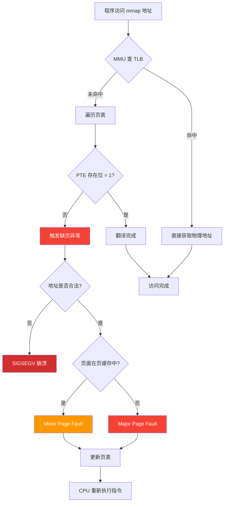
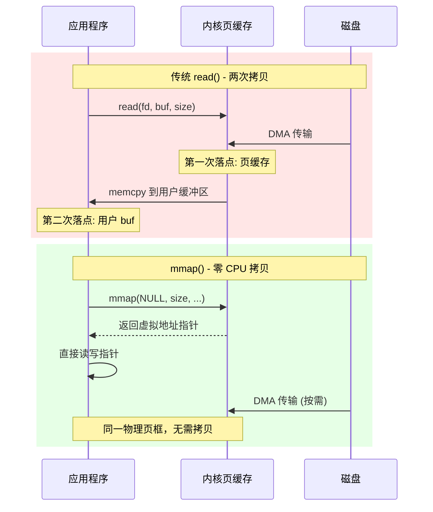

# 第四章：零拷贝存储 — 虚拟内存与 mmap 持久化

## 前置知识

> 📎 **参考**: [构建环境配置](../prerequisites/01_构建环境配置.md)

---

## 学习目标
- 理解虚拟内存的核心概念：地址空间、页、页表、TLB、缺页异常
- 认识 mmap 的工作原理及"零拷贝"的真正含义
- 掌握操作系统页缓存（page cache）及脏页回写机制
- 理解 MAP_SHARED vs MAP_PRIVATE 的差异及写时复制（CoW）
- 设计可持久化、可扩展的磁盘数据格式
- 安全地扩展 mmap 映射区域（ftruncate + remap）
- 理解 msync 与数据持久性保障
- 初步了解 WAL（Write-Ahead Log）与崩溃恢复

---

## 4.0 问题的起点：读一个 1GB 文件，为什么必须复制 1GB 数据？

最直觉的做法是 `read()` 系统调用。你调用 `read(fd, buf, size)`，操作系统把文件内容从磁盘搬运到你提供的缓冲区。

但这引出一个关键问题：**数据被复制了两次**。

```
第一次复制：磁盘 → 操作系统内核的"页缓存"（page cache）
第二次复制：页缓存 → 你的 buf（用户空间缓冲区）
```

如果你的数据库文件有 1GB，那么 `read()` 就必须在内存中搬运 1GB 的数据两次。在 DDR4-3200 内存（理论带宽约 25 GB/s）上，这浪费了大约 80ms 的纯拷贝时间。

**核心洞察**：如果操作系统能让你的程序"直接看到"页缓存中的数据，而不需要把数据再复制一份到你的 buf 中，就能同时省掉 1GB 的内存浪费和 1GB 的拷贝开销。这就是 mmap 要解决的问题。

---

## 4.1 虚拟内存：操作系统最伟大的发明

### 4.1.1 如果物理内存直接暴露给程序会怎样？

在早期计算机系统中（1970 年代以前），计算机程序直接使用**物理内存地址**。这种设计简单但带来了三个严重问题：

**问题 1：进程隔离不存在。** 进程 A 写入了地址 `0x00100000`，进程 B 也读这个地址——B 可以偷看 A 的数据。

**问题 2：外部碎片化。** 物理内存被切成碎片，没有连续的区域满足大块分配请求。

**问题 3：无法做"懒加载"。** 进程向操作系统要 1GB 内存，但这 1GB 中 99% 的区域可能永远不会被实际读写。

### 4.1.2 虚拟内存的解决方案

**虚拟内存**（Virtual Memory）为每个进程创建一个"幻觉"——一个独立的、巨大的**虚拟地址空间**。进程在这个虚拟空间中任意分配内存，CPU 的 **MMU**（Memory Management Unit，内存管理单元）负责在幕后将虚拟地址翻译成物理地址。

### 4.1.3 什么是页（Page）？

**页**（page）是虚拟内存系统的最小管理单元。x86-64 标准页大小为 4 KB。

### 4.1.4 页表：虚拟地址到物理地址的字典

**页表**（Page Table）本质上是一个分层数据结构（4 或 5 级），由操作系统维护。CPU 每执行一条内存访问指令，都必须将虚拟地址转换为物理地址。

### 4.1.5 TLB：CPU 内部的翻译缓存

**TLB**（Translation Lookaside Buffer）是 MMU 内部的硬件缓存，缓存最近使用的虚拟→物理地址翻译结果。没有 TLB，每次内存访问都要先做 4 次页表遍历——性能灾难。

### 4.1.6 缺页异常：RAM 不够用时怎么办

### 缺页异常处理流程



| 类型 | 发生条件 | 延迟 |
|---|---|---|
| Minor | 页面已在物理 RAM 中，只需更新页表 | ~1-10 µs |
| Major | 页面必须从磁盘读取 | ~5-20 ms（SSD） |
| Invalid | 访问未映射的地址 | 进程终止 |

---

## 4.2 mmap：让文件像内存一样直接访问

### 4.2.1 什么是 mmap？

**mmap**（memory map，内存映射）是 POSIX 系统调用，用于在进程的虚拟地址空间中创建一段**内存映射区域**。这段区域可以直接通过指针访问，底层的数据由内核自动管理。

### read() vs mmap() 数据流对比



### 4.2.2 为什么叫"零拷贝"？

**"零拷贝"（zero-copy）** 这个术语有些夸张——数据仍然需要从磁盘读取到 RAM（有拷贝），但**省去了从内核缓冲区到用户缓冲区的第二次拷贝**。对于 3 GB 的向量数据库文件，省去一次 3 GB 的 memcpy 意味着：
- 省去 3 GB 的内存带宽
- 不浪费物理内存
- 减少 CPU 开销

### 4.2.3 什么是"操作系统页缓存"？

**操作系统页缓存**（Page Cache）是 Linux 内核在物理 RAM 中维护的、与磁盘文件关联的缓存。核心属性：

1. 按文件+偏移组织
2. 自动预读（Readahead）
3. 回写（Writeback）：对 MAP_SHARED 映射的写入会标记页面为"脏"
4. 全局共享：同一个文件被两个进程分别 mmap 时共享同一份页缓存

### 操作系统内存使用模式


### 4.2.4 MAP_SHARED vs MAP_PRIVATE vs MAP_ANONYMOUS

```
MAP_SHARED（共享映射）：
  写入直接作用于页缓存中的页面，脏页最终被写回磁盘
  其他 mmap 同一文件的进程看到写入
  这是最常用于持久化存储的模式

MAP_PRIVATE（私有映射）：
  读取：与 SHARED 相同
  写入：触发写时复制（CoW）→ 内核分配新物理页框
  原始文件不变

MAP_ANONYMOUS（匿名映射）：
  不与任何文件关联，等价于 malloc 的底层实现
```

### 4.2.5 写时复制：Copy-on-Write（CoW）

**写时复制**（CoW）是 MAP_PRIVATE 背后的关键技术。它也是 `fork()` 系统调用的基础——当父进程 fork 出子进程时，子进程的页表指向与父进程相同的物理页面，但这些页面全部被标记为只读。只有当第一次写入某个页面时，内核才真正复制该页。

---

## 4.3 数据持久性：msync 与脏页管理

### 4.3.1 msync："我现在就要保证数据到了磁盘"

```c
int msync(void* addr, size_t length, int flags);

// flags:
//   MS_ASYNC      — 发起写回请求，函数立即返回
//   MS_SYNC       — 阻塞直到脏页被写回存储设备
//   MS_INVALIDATE — 使当前映射的缓存失效
```

**关键警告**：`close(fd)` **不保证触发写回**。正确的关闭流程：
```cpp
msync(ptr, len, MS_SYNC);   // 1. 强制刷盘
munmap(addr, len);           // 2. 解除映射
close(fd);                   // 3. 关闭文件描述符
```

---

## 4.4 磁盘格式设计：如何把向量索引持久化到文件中

### 4.4.1 DeepVector 的磁盘布局

```
偏移 0 (offset 0)
+=====================+
| Magic Number (4B)   |  0x4C4D4442 = "LMDB" in ASCII
+---------------------+
| Version (4B)        |  1（文件格式版本号）
+---------------------+
| Dimension (4B)      |  768（每个向量的维度）
+---------------------+
| Vector Count (8B)   |  N（数据库中存储的向量总数）
+---------------------+
| Metric Type (4B)    |  0=L2, 1=IP, 2=Cosine
+---------------------+
| Flags (4B)          |  bit0: 归一化标志, bit1: AVX-512 兼容标志
+---------------------+
| Reserved (40B)      |  留空，使头部总计为 64 字节（与缓存行对齐）
+=====================+  偏移 64
| Index Header (64B)  |  HNSW 元数据：M, ef_construction, max_level, entry_point_id
+=====================+  偏移 128
| Index Graph (变长)   |  邻接表 [node_id][neighbor_count][neighbor_ids × 4B]
+=====================+  偏移对齐到页边界
| Vector Data         |  [id(8B)][vec_0(4B)]...[vec_D-1(4B)] × N
+=====================+
```

---

## 4.5 安全地扩展 mmap 文件

### 跨平台方案：munmap + ftruncate + mmap

```cpp
class GrowableMmapFile {
    int fd;
    void* ptr;
    size_t mapped_size;

public:
    void grow(size_t new_size) {
        if (new_size <= mapped_size) return;
        new_size = align_up(new_size, 4096);

        msync(ptr, mapped_size, MS_SYNC);     // 1. 先刷盘脏数据
        munmap(ptr, mapped_size);             // 2. 解除旧映射
        ftruncate(fd, new_size);              // 3. 扩展文件
        ptr = mmap(NULL, new_size, PROT_READ | PROT_WRITE,
                   MAP_SHARED, fd, 0);        // 4. 重新映射
        mapped_size = new_size;
        // ⚠️ ptr 可能变了！不能依赖旧的指针
    }
};
```

### Linux 的高效替代方案：mremap

```c
#define _GNU_SOURCE
#include <sys/mman.h>

void* new_ptr = mremap(old_ptr, old_sz, new_sz, MREMAP_MAYMOVE);
```

mremap 的优势：不触发 TLB 刷新，不重建 VMA，比 munmap+mmap 快很多。

---

## 4.6 崩溃安全：WAL（Write-Ahead Log）

mmap 的直接写入在崩溃时是个问题：写入的是内存，而内存中的数据可能还没刷到磁盘。

**Write-Ahead Log（WAL，写前日志）** 是数据库系统解决这个问题的标准方法：

```
正常操作流程：
  1. 将"我要做什么"记录到 WAL 文件（追加写入，用 fdatasync 确保持久性）
  2. 在内存（mmap）中执行实际修改
  3. 定期做 checkpoint：将 WAL 中记录的所有修改同步到主数据文件

崩溃恢复流程：
  1. 重新打开数据库时检查 WAL 文件
  2. 从最后一个 checkpoint 位置开始，重放 WAL 中记录的所有操作
  3. 截断 WAL，数据恢复一致
```

---

## 4.7 动手实现：可持久化的浮点数组

在 `ch04_mmap_storage/code/mmap_array.cpp` 实现一个完整的示例：

```cpp
#include <sys/mman.h>
#include <sys/stat.h>
#include <fcntl.h>
#include <unistd.h>
#include <cstring>
#include <cstdint>
#include <iostream>
#include <vector>
#include <cassert>

struct Header {
    uint32_t magic;
    uint32_t version;
    uint64_t element_size;
    uint64_t count;
    uint64_t capacity;
    uint8_t reserved[40];

    static constexpr uint32_t MAGIC = 0x4C4D4442;
    static constexpr uint32_t VERSION = 1;
};

class MmapFloatArray {
    int fd;
    void* ptr;
    size_t file_size;
    Header* header;

    size_t data_offset() const {
        return (sizeof(Header) + 63) & ~63ULL;
    }

    void init_file(size_t capacity) {
        file_size = data_offset() + capacity * sizeof(float);
        ftruncate(fd, file_size);
        ptr = mmap(NULL, file_size, PROT_READ | PROT_WRITE, MAP_SHARED, fd, 0);
        if (ptr == MAP_FAILED) { perror("mmap init"); exit(1); }
        header = reinterpret_cast<Header*>(ptr);
        header->magic = Header::MAGIC;
        header->version = Header::VERSION;
        header->element_size = sizeof(float);
        header->count = 0;
        header->capacity = capacity;
    }

    void load_existing() {
        struct stat st;
        fstat(fd, &st);
        file_size = st.st_size;
        ptr = mmap(NULL, file_size, PROT_READ | PROT_WRITE, MAP_SHARED, fd, 0);
        if (ptr == MAP_FAILED) { perror("mmap load"); exit(1); }
        header = reinterpret_cast<Header*>(ptr);
        if (header->magic != Header::MAGIC) {
            std::cerr << "Error: Bad magic number!" << std::endl;
            exit(1);
        }
    }

public:
    MmapFloatArray(const char* path, size_t capacity = 1024) {
        fd = open(path, O_RDWR | O_CREAT, 0644);
        if (fd < 0) { perror("open"); exit(1); }
        struct stat st;
        fstat(fd, &st);
        if (st.st_size == 0) init_file(capacity);
        else load_existing();
    }

    ~MmapFloatArray() {
        msync(ptr, file_size, MS_SYNC);
        munmap(ptr, file_size);
        close(fd);
    }

    void push_back(float val) {
        if (header->count >= header->capacity)
            grow(header->capacity * 2);
        float* data = reinterpret_cast<float*>(
            reinterpret_cast<char*>(ptr) + data_offset());
        data[header->count++] = val;
    }

    float at(size_t i) const {
        float* data = reinterpret_cast<float*>(
            reinterpret_cast<char*>(ptr) + data_offset());
        return data[i];
    }

    size_t size() const { return header->count; }
    size_t capacity() const { return header->capacity; }

    void grow(size_t new_capacity) {
        size_t new_file_size = data_offset() + new_capacity * sizeof(float);
        msync(ptr, file_size, MS_SYNC);
        munmap(ptr, file_size);
        ftruncate(fd, new_file_size);
        ptr = mmap(NULL, new_file_size, PROT_READ | PROT_WRITE, MAP_SHARED, fd, 0);
        if (ptr == MAP_FAILED) { perror("mmap grow"); exit(1); }
        header = reinterpret_cast<Header*>(ptr);
        header->capacity = new_capacity;
        file_size = new_file_size;
    }
};

int main() {
    const char* path = "test_float_array.bin";

    {
        std::cout << "=== Round 1: Writing ===" << std::endl;
        MmapFloatArray arr(path, 8);
        for (int i = 0; i < 10; i++) arr.push_back(i * 1.5f);
        std::cout << "Size: " << arr.size() << "  Capacity: " << arr.capacity() << std::endl;
    }

    {
        std::cout << "\n=== Round 2: Re-reading ===" << std::endl;
        MmapFloatArray arr(path);
        assert(arr.size() == 10);
        assert(arr.capacity() == 16);
        for (size_t i = 0; i < arr.size(); i++) {
            assert(arr.at(i) == i * 1.5f);
            std::cout << "  [" << i << "] = " << arr.at(i) << std::endl;
        }
    }

    unlink(path);
    std::cout << "\nAll tests passed!" << std::endl;
    return 0;
}
```

编译运行：
```bash
g++-12 -O3 -std=c++17 mmap_array.cpp -o mmap_array
./mmap_array
```

---

## 思考题

1. 为什么 `close(fd)` 不会触发 msync？
2. MAP_SHARED 的 mmap 与同一文件上其他进程的 `read()` 之间如何保证一致性？
3. 为什么网络文件系统（NFS）上的 mmap 行为复杂？
4. 设计一种方案，使 mmap 数组支持多线程并发读写。需要考虑哪些竞态条件？
5. Arrow/Feather 格式为什么选择列式存储？这对 mmap 的 page fault 模式有什么影响？

---

## 动手练习

1. 修改 `MmapFloatArray`，添加"逻辑删除"操作。
2. 实现一个带基础 WAL 的 mmap 存储。流程：写入前先追加到 WAL → fdatasync WAL → 修改 mmap。
3. 对比 mmap 和传统 `pread`/`pwrite` 在大文件随机读场景下的性能差异。
4. 测试使用 2MB 大页（Huge Pages, `MAP_HUGETLB`）对向量搜索性能的影响。
5. 用 mmap 读取一个 Arrow Feather 文件（`.arrow`），验证其零拷贝特性。
