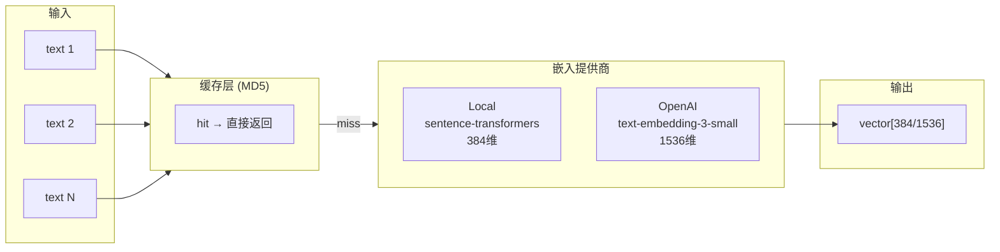

# 第五章：嵌入服务

> Embedding Service — 连接文本和向量的桥梁。

## 前置知识

> 📎 **参考**: [Python环境](../prerequisites/02_Python环境_zh.md) | [距离度量](../prerequisites/05_距离度量_zh.md)

---

## 学习目标

- 理解本地嵌入和云端嵌入的差异
- 掌握嵌入缓存的设计
- 学会批量处理文本向量化

---

## 5.1 嵌入服务架构



---

## 5.2 核心代码

```python
class EmbeddingService:
    def __init__(self, config: EmbeddingConfig):
        self.config = config
        self._local_model = None  # 延迟加载
        self._cache = {}

    async def embed(self, texts: List[str]) -> List[List[float]]:
        if self.config.provider == "local":
            return await self._embed_local(texts)
        elif self.config.provider == "openai":
            return await self._embed_openai(texts)
```

---

## 5.3 Provider 对比

| 特性 | 本地 (all-MiniLM-L6-v2) | OpenAI (text-embedding-3-small) |
|------|------------------------|-------------------------------|
| 维度 | 384 | 1536 |
| 速度 | ~100 text/s (CPU) | ~500 text/min (API 限速) |
| 费用 | 免费 | $0.0001/1K tokens |
| 隐私 | 数据不出本地 | 数据发送到 OpenAI |
| 启动耗时 | ~3s (第一次加载模型) | 0 |

默认选择本地嵌入的原因：
1. **零成本** — 不需要 API Key
2. **低延迟** — 无网络请求，384 维也足够小
3. **隐私** — 数据不离开本地

---

## 5.4 缓存机制

```python
async def _embed_openai(self, texts):
    # 检查缓存
    uncached = []
    for text in texts:
        key = self._cache_key(text)
        if key not in self._cache:
            uncached.append(text)
    
    # 只请求未缓存的部分
    if uncached:
        vectors = await self._fetch_openai_embeddings(uncached)
        for text, vec in zip(uncached, vectors):
            self._cache[self._cache_key(text)] = vec
```

> **缓存策略**: MD5 hash → vector。缓存持久化到 JSON 文件，重启后仍可用。
> 在实际生产中，建议使用 Redis 替代本地 JSON 文件。

---

## 思考题

1. 如果 embedding 模型的输出维度 (384) 和 DeepVector 配置的维度 (768) 不一致会发生什么？
2. 缓存 JSON 文件在并发写入时可能有什么问题？如何改进？
3. 什么场景下应该使用 OpenAI embedding 而非本地的？

## 动手练习

1. 测量 `all-MiniLM-L6-v2` 在你机器上的嵌入速度 (不同 batch_size)
2. 将缓存后端从本地 JSON 改为 Redis
3. 添加一个 `embed_dim` 自动检测机制：插入前检查向量维度是否匹配
