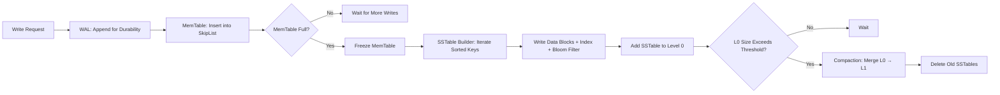
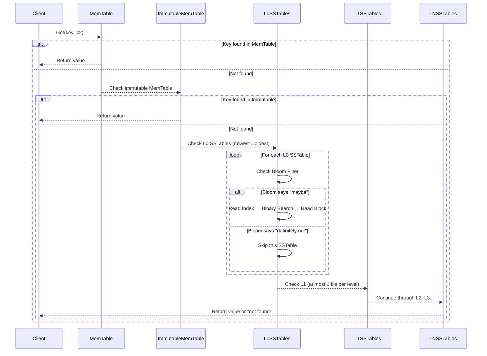
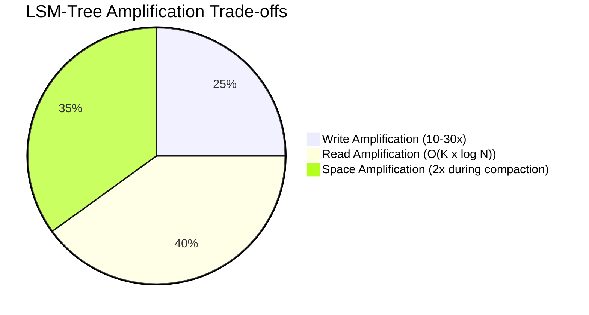

# Chapter 5 — LSM-Tree & MiniKV Internals

## Prerequisites

> 📎 **Reference**: [Build Environment Configuration](../prerequisites/01_构建环境配置_en.md) — CMake, compilers, and build commands
> 📎 **Reference**: [Testing Framework](../prerequisites/04_测试框架_en.md) — CTest, GoogleTest, assertions, and test organization

## 5.1 What Is a Storage Engine?

Imagine driving a car. You press the accelerator, turn the steering wheel, and the car moves. You never think about the pistons, the crankshaft, the fuel injection system. But without them, the steering wheel is just a piece of plastic.

A **storage engine** is the engine of a database. It's the bottommost layer — the part that actually puts bytes onto a disk and gets them back. The query parser, the optimizer, the network layer — all of those are the steering wheel and dashboard. The storage engine is the pistons. It answers two questions: "Where do I put this data?" and "How do I find it again?"

Every database has one. MySQL lets you choose between InnoDB and MyISAM. MongoDB uses WiredTiger. LevelDB and RocksDB *are* storage engines — libraries that other databases (like CockroachDB, TiKV, and in our case DeepVector's MiniKV) embed.

A storage engine has to solve three hard problems simultaneously:
1. **Durability**: once you say "committed," the data must survive a power failure.
2. **Throughput**: you might need to handle a million writes per second.
3. **Retrieval**: you need to find one key among billions, in microseconds.

These three goals are in tension. Making writes fast tends to scatter data across the disk, which makes reads slow. Making reads fast tends to require organized, balanced structures that are expensive to update. This tension is the central story of storage engine design.

**Key term: storage engine.** The component of a database responsible for persisting data to disk and reading it back. It sits beneath the query layer and handles all I/O. Examples: InnoDB (MySQL), WiredTiger (MongoDB), LevelDB, RocksDB.

---

## 5.2 A Brief History: From B-Trees to LSM-Trees

### The B-Tree (1970s)

In 1970 (report) / 1972 (journal), Rudolf Bayer and Edward McCreight at Boeing Scientific Research Labs published a paper describing a new data structure: the **B-Tree** (the "B" has never been officially explained — Bayer says it could stand for "balanced," "broad," or "Boeing").

A **B-Tree** is a balanced tree where each node is exactly one **disk page** (typically 4 KiB, or 4096 bytes). A node with N keys has exactly N+1 children. Because each node is page-sized, reading a node is exactly one disk I/O. Finding any key takes O(log_B N) reads, where B is the **branching factor** (the number of children per node). With B ≈ 500 (a 4 KiB page holding roughly 500 key-pointer pairs), you can find any key among a billion rows in just 3 disk reads.

Think of a B-Tree like a library with a hierarchy of indexes. The root page says "authors A-M are on shelf 2, N-Z on shelf 7." Shelf 2's index says "A-D are in aisle 3, E-M in aisle 5." Aisle 3's index says "Anderson is row 4, Beckett is row 6..." You never scan — you drill down.

**Key terms:**

- **B-Tree**: A self-balancing tree data structure that maintains sorted data and allows searches, sequential access, insertions, and deletions in O(log N) time. Each node corresponds to a disk page, minimizing the number of disk I/O operations needed.
- **Disk page**: The smallest unit of data that a storage system reads or writes in a single I/O operation. On most systems, one page = 4096 bytes (4 KiB). When you read from disk, you always read an entire page, even if you only need one byte.
- **Branching factor**: The number of children per node in a tree. In a B-Tree, a node with k keys has k+1 children. A higher branching factor means fewer levels and fewer disk reads.
- **In-place update**: The strategy of modifying data directly at its current location on disk. The B-Tree reads a page, modifies it, and writes the same page back. The alternative (used by LSM-Trees) is to never overwrite existing data.

The B-Tree was the right answer in the 1970s. Disks were small, RAM was tiny, and databases were measured in megabytes. Reads dominated — writes were rare. The B-Tree gave you O(log N) reads and writes, which was excellent.

But there was a catch.

### The Write Amplification Problem

Suppose you update a single row in a B-Tree. That row lives on a leaf page. You read the page (one disk seek), modify the row, and write the page back (another seek). But what if the leaf is full? You have to split it. Now the parent node needs updating too. And the grandparent. In the worst case, updating 16 bytes of user data causes the database to write 4096 × 5 = 20,480 bytes — over 1000× more than the actual change. This ratio — the total bytes of I/O divided by the bytes of user data — is called **write amplification**.

**Key term: write amplification.** The ratio of total bytes written to the storage device versus the bytes of actual user data. If you write 1 KB of user data but the storage engine ends up writing 10 KB to disk (due to page rewrites, index updates, journal logging), the write amplification is 10×. High write amplification wastes I/O bandwidth and shortens SSD lifespan.

Write amplification wasn't a crisis when disks were slow and sequential (HDDs in the 1970s-1990s could do ~100 IOPS — input/output operations per second). A few extra seeks were fine because there weren't that many writes. But two things changed by the 1990s:
1. Databases grew to gigabytes and terabytes. Indexes got deeper. More levels means more pages to modify per change — higher write amplification.
2. Software (Google, Amazon, financial trading) started producing writes at rates that HDDs couldn't handle. 100 random writes per second on spinning rust doesn't go very far.

**Key term: IOPS (Input/Output Operations Per Second).** A measure of storage performance: how many separate read or write operations the device can handle per second. A typical HDD manages ~100 IOPS for random writes. A modern SSD manages ~50,000–500,000 random write IOPS. This 1000× gap is a major reason LSM-Trees exist.

### The LSM-Tree (1996)

Patrick O'Neil and colleagues published "The Log-Structured Merge-Tree" in *Acta Informatica* (1996) with a radical idea: **don't overwrite anything, ever**. Instead, buffer writes in memory first, then dump them to disk sequentially. Every write is just appending to a file. No seeks. No overwrites. No split pages.

**Key terms:**

- **LSM-Tree (Log-Structured Merge-Tree)**: A storage engine design that buffers writes in memory (in a MemTable), then flushes them to disk as immutable sorted files (SSTables). Reads are served by checking the MemTable first, then searching SSTables from newest to oldest. Background **compaction** merges SSTables to reclaim space and maintain read performance. The key insight is trading read amplification for lower write amplification by converting random writes into sequential writes.

- **Log-Structured**: The "log" in LSM-Tree refers to the append-only, sequential nature of writes. Data is written to a log (a sequence of entries, like a ship's logbook), never modified in place. This is similar to a **log file** — a file you only append to, never seek into and overwrite.

Think of a B-Tree as a ledger where you erase old entries and write new ones in the same spot. An LSM-Tree is a ledger where you never erase — you just keep writing new pages at the bottom. Periodically, you gather up loose pages, sort them, and bind them into a book. This is called **compaction**.

The insight: sequential writes are 100-1000× faster than random writes on spinning disks (and even 10× faster on SSDs, because flash erase blocks are large). By accepting higher read amplification (you may have to check multiple files to find a key), you get much lower write amplification.

### The Notebook Analogy

To understand LSM-Trees intuitively, think of a student taking notes:

- **MemTable = your current notebook page.** You're writing entries in order as they come in. Once the page is full, you close that page and start a new one.
- **SSTable = a completed notebook page, sealed and placed on the shelf.** Once you close a page, you never modify it. It's a permanent, sorted record. You might have dozens of completed pages on the shelf.
- **Reading a key = searching for a note.** First you check your current page (MemTable). If it's not there, you look through the sealed pages on the shelf (SSTables), starting with the most recent one, because newer data is more likely to be what you want.
- **Compaction = reorganizing the shelf.** After a while, you have too many pages. You combine related pages, discard outdated entries (superseded updates, deleted items), and create new, denser pages. The shelf stays organized.

This is the fundamental LSM-Tree mental model: buffer in memory, seal to disk, search from newest to oldest, periodically clean up.

### LSM-Tree Write Path Visualization



### The LSM-Tree Origin Paper and Its Legacy

O'Neil's 1996 paper introduced the formal concept, but the real-world impact came later:

1. **Google Bigtable (2006)**: Google's distributed storage system used SSTables (Sorted String Tables) as the on-disk format for a distributed LSM-Tree. The paper by Chang et al. introduced the term "SSTable" and showed how LSM-Trees could scale to petabytes across thousands of machines. This was the paper that made LSM-Trees mainstream in industry.

2. **LevelDB (2011)**: Google open-sourced LevelDB, a C++ library implementing an LSM-Tree storage engine. It was the first widely available, production-quality implementation of the O'Neil concept with leveled compaction. Many databases (CockroachDB, TiDB, others) adopted LevelDB as their storage layer.

3. **RocksDB (2012)**: Facebook forked LevelDB and added features needed for production workloads at scale: column families, snapshots, bloom filters, compression, and highly tunable compaction. RocksDB is now the default storage engine for dozens of major systems (MySQL's MyRocks, TiKV, CockroachDB, Kafka's Tiered Storage, and our DeepVector's MiniKV).

4. **Cassandra, HBase, CockroachDB, TiKV**: All use LSM-Tree variants. The names change (MemTable vs. Memstore, SSTable vs. Sorted File), but the architecture is universal.

| | B-Tree | LSM-Tree |
|---|---|---|
| Write path | In-place update (seek + overwrite) | Append-only + background merge |
| Read path | Single disk seek, O(log_B N) | Check MemTable → Bloom → SSTables |
| Write amplification | 10-50× (page rewrites) | 10-30× (compaction rewrites, tunable) |
| Read amplification | 1× (one read gets you the key) | O(K × log N) where K = number of levels |
| Space amplification | Fragmentation overhead | Temporarily 2× during compaction |
| Best for | Read-heavy, low-latency point lookups (OLTP) | Write-heavy, time-series, logs, DeepVector vectors |

**LSM-Tree is why DeepVector's MiniKV exists.** Vector inserts are write-heavy: every new embedding is a new write. Reads are important too, but LSM-Tree lets us optimize for the write path while keeping reads acceptable through Bloom filters and careful compaction.

---

## 5.3 The Write-Ahead Log (WAL)

Before we can talk about MemTables or SSTables, we have to talk about the most important file in any database: the WAL.

### What Is the WAL?

The **WAL (Write-Ahead Log)**, also called the **redo log** or **transaction log**, is an append-only file that records every modification before it is applied to the database. The WAL is the foundation of crash recovery in virtually every modern database.

**Key terms:**

- **WAL (Write-Ahead Log)**: An append-only file where the database records every write operation *before* applying it to the in-memory data structures or on-disk files. If the system crashes, the WAL contains the complete record of what was committed, allowing the database to replay operations and recover to a consistent state.

- **Write-ahead**: A safety protocol: you must write the log entry (the description of the change) *ahead of* (before) you apply the change to the actual data. The word "ahead" is critical — the log must be on durable storage before any modification is considered committed.

- **Crash recovery**: The process of restoring a database to a consistent state after an unexpected shutdown (power failure, OS crash, process kill). The database reads its WAL and replays committed operations, discarding uncommitted ones. Without a WAL, a crash could leave the database in a partially-modified, inconsistent state.

- **Durability**: The "D" in ACID (Atomicity, Consistency, Isolation, Durability). Once a transaction is committed, the data must survive any subsequent failure — power outage, hardware failure, OS crash. The WAL is the mechanism that provides durability.

### Why "Write-Ahead"?

A computer has a power cord. Someone can pull it. When the machine comes back up, what state is the database in?

This is the crash recovery problem. The solution is elegantly simple: **before you modify any on-disk data structure (the MemTable's SSTable, the index pages, anything), you first write what you're about to do to an append-only log.** That log is the Write-Ahead Log.

The key word is *ahead*. You write the log entry first. Only after the log entry is safely on disk (via `fsync`, which forces the OS to flush the write cache to physical media) do you modify the in-memory data structure. If the machine crashes between the log write and the in-memory update, the log entry survives and can be replayed.

Think of the WAL like a ship's log. Before the captain does anything — changes course, adjusts speed — an entry goes into the logbook. If the ship sinks, the logbook (waterproof, floating) tells rescuers what happened. The WAL is the database's waterproof logbook.

**Key term: fsync (or fsync).** A system call that forces all buffered writes for a file descriptor to be physically written to the storage device, not just to the OS page cache. After `fsync` returns, the data is guaranteed to survive a power failure. `fsync` is slow (~1ms on SSDs) because it must wait for the storage device to confirm the write.

### Group Commit

`fsync` is expensive. On a typical SSD, `fsync` takes about 1 millisecond. If you `fsync` after every write, your maximum throughput is 1000 writes/second — regardless of how fast your CPU is.

The solution is **group commit**: batch multiple writes together under a single `fsync`. If 1000 writes arrive while you're waiting for the last `fsync` to complete, you write all 1000 of them, call `fsync` once, and they all become durable together. The per-write cost drops from ~1 ms to ~1 µs. Throughput jumps from 1000 to 1,000,000 writes/second.

The trade-off is latency: a write may wait up to one `fsync` interval (typically 1-10 ms) before being committed. For most applications, this is acceptable — the 1000× throughput gain is worth a few milliseconds of extra latency.

### WAL Frame Format

Every entry in the WAL is a self-describing **frame**:

```
┌──────────┬────────┬──────────┬───────────┬──────────────────┐
│ CRC32 (4)│ Len (4)│ Seq (8)  │ Type (1)  │ Payload (N)      │
└──────────┴────────┴──────────┴───────────┴──────────────────┘
```

- **CRC32** (Cyclic Redundancy Check, 4 bytes): a checksum of the entire frame (including the length field). If the CRC doesn't match, the frame is corrupt. This catches partial writes — the classic failure mode: the OS writes half the frame, then the power fails. On recovery, the CRC fails and we discard the partial frame.

  **Key term: CRC32 (Cyclic Redundancy Check).** A hash function that takes a block of data and produces a 4-byte checksum. It's used to detect accidental changes to raw data. If even one bit changes in the frame, the CRC will almost certainly be different, allowing the database to detect corruption. CRC32 is not cryptographic — it's designed for speed, not security.

- **Length** (4 bytes): the total frame length, so we know where the next frame starts.

- **Sequence number** (8 bytes): a monotonically increasing 64-bit counter. Every mutation — put, delete, transaction begin — gets a globally unique sequence number. This orders all operations across the entire database.

  **Key term: sequence number.** A unique, monotonically increasing identifier assigned to every write operation. Sequence numbers establish a total ordering of all mutations: if operation A has sequence 100 and operation B has sequence 200, A happened before B. This ordering is essential for replication, conflict resolution, and snapshot isolation.

- **Type** (1 byte): PUT, DELETE, BEGIN_TXN, COMMIT, ROLLBACK.

- **Payload** (N bytes): the key and value, length-prefixed.

Why doesn't the CRC cover itself? Because you need to know what to checksum. The CRC is the last thing written. You compute the CRC over the frame body, then write the CRC prefix. On recovery, you read the CRC, read the rest, compute the CRC over the rest, and compare. If the CRC itself were covered, you'd have an infinite regress.

### WAL Code Sketch

```cpp
class WAL {
public:
    Status Append(const Slice& key, const Slice& value, uint64_t seq, RecordType type);
    Status Recover(std::function<void(Slice,Slice,uint64_t,RecordType)> callback);

private:
    int fd_;
    uint32_t block_offset_ = 0;  // within current 32 KiB block
};
```

`Append` packs the frame, computes the CRC, writes to the file descriptor (wrapping `pwrite`), and periodically calls `fsync`. `Recover` reads the file sequentially, validates each frame's CRC, and calls the callback for each valid entry. Partial frames at end-of-file are silently ignored.

---

## 5.4 The MemTable — Absorbing Writes

The MemTable is the second piece of the LSM-Tree pipeline. After writing to the WAL (for durability), the write goes into an in-memory sorted data structure — the **MemTable**. Writes are accumulated here until the MemTable exceeds a size threshold (e.g., 64 MiB or 1 million entries). At that point, the MemTable is "frozen" — made immutable — and a new empty MemTable takes its place. The frozen MemTable is then flushed to disk as an **SSTable**.

**Key terms:**

- **MemTable (Memory Table)**: An in-memory data structure that holds recent write operations in sorted order. It is the "write buffer" of an LSM-Tree. Reads check the MemTable first (because it contains the most recent data). Once the MemTable reaches a size limit, it is frozen (made immutable) and flushed to disk as an SSTable.

- **Immutable**: A data structure that cannot be modified after creation. An immutable MemTable, once frozen, is never written to again. Immutability is a core principle of LSM-Tree design: it eliminates the need for locks during reads and flushes.

- **Flush**: The process of writing the contents of an in-memory buffer (the MemTable) to disk as an SSTable. A flush converts volatile, temporary data into durable, permanent storage. The name comes from "flushing to disk."

- **Size threshold**: The maximum size a MemTable can reach before being flushed. Typical values are 16 MiB to 256 MiB. This is a tunable parameter: larger MemTables reduce flush frequency (better write throughput) but increase memory usage and recovery time (more WAL entries to replay).

The MemTable must support:
- **O(log N) point lookup**: find a single key quickly.
- **O(N) ordered traversal**: iterate keys in sorted order (needed during flush to SSTable).
- **Concurrent access**: reads shouldn't block other reads.

The classic choice is a **SkipList**, invented by William Pugh in 1990.

### What Is a SkipList?

Imagine a sorted linked list. To find key "42", you walk from the head, checking each node: 3, 7, 15, 42. That's O(N). Painful.

Now imagine adding an "express lane" — a second linked list that skips every other element. To find 42, you ride the express lane: 7 (still before 42), then 42. You skipped 15 entirely.

Now add a third lane that skips 3 out of 4 elements. A fourth that skips 7 out of 8. You now have a structure that looks like this:

```
Level 3:  H ────────────────────────────────> T
Level 2:  H ───────────> 42 ────────────────> T
Level 1:  H ──> 7 ──────> 42 ───> 99 ──────> T
Level 0:  H->3->7->15->42->63->99->T
```

To search for a key, you start at the head's topmost lane. You advance while the next node's key is less than your target. When it's not, you drop down one level and continue. You reach level 0 with at most O(log N) total hops. Insert works the same way, but you also remember the "update" nodes at each level (the node just before where the new key belongs) so you can splice in the new node.

The brilliance of the SkipList is that the levels are assigned **probabilistically**, not balanced like a tree. When inserting, you flip a coin: heads → add one more level, tails → stop. The probability of reaching level k is (1/2)^k. This means:
- Half the nodes are on level 0 (the base list)
- A quarter are on level 1
- An eighth on level 2
- And so on

The result: O(log N) expected time for search, insert, and delete — with far simpler code than a balanced tree. No rotations, no rebalancing, no color flipping. Just coin flips and pointer splicing.

Pugh's key observation: for a SkipList to work, you don't need perfect balance — you just need *expected* balance. The coin flips give you that, with high probability.

**Key terms:**

- **SkipList**: A probabilistic data structure that provides O(log N) average-time search, insert, and delete within an ordered sequence. It achieves this by maintaining multiple levels of linked lists, where each higher level acts as an "express lane" that skips elements. Levels are assigned randomly during insertion. Invented by William Pugh in 1989.

- **Expected time**: The average-case performance over many operations. SkipLists guarantee O(log N) *expected* (average) time, not O(log N) *worst-case* time. In practice, the probability of worse-than-O(log N) is astronomically small (for N = 2^32, the probability of a path longer than 2×log N is less than 1 in a billion).

```cpp
template <typename Key, typename Value>
class SkipList {
    struct Node {
        Key key;
        Value value;
        std::vector<Node*> next;  // next[i] for level i
        Node(const Key& k, const Value& v, int height)
            : key(k), value(v), next(height, nullptr) {}
    };
    Node* head_;
    int max_height_;
};
```

### Why SkipList Instead of Red-Black Tree?

SkipLists have two advantages for databases:
1. **Lock granularity**: you can lock individual nodes or levels rather than the whole tree. A balanced tree rotation touches multiple nodes in an unpredictable pattern, making fine-grained locking complex.
2. **Ordered traversal is trivial**: just walk level 0 (the base linked list). A tree requires an explicit iterator with a stack.

The disadvantage: SkipLists use ~1.33× more memory than balanced trees (the extra pointer arrays), and worst-case behavior is theoretically O(N) — though astronomically unlikely in practice (a run of 32 consecutive heads before a tails is ~1 in 4.3 billion).

---

## 5.5 The SSTable — Immutable Sorted File

An **SSTable** (Sorted String Table) is exactly what it sounds like: a file containing sorted key-value pairs. Once written, it is never modified. The concept was popularized by Google's Bigtable paper (2006), though it builds on ideas from LSM-Trees and the Unix philosophy of "do one thing well."

**Key terms:**

- **SSTable (Sorted String Table)**: A file containing key-value pairs sorted by key. Once written, an SSTable is immutable (never modified). SSTables are the on-disk representation of data in an LSM-Tree. Multiple SSTables exist at different "levels," and they are periodically merged during compaction. The sorted order enables efficient binary search within the file.

- **Sorted**: The keys in an SSTable are in ascending order. This is critical because it enables binary search (O(log N) lookup within a single SSTable) and efficient range scans (iterate a contiguous block of keys).

- **Immutable**: The file, once written, is never modified. This is a core LSM-Tree design choice. Immutability means no locks are needed for concurrent reads, no fragmentation occurs, and compression is more effective (sorted data compresses better). The trade-off is that updates and deletes create new files rather than modifying existing ones.

- **Prefix compression**: A compression technique that exploits the sorted order of keys. Consecutive keys often share a common prefix (e.g., `user:100`, `user:101`, `user:102`). Instead of storing the full key each time, we store the shared prefix length and the unique suffix. This can reduce storage by 50-80%.

Why immutable? Immutability is a superpower:
- No locks needed for reads (the file never changes).
- No fragmentation (no overwrites, no split pages).
- Compression works better (sorted data compresses well).
- Crash recovery is simple (just don't reference incomplete files in the manifest).

The SSTable format:

```
┌──────────────────────────────────────────────────────────┐
│ Data Block 0 │ Data Block 1 │ ... │ Data Block N-1       │
├──────────────────────────────────────────────────────────┤
│ Index Block   (last key of each data block → offset)     │
├──────────────────────────────────────────────────────────┤
│ Bloom Filter  (set of all keys in this SSTable)          │
├──────────────────────────────────────────────────────────┤
│ Footer (48 B): index offset, bloom offset, magic number  │
└──────────────────────────────────────────────────────────┘
```

- **Data blocks** are fixed-size (4 KiB). Each block stores key-value pairs with **prefix compression**: since keys are sorted, consecutive keys share a common prefix. Instead of storing the full key, we store the shared prefix length and the unique suffix. For keys like `user:100`, `user:101`, `user:102`, this cuts storage by ~80%.
- **Index block**: a miniature sorted map from the last key of each data block to that block's file offset. To find a key, binary-search the index to find which block might contain it, then read that single block.
- **Bloom filter**: answers "is key X *probably* in this SSTable?" in one bit-array probe. (We'll discuss this in detail below.)
- **Footer**: a fixed 48-byte trailer at the end of the file. Contains the offsets of the index and Bloom filter, plus a magic number to confirm this is an SSTable. Because it's at a known position (file_size - 48), the reader can seek to it without scanning.

---

## 5.6 Compaction — Reclaiming Space

The dirty secret of LSM-Trees: they accumulate garbage. Every update writes a new value; the old value is still sitting in an older SSTable. Every delete writes a tombstone; the deleted key is still in older SSTables. If you never clean up, the database grows without bound.

**Key terms:**

- **Compaction**: The background process that merges multiple smaller SSTables into fewer, larger ones. During compaction, the database reads overlapping SSTables, merges them in sorted order, discards overwritten values (keeping only the newest version of each key), removes tombstones at the bottommost level, and writes new, consolidated SSTables. Compaction is essential for reclaiming space and maintaining read performance.

- **Tombstone (delete marker)**: When you delete a key in an LSM-Tree, you don't immediately remove it from disk. Instead, you write a special "tombstone" marker to the MemTable (and eventually an SSTable). The tombstone signals "this key is deleted." The actual removal happens during compaction, when the tombstone reaches the deepest level and can safely discard the original entry from older levels. A tombstone is necessary because older versions of the key may exist in SSTables that were flushed before the delete arrived.

- **Overwritten value**: When you update a key, the old value still exists in an older SSTable. The newer value in a newer SSTable "wins" during reads. The old value is only removed during compaction, when the newer value supersedes it.

Think of compaction like a waste management system: trash accumulates in bins (level 0), gets collected and sorted (compaction), with recyclables separated and garbage discarded.

### Leveled Compaction (LevelDB, RocksDB default)

- **Level 0**: freshly flushed MemTables. Files here may overlap — two SSTables in level 0 can both contain keys in the range [A, Z].
- **Level 1..N**: each level is roughly 10× larger than the previous. Files within a level are sorted and non-overlapping — a key can exist in at most one file in level 2.
- When a level exceeds its size target, one file is picked and merged with all overlapping files in the next level. The output becomes part of the next level.
- **Write amplification**: a byte written at level 0 is rewritten roughly 10× per level it descends. With a 10× growth factor and 7 levels, a single byte gets rewritten ~70× over its lifetime.

**Key term: leveled compaction.** A compaction strategy where SSTables are organized into numbered levels (L0, L1, L2, ...). Each level has a size target (typically L(i+1) = 10 × L(i)). When a level exceeds its target, files are selected and merged with overlapping files in the next level. The result is that each level has non-overlapping, sorted SSTables (except L0, which can overlap). This provides good read performance (at most one file per level to check) but higher write amplification (each byte is rewritten once per level).

### Tiered Compaction (Cassandra, ScyllaDB)

- Each level contains multiple sorted runs (not one).
- Periodically, all runs in a level are merged into a single run in the next level.
- Higher read amplification (must probe many runs per level), but lower write amplification (fewer and larger compactions).

**Key term: tiered compaction (also called size-tiered compaction).** A compaction strategy where multiple SSTables of similar size are accumulated and then merged together in bulk. Unlike leveled compaction, where files are merged one-at-a-time into the next level, tiered compaction waits until a level has enough files, then merges them all at once. This reduces write amplification (fewer compaction operations) but increases read amplification (more files to check per level).

### Compaction Code Sketch

```cpp
void LeveledCompaction::Compact(Version* current) {
    int level = PickCompactionLevel(current);
    auto inputs = PickCompactionInputs(current, level);
    // K-way merge of all input files
    MergingIterator it(inputs);
    CompactionOutput out(level + 1);
    while (it.Valid()) {
        // drop tombstones at bottommost level, dedup keys
        out.Add(it.key(), it.value());
        it.Next();
    }
    InstallNewVersion(current, out.Files());
}
```

The merge is a classic k-way merge using a min-heap: pop the smallest key, write it, advance that file's iterator, push the next key back into the heap. For tombstones (delete markers) at the bottommost level, we can drop them entirely — they've served their purpose of hiding older values.

---

## 5.7 The Read Path — Step by Step

When you call `db->Get("key_42")`, the LSM-Tree searches for that key in a specific order, from newest to oldest:

### LSM-Tree Read Path



### Step 1: Check the MemTable

The MemTable (currently active, mutable) is searched first. Since it's a SkipList, the lookup is O(log N). If the key is found and it's a PUT, return the value. If it's a DELETE (tombstone), return "not found."

**Why MemTable first?** The MemTable contains the most recent writes. If a key was recently updated, the new value is in the MemTable, not in any SSTable. Checking MemTable first gives us the most current value.

### Step 2: Check the Immutable MemTable (if any)

If a MemTable was recently frozen (it was full and is being flushed), it's still in memory but no longer accepting writes. Check it too — it's faster than reading from disk.

### Step 3: Check Level 0 SSTables (newest to oldest)

Level 0 contains the most recently flushed SSTables. Check each one, newest first. Use the **Bloom filter** to skip files that definitely don't contain the key. If a file's Bloom filter says "maybe present," read the index block, binary-search to find the data block, and read it.

**Why check Level 0 first?** Level 0 files contain the most recent data. If a key exists in both a Level 0 file and a deeper level, the Level 0 version is newer and should be returned.

### Step 4: Check Level 1 through Level N (newest to oldest)

For each level, at most one SSTable file can contain the key (because levels 1+ have non-overlapping files). Use the index block to find the right file, use the Bloom filter to skip if absent, and read the data block.

**Why one file per level?** In leveled compaction, files within a level are non-overlapping and sorted. A key belongs to exactly one file per level. This means at most one file read per level.

### Step 5: Return or "not found"

If no MemTable or SSTable contains the key, the key doesn't exist in the database.

### Read Amplification

Each SSTable probe may require reading the Bloom filter (a few bytes, or one disk I/O), the index block (one disk I/O), and the data block (one disk I/O). With K levels, the worst case is O(K × 3) disk I/Os. In practice, Bloom filters eliminate most probes, so the average case is much better.

**Key term: read amplification.** The number of disk I/O operations required to read a single key. In a B-Tree, read amplification is O(log N) — the height of the tree. In an LSM-Tree with leveled compaction, it's O(K × log N) where K is the number of levels (each level requires at most one SSTable probe, each probe may require a few I/Os). Read amplification is the price LSM-Trees pay for low write amplification.

---

## 5.8 Compaction Deep Dive — Why It's Necessary

Compaction isn't optional — it's essential. Without it, an LSM-Tree would:

1. **Run out of disk space**: Every update creates a new SSTable; old versions are never removed.
2. **Slow to a crawl**: Every read would have to check hundreds or thousands of SSTables.
3. **Store stale data forever**: Deleted keys would remain in SSTables indefinitely.

### What Compaction Actually Does

During compaction, the database:

1. **Selects input files**: Picks SSTables from one level that are candidates for merging.
2. **Reads them all**: Loads the data into memory (or streams from disk).
3. **Merges in sorted order**: Uses a k-way merge (min-heap) to interleave keys from all input files in sorted order.
4. **Deduplicates**: If the same key appears in multiple files, keep only the newest version.
5. **Removes tombstones at the bottommost level**: A tombstone at the deepest level means no older version exists, so the tombstone and the original key can both be dropped.
6. **Writes new SSTables**: The merged output is written as new, non-overlapping SSTables.
7. **Updates the manifest**: The database's metadata file is updated to reflect the new SSTable set.

### Compaction Trade-offs

- **Write amplification**: Compaction rewrites data multiple times. In leveled compaction with a 10× growth factor, each byte is rewritten ~10× per level. With 7 levels, that's ~70× write amplification from compaction alone.
- **Space amplification**: During compaction, both old and new SSTables exist simultaneously, temporarily doubling the space used.
- **I/O bandwidth**: Compaction consumes disk I/O that could otherwise serve user reads and writes. This is why compaction scheduling is critical — it must not starve foreground operations.

**Key terms:**

- **Space amplification**: The ratio of total storage used by the database versus the actual size of the user data. In an LSM-Tree, space amplification occurs because old SSTables coexist with new ones during compaction. A worst-case space amplification of 2× is common during compaction.

- **Read amplification**: (defined above) — the number of I/O operations needed to read a single key. LSM-Trees have higher read amplification than B-Trees but lower write amplification.

- **Write amplification**: (defined above) — the ratio of bytes written to disk versus bytes written by the user. LSM-Tree write amplification comes from two sources: (1) writing to the WAL, and (2) rewriting SSTables during compaction.

These three metrics — read amplification, write amplification, and space amplification — are called the **three amplification factors** of storage engine design. You can minimize any two at the expense of the third. LSM-Trees optimize for low write amplification at the cost of higher read and space amplification.

### LSM-Tree Trade-off Profile



---

## 5.9 The Bloom Filter — Avoiding Unnecessary Reads

Burton Bloom invented the **Bloom filter** in 1970. It solves a specific problem: you have a set of items, and you want to quickly check whether an item is *possibly* in the set. You are willing to accept occasional false positives (it says "yes" when the item isn't actually there) but never false negatives (it should never say "no" when the item is there).

**Key terms:**

- **Bloom filter**: A space-efficient probabilistic data structure that tests whether an element is a member of a set. It can produce false positives (says an element is in the set when it isn't) but never false negatives (if it says an element is not in the set, it definitely isn't). Bloom filters are used in LSM-Trees to quickly skip SSTables that don't contain a given key, avoiding unnecessary disk reads.

- **False positive**: A Bloom filter says "yes, the key might be in this SSTable" when it actually isn't. This wastes a disk read (we read the SSTable and find nothing). The false positive rate is typically tuned to 1% or less.

- **False negative**: A Bloom filter says "no, the key isn't here" when it actually is. Bloom filters never produce false negatives — this is their defining property.

- **Bit array**: The core data structure of a Bloom filter: an array of M bits, all initialized to 0. Elements are inserted by setting specific bits to 1. The bits are never reset (except when the Bloom filter is rebuilt during compaction).

- **Hash function**: A function that maps arbitrary data to a fixed-size integer. Bloom filters use K independent hash functions to determine which bits to set. In practice, a single fast hash function is used with a "double hashing" trick to simulate K independent hashes.

The structure is beautifully simple: a bit array of size M bits, and K independent hash functions. To insert element X:
1. Compute hash_1(X) % M, set that bit to 1.
2. Compute hash_2(X) % M, set that bit to 1.
3. ... repeat K times.

To query: compute all K hash positions. If **any** bit is 0, the element is definitely not in the set. If all bits are 1, the element *might* be in the set — but it could also be that K different elements happened to set all those bits.

### Why This Matters for SSTables

When searching for a key, the LSM-Tree must potentially check every SSTable in every level. In a database with 1000 SSTables, that's 1000 file reads per query — even if the key only exists in one of them.

The Bloom filter solves this: before reading an SSTable, check the Bloom filter. If it says "no," skip the SSTable entirely. Reading 64 bytes (the Bloom filter) is ~1000× cheaper than reading a 4 KiB block. With a well-configured Bloom filter (1% false positive rate), you eliminate 99% of fruitless SSTable probes.

### False Positive Rate

The probability that a particular bit remains 0 after inserting N elements with K hashes is:

```
(1 - 1/M)^(KN)
```

The approximate false positive rate (all K bits set by accidental collisions) is:

```
p ≈ (1 - e^(-KN/M))^K
```

The optimal number of hash functions K (minimizing p for given M and N):

```
K_opt = (M/N) × ln(2) ≈ 0.693 × M/N
```

For an SSTable with 100,000 keys and a target FP rate of 1%:
- M ≈ 100,000 × 9.6 ≈ 960,000 bits = 120 KiB
- K ≈ 0.693 × 9.6 ≈ 6.65 → round to 7 hash functions

```cpp
class BloomFilter {
public:
    void Add(const Slice& key);
    bool MayContain(const Slice& key) const;
private:
    std::vector<uint8_t> bits_;
    int k_;  // number of hash functions
    uint32_t Hash(int seed, const Slice& key) const;
};
```

Double hashing trick: instead of K independent hash functions (expensive), compute two base hashes h1 and h2, then generate the i-th hash as:

```
g_i = h1 + i × h2
```

This is nearly as good as K independent hashes and is much faster.

---

## 5.10 MiniKV — End-to-End Code Walkthrough

Let's trace a single PUT through the entire MiniKV pipeline:

```
User calls:       db->Put("key_42", "value_42")
                      │
WAL::Append()        │  1. Construct frame: CRC | Len | Seq=1001 | Type=PUT | key_42 | value_42
                      │  2. Write frame to WAL file via pwrite()
                      │  3. fsync() for durability
                      │
MemTable::Put()       │  4. Insert ("key_42", "value_42", seq=1001) into SkipList
                      │     (O(log N) expected — flip coins for height, splice pointers)
                      │
[MemTable full]       │  5. When MemTable size > 64 MiB:
                      │     a. Freeze current MemTable, create new empty one
SSTableBuilder::Build()│   b. Iterate frozen MemTable in order (walk level 0)
                      │     c. Fill 4 KiB data blocks with prefix-compressed entries
                      │     d. Build index block (last key → block offset)
                      │     e. Build Bloom filter (add all keys)
                      │     f. Write footer at end of file
                      │     g. Add new SSTable to Level 0 in the manifest
                      │
Compaction::          │  6. Monitor level sizes. When Level 0 exceeds threshold:
  MaybeSchedule()     │     a. Pick a file from Level 0
                      │     b. Find all overlapping files in Level 1
                      │     c. K-way merge → new Level 1 files
                      │     d. Delete old input files, update manifest
```

**Recovery path**: on startup, open the WAL. Scan frames sequentially. Each frame with a valid CRC is replayed into a new MemTable. When done, flush the reconstructed MemTable to SSTable. Continue normal operation.

This is the same pipeline that LevelDB, RocksDB, Cassandra, HBase, and dozens of other systems use. The names change (MemTable vs. Memstore, SSTable vs. Sorted File), but the architecture is universal.

---

## 5.11 Summary: Why LSM-Tree?

The LSM-Tree is not "better" than a B-Tree — it's a different trade-off. Here's when to use each:

| Scenario | Best choice | Why |
|---|---|---|
| Read-heavy OLTP (e.g., banking lookups) | B-Tree | Lower read amplification; every key is found in one place |
| Write-heavy workloads (e.g., logs, time-series, vector embeddings) | LSM-Tree | Sequential writes are 100-1000× faster than random writes |
| SSD-based storage | LSM-Tree | SSDs have large erase blocks; sequential writes are still much faster |
| Space-constrained | B-Tree | LSM-Tree needs 2× space during compaction |
| Latency-sensitive reads | B-Tree | LSM-Tree reads may need to check multiple levels |

DeepVector's MiniKV uses an LSM-Tree because vector embedding inserts are write-heavy. Each new vector is a new write, and the LSM-Tree absorbs these writes efficiently via the MemTable and sequential SSTable flushes. Reads (similarity searches) are still fast because Bloom filters skip most SSTables, and compaction keeps the number of SSTables manageable.

---

## Code Exercise

### Part A — WAL with CRC

Implement a simple WAL class:

```cpp
struct WALEntry {
    uint32_t crc;
    uint32_t length;
    uint64_t seq;
    char     type;   // 'P' = PUT, 'D' = DELETE
    // variable-length key + value follows
};

class WAL {
public:
    WAL(const std::string& path);
    void Append(uint64_t seq, char type, const std::string& key, const std::string& value);
    std::vector<WALEntry> Recover();
private:
    int fd_;
    uint32_t CRC32(const char* data, size_t len);
    void WriteFull(const char* data, size_t len);
};
```

**Tasks**:
1. Implement `CRC32` (use a lookup table or `boost::crc_32_type`).
2. Pack key and value into a single buffer: `[key_len:4][key][value_len:4][value]`. Compute CRC over length + seq + type + payload.
3. Write the frame: `[crc:4][length:4][seq:8][type:1][payload]`. Call `fsync` after every entry.
4. Implement `Recover`: read frame by frame, check CRC. If a frame is partial (EOF before frame complete) or CRC fails, stop reading — this is the crash point. Return all valid entries.
5. Test: append 1000 entries, simulate a crash (kill the process mid-loop), recover, verify no lost or corrupted entries.

### Part B — SkipList MemTable

Add a SkipList on top of your WAL:

```cpp
template <typename K, typename V>
class MemTable {
public:
    void Put(const K& key, const V& value);
    bool Get(const K& key, V* value) const;
    void Scan(const K& start, const K& end, std::vector<std::pair<K,V>>* results) const;
private:
    SkipList<K, V> skiplist_;
    size_t size_bytes_ = 0;
};
```

**Requirements**:
- `Put`: insert into SkipList. If the MemTable exceeds 1 MiB, return a flag so the caller can flush it.
- `Get`: O(log N) expected.
- `Scan`: range query. Walk level 0.
- Optional: add a concurrent `shared_mutex` to allow multiple readers during a read, exclusive lock for Put.

### Part C — Integration Test

Write a mini benchmark:

```cpp
int main() {
    WAL wal("/tmp/minikv.wal");
    MemTable<string, string> mem;

    auto recovered = wal.Recover();
    for (auto& e : recovered) mem.Put(e.key, e.value);

    for (int i = 0; i < 100000; i++) {
        auto seq = next_seq++;
        wal.Append(seq, 'P', "key_" + to_string(i), "value_" + to_string(i));
        mem.Put("key_" + to_string(i), "value_" + to_string(i));
    }
    cout << "Inserted 100K keys" << endl;

    string val;
    assert(mem.Get("key_42", &val) && val == "value_42");
    cout << "Point lookup OK" << endl;

    vector<pair<string,string>> range;
    mem.Scan("key_90000", "key_90010", &range);
    assert(range.size() == 11);
    cout << "Range scan OK" << endl;
}
```

---

## Thought Questions

1. **Why does LevelDB/RocksDB use Level 0 as the exception?** Level 0 files may overlap. What property does a compaction from Level 0 to Level 1 restore?

2. **The CRC covers length + seq + type + payload. Why is the CRC itself not covered by the CRC?** Think about the order of operations when writing. What would you need to compute the CRC of a frame that includes its own CRC?

3. **If a key is deleted, the MemTable stores a tombstone (type = DELETE). Why can't we just remove the key immediately?** Consider the case where an older version of the key exists in an SSTable at a deeper level.

4. **Estimate the write amplification for a 1 TiB database with 64 GiB RAM using leveled compaction with a 10× fanout.** How many bytes are written to the storage device per application-level byte over the database's lifetime?

5. **A Bloom filter with M = 1000 bits, K = 3 hashes, N = 100 elements has FP rate ≈ 8.1%. What is the FP rate if K = 7?** Why doesn't increasing K always help?

6. **Why does an LSM-Tree need to wait for compaction to reclaim disk space, while a B-Tree reuses pages immediately?** What does this imply for space amplification during a bulk load?

7. **Why does an LSM-Tree use a Bloom filter instead of a hash table for skipping SSTables?** What's the memory trade-off?

8. **If you're building a system that needs both high write throughput and low read latency, how might you combine B-Tree and LSM-Tree ideas?** (Hint: think about tiered storage, where hot data is in a B-Tree and cold data is in an LSM-Tree.)

---

## References

- O'Neil, Patrick, et al. "The log-structured merge-tree (LSM-tree)." *Acta Informatica* 33.4 (1996): 351–385. — The foundational paper introducing the LSM-Tree concept.
- Chang, Fay, et al. "Bigtable: A distributed storage system for structured data." *OSDI* 2006. — Introduced the term SSTable and demonstrated LSM-Trees at scale.
- Pugh, William. "Skip lists: a probabilistic alternative to balanced trees." *Communications of the ACM* 33.6 (1990): 668–676. — Invented the SkipList data structure.
- Bloom, Burton H. "Space/time trade-offs in hash coding with allowable errors." *Communications of the ACM* 13.7 (1970): 422–426. — Invented the Bloom filter.
- Bayer, Rudolf, and Edward M. McCreight. "Organization and maintenance of large ordered indices." *Acta Informatica* 1.3 (1972): 173–189. — The original B-Tree paper.
- Facebook RocksDB Wiki, Compaction: https://github.com/facebook/rocksdb/wiki/Compaction — Practical details on leveled and tiered compaction.
- LevelDB source code: https://github.com/google/leveldb — Reference implementation of an LSM-Tree storage engine.

---

## Appendix: Interview Bank Mapping

After this chapter, drill the matching section in [INTERVIEW_BANK.md](../INTERVIEW_BANK.md) and self-check against [_CHAPTER_TEMPLATE.md](../_CHAPTER_TEMPLATE.md).

**Architecture:** [ARCHITECTURE.md](../../ARCHITECTURE.md) · **Tech:** [TECH.md](../../../TECH.md) · **Run:** [RUN.md](../../../RUN.md)
