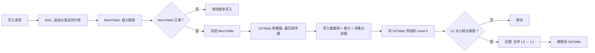
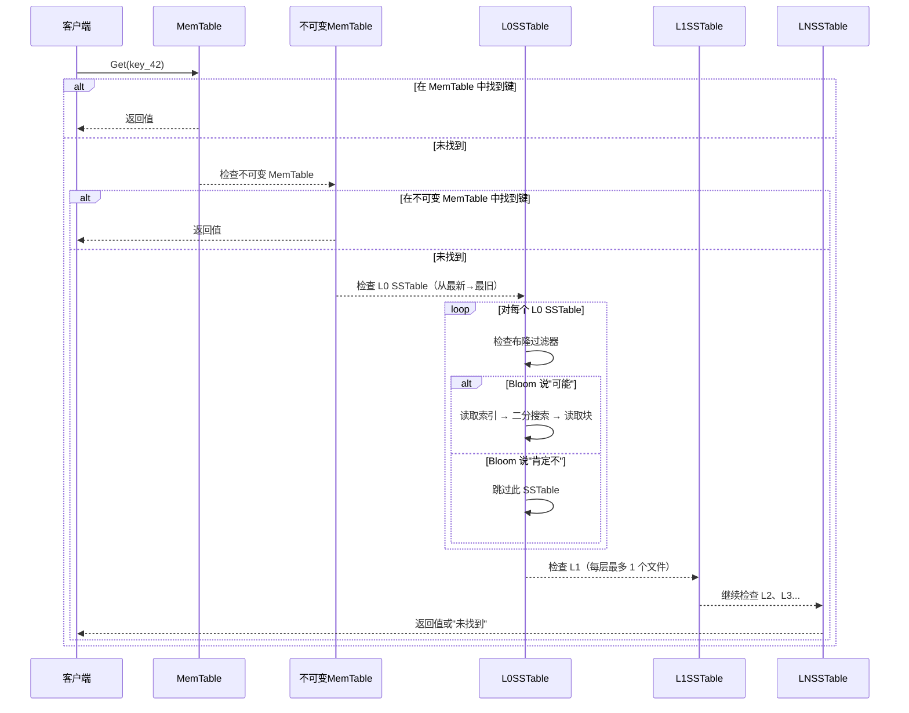
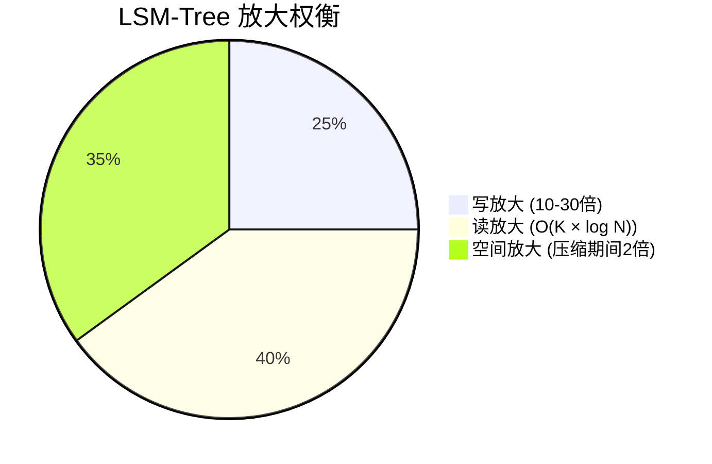

# 第5章 — LSM-Tree 与 MiniKV 内部原理

## 前置知识

> 📎 **参考**: [构建环境配置](../prerequisites/01_构建环境配置.md)
> 📎 **参考**: [测试框架](../prerequisites/04_测试框架.md)

---

## 5.1 什么是存储引擎？

想象一下开车。你踩油门、打方向盘，车就动了。你从不需要考虑活塞、曲轴、燃油喷射系统。但没有它们，方向盘只是一块塑料。

**存储引擎**是数据库的引擎。它是最底层——真正把字节写到磁盘上并读回来的部分。查询解析器、优化器、网络层——这些都是方向盘和仪表盘。存储引擎才是活塞。它回答两个问题："数据放在哪里？"和"如何再次找到它？"

每个数据库都有一个存储引擎。MySQL 让你在 InnoDB 和 MyISAM 之间选择。MongoDB 使用 WiredTiger。LevelDB 和 RocksDB *就是*存储引擎——被其他数据库（如 CockroachDB、TiKV，以及我们的 DeepVector 的 MiniKV）嵌入使用的库。

存储引擎必须同时解决三个难题：
1. **持久性**：一旦你说"已提交"，数据必须在断电后存活。
2. **吞吐量**：你可能需要每秒处理一百万次写入。
3. **检索**：你需要在数十亿个键中找到一个，耗时在微秒级。

这三个目标是相互矛盾的。让写入快往往会导致数据分散在磁盘上，使读取变慢。让读取快则需要有序、平衡的结构，而这些结构更新起来代价很高。这种矛盾是存储引擎设计的核心故事。

**关键术语：存储引擎。** 数据库中负责将数据持久化到磁盘并读回的组件。它位于查询层之下，处理所有 I/O。示例：InnoDB（MySQL）、WiredTiger（MongoDB）、LevelDB、RocksDB。

---

## 5.2 简史：从 B-Tree 到 LSM-Tree

### B-Tree（1970年代）

1970年，波音科学实验室的 Rudolf Bayer 和 Edward McCreight 在一份技术报告中首次描述了 B-Tree，该论文后来于1972年在 Acta Informatica 上正式发表（"B"从未被正式解释——Bayer 说它可以代表"balanced"、"broad"或"Boeing"）。

**B-Tree**是一种平衡树，每个节点恰好是一个**磁盘页**（通常为 4 KiB，即 4096 字节）。一个有 N 个键的节点恰好有 N+1 个子节点。因为每个节点的大小就是一个页，所以读取一个节点恰好是一次磁盘 I/O。查找任何键需要 O(log_B N) 次读取，其中 B 是**分支因子**（每个节点的子节点数）。当 B ≈ 500（一个 4 KiB 的页大约存放 500 个键指针对）时，你可以在十亿行数据中仅用 3 次磁盘读取找到任何键。

把 B-Tree 想象成一个带有层次索引的图书馆。根页写着"作者 A-M 在第2架，N-Z 在第7架。"第2架的索引写着"A-D 在第3通道，E-M 在第5通道。"第3通道的索引写着"Anderson 在第4排，Beckett 在第6排..."你从不扫描——你逐层深入。

**关键术语：**

- **B-Tree**：一种自平衡的树数据结构，维护排序数据，允许在 O(log N) 时间内进行搜索、顺序访问、插入和删除。每个节点对应一个磁盘页，最大限度地减少所需的磁盘 I/O 操作次数。
- **磁盘页**：存储系统在一次 I/O 操作中读取或写入的最小数据单位。在大多数系统上，一页 = 4096 字节（4 KiB）。从磁盘读取时，你总是读取整个页，即使你只需要一个字节。
- **分支因子**：树中每个节点的子节点数。在 B-Tree 中，一个有 k 个键的节点有 k+1 个子节点。更高的分支因子意味着更少的层级和更少的磁盘读取。
- **原地更新**：直接在磁盘上当前位置修改数据的策略。B-Tree 读取一个页，修改它，然后将同一个页写回。LSM-Tree 使用的替代方案是从不覆盖现有数据。

B-Tree 在 1970 年代是正确答案。磁盘很小，内存也很小，数据库以兆字节为单位。读操作占主导——写操作很少。B-Tree 提供了 O(log N) 的读写性能，这在当时非常出色。

但有一个问题。

### 写放大问题

假设你在 B-Tree 中更新一行数据。该行位于一个叶页上。你读取该页（一次磁盘寻址），修改该行，然后将该页写回（另一次寻址）。但如果叶页已满怎么办？你必须分裂它。现在父节点也需要更新。然后是祖父节点。在最坏的情况下，更新 16 字节的用户数据会导致数据库写入 4096 × 5 = 20,480 字节——比实际更改多出 1000 倍以上。这个比率——总 I/O 字节数除以用户数据字节数——称为**写放大**。

**关键术语：写放大。** 写入存储设备的总字节数与实际用户数据字节数的比率。如果你写入 1 KB 的用户数据，但存储引擎最终向磁盘写入了 10 KB（由于页重写、索引更新、日志记录），则写放大为 10 倍。高写放大浪费 I/O 带宽并缩短 SSD 寿命。

当磁盘速度慢且为顺序访问时（1970-1990年代的 HDD 每秒约 100 IOPS——每秒输入/输出操作数），写放大还不是危机。额外的几次寻址没什么问题，因为写操作本来就不多。但到 1990 年代，有两件事发生了变化：
1. 数据库增长到 GB 和 TB 级别。索引变得更深。更多的层级意味着每次更改需要修改更多的页——更高的写放大。
2. 软件（Google、Amazon、金融交易）开始以 HDD 无法处理的速度产生写操作。在旋转磁盘上每秒 100 次随机写入已经远远不够。

**关键术语：IOPS（每秒输入/输出操作数）。** 衡量存储性能的指标：设备每秒可以处理多少次独立的读或写操作。典型的 HDD 随机写入约 100 IOPS。现代 SSD 随机写入约 50,000–500,000 IOPS。这 1000 倍的差距是 LSM-Tree 存在的主要原因。

### LSM-Tree（1996年）

Patrick O'Neil 及其同事在 *Acta Informatica*（1996年）上发表了"The Log-Structured Merge-Tree"，提出了一个激进的想法：**永远不要覆盖任何数据**。相反，先在内存中缓冲写入，然后将它们顺序转储到磁盘。每次写入只是追加到文件中。没有寻址。没有覆盖。没有分裂的页。

**关键术语：**

- **LSM-Tree（Log-Structured Merge-Tree）**：一种存储引擎设计，将写入缓冲在内存中（在 MemTable 中），然后作为不可变的排序文件（SSTable）刷新到磁盘。读取通过先检查 MemTable，然后从最新到最旧搜索 SSTable 来提供服务。后台**压缩（compaction）**将 SSTable 合并以回收空间并保持读取性能。关键洞察是通过将随机写入转换为顺序写入，以读放大换取更低的写放大。

- **日志结构（Log-Structured）**：LSM-Tree 中的"log"指的是写入的追加式、顺序性。数据被写入日志（一系列条目，就像船舶日志一样），从不原地修改。这类似于**日志文件**——一个你只追加、从不寻址覆盖的文件。

把 B-Tree 想象成一本账簿，你在同一位置擦除旧条目并写入新条目。LSM-Tree 是一本你从不擦除的账簿——你只在底部不断写入新页。你会定期整理散页，将它们排序并装订成册。这就是**压缩**。

洞察：在旋转磁盘上，顺序写入比随机写入快 100-1000 倍（在 SSD 上甚至快 10 倍，因为闪存擦除块很大）。通过接受更高的读放大（你可能需要检查多个文件来找到一个键），你可以获得低得多的写放大。

### 笔记本类比

为了直观地理解 LSM-Tree，想象一个学生做笔记：

- **MemTable = 你当前的笔记本页。** 你按顺序记录条目。一旦页面写满，你就合上这一页，开始新的一页。
- **SSTable = 已完成的笔记本页，密封后放在书架上。** 一旦你合上一页，你就永远不再修改它。它是一个永久的、排序的记录。书架上可能有几十页已完成的页面。
- **查找一个键 = 搜索一条笔记。** 首先检查当前页面（MemTable）。如果没有，你从书架上最近的页面开始查找（SSTables），因为较新的数据更可能是你要找的。
- **Compaction = 整理书架。** 过了一段时间，你有太多页面了。你将相关的页面合并，丢弃过时的条目（被更新的、已删除的项目），并创建新的、更紧凑的页面。书架保持有序。

这就是 LSM-Tree 的基本思维模型：在内存中缓冲，密封到磁盘，从最新到最旧搜索，定期清理。

### LSM-Tree 写入路径可视化



### LSM-Tree 原始论文及其遗产

O'Neil 1996 年的论文引入了正式概念，但真正的实际影响是后来才出现的：

1. **Google Bigtable（2006年）**：Google 的分布式存储系统使用 SSTable（排序字符串表）作为分布式 LSM-Tree 的磁盘格式。Chang 等人的论文引入了"SSTable"一词，并展示了 LSM-Tree 如何在数千台机器上扩展到 PB 级别。这篇论文使 LSM-Tree 在工业界成为主流。

2. **LevelDB（2011年）**：Google 开源了 LevelDB，一个实现 LSM-Tree 存储引擎的 C++ 库。它是第一个广泛可用的、生产级的 O'Neil 概念实现，使用分层压缩。许多数据库（CockroachDB、TiDB 等）采用 LevelDB 作为存储层。

3. **RocksDB（2012年）**：Facebook 分叉了 LevelDB，并添加了大规模生产工作负载所需的功能：列族、快照、布隆过滤器、压缩以及高度可调的压缩策略。RocksDB 现在是数十个主要系统的默认存储引擎（MySQL 的 MyRocks、TiKV、CockroachDB、Kafka 的分层存储以及我们的 DeepVector 的 MiniKV）。

4. **Cassandra、HBase、CockroachDB、TiKV**：都使用 LSM-Tree 变体。名称不同（MemTable vs. Memstore、SSTable vs. Sorted File），但架构是通用的。

| | B-Tree | LSM-Tree |
|---|---|---|
| 写入路径 | 原地更新（寻址 + 覆盖） | 追加 + 后台合并 |
| 读取路径 | 单次磁盘寻址，O(log_B N) | 检查 MemTable → Bloom → SSTables |
| 写放大 | 10-50 倍（页重写） | 10-30 倍（压缩重写，可调） |
| 读放大 | 1 倍（一次读取即可获得键） | O(K × log N)，其中 K = 层数 |
| 空间放大 | 碎片开销 | 压缩期间暂时 2 倍 |
| 适合场景 | 读密集、低延迟点查询（OLTP） | 写密集、时序数据、日志、DeepVector 向量 |

**LSM-Tree 是 DeepVector 的 MiniKV 存在的原因。** 向量插入是写密集的：每个新嵌入都是一个新的写操作。读取也很重要，但 LSM-Tree 让我们优化写入路径，同时通过布隆过滤器和精心设计的压缩保持可接受的读取性能。

---

## 5.3 预写日志（WAL）

在讨论 MemTable 或 SSTable 之前，我们必须先讨论任何数据库中最重要的文件：WAL。

### 什么是 WAL？

**WAL（预写日志）**，也称为**重做日志**或**事务日志**，是一个追加式文件，在修改应用于数据库之前记录每一次修改。WAL 是几乎所有现代数据库崩溃恢复的基础。

**关键术语：**

- **WAL（Write-Ahead Log）**：一个追加式文件，数据库在将写操作应用到内存数据结构或磁盘文件*之前*记录每次写操作。如果系统崩溃，WAL 包含已提交操作的完整记录，允许数据库重放操作并恢复到一致状态。

- **预写（Write-ahead）**：一个安全协议：你必须在将更改应用到实际数据*之前*将日志条目（更改的描述）写入磁盘。"ahead"这个词很关键——日志必须在任何修改被视为已提交之前保存到持久存储上。

- **崩溃恢复（Crash recovery）**：在意外关闭（断电、操作系统崩溃、进程终止）后将数据库恢复到一致状态的过程。数据库读取其 WAL 并重放已提交的操作，丢弃未提交的操作。没有 WAL，崩溃可能导致数据库处于部分修改的不一致状态。

- **持久性（Durability）**：ACID 中的"D"（原子性、一致性、隔离性、持久性）。一旦事务提交，数据必须在随后的任何故障中存活——断电、硬件故障、操作系统崩溃。WAL 是提供持久性的机制。

### 为什么叫"预写"？

计算机有一根电源线。有人可能把它拔掉。当机器重新启动时，数据库处于什么状态？

这就是崩溃恢复问题。解决方案简洁而优雅：**在修改任何磁盘数据结构（MemTable 的 SSTable、索引页、任何东西）之前，你首先要将要做的事情写入一个追加式日志。** 这个日志就是预写日志。

关键词是*ahead*。你先写日志条目。只有在日志条目安全地写入磁盘后（通过 `fsync`，强制操作系统将写缓存刷新到物理介质），你才修改内存数据结构。如果在日志写入和内存更新之间机器崩溃，日志条目存活并可以被重放。

把 WAL 想象成船舶日志。在船长做任何事情之前——改变航向、调整速度——一条记录会进入日志。如果船沉了，日志（防水的、可漂浮的）告诉救援人员发生了什么。WAL 就是数据库的防水日志。

**关键术语：fsync。** 一个系统调用，强制将文件描述符的所有缓冲写入物理写入到存储设备，而不仅仅是操作系统页缓存。`fsync` 返回后，数据保证在断电后存活。`fsync` 很慢（在 SSD 上约 1ms），因为它必须等待存储设备确认写入。

### 组提交

`fsync` 代价很高。在典型的 SSD 上，`fsync` 大约需要 1 毫秒。如果你在每次写入后都 `fsync`，你的最大吞吐量是每秒 1000 次写入——无论你的 CPU 有多快。

解决方案是**组提交**：将多次写入打包在一起，在一次 `fsync` 下提交。如果有 1000 次写入在你等待上一次 `fsync` 完成时到达，你将它们全部写入，调用一次 `fsync`，它们就一起持久化了。每次写入的成本从约 1ms 降低到约 1µs。吞吐量从每秒 1000 次跳升到每秒 1,000,000 次。

代价是延迟：写入可能需要等待一个 `fsync` 间隔（通常 1-10ms）才能被提交。对于大多数应用程序来说，这是可以接受的——1000 倍的吞吐量提升值得几毫秒的额外延迟。

### WAL 帧格式

WAL 中的每个条目都是一个自描述的**帧**：

```
┌──────────┬────────┬──────────┬───────────┬──────────────────┐
│ CRC32 (4)│ Len (4)│ Seq (8)  │ Type (1)  │ Payload (N)      │
└──────────┴────────┴──────────┴───────────┴──────────────────┘
```

- **CRC32**（循环冗余校验，4 字节）：整个帧（包括长度字段）的校验和。如果 CRC 不匹配，则帧已损坏。这可以捕获部分写入——经典的故障模式：OS 写入了一半的帧，然后断电。恢复时，CRC 失败，我们丢弃这个部分帧。

  **关键术语：CRC32（循环冗余校验）。** 一个哈希函数，接收一个数据块并生成 4 字节的校验和。它用于检测原始数据的意外更改。即使帧中有一位发生变化，CRC 几乎肯定会不同，使数据库能够检测到损坏。CRC32 不是加密的——它是为了速度而非安全性而设计的。

- **长度**（4 字节）：帧的总长度，以便我们知道下一个帧从哪里开始。

- **序列号**（8 字节）：一个单调递增的 64 位计数器。每次变更——put、delete、事务开始——都会获得一个全局唯一的序列号。这为整个数据库中的所有操作建立了排序。

  **关键术语：序列号。** 分配给每个写操作的唯一、单调递增的标识符。序列号为所有变更建立全序：如果操作 A 的序列号为 100，操作 B 的序列号为 200，则 A 发生在 B 之前。这种排序对于复制、冲突解决和快照隔离至关重要。

- **类型**（1 字节）：PUT、DELETE、BEGIN_TXN、COMMIT、ROLLBACK。

- **负载**（N 字节）：键和值，带长度前缀。

为什么 CRC 不覆盖自身？因为你需要知道要对什么进行校验。CRC 是最后写入的。你计算帧体的 CRC，然后写入 CRC 前缀。恢复时，你读取 CRC，读取其余部分，计算其余部分的 CRC，然后比较。如果 CRC 本身被覆盖，你将陷入无限递归。

### WAL 代码草图

```cpp
class WAL {
public:
    Status Append(const Slice& key, const Slice& value, uint64_t seq, RecordType type);
    Status Recover(std::function<void(Slice,Slice,uint64_t,RecordType)> callback);

private:
    int fd_;
    uint32_t block_offset_ = 0;  // within current 32 KiB block
};
```

`Append` 打包帧、计算 CRC、写入文件描述符（封装 `pwrite`），并定期调用 `fsync`。`Recover` 顺序读取文件，验证每个帧的 CRC，并对每个有效条目调用回调。文件末尾的部分帧会被静默忽略。

---

## 5.4 MemTable — 吸收写入

MemTable 是 LSM-Tree 流水线的第二个环节。写入 WAL（为了持久性）之后，写入进入内存中的有序数据结构——**MemTable**。写入在此累积，直到 MemTable 超过大小阈值（例如 64 MiB 或 100 万条目）。此时，MemTable 被"冻结"——变为不可变——一个新的空 MemTable 取代它的位置。冻结的 MemTable 然后作为 **SSTable** 刷新到磁盘。

**关键术语：**

- **MemTable（内存表）**：一个内存中的数据结构，以排序顺序保存最近的写操作。它是 LSM-Tree 的"写缓冲区"。读取首先检查 MemTable（因为它包含最新的数据）。一旦 MemTable 达到大小限制，它就会被冻结（变为不可变）并刷新到磁盘作为 SSTable。

- **不可变（Immutable）**：创建后无法修改的数据结构。不可变的 MemTable 一旦冻结，就永远不会被再次写入。不可变性是 LSM-Tree 设计的核心原则：它消除了读取和刷新期间对锁的需求。

- **刷新（Flush）**：将内存缓冲区（MemTable）的内容写入磁盘作为 SSTable 的过程。刷新将易失性的临时数据转换为持久的永久存储。名称来自"flush to disk"（刷新到磁盘）。

- **大小阈值**：MemTable 在被刷新前可以达到的最大大小。典型值为 16 MiB 到 256 MiB。这是一个可调参数：更大的 MemTable 减少刷新频率（更好的写入吞吐量），但会增加内存使用和恢复时间（更多的 WAL 条目需要重放）。

MemTable 必须支持：
- **O(log N) 点查找**：快速找到单个键。
- **O(N) 有序遍历**：按排序顺序迭代键（在刷新到 SSTable 时需要）。
- **并发访问**：读取不应阻塞其他读取。

经典选择是**跳表（SkipList）**，由 William Pugh 于 1990 年发明。

### 什么是跳表？

想象一个有序链表。要找到键"42"，你从头开始遍历，检查每个节点：3、7、15、42。这是 O(N)。很痛苦。

现在想象添加一个"快速通道"——第二个链表，每隔一个元素跳过一次。要找到 42，你走快速通道：7（仍然在 42 之前），然后是 42。你完全跳过了 15。

现在添加第三条通道，每 4 个元素跳过 3 个。第四条每 8 个元素跳过 7 个。你现在有了一个这样的结构：

```
Level 3:  H ────────────────────────────────> T
Level 2:  H ───────────> 42 ────────────────> T
Level 1:  H ──> 7 ──────> 42 ───> 99 ──────> T
Level 0:  H->3->7->15->42->63->99->T
```

要搜索一个键，你从头节点的最高层开始。当下一个节点的键小于你的目标时，你继续前进。当不是时，你下移一层并继续。你在最多 O(log N) 次跳跃内到达第 0 层。插入的工作方式相同，但你还要记住每一层的"更新"节点（新键应该插入的位置之前的节点），这样你就可以将新节点插入。

跳表的精妙之处在于层级是**概率性**分配的，而不是像树那样平衡。插入时，你抛硬币：正面 → 增加一层，反面 → 停止。到达第 k 层的概率是 (1/2)^k。这意味着：
- 一半的节点在第 0 层（基础列表）
- 四分之一在第 1 层
- 八分之一在第 2 层
- 以此类推

结果：搜索、插入和删除的预期时间为 O(log N)——代码比平衡树简单得多。没有旋转、没有重新平衡、没有颜色翻转。只有抛硬币和指针拼接。

Pugh 的关键观察：要使跳表工作，你不需要完美的平衡——你只需要*期望的*平衡。抛硬币在高概率下提供了这一点。

**关键术语：**

- **跳表（SkipList）**：一种概率性数据结构，在有序序列中提供 O(log N) 平均时间的搜索、插入和删除。它通过维护多层链表来实现这一点，其中每一层更高的层充当"快速通道"，跳过元素。层级在插入期间随机分配。由 William Pugh 于 1989 年发明。

- **期望时间（Expected time）**：多次操作的平均情况性能。跳表保证 O(log N) *期望*（平均）时间，而不是 O(log N) *最坏情况*时间。在实践中，比 O(log N) 更差的概率极小（对于 N = 2^32，路径长度超过 2×log N 的概率小于十亿分之一）。

```cpp
template <typename Key, typename Value>
class SkipList {
    struct Node {
        Key key;
        Value value;
        std::vector<Node*> next;  // next[i] for level i
        Node(const Key& k, const Value& v, int height)
            : key(k), value(v), next(height, nullptr) {}
    };
    Node* head_;
    int max_height_;
};
```

### 为什么用跳表而不是红黑树？

跳表对数据库有两个优势：
1. **锁粒度**：你可以锁定单个节点或层级，而不是整棵树。平衡树旋转会以不可预测的模式接触多个节点，使细粒度锁定变得复杂。
2. **有序遍历很简单**：只需遍历第 0 层（基础链表）。树需要一个带栈的显式迭代器。

缺点：跳表比平衡树多使用约 1.33 倍的内存（额外的指针数组），最坏情况行为在理论上是 O(N)——尽管在实践中极不可能发生（连续 32 次正面的概率约为四十三亿分之一（(1/2)^32 ≈ 1/4.3B））。

---

## 5.5 SSTable — 不可变排序文件

**SSTable**（排序字符串表）正如其名：一个包含排序键值对的文件。一旦写入，它永远不会被修改。这个概念由 Google 的 Bigtable 论文（2006年）推广，尽管它建立在 LSM-Tree 和 Unix"做好一件事"哲学的基础上。

**关键术语：**

- **SSTable（Sorted String Table）**：一个包含按键排序的键值对的文件。一旦写入，SSTable 就是不可变的（永远不会被修改）。SSTable 是 LSM-Tree 中数据的磁盘表示。多个 SSTable 存在于不同的"层级"中，它们在压缩期间定期合并。排序顺序使得文件内的高效二分搜索成为可能。

- **已排序（Sorted）**：SSTable 中的键按升序排列。这很关键，因为它支持二分搜索（单个 SSTable 内的 O(log N) 查找）和高效的范围扫描（遍历连续的键块）。

- **不可变（Immutable）**：文件一旦写入，就永远不会被修改。这是 LSM-Tree 的核心设计选择。不可变性意味着并发读取不需要锁，不会发生碎片，压缩更有效（排序数据压缩效果更好）。代价是更新和删除会创建新文件而不是修改现有文件。

- **前缀压缩（Prefix compression）**：利用键的排序顺序的压缩技术。连续的键通常共享一个公共前缀（例如 `user:100`、`user:101`、`user:102`）。我们不是每次存储完整的键，而是存储共享前缀长度和唯一后缀。这可以减少 50-80% 的存储。

为什么不可变？不可变性是一种超能力：
- 读取不需要锁（文件永远不会更改）。
- 没有碎片（没有覆盖、没有分裂的页）。
- 压缩效果更好（排序数据压缩效果好）。
- 崩溃恢复很简单（只需不在清单中引用不完整的文件）。

SSTable 格式：

```
┌──────────────────────────────────────────────────────────┐
│ Data Block 0 │ Data Block 1 │ ... │ Data Block N-1       │
├──────────────────────────────────────────────────────────┤
│ Index Block   (每个数据块的最后一个键 → 偏移量)          │
├──────────────────────────────────────────────────────────┤
│ Bloom Filter  (此 SSTable 中所有键的集合)                │
├──────────────────────────────────────────────────────────┤
│ Footer (48 B): index offset, bloom offset, magic number  │
└──────────────────────────────────────────────────────────┘
```

- **数据块**是固定大小的（4 KiB）。每个块使用**前缀压缩**存储键值对：由于键是排序的，连续的键共享一个公共前缀。我们不是存储完整的键，而是存储共享前缀长度和唯一后缀。对于像 `user:100`、`user:101`、`user:102` 这样的键，这可以减少约 80% 的存储。
- **索引块**：一个微型排序映射，从每个数据块的最后一个键到该块的文件偏移量。要找到一个键，对索引进行二分搜索以找到可能包含它的块，然后读取该单个块。
- **布隆过滤器**：回答"键 X *可能*在这个 SSTable 中吗？"的问题，通过一次位数组探测。（我们将在下面详细讨论。）
- **页脚（Footer）**：文件末尾固定的 48 字节尾部。包含索引和布隆过滤器的偏移量，以及一个魔术数字以确认这是 SSTable。因为它位于已知位置（file_size - 48），读取器可以寻址到它而无需扫描。

---

## 5.6 压缩 — 回收空间

LSM-Tree 的肮脏秘密：它们会积累垃圾。每次更新都会写入一个新值；旧值仍然存在于较旧的 SSTable 中。每次删除都会写入一个墓碑标记；被删除的键仍然在较旧的 SSTable 中。如果你从不清理，数据库会无限增长。

**关键术语：**

- **压缩（Compaction）**：将多个较小的 SSTable 合并为更少、更大的 SSTable 的后台过程。在压缩期间，数据库读取重叠的 SSTable，按排序顺序合并它们，丢弃被覆盖的值（只保留每个键的最新版本），在最底层移除墓碑标记，并写入新的、合并的 SSTable。压缩对于回收空间和保持读取性能至关重要。

- **墓碑标记（删除标记）**：当你在 LSM-Tree 中删除一个键时，你不会立即将它从磁盘中移除。相反，你向 MemTable（最终是 SSTable）写入一个特殊的"墓碑"标记。墓碑标记表示"此键已删除"。实际的删除发生在压缩期间，当墓碑标记到达最深层时，它可以安全地丢弃较旧层级中的原始条目。墓碑标记是必要的，因为键的较旧版本可能存在于在删除到达之前刷新的 SSTable 中。

- **被覆盖的值**：当你更新一个键时，旧值仍然存在于较旧的 SSTable 中。较新 SSTable 中的较新值在读取时"获胜"。旧值仅在压缩期间移除，此时较新值取代了它。

把压缩想象成废物管理系统：垃圾在桶中积累（第 0 层），被收集和分类（压缩），可回收物被分离，垃圾被丢弃。

### 分层压缩（LevelDB、RocksDB 默认）

- **Level 0**：新刷新的 MemTable。这里的文件可能重叠——Level 0 中的两个 SSTable 都可能包含 [A, Z] 范围内的键。
- **Level 1..N**：每一层大约比前一层大 10 倍。层内的文件是排序的且不重叠——一个键在 Level 2 中最多存在于一个文件中。
- 当某一层超过其大小目标时，会挑选一个文件并与下一层中的所有重叠文件合并。输出成为下一层的一部分。
- **写放大**：在 Level 0 写入的字节每下降一层大约重写 10 倍。以 10 倍增长因子和 7 层计算，一个字节在其生命周期内大约被重写 70 次。

**关键术语：分层压缩（leveled compaction）。** 一种压缩策略，SSTable 被组织为编号的层级（L0、L1、L2...）。每个层级有一个大小目标（通常 L(i+1) = 10 × L(i)）。当某层超过其目标时，会选取文件并与下一层中的重叠文件合并。结果是每层都有不重叠的、排序的 SSTable（除了 L0，它可能重叠）。这提供了良好的读取性能（每层最多检查一个文件），但写放大更高（每个字节每层被重写一次）。

### 分层压缩的变体（Cassandra、ScyllaDB）

- 每层包含多个排序运行（不止一个）。
- 定期，某层中的所有运行被合并为下一层中的单个运行。
- 读放大更高（每层需要探测多个运行），但写放大更低（更少、更大的压缩操作）。

**关键术语：分层压缩（tiered compaction，也称为大小分层压缩）。** 一种压缩策略，累积多个大小相似的 SSTable，然后批量合并它们。与分层压缩不同（文件一次一个地合并到下一层），分层压缩等待某一层有足够的文件，然后一次性全部合并。这减少了写放大（更少的压缩操作），但增加了读放大（每层需要检查更多文件）。

### 压缩代码草图

```cpp
void LeveledCompaction::Compact(Version* current) {
    int level = PickCompactionLevel(current);
    auto inputs = PickCompactionInputs(current, level);
    // K-way merge of all input files
    MergingIterator it(inputs);
    CompactionOutput out(level + 1);
    while (it.Valid()) {
        // drop tombstones at bottommost level, dedup keys
        out.Add(it.key(), it.value());
        it.Next();
    }
    InstallNewVersion(current, out.Files());
}
```

合并是使用最小堆的经典 k 路合并：弹出最小的键，写入它，推进该文件的迭代器，将下一个键推回堆中。对于最底层的墓碑标记（删除标记），我们可以完全丢弃它们——它们已经完成了隐藏旧值的任务。

---

## 5.7 读取路径 — 逐步分析

当你调用 `db->Get("key_42")` 时，LSM-Tree 按特定顺序从最新到最旧搜索该键：

### LSM-Tree 读取路径



### 步骤 1：检查 MemTable

MemTable（当前活跃的、可变的）首先被搜索。由于它是跳表，查找时间是 O(log N)。如果找到键且是 PUT，返回值。如果是 DELETE（墓碑标记），返回"未找到"。

**为什么先检查 MemTable？** MemTable 包含最新的写入。如果一个键最近被更新，新值在 MemTable 中，而不在任何 SSTable 中。首先检查 MemTable 给我们最新的值。

### 步骤 2：检查不可变 MemTable（如果有）

如果 MemTable 最近被冻结了（它已满且正在刷新），它仍在内存中但不再接受写入。也检查它——这比从磁盘读取更快。

### 步骤 3：检查 Level 0 SSTable（从最新到最旧）

Level 0 包含最近刷新的 SSTable。逐个检查，从最新的开始。使用**布隆过滤器**跳过肯定不包含该键的文件。如果文件的布隆过滤器说"可能存在"，读取索引块，二分搜索找到数据块，并读取它。

**为什么先检查 Level 0？** Level 0 的文件包含最新的数据。如果一个键同时存在于 Level 0 文件和更深层级中，Level 0 的版本更新，应该被返回。

### 步骤 4：检查 Level 1 到 Level N（从最新到最旧）

对于每一层，最多只有一个 SSTable 文件可能包含该键（因为 Level 1+ 的文件不重叠）。使用索引块找到正确的文件，使用布隆过滤器在缺失时跳过，然后读取数据块。

**为什么每层只有一个文件？** 在分层压缩中，某层内的文件是不重叠且排序的。一个键在每层恰好属于一个文件。这意味着每层最多读取一个文件。

### 步骤 5：返回或"未找到"

如果没有 MemTable 或 SSTable 包含该键，则该键在数据库中不存在。

### 读放大

每个 SSTable 探测可能需要读取布隆过滤器（几个字节，或一次磁盘 I/O）、索引块（一次磁盘 I/O）和数据块（一次磁盘 I/O）。有 K 层时，最坏情况是 O(K × 3) 次磁盘 I/O。在实践中，布隆过滤器消除了大多数探测，所以平均情况要好得多。

**关键术语：读放大（read amplification）。** 读取单个键所需的磁盘 I/O 操作次数。在 B-Tree 中，读放大是 O(log N)——树的高度。在使用分层压缩的 LSM-Tree 中，它是 O(K × log N)，其中 K 是层数（每层最多需要一次 SSTable 探测，每次探测可能需要几次 I/O）。读放大是 LSM-Tree 为低写放大付出的代价。

---

## 5.8 压缩深入探讨 — 为什么它是必要的

压缩不是可选的——它是必要的。没有它，LSM-Tree 会：

1. **耗尽磁盘空间**：每次更新都会创建一个新的 SSTable；旧版本永远不会被移除。
2. **变得极慢**：每次读取都必须检查数百或数千个 SSTable。
3. **永远存储过时的数据**：被删除的键将永远留在 SSTable 中。

### 压缩实际做什么

在压缩期间，数据库：

1. **选择输入文件**：从某层选取 SSTable 作为合并的候选。
2. **读取它们全部**：将数据加载到内存中（或从磁盘流式读取）。
3. **按排序顺序合并**：使用 k 路合并（最小堆）将所有输入文件的键按排序顺序交织。
4. **去重**：如果同一个键出现在多个文件中，只保留最新的版本。
5. **在最底层移除墓碑标记**：最深层的墓碑标记意味着没有更旧的版本存在，因此墓碑标记和原始键都可以被丢弃。
6. **写入新的 SSTable**：合并的输出被写入新的、不重叠的 SSTable。
7. **更新清单**：数据库的元数据文件被更新以反映新的 SSTable 集合。

### 压缩权衡

- **写放大**：压缩多次重写数据。在使用 10 倍增长因子的分层压缩中，每个字节每层被重写约 10 倍。7 层时，仅压缩就产生约 70 倍的写放大。
- **空间放大**：在压缩期间，新旧 SSTable 同时存在，暂时将空间使用量翻倍。
- **I/O 带宽**：压缩消耗磁盘 I/O，否则这些 I/O 可以用于用户读写。这就是为什么压缩调度至关重要——它不能饿死前台操作。

**关键术语：**

- **空间放大（Space amplification）**：数据库使用的总存储与用户数据实际大小的比率。在 LSM-Tree 中，空间放大发生在压缩期间旧 SSTable 与新 SSTable 共存时。最坏情况下，压缩期间的空间放大通常为 2 倍。

- **读放大（Read amplification）**：（如上所定义）——读取单个键所需的 I/O 操作次数。LSM-Tree 的读放大比 B-Tree 高，但写放大更低。

- **写放大（Write amplification）**：（如上所定义）——写入磁盘的字节数与用户写入的字节数的比率。LSM-Tree 的写放大来自两个来源：(1) 写入 WAL，(2) 压缩期间重写 SSTable。

这三个指标——读放大、写放大和空间放大——称为存储引擎设计的**三大放大因子**。你可以以牺牲第三个为代价最小化任意两个。LSM-Tree 优化低写放大的代价是更高的读放大和空间放大。

### LSM-Tree 权衡配置



---

## 5.9 布隆过滤器 — 避免不必要的读取

Burton Bloom 于 1970 年发明了**布隆过滤器**。它解决了一个特定问题：你有一组项目，你想快速检查一个项目是否*可能*在集合中。你愿意偶尔的假阳性（当项目不在时它说"在"），但绝不接受假阴性（当项目在时它绝不能说"不在"）。

**关键术语：**

- **布隆过滤器（Bloom filter）**：一种空间效率高的概率性数据结构，测试一个元素是否是集合的成员。它可以产生假阳性（当元素不在集合中时说它在），但绝不产生假阴性（如果它说元素不在集合中，那它肯定不在）。布隆过滤器在 LSM-Tree 中用于快速跳过不包含给定键的 SSTable，避免不必要的磁盘读取。

- **假阳性（False positive）**：布隆过滤器说"是的，键可能在这个 SSTable 中"，但实际上不在。这浪费了一次磁盘读取（我们读取了 SSTable 但什么也没找到）。假阳性率通常调整为 1% 或更低。

- **假阴性（False negative）**：布隆过滤器说"不，键不在这里"，但实际上在。布隆过滤器绝不产生假阴性——这是它们的定义性特性。

- **位数组（Bit array）**：布隆过滤器的核心数据结构：一个 M 位的数组，全部初始化为 0。通过将特定位设置为 1 来插入元素。这些位永远不会被重置（除非在压缩期间重建布隆过滤器时）。

- **哈希函数（Hash function）**：将任意数据映射到固定大小整数的函数。布隆过滤器使用 K 个独立的哈希函数来确定设置哪些位。在实践中，使用单个快速哈希函数配合"双重哈希"技巧来模拟 K 个独立哈希。

结构非常简单：一个大小为 M 位的位数组，和 K 个独立的哈希函数。要插入元素 X：
1. 计算 hash_1(X) % M，将该位设置为 1。
2. 计算 hash_2(X) % M，将该位设置为 1。
3. ... 重复 K 次。

要查询：计算所有 K 个哈希位置。如果**任何**位为 0，则元素肯定不在集合中。如果所有位都为 1，则元素*可能*在集合中——但也可能是 K 个不同的元素恰好设置了所有这些位。

### 为什么这对 SSTable 很重要

当搜索一个键时，LSM-Tree 必须可能检查每一层中的每个 SSTable。在一个有 1000 个 SSTable 的数据库中，每次查询需要 1000 次文件读取——即使该键只存在于其中一个。

布隆过滤器解决了这个问题：在读取 SSTable 之前，检查布隆过滤器。如果它说"不"，完全跳过 SSTable。读取 64 字节（布隆过滤器）比读取 4 KiB 块便宜约 1000 倍。配置良好的布隆过滤器（1% 假阳性率）可以消除 99% 的无效 SSTable 探测。

### 假阳性率

在使用 K 个哈希插入 N 个元素后，某个位保持为 0 的概率是：

```
(1 - 1/M)^(KN)
```

近似假阳性率（所有 K 位都由偶然碰撞设置）是：

```
p ≈ (1 - e^(-KN/M))^K
```

最优哈希函数数 K（在给定 M 和 N 下最小化 p）：

```
K_opt = (M/N) × ln(2) ≈ 0.693 × M/N
```

对于一个有 100,000 个键且目标假阳性率为 1% 的 SSTable：
- M ≈ 100,000 × 9.6 ≈ 960,000 位 = 120 KiB
- K ≈ 0.693 × 9.6 ≈ 6.65 → 四舍五入为 7 个哈希函数

```cpp
class BloomFilter {
public:
    void Add(const Slice& key);
    bool MayContain(const Slice& key) const;
private:
    std::vector<uint8_t> bits_;
    int k_;  // number of hash functions
    uint32_t Hash(int seed, const Slice& key) const;
};
```

双重哈希技巧：不是使用 K 个独立哈希函数（代价高），而是计算两个基础哈希 h1 和 h2，然后生成第 i 个哈希：

```
g_i = h1 + i × h2
```

这几乎和 K 个独立哈希一样好，而且快得多。

---

## 5.10 MiniKV — 端到端代码流程

让我们追踪一个 PUT 操作经过整个 MiniKV 流水线的过程：

```
用户调用:       db->Put("key_42", "value_42")
                      │
WAL::Append()        │  1. 构建帧: CRC | Len | Seq=1001 | Type=PUT | key_42 | value_42
                      │  2. 通过 pwrite() 将帧写入 WAL 文件
                      │  3. fsync() 以保证持久性
                      │
MemTable::Put()       │  4. 将 ("key_42", "value_42", seq=1001) 插入跳表
                      │     (O(log N) 预期 — 抛硬币确定高度，拼接指针)
                      │
[MemTable 已满]       │  5. 当 MemTable 大小 > 64 MiB 时:
                      │     a. 冻结当前 MemTable，创建新的空 MemTable
SSTableBuilder::Build()│   b. 按顺序遍历冻结的 MemTable（遍历第 0 层）
                      │     c. 用前缀压缩条目填充 4 KiB 数据块
                      │     d. 构建索引块（最后一个键 → 块偏移量）
                      │     e. 构建布隆过滤器（添加所有键）
                      │     f. 在文件末尾写入页脚
                      │     g. 在清单中将新 SSTable 添加到 Level 0
                      │
Compaction::          │  6. 监控层级大小。当 Level 0 超过阈值时:
  MaybeSchedule()     │     a. 从 Level 0 选取一个文件
                      │     b. 找到 Level 1 中所有重叠的文件
                      │     c. K 路合并 → 新的 Level 1 文件
                      │     d. 删除旧的输入文件，更新清单
```

**恢复路径**：启动时，打开 WAL。顺序扫描帧。每个具有有效 CRC 的帧被重放到新的 MemTable 中。完成后，将重建的 MemTable 刷新到 SSTable。继续正常操作。

这就是 LevelDB、RocksDB、Cassandra、HBase 以及其他数十个系统使用的相同流水线。名称不同（MemTable vs. Memstore、SSTable vs. Sorted File），但架构是通用的。

---

## 5.11 总结：为什么使用 LSM-Tree？

LSM-Tree 并不比 B-Tree "更好"——它是一种不同的权衡。以下是何时使用每种的场景：

| 场景 | 最佳选择 | 原因 |
|---|---|---|
| 读密集 OLTP（如银行查询） | B-Tree | 读放大更低；每个键在一个地方就能找到 |
| 写密集工作负载（如日志、时序数据、向量嵌入） | LSM-Tree | 顺序写入比随机写入快 100-1000 倍 |
| 基于 SSD 的存储 | LSM-Tree | SSD 有大的擦除块；顺序写入仍然快得多 |
| 空间受限 | B-Tree | LSM-Tree 在压缩期间需要 2 倍空间 |
| 延迟敏感的读取 | B-Tree | LSM-Tree 读取可能需要检查多层 |

DeepVector 的 MiniKV 使用 LSM-Tree，因为向量嵌入插入是写密集的。每个新向量都是一个新的写操作，LSM-Tree 通过 MemTable 和顺序 SSTable 刷新高效地吸收这些写入。读取（相似性搜索）仍然很快，因为布隆过滤器跳过了大多数 SSTable，压缩使 SSTable 的数量保持在可管理的范围内。

---

## 代码练习

### 第 A 部分 — 带 CRC 的 WAL

实现一个简单的 WAL 类：

```cpp
struct WALEntry {
    uint32_t crc;
    uint32_t length;
    uint64_t seq;
    char     type;   // 'P' = PUT, 'D' = DELETE
    // variable-length key + value follows
};

class WAL {
public:
    WAL(const std::string& path);
    void Append(uint64_t seq, char type, const std::string& key, const std::string& value);
    std::vector<WALEntry> Recover();
private:
    int fd_;
    uint32_t CRC32(const char* data, size_t len);
    void WriteFull(const char* data, size_t len);
};
```

**任务**：
1. 实现 `CRC32`（使用查找表或 `boost::crc_32_type`）。
2. 将键和值打包到单个缓冲区：`[key_len:4][key][value_len:4][value]`。对 length + seq + type + payload 计算 CRC。
3. 写入帧：`[crc:4][length:4][seq:8][type:1][payload]`。每次写入后调用 `fsync`。
4. 实现 `Recover`：逐帧读取，检查 CRC。如果帧是部分的（帧完成前 EOF）或 CRC 失败，停止读取——这就是崩溃点。返回所有有效条目。
5. 测试：追加 1000 个条目，模拟崩溃（在循环中终止进程），恢复，验证没有丢失或损坏的条目。

### 第 B 部分 — SkipList MemTable

在 WAL 上添加 SkipList：

```cpp
template <typename K, typename V>
class MemTable {
public:
    void Put(const K& key, const V& value);
    bool Get(const K& key, V* value) const;
    void Scan(const K& start, const K& end, std::vector<std::pair<K,V>>* results) const;
private:
    SkipList<K, V> skiplist_;
    size_t size_bytes_ = 0;
};
```

**要求**：
- `Put`：插入到 SkipList。如果 MemTable 超过 1 MiB，返回一个标志以便调用者可以刷新它。
- `Get`：O(log N) 预期。
- `Scan`：范围查询。遍历第 0 层。
- 可选：添加一个并发的 `shared_mutex` 以允许多个读取器在读取期间同时访问，对 Put 使用排他锁。

### 第 C 部分 — 集成测试

编写一个迷你基准测试：

```cpp
int main() {
    WAL wal("/tmp/minikv.wal");
    MemTable<string, string> mem;

    auto recovered = wal.Recover();
    for (auto& e : recovered) mem.Put(e.key, e.value);

    for (int i = 0; i < 100000; i++) {
        auto seq = next_seq++;
        wal.Append(seq, 'P', "key_" + to_string(i), "value_" + to_string(i));
        mem.Put("key_" + to_string(i), "value_" + to_string(i));
    }
    cout << "Inserted 100K keys" << endl;

    string val;
    assert(mem.Get("key_42", &val) && val == "value_42");
    cout << "Point lookup OK" << endl;

    vector<pair<string,string>> range;
    mem.Scan("key_90000", "key_90010", &range);
    assert(range.size() == 11);
    cout << "Range scan OK" << endl;
}
```

---

## 思考题

1. **为什么 LevelDB/RocksDB 将 Level 0 作为例外？** Level 0 的文件可能重叠。从 Level 0 到 Level 1 的压缩恢复了什么属性？

2. **CRC 覆盖 length + seq + type + payload。为什么 CRC 本身不被 CRC 覆盖？** 思考写入操作的顺序。要计算包含自身 CRC 的帧的 CRC，你需要什么？

3. **如果一个键被删除了，MemTable 存储一个墓碑标记（type = DELETE）。为什么我们不能立即移除该键？** 考虑较旧版本的键存在于更深层级的 SSTable 中的情况。

4. **估算一个使用 10 倍扇出的分层压缩的 1 TiB 数据库（64 GiB RAM）的写放大。** 在数据库的生命周期中，每个应用层字节有多少字节被写入存储设备？

5. **一个 M = 1000 位、K = 3 个哈希、N = 100 个元素的布隆过滤器，假阳性率 ≈ 8.1%。K = 7 时假阳性率是多少？** 为什么增加 K 并不总是有帮助？

6. **为什么 LSM-Tree 需要等待压缩来回收磁盘空间，而 B-Tree 可以立即重用页？** 这对批量加载期间的空间放大意味着什么？

7. **为什么 LSM-Tree 使用布隆过滤器而不是哈希表来跳过 SSTable？** 内存权衡是什么？

8. **如果你正在构建一个需要同时具有高写入吞吐量和低读取延迟的系统，你如何结合 B-Tree 和 LSM-Tree 的思想？** （提示：考虑分层存储，其中热数据在 B-Tree 中，冷数据在 LSM-Tree 中。）

---

## 参考文献

- O'Neil, Patrick, et al. "The log-structured merge-tree (LSM-tree)." *Acta Informatica* 33.4 (1996): 351–385. — 引入 LSM-Tree 概念的基础论文。
- Chang, Fay, et al. "Bigtable: A distributed storage system for structured data." *OSDI* 2006. — 引入 SSTable 术语并展示了大规模 LSM-Tree。
- Pugh, William. "Skip lists: a probabilistic alternative to balanced trees." *Communications of the ACM* 33.6 (1990): 668–676. — 发明了跳表数据结构。
- Bloom, Burton H. "Space/time trade-offs in hash coding with allowable errors." *Communications of the ACM* 13.7 (1970): 422–426. — 发明了布隆过滤器。
- Bayer, Rudolf, and Edward M. McCreight. "Organization and maintenance of large ordered indices." *Acta Informatica* 1.3 (1972): 173–189. — 原始 B-Tree 论文。
- Facebook RocksDB Wiki, Compaction: https://github.com/facebook/rocksdb/wiki/Compaction — 分层和分层压缩的实用细节。
- LevelDB source code: https://github.com/google/leveldb — LSM-Tree 存储引擎的参考实现。
