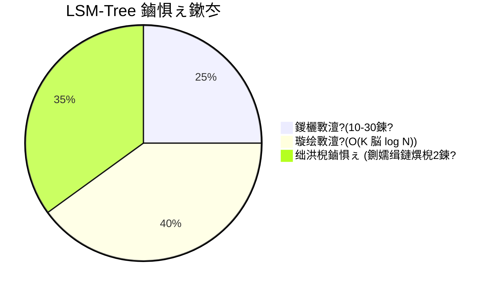

# 绗?绔?鈥?LSM-Tree 涓?MiniKV 鍐呴儴鍘熺悊

## 鍓嶇疆鐭ヨ瘑

> 馃搸 **鍙傝€?*: [鏋勫缓鐜閰嶇疆](../prerequisites/01_鏋勫缓鐜閰嶇疆.md)
> 馃搸 **鍙傝€?*: [娴嬭瘯妗嗘灦](../prerequisites/04_娴嬭瘯妗嗘灦.md)

---

## 5.1 浠€涔堟槸瀛樺偍寮曟搸锛?
鎯宠薄涓€涓嬪紑杞︺€備綘韪╂补闂ㄣ€佹墦鏂瑰悜鐩橈紝杞﹀氨鍔ㄤ簡銆備綘浠庝笉闇€瑕佽€冭檻娲诲銆佹洸杞淬€佺噧娌瑰柗灏勭郴缁熴€備絾娌℃湁瀹冧滑锛屾柟鍚戠洏鍙槸涓€鍧楀鏂欍€?
**瀛樺偍寮曟搸**鏄暟鎹簱鐨勫紩鎿庛€傚畠鏄渶搴曞眰鈥斺€旂湡姝ｆ妸瀛楄妭鍐欏埌纾佺洏涓婂苟璇诲洖鏉ョ殑閮ㄥ垎銆傛煡璇㈣В鏋愬櫒銆佷紭鍖栧櫒銆佺綉缁滃眰鈥斺€旇繖浜涢兘鏄柟鍚戠洏鍜屼华琛ㄧ洏銆傚瓨鍌ㄥ紩鎿庢墠鏄椿濉炪€傚畠鍥炵瓟涓や釜闂锛?鏁版嵁鏀惧湪鍝噷锛?鍜?濡備綍鍐嶆鎵惧埌瀹冿紵"

姣忎釜鏁版嵁搴撻兘鏈変竴涓瓨鍌ㄥ紩鎿庛€侻ySQL 璁╀綘鍦?InnoDB 鍜?MyISAM 涔嬮棿閫夋嫨銆侻ongoDB 浣跨敤 WiredTiger銆侺evelDB 鍜?RocksDB *灏辨槸*瀛樺偍寮曟搸鈥斺€旇鍏朵粬鏁版嵁搴擄紙濡?CockroachDB銆乀iKV锛屼互鍙婃垜浠殑 DeepVector 鐨?MiniKV锛夊祵鍏ヤ娇鐢ㄧ殑搴撱€?
瀛樺偍寮曟搸蹇呴』鍚屾椂瑙ｅ喅涓変釜闅鹃锛?1. **鎸佷箙鎬?*锛氫竴鏃︿綘璇?宸叉彁浜?锛屾暟鎹繀椤诲湪鏂數鍚庡瓨娲汇€?2. **鍚炲悙閲?*锛氫綘鍙兘闇€瑕佹瘡绉掑鐞嗕竴鐧句竾娆″啓鍏ャ€?3. **妫€绱?*锛氫綘闇€瑕佸湪鏁板崄浜夸釜閿腑鎵惧埌涓€涓紝鑰楁椂鍦ㄥ井绉掔骇銆?
杩欎笁涓洰鏍囨槸鐩镐簰鐭涚浘鐨勩€傝鍐欏叆蹇線寰€浼氬鑷存暟鎹垎鏁ｅ湪纾佺洏涓婏紝浣胯鍙栧彉鎱€傝璇诲彇蹇垯闇€瑕佹湁搴忋€佸钩琛＄殑缁撴瀯锛岃€岃繖浜涚粨鏋勬洿鏂拌捣鏉ヤ唬浠峰緢楂樸€傝繖绉嶇煕鐩炬槸瀛樺偍寮曟搸璁捐鐨勬牳蹇冩晠浜嬨€?
**鍏抽敭鏈锛氬瓨鍌ㄥ紩鎿庛€?* 鏁版嵁搴撲腑璐熻矗灏嗘暟鎹寔涔呭寲鍒扮鐩樺苟璇诲洖鐨勭粍浠躲€傚畠浣嶄簬鏌ヨ灞備箣涓嬶紝澶勭悊鎵€鏈?I/O銆傜ず渚嬶細InnoDB锛圡ySQL锛夈€乄iredTiger锛圡ongoDB锛夈€丩evelDB銆丷ocksDB銆?
---

## 5.2 绠€鍙诧細浠?B-Tree 鍒?LSM-Tree

### B-Tree锛?970骞翠唬锛?
1970骞达紝娉㈤煶绉戝瀹為獙瀹ょ殑 Rudolf Bayer 鍜?Edward McCreight 鍦ㄤ竴浠芥妧鏈姤鍛婁腑棣栨鎻忚堪浜?B-Tree锛岃璁烘枃鍚庢潵浜?972骞村湪 Acta Informatica 涓婃寮忓彂琛紙"B"浠庢湭琚寮忚В閲娾€斺€擝ayer 璇村畠鍙互浠ｈ〃"balanced"銆?broad"鎴?Boeing"锛夈€?
**B-Tree**鏄竴绉嶅钩琛℃爲锛屾瘡涓妭鐐规伆濂芥槸涓€涓?*纾佺洏椤?*锛堥€氬父涓?4 KiB锛屽嵆 4096 瀛楄妭锛夈€備竴涓湁 N 涓敭鐨勮妭鐐规伆濂芥湁 N+1 涓瓙鑺傜偣銆傚洜涓烘瘡涓妭鐐圭殑澶у皬灏辨槸涓€涓〉锛屾墍浠ヨ鍙栦竴涓妭鐐规伆濂芥槸涓€娆＄鐩?I/O銆傛煡鎵句换浣曢敭闇€瑕?O(log_B N) 娆¤鍙栵紝鍏朵腑 B 鏄?*鍒嗘敮鍥犲瓙**锛堟瘡涓妭鐐圭殑瀛愯妭鐐规暟锛夈€傚綋 B 鈮?500锛堜竴涓?4 KiB 鐨勯〉澶х害瀛樻斁 500 涓敭鎸囬拡瀵癸級鏃讹紝浣犲彲浠ュ湪鍗佷嚎琛屾暟鎹腑浠呯敤 3 娆＄鐩樿鍙栨壘鍒颁换浣曢敭銆?
鎶?B-Tree 鎯宠薄鎴愪竴涓甫鏈夊眰娆＄储寮曠殑鍥句功棣嗐€傛牴椤靛啓鐫€"浣滆€?A-M 鍦ㄧ2鏋讹紝N-Z 鍦ㄧ7鏋躲€?绗?鏋剁殑绱㈠紩鍐欑潃"A-D 鍦ㄧ3閫氶亾锛孍-M 鍦ㄧ5閫氶亾銆?绗?閫氶亾鐨勭储寮曞啓鐫€"Anderson 鍦ㄧ4鎺掞紝Beckett 鍦ㄧ6鎺?.."浣犱粠涓嶆壂鎻忊€斺€斾綘閫愬眰娣卞叆銆?
**鍏抽敭鏈锛?*

- **B-Tree**锛氫竴绉嶈嚜骞宠　鐨勬爲鏁版嵁缁撴瀯锛岀淮鎶ゆ帓搴忔暟鎹紝鍏佽鍦?O(log N) 鏃堕棿鍐呰繘琛屾悳绱€侀『搴忚闂€佹彃鍏ュ拰鍒犻櫎銆傛瘡涓妭鐐瑰搴斾竴涓鐩橀〉锛屾渶澶ч檺搴﹀湴鍑忓皯鎵€闇€鐨勭鐩?I/O 鎿嶄綔娆℃暟銆?- **纾佺洏椤?*锛氬瓨鍌ㄧ郴缁熷湪涓€娆?I/O 鎿嶄綔涓鍙栨垨鍐欏叆鐨勬渶灏忔暟鎹崟浣嶃€傚湪澶у鏁扮郴缁熶笂锛屼竴椤?= 4096 瀛楄妭锛? KiB锛夈€備粠纾佺洏璇诲彇鏃讹紝浣犳€绘槸璇诲彇鏁翠釜椤碉紝鍗充娇浣犲彧闇€瑕佷竴涓瓧鑺傘€?- **鍒嗘敮鍥犲瓙**锛氭爲涓瘡涓妭鐐圭殑瀛愯妭鐐规暟銆傚湪 B-Tree 涓紝涓€涓湁 k 涓敭鐨勮妭鐐规湁 k+1 涓瓙鑺傜偣銆傛洿楂樼殑鍒嗘敮鍥犲瓙鎰忓懗鐫€鏇村皯鐨勫眰绾у拰鏇村皯鐨勭鐩樿鍙栥€?- **鍘熷湴鏇存柊**锛氱洿鎺ュ湪纾佺洏涓婂綋鍓嶄綅缃慨鏀规暟鎹殑绛栫暐銆侭-Tree 璇诲彇涓€涓〉锛屼慨鏀瑰畠锛岀劧鍚庡皢鍚屼竴涓〉鍐欏洖銆侺SM-Tree 浣跨敤鐨勬浛浠ｆ柟妗堟槸浠庝笉瑕嗙洊鐜版湁鏁版嵁銆?
B-Tree 鍦?1970 骞翠唬鏄纭瓟妗堛€傜鐩樺緢灏忥紝鍐呭瓨涔熷緢灏忥紝鏁版嵁搴撲互鍏嗗瓧鑺備负鍗曚綅銆傝鎿嶄綔鍗犱富瀵尖€斺€斿啓鎿嶄綔寰堝皯銆侭-Tree 鎻愪緵浜?O(log N) 鐨勮鍐欐€ц兘锛岃繖鍦ㄥ綋鏃堕潪甯稿嚭鑹层€?
浣嗘湁涓€涓棶棰樸€?
### 鍐欐斁澶ч棶棰?
鍋囪浣犲湪 B-Tree 涓洿鏂颁竴琛屾暟鎹€傝琛屼綅浜庝竴涓彾椤典笂銆備綘璇诲彇璇ラ〉锛堜竴娆＄鐩樺鍧€锛夛紝淇敼璇ヨ锛岀劧鍚庡皢璇ラ〉鍐欏洖锛堝彟涓€娆″鍧€锛夈€備絾濡傛灉鍙堕〉宸叉弧鎬庝箞鍔烇紵浣犲繀椤诲垎瑁傚畠銆傜幇鍦ㄧ埗鑺傜偣涔熼渶瑕佹洿鏂般€傜劧鍚庢槸绁栫埗鑺傜偣銆傚湪鏈€鍧忕殑鎯呭喌涓嬶紝鏇存柊 16 瀛楄妭鐨勭敤鎴锋暟鎹細瀵艰嚧鏁版嵁搴撳啓鍏?4096 脳 5 = 20,480 瀛楄妭鈥斺€旀瘮瀹為檯鏇存敼澶氬嚭 1000 鍊嶄互涓娿€傝繖涓瘮鐜団€斺€旀€?I/O 瀛楄妭鏁伴櫎浠ョ敤鎴锋暟鎹瓧鑺傛暟鈥斺€旂О涓?*鍐欐斁澶?*銆?
**鍏抽敭鏈锛氬啓鏀惧ぇ銆?* 鍐欏叆瀛樺偍璁惧鐨勬€诲瓧鑺傛暟涓庡疄闄呯敤鎴锋暟鎹瓧鑺傛暟鐨勬瘮鐜囥€傚鏋滀綘鍐欏叆 1 KB 鐨勭敤鎴锋暟鎹紝浣嗗瓨鍌ㄥ紩鎿庢渶缁堝悜纾佺洏鍐欏叆浜?10 KB锛堢敱浜庨〉閲嶅啓銆佺储寮曟洿鏂般€佹棩蹇楄褰曪級锛屽垯鍐欐斁澶т负 10 鍊嶃€傞珮鍐欐斁澶ф氮璐?I/O 甯﹀骞剁缉鐭?SSD 瀵垮懡銆?
褰撶鐩橀€熷害鎱笖涓洪『搴忚闂椂锛?970-1990骞翠唬鐨?HDD 姣忕绾?100 IOPS鈥斺€旀瘡绉掕緭鍏?杈撳嚭鎿嶄綔鏁帮級锛屽啓鏀惧ぇ杩樹笉鏄嵄鏈恒€傞澶栫殑鍑犳瀵诲潃娌′粈涔堥棶棰橈紝鍥犱负鍐欐搷浣滄湰鏉ュ氨涓嶅銆備絾鍒?1990 骞翠唬锛屾湁涓や欢浜嬪彂鐢熶簡鍙樺寲锛?1. 鏁版嵁搴撳闀垮埌 GB 鍜?TB 绾у埆銆傜储寮曞彉寰楁洿娣便€傛洿澶氱殑灞傜骇鎰忓懗鐫€姣忔鏇存敼闇€瑕佷慨鏀规洿澶氱殑椤碘€斺€旀洿楂樼殑鍐欐斁澶с€?2. 杞欢锛圙oogle銆丄mazon銆侀噾铻嶄氦鏄擄級寮€濮嬩互 HDD 鏃犳硶澶勭悊鐨勯€熷害浜х敓鍐欐搷浣溿€傚湪鏃嬭浆纾佺洏涓婃瘡绉?100 娆￠殢鏈哄啓鍏ュ凡缁忚繙杩滀笉澶熴€?
**鍏抽敭鏈锛欼OPS锛堟瘡绉掕緭鍏?杈撳嚭鎿嶄綔鏁帮級銆?* 琛￠噺瀛樺偍鎬ц兘鐨勬寚鏍囷細璁惧姣忕鍙互澶勭悊澶氬皯娆＄嫭绔嬬殑璇绘垨鍐欐搷浣溿€傚吀鍨嬬殑 HDD 闅忔満鍐欏叆绾?100 IOPS銆傜幇浠?SSD 闅忔満鍐欏叆绾?50,000鈥?00,000 IOPS銆傝繖 1000 鍊嶇殑宸窛鏄?LSM-Tree 瀛樺湪鐨勪富瑕佸師鍥犮€?
### LSM-Tree锛?996骞达級

Patrick O'Neil 鍙婂叾鍚屼簨鍦?*Acta Informatica*锛?996骞达級涓婂彂琛ㄤ簡"The Log-Structured Merge-Tree"锛屾彁鍑轰簡涓€涓縺杩涚殑鎯虫硶锛?*姘歌繙涓嶈瑕嗙洊浠讳綍鏁版嵁**銆傜浉鍙嶏紝鍏堝湪鍐呭瓨涓紦鍐插啓鍏ワ紝鐒跺悗灏嗗畠浠『搴忚浆鍌ㄥ埌纾佺洏銆傛瘡娆″啓鍏ュ彧鏄拷鍔犲埌鏂囦欢涓€傛病鏈夊鍧€銆傛病鏈夎鐩栥€傛病鏈夊垎瑁傜殑椤点€?
**鍏抽敭鏈锛?*

- **LSM-Tree锛圠og-Structured Merge-Tree锛?*锛氫竴绉嶅瓨鍌ㄥ紩鎿庤璁★紝灏嗗啓鍏ョ紦鍐插湪鍐呭瓨涓紙鍦?MemTable 涓級锛岀劧鍚庝綔涓轰笉鍙彉鐨勬帓搴忔枃浠讹紙SSTable锛夊埛鏂板埌纾佺洏銆傝鍙栭€氳繃鍏堟鏌?MemTable锛岀劧鍚庝粠鏈€鏂板埌鏈€鏃ф悳绱?SSTable 鏉ユ彁渚涙湇鍔°€傚悗鍙?*鍘嬬缉锛坈ompaction锛?*灏?SSTable 鍚堝苟浠ュ洖鏀剁┖闂村苟淇濇寔璇诲彇鎬ц兘銆傚叧閿礊瀵熸槸閫氳繃灏嗛殢鏈哄啓鍏ヨ浆鎹负椤哄簭鍐欏叆锛屼互璇绘斁澶ф崲鍙栨洿浣庣殑鍐欐斁澶с€?
- **鏃ュ織缁撴瀯锛圠og-Structured锛?*锛歀SM-Tree 涓殑"log"鎸囩殑鏄啓鍏ョ殑杩藉姞寮忋€侀『搴忔€с€傛暟鎹鍐欏叆鏃ュ織锛堜竴绯诲垪鏉＄洰锛屽氨鍍忚埞鑸舵棩蹇椾竴鏍凤級锛屼粠涓嶅師鍦颁慨鏀广€傝繖绫讳技浜?*鏃ュ織鏂囦欢**鈥斺€斾竴涓綘鍙拷鍔犮€佷粠涓嶅鍧€瑕嗙洊鐨勬枃浠躲€?
鎶?B-Tree 鎯宠薄鎴愪竴鏈处绨匡紝浣犲湪鍚屼竴浣嶇疆鎿﹂櫎鏃ф潯鐩苟鍐欏叆鏂版潯鐩€侺SM-Tree 鏄竴鏈綘浠庝笉鎿﹂櫎鐨勮处绨库€斺€斾綘鍙湪搴曢儴涓嶆柇鍐欏叆鏂伴〉銆備綘浼氬畾鏈熸暣鐞嗘暎椤碉紝灏嗗畠浠帓搴忓苟瑁呰鎴愬唽銆傝繖灏辨槸**鍘嬬缉**銆?
娲炲療锛氬湪鏃嬭浆纾佺洏涓婏紝椤哄簭鍐欏叆姣旈殢鏈哄啓鍏ュ揩 100-1000 鍊嶏紙鍦?SSD 涓婄敋鑷冲揩 10 鍊嶏紝鍥犱负闂瓨鎿﹂櫎鍧楀緢澶э級銆傞€氳繃鎺ュ彈鏇撮珮鐨勮鏀惧ぇ锛堜綘鍙兘闇€瑕佹鏌ュ涓枃浠舵潵鎵惧埌涓€涓敭锛夛紝浣犲彲浠ヨ幏寰椾綆寰楀鐨勫啓鏀惧ぇ銆?
### 绗旇鏈被姣?
涓轰簡鐩磋鍦扮悊瑙?LSM-Tree锛屾兂璞′竴涓鐢熷仛绗旇锛?
- **MemTable = 浣犲綋鍓嶇殑绗旇鏈〉銆?* 浣犳寜椤哄簭璁板綍鏉＄洰銆備竴鏃﹂〉闈㈠啓婊★紝浣犲氨鍚堜笂杩欎竴椤碉紝寮€濮嬫柊鐨勪竴椤点€?- **SSTable = 宸插畬鎴愮殑绗旇鏈〉锛屽瘑灏佸悗鏀惧湪涔︽灦涓娿€?* 涓€鏃︿綘鍚堜笂涓€椤碉紝浣犲氨姘歌繙涓嶅啀淇敼瀹冦€傚畠鏄竴涓案涔呯殑銆佹帓搴忕殑璁板綍銆備功鏋朵笂鍙兘鏈夊嚑鍗侀〉宸插畬鎴愮殑椤甸潰銆?- **鏌ユ壘涓€涓敭 = 鎼滅储涓€鏉＄瑪璁般€?* 棣栧厛妫€鏌ュ綋鍓嶉〉闈紙MemTable锛夈€傚鏋滄病鏈夛紝浣犱粠涔︽灦涓婃渶杩戠殑椤甸潰寮€濮嬫煡鎵撅紙SSTables锛夛紝鍥犱负杈冩柊鐨勬暟鎹洿鍙兘鏄綘瑕佹壘鐨勩€?- **Compaction = 鏁寸悊涔︽灦銆?* 杩囦簡涓€娈垫椂闂达紝浣犳湁澶椤甸潰浜嗐€備綘灏嗙浉鍏崇殑椤甸潰鍚堝苟锛屼涪寮冭繃鏃剁殑鏉＄洰锛堣鏇存柊鐨勩€佸凡鍒犻櫎鐨勯」鐩級锛屽苟鍒涘缓鏂扮殑銆佹洿绱у噾鐨勯〉闈€備功鏋朵繚鎸佹湁搴忋€?
杩欏氨鏄?LSM-Tree 鐨勫熀鏈€濈淮妯″瀷锛氬湪鍐呭瓨涓紦鍐诧紝瀵嗗皝鍒扮鐩橈紝浠庢渶鏂板埌鏈€鏃ф悳绱紝瀹氭湡娓呯悊銆?
### LSM-Tree 鍐欏叆璺緞鍙鍖?
```mermaid
graph LR
    A[鍐欏叆璇锋眰] --> B[WAL: 杩藉姞浠ヤ繚璇佹寔涔呮€
    B --> C[MemTable: 鎻掑叆璺宠〃]
    C --> D{MemTable 宸叉弧锛焳
    D -->|鍚 E[绛夊緟鏇村鍐欏叆]
    D -->|鏄瘄 F[鍐荤粨 MemTable]
    F --> G[SSTable 鏋勫缓鍣? 閬嶅巻鎺掑簭閿甝
    G --> H[鍐欏叆鏁版嵁鍧?+ 绱㈠紩 + 甯冮殕杩囨护鍣╙
    H --> I[灏?SSTable 娣诲姞鍒?Level 0]
    I --> J{L0 澶у皬瓒呰繃闃堝€硷紵}
    J -->|鍚 K[绛夊緟]
    J -->|鏄瘄 L[鍘嬬缉: 鍚堝苟 L0 鈫?L1]
    L --> M[鍒犻櫎鏃?SSTable]
```

### LSM-Tree 鍘熷璁烘枃鍙婂叾閬椾骇

O'Neil 1996 骞寸殑璁烘枃寮曞叆浜嗘寮忔蹇碉紝浣嗙湡姝ｇ殑瀹為檯褰卞搷鏄悗鏉ユ墠鍑虹幇鐨勶細

1. **Google Bigtable锛?006骞达級**锛欸oogle 鐨勫垎甯冨紡瀛樺偍绯荤粺浣跨敤 SSTable锛堟帓搴忓瓧绗︿覆琛級浣滀负鍒嗗竷寮?LSM-Tree 鐨勭鐩樻牸寮忋€侰hang 绛変汉鐨勮鏂囧紩鍏ヤ簡"SSTable"涓€璇嶏紝骞跺睍绀轰簡 LSM-Tree 濡備綍鍦ㄦ暟鍗冨彴鏈哄櫒涓婃墿灞曞埌 PB 绾у埆銆傝繖绡囪鏂囦娇 LSM-Tree 鍦ㄥ伐涓氱晫鎴愪负涓绘祦銆?
2. **LevelDB锛?011骞达級**锛欸oogle 寮€婧愪簡 LevelDB锛屼竴涓疄鐜?LSM-Tree 瀛樺偍寮曟搸鐨?C++ 搴撱€傚畠鏄涓€涓箍娉涘彲鐢ㄧ殑銆佺敓浜х骇鐨?O'Neil 姒傚康瀹炵幇锛屼娇鐢ㄥ垎灞傚帇缂┿€傝澶氭暟鎹簱锛圕ockroachDB銆乀iDB 绛夛級閲囩敤 LevelDB 浣滀负瀛樺偍灞傘€?
3. **RocksDB锛?012骞达級**锛欶acebook 鍒嗗弶浜?LevelDB锛屽苟娣诲姞浜嗗ぇ瑙勬ā鐢熶骇宸ヤ綔璐熻浇鎵€闇€鐨勫姛鑳斤細鍒楁棌銆佸揩鐓с€佸竷闅嗚繃婊ゅ櫒銆佸帇缂╀互鍙婇珮搴﹀彲璋冪殑鍘嬬缉绛栫暐銆俁ocksDB 鐜板湪鏄暟鍗佷釜涓昏绯荤粺鐨勯粯璁ゅ瓨鍌ㄥ紩鎿庯紙MySQL 鐨?MyRocks銆乀iKV銆丆ockroachDB銆並afka 鐨勫垎灞傚瓨鍌ㄤ互鍙婃垜浠殑 DeepVector 鐨?MiniKV锛夈€?
4. **Cassandra銆丠Base銆丆ockroachDB銆乀iKV**锛氶兘浣跨敤 LSM-Tree 鍙樹綋銆傚悕绉颁笉鍚岋紙MemTable vs. Memstore銆丼STable vs. Sorted File锛夛紝浣嗘灦鏋勬槸閫氱敤鐨勩€?
| | B-Tree | LSM-Tree |
|---|---|---|
| 鍐欏叆璺緞 | 鍘熷湴鏇存柊锛堝鍧€ + 瑕嗙洊锛?| 杩藉姞 + 鍚庡彴鍚堝苟 |
| 璇诲彇璺緞 | 鍗曟纾佺洏瀵诲潃锛孫(log_B N) | 妫€鏌?MemTable 鈫?Bloom 鈫?SSTables |
| 鍐欐斁澶?| 10-50 鍊嶏紙椤甸噸鍐欙級 | 10-30 鍊嶏紙鍘嬬缉閲嶅啓锛屽彲璋冿級 |
| 璇绘斁澶?| 1 鍊嶏紙涓€娆¤鍙栧嵆鍙幏寰楅敭锛?| O(K 脳 log N)锛屽叾涓?K = 灞傛暟 |
| 绌洪棿鏀惧ぇ | 纰庣墖寮€閿€ | 鍘嬬缉鏈熼棿鏆傛椂 2 鍊?|
| 閫傚悎鍦烘櫙 | 璇诲瘑闆嗐€佷綆寤惰繜鐐规煡璇紙OLTP锛?| 鍐欏瘑闆嗐€佹椂搴忔暟鎹€佹棩蹇椼€丩umenDB 鍚戦噺 |

**LSM-Tree 鏄?DeepVector 鐨?MiniKV 瀛樺湪鐨勫師鍥犮€?* 鍚戦噺鎻掑叆鏄啓瀵嗛泦鐨勶細姣忎釜鏂板祵鍏ラ兘鏄竴涓柊鐨勫啓鎿嶄綔銆傝鍙栦篃寰堥噸瑕侊紝浣?LSM-Tree 璁╂垜浠紭鍖栧啓鍏ヨ矾寰勶紝鍚屾椂閫氳繃甯冮殕杩囨护鍣ㄥ拰绮惧績璁捐鐨勫帇缂╀繚鎸佸彲鎺ュ彈鐨勮鍙栨€ц兘銆?
---

## 5.3 棰勫啓鏃ュ織锛圵AL锛?
鍦ㄨ璁?MemTable 鎴?SSTable 涔嬪墠锛屾垜浠繀椤诲厛璁ㄨ浠讳綍鏁版嵁搴撲腑鏈€閲嶈鐨勬枃浠讹細WAL銆?
### 浠€涔堟槸 WAL锛?
**WAL锛堥鍐欐棩蹇楋級**锛屼篃绉颁负**閲嶅仛鏃ュ織**鎴?*浜嬪姟鏃ュ織**锛屾槸涓€涓拷鍔犲紡鏂囦欢锛屽湪淇敼搴旂敤浜庢暟鎹簱涔嬪墠璁板綍姣忎竴娆′慨鏀广€俉AL 鏄嚑涔庢墍鏈夌幇浠ｆ暟鎹簱宕╂簝鎭㈠鐨勫熀纭€銆?
**鍏抽敭鏈锛?*

- **WAL锛圵rite-Ahead Log锛?*锛氫竴涓拷鍔犲紡鏂囦欢锛屾暟鎹簱鍦ㄥ皢鍐欐搷浣滃簲鐢ㄥ埌鍐呭瓨鏁版嵁缁撴瀯鎴栫鐩樻枃浠?涔嬪墠*璁板綍姣忔鍐欐搷浣溿€傚鏋滅郴缁熷穿婧冿紝WAL 鍖呭惈宸叉彁浜ゆ搷浣滅殑瀹屾暣璁板綍锛屽厑璁告暟鎹簱閲嶆斁鎿嶄綔骞舵仮澶嶅埌涓€鑷寸姸鎬併€?
- **棰勫啓锛圵rite-ahead锛?*锛氫竴涓畨鍏ㄥ崗璁細浣犲繀椤诲湪灏嗘洿鏀瑰簲鐢ㄥ埌瀹為檯鏁版嵁*涔嬪墠*灏嗘棩蹇楁潯鐩紙鏇存敼鐨勬弿杩帮級鍐欏叆纾佺洏銆?ahead"杩欎釜璇嶅緢鍏抽敭鈥斺€旀棩蹇楀繀椤诲湪浠讳綍淇敼琚涓哄凡鎻愪氦涔嬪墠淇濆瓨鍒版寔涔呭瓨鍌ㄤ笂銆?
- **宕╂簝鎭㈠锛圕rash recovery锛?*锛氬湪鎰忓鍏抽棴锛堟柇鐢点€佹搷浣滅郴缁熷穿婧冦€佽繘绋嬬粓姝級鍚庡皢鏁版嵁搴撴仮澶嶅埌涓€鑷寸姸鎬佺殑杩囩▼銆傛暟鎹簱璇诲彇鍏?WAL 骞堕噸鏀惧凡鎻愪氦鐨勬搷浣滐紝涓㈠純鏈彁浜ょ殑鎿嶄綔銆傛病鏈?WAL锛屽穿婧冨彲鑳藉鑷存暟鎹簱澶勪簬閮ㄥ垎淇敼鐨勪笉涓€鑷寸姸鎬併€?
- **鎸佷箙鎬э紙Durability锛?*锛欰CID 涓殑"D"锛堝師瀛愭€с€佷竴鑷存€с€侀殧绂绘€с€佹寔涔呮€э級銆備竴鏃︿簨鍔℃彁浜わ紝鏁版嵁蹇呴』鍦ㄩ殢鍚庣殑浠讳綍鏁呴殰涓瓨娲烩€斺€旀柇鐢点€佺‖浠舵晠闅溿€佹搷浣滅郴缁熷穿婧冦€俉AL 鏄彁渚涙寔涔呮€х殑鏈哄埗銆?
### 涓轰粈涔堝彨"棰勫啓"锛?
璁＄畻鏈烘湁涓€鏍圭數婧愮嚎銆傛湁浜哄彲鑳芥妸瀹冩嫈鎺夈€傚綋鏈哄櫒閲嶆柊鍚姩鏃讹紝鏁版嵁搴撳浜庝粈涔堢姸鎬侊紵

杩欏氨鏄穿婧冩仮澶嶉棶棰樸€傝В鍐虫柟妗堢畝娲佽€屼紭闆咃細**鍦ㄤ慨鏀逛换浣曠鐩樻暟鎹粨鏋勶紙MemTable 鐨?SSTable銆佺储寮曢〉銆佷换浣曚笢瑗匡級涔嬪墠锛屼綘棣栧厛瑕佸皢瑕佸仛鐨勪簨鎯呭啓鍏ヤ竴涓拷鍔犲紡鏃ュ織銆?* 杩欎釜鏃ュ織灏辨槸棰勫啓鏃ュ織銆?
鍏抽敭璇嶆槸*ahead*銆備綘鍏堝啓鏃ュ織鏉＄洰銆傚彧鏈夊湪鏃ュ織鏉＄洰瀹夊叏鍦板啓鍏ョ鐩樺悗锛堥€氳繃 `fsync`锛屽己鍒舵搷浣滅郴缁熷皢鍐欑紦瀛樺埛鏂板埌鐗╃悊浠嬭川锛夛紝浣犳墠淇敼鍐呭瓨鏁版嵁缁撴瀯銆傚鏋滃湪鏃ュ織鍐欏叆鍜屽唴瀛樻洿鏂颁箣闂存満鍣ㄥ穿婧冿紝鏃ュ織鏉＄洰瀛樻椿骞跺彲浠ヨ閲嶆斁銆?
鎶?WAL 鎯宠薄鎴愯埞鑸舵棩蹇椼€傚湪鑸归暱鍋氫换浣曚簨鎯呬箣鍓嶁€斺€旀敼鍙樿埅鍚戙€佽皟鏁撮€熷害鈥斺€斾竴鏉¤褰曚細杩涘叆鏃ュ織銆傚鏋滆埞娌変簡锛屾棩蹇楋紙闃叉按鐨勩€佸彲婕傛诞鐨勶級鍛婅瘔鏁戞彺浜哄憳鍙戠敓浜嗕粈涔堛€俉AL 灏辨槸鏁版嵁搴撶殑闃叉按鏃ュ織銆?
**鍏抽敭鏈锛歠sync銆?* 涓€涓郴缁熻皟鐢紝寮哄埗灏嗘枃浠舵弿杩扮鐨勬墍鏈夌紦鍐插啓鍏ョ墿鐞嗗啓鍏ュ埌瀛樺偍璁惧锛岃€屼笉浠呬粎鏄搷浣滅郴缁熼〉缂撳瓨銆俙fsync` 杩斿洖鍚庯紝鏁版嵁淇濊瘉鍦ㄦ柇鐢靛悗瀛樻椿銆俙fsync` 寰堟參锛堝湪 SSD 涓婄害 1ms锛夛紝鍥犱负瀹冨繀椤荤瓑寰呭瓨鍌ㄨ澶囩‘璁ゅ啓鍏ャ€?
### 缁勬彁浜?
`fsync` 浠ｄ环寰堥珮銆傚湪鍏稿瀷鐨?SSD 涓婏紝`fsync` 澶х害闇€瑕?1 姣銆傚鏋滀綘鍦ㄦ瘡娆″啓鍏ュ悗閮?`fsync`锛屼綘鐨勬渶澶у悶鍚愰噺鏄瘡绉?1000 娆″啓鍏モ€斺€旀棤璁轰綘鐨?CPU 鏈夊蹇€?
瑙ｅ喅鏂规鏄?*缁勬彁浜?*锛氬皢澶氭鍐欏叆鎵撳寘鍦ㄤ竴璧凤紝鍦ㄤ竴娆?`fsync` 涓嬫彁浜ゃ€傚鏋滄湁 1000 娆″啓鍏ュ湪浣犵瓑寰呬笂涓€娆?`fsync` 瀹屾垚鏃跺埌杈撅紝浣犲皢瀹冧滑鍏ㄩ儴鍐欏叆锛岃皟鐢ㄤ竴娆?`fsync`锛屽畠浠氨涓€璧锋寔涔呭寲浜嗐€傛瘡娆″啓鍏ョ殑鎴愭湰浠庣害 1ms 闄嶄綆鍒扮害 1碌s銆傚悶鍚愰噺浠庢瘡绉?1000 娆¤烦鍗囧埌姣忕 1,000,000 娆°€?
浠ｄ环鏄欢杩燂細鍐欏叆鍙兘闇€瑕佺瓑寰呬竴涓?`fsync` 闂撮殧锛堥€氬父 1-10ms锛夋墠鑳借鎻愪氦銆傚浜庡ぇ澶氭暟搴旂敤绋嬪簭鏉ヨ锛岃繖鏄彲浠ユ帴鍙楃殑鈥斺€?000 鍊嶇殑鍚炲悙閲忔彁鍗囧€煎緱鍑犳绉掔殑棰濆寤惰繜銆?
### WAL 甯ф牸寮?
WAL 涓殑姣忎釜鏉＄洰閮芥槸涓€涓嚜鎻忚堪鐨?*甯?*锛?
```
鈹屸攢鈹€鈹€鈹€鈹€鈹€鈹€鈹€鈹€鈹€鈹攢鈹€鈹€鈹€鈹€鈹€鈹€鈹€鈹攢鈹€鈹€鈹€鈹€鈹€鈹€鈹€鈹€鈹€鈹攢鈹€鈹€鈹€鈹€鈹€鈹€鈹€鈹€鈹€鈹€鈹攢鈹€鈹€鈹€鈹€鈹€鈹€鈹€鈹€鈹€鈹€鈹€鈹€鈹€鈹€鈹€鈹€鈹€鈹?鈹?CRC32 (4)鈹?Len (4)鈹?Seq (8)  鈹?Type (1)  鈹?Payload (N)      鈹?鈹斺攢鈹€鈹€鈹€鈹€鈹€鈹€鈹€鈹€鈹€鈹粹攢鈹€鈹€鈹€鈹€鈹€鈹€鈹€鈹粹攢鈹€鈹€鈹€鈹€鈹€鈹€鈹€鈹€鈹€鈹粹攢鈹€鈹€鈹€鈹€鈹€鈹€鈹€鈹€鈹€鈹€鈹粹攢鈹€鈹€鈹€鈹€鈹€鈹€鈹€鈹€鈹€鈹€鈹€鈹€鈹€鈹€鈹€鈹€鈹€鈹?```

- **CRC32**锛堝惊鐜啑浣欐牎楠岋紝4 瀛楄妭锛夛細鏁翠釜甯э紙鍖呮嫭闀垮害瀛楁锛夌殑鏍￠獙鍜屻€傚鏋?CRC 涓嶅尮閰嶏紝鍒欏抚宸叉崯鍧忋€傝繖鍙互鎹曡幏閮ㄥ垎鍐欏叆鈥斺€旂粡鍏哥殑鏁呴殰妯″紡锛歄S 鍐欏叆浜嗕竴鍗婄殑甯э紝鐒跺悗鏂數銆傛仮澶嶆椂锛孋RC 澶辫触锛屾垜浠涪寮冭繖涓儴鍒嗗抚銆?
  **鍏抽敭鏈锛欳RC32锛堝惊鐜啑浣欐牎楠岋級銆?* 涓€涓搱甯屽嚱鏁帮紝鎺ユ敹涓€涓暟鎹潡骞剁敓鎴?4 瀛楄妭鐨勬牎楠屽拰銆傚畠鐢ㄤ簬妫€娴嬪師濮嬫暟鎹殑鎰忓鏇存敼銆傚嵆浣垮抚涓湁涓€浣嶅彂鐢熷彉鍖栵紝CRC 鍑犱箮鑲畾浼氫笉鍚岋紝浣挎暟鎹簱鑳藉妫€娴嬪埌鎹熷潖銆侰RC32 涓嶆槸鍔犲瘑鐨勨€斺€斿畠鏄负浜嗛€熷害鑰岄潪瀹夊叏鎬ц€岃璁＄殑銆?
- **闀垮害**锛? 瀛楄妭锛夛細甯х殑鎬婚暱搴︼紝浠ヤ究鎴戜滑鐭ラ亾涓嬩竴涓抚浠庡摢閲屽紑濮嬨€?
- **搴忓垪鍙?*锛? 瀛楄妭锛夛細涓€涓崟璋冮€掑鐨?64 浣嶈鏁板櫒銆傛瘡娆″彉鏇粹€斺€攑ut銆乨elete銆佷簨鍔″紑濮嬧€斺€旈兘浼氳幏寰椾竴涓叏灞€鍞竴鐨勫簭鍒楀彿銆傝繖涓烘暣涓暟鎹簱涓殑鎵€鏈夋搷浣滃缓绔嬩簡鎺掑簭銆?
  **鍏抽敭鏈锛氬簭鍒楀彿銆?* 鍒嗛厤缁欐瘡涓啓鎿嶄綔鐨勫敮涓€銆佸崟璋冮€掑鐨勬爣璇嗙銆傚簭鍒楀彿涓烘墍鏈夊彉鏇村缓绔嬪叏搴忥細濡傛灉鎿嶄綔 A 鐨勫簭鍒楀彿涓?100锛屾搷浣?B 鐨勫簭鍒楀彿涓?200锛屽垯 A 鍙戠敓鍦?B 涔嬪墠銆傝繖绉嶆帓搴忓浜庡鍒躲€佸啿绐佽В鍐冲拰蹇収闅旂鑷冲叧閲嶈銆?
- **绫诲瀷**锛? 瀛楄妭锛夛細PUT銆丏ELETE銆丅EGIN_TXN銆丆OMMIT銆丷OLLBACK銆?
- **璐熻浇**锛圢 瀛楄妭锛夛細閿拰鍊硷紝甯﹂暱搴﹀墠缂€銆?
涓轰粈涔?CRC 涓嶈鐩栬嚜韬紵鍥犱负浣犻渶瑕佺煡閬撹瀵逛粈涔堣繘琛屾牎楠屻€侰RC 鏄渶鍚庡啓鍏ョ殑銆備綘璁＄畻甯т綋鐨?CRC锛岀劧鍚庡啓鍏?CRC 鍓嶇紑銆傛仮澶嶆椂锛屼綘璇诲彇 CRC锛岃鍙栧叾浣欓儴鍒嗭紝璁＄畻鍏朵綑閮ㄥ垎鐨?CRC锛岀劧鍚庢瘮杈冦€傚鏋?CRC 鏈韩琚鐩栵紝浣犲皢闄峰叆鏃犻檺閫掑綊銆?
### WAL 浠ｇ爜鑽夊浘

```cpp
class WAL {
public:
    Status Append(const Slice& key, const Slice& value, uint64_t seq, RecordType type);
    Status Recover(std::function<void(Slice,Slice,uint64_t,RecordType)> callback);

private:
    int fd_;
    uint32_t block_offset_ = 0;  // within current 32 KiB block
};
```

`Append` 鎵撳寘甯с€佽绠?CRC銆佸啓鍏ユ枃浠舵弿杩扮锛堝皝瑁?`pwrite`锛夛紝骞跺畾鏈熻皟鐢?`fsync`銆俙Recover` 椤哄簭璇诲彇鏂囦欢锛岄獙璇佹瘡涓抚鐨?CRC锛屽苟瀵规瘡涓湁鏁堟潯鐩皟鐢ㄥ洖璋冦€傛枃浠舵湯灏剧殑閮ㄥ垎甯т細琚潤榛樺拷鐣ャ€?
---

## 5.4 MemTable 鈥?鍚告敹鍐欏叆

MemTable 鏄?LSM-Tree 娴佹按绾跨殑绗簩涓幆鑺傘€傚啓鍏?WAL锛堜负浜嗘寔涔呮€э級涔嬪悗锛屽啓鍏ヨ繘鍏ュ唴瀛樹腑鐨勬湁搴忔暟鎹粨鏋勨€斺€?*MemTable**銆傚啓鍏ュ湪姝ょ疮绉紝鐩村埌 MemTable 瓒呰繃澶у皬闃堝€硷紙渚嬪 64 MiB 鎴?100 涓囨潯鐩級銆傛鏃讹紝MemTable 琚?鍐荤粨"鈥斺€斿彉涓轰笉鍙彉鈥斺€斾竴涓柊鐨勭┖ MemTable 鍙栦唬瀹冪殑浣嶇疆銆傚喕缁撶殑 MemTable 鐒跺悗浣滀负 **SSTable** 鍒锋柊鍒扮鐩樸€?
**鍏抽敭鏈锛?*

- **MemTable锛堝唴瀛樿〃锛?*锛氫竴涓唴瀛樹腑鐨勬暟鎹粨鏋勶紝浠ユ帓搴忛『搴忎繚瀛樻渶杩戠殑鍐欐搷浣溿€傚畠鏄?LSM-Tree 鐨?鍐欑紦鍐插尯"銆傝鍙栭鍏堟鏌?MemTable锛堝洜涓哄畠鍖呭惈鏈€鏂扮殑鏁版嵁锛夈€備竴鏃?MemTable 杈惧埌澶у皬闄愬埗锛屽畠灏变細琚喕缁擄紙鍙樹负涓嶅彲鍙橈級骞跺埛鏂板埌纾佺洏浣滀负 SSTable銆?
- **涓嶅彲鍙橈紙Immutable锛?*锛氬垱寤哄悗鏃犳硶淇敼鐨勬暟鎹粨鏋勩€備笉鍙彉鐨?MemTable 涓€鏃﹀喕缁擄紝灏辨案杩滀笉浼氳鍐嶆鍐欏叆銆備笉鍙彉鎬ф槸 LSM-Tree 璁捐鐨勬牳蹇冨師鍒欙細瀹冩秷闄や簡璇诲彇鍜屽埛鏂版湡闂村閿佺殑闇€姹傘€?
- **鍒锋柊锛團lush锛?*锛氬皢鍐呭瓨缂撳啿鍖猴紙MemTable锛夌殑鍐呭鍐欏叆纾佺洏浣滀负 SSTable 鐨勮繃绋嬨€傚埛鏂板皢鏄撳け鎬х殑涓存椂鏁版嵁杞崲涓烘寔涔呯殑姘镐箙瀛樺偍銆傚悕绉版潵鑷?flush to disk"锛堝埛鏂板埌纾佺洏锛夈€?
- **澶у皬闃堝€?*锛歁emTable 鍦ㄨ鍒锋柊鍓嶅彲浠ヨ揪鍒扮殑鏈€澶уぇ灏忋€傚吀鍨嬪€间负 16 MiB 鍒?256 MiB銆傝繖鏄竴涓彲璋冨弬鏁帮細鏇村ぇ鐨?MemTable 鍑忓皯鍒锋柊棰戠巼锛堟洿濂界殑鍐欏叆鍚炲悙閲忥級锛屼絾浼氬鍔犲唴瀛樹娇鐢ㄥ拰鎭㈠鏃堕棿锛堟洿澶氱殑 WAL 鏉＄洰闇€瑕侀噸鏀撅級銆?
MemTable 蹇呴』鏀寔锛?- **O(log N) 鐐规煡鎵?*锛氬揩閫熸壘鍒板崟涓敭銆?- **O(N) 鏈夊簭閬嶅巻**锛氭寜鎺掑簭椤哄簭杩唬閿紙鍦ㄥ埛鏂板埌 SSTable 鏃堕渶瑕侊級銆?- **骞跺彂璁块棶**锛氳鍙栦笉搴旈樆濉炲叾浠栬鍙栥€?
缁忓吀閫夋嫨鏄?*璺宠〃锛圫kipList锛?*锛岀敱 William Pugh 浜?1990 骞村彂鏄庛€?
### 浠€涔堟槸璺宠〃锛?
鎯宠薄涓€涓湁搴忛摼琛ㄣ€傝鎵惧埌閿?42"锛屼綘浠庡ご寮€濮嬮亶鍘嗭紝妫€鏌ユ瘡涓妭鐐癸細3銆?銆?5銆?2銆傝繖鏄?O(N)銆傚緢鐥涜嫤銆?
鐜板湪鎯宠薄娣诲姞涓€涓?蹇€熼€氶亾"鈥斺€旂浜屼釜閾捐〃锛屾瘡闅斾竴涓厓绱犺烦杩囦竴娆°€傝鎵惧埌 42锛屼綘璧板揩閫熼€氶亾锛?锛堜粛鐒跺湪 42 涔嬪墠锛夛紝鐒跺悗鏄?42銆備綘瀹屽叏璺宠繃浜?15銆?
鐜板湪娣诲姞绗笁鏉￠€氶亾锛屾瘡 4 涓厓绱犺烦杩?3 涓€傜鍥涙潯姣?8 涓厓绱犺烦杩?7 涓€備綘鐜板湪鏈変簡涓€涓繖鏍风殑缁撴瀯锛?
```
Level 3:  H 鈹€鈹€鈹€鈹€鈹€鈹€鈹€鈹€鈹€鈹€鈹€鈹€鈹€鈹€鈹€鈹€鈹€鈹€鈹€鈹€鈹€鈹€鈹€鈹€鈹€鈹€鈹€鈹€鈹€鈹€鈹€鈹€> T
Level 2:  H 鈹€鈹€鈹€鈹€鈹€鈹€鈹€鈹€鈹€鈹€鈹€> 42 鈹€鈹€鈹€鈹€鈹€鈹€鈹€鈹€鈹€鈹€鈹€鈹€鈹€鈹€鈹€鈹€> T
Level 1:  H 鈹€鈹€> 7 鈹€鈹€鈹€鈹€鈹€鈹€> 42 鈹€鈹€鈹€> 99 鈹€鈹€鈹€鈹€鈹€鈹€> T
Level 0:  H->3->7->15->42->63->99->T
```

瑕佹悳绱竴涓敭锛屼綘浠庡ご鑺傜偣鐨勬渶楂樺眰寮€濮嬨€傚綋涓嬩竴涓妭鐐圭殑閿皬浜庝綘鐨勭洰鏍囨椂锛屼綘缁х画鍓嶈繘銆傚綋涓嶆槸鏃讹紝浣犱笅绉讳竴灞傚苟缁х画銆備綘鍦ㄦ渶澶?O(log N) 娆¤烦璺冨唴鍒拌揪绗?0 灞傘€傛彃鍏ョ殑宸ヤ綔鏂瑰紡鐩稿悓锛屼絾浣犺繕瑕佽浣忔瘡涓€灞傜殑"鏇存柊"鑺傜偣锛堟柊閿簲璇ユ彃鍏ョ殑浣嶇疆涔嬪墠鐨勮妭鐐癸級锛岃繖鏍蜂綘灏卞彲浠ュ皢鏂拌妭鐐规彃鍏ャ€?
璺宠〃鐨勭簿濡欎箣澶勫湪浜庡眰绾ф槸**姒傜巼鎬?*鍒嗛厤鐨勶紝鑰屼笉鏄儚鏍戦偅鏍峰钩琛°€傛彃鍏ユ椂锛屼綘鎶涚‖甯侊細姝ｉ潰 鈫?澧炲姞涓€灞傦紝鍙嶉潰 鈫?鍋滄銆傚埌杈剧 k 灞傜殑姒傜巼鏄?(1/2)^k銆傝繖鎰忓懗鐫€锛?- 涓€鍗婄殑鑺傜偣鍦ㄧ 0 灞傦紙鍩虹鍒楄〃锛?- 鍥涘垎涔嬩竴鍦ㄧ 1 灞?- 鍏垎涔嬩竴鍦ㄧ 2 灞?- 浠ユ绫绘帹

缁撴灉锛氭悳绱€佹彃鍏ュ拰鍒犻櫎鐨勯鏈熸椂闂翠负 O(log N)鈥斺€斾唬鐮佹瘮骞宠　鏍戠畝鍗曞緱澶氥€傛病鏈夋棆杞€佹病鏈夐噸鏂板钩琛°€佹病鏈夐鑹茬炕杞€傚彧鏈夋姏纭竵鍜屾寚閽堟嫾鎺ャ€?
Pugh 鐨勫叧閿瀵燂細瑕佷娇璺宠〃宸ヤ綔锛屼綘涓嶉渶瑕佸畬缇庣殑骞宠　鈥斺€斾綘鍙渶瑕?鏈熸湜鐨?骞宠　銆傛姏纭竵鍦ㄩ珮姒傜巼涓嬫彁渚涗簡杩欎竴鐐广€?
**鍏抽敭鏈锛?*

- **璺宠〃锛圫kipList锛?*锛氫竴绉嶆鐜囨€ф暟鎹粨鏋勶紝鍦ㄦ湁搴忓簭鍒椾腑鎻愪緵 O(log N) 骞冲潎鏃堕棿鐨勬悳绱€佹彃鍏ュ拰鍒犻櫎銆傚畠閫氳繃缁存姢澶氬眰閾捐〃鏉ュ疄鐜拌繖涓€鐐癸紝鍏朵腑姣忎竴灞傛洿楂樼殑灞傚厖褰?蹇€熼€氶亾"锛岃烦杩囧厓绱犮€傚眰绾у湪鎻掑叆鏈熼棿闅忔満鍒嗛厤銆傜敱 William Pugh 浜?1989 骞村彂鏄庛€?
- **鏈熸湜鏃堕棿锛圗xpected time锛?*锛氬娆℃搷浣滅殑骞冲潎鎯呭喌鎬ц兘銆傝烦琛ㄤ繚璇?O(log N) *鏈熸湜*锛堝钩鍧囷級鏃堕棿锛岃€屼笉鏄?O(log N) *鏈€鍧忔儏鍐?鏃堕棿銆傚湪瀹炶返涓紝姣?O(log N) 鏇村樊鐨勬鐜囨瀬灏忥紙瀵逛簬 N = 2^32锛岃矾寰勯暱搴﹁秴杩?2脳log N 鐨勬鐜囧皬浜庡崄浜垮垎涔嬩竴锛夈€?
```cpp
template <typename Key, typename Value>
class SkipList {
    struct Node {
        Key key;
        Value value;
        std::vector<Node*> next;  // next[i] for level i
        Node(const Key& k, const Value& v, int height)
            : key(k), value(v), next(height, nullptr) {}
    };
    Node* head_;
    int max_height_;
};
```

### 涓轰粈涔堢敤璺宠〃鑰屼笉鏄孩榛戞爲锛?
璺宠〃瀵规暟鎹簱鏈変袱涓紭鍔匡細
1. **閿佺矑搴?*锛氫綘鍙互閿佸畾鍗曚釜鑺傜偣鎴栧眰绾э紝鑰屼笉鏄暣妫垫爲銆傚钩琛℃爲鏃嬭浆浼氫互涓嶅彲棰勬祴鐨勬ā寮忔帴瑙﹀涓妭鐐癸紝浣跨粏绮掑害閿佸畾鍙樺緱澶嶆潅銆?2. **鏈夊簭閬嶅巻寰堢畝鍗?*锛氬彧闇€閬嶅巻绗?0 灞傦紙鍩虹閾捐〃锛夈€傛爲闇€瑕佷竴涓甫鏍堢殑鏄惧紡杩唬鍣ㄣ€?
缂虹偣锛氳烦琛ㄦ瘮骞宠　鏍戝浣跨敤绾?1.33 鍊嶇殑鍐呭瓨锛堥澶栫殑鎸囬拡鏁扮粍锛夛紝鏈€鍧忔儏鍐佃涓哄湪鐞嗚涓婃槸 O(N)鈥斺€斿敖绠″湪瀹炶返涓瀬涓嶅彲鑳藉彂鐢燂紙杩炵画 32 娆℃闈㈢殑姒傜巼绾︿负鍥涘崄涓変嚎鍒嗕箣涓€锛?1/2)^32 鈮?1/4.3B锛夛級銆?
---

## 5.5 SSTable 鈥?涓嶅彲鍙樻帓搴忔枃浠?
**SSTable**锛堟帓搴忓瓧绗︿覆琛級姝ｅ鍏跺悕锛氫竴涓寘鍚帓搴忛敭鍊煎鐨勬枃浠躲€備竴鏃﹀啓鍏ワ紝瀹冩案杩滀笉浼氳淇敼銆傝繖涓蹇电敱 Google 鐨?Bigtable 璁烘枃锛?006骞达級鎺ㄥ箍锛屽敖绠″畠寤虹珛鍦?LSM-Tree 鍜?Unix"鍋氬ソ涓€浠朵簨"鍝插鐨勫熀纭€涓娿€?
**鍏抽敭鏈锛?*

- **SSTable锛圫orted String Table锛?*锛氫竴涓寘鍚寜閿帓搴忕殑閿€煎鐨勬枃浠躲€備竴鏃﹀啓鍏ワ紝SSTable 灏辨槸涓嶅彲鍙樼殑锛堟案杩滀笉浼氳淇敼锛夈€係STable 鏄?LSM-Tree 涓暟鎹殑纾佺洏琛ㄧず銆傚涓?SSTable 瀛樺湪浜庝笉鍚岀殑"灞傜骇"涓紝瀹冧滑鍦ㄥ帇缂╂湡闂村畾鏈熷悎骞躲€傛帓搴忛『搴忎娇寰楁枃浠跺唴鐨勯珮鏁堜簩鍒嗘悳绱㈡垚涓哄彲鑳姐€?
- **宸叉帓搴忥紙Sorted锛?*锛歋STable 涓殑閿寜鍗囧簭鎺掑垪銆傝繖寰堝叧閿紝鍥犱负瀹冩敮鎸佷簩鍒嗘悳绱紙鍗曚釜 SSTable 鍐呯殑 O(log N) 鏌ユ壘锛夊拰楂樻晥鐨勮寖鍥存壂鎻忥紙閬嶅巻杩炵画鐨勯敭鍧楋級銆?
- **涓嶅彲鍙橈紙Immutable锛?*锛氭枃浠朵竴鏃﹀啓鍏ワ紝灏辨案杩滀笉浼氳淇敼銆傝繖鏄?LSM-Tree 鐨勬牳蹇冭璁￠€夋嫨銆備笉鍙彉鎬ф剰鍛崇潃骞跺彂璇诲彇涓嶉渶瑕侀攣锛屼笉浼氬彂鐢熺鐗囷紝鍘嬬缉鏇存湁鏁堬紙鎺掑簭鏁版嵁鍘嬬缉鏁堟灉鏇村ソ锛夈€備唬浠锋槸鏇存柊鍜屽垹闄や細鍒涘缓鏂版枃浠惰€屼笉鏄慨鏀圭幇鏈夋枃浠躲€?
- **鍓嶇紑鍘嬬缉锛圥refix compression锛?*锛氬埄鐢ㄩ敭鐨勬帓搴忛『搴忕殑鍘嬬缉鎶€鏈€傝繛缁殑閿€氬父鍏变韩涓€涓叕鍏卞墠缂€锛堜緥濡?`user:100`銆乣user:101`銆乣user:102`锛夈€傛垜浠笉鏄瘡娆″瓨鍌ㄥ畬鏁寸殑閿紝鑰屾槸瀛樺偍鍏变韩鍓嶇紑闀垮害鍜屽敮涓€鍚庣紑銆傝繖鍙互鍑忓皯 50-80% 鐨勫瓨鍌ㄣ€?
涓轰粈涔堜笉鍙彉锛熶笉鍙彉鎬ф槸涓€绉嶈秴鑳藉姏锛?- 璇诲彇涓嶉渶瑕侀攣锛堟枃浠舵案杩滀笉浼氭洿鏀癸級銆?- 娌℃湁纰庣墖锛堟病鏈夎鐩栥€佹病鏈夊垎瑁傜殑椤碉級銆?- 鍘嬬缉鏁堟灉鏇村ソ锛堟帓搴忔暟鎹帇缂╂晥鏋滃ソ锛夈€?- 宕╂簝鎭㈠寰堢畝鍗曪紙鍙渶涓嶅湪娓呭崟涓紩鐢ㄤ笉瀹屾暣鐨勬枃浠讹級銆?
SSTable 鏍煎紡锛?
```
鈹屸攢鈹€鈹€鈹€鈹€鈹€鈹€鈹€鈹€鈹€鈹€鈹€鈹€鈹€鈹€鈹€鈹€鈹€鈹€鈹€鈹€鈹€鈹€鈹€鈹€鈹€鈹€鈹€鈹€鈹€鈹€鈹€鈹€鈹€鈹€鈹€鈹€鈹€鈹€鈹€鈹€鈹€鈹€鈹€鈹€鈹€鈹€鈹€鈹€鈹€鈹€鈹€鈹€鈹€鈹€鈹€鈹€鈹€鈹?鈹?Data Block 0 鈹?Data Block 1 鈹?... 鈹?Data Block N-1       鈹?鈹溾攢鈹€鈹€鈹€鈹€鈹€鈹€鈹€鈹€鈹€鈹€鈹€鈹€鈹€鈹€鈹€鈹€鈹€鈹€鈹€鈹€鈹€鈹€鈹€鈹€鈹€鈹€鈹€鈹€鈹€鈹€鈹€鈹€鈹€鈹€鈹€鈹€鈹€鈹€鈹€鈹€鈹€鈹€鈹€鈹€鈹€鈹€鈹€鈹€鈹€鈹€鈹€鈹€鈹€鈹€鈹€鈹€鈹€鈹?鈹?Index Block   (姣忎釜鏁版嵁鍧楃殑鏈€鍚庝竴涓敭 鈫?鍋忕Щ閲?          鈹?鈹溾攢鈹€鈹€鈹€鈹€鈹€鈹€鈹€鈹€鈹€鈹€鈹€鈹€鈹€鈹€鈹€鈹€鈹€鈹€鈹€鈹€鈹€鈹€鈹€鈹€鈹€鈹€鈹€鈹€鈹€鈹€鈹€鈹€鈹€鈹€鈹€鈹€鈹€鈹€鈹€鈹€鈹€鈹€鈹€鈹€鈹€鈹€鈹€鈹€鈹€鈹€鈹€鈹€鈹€鈹€鈹€鈹€鈹€鈹?鈹?Bloom Filter  (姝?SSTable 涓墍鏈夐敭鐨勯泦鍚?                鈹?鈹溾攢鈹€鈹€鈹€鈹€鈹€鈹€鈹€鈹€鈹€鈹€鈹€鈹€鈹€鈹€鈹€鈹€鈹€鈹€鈹€鈹€鈹€鈹€鈹€鈹€鈹€鈹€鈹€鈹€鈹€鈹€鈹€鈹€鈹€鈹€鈹€鈹€鈹€鈹€鈹€鈹€鈹€鈹€鈹€鈹€鈹€鈹€鈹€鈹€鈹€鈹€鈹€鈹€鈹€鈹€鈹€鈹€鈹€鈹?鈹?Footer (48 B): index offset, bloom offset, magic number  鈹?鈹斺攢鈹€鈹€鈹€鈹€鈹€鈹€鈹€鈹€鈹€鈹€鈹€鈹€鈹€鈹€鈹€鈹€鈹€鈹€鈹€鈹€鈹€鈹€鈹€鈹€鈹€鈹€鈹€鈹€鈹€鈹€鈹€鈹€鈹€鈹€鈹€鈹€鈹€鈹€鈹€鈹€鈹€鈹€鈹€鈹€鈹€鈹€鈹€鈹€鈹€鈹€鈹€鈹€鈹€鈹€鈹€鈹€鈹€鈹?```

- **鏁版嵁鍧?*鏄浐瀹氬ぇ灏忕殑锛? KiB锛夈€傛瘡涓潡浣跨敤**鍓嶇紑鍘嬬缉**瀛樺偍閿€煎锛氱敱浜庨敭鏄帓搴忕殑锛岃繛缁殑閿叡浜竴涓叕鍏卞墠缂€銆傛垜浠笉鏄瓨鍌ㄥ畬鏁寸殑閿紝鑰屾槸瀛樺偍鍏变韩鍓嶇紑闀垮害鍜屽敮涓€鍚庣紑銆傚浜庡儚 `user:100`銆乣user:101`銆乣user:102` 杩欐牱鐨勯敭锛岃繖鍙互鍑忓皯绾?80% 鐨勫瓨鍌ㄣ€?- **绱㈠紩鍧?*锛氫竴涓井鍨嬫帓搴忔槧灏勶紝浠庢瘡涓暟鎹潡鐨勬渶鍚庝竴涓敭鍒拌鍧楃殑鏂囦欢鍋忕Щ閲忋€傝鎵惧埌涓€涓敭锛屽绱㈠紩杩涜浜屽垎鎼滅储浠ユ壘鍒板彲鑳藉寘鍚畠鐨勫潡锛岀劧鍚庤鍙栬鍗曚釜鍧椼€?- **甯冮殕杩囨护鍣?*锛氬洖绛?閿?X *鍙兘*鍦ㄨ繖涓?SSTable 涓悧锛?鐨勯棶棰橈紝閫氳繃涓€娆′綅鏁扮粍鎺㈡祴銆傦紙鎴戜滑灏嗗湪涓嬮潰璇︾粏璁ㄨ銆傦級
- **椤佃剼锛團ooter锛?*锛氭枃浠舵湯灏惧浐瀹氱殑 48 瀛楄妭灏鹃儴銆傚寘鍚储寮曞拰甯冮殕杩囨护鍣ㄧ殑鍋忕Щ閲忥紝浠ュ強涓€涓瓟鏈暟瀛椾互纭杩欐槸 SSTable銆傚洜涓哄畠浣嶄簬宸茬煡浣嶇疆锛坒ile_size - 48锛夛紝璇诲彇鍣ㄥ彲浠ュ鍧€鍒板畠鑰屾棤闇€鎵弿銆?
---

## 5.6 鍘嬬缉 鈥?鍥炴敹绌洪棿

LSM-Tree 鐨勮偖鑴忕瀵嗭細瀹冧滑浼氱Н绱瀮鍦俱€傛瘡娆℃洿鏂伴兘浼氬啓鍏ヤ竴涓柊鍊硷紱鏃у€间粛鐒跺瓨鍦ㄤ簬杈冩棫鐨?SSTable 涓€傛瘡娆″垹闄ら兘浼氬啓鍏ヤ竴涓纰戞爣璁帮紱琚垹闄ょ殑閿粛鐒跺湪杈冩棫鐨?SSTable 涓€傚鏋滀綘浠庝笉娓呯悊锛屾暟鎹簱浼氭棤闄愬闀裤€?
**鍏抽敭鏈锛?*

- **鍘嬬缉锛圕ompaction锛?*锛氬皢澶氫釜杈冨皬鐨?SSTable 鍚堝苟涓烘洿灏戙€佹洿澶х殑 SSTable 鐨勫悗鍙拌繃绋嬨€傚湪鍘嬬缉鏈熼棿锛屾暟鎹簱璇诲彇閲嶅彔鐨?SSTable锛屾寜鎺掑簭椤哄簭鍚堝苟瀹冧滑锛屼涪寮冭瑕嗙洊鐨勫€硷紙鍙繚鐣欐瘡涓敭鐨勬渶鏂扮増鏈級锛屽湪鏈€搴曞眰绉婚櫎澧撶鏍囪锛屽苟鍐欏叆鏂扮殑銆佸悎骞剁殑 SSTable銆傚帇缂╁浜庡洖鏀剁┖闂村拰淇濇寔璇诲彇鎬ц兘鑷冲叧閲嶈銆?
- **澧撶鏍囪锛堝垹闄ゆ爣璁帮級**锛氬綋浣犲湪 LSM-Tree 涓垹闄や竴涓敭鏃讹紝浣犱笉浼氱珛鍗冲皢瀹冧粠纾佺洏涓Щ闄ゃ€傜浉鍙嶏紝浣犲悜 MemTable锛堟渶缁堟槸 SSTable锛夊啓鍏ヤ竴涓壒娈婄殑"澧撶"鏍囪銆傚纰戞爣璁拌〃绀?姝ら敭宸插垹闄?銆傚疄闄呯殑鍒犻櫎鍙戠敓鍦ㄥ帇缂╂湡闂达紝褰撳纰戞爣璁板埌杈炬渶娣卞眰鏃讹紝瀹冨彲浠ュ畨鍏ㄥ湴涓㈠純杈冩棫灞傜骇涓殑鍘熷鏉＄洰銆傚纰戞爣璁版槸蹇呰鐨勶紝鍥犱负閿殑杈冩棫鐗堟湰鍙兘瀛樺湪浜庡湪鍒犻櫎鍒拌揪涔嬪墠鍒锋柊鐨?SSTable 涓€?
- **琚鐩栫殑鍊?*锛氬綋浣犳洿鏂颁竴涓敭鏃讹紝鏃у€间粛鐒跺瓨鍦ㄤ簬杈冩棫鐨?SSTable 涓€傝緝鏂?SSTable 涓殑杈冩柊鍊煎湪璇诲彇鏃?鑾疯儨"銆傛棫鍊间粎鍦ㄥ帇缂╂湡闂寸Щ闄わ紝姝ゆ椂杈冩柊鍊煎彇浠ｄ簡瀹冦€?
鎶婂帇缂╂兂璞℃垚搴熺墿绠＄悊绯荤粺锛氬瀮鍦惧湪妗朵腑绉疮锛堢 0 灞傦級锛岃鏀堕泦鍜屽垎绫伙紙鍘嬬缉锛夛紝鍙洖鏀剁墿琚垎绂伙紝鍨冨溇琚涪寮冦€?
### 鍒嗗眰鍘嬬缉锛圠evelDB銆丷ocksDB 榛樿锛?
- **Level 0**锛氭柊鍒锋柊鐨?MemTable銆傝繖閲岀殑鏂囦欢鍙兘閲嶅彔鈥斺€擫evel 0 涓殑涓や釜 SSTable 閮藉彲鑳藉寘鍚?[A, Z] 鑼冨洿鍐呯殑閿€?- **Level 1..N**锛氭瘡涓€灞傚ぇ绾︽瘮鍓嶄竴灞傚ぇ 10 鍊嶃€傚眰鍐呯殑鏂囦欢鏄帓搴忕殑涓斾笉閲嶅彔鈥斺€斾竴涓敭鍦?Level 2 涓渶澶氬瓨鍦ㄤ簬涓€涓枃浠朵腑銆?- 褰撴煇涓€灞傝秴杩囧叾澶у皬鐩爣鏃讹紝浼氭寫閫変竴涓枃浠跺苟涓庝笅涓€灞備腑鐨勬墍鏈夐噸鍙犳枃浠跺悎骞躲€傝緭鍑烘垚涓轰笅涓€灞傜殑涓€閮ㄥ垎銆?- **鍐欐斁澶?*锛氬湪 Level 0 鍐欏叆鐨勫瓧鑺傛瘡涓嬮檷涓€灞傚ぇ绾﹂噸鍐?10 鍊嶃€備互 10 鍊嶅闀垮洜瀛愬拰 7 灞傝绠楋紝涓€涓瓧鑺傚湪鍏剁敓鍛藉懆鏈熷唴澶х害琚噸鍐?70 娆°€?
**鍏抽敭鏈锛氬垎灞傚帇缂╋紙leveled compaction锛夈€?* 涓€绉嶅帇缂╃瓥鐣ワ紝SSTable 琚粍缁囦负缂栧彿鐨勫眰绾э紙L0銆丩1銆丩2...锛夈€傛瘡涓眰绾ф湁涓€涓ぇ灏忕洰鏍囷紙閫氬父 L(i+1) = 10 脳 L(i)锛夈€傚綋鏌愬眰瓒呰繃鍏剁洰鏍囨椂锛屼細閫夊彇鏂囦欢骞朵笌涓嬩竴灞備腑鐨勯噸鍙犳枃浠跺悎骞躲€傜粨鏋滄槸姣忓眰閮芥湁涓嶉噸鍙犵殑銆佹帓搴忕殑 SSTable锛堥櫎浜?L0锛屽畠鍙兘閲嶅彔锛夈€傝繖鎻愪緵浜嗚壇濂界殑璇诲彇鎬ц兘锛堟瘡灞傛渶澶氭鏌ヤ竴涓枃浠讹級锛屼絾鍐欐斁澶ф洿楂橈紙姣忎釜瀛楄妭姣忓眰琚噸鍐欎竴娆★級銆?
### 鍒嗗眰鍘嬬缉鐨勫彉浣擄紙Cassandra銆丼cyllaDB锛?
- 姣忓眰鍖呭惈澶氫釜鎺掑簭杩愯锛堜笉姝竴涓級銆?- 瀹氭湡锛屾煇灞備腑鐨勬墍鏈夎繍琛岃鍚堝苟涓轰笅涓€灞備腑鐨勫崟涓繍琛屻€?- 璇绘斁澶ф洿楂橈紙姣忓眰闇€瑕佹帰娴嬪涓繍琛岋級锛屼絾鍐欐斁澶ф洿浣庯紙鏇村皯銆佹洿澶х殑鍘嬬缉鎿嶄綔锛夈€?
**鍏抽敭鏈锛氬垎灞傚帇缂╋紙tiered compaction锛屼篃绉颁负澶у皬鍒嗗眰鍘嬬缉锛夈€?* 涓€绉嶅帇缂╃瓥鐣ワ紝绱Н澶氫釜澶у皬鐩镐技鐨?SSTable锛岀劧鍚庢壒閲忓悎骞跺畠浠€備笌鍒嗗眰鍘嬬缉涓嶅悓锛堟枃浠朵竴娆′竴涓湴鍚堝苟鍒颁笅涓€灞傦級锛屽垎灞傚帇缂╃瓑寰呮煇涓€灞傛湁瓒冲鐨勬枃浠讹紝鐒跺悗涓€娆℃€у叏閮ㄥ悎骞躲€傝繖鍑忓皯浜嗗啓鏀惧ぇ锛堟洿灏戠殑鍘嬬缉鎿嶄綔锛夛紝浣嗗鍔犱簡璇绘斁澶э紙姣忓眰闇€瑕佹鏌ユ洿澶氭枃浠讹級銆?
### 鍘嬬缉浠ｇ爜鑽夊浘

```cpp
void LeveledCompaction::Compact(Version* current) {
    int level = PickCompactionLevel(current);
    auto inputs = PickCompactionInputs(current, level);
    // K-way merge of all input files
    MergingIterator it(inputs);
    CompactionOutput out(level + 1);
    while (it.Valid()) {
        // drop tombstones at bottommost level, dedup keys
        out.Add(it.key(), it.value());
        it.Next();
    }
    InstallNewVersion(current, out.Files());
}
```

鍚堝苟鏄娇鐢ㄦ渶灏忓爢鐨勭粡鍏?k 璺悎骞讹細寮瑰嚭鏈€灏忕殑閿紝鍐欏叆瀹冿紝鎺ㄨ繘璇ユ枃浠剁殑杩唬鍣紝灏嗕笅涓€涓敭鎺ㄥ洖鍫嗕腑銆傚浜庢渶搴曞眰鐨勫纰戞爣璁帮紙鍒犻櫎鏍囪锛夛紝鎴戜滑鍙互瀹屽叏涓㈠純瀹冧滑鈥斺€斿畠浠凡缁忓畬鎴愪簡闅愯棌鏃у€肩殑浠诲姟銆?
---

## 5.7 璇诲彇璺緞 鈥?閫愭鍒嗘瀽

褰撲綘璋冪敤 `db->Get("key_42")` 鏃讹紝LSM-Tree 鎸夌壒瀹氶『搴忎粠鏈€鏂板埌鏈€鏃ф悳绱㈣閿細

### LSM-Tree 璇诲彇璺緞

```mermaid
sequenceDiagram
    participant 瀹㈡埛绔?    participant MemTable
    participant 涓嶅彲鍙楳emTable
    participant L0SSTable
    participant L1SSTable
    participant LNSSTable

    瀹㈡埛绔?>>MemTable: Get(key_42)
    alt 鍦?MemTable 涓壘鍒伴敭
        MemTable-->>瀹㈡埛绔? 杩斿洖鍊?    else 鏈壘鍒?        MemTable-->>涓嶅彲鍙楳emTable: 妫€鏌ヤ笉鍙彉 MemTable
        alt 鍦ㄤ笉鍙彉 MemTable 涓壘鍒伴敭
            涓嶅彲鍙楳emTable-->>瀹㈡埛绔? 杩斿洖鍊?        else 鏈壘鍒?            涓嶅彲鍙楳emTable-->>L0SSTable: 妫€鏌?L0 SSTable锛堜粠鏈€鏂扳啋鏈€鏃э級
            loop 瀵规瘡涓?L0 SSTable
                L0SSTable->>L0SSTable: 妫€鏌ュ竷闅嗚繃婊ゅ櫒
                alt Bloom 璇?鍙兘"
                    L0SSTable->>L0SSTable: 璇诲彇绱㈠紩 鈫?浜屽垎鎼滅储 鈫?璇诲彇鍧?                else Bloom 璇?鑲畾涓?
                    L0SSTable->>L0SSTable: 璺宠繃姝?SSTable
                end
            end
            L0SSTable-->>L1SSTable: 妫€鏌?L1锛堟瘡灞傛渶澶?1 涓枃浠讹級
            L1SSTable-->>LNSSTable: 缁х画妫€鏌?L2銆丩3...
            LNSSTable-->>瀹㈡埛绔? 杩斿洖鍊兼垨"鏈壘鍒?
        end
    end
```

### 姝ラ 1锛氭鏌?MemTable

MemTable锛堝綋鍓嶆椿璺冪殑銆佸彲鍙樼殑锛夐鍏堣鎼滅储銆傜敱浜庡畠鏄烦琛紝鏌ユ壘鏃堕棿鏄?O(log N)銆傚鏋滄壘鍒伴敭涓旀槸 PUT锛岃繑鍥炲€笺€傚鏋滄槸 DELETE锛堝纰戞爣璁帮級锛岃繑鍥?鏈壘鍒?銆?
**涓轰粈涔堝厛妫€鏌?MemTable锛?* MemTable 鍖呭惈鏈€鏂扮殑鍐欏叆銆傚鏋滀竴涓敭鏈€杩戣鏇存柊锛屾柊鍊煎湪 MemTable 涓紝鑰屼笉鍦ㄤ换浣?SSTable 涓€傞鍏堟鏌?MemTable 缁欐垜浠渶鏂扮殑鍊笺€?
### 姝ラ 2锛氭鏌ヤ笉鍙彉 MemTable锛堝鏋滄湁锛?
濡傛灉 MemTable 鏈€杩戣鍐荤粨浜嗭紙瀹冨凡婊′笖姝ｅ湪鍒锋柊锛夛紝瀹冧粛鍦ㄥ唴瀛樹腑浣嗕笉鍐嶆帴鍙楀啓鍏ャ€備篃妫€鏌ュ畠鈥斺€旇繖姣斾粠纾佺洏璇诲彇鏇村揩銆?
### 姝ラ 3锛氭鏌?Level 0 SSTable锛堜粠鏈€鏂板埌鏈€鏃э級

Level 0 鍖呭惈鏈€杩戝埛鏂扮殑 SSTable銆傞€愪釜妫€鏌ワ紝浠庢渶鏂扮殑寮€濮嬨€備娇鐢?*甯冮殕杩囨护鍣?*璺宠繃鑲畾涓嶅寘鍚閿殑鏂囦欢銆傚鏋滄枃浠剁殑甯冮殕杩囨护鍣ㄨ"鍙兘瀛樺湪"锛岃鍙栫储寮曞潡锛屼簩鍒嗘悳绱㈡壘鍒版暟鎹潡锛屽苟璇诲彇瀹冦€?
**涓轰粈涔堝厛妫€鏌?Level 0锛?* Level 0 鐨勬枃浠跺寘鍚渶鏂扮殑鏁版嵁銆傚鏋滀竴涓敭鍚屾椂瀛樺湪浜?Level 0 鏂囦欢鍜屾洿娣卞眰绾т腑锛孡evel 0 鐨勭増鏈洿鏂帮紝搴旇琚繑鍥炪€?
### 姝ラ 4锛氭鏌?Level 1 鍒?Level N锛堜粠鏈€鏂板埌鏈€鏃э級

瀵逛簬姣忎竴灞傦紝鏈€澶氬彧鏈変竴涓?SSTable 鏂囦欢鍙兘鍖呭惈璇ラ敭锛堝洜涓?Level 1+ 鐨勬枃浠朵笉閲嶅彔锛夈€備娇鐢ㄧ储寮曞潡鎵惧埌姝ｇ‘鐨勬枃浠讹紝浣跨敤甯冮殕杩囨护鍣ㄥ湪缂哄け鏃惰烦杩囷紝鐒跺悗璇诲彇鏁版嵁鍧椼€?
**涓轰粈涔堟瘡灞傚彧鏈変竴涓枃浠讹紵** 鍦ㄥ垎灞傚帇缂╀腑锛屾煇灞傚唴鐨勬枃浠舵槸涓嶉噸鍙犱笖鎺掑簭鐨勩€備竴涓敭鍦ㄦ瘡灞傛伆濂藉睘浜庝竴涓枃浠躲€傝繖鎰忓懗鐫€姣忓眰鏈€澶氳鍙栦竴涓枃浠躲€?
### 姝ラ 5锛氳繑鍥炴垨"鏈壘鍒?

濡傛灉娌℃湁 MemTable 鎴?SSTable 鍖呭惈璇ラ敭锛屽垯璇ラ敭鍦ㄦ暟鎹簱涓笉瀛樺湪銆?
### 璇绘斁澶?
姣忎釜 SSTable 鎺㈡祴鍙兘闇€瑕佽鍙栧竷闅嗚繃婊ゅ櫒锛堝嚑涓瓧鑺傦紝鎴栦竴娆＄鐩?I/O锛夈€佺储寮曞潡锛堜竴娆＄鐩?I/O锛夊拰鏁版嵁鍧楋紙涓€娆＄鐩?I/O锛夈€傛湁 K 灞傛椂锛屾渶鍧忔儏鍐垫槸 O(K 脳 3) 娆＄鐩?I/O銆傚湪瀹炶返涓紝甯冮殕杩囨护鍣ㄦ秷闄や簡澶у鏁版帰娴嬶紝鎵€浠ュ钩鍧囨儏鍐佃濂藉緱澶氥€?
**鍏抽敭鏈锛氳鏀惧ぇ锛坮ead amplification锛夈€?* 璇诲彇鍗曚釜閿墍闇€鐨勭鐩?I/O 鎿嶄綔娆℃暟銆傚湪 B-Tree 涓紝璇绘斁澶ф槸 O(log N)鈥斺€旀爲鐨勯珮搴︺€傚湪浣跨敤鍒嗗眰鍘嬬缉鐨?LSM-Tree 涓紝瀹冩槸 O(K 脳 log N)锛屽叾涓?K 鏄眰鏁帮紙姣忓眰鏈€澶氶渶瑕佷竴娆?SSTable 鎺㈡祴锛屾瘡娆℃帰娴嬪彲鑳介渶瑕佸嚑娆?I/O锛夈€傝鏀惧ぇ鏄?LSM-Tree 涓轰綆鍐欐斁澶т粯鍑虹殑浠ｄ环銆?
---

## 5.8 鍘嬬缉娣卞叆鎺㈣ 鈥?涓轰粈涔堝畠鏄繀瑕佺殑

鍘嬬缉涓嶆槸鍙€夌殑鈥斺€斿畠鏄繀瑕佺殑銆傛病鏈夊畠锛孡SM-Tree 浼氾細

1. **鑰楀敖纾佺洏绌洪棿**锛氭瘡娆℃洿鏂伴兘浼氬垱寤轰竴涓柊鐨?SSTable锛涙棫鐗堟湰姘歌繙涓嶄細琚Щ闄ゃ€?2. **鍙樺緱鏋佹參**锛氭瘡娆¤鍙栭兘蹇呴』妫€鏌ユ暟鐧炬垨鏁板崈涓?SSTable銆?3. **姘歌繙瀛樺偍杩囨椂鐨勬暟鎹?*锛氳鍒犻櫎鐨勯敭灏嗘案杩滅暀鍦?SSTable 涓€?
### 鍘嬬缉瀹為檯鍋氫粈涔?
鍦ㄥ帇缂╂湡闂达紝鏁版嵁搴擄細

1. **閫夋嫨杈撳叆鏂囦欢**锛氫粠鏌愬眰閫夊彇 SSTable 浣滀负鍚堝苟鐨勫€欓€夈€?2. **璇诲彇瀹冧滑鍏ㄩ儴**锛氬皢鏁版嵁鍔犺浇鍒板唴瀛樹腑锛堟垨浠庣鐩樻祦寮忚鍙栵級銆?3. **鎸夋帓搴忛『搴忓悎骞?*锛氫娇鐢?k 璺悎骞讹紙鏈€灏忓爢锛夊皢鎵€鏈夎緭鍏ユ枃浠剁殑閿寜鎺掑簭椤哄簭浜ょ粐銆?4. **鍘婚噸**锛氬鏋滃悓涓€涓敭鍑虹幇鍦ㄥ涓枃浠朵腑锛屽彧淇濈暀鏈€鏂扮殑鐗堟湰銆?5. **鍦ㄦ渶搴曞眰绉婚櫎澧撶鏍囪**锛氭渶娣卞眰鐨勫纰戞爣璁版剰鍛崇潃娌℃湁鏇存棫鐨勭増鏈瓨鍦紝鍥犳澧撶鏍囪鍜屽師濮嬮敭閮藉彲浠ヨ涓㈠純銆?6. **鍐欏叆鏂扮殑 SSTable**锛氬悎骞剁殑杈撳嚭琚啓鍏ユ柊鐨勩€佷笉閲嶅彔鐨?SSTable銆?7. **鏇存柊娓呭崟**锛氭暟鎹簱鐨勫厓鏁版嵁鏂囦欢琚洿鏂颁互鍙嶆槧鏂扮殑 SSTable 闆嗗悎銆?
### 鍘嬬缉鏉冭　

- **鍐欐斁澶?*锛氬帇缂╁娆￠噸鍐欐暟鎹€傚湪浣跨敤 10 鍊嶅闀垮洜瀛愮殑鍒嗗眰鍘嬬缉涓紝姣忎釜瀛楄妭姣忓眰琚噸鍐欑害 10 鍊嶃€? 灞傛椂锛屼粎鍘嬬缉灏变骇鐢熺害 70 鍊嶇殑鍐欐斁澶с€?- **绌洪棿鏀惧ぇ**锛氬湪鍘嬬缉鏈熼棿锛屾柊鏃?SSTable 鍚屾椂瀛樺湪锛屾殏鏃跺皢绌洪棿浣跨敤閲忕炕鍊嶃€?- **I/O 甯﹀**锛氬帇缂╂秷鑰楃鐩?I/O锛屽惁鍒欒繖浜?I/O 鍙互鐢ㄤ簬鐢ㄦ埛璇诲啓銆傝繖灏辨槸涓轰粈涔堝帇缂╄皟搴﹁嚦鍏抽噸瑕佲€斺€斿畠涓嶈兘楗挎鍓嶅彴鎿嶄綔銆?
**鍏抽敭鏈锛?*

- **绌洪棿鏀惧ぇ锛圫pace amplification锛?*锛氭暟鎹簱浣跨敤鐨勬€诲瓨鍌ㄤ笌鐢ㄦ埛鏁版嵁瀹為檯澶у皬鐨勬瘮鐜囥€傚湪 LSM-Tree 涓紝绌洪棿鏀惧ぇ鍙戠敓鍦ㄥ帇缂╂湡闂存棫 SSTable 涓庢柊 SSTable 鍏卞瓨鏃躲€傛渶鍧忔儏鍐典笅锛屽帇缂╂湡闂寸殑绌洪棿鏀惧ぇ閫氬父涓?2 鍊嶃€?
- **璇绘斁澶э紙Read amplification锛?*锛氾紙濡備笂鎵€瀹氫箟锛夆€斺€旇鍙栧崟涓敭鎵€闇€鐨?I/O 鎿嶄綔娆℃暟銆侺SM-Tree 鐨勮鏀惧ぇ姣?B-Tree 楂橈紝浣嗗啓鏀惧ぇ鏇翠綆銆?
- **鍐欐斁澶э紙Write amplification锛?*锛氾紙濡備笂鎵€瀹氫箟锛夆€斺€斿啓鍏ョ鐩樼殑瀛楄妭鏁颁笌鐢ㄦ埛鍐欏叆鐨勫瓧鑺傛暟鐨勬瘮鐜囥€侺SM-Tree 鐨勫啓鏀惧ぇ鏉ヨ嚜涓や釜鏉ユ簮锛?1) 鍐欏叆 WAL锛?2) 鍘嬬缉鏈熼棿閲嶅啓 SSTable銆?
杩欎笁涓寚鏍団€斺€旇鏀惧ぇ銆佸啓鏀惧ぇ鍜岀┖闂存斁澶р€斺€旂О涓哄瓨鍌ㄥ紩鎿庤璁＄殑**涓夊ぇ鏀惧ぇ鍥犲瓙**銆備綘鍙互浠ョ壓鐗茬涓変釜涓轰唬浠锋渶灏忓寲浠绘剰涓や釜銆侺SM-Tree 浼樺寲浣庡啓鏀惧ぇ鐨勪唬浠锋槸鏇撮珮鐨勮鏀惧ぇ鍜岀┖闂存斁澶с€?
### LSM-Tree 鏉冭　閰嶇疆



---

## 5.9 甯冮殕杩囨护鍣?鈥?閬垮厤涓嶅繀瑕佺殑璇诲彇

Burton Bloom 浜?1970 骞村彂鏄庝簡**甯冮殕杩囨护鍣?*銆傚畠瑙ｅ喅浜嗕竴涓壒瀹氶棶棰橈細浣犳湁涓€缁勯」鐩紝浣犳兂蹇€熸鏌ヤ竴涓」鐩槸鍚?鍙兘*鍦ㄩ泦鍚堜腑銆備綘鎰挎剰鍋跺皵鐨勫亣闃虫€э紙褰撻」鐩笉鍦ㄦ椂瀹冭"鍦?锛夛紝浣嗙粷涓嶆帴鍙楀亣闃存€э紙褰撻」鐩湪鏃跺畠缁濅笉鑳借"涓嶅湪"锛夈€?
**鍏抽敭鏈锛?*

- **甯冮殕杩囨护鍣紙Bloom filter锛?*锛氫竴绉嶇┖闂存晥鐜囬珮鐨勬鐜囨€ф暟鎹粨鏋勶紝娴嬭瘯涓€涓厓绱犳槸鍚︽槸闆嗗悎鐨勬垚鍛樸€傚畠鍙互浜х敓鍋囬槼鎬э紙褰撳厓绱犱笉鍦ㄩ泦鍚堜腑鏃惰瀹冨湪锛夛紝浣嗙粷涓嶄骇鐢熷亣闃存€э紙濡傛灉瀹冭鍏冪礌涓嶅湪闆嗗悎涓紝閭ｅ畠鑲畾涓嶅湪锛夈€傚竷闅嗚繃婊ゅ櫒鍦?LSM-Tree 涓敤浜庡揩閫熻烦杩囦笉鍖呭惈缁欏畾閿殑 SSTable锛岄伩鍏嶄笉蹇呰鐨勭鐩樿鍙栥€?
- **鍋囬槼鎬э紙False positive锛?*锛氬竷闅嗚繃婊ゅ櫒璇?鏄殑锛岄敭鍙兘鍦ㄨ繖涓?SSTable 涓?锛屼絾瀹為檯涓婁笉鍦ㄣ€傝繖娴垂浜嗕竴娆＄鐩樿鍙栵紙鎴戜滑璇诲彇浜?SSTable 浣嗕粈涔堜篃娌℃壘鍒帮級銆傚亣闃虫€х巼閫氬父璋冩暣涓?1% 鎴栨洿浣庛€?
- **鍋囬槾鎬э紙False negative锛?*锛氬竷闅嗚繃婊ゅ櫒璇?涓嶏紝閿笉鍦ㄨ繖閲?锛屼絾瀹為檯涓婂湪銆傚竷闅嗚繃婊ゅ櫒缁濅笉浜х敓鍋囬槾鎬р€斺€旇繖鏄畠浠殑瀹氫箟鎬х壒鎬с€?
- **浣嶆暟缁勶紙Bit array锛?*锛氬竷闅嗚繃婊ゅ櫒鐨勬牳蹇冩暟鎹粨鏋勶細涓€涓?M 浣嶇殑鏁扮粍锛屽叏閮ㄥ垵濮嬪寲涓?0銆傞€氳繃灏嗙壒瀹氫綅璁剧疆涓?1 鏉ユ彃鍏ュ厓绱犮€傝繖浜涗綅姘歌繙涓嶄細琚噸缃紙闄ら潪鍦ㄥ帇缂╂湡闂撮噸寤哄竷闅嗚繃婊ゅ櫒鏃讹級銆?
- **鍝堝笇鍑芥暟锛圚ash function锛?*锛氬皢浠绘剰鏁版嵁鏄犲皠鍒板浐瀹氬ぇ灏忔暣鏁扮殑鍑芥暟銆傚竷闅嗚繃婊ゅ櫒浣跨敤 K 涓嫭绔嬬殑鍝堝笇鍑芥暟鏉ョ‘瀹氳缃摢浜涗綅銆傚湪瀹炶返涓紝浣跨敤鍗曚釜蹇€熷搱甯屽嚱鏁伴厤鍚?鍙岄噸鍝堝笇"鎶€宸ф潵妯℃嫙 K 涓嫭绔嬪搱甯屻€?
缁撴瀯闈炲父绠€鍗曪細涓€涓ぇ灏忎负 M 浣嶇殑浣嶆暟缁勶紝鍜?K 涓嫭绔嬬殑鍝堝笇鍑芥暟銆傝鎻掑叆鍏冪礌 X锛?1. 璁＄畻 hash_1(X) % M锛屽皢璇ヤ綅璁剧疆涓?1銆?2. 璁＄畻 hash_2(X) % M锛屽皢璇ヤ綅璁剧疆涓?1銆?3. ... 閲嶅 K 娆°€?
瑕佹煡璇細璁＄畻鎵€鏈?K 涓搱甯屼綅缃€傚鏋?*浠讳綍**浣嶄负 0锛屽垯鍏冪礌鑲畾涓嶅湪闆嗗悎涓€傚鏋滄墍鏈変綅閮戒负 1锛屽垯鍏冪礌*鍙兘*鍦ㄩ泦鍚堜腑鈥斺€斾絾涔熷彲鑳芥槸 K 涓笉鍚岀殑鍏冪礌鎭板ソ璁剧疆浜嗘墍鏈夎繖浜涗綅銆?
### 涓轰粈涔堣繖瀵?SSTable 寰堥噸瑕?
褰撴悳绱竴涓敭鏃讹紝LSM-Tree 蹇呴』鍙兘妫€鏌ユ瘡涓€灞備腑鐨勬瘡涓?SSTable銆傚湪涓€涓湁 1000 涓?SSTable 鐨勬暟鎹簱涓紝姣忔鏌ヨ闇€瑕?1000 娆℃枃浠惰鍙栤€斺€斿嵆浣胯閿彧瀛樺湪浜庡叾涓竴涓€?
甯冮殕杩囨护鍣ㄨВ鍐充簡杩欎釜闂锛氬湪璇诲彇 SSTable 涔嬪墠锛屾鏌ュ竷闅嗚繃婊ゅ櫒銆傚鏋滃畠璇?涓?锛屽畬鍏ㄨ烦杩?SSTable銆傝鍙?64 瀛楄妭锛堝竷闅嗚繃婊ゅ櫒锛夋瘮璇诲彇 4 KiB 鍧椾究瀹滅害 1000 鍊嶃€傞厤缃壇濂界殑甯冮殕杩囨护鍣紙1% 鍋囬槼鎬х巼锛夊彲浠ユ秷闄?99% 鐨勬棤鏁?SSTable 鎺㈡祴銆?
### 鍋囬槼鎬х巼

鍦ㄤ娇鐢?K 涓搱甯屾彃鍏?N 涓厓绱犲悗锛屾煇涓綅淇濇寔涓?0 鐨勬鐜囨槸锛?
```
(1 - 1/M)^(KN)
```

杩戜技鍋囬槼鎬х巼锛堟墍鏈?K 浣嶉兘鐢卞伓鐒剁鎾炶缃級鏄細

```
p 鈮?(1 - e^(-KN/M))^K
```

鏈€浼樺搱甯屽嚱鏁版暟 K锛堝湪缁欏畾 M 鍜?N 涓嬫渶灏忓寲 p锛夛細

```
K_opt = (M/N) 脳 ln(2) 鈮?0.693 脳 M/N
```

瀵逛簬涓€涓湁 100,000 涓敭涓旂洰鏍囧亣闃虫€х巼涓?1% 鐨?SSTable锛?- M 鈮?100,000 脳 9.6 鈮?960,000 浣?= 120 KiB
- K 鈮?0.693 脳 9.6 鈮?6.65 鈫?鍥涜垗浜斿叆涓?7 涓搱甯屽嚱鏁?
```cpp
class BloomFilter {
public:
    void Add(const Slice& key);
    bool MayContain(const Slice& key) const;
private:
    std::vector<uint8_t> bits_;
    int k_;  // number of hash functions
    uint32_t Hash(int seed, const Slice& key) const;
};
```

鍙岄噸鍝堝笇鎶€宸э細涓嶆槸浣跨敤 K 涓嫭绔嬪搱甯屽嚱鏁帮紙浠ｄ环楂橈級锛岃€屾槸璁＄畻涓や釜鍩虹鍝堝笇 h1 鍜?h2锛岀劧鍚庣敓鎴愮 i 涓搱甯岋細

```
g_i = h1 + i 脳 h2
```

杩欏嚑涔庡拰 K 涓嫭绔嬪搱甯屼竴鏍峰ソ锛岃€屼笖蹇緱澶氥€?
---

## 5.10 MiniKV 鈥?绔埌绔唬鐮佹祦绋?
璁╂垜浠拷韪竴涓?PUT 鎿嶄綔缁忚繃鏁翠釜 MiniKV 娴佹按绾跨殑杩囩▼锛?
```
鐢ㄦ埛璋冪敤:       db->Put("key_42", "value_42")
                      鈹?WAL::Append()        鈹? 1. 鏋勫缓甯? CRC | Len | Seq=1001 | Type=PUT | key_42 | value_42
                      鈹? 2. 閫氳繃 pwrite() 灏嗗抚鍐欏叆 WAL 鏂囦欢
                      鈹? 3. fsync() 浠ヤ繚璇佹寔涔呮€?                      鈹?MemTable::Put()       鈹? 4. 灏?("key_42", "value_42", seq=1001) 鎻掑叆璺宠〃
                      鈹?    (O(log N) 棰勬湡 鈥?鎶涚‖甯佺‘瀹氶珮搴︼紝鎷兼帴鎸囬拡)
                      鈹?[MemTable 宸叉弧]       鈹? 5. 褰?MemTable 澶у皬 > 64 MiB 鏃?
                      鈹?    a. 鍐荤粨褰撳墠 MemTable锛屽垱寤烘柊鐨勭┖ MemTable
SSTableBuilder::Build()鈹?  b. 鎸夐『搴忛亶鍘嗗喕缁撶殑 MemTable锛堥亶鍘嗙 0 灞傦級
                      鈹?    c. 鐢ㄥ墠缂€鍘嬬缉鏉＄洰濉厖 4 KiB 鏁版嵁鍧?                      鈹?    d. 鏋勫缓绱㈠紩鍧楋紙鏈€鍚庝竴涓敭 鈫?鍧楀亸绉婚噺锛?                      鈹?    e. 鏋勫缓甯冮殕杩囨护鍣紙娣诲姞鎵€鏈夐敭锛?                      鈹?    f. 鍦ㄦ枃浠舵湯灏惧啓鍏ラ〉鑴?                      鈹?    g. 鍦ㄦ竻鍗曚腑灏嗘柊 SSTable 娣诲姞鍒?Level 0
                      鈹?Compaction::          鈹? 6. 鐩戞帶灞傜骇澶у皬銆傚綋 Level 0 瓒呰繃闃堝€兼椂:
  MaybeSchedule()     鈹?    a. 浠?Level 0 閫夊彇涓€涓枃浠?                      鈹?    b. 鎵惧埌 Level 1 涓墍鏈夐噸鍙犵殑鏂囦欢
                      鈹?    c. K 璺悎骞?鈫?鏂扮殑 Level 1 鏂囦欢
                      鈹?    d. 鍒犻櫎鏃х殑杈撳叆鏂囦欢锛屾洿鏂版竻鍗?```

**鎭㈠璺緞**锛氬惎鍔ㄦ椂锛屾墦寮€ WAL銆傞『搴忔壂鎻忓抚銆傛瘡涓叿鏈夋湁鏁?CRC 鐨勫抚琚噸鏀惧埌鏂扮殑 MemTable 涓€傚畬鎴愬悗锛屽皢閲嶅缓鐨?MemTable 鍒锋柊鍒?SSTable銆傜户缁甯告搷浣溿€?
杩欏氨鏄?LevelDB銆丷ocksDB銆丆assandra銆丠Base 浠ュ強鍏朵粬鏁板崄涓郴缁熶娇鐢ㄧ殑鐩稿悓娴佹按绾裤€傚悕绉颁笉鍚岋紙MemTable vs. Memstore銆丼STable vs. Sorted File锛夛紝浣嗘灦鏋勬槸閫氱敤鐨勩€?
---

## 5.11 鎬荤粨锛氫负浠€涔堜娇鐢?LSM-Tree锛?
LSM-Tree 骞朵笉姣?B-Tree "鏇村ソ"鈥斺€斿畠鏄竴绉嶄笉鍚岀殑鏉冭　銆備互涓嬫槸浣曟椂浣跨敤姣忕鐨勫満鏅細

| 鍦烘櫙 | 鏈€浣抽€夋嫨 | 鍘熷洜 |
|---|---|---|
| 璇诲瘑闆?OLTP锛堝閾惰鏌ヨ锛?| B-Tree | 璇绘斁澶ф洿浣庯紱姣忎釜閿湪涓€涓湴鏂瑰氨鑳芥壘鍒?|
| 鍐欏瘑闆嗗伐浣滆礋杞斤紙濡傛棩蹇椼€佹椂搴忔暟鎹€佸悜閲忓祵鍏ワ級 | LSM-Tree | 椤哄簭鍐欏叆姣旈殢鏈哄啓鍏ュ揩 100-1000 鍊?|
| 鍩轰簬 SSD 鐨勫瓨鍌?| LSM-Tree | SSD 鏈夊ぇ鐨勬摝闄ゅ潡锛涢『搴忓啓鍏ヤ粛鐒跺揩寰楀 |
| 绌洪棿鍙楅檺 | B-Tree | LSM-Tree 鍦ㄥ帇缂╂湡闂撮渶瑕?2 鍊嶇┖闂?|
| 寤惰繜鏁忔劅鐨勮鍙?| B-Tree | LSM-Tree 璇诲彇鍙兘闇€瑕佹鏌ュ灞?|

DeepVector 鐨?MiniKV 浣跨敤 LSM-Tree锛屽洜涓哄悜閲忓祵鍏ユ彃鍏ユ槸鍐欏瘑闆嗙殑銆傛瘡涓柊鍚戦噺閮芥槸涓€涓柊鐨勫啓鎿嶄綔锛孡SM-Tree 閫氳繃 MemTable 鍜岄『搴?SSTable 鍒锋柊楂樻晥鍦板惛鏀惰繖浜涘啓鍏ャ€傝鍙栵紙鐩镐技鎬ф悳绱級浠嶇劧寰堝揩锛屽洜涓哄竷闅嗚繃婊ゅ櫒璺宠繃浜嗗ぇ澶氭暟 SSTable锛屽帇缂╀娇 SSTable 鐨勬暟閲忎繚鎸佸湪鍙鐞嗙殑鑼冨洿鍐呫€?
---

## 浠ｇ爜缁冧範

### 绗?A 閮ㄥ垎 鈥?甯?CRC 鐨?WAL

瀹炵幇涓€涓畝鍗曠殑 WAL 绫伙細

```cpp
struct WALEntry {
    uint32_t crc;
    uint32_t length;
    uint64_t seq;
    char     type;   // 'P' = PUT, 'D' = DELETE
    // variable-length key + value follows
};

class WAL {
public:
    WAL(const std::string& path);
    void Append(uint64_t seq, char type, const std::string& key, const std::string& value);
    std::vector<WALEntry> Recover();
private:
    int fd_;
    uint32_t CRC32(const char* data, size_t len);
    void WriteFull(const char* data, size_t len);
};
```

**浠诲姟**锛?1. 瀹炵幇 `CRC32`锛堜娇鐢ㄦ煡鎵捐〃鎴?`boost::crc_32_type`锛夈€?2. 灏嗛敭鍜屽€兼墦鍖呭埌鍗曚釜缂撳啿鍖猴細`[key_len:4][key][value_len:4][value]`銆傚 length + seq + type + payload 璁＄畻 CRC銆?3. 鍐欏叆甯э細`[crc:4][length:4][seq:8][type:1][payload]`銆傛瘡娆″啓鍏ュ悗璋冪敤 `fsync`銆?4. 瀹炵幇 `Recover`锛氶€愬抚璇诲彇锛屾鏌?CRC銆傚鏋滃抚鏄儴鍒嗙殑锛堝抚瀹屾垚鍓?EOF锛夋垨 CRC 澶辫触锛屽仠姝㈣鍙栤€斺€旇繖灏辨槸宕╂簝鐐广€傝繑鍥炴墍鏈夋湁鏁堟潯鐩€?5. 娴嬭瘯锛氳拷鍔?1000 涓潯鐩紝妯℃嫙宕╂簝锛堝湪寰幆涓粓姝㈣繘绋嬶級锛屾仮澶嶏紝楠岃瘉娌℃湁涓㈠け鎴栨崯鍧忕殑鏉＄洰銆?
### 绗?B 閮ㄥ垎 鈥?SkipList MemTable

鍦?WAL 涓婃坊鍔?SkipList锛?
```cpp
template <typename K, typename V>
class MemTable {
public:
    void Put(const K& key, const V& value);
    bool Get(const K& key, V* value) const;
    void Scan(const K& start, const K& end, std::vector<std::pair<K,V>>* results) const;
private:
    SkipList<K, V> skiplist_;
    size_t size_bytes_ = 0;
};
```

**瑕佹眰**锛?- `Put`锛氭彃鍏ュ埌 SkipList銆傚鏋?MemTable 瓒呰繃 1 MiB锛岃繑鍥炰竴涓爣蹇椾互渚胯皟鐢ㄨ€呭彲浠ュ埛鏂板畠銆?- `Get`锛歄(log N) 棰勬湡銆?- `Scan`锛氳寖鍥存煡璇€傞亶鍘嗙 0 灞傘€?- 鍙€夛細娣诲姞涓€涓苟鍙戠殑 `shared_mutex` 浠ュ厑璁稿涓鍙栧櫒鍦ㄨ鍙栨湡闂村悓鏃惰闂紝瀵?Put 浣跨敤鎺掍粬閿併€?
### 绗?C 閮ㄥ垎 鈥?闆嗘垚娴嬭瘯

缂栧啓涓€涓糠浣犲熀鍑嗘祴璇曪細

```cpp
int main() {
    WAL wal("/tmp/minikv.wal");
    MemTable<string, string> mem;

    auto recovered = wal.Recover();
    for (auto& e : recovered) mem.Put(e.key, e.value);

    for (int i = 0; i < 100000; i++) {
        auto seq = next_seq++;
        wal.Append(seq, 'P', "key_" + to_string(i), "value_" + to_string(i));
        mem.Put("key_" + to_string(i), "value_" + to_string(i));
    }
    cout << "Inserted 100K keys" << endl;

    string val;
    assert(mem.Get("key_42", &val) && val == "value_42");
    cout << "Point lookup OK" << endl;

    vector<pair<string,string>> range;
    mem.Scan("key_90000", "key_90010", &range);
    assert(range.size() == 11);
    cout << "Range scan OK" << endl;
}
```

---

## 鎬濊€冮

1. **涓轰粈涔?LevelDB/RocksDB 灏?Level 0 浣滀负渚嬪锛?* Level 0 鐨勬枃浠跺彲鑳介噸鍙犮€備粠 Level 0 鍒?Level 1 鐨勫帇缂╂仮澶嶄簡浠€涔堝睘鎬э紵

2. **CRC 瑕嗙洊 length + seq + type + payload銆備负浠€涔?CRC 鏈韩涓嶈 CRC 瑕嗙洊锛?* 鎬濊€冨啓鍏ユ搷浣滅殑椤哄簭銆傝璁＄畻鍖呭惈鑷韩 CRC 鐨勫抚鐨?CRC锛屼綘闇€瑕佷粈涔堬紵

3. **濡傛灉涓€涓敭琚垹闄や簡锛孧emTable 瀛樺偍涓€涓纰戞爣璁帮紙type = DELETE锛夈€備负浠€涔堟垜浠笉鑳界珛鍗崇Щ闄よ閿紵** 鑰冭檻杈冩棫鐗堟湰鐨勯敭瀛樺湪浜庢洿娣卞眰绾х殑 SSTable 涓殑鎯呭喌銆?
4. **浼扮畻涓€涓娇鐢?10 鍊嶆墖鍑虹殑鍒嗗眰鍘嬬缉鐨?1 TiB 鏁版嵁搴擄紙64 GiB RAM锛夌殑鍐欐斁澶с€?* 鍦ㄦ暟鎹簱鐨勭敓鍛藉懆鏈熶腑锛屾瘡涓簲鐢ㄥ眰瀛楄妭鏈夊灏戝瓧鑺傝鍐欏叆瀛樺偍璁惧锛?
5. **涓€涓?M = 1000 浣嶃€並 = 3 涓搱甯屻€丯 = 100 涓厓绱犵殑甯冮殕杩囨护鍣紝鍋囬槼鎬х巼 鈮?8.1%銆侹 = 7 鏃跺亣闃虫€х巼鏄灏戯紵** 涓轰粈涔堝鍔?K 骞朵笉鎬绘槸鏈夊府鍔╋紵

6. **涓轰粈涔?LSM-Tree 闇€瑕佺瓑寰呭帇缂╂潵鍥炴敹纾佺洏绌洪棿锛岃€?B-Tree 鍙互绔嬪嵆閲嶇敤椤碉紵** 杩欏鎵归噺鍔犺浇鏈熼棿鐨勭┖闂存斁澶ф剰鍛崇潃浠€涔堬紵

7. **涓轰粈涔?LSM-Tree 浣跨敤甯冮殕杩囨护鍣ㄨ€屼笉鏄搱甯岃〃鏉ヨ烦杩?SSTable锛?* 鍐呭瓨鏉冭　鏄粈涔堬紵

8. **濡傛灉浣犳鍦ㄦ瀯寤轰竴涓渶瑕佸悓鏃跺叿鏈夐珮鍐欏叆鍚炲悙閲忓拰浣庤鍙栧欢杩熺殑绯荤粺锛屼綘濡備綍缁撳悎 B-Tree 鍜?LSM-Tree 鐨勬€濇兂锛?* 锛堟彁绀猴細鑰冭檻鍒嗗眰瀛樺偍锛屽叾涓儹鏁版嵁鍦?B-Tree 涓紝鍐锋暟鎹湪 LSM-Tree 涓€傦級

---

## 鍙傝€冩枃鐚?
- O'Neil, Patrick, et al. "The log-structured merge-tree (LSM-tree)." *Acta Informatica* 33.4 (1996): 351鈥?85. 鈥?寮曞叆 LSM-Tree 姒傚康鐨勫熀纭€璁烘枃銆?- Chang, Fay, et al. "Bigtable: A distributed storage system for structured data." *OSDI* 2006. 鈥?寮曞叆 SSTable 鏈骞跺睍绀轰簡澶ц妯?LSM-Tree銆?- Pugh, William. "Skip lists: a probabilistic alternative to balanced trees." *Communications of the ACM* 33.6 (1990): 668鈥?76. 鈥?鍙戞槑浜嗚烦琛ㄦ暟鎹粨鏋勩€?- Bloom, Burton H. "Space/time trade-offs in hash coding with allowable errors." *Communications of the ACM* 13.7 (1970): 422鈥?26. 鈥?鍙戞槑浜嗗竷闅嗚繃婊ゅ櫒銆?- Bayer, Rudolf, and Edward M. McCreight. "Organization and maintenance of large ordered indices." *Acta Informatica* 1.3 (1972): 173鈥?89. 鈥?鍘熷 B-Tree 璁烘枃銆?- Facebook RocksDB Wiki, Compaction: https://github.com/facebook/rocksdb/wiki/Compaction 鈥?鍒嗗眰鍜屽垎灞傚帇缂╃殑瀹炵敤缁嗚妭銆?- LevelDB source code: https://github.com/google/leveldb 鈥?LSM-Tree 瀛樺偍寮曟搸鐨勫弬鑰冨疄鐜般€?