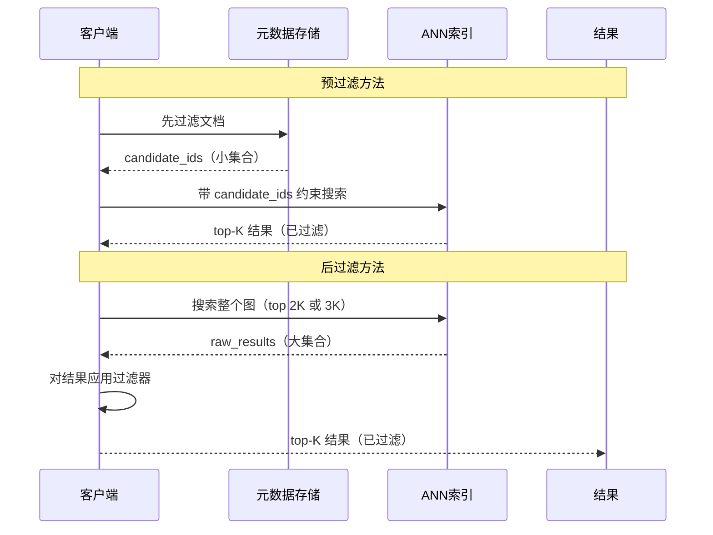
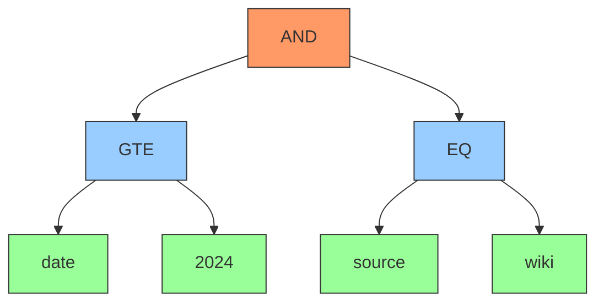
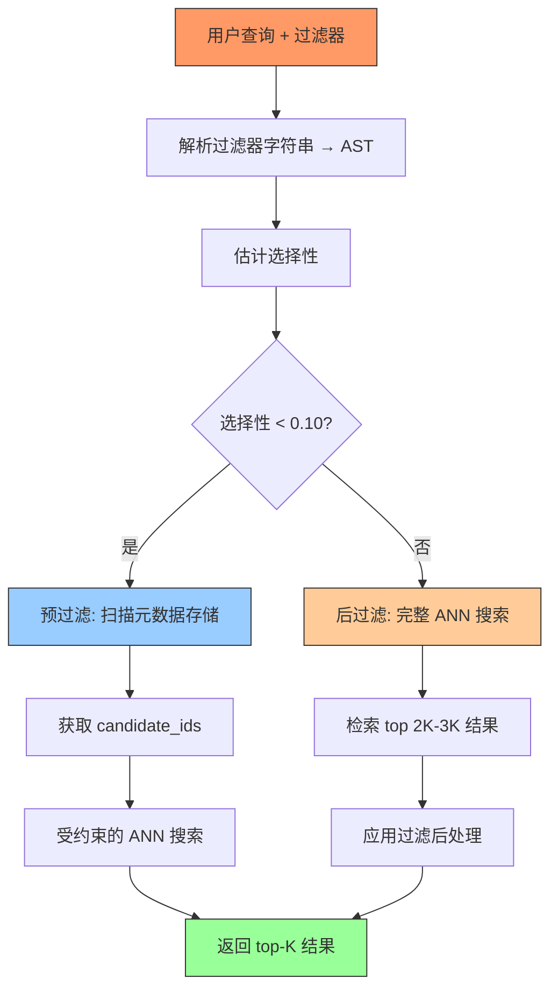

# 第6章 — 元数据与过滤搜索

## 前置知识

> 📎 **参考**: [向量距离度量](../prerequisites/05_向量距离度量.md)
> 📎 **参考**: [测试框架](../prerequisites/04_测试框架.md)

---

## 6.1 问题：语义搜索是不够的

向量搜索返回语义最相似的结果。但真实用户不会问"找到与我最相似的10个文档"。他们会问：

- *"找到2023年之后发布的关于气候政策的文档"*
- *"搜索来自 alice@corp.com 的包含'Q4 路线图'的邮件"*
- *"检索 Python 代码片段，不要 JavaScript"*
- *"找到 50 美元以下、有库存、评分 4 星以上的类似产品"*

向量处理的是"关于气候政策"部分。约束条件——日期、作者、编程语言、价格、可用性、评分——需要其他东西。那个东西就是**元数据过滤**。

**元数据过滤**是将向量搜索结果限制在满足其非向量属性上的结构化约束的文档的过程。它是"语义相似"和"语义相似且满足我的需求"之间的桥梁。

没有元数据过滤，向量数据库只是一个研究好奇心。有了它，它就变成了一个生产就绪的检索系统。

### 6.1.1 核心概念（定义）

在继续之前，我们需要统一词汇。本章中的每个技术术语都在这里定义。阅读此节一次，然后根据需要回参。

#### 向量与嵌入

**向量**（也称为**嵌入**）是一个密集的数值数组——通常是 128 到 4096 个浮点数——将文档的*语义含义*捕捉为高维空间中的一个点。两个含义相似的文档在此空间中产生的向量彼此接近，即使它们没有共享任何词语。

句子"Paris is the capital of France"和"The French capital is Paris"产生几乎相同的向量。将文本转换为向量的数学运算称为**嵌入**，由神经网络模型执行（例如 OpenAI 的 `text-embedding-3-small`，或开源模型如 `bge-base-en`）。

**距离度量**测量两个向量之间的距离。常见选择包括 L2（欧几里得）距离、内积（IP）和余弦相似度。

> 📎 **参考**: [向量距离度量](../prerequisites/05_向量距离度量.md) — 各种距离度量的详细定义、公式和使用场景。

度量的选择会影响哪些结果是"最近的"。

#### ANN（近似最近邻）

**ANN** 代表**近似最近邻（Approximate Nearest Neighbor）**。在高维空间中找到*精确的*最近邻很慢——它需要将查询向量与数据库中的每个向量进行比较（暴力搜索，O(N) 时间）。ANN 算法以少量准确性为代价换取显著的加速。它们不保证真正的最近邻，而是返回一个*可能*接近 top-K 的向量，通常在 95-99% 的召回率内。

生产向量数据库的主导 ANN 算法是 **HNSW**（分层可导航小世界图）。HNSW 构建一个多层图，其中每个向量是一个节点，连接到其近似邻居。搜索从一个粗糙的顶层开始，逐渐下降到更精细的层，向查询的空间区域"跳跃"。它以 O(log N) 的搜索时间实现高召回率。

关键点：**HNSW（以及大多数 ANN 索引）是为纯最近邻搜索构建的。它们没有元数据的概念。** 当你添加过滤器时，索引不知道哪些节点满足它。这种不匹配是所有过滤挑战的根源。

#### 元数据

**元数据**是每个文档的非向量属性。把它想象成图书馆的卡片目录。书架上的书是"向量"——它们的实际内容。卡片目录告诉你标题、作者、出版日期、主题和书架位置。你不会浏览图书馆中的每一本书来找到所有 2020 年之后出版的关于气候变化的书。你会先查看目录。

在向量数据库中，元数据通常包括：
- **文档标识符**：`doc_id`、`source_id`、`URL`
- **时间信息**：`created_at`、`updated_at`、`date_published`
- **分类标签**：`source`（wiki、pdf、email）、`language`、`content_type`
- **数值属性**：`word_count`、`page_number`、`importance_score`
- **自由标签**：`"python, ml, vector, database"`

元数据存储在**元数据存储**中——一个与向量索引分离的数据结构。向量索引存储向量及其 ID；元数据存储将 ID 映射到其属性。将它们分离意味着向量索引保持紧凑和缓存友好。

#### 过滤表达式

**过滤表达式**是元数据字段上的布尔谓词。它是用户约束的结构化表示。示例：

```
date >= 2024 AND source = "wiki"
price < 50 AND in_stock = true
author = "alice" OR author = "bob"
tags IN ("python", "rust") AND NOT tags LIKE "legacy%"
```

过滤表达式对每个文档求值为 `true` 或 `false`。表达式为 `true` 的文档被认为**匹配过滤器**。

#### 合取与析取

这些术语描述了过滤子句如何组合：

- **合取（Conjunctive）**（AND）：所有子句必须为真。`A AND B AND C` 仅在 A、B、C 全部为真时为真。这是*限制性的*——它缩小结果。
- **析取（Disjunctive）**（OR）：任何子句为真就足够。`A OR B OR C` 在 A、B、C 中至少一个为真时为真。这是*扩展性的*——它扩大结果。

这种区分对性能很重要：合取过滤器往往更具选择性（匹配更少的文档），而析取过滤器往往选择性较低（匹配更多）。数据库的过滤策略根据此而不同。

#### 选择性

**选择性**是通过过滤器的文档比例。它是决定如何执行过滤搜索的最重要指标：

```
selectivity = 匹配过滤器的文档数 / 总文档数
```

- **selectivity < 0.01**（1%）：非常高选择性。只有百分之一的文档通过。
- **selectivity 0.01–0.10**（1-10%）：中等选择性。
- **selectivity > 0.10**（10%+）：宽泛。大多数文档通过。

选择性驱动了预过滤和后过滤之间的选择（在 6.2 中解释）。无法估计选择性的数据库是在盲目飞行。

---

## 6.2 预过滤 vs. 后过滤：核心权衡

有两种将过滤与向量搜索结合的基本策略。它们位于光谱的两端，每种都有不同的失败模式。

### 6.2.1 预过滤

**工作原理**：在 ANN 搜索*之前*应用过滤器。扫描元数据存储以找到所有满足过滤器的文档 ID。然后运行 ANN 搜索，但只考虑属于这些 ID 的向量。

```
用户查询: 向量 q, 过滤器 F
         │
         ▼
    ┌──────────────────┐
    │  扫描元数据       │
    │  找到 F 为真的 ID │
    │  → candidate_ids │
    └──────────────────┘
         │
         ▼
    ┌──────────────────┐
    │  带约束的 ANN 搜索│
    │  candidate_ids   │
    │  作为约束         │
    │  → top-K 结果    │
    └──────────────────┘
```

**类比**：你在图书馆找一本 2025 年出版的烹饪书。预过滤是："先去'新书'书架，然后只浏览那个书架。"如果"新书"书架很小，这很快。

**优点**：
- 更少的距离计算（只搜索匹配的向量）。
- 当过滤器选择性很高（候选集小）时效果很好。
- 结果集*保证*满足过滤器（没有浪费工作）。

**缺点**：
- **图碎片化**：HNSW 是一个图。如果过滤器排除了许多节点，剩余的节点可能形成不连通的分量——没有边连接的孤岛。搜索从某个入口点开始，如果该入口点的邻居都被过滤掉了，搜索就会被困在它的孤岛上，无法到达另一个孤岛中的真正最近邻。这导致**召回率急剧下降**。
- **当过滤器宽泛时的开销**：如果过滤器匹配 50% 的文档，你几乎没有减少搜索空间，但增加了过滤的开销。

```
    HNSW 图（无过滤）              预过滤后
    ┌─────────────────┐               ┌─────────────────┐
    │  A ── B ── C    │               │  A ── B    C    │
    │  │ ╲  │  ╱  │   │               │  │ ╲  │         │
    │  D ── E ── F    │               │  D ── E    F    │
    │  │  ╱ │ ╲  │   │               │       ╱         │
    │  G ── H ── I    │               │  G ── H         │
    └─────────────────┘               └─────────────────┘
                                         ↑ C, F, I 是
                                         不连通的
```

### 6.2.2 后过滤

**工作原理**：*先*运行 ANN 搜索，检索比你需要的更多结果（比如 top 2×K 或 top 3×K）。然后将过滤器应用到此结果集，只保留匹配的文档。返回幸存者中的 top K。

```
用户查询: 向量 q, 过滤器 F, top K
         │
         ▼
    ┌──────────────────┐
    │  ANN 搜索        │
    │  （无过滤器）     │
    │  检索 top M=2K   │
    │  个结果           │
    └──────────────────┘
         │
         ▼
    ┌──────────────────┐
    │  应用过滤器 F    │
    │  只保留 F 为真的 │
    │  文档             │
    │  返回 top K      │
    └──────────────────┘
```

**类比**："浏览整个烹饪区，找到 20 本与我喜欢的类似的烹饪书，然后只保留 2025 年出版的。"

**优点**：
- **完整 ANN 召回率**：搜索看到整个图。没有碎片化。ANN 发挥其所长。
- 实现简单——过滤器只是一个后处理步骤。

**缺点**：
- **过度获取**：如果过滤器选择性很高（例如只有 2% 的文档匹配），你可能需要获取 K / 0.02 = 50×K 个向量才能在过滤后得到 K 个结果。这很昂贵——你计算 50×K 个距离只是为了丢弃大部分。
- **浪费计算**：对将被丢弃的向量执行距离计算。
- **延迟**：从磁盘/网络获取 50×K 个向量需要时间。

### 6.2.3 视觉比较



```
预过滤                                    后过滤

┌──────────┐     ┌──────────┐             ┌──────────┐     ┌──────────┐
│ 元数据   │────▶│ 过滤器   │             │ 向量     │────▶│ ANN      │
│ 存储     │     │ 引擎     │             │ 索引     │     │ 搜索     │
└──────────┘     └────┬─────┘             └──────────┘     └────┬─────┘
                      │                                         │
                      ▼                                         ▼
              ┌──────────────┐                           ┌──────────────┐
              │ 候选 ID      │                           │ Top M 结果   │
              │（小集合）     │                           │（可能很大）   │
              └──────┬───────┘                           └──────┬───────┘
                     │                                          │
                     ▼                                          ▼
              ┌──────────────┐                           ┌──────────────┐
              │ ANN 搜索     │                           │ 过滤         │
              │（受约束）     │                           │（后过滤）     │
              └──────┬───────┘                           └──────┬───────┘
                     │                                          │
                     ▼                                          ▼
              ┌──────────────┐                           ┌──────────────┐
              │ Top K 结果   │                           │ Top K 结果   │
              │（已过滤）     │                           │（已过滤）     │
              └──────────────┘                           └──────────────┘

  先过滤，后搜索                         先搜索，后过滤
  召回风险：图碎片化                      召回风险：无（完整图）
  计算风险：低（少量向量）                计算风险：高（过度获取）
```

### 6.2.4 DeepVector 的自适应策略

预过滤和后过滤都不是普遍更好的。DeepVector 在查询时根据估计的选择性做出决定：

1. 使用每字段直方图（在索引期间构建，见 6.7）估计选择性。
2. 如果选择性 < 0.10（少于 10% 的数据通过）：**预过滤**。候选集足够小，受约束的 ANN 效果很好。
3. 如果选择性 ≥ 0.10（10%+ 通过）：**后过滤**。ANN 图基本完整，因此完整搜索 + 后过滤保持召回率。

```cpp
if (estimated_selectivity < 0.10) {
    auto candidate_ids = EvaluateFilterOnIndex(filter);  // scan metadata
    results = hnsw_.Search(query, top_k, candidate_ids);  // constrained search
} else {
    auto raw_results = hnsw_.Search(query, top_k * 2);    // full search
    results = PostFilter(raw_results, filter, top_k);      // apply filter, take top K
}
```

阈值（0.10）是一个启发式值。像 Milvus 这样的生产系统使用更复杂的方法，有时结合两种策略或使用第三种称为**排序过滤**的方法（见 6.9）。

---

## 6.3 过滤 AST — 从文本到表达式树

过滤器以人类可读的字符串形式到达：

```
date >= 2024 AND source = "wiki"
price < 50 AND (category = "electronics" OR category = "computers")
tags IN ("python", "rust") AND NOT tags LIKE "legacy%"
```

数据库需要将这个字符串转换成可以对数百万文档执行的代码。这是一个经典的**编译器前端**问题：将文本解析为可以高效求值的结构化表示。

### 6.3.1 流水线：字符串 → Token → AST → 求值

转换有三个阶段：

**阶段 1：词法分析（分词）**

**词法分析器**（也称为**分词器**或**扫描器**）将原始字符字符串转换为一系列 **Token**。Token 是输入的分类块——最小有意义的单位。词法分析器丢弃空白和注释，并按类型对每个 Token 进行分类。

对于输入 `date >= 2024 AND source = "wiki"`：

```
Token 1: IDENTIFIER("date")     — 字段名
Token 2: GTE(">=")              — 比较运算符
Token 3: INTEGER(2024)          — 数字字面量
Token 4: AND("AND")             — 逻辑连接词
Token 5: IDENTIFIER("source")   — 字段名
Token 6: EQ("=")                — 比较运算符
Token 7: STRING("wiki")         — 字符串字面量
```

词法分析器是一个简单的状态机。它逐个读取字符，累积直到可以分类一个完整的 token。它处理边缘情况，比如：`>=` 是一个 token 还是两个（`>` 然后 `=`）？答案取决于你是在 `>=` 还是 `> x`。词法分析器通过窥视下一个字符来解决这个问题。

**阶段 2：语法分析（解析）**

**解析器**将 token 流转换为**抽象语法树（AST）**，也称为**表达式树**。AST 是一个树数据结构，捕获表达式的*结构*——什么依赖于什么——独立于具体语法。

`date >= 2024 AND source = "wiki"` 的 AST：



AST 中的每个节点要么是：
- **叶节点**：表示单个比较（例如 `date >= 2024`）。包含字段名、运算符和值。
- **内部节点**：表示逻辑组合（AND、OR、NOT）。包含运算符和指向子节点的指针。

AST 无需括号即可捕获运算符优先级。在 `A AND B OR C` 中，解析器知道（从语法）AND 比 OR 绑定得更紧，所以树是：

```
         OR
        / \
      AND   C
     / \
    A   B
```

这意味着 `(A AND B) OR C`，而不是 `A AND (B OR C)`。

**阶段 3：求值**

一旦我们有了 AST，对文档求值就是**树遍历**。从根开始：
- AND 节点仅在*所有*子节点返回 true 时返回 true。
- OR 节点在*任何*子节点返回 true 时返回 true。
- NOT 节点返回其单个子节点的否定。
- 叶节点（EQ、GT 等）对文档的元数据求值比较。

这本质上是**递归的**——每个节点委托给其子节点。求值自然地处理嵌套表达式。

### 6.3.2 递归下降解析器

**递归下降解析器**是为小型语言实现解析器的最简单方式。它是一个**自顶向下的解析器**——它从 AST 的根开始向下工作，对子表达式递归调用自身。

关键洞察：解析器中的每个函数对应语法中的一个*优先级级别*。这就是运算符优先级（规则 `*` 比 `+` 绑定得更紧）的编码方式：

```
expression  →  or_expr
or_expr     →  and_expr ( "OR" and_expr )*
and_expr    →  comparison ( "AND" comparison )*
comparison  →  field ( ">=" | "<=" | "=" | "!=" | ">" | "<" ) value
field       →  IDENTIFIER
value       →  INTEGER | FLOAT | STRING
```

每个函数在其优先级级别消费 token。`or_expr` 函数调用 `and_expr`，后者调用 `comparison`，后者处理叶比较。这种嵌套确保 `A AND B OR C` 被解析为 `(A AND B) OR C`——顶层的 OR 将 AND 的结果作为其操作数。

**运算符优先级**是确定在没有括号的表达式中哪些操作首先求值的规则。就像在算术中 `2 + 3 * 4` 等于 `2 + (3 * 4) = 14`（而不是 `(2 + 3) * 4 = 20`），在过滤表达式中 `A AND B OR C` 意味着 `(A AND B) OR C`。解析器通过函数的嵌套编码了这个优先级。

### 6.3.3 DeepVector 的 FilterNode

```cpp
enum class FilterOp {
    EQ, NE, GT, GTE, LT, LTE,       // scalar comparison
    IN, NOT_IN,                      // set membership
    LIKE,                            // substring / regex
    AND, OR, NOT                     // logical
};

struct FilterNode {
    FilterOp op;
    std::string field;               // e.g. "date", "source", "tags"
    union {
        int64_t  int_val;
        double   float_val;
        std::string str_val;
    };
    std::vector<FilterNode> children;  // for AND/OR/NOT
    std::vector<std::string> set_vals; // for IN/NOT_IN

    static FilterNode Eq(const std::string& field, const std::string& val);
    static FilterNode Gt(const std::string& field, int64_t val);
    static FilterNode Contains(const std::string& field, const std::string& val);
    static FilterNode And(FilterNode a, FilterNode b);
    static FilterNode Or(FilterNode a, FilterNode b);
};
```

静态工厂方法（`Eq`、`Gt`、`And`、`Or`）是构建 AST 而不暴露构造函数的常见 C++ 模式。它们使客户端代码可读：

```cpp
auto filter = FilterNode::And(
    FilterNode::Gt("date", 1700000000000),
    FilterNode::Eq("source", "wiki")
);
```

AST 是一个纯数据结构——没有虚函数，没有继承。这使得它可以轻松序列化（用于缓存或网络传输）且缓存友好（编译器在 `std::vector<FilterNode>` 中连续布局节点）。

---

## 6.4 FieldAccessor 模式

有了 AST，我们需要对实际文档求值。朴素的方法：对每次过滤检查，将整个元数据 blob 反序列化为结构体，然后访问字段。这很慢——大部分工作浪费在过滤器未引用的字段上。

相反，DeepVector 使用 **FieldAccessor** 模式。对于 schema 中的每个字段，我们存储：
- 其在元数据 blob 中的**字节偏移量**（从开头多少字节可以找到此字段）
- 其**大小**（字节）
- 其**类型**（INT32、INT64、FLOAT32、STRING）

求值 `source = 2` 变成单个指针解引用和整数比较：

```cpp
const FieldDesc& fd = schema["source"];
int32_t val = *reinterpret_cast<const int32_t*>(meta_blob + fd.offset);
return val == 2;
```

没有解析。没有分配。没有函数调用。CPU 分支预测器甚至可以对 "source = 2" 这样的常见查询进行模式训练。

```cpp
using FieldAccessor = std::function<void(const char* meta_blob, FieldValue* out)>;

struct FieldDesc {
    std::string name;
    int offset;      // byte offset into the blob
    int size;        // bytes
    FieldType type;  // INT32, INT64, FLOAT32, STRING
};

std::unordered_map<std::string, FieldDesc> schema = {
    {"doc_id",     {0,  8, FieldType::INT64}},
    {"source",     {8,  4, FieldType::INT32}},
    {"created_at", {12, 8, FieldType::INT64}},
    {"updated_at", {20, 8, FieldType::INT64}},
    {"word_count", {28, 4, FieldType::INT32}},
    {"importance", {32, 4, FieldType::FLOAT32}},
    {"tags",       {36, 128, FieldType::STRING}},
};
```

FieldAccessor 将过滤求值与存储解耦。MiniKV 不需要知道元数据 schema——它只是存储二进制 blob 并将它们与正确的访问器表一起传递给求值器。这意味着你可以在不接触 MiniKV 的情况下更改 schema。

### 为什么这很快

性能优势来自 CPU 架构：

1. **无堆分配**：元数据 blob 是一个连续缓冲区。读取字段是指针算术 + 解引用。没有 `new`、没有 `malloc`、没有 `std::string` 复制。
2. **缓存友好**：整个元数据 blob 适合缓存行。顺序字段访问对预取友好。
3. **分支预测**：如果像 `source = 2` 这样的过滤器被执行数百万次，CPU 的分支预测器学习该模式并在数据到达之前推测性地执行比较。
4. **零拷贝**：过滤求值器直接从 blob 读取。没有中间数据结构。

将此与 JSON 反序列化相比，后者需要：解析 JSON 字符串、为键分配 `std::string` 对象、将值从文本转换为数字、构建 `std::unordered_map<std::string, std::any>`——所有这些都对每个文档、每个查询执行。FieldAccessor 方法不做这些。

---

## 6.5 数值 vs. 字符串比较：一个微妙的陷阱

考虑这个查询：

```
score > 700
```

如果 `score` 存储为字符串（因为 schema 设计松散），比较变成**字典序**（字典顺序）：
- `"700" > "2000"` → TRUE（因为第一个字符位置 '7' > '2'）

但用户想要数值比较：
- `700 > 2000` → FALSE

这就是自 CSV 文件、JavaScript 和松散类型数据库以来一直困扰的经典"字符串 vs. 数字"混淆。DeepVector 显式处理它：schema 声明每个字段的类型，比较运算符使用适当的比较。

对于可能是任一种的字段（用户上传的数据），DeepVector 使用 `tryNumeric()` 策略：

```cpp
bool CompareValues(const std::string& field_val, const std::string& filter_val, FilterOp op) {
    // Try numeric comparison first
    try {
        double fv = std::stod(field_val);
        double qv = std::stod(filter_val);
        return NumericCompare(fv, qv, op);
    } catch (...) {
        // Fall back to lexicographic
        return StringCompare(field_val, filter_val, op);
    }
}
```

这并不完美（如果字段包含 "1e5" 怎么办？那是 100000 还是字符串？），但它涵盖了常见情况：看起来像数字的字符串按数值比较。

**教训**：始终显式声明你的 schema 类型。一个名为 "score" 包含 "700" 的字段是在过滤查询中等待爆炸的定时炸弹。

---

## 6.6 何时索引元数据字段

**索引**是构建辅助数据结构的过程，允许在不扫描每个文档的情况下快速查找字段。没有索引，回答"找到所有 source = 'wiki' 的文档"需要读取每个文档的元数据（**全扫描**）。有了索引，你在索引中查找 "wiki"，直接获得匹配文档 ID 的列表。

索引从来不是免费的。每个索引的成本：
- **内存**：索引结构（B-tree、哈希映射、位图）必须存在于 RAM 中。
- **写入时间**：每次插入/更新也必须更新索引。更多索引 = 更慢的写入。
- **复杂性**：更多索引意味着更多代码路径、更多 bug、更多需要保持一致的东西。

### 6.6.1 索引数据结构

元数据索引的两种常见结构：

**哈希索引**（用于 EQ、IN 查询）：
```
source_index:
  "wiki"   → [doc_1, doc_4, doc_7, ...]
  "email"  → [doc_2, doc_3, ...]
  "pdf"    → [doc_5, doc_6, ...]
```

**哈希映射**（也称为**哈希表**或**字典**）使用哈希函数将键映射到值。给定一个键，哈希函数在 O(1) 时间内计算一个数组索引。对于"找到所有 source = wiki 的文档"，你哈希 "wiki" 并获得包含 `[doc_1, doc_4, doc_7]` 的桶——无需扫描。查找平均情况是 O(1)，最坏情况是 O(N)（哈希冲突）。

**B-tree 索引**（用于范围查询：GT、LT、BETWEEN）：
```
sorted source values:
  doc_1: "blog"  ─┐
  doc_5: "email"  │  sorted order
  doc_7: "pdf"   │
  doc_2: "wiki"  ─┘
```

**B-tree**（平衡树）是一种自平衡树数据结构，维护排序数据。每个节点包含一个排序的键数组和指向子节点的指针。分支因子为 B 的 B-tree 可以在 O(log_B(N)) 时间内搜索 N 个项目。对于像 `date BETWEEN 2024 AND 2025` 这样的范围查询，你在 O(log N) 时间内找到范围的起始，然后向前扫描——无需检查每个文档。

### 6.6.2 添加索引的启发式

1. **该字段在 >10% 的查询中使用**（测量它！）。
2. **该字段选择性高**（高基数——许多不同的值）。索引 `gender`（2 个值）很少有帮助；索引 `user_id`（数百万个值）通常有帮助。
3. **点查询**（EQ、IN）受益于哈希索引。**范围查询**（GT、LT、BETWEEN）受益于排序索引（B-tree）。

### 6.6.3 何时不索引

- **小数据集**（<10K 文档）。扫描比索引遍历开销更快。
- **频繁更新的字段**。索引维护成本主导了扫描节省。
- **低选择性字段**。`is_active` 上的索引（90% true，10% false）对 10% 的情况有帮助，但对 90% 的情况增加了开销。

对于 DeepVector，默认是**不索引元数据字段**——因为典型用例是批量插入后跟多次读取，且读取路径已经有快速的过滤求值器。索引是可选的，仅在分析显示瓶颈时推荐。

```cpp
class MetadataStore {
    std::vector<DocumentMeta> cache_;                      // always scanned
    std::unordered_map<int32_t, std::vector<size_t>> source_index_;  // optional
    std::unordered_map<std::string, std::vector<size_t>> tag_index_;  // optional
};
```

---

## 6.7 选择性估计实践

准确的选择性估计是**查询优化**——数据库决定查询最佳执行计划的过程——中最难的问题之一。商业数据库（Oracle、SQL Server）在直方图、草图和抽样上投入了数十年的研究。DeepVector 采用务实的方法。

### 6.7.1 等宽直方图

对于整数字段，DeepVector 维护一个**等宽直方图**：将范围 [min, max] 分为 B 个桶，计算每个桶中有多少文档的值。

**直方图**是数据分布的统计摘要。把它想象成一个条形图，其中每个条形代表一个值范围，条形的高度告诉你有多少文档落在该范围内。等宽直方图将范围分为等大小的桶。

```cpp
struct Histogram {
    std::vector<int> buckets;  // count per bucket
    int64_t min_val, max_val;
    int total_count;
};
```

要估计 `P(date >= 2024)`：找到哪些桶与 [2024, ∞] 重叠，求和它们的计数，除以 total_count。对于 `P(source = "wiki")`：计算 source = wiki 的文档数，除以 total_count（存储为按值计数器，而不是直方图）。

### 6.7.2 独立性假设

对于像 `date >= 2024 AND source = "wiki"` 这样的复合过滤器，我们将各个选择性相乘：

```
P(A AND B) ≈ P(A) × P(B) = 0.30 × 0.15 = 0.045
```

这假设 A 和 B 是**独立的**——知道一个文档满足 A 告诉你关于它是否满足 B 的信息。它们通常不是独立的。例如，`source = "wiki"` 和 `word_count > 10000` 可能相关（维基百科文章往往很长）。当假设失效时，我们可能在应该使用后过滤时选择预过滤，反之亦然。

错误选择性估计的真正代价对向量搜索来说很少是灾难性的——最坏情况是我们获取一些额外的候选或做一些额外的距离计算。这不是一个坏估计可以将 1 秒查询变成 1 小时查询的 SQL 连接。

### 6.7.3 OR 的容斥原理

对于析取过滤器，我们使用概率论中的容斥原理：

```
P(A OR B) = P(A) + P(B) - P(A AND B)
           ≈ P(A) + P(B) - P(A) × P(B)
```

这修正了同时满足 A 和 B 的文档的双重计数。

---

## 6.8 与 ANN 搜索的集成 — 完整流水线

### 过滤流水线概览



```
用户查询到达:
  向量 q = embed("climate policy")
  过滤器 f = "date >= 2024 AND source = 'wiki'"
                    │
                    ▼
  ┌─────────────────────────────────────┐
  │ 1. 解析过滤器字符串 → AST          │
  │    FilterNode f = {AND,            │
  │      {GT, "date", 2024},           │
  │      {EQ, "source", "wiki"}}       │
  └─────────────────────────────────────┘
                    │
                    ▼
  ┌─────────────────────────────────────┐
  │ 2. 估计选择性                       │
  │    P(date>=2024) = 0.30            │
  │    P(source=wiki) = 0.15           │
  │    P(AND) = 0.30 × 0.15 = 0.045    │
  │    0.045 < 0.10 → 预过滤            │
  └─────────────────────────────────────┘
                    │
                    ▼
  ┌─────────────────────────────────────┐
  │ 3. 预过滤                           │
  │    candidate_ids = []              │
  │    for each doc in metadata_store: │
  │        if eval(f, doc):            │
  │            candidate_ids += doc.id │
  │    → 4.5% 的文档匹配                │
  └─────────────────────────────────────┘
                    │
                    ▼
  ┌─────────────────────────────────────┐
  │ 4. 受约束的 ANN 搜索               │
  │    hnsw.Search(q, top_k=10,        │
  │                 allowed=candidate_ids)│
  │    → 带元数据的结果                 │
  └─────────────────────────────────────┘
```

---

## 6.9 生产系统如何处理

上述方法是基础。生产向量数据库增加了复杂性。

### Milvus

**Milvus**（https://milvus.io）是一个开源向量数据库。它的过滤搜索方法：

- 使用**段级过滤**：每个段（索引的一个分区）有自己的元数据字段的布隆过滤器或索引。在查询时，它剪枝不能匹配过滤器的整个段，然后在剩余段上运行 ANN。
- 支持字符串字段的**标量索引**（倒排索引）和数值字段的**排序索引**。
- 提供预过滤和后过滤模式，用户可以通过查询参数选择。
- 对于高选择性过滤器，使用**索引辅助过滤**：元数据索引产生候选集，ANN 索引仅在该集中搜索。

### Weaviate

**Weaviate**（https://weaviate.io）使用不同的架构：

- 反转问题：不是过滤 ANN 结果，而是使用 **BM25 + 向量混合搜索**。元数据字段使用倒排索引（如搜索引擎）进行索引，向量搜索与关键字搜索结合。
- 对于纯向量 + 过滤器，使用**基于位图的方法**：为每个过滤器子句计算一个位图（一个位向量，其中每个位代表一个文档）。位图使用按位 AND/OR 操作组合，生成的位图掩盖向量搜索。
- 对于合取过滤器（按位 AND 是 64 位字上的单个 CPU 指令）非常快。

### Pinecone

**Pinecone**（一个托管向量数据库）使用**基于命名空间的过滤**：你将数据分区为命名空间（如集合），每个命名空间可以有自己的元数据过滤器。这完全避免了图碎片化问题，因为每个命名空间的 HNSW 图是独立构建的。

### 共同模式

所有生产系统共享这些原则：
1. **元数据索引是可选的，但推荐**用于频繁过滤器使用的字段。
2. **选择性估计驱动策略**——系统根据过滤器的选择性进行调整。
3. **位图交集**用于高选择性合取过滤器。
4. **过度获取 + 后过滤**是安全的默认选择——它以额外计算为代价保持召回率。

---

## 代码练习

### 第 A 部分 — 过滤 AST 求值器

为基于标签的系统构建过滤求值器：

```cpp
struct FilterNode {
    enum Op { EQ, NE, AND, OR, NOT } op;
    std::string field;
    std::string value;
    std::vector<FilterNode> children;

    static FilterNode MakeEq(const std::string& f, const std::string& v) {
        return {EQ, f, v, {}};
    }
    static FilterNode MakeAnd(FilterNode a, FilterNode b) {
        return {AND, "", "", {a, b}};
    }
    static FilterNode MakeOr(FilterNode a, FilterNode b) {
        return {OR, "", "", {a, b}};
    }
    static FilterNode MakeNot(FilterNode a) {
        return {NOT, "", "", {a}};
    }
};

class FilterEvaluator {
public:
    bool Evaluate(const FilterNode& node, const DocumentMeta& meta) const;
private:
    std::string GetField(const std::string& name, const DocumentMeta& meta) const {
        if (name == "tags") return meta.tags;
        if (name == "source") return std::to_string(meta.source);
        return "";
    }
};

bool FilterEvaluator::Evaluate(const FilterNode& node, const DocumentMeta& meta) const {
    switch (node.op) {
        case FilterNode::EQ:  return GetField(node.field, meta) == node.value;
        case FilterNode::NE:  return GetField(node.field, meta) != node.value;
        case FilterNode::AND: {
            for (auto& c : node.children)
                if (!Evaluate(c, meta)) return false;
            return true;
        }
        case FilterNode::OR: {
            for (auto& c : node.children)
                if (Evaluate(c, meta)) return true;
            return false;
        }
        case FilterNode::NOT:
            return !Evaluate(node.children[0], meta);
    }
    return false;
}
```

**测试它**：

```cpp
auto filter = FilterNode::MakeAnd(
    FilterNode::MakeOr(
        FilterNode::MakeEq("source", "0"),
        FilterNode::MakeEq("source", "1")
    ),
    FilterNode::MakeEq("tags", "python")
);

FilterEvaluator eval;
DocumentMeta doc1 = {0, "python,ml"};
DocumentMeta doc2 = {2, "python,rust"};
DocumentMeta doc3 = {1, "cpp,rust"};

assert(eval.Evaluate(filter, doc1) == true);
assert(eval.Evaluate(filter, doc2) == false);
assert(eval.Evaluate(filter, doc3) == false);
```

### 第 B 部分 — 平面文件元数据存储

将文档语料库存储在平面二进制文件中：

```cpp
class MetadataStore {
public:
    void Insert(const DocumentMeta& meta);
    std::vector<DocumentMeta> Search(const FilterNode& filter);
private:
    int fd_;
    std::vector<DocumentMeta> cache_;
    FilterEvaluator eval_;
};
```

**要求**：
- `Insert`：将序列化的 `DocumentMeta` 追加到文件（固定 164 字节）。同时推送到缓存。
- `Search`：遍历缓存，求值过滤器，收集匹配项。
- 构造时，将文件加载到缓存中。
- **加分**：对于 `tags` 字段的 EQ，预构建哈希映射 `tag → vector<int> indices`。用它来加速按单个标签过滤的查询。

### 第 C 部分 — 选择性估计器

添加一个简单的选择性估计器：

```cpp
struct Histogram {
    std::vector<int> buckets;
    int64_t min_val, max_val;
    int total_count;
};

class SelectivityEstimator {
    std::unordered_map<std::string, Histogram> histograms_;
public:
    void Record(const DocumentMeta& meta);
    double Estimate(const FilterNode& filter) const;
};
```

估计 `source = 0` 为：`histograms_["source"].buckets[0] / total_count`。对于 AND，将子估计相乘（朴素独立性）。对于 OR，使用容斥原理：`P(A) + P(B) - P(A)*P(B)`。

---

## 思考题

1. **为什么 FieldAccessor 模式与硬编码偏移量比 JSON 反序列化更快？** 考虑 CPU 缓存行为和分支预测。每种方法执行多少条指令？

2. **什么时候预过滤实际上会损害召回率？** 思考当过滤器将图分割为不连通分量时的 ANN 图遍历。绘制过滤前后的图。

3. **我们的选择性估计器假设过滤子句的独立性。什么时候这会失效？** 给出一个具体的 `source` 和 `tags` 字段的例子。估计选择性是多少，真实选择性是多少？

4. **对于整数范围过滤器（`date BETWEEN x AND y`），元数据字段上的 B-tree 索引如何帮助？** 比较扫描所有元数据与探测有 100K 条目的 B-tree 的 I/O 成本。估计每种情况的磁盘读取次数。

5. **`LIKE "%pattern%"` 在标签字段上的最坏情况复杂度是什么？** 三元组索引（将字符串分解为 3 字符的 n-gram）如何帮助？

---

## 参考文献

- Chaudhuri, Surajit. "An overview of query optimization in relational systems." *Proceedings of PODS*, 1998.
- Garcia-Molina, Ullman, Widom. *Database Systems: The Complete Book*. 关于查询执行和选择性估计的章节。
- Milvus Filtered Search Documentation: https://milvus.io/docs/filtered-search.md
- Weaviate Hybrid Search: https://weaviate.io/developers/weaviate/search/hybrid
- CockroachDB Cost-based Optimizer: 基于直方图的选择性估计的细节。
