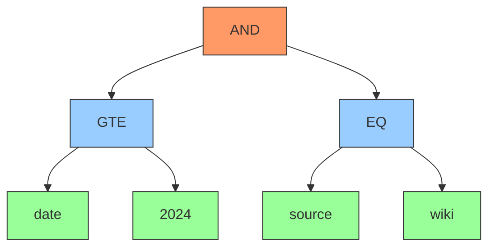

# 绗?绔?鈥?鍏冩暟鎹笌杩囨护鎼滅储

## 鍓嶇疆鐭ヨ瘑

> 馃搸 **鍙傝€?*: [鍚戦噺璺濈搴﹂噺](../prerequisites/05_鍚戦噺璺濈搴﹂噺.md)
> 馃搸 **鍙傝€?*: [娴嬭瘯妗嗘灦](../prerequisites/04_娴嬭瘯妗嗘灦.md)

---

## 6.1 闂锛氳涔夋悳绱㈡槸涓嶅鐨?
鍚戦噺鎼滅储杩斿洖璇箟鏈€鐩镐技鐨勭粨鏋溿€備絾鐪熷疄鐢ㄦ埛涓嶄細闂?鎵惧埌涓庢垜鏈€鐩镐技鐨?0涓枃妗?銆備粬浠細闂細

- *"鎵惧埌2023骞翠箣鍚庡彂甯冪殑鍏充簬姘斿€欐斂绛栫殑鏂囨。"*
- *"鎼滅储鏉ヨ嚜 alice@corp.com 鐨勫寘鍚?Q4 璺嚎鍥?鐨勯偖浠?*
- *"妫€绱?Python 浠ｇ爜鐗囨锛屼笉瑕?JavaScript"*
- *"鎵惧埌 50 缇庡厓浠ヤ笅銆佹湁搴撳瓨銆佽瘎鍒?4 鏄熶互涓婄殑绫讳技浜у搧"*

鍚戦噺澶勭悊鐨勬槸"鍏充簬姘斿€欐斂绛?閮ㄥ垎銆傜害鏉熸潯浠垛€斺€旀棩鏈熴€佷綔鑰呫€佺紪绋嬭瑷€銆佷环鏍笺€佸彲鐢ㄦ€с€佽瘎鍒嗏€斺€旈渶瑕佸叾浠栦笢瑗裤€傞偅涓笢瑗垮氨鏄?*鍏冩暟鎹繃婊?*銆?
**鍏冩暟鎹繃婊?*鏄皢鍚戦噺鎼滅储缁撴灉闄愬埗鍦ㄦ弧瓒冲叾闈炲悜閲忓睘鎬т笂鐨勭粨鏋勫寲绾︽潫鐨勬枃妗ｇ殑杩囩▼銆傚畠鏄?璇箟鐩镐技"鍜?璇箟鐩镐技涓旀弧瓒虫垜鐨勯渶姹?涔嬮棿鐨勬ˉ姊併€?
娌℃湁鍏冩暟鎹繃婊わ紝鍚戦噺鏁版嵁搴撳彧鏄竴涓爺绌跺ソ濂囧績銆傛湁浜嗗畠锛屽畠灏卞彉鎴愪簡涓€涓敓浜у氨缁殑妫€绱㈢郴缁熴€?
### 6.1.1 鏍稿績姒傚康锛堝畾涔夛級

鍦ㄧ户缁箣鍓嶏紝鎴戜滑闇€瑕佺粺涓€璇嶆眹銆傛湰绔犱腑鐨勬瘡涓妧鏈湳璇兘鍦ㄨ繖閲屽畾涔夈€傞槄璇绘鑺備竴娆★紝鐒跺悗鏍规嵁闇€瑕佸洖鍙傘€?
#### 鍚戦噺涓庡祵鍏?
**鍚戦噺**锛堜篃绉颁负**宓屽叆**锛夋槸涓€涓瘑闆嗙殑鏁板€兼暟缁勨€斺€旈€氬父鏄?128 鍒?4096 涓诞鐐规暟鈥斺€斿皢鏂囨。鐨?璇箟鍚箟*鎹曟崏涓洪珮缁寸┖闂翠腑鐨勪竴涓偣銆備袱涓惈涔夌浉浼肩殑鏂囨。鍦ㄦ绌洪棿涓骇鐢熺殑鍚戦噺褰兼鎺ヨ繎锛屽嵆浣垮畠浠病鏈夊叡浜换浣曡瘝璇€?
鍙ュ瓙"Paris is the capital of France"鍜?The French capital is Paris"浜х敓鍑犱箮鐩稿悓鐨勫悜閲忋€傚皢鏂囨湰杞崲涓哄悜閲忕殑鏁板杩愮畻绉颁负**宓屽叆**锛岀敱绁炵粡缃戠粶妯″瀷鎵ц锛堜緥濡?OpenAI 鐨?`text-embedding-3-small`锛屾垨寮€婧愭ā鍨嬪 `bge-base-en`锛夈€?
**璺濈搴﹂噺**娴嬮噺涓や釜鍚戦噺涔嬮棿鐨勮窛绂汇€傚父瑙侀€夋嫨鍖呮嫭 L2锛堟鍑犻噷寰楋級璺濈銆佸唴绉紙IP锛夊拰浣欏鸡鐩镐技搴︺€?
> 馃搸 **鍙傝€?*: [鍚戦噺璺濈搴﹂噺](../prerequisites/05_鍚戦噺璺濈搴﹂噺.md) 鈥?鍚勭璺濈搴﹂噺鐨勮缁嗗畾涔夈€佸叕寮忓拰浣跨敤鍦烘櫙銆?
搴﹂噺鐨勯€夋嫨浼氬奖鍝嶅摢浜涚粨鏋滄槸"鏈€杩戠殑"銆?
#### ANN锛堣繎浼兼渶杩戦偦锛?
**ANN** 浠ｈ〃**杩戜技鏈€杩戦偦锛圓pproximate Nearest Neighbor锛?*銆傚湪楂樼淮绌洪棿涓壘鍒?绮剧‘鐨?鏈€杩戦偦寰堟參鈥斺€斿畠闇€瑕佸皢鏌ヨ鍚戦噺涓庢暟鎹簱涓殑姣忎釜鍚戦噺杩涜姣旇緝锛堟毚鍔涙悳绱紝O(N) 鏃堕棿锛夈€侫NN 绠楁硶浠ュ皯閲忓噯纭€т负浠ｄ环鎹㈠彇鏄捐憲鐨勫姞閫熴€傚畠浠笉淇濊瘉鐪熸鐨勬渶杩戦偦锛岃€屾槸杩斿洖涓€涓?鍙兘*鎺ヨ繎 top-K 鐨勫悜閲忥紝閫氬父鍦?95-99% 鐨勫彫鍥炵巼鍐呫€?
鐢熶骇鍚戦噺鏁版嵁搴撶殑涓诲 ANN 绠楁硶鏄?**HNSW**锛堝垎灞傚彲瀵艰埅灏忎笘鐣屽浘锛夈€侶NSW 鏋勫缓涓€涓灞傚浘锛屽叾涓瘡涓悜閲忔槸涓€涓妭鐐癸紝杩炴帴鍒板叾杩戜技閭诲眳銆傛悳绱粠涓€涓矖绯欑殑椤跺眰寮€濮嬶紝閫愭笎涓嬮檷鍒版洿绮剧粏鐨勫眰锛屽悜鏌ヨ鐨勭┖闂村尯鍩?璺宠穬"銆傚畠浠?O(log N) 鐨勬悳绱㈡椂闂村疄鐜伴珮鍙洖鐜囥€?
鍏抽敭鐐癸細**HNSW锛堜互鍙婂ぇ澶氭暟 ANN 绱㈠紩锛夋槸涓虹函鏈€杩戦偦鎼滅储鏋勫缓鐨勩€傚畠浠病鏈夊厓鏁版嵁鐨勬蹇点€?* 褰撲綘娣诲姞杩囨护鍣ㄦ椂锛岀储寮曚笉鐭ラ亾鍝簺鑺傜偣婊¤冻瀹冦€傝繖绉嶄笉鍖归厤鏄墍鏈夎繃婊ゆ寫鎴樼殑鏍规簮銆?
#### 鍏冩暟鎹?
**鍏冩暟鎹?*鏄瘡涓枃妗ｇ殑闈炲悜閲忓睘鎬с€傛妸瀹冩兂璞℃垚鍥句功棣嗙殑鍗＄墖鐩綍銆備功鏋朵笂鐨勪功鏄?鍚戦噺"鈥斺€斿畠浠殑瀹為檯鍐呭銆傚崱鐗囩洰褰曞憡璇変綘鏍囬銆佷綔鑰呫€佸嚭鐗堟棩鏈熴€佷富棰樺拰涔︽灦浣嶇疆銆備綘涓嶄細娴忚鍥句功棣嗕腑鐨勬瘡涓€鏈功鏉ユ壘鍒版墍鏈?2020 骞翠箣鍚庡嚭鐗堢殑鍏充簬姘斿€欏彉鍖栫殑涔︺€備綘浼氬厛鏌ョ湅鐩綍銆?
鍦ㄥ悜閲忔暟鎹簱涓紝鍏冩暟鎹€氬父鍖呮嫭锛?- **鏂囨。鏍囪瘑绗?*锛歚doc_id`銆乣source_id`銆乣URL`
- **鏃堕棿淇℃伅**锛歚created_at`銆乣updated_at`銆乣date_published`
- **鍒嗙被鏍囩**锛歚source`锛坵iki銆乸df銆乪mail锛夈€乣language`銆乣content_type`
- **鏁板€煎睘鎬?*锛歚word_count`銆乣page_number`銆乣importance_score`
- **鑷敱鏍囩**锛歚"python, ml, vector, database"`

鍏冩暟鎹瓨鍌ㄥ湪**鍏冩暟鎹瓨鍌?*涓€斺€斾竴涓笌鍚戦噺绱㈠紩鍒嗙鐨勬暟鎹粨鏋勩€傚悜閲忕储寮曞瓨鍌ㄥ悜閲忓強鍏?ID锛涘厓鏁版嵁瀛樺偍灏?ID 鏄犲皠鍒板叾灞炴€с€傚皢瀹冧滑鍒嗙鎰忓懗鐫€鍚戦噺绱㈠紩淇濇寔绱у噾鍜岀紦瀛樺弸濂姐€?
#### 杩囨护琛ㄨ揪寮?
**杩囨护琛ㄨ揪寮?*鏄厓鏁版嵁瀛楁涓婄殑甯冨皵璋撹瘝銆傚畠鏄敤鎴风害鏉熺殑缁撴瀯鍖栬〃绀恒€傜ず渚嬶細

```
date >= 2024 AND source = "wiki"
price < 50 AND in_stock = true
author = "alice" OR author = "bob"
tags IN ("python", "rust") AND NOT tags LIKE "legacy%"
```

杩囨护琛ㄨ揪寮忓姣忎釜鏂囨。姹傚€间负 `true` 鎴?`false`銆傝〃杈惧紡涓?`true` 鐨勬枃妗ｈ璁や负**鍖归厤杩囨护鍣?*銆?
#### 鍚堝彇涓庢瀽鍙?
杩欎簺鏈鎻忚堪浜嗚繃婊ゅ瓙鍙ュ浣曠粍鍚堬細

- **鍚堝彇锛圕onjunctive锛?*锛圓ND锛夛細鎵€鏈夊瓙鍙ュ繀椤讳负鐪熴€俙A AND B AND C` 浠呭湪 A銆丅銆丆 鍏ㄩ儴涓虹湡鏃朵负鐪熴€傝繖鏄?闄愬埗鎬х殑*鈥斺€斿畠缂╁皬缁撴灉銆?- **鏋愬彇锛圖isjunctive锛?*锛圤R锛夛細浠讳綍瀛愬彞涓虹湡灏辫冻澶熴€俙A OR B OR C` 鍦?A銆丅銆丆 涓嚦灏戜竴涓负鐪熸椂涓虹湡銆傝繖鏄?鎵╁睍鎬х殑*鈥斺€斿畠鎵╁ぇ缁撴灉銆?
杩欑鍖哄垎瀵规€ц兘寰堥噸瑕侊細鍚堝彇杩囨护鍣ㄥ線寰€鏇村叿閫夋嫨鎬э紙鍖归厤鏇村皯鐨勬枃妗ｏ級锛岃€屾瀽鍙栬繃婊ゅ櫒寰€寰€閫夋嫨鎬ц緝浣庯紙鍖归厤鏇村锛夈€傛暟鎹簱鐨勮繃婊ょ瓥鐣ユ牴鎹鑰屼笉鍚屻€?
#### 閫夋嫨鎬?
**閫夋嫨鎬?*鏄€氳繃杩囨护鍣ㄧ殑鏂囨。姣斾緥銆傚畠鏄喅瀹氬浣曟墽琛岃繃婊ゆ悳绱㈢殑鏈€閲嶈鎸囨爣锛?
```
selectivity = 鍖归厤杩囨护鍣ㄧ殑鏂囨。鏁?/ 鎬绘枃妗ｆ暟
```

- **selectivity < 0.01**锛?%锛夛細闈炲父楂橀€夋嫨鎬с€傚彧鏈夌櫨鍒嗕箣涓€鐨勬枃妗ｉ€氳繃銆?- **selectivity 0.01鈥?.10**锛?-10%锛夛細涓瓑閫夋嫨鎬с€?- **selectivity > 0.10**锛?0%+锛夛細瀹芥硾銆傚ぇ澶氭暟鏂囨。閫氳繃銆?
閫夋嫨鎬ч┍鍔ㄤ簡棰勮繃婊ゅ拰鍚庤繃婊や箣闂寸殑閫夋嫨锛堝湪 6.2 涓В閲婏級銆傛棤娉曚及璁￠€夋嫨鎬х殑鏁版嵁搴撴槸鍦ㄧ洸鐩琛屻€?
---

## 6.2 棰勮繃婊?vs. 鍚庤繃婊わ細鏍稿績鏉冭　

鏈変袱绉嶅皢杩囨护涓庡悜閲忔悳绱㈢粨鍚堢殑鍩烘湰绛栫暐銆傚畠浠綅浜庡厜璋辩殑涓ょ锛屾瘡绉嶉兘鏈変笉鍚岀殑澶辫触妯″紡銆?
### 6.2.1 棰勮繃婊?
**宸ヤ綔鍘熺悊**锛氬湪 ANN 鎼滅储*涔嬪墠*搴旂敤杩囨护鍣ㄣ€傛壂鎻忓厓鏁版嵁瀛樺偍浠ユ壘鍒版墍鏈夋弧瓒宠繃婊ゅ櫒鐨勬枃妗?ID銆傜劧鍚庤繍琛?ANN 鎼滅储锛屼絾鍙€冭檻灞炰簬杩欎簺 ID 鐨勫悜閲忋€?
```
鐢ㄦ埛鏌ヨ: 鍚戦噺 q, 杩囨护鍣?F
         鈹?         鈻?    鈹屸攢鈹€鈹€鈹€鈹€鈹€鈹€鈹€鈹€鈹€鈹€鈹€鈹€鈹€鈹€鈹€鈹€鈹€鈹?    鈹? 鎵弿鍏冩暟鎹?      鈹?    鈹? 鎵惧埌 F 涓虹湡鐨?ID 鈹?    鈹? 鈫?candidate_ids 鈹?    鈹斺攢鈹€鈹€鈹€鈹€鈹€鈹€鈹€鈹€鈹€鈹€鈹€鈹€鈹€鈹€鈹€鈹€鈹€鈹?         鈹?         鈻?    鈹屸攢鈹€鈹€鈹€鈹€鈹€鈹€鈹€鈹€鈹€鈹€鈹€鈹€鈹€鈹€鈹€鈹€鈹€鈹?    鈹? 甯︾害鏉熺殑 ANN 鎼滅储鈹?    鈹? candidate_ids   鈹?    鈹? 浣滀负绾︽潫         鈹?    鈹? 鈫?top-K 缁撴灉    鈹?    鈹斺攢鈹€鈹€鈹€鈹€鈹€鈹€鈹€鈹€鈹€鈹€鈹€鈹€鈹€鈹€鈹€鈹€鈹€鈹?```

**绫绘瘮**锛氫綘鍦ㄥ浘涔﹂鎵句竴鏈?2025 骞村嚭鐗堢殑鐑归オ涔︺€傞杩囨护鏄細"鍏堝幓'鏂颁功'涔︽灦锛岀劧鍚庡彧娴忚閭ｄ釜涔︽灦銆?濡傛灉"鏂颁功"涔︽灦寰堝皬锛岃繖寰堝揩銆?
**浼樼偣**锛?- 鏇村皯鐨勮窛绂昏绠楋紙鍙悳绱㈠尮閰嶇殑鍚戦噺锛夈€?- 褰撹繃婊ゅ櫒閫夋嫨鎬у緢楂橈紙鍊欓€夐泦灏忥級鏃舵晥鏋滃緢濂姐€?- 缁撴灉闆?淇濊瘉*婊¤冻杩囨护鍣紙娌℃湁娴垂宸ヤ綔锛夈€?
**缂虹偣**锛?- **鍥剧鐗囧寲**锛欻NSW 鏄竴涓浘銆傚鏋滆繃婊ゅ櫒鎺掗櫎浜嗚澶氳妭鐐癸紝鍓╀綑鐨勮妭鐐瑰彲鑳藉舰鎴愪笉杩為€氱殑鍒嗛噺鈥斺€旀病鏈夎竟杩炴帴鐨勫宀涖€傛悳绱粠鏌愪釜鍏ュ彛鐐瑰紑濮嬶紝濡傛灉璇ュ叆鍙ｇ偣鐨勯偦灞呴兘琚繃婊ゆ帀浜嗭紝鎼滅储灏变細琚洶鍦ㄥ畠鐨勫宀涗笂锛屾棤娉曞埌杈惧彟涓€涓宀涗腑鐨勭湡姝ｆ渶杩戦偦銆傝繖瀵艰嚧**鍙洖鐜囨€ュ墽涓嬮檷**銆?- **褰撹繃婊ゅ櫒瀹芥硾鏃剁殑寮€閿€**锛氬鏋滆繃婊ゅ櫒鍖归厤 50% 鐨勬枃妗ｏ紝浣犲嚑涔庢病鏈夊噺灏戞悳绱㈢┖闂达紝浣嗗鍔犱簡杩囨护鐨勫紑閿€銆?
```
    HNSW 鍥撅紙鏃犺繃婊わ級              棰勮繃婊ゅ悗
    鈹屸攢鈹€鈹€鈹€鈹€鈹€鈹€鈹€鈹€鈹€鈹€鈹€鈹€鈹€鈹€鈹€鈹€鈹?              鈹屸攢鈹€鈹€鈹€鈹€鈹€鈹€鈹€鈹€鈹€鈹€鈹€鈹€鈹€鈹€鈹€鈹€鈹?    鈹? A 鈹€鈹€ B 鈹€鈹€ C    鈹?              鈹? A 鈹€鈹€ B    C    鈹?    鈹? 鈹?鈺? 鈹? 鈺? 鈹?  鈹?              鈹? 鈹?鈺? 鈹?        鈹?    鈹? D 鈹€鈹€ E 鈹€鈹€ F    鈹?              鈹? D 鈹€鈹€ E    F    鈹?    鈹? 鈹? 鈺?鈹?鈺? 鈹?  鈹?              鈹?      鈺?        鈹?    鈹? G 鈹€鈹€ H 鈹€鈹€ I    鈹?              鈹? G 鈹€鈹€ H         鈹?    鈹斺攢鈹€鈹€鈹€鈹€鈹€鈹€鈹€鈹€鈹€鈹€鈹€鈹€鈹€鈹€鈹€鈹€鈹?              鈹斺攢鈹€鈹€鈹€鈹€鈹€鈹€鈹€鈹€鈹€鈹€鈹€鈹€鈹€鈹€鈹€鈹€鈹?                                         鈫?C, F, I 鏄?                                         涓嶈繛閫氱殑
```

### 6.2.2 鍚庤繃婊?
**宸ヤ綔鍘熺悊**锛?鍏?杩愯 ANN 鎼滅储锛屾绱㈡瘮浣犻渶瑕佺殑鏇村缁撴灉锛堟瘮濡?top 2脳K 鎴?top 3脳K锛夈€傜劧鍚庡皢杩囨护鍣ㄥ簲鐢ㄥ埌姝ょ粨鏋滈泦锛屽彧淇濈暀鍖归厤鐨勬枃妗ｃ€傝繑鍥炲垢瀛樿€呬腑鐨?top K銆?
```
鐢ㄦ埛鏌ヨ: 鍚戦噺 q, 杩囨护鍣?F, top K
         鈹?         鈻?    鈹屸攢鈹€鈹€鈹€鈹€鈹€鈹€鈹€鈹€鈹€鈹€鈹€鈹€鈹€鈹€鈹€鈹€鈹€鈹?    鈹? ANN 鎼滅储        鈹?    鈹? 锛堟棤杩囨护鍣級     鈹?    鈹? 妫€绱?top M=2K   鈹?    鈹? 涓粨鏋?          鈹?    鈹斺攢鈹€鈹€鈹€鈹€鈹€鈹€鈹€鈹€鈹€鈹€鈹€鈹€鈹€鈹€鈹€鈹€鈹€鈹?         鈹?         鈻?    鈹屸攢鈹€鈹€鈹€鈹€鈹€鈹€鈹€鈹€鈹€鈹€鈹€鈹€鈹€鈹€鈹€鈹€鈹€鈹?    鈹? 搴旂敤杩囨护鍣?F    鈹?    鈹? 鍙繚鐣?F 涓虹湡鐨?鈹?    鈹? 鏂囨。             鈹?    鈹? 杩斿洖 top K      鈹?    鈹斺攢鈹€鈹€鈹€鈹€鈹€鈹€鈹€鈹€鈹€鈹€鈹€鈹€鈹€鈹€鈹€鈹€鈹€鈹?```

**绫绘瘮**锛?娴忚鏁翠釜鐑归オ鍖猴紝鎵惧埌 20 鏈笌鎴戝枩娆㈢殑绫讳技鐨勭児楗功锛岀劧鍚庡彧淇濈暀 2025 骞村嚭鐗堢殑銆?

**浼樼偣**锛?- **瀹屾暣 ANN 鍙洖鐜?*锛氭悳绱㈢湅鍒版暣涓浘銆傛病鏈夌鐗囧寲銆侫NN 鍙戞尌鍏舵墍闀裤€?- 瀹炵幇绠€鍗曗€斺€旇繃婊ゅ櫒鍙槸涓€涓悗澶勭悊姝ラ銆?
**缂虹偣**锛?- **杩囧害鑾峰彇**锛氬鏋滆繃婊ゅ櫒閫夋嫨鎬у緢楂橈紙渚嬪鍙湁 2% 鐨勬枃妗ｅ尮閰嶏級锛屼綘鍙兘闇€瑕佽幏鍙?K / 0.02 = 50脳K 涓悜閲忔墠鑳藉湪杩囨护鍚庡緱鍒?K 涓粨鏋溿€傝繖寰堟槀璐碘€斺€斾綘璁＄畻 50脳K 涓窛绂诲彧鏄负浜嗕涪寮冨ぇ閮ㄥ垎銆?- **娴垂璁＄畻**锛氬灏嗚涓㈠純鐨勫悜閲忔墽琛岃窛绂昏绠椼€?- **寤惰繜**锛氫粠纾佺洏/缃戠粶鑾峰彇 50脳K 涓悜閲忛渶瑕佹椂闂淬€?
### 6.2.3 瑙嗚姣旇緝

```mermaid
sequenceDiagram
    participant 瀹㈡埛绔?    participant 鍏冩暟鎹瓨鍌?    participant ANN绱㈠紩
    participant 缁撴灉

    Note over 瀹㈡埛绔?缁撴灉: 棰勮繃婊ゆ柟娉?    瀹㈡埛绔?>>鍏冩暟鎹瓨鍌? 鍏堣繃婊ゆ枃妗?    鍏冩暟鎹瓨鍌?->>瀹㈡埛绔? candidate_ids锛堝皬闆嗗悎锛?    瀹㈡埛绔?>>ANN绱㈠紩: 甯?candidate_ids 绾︽潫鎼滅储
    ANN绱㈠紩-->>瀹㈡埛绔? top-K 缁撴灉锛堝凡杩囨护锛?    
    Note over 瀹㈡埛绔?缁撴灉: 鍚庤繃婊ゆ柟娉?    瀹㈡埛绔?>>ANN绱㈠紩: 鎼滅储鏁翠釜鍥撅紙top 2K 鎴?3K锛?    ANN绱㈠紩-->>瀹㈡埛绔? raw_results锛堝ぇ闆嗗悎锛?    瀹㈡埛绔?>>瀹㈡埛绔? 瀵圭粨鏋滃簲鐢ㄨ繃婊ゅ櫒
    瀹㈡埛绔?->>缁撴灉: top-K 缁撴灉锛堝凡杩囨护锛?```

```
棰勮繃婊?                                   鍚庤繃婊?
鈹屸攢鈹€鈹€鈹€鈹€鈹€鈹€鈹€鈹€鈹€鈹?    鈹屸攢鈹€鈹€鈹€鈹€鈹€鈹€鈹€鈹€鈹€鈹?            鈹屸攢鈹€鈹€鈹€鈹€鈹€鈹€鈹€鈹€鈹€鈹?    鈹屸攢鈹€鈹€鈹€鈹€鈹€鈹€鈹€鈹€鈹€鈹?鈹?鍏冩暟鎹?  鈹傗攢鈹€鈹€鈹€鈻垛攤 杩囨护鍣?  鈹?            鈹?鍚戦噺     鈹傗攢鈹€鈹€鈹€鈻垛攤 ANN      鈹?鈹?瀛樺偍     鈹?    鈹?寮曟搸     鈹?            鈹?绱㈠紩     鈹?    鈹?鎼滅储     鈹?鈹斺攢鈹€鈹€鈹€鈹€鈹€鈹€鈹€鈹€鈹€鈹?    鈹斺攢鈹€鈹€鈹€鈹攢鈹€鈹€鈹€鈹€鈹?            鈹斺攢鈹€鈹€鈹€鈹€鈹€鈹€鈹€鈹€鈹€鈹?    鈹斺攢鈹€鈹€鈹€鈹攢鈹€鈹€鈹€鈹€鈹?                      鈹?                                        鈹?                      鈻?                                        鈻?              鈹屸攢鈹€鈹€鈹€鈹€鈹€鈹€鈹€鈹€鈹€鈹€鈹€鈹€鈹€鈹?                          鈹屸攢鈹€鈹€鈹€鈹€鈹€鈹€鈹€鈹€鈹€鈹€鈹€鈹€鈹€鈹?              鈹?鍊欓€?ID      鈹?                          鈹?Top M 缁撴灉   鈹?              鈹傦紙灏忛泦鍚堬級     鈹?                          鈹傦紙鍙兘寰堝ぇ锛?  鈹?              鈹斺攢鈹€鈹€鈹€鈹€鈹€鈹攢鈹€鈹€鈹€鈹€鈹€鈹€鈹?                          鈹斺攢鈹€鈹€鈹€鈹€鈹€鈹攢鈹€鈹€鈹€鈹€鈹€鈹€鈹?                     鈹?                                         鈹?                     鈻?                                         鈻?              鈹屸攢鈹€鈹€鈹€鈹€鈹€鈹€鈹€鈹€鈹€鈹€鈹€鈹€鈹€鈹?                          鈹屸攢鈹€鈹€鈹€鈹€鈹€鈹€鈹€鈹€鈹€鈹€鈹€鈹€鈹€鈹?              鈹?ANN 鎼滅储     鈹?                          鈹?杩囨护         鈹?              鈹傦紙鍙楃害鏉燂級     鈹?                          鈹傦紙鍚庤繃婊わ級     鈹?              鈹斺攢鈹€鈹€鈹€鈹€鈹€鈹攢鈹€鈹€鈹€鈹€鈹€鈹€鈹?                          鈹斺攢鈹€鈹€鈹€鈹€鈹€鈹攢鈹€鈹€鈹€鈹€鈹€鈹€鈹?                     鈹?                                         鈹?                     鈻?                                         鈻?              鈹屸攢鈹€鈹€鈹€鈹€鈹€鈹€鈹€鈹€鈹€鈹€鈹€鈹€鈹€鈹?                          鈹屸攢鈹€鈹€鈹€鈹€鈹€鈹€鈹€鈹€鈹€鈹€鈹€鈹€鈹€鈹?              鈹?Top K 缁撴灉   鈹?                          鈹?Top K 缁撴灉   鈹?              鈹傦紙宸茶繃婊わ級     鈹?                          鈹傦紙宸茶繃婊わ級     鈹?              鈹斺攢鈹€鈹€鈹€鈹€鈹€鈹€鈹€鈹€鈹€鈹€鈹€鈹€鈹€鈹?                          鈹斺攢鈹€鈹€鈹€鈹€鈹€鈹€鈹€鈹€鈹€鈹€鈹€鈹€鈹€鈹?
  鍏堣繃婊わ紝鍚庢悳绱?                        鍏堟悳绱紝鍚庤繃婊?  鍙洖椋庨櫓锛氬浘纰庣墖鍖?                     鍙洖椋庨櫓锛氭棤锛堝畬鏁村浘锛?  璁＄畻椋庨櫓锛氫綆锛堝皯閲忓悜閲忥級                璁＄畻椋庨櫓锛氶珮锛堣繃搴﹁幏鍙栵級
```

### 6.2.4 DeepVector 鐨勮嚜閫傚簲绛栫暐

棰勮繃婊ゅ拰鍚庤繃婊ら兘涓嶆槸鏅亶鏇村ソ鐨勩€侺umenDB 鍦ㄦ煡璇㈡椂鏍规嵁浼拌鐨勯€夋嫨鎬у仛鍑哄喅瀹氾細

1. 浣跨敤姣忓瓧娈电洿鏂瑰浘锛堝湪绱㈠紩鏈熼棿鏋勫缓锛岃 6.7锛変及璁￠€夋嫨鎬с€?2. 濡傛灉閫夋嫨鎬?< 0.10锛堝皯浜?10% 鐨勬暟鎹€氳繃锛夛細**棰勮繃婊?*銆傚€欓€夐泦瓒冲灏忥紝鍙楃害鏉熺殑 ANN 鏁堟灉寰堝ソ銆?3. 濡傛灉閫夋嫨鎬?鈮?0.10锛?0%+ 閫氳繃锛夛細**鍚庤繃婊?*銆侫NN 鍥惧熀鏈畬鏁达紝鍥犳瀹屾暣鎼滅储 + 鍚庤繃婊や繚鎸佸彫鍥炵巼銆?
```cpp
if (estimated_selectivity < 0.10) {
    auto candidate_ids = EvaluateFilterOnIndex(filter);  // scan metadata
    results = hnsw_.Search(query, top_k, candidate_ids);  // constrained search
} else {
    auto raw_results = hnsw_.Search(query, top_k * 2);    // full search
    results = PostFilter(raw_results, filter, top_k);      // apply filter, take top K
}
```

闃堝€硷紙0.10锛夋槸涓€涓惎鍙戝紡鍊笺€傚儚 Milvus 杩欐牱鐨勭敓浜х郴缁熶娇鐢ㄦ洿澶嶆潅鐨勬柟娉曪紝鏈夋椂缁撳悎涓ょ绛栫暐鎴栦娇鐢ㄧ涓夌绉颁负**鎺掑簭杩囨护**鐨勬柟娉曪紙瑙?6.9锛夈€?
---

## 6.3 杩囨护 AST 鈥?浠庢枃鏈埌琛ㄨ揪寮忔爲

杩囨护鍣ㄤ互浜虹被鍙鐨勫瓧绗︿覆褰㈠紡鍒拌揪锛?
```
date >= 2024 AND source = "wiki"
price < 50 AND (category = "electronics" OR category = "computers")
tags IN ("python", "rust") AND NOT tags LIKE "legacy%"
```

鏁版嵁搴撻渶瑕佸皢杩欎釜瀛楃涓茶浆鎹㈡垚鍙互瀵规暟鐧句竾鏂囨。鎵ц鐨勪唬鐮併€傝繖鏄竴涓粡鍏哥殑**缂栬瘧鍣ㄥ墠绔?*闂锛氬皢鏂囨湰瑙ｆ瀽涓哄彲浠ラ珮鏁堟眰鍊肩殑缁撴瀯鍖栬〃绀恒€?
### 6.3.1 娴佹按绾匡細瀛楃涓?鈫?Token 鈫?AST 鈫?姹傚€?
杞崲鏈変笁涓樁娈碉細

**闃舵 1锛氳瘝娉曞垎鏋愶紙鍒嗚瘝锛?*

**璇嶆硶鍒嗘瀽鍣?*锛堜篃绉颁负**鍒嗚瘝鍣?*鎴?*鎵弿鍣?*锛夊皢鍘熷瀛楃瀛楃涓茶浆鎹负涓€绯诲垪 **Token**銆俆oken 鏄緭鍏ョ殑鍒嗙被鍧椻€斺€旀渶灏忔湁鎰忎箟鐨勫崟浣嶃€傝瘝娉曞垎鏋愬櫒涓㈠純绌虹櫧鍜屾敞閲婏紝骞舵寜绫诲瀷瀵规瘡涓?Token 杩涜鍒嗙被銆?
瀵逛簬杈撳叆 `date >= 2024 AND source = "wiki"`锛?
```
Token 1: IDENTIFIER("date")     鈥?瀛楁鍚?Token 2: GTE(">=")              鈥?姣旇緝杩愮畻绗?Token 3: INTEGER(2024)          鈥?鏁板瓧瀛楅潰閲?Token 4: AND("AND")             鈥?閫昏緫杩炴帴璇?Token 5: IDENTIFIER("source")   鈥?瀛楁鍚?Token 6: EQ("=")                鈥?姣旇緝杩愮畻绗?Token 7: STRING("wiki")         鈥?瀛楃涓插瓧闈㈤噺
```

璇嶆硶鍒嗘瀽鍣ㄦ槸涓€涓畝鍗曠殑鐘舵€佹満銆傚畠閫愪釜璇诲彇瀛楃锛岀疮绉洿鍒板彲浠ュ垎绫讳竴涓畬鏁寸殑 token銆傚畠澶勭悊杈圭紭鎯呭喌锛屾瘮濡傦細`>=` 鏄竴涓?token 杩樻槸涓や釜锛坄>` 鐒跺悗 `=`锛夛紵绛旀鍙栧喅浜庝綘鏄湪 `>=` 杩樻槸 `> x`銆傝瘝娉曞垎鏋愬櫒閫氳繃绐ヨ涓嬩竴涓瓧绗︽潵瑙ｅ喅杩欎釜闂銆?
**闃舵 2锛氳娉曞垎鏋愶紙瑙ｆ瀽锛?*

**瑙ｆ瀽鍣?*灏?token 娴佽浆鎹负**鎶借薄璇硶鏍戯紙AST锛?*锛屼篃绉颁负**琛ㄨ揪寮忔爲**銆侫ST 鏄竴涓爲鏁版嵁缁撴瀯锛屾崟鑾疯〃杈惧紡鐨?缁撴瀯*鈥斺€斾粈涔堜緷璧栦簬浠€涔堚€斺€旂嫭绔嬩簬鍏蜂綋璇硶銆?
`date >= 2024 AND source = "wiki"` 鐨?AST锛?


AST 涓殑姣忎釜鑺傜偣瑕佷箞鏄細
- **鍙惰妭鐐?*锛氳〃绀哄崟涓瘮杈冿紙渚嬪 `date >= 2024`锛夈€傚寘鍚瓧娈靛悕銆佽繍绠楃鍜屽€笺€?- **鍐呴儴鑺傜偣**锛氳〃绀洪€昏緫缁勫悎锛圓ND銆丱R銆丯OT锛夈€傚寘鍚繍绠楃鍜屾寚鍚戝瓙鑺傜偣鐨勬寚閽堛€?
AST 鏃犻渶鎷彿鍗冲彲鎹曡幏杩愮畻绗︿紭鍏堢骇銆傚湪 `A AND B OR C` 涓紝瑙ｆ瀽鍣ㄧ煡閬擄紙浠庤娉曪級AND 姣?OR 缁戝畾寰楁洿绱э紝鎵€浠ユ爲鏄細

```
         OR
        / \
      AND   C
     / \
    A   B
```

杩欐剰鍛崇潃 `(A AND B) OR C`锛岃€屼笉鏄?`A AND (B OR C)`銆?
**闃舵 3锛氭眰鍊?*

涓€鏃︽垜浠湁浜?AST锛屽鏂囨。姹傚€煎氨鏄?*鏍戦亶鍘?*銆備粠鏍瑰紑濮嬶細
- AND 鑺傜偣浠呭湪*鎵€鏈?瀛愯妭鐐硅繑鍥?true 鏃惰繑鍥?true銆?- OR 鑺傜偣鍦?浠讳綍*瀛愯妭鐐硅繑鍥?true 鏃惰繑鍥?true銆?- NOT 鑺傜偣杩斿洖鍏跺崟涓瓙鑺傜偣鐨勫惁瀹氥€?- 鍙惰妭鐐癸紙EQ銆丟T 绛夛級瀵规枃妗ｇ殑鍏冩暟鎹眰鍊兼瘮杈冦€?
杩欐湰璐ㄤ笂鏄?*閫掑綊鐨?*鈥斺€旀瘡涓妭鐐瑰鎵樼粰鍏跺瓙鑺傜偣銆傛眰鍊艰嚜鐒跺湴澶勭悊宓屽琛ㄨ揪寮忋€?
### 6.3.2 閫掑綊涓嬮檷瑙ｆ瀽鍣?
**閫掑綊涓嬮檷瑙ｆ瀽鍣?*鏄负灏忓瀷璇█瀹炵幇瑙ｆ瀽鍣ㄧ殑鏈€绠€鍗曟柟寮忋€傚畠鏄竴涓?*鑷《鍚戜笅鐨勮В鏋愬櫒**鈥斺€斿畠浠?AST 鐨勬牴寮€濮嬪悜涓嬪伐浣滐紝瀵瑰瓙琛ㄨ揪寮忛€掑綊璋冪敤鑷韩銆?
鍏抽敭娲炲療锛氳В鏋愬櫒涓殑姣忎釜鍑芥暟瀵瑰簲璇硶涓殑涓€涓?浼樺厛绾х骇鍒?銆傝繖灏辨槸杩愮畻绗︿紭鍏堢骇锛堣鍒?`*` 姣?`+` 缁戝畾寰楁洿绱э級鐨勭紪鐮佹柟寮忥細

```
expression  鈫? or_expr
or_expr     鈫? and_expr ( "OR" and_expr )*
and_expr    鈫? comparison ( "AND" comparison )*
comparison  鈫? field ( ">=" | "<=" | "=" | "!=" | ">" | "<" ) value
field       鈫? IDENTIFIER
value       鈫? INTEGER | FLOAT | STRING
```

姣忎釜鍑芥暟鍦ㄥ叾浼樺厛绾х骇鍒秷璐?token銆俙or_expr` 鍑芥暟璋冪敤 `and_expr`锛屽悗鑰呰皟鐢?`comparison`锛屽悗鑰呭鐞嗗彾姣旇緝銆傝繖绉嶅祵濂楃‘淇?`A AND B OR C` 琚В鏋愪负 `(A AND B) OR C`鈥斺€旈《灞傜殑 OR 灏?AND 鐨勭粨鏋滀綔涓哄叾鎿嶄綔鏁般€?
**杩愮畻绗︿紭鍏堢骇**鏄‘瀹氬湪娌℃湁鎷彿鐨勮〃杈惧紡涓摢浜涙搷浣滈鍏堟眰鍊肩殑瑙勫垯銆傚氨鍍忓湪绠楁湳涓?`2 + 3 * 4` 绛変簬 `2 + (3 * 4) = 14`锛堣€屼笉鏄?`(2 + 3) * 4 = 20`锛夛紝鍦ㄨ繃婊よ〃杈惧紡涓?`A AND B OR C` 鎰忓懗鐫€ `(A AND B) OR C`銆傝В鏋愬櫒閫氳繃鍑芥暟鐨勫祵濂楃紪鐮佷簡杩欎釜浼樺厛绾с€?
### 6.3.3 DeepVector 鐨?FilterNode

```cpp
enum class FilterOp {
    EQ, NE, GT, GTE, LT, LTE,       // scalar comparison
    IN, NOT_IN,                      // set membership
    LIKE,                            // substring / regex
    AND, OR, NOT                     // logical
};

struct FilterNode {
    FilterOp op;
    std::string field;               // e.g. "date", "source", "tags"
    union {
        int64_t  int_val;
        double   float_val;
        std::string str_val;
    };
    std::vector<FilterNode> children;  // for AND/OR/NOT
    std::vector<std::string> set_vals; // for IN/NOT_IN

    static FilterNode Eq(const std::string& field, const std::string& val);
    static FilterNode Gt(const std::string& field, int64_t val);
    static FilterNode Contains(const std::string& field, const std::string& val);
    static FilterNode And(FilterNode a, FilterNode b);
    static FilterNode Or(FilterNode a, FilterNode b);
};
```

闈欐€佸伐鍘傛柟娉曪紙`Eq`銆乣Gt`銆乣And`銆乣Or`锛夋槸鏋勫缓 AST 鑰屼笉鏆撮湶鏋勯€犲嚱鏁扮殑甯歌 C++ 妯″紡銆傚畠浠娇瀹㈡埛绔唬鐮佸彲璇伙細

```cpp
auto filter = FilterNode::And(
    FilterNode::Gt("date", 1700000000000),
    FilterNode::Eq("source", "wiki")
);
```

AST 鏄竴涓函鏁版嵁缁撴瀯鈥斺€旀病鏈夎櫄鍑芥暟锛屾病鏈夌户鎵裤€傝繖浣垮緱瀹冨彲浠ヨ交鏉惧簭鍒楀寲锛堢敤浜庣紦瀛樻垨缃戠粶浼犺緭锛変笖缂撳瓨鍙嬪ソ锛堢紪璇戝櫒鍦?`std::vector<FilterNode>` 涓繛缁竷灞€鑺傜偣锛夈€?
---

## 6.4 FieldAccessor 妯″紡

鏈変簡 AST锛屾垜浠渶瑕佸瀹為檯鏂囨。姹傚€笺€傛湸绱犵殑鏂规硶锛氬姣忔杩囨护妫€鏌ワ紝灏嗘暣涓厓鏁版嵁 blob 鍙嶅簭鍒楀寲涓虹粨鏋勪綋锛岀劧鍚庤闂瓧娈点€傝繖寰堟參鈥斺€斿ぇ閮ㄥ垎宸ヤ綔娴垂鍦ㄨ繃婊ゅ櫒鏈紩鐢ㄧ殑瀛楁涓娿€?
鐩稿弽锛孡umenDB 浣跨敤 **FieldAccessor** 妯″紡銆傚浜?schema 涓殑姣忎釜瀛楁锛屾垜浠瓨鍌細
- 鍏跺湪鍏冩暟鎹?blob 涓殑**瀛楄妭鍋忕Щ閲?*锛堜粠寮€澶村灏戝瓧鑺傚彲浠ユ壘鍒版瀛楁锛?- 鍏?*澶у皬**锛堝瓧鑺傦級
- 鍏?*绫诲瀷**锛圛NT32銆両NT64銆丗LOAT32銆丼TRING锛?
姹傚€?`source = 2` 鍙樻垚鍗曚釜鎸囬拡瑙ｅ紩鐢ㄥ拰鏁存暟姣旇緝锛?
```cpp
const FieldDesc& fd = schema["source"];
int32_t val = *reinterpret_cast<const int32_t*>(meta_blob + fd.offset);
return val == 2;
```

娌℃湁瑙ｆ瀽銆傛病鏈夊垎閰嶃€傛病鏈夊嚱鏁拌皟鐢ㄣ€侰PU 鍒嗘敮棰勬祴鍣ㄧ敋鑷冲彲浠ュ "source = 2" 杩欐牱鐨勫父瑙佹煡璇㈣繘琛屾ā寮忚缁冦€?
```cpp
using FieldAccessor = std::function<void(const char* meta_blob, FieldValue* out)>;

struct FieldDesc {
    std::string name;
    int offset;      // byte offset into the blob
    int size;        // bytes
    FieldType type;  // INT32, INT64, FLOAT32, STRING
};

std::unordered_map<std::string, FieldDesc> schema = {
    {"doc_id",     {0,  8, FieldType::INT64}},
    {"source",     {8,  4, FieldType::INT32}},
    {"created_at", {12, 8, FieldType::INT64}},
    {"updated_at", {20, 8, FieldType::INT64}},
    {"word_count", {28, 4, FieldType::INT32}},
    {"importance", {32, 4, FieldType::FLOAT32}},
    {"tags",       {36, 128, FieldType::STRING}},
};
```

FieldAccessor 灏嗚繃婊ゆ眰鍊间笌瀛樺偍瑙ｈ€︺€侻iniKV 涓嶉渶瑕佺煡閬撳厓鏁版嵁 schema鈥斺€斿畠鍙槸瀛樺偍浜岃繘鍒?blob 骞跺皢瀹冧滑涓庢纭殑璁块棶鍣ㄨ〃涓€璧蜂紶閫掔粰姹傚€煎櫒銆傝繖鎰忓懗鐫€浣犲彲浠ュ湪涓嶆帴瑙?MiniKV 鐨勬儏鍐典笅鏇存敼 schema銆?
### 涓轰粈涔堣繖寰堝揩

鎬ц兘浼樺娍鏉ヨ嚜 CPU 鏋舵瀯锛?
1. **鏃犲爢鍒嗛厤**锛氬厓鏁版嵁 blob 鏄竴涓繛缁紦鍐插尯銆傝鍙栧瓧娈垫槸鎸囬拡绠楁湳 + 瑙ｅ紩鐢ㄣ€傛病鏈?`new`銆佹病鏈?`malloc`銆佹病鏈?`std::string` 澶嶅埗銆?2. **缂撳瓨鍙嬪ソ**锛氭暣涓厓鏁版嵁 blob 閫傚悎缂撳瓨琛屻€傞『搴忓瓧娈佃闂棰勫彇鍙嬪ソ銆?3. **鍒嗘敮棰勬祴**锛氬鏋滃儚 `source = 2` 杩欐牱鐨勮繃婊ゅ櫒琚墽琛屾暟鐧句竾娆★紝CPU 鐨勫垎鏀娴嬪櫒瀛︿範璇ユā寮忓苟鍦ㄦ暟鎹埌杈句箣鍓嶆帹娴嬫€у湴鎵ц姣旇緝銆?4. **闆舵嫹璐?*锛氳繃婊ゆ眰鍊煎櫒鐩存帴浠?blob 璇诲彇銆傛病鏈変腑闂存暟鎹粨鏋勩€?
灏嗘涓?JSON 鍙嶅簭鍒楀寲鐩告瘮锛屽悗鑰呴渶瑕侊細瑙ｆ瀽 JSON 瀛楃涓层€佷负閿垎閰?`std::string` 瀵硅薄銆佸皢鍊间粠鏂囨湰杞崲涓烘暟瀛椼€佹瀯寤?`std::unordered_map<std::string, std::any>`鈥斺€旀墍鏈夎繖浜涢兘瀵规瘡涓枃妗ｃ€佹瘡涓煡璇㈡墽琛屻€侳ieldAccessor 鏂规硶涓嶅仛杩欎簺銆?
---

## 6.5 鏁板€?vs. 瀛楃涓叉瘮杈冿細涓€涓井濡欑殑闄烽槺

鑰冭檻杩欎釜鏌ヨ锛?
```
score > 700
```

濡傛灉 `score` 瀛樺偍涓哄瓧绗︿覆锛堝洜涓?schema 璁捐鏉炬暎锛夛紝姣旇緝鍙樻垚**瀛楀吀搴?*锛堝瓧鍏搁『搴忥級锛?- `"700" > "2000"` 鈫?TRUE锛堝洜涓虹涓€涓瓧绗︿綅缃?'7' > '2'锛?
浣嗙敤鎴锋兂瑕佹暟鍊兼瘮杈冿細
- `700 > 2000` 鈫?FALSE

杩欏氨鏄嚜 CSV 鏂囦欢銆丣avaScript 鍜屾澗鏁ｇ被鍨嬫暟鎹簱浠ユ潵涓€鐩村洶鎵扮殑缁忓吀"瀛楃涓?vs. 鏁板瓧"娣锋穯銆侺umenDB 鏄惧紡澶勭悊瀹冿細schema 澹版槑姣忎釜瀛楁鐨勭被鍨嬶紝姣旇緝杩愮畻绗︿娇鐢ㄩ€傚綋鐨勬瘮杈冦€?
瀵逛簬鍙兘鏄换涓€绉嶇殑瀛楁锛堢敤鎴蜂笂浼犵殑鏁版嵁锛夛紝DeepVector 浣跨敤 `tryNumeric()` 绛栫暐锛?
```cpp
bool CompareValues(const std::string& field_val, const std::string& filter_val, FilterOp op) {
    // Try numeric comparison first
    try {
        double fv = std::stod(field_val);
        double qv = std::stod(filter_val);
        return NumericCompare(fv, qv, op);
    } catch (...) {
        // Fall back to lexicographic
        return StringCompare(field_val, filter_val, op);
    }
}
```

杩欏苟涓嶅畬缇庯紙濡傛灉瀛楁鍖呭惈 "1e5" 鎬庝箞鍔烇紵閭ｆ槸 100000 杩樻槸瀛楃涓诧紵锛夛紝浣嗗畠娑电洊浜嗗父瑙佹儏鍐碉細鐪嬭捣鏉ュ儚鏁板瓧鐨勫瓧绗︿覆鎸夋暟鍊兼瘮杈冦€?
**鏁欒**锛氬缁堟樉寮忓０鏄庝綘鐨?schema 绫诲瀷銆備竴涓悕涓?"score" 鍖呭惈 "700" 鐨勫瓧娈垫槸鍦ㄨ繃婊ゆ煡璇腑绛夊緟鐖嗙偢鐨勫畾鏃剁偢寮广€?
---

## 6.6 浣曟椂绱㈠紩鍏冩暟鎹瓧娈?
**绱㈠紩**鏄瀯寤鸿緟鍔╂暟鎹粨鏋勭殑杩囩▼锛屽厑璁稿湪涓嶆壂鎻忔瘡涓枃妗ｇ殑鎯呭喌涓嬪揩閫熸煡鎵惧瓧娈点€傛病鏈夌储寮曪紝鍥炵瓟"鎵惧埌鎵€鏈?source = 'wiki' 鐨勬枃妗?闇€瑕佽鍙栨瘡涓枃妗ｇ殑鍏冩暟鎹紙**鍏ㄦ壂鎻?*锛夈€傛湁浜嗙储寮曪紝浣犲湪绱㈠紩涓煡鎵?"wiki"锛岀洿鎺ヨ幏寰楀尮閰嶆枃妗?ID 鐨勫垪琛ㄣ€?
绱㈠紩浠庢潵涓嶆槸鍏嶈垂鐨勩€傛瘡涓储寮曠殑鎴愭湰锛?- **鍐呭瓨**锛氱储寮曠粨鏋勶紙B-tree銆佸搱甯屾槧灏勩€佷綅鍥撅級蹇呴』瀛樺湪浜?RAM 涓€?- **鍐欏叆鏃堕棿**锛氭瘡娆℃彃鍏?鏇存柊涔熷繀椤绘洿鏂扮储寮曘€傛洿澶氱储寮?= 鏇存參鐨勫啓鍏ャ€?- **澶嶆潅鎬?*锛氭洿澶氱储寮曟剰鍛崇潃鏇村浠ｇ爜璺緞銆佹洿澶?bug銆佹洿澶氶渶瑕佷繚鎸佷竴鑷寸殑涓滆タ銆?
### 6.6.1 绱㈠紩鏁版嵁缁撴瀯

鍏冩暟鎹储寮曠殑涓ょ甯歌缁撴瀯锛?
**鍝堝笇绱㈠紩**锛堢敤浜?EQ銆両N 鏌ヨ锛夛細
```
source_index:
  "wiki"   鈫?[doc_1, doc_4, doc_7, ...]
  "email"  鈫?[doc_2, doc_3, ...]
  "pdf"    鈫?[doc_5, doc_6, ...]
```

**鍝堝笇鏄犲皠**锛堜篃绉颁负**鍝堝笇琛?*鎴?*瀛楀吀**锛変娇鐢ㄥ搱甯屽嚱鏁板皢閿槧灏勫埌鍊笺€傜粰瀹氫竴涓敭锛屽搱甯屽嚱鏁板湪 O(1) 鏃堕棿鍐呰绠椾竴涓暟缁勭储寮曘€傚浜?鎵惧埌鎵€鏈?source = wiki 鐨勬枃妗?锛屼綘鍝堝笇 "wiki" 骞惰幏寰楀寘鍚?`[doc_1, doc_4, doc_7]` 鐨勬《鈥斺€旀棤闇€鎵弿銆傛煡鎵惧钩鍧囨儏鍐垫槸 O(1)锛屾渶鍧忔儏鍐垫槸 O(N)锛堝搱甯屽啿绐侊級銆?
**B-tree 绱㈠紩**锛堢敤浜庤寖鍥存煡璇細GT銆丩T銆丅ETWEEN锛夛細
```
sorted source values:
  doc_1: "blog"  鈹€鈹?  doc_5: "email"  鈹? sorted order
  doc_7: "pdf"   鈹?  doc_2: "wiki"  鈹€鈹?```

**B-tree**锛堝钩琛℃爲锛夋槸涓€绉嶈嚜骞宠　鏍戞暟鎹粨鏋勶紝缁存姢鎺掑簭鏁版嵁銆傛瘡涓妭鐐瑰寘鍚竴涓帓搴忕殑閿暟缁勫拰鎸囧悜瀛愯妭鐐圭殑鎸囬拡銆傚垎鏀洜瀛愪负 B 鐨?B-tree 鍙互鍦?O(log_B(N)) 鏃堕棿鍐呮悳绱?N 涓」鐩€傚浜庡儚 `date BETWEEN 2024 AND 2025` 杩欐牱鐨勮寖鍥存煡璇紝浣犲湪 O(log N) 鏃堕棿鍐呮壘鍒拌寖鍥寸殑璧峰锛岀劧鍚庡悜鍓嶆壂鎻忊€斺€旀棤闇€妫€鏌ユ瘡涓枃妗ｃ€?
### 6.6.2 娣诲姞绱㈠紩鐨勫惎鍙戝紡

1. **璇ュ瓧娈靛湪 >10% 鐨勬煡璇腑浣跨敤**锛堟祴閲忓畠锛侊級銆?2. **璇ュ瓧娈甸€夋嫨鎬ч珮**锛堥珮鍩烘暟鈥斺€旇澶氫笉鍚岀殑鍊硷級銆傜储寮?`gender`锛? 涓€硷級寰堝皯鏈夊府鍔╋紱绱㈠紩 `user_id`锛堟暟鐧句竾涓€硷級閫氬父鏈夊府鍔┿€?3. **鐐规煡璇?*锛圗Q銆両N锛夊彈鐩婁簬鍝堝笇绱㈠紩銆?*鑼冨洿鏌ヨ**锛圙T銆丩T銆丅ETWEEN锛夊彈鐩婁簬鎺掑簭绱㈠紩锛圔-tree锛夈€?
### 6.6.3 浣曟椂涓嶇储寮?
- **灏忔暟鎹泦**锛?10K 鏂囨。锛夈€傛壂鎻忔瘮绱㈠紩閬嶅巻寮€閿€鏇村揩銆?- **棰戠箒鏇存柊鐨勫瓧娈?*銆傜储寮曠淮鎶ゆ垚鏈富瀵间簡鎵弿鑺傜渷銆?- **浣庨€夋嫨鎬у瓧娈?*銆俙is_active` 涓婄殑绱㈠紩锛?0% true锛?0% false锛夊 10% 鐨勬儏鍐垫湁甯姪锛屼絾瀵?90% 鐨勬儏鍐靛鍔犱簡寮€閿€銆?
瀵逛簬 DeepVector锛岄粯璁ゆ槸**涓嶇储寮曞厓鏁版嵁瀛楁**鈥斺€斿洜涓哄吀鍨嬬敤渚嬫槸鎵归噺鎻掑叆鍚庤窡澶氭璇诲彇锛屼笖璇诲彇璺緞宸茬粡鏈夊揩閫熺殑杩囨护姹傚€煎櫒銆傜储寮曟槸鍙€夌殑锛屼粎鍦ㄥ垎鏋愭樉绀虹摱棰堟椂鎺ㄨ崘銆?
```cpp
class MetadataStore {
    std::vector<DocumentMeta> cache_;                      // always scanned
    std::unordered_map<int32_t, std::vector<size_t>> source_index_;  // optional
    std::unordered_map<std::string, std::vector<size_t>> tag_index_;  // optional
};
```

---

## 6.7 閫夋嫨鎬т及璁″疄璺?
鍑嗙‘鐨勯€夋嫨鎬т及璁℃槸**鏌ヨ浼樺寲**鈥斺€旀暟鎹簱鍐冲畾鏌ヨ鏈€浣虫墽琛岃鍒掔殑杩囩▼鈥斺€斾腑鏈€闅剧殑闂涔嬩竴銆傚晢涓氭暟鎹簱锛圤racle銆丼QL Server锛夊湪鐩存柟鍥俱€佽崏鍥惧拰鎶芥牱涓婃姇鍏ヤ簡鏁板崄骞寸殑鐮旂┒銆侺umenDB 閲囩敤鍔″疄鐨勬柟娉曘€?
### 6.7.1 绛夊鐩存柟鍥?
瀵逛簬鏁存暟瀛楁锛孡umenDB 缁存姢涓€涓?*绛夊鐩存柟鍥?*锛氬皢鑼冨洿 [min, max] 鍒嗕负 B 涓《锛岃绠楁瘡涓《涓湁澶氬皯鏂囨。鐨勫€笺€?
**鐩存柟鍥?*鏄暟鎹垎甯冪殑缁熻鎽樿銆傛妸瀹冩兂璞℃垚涓€涓潯褰㈠浘锛屽叾涓瘡涓潯褰唬琛ㄤ竴涓€艰寖鍥达紝鏉″舰鐨勯珮搴﹀憡璇変綘鏈夊灏戞枃妗ｈ惤鍦ㄨ鑼冨洿鍐呫€傜瓑瀹界洿鏂瑰浘灏嗚寖鍥村垎涓虹瓑澶у皬鐨勬《銆?
```cpp
struct Histogram {
    std::vector<int> buckets;  // count per bucket
    int64_t min_val, max_val;
    int total_count;
};
```

瑕佷及璁?`P(date >= 2024)`锛氭壘鍒板摢浜涙《涓?[2024, 鈭瀅 閲嶅彔锛屾眰鍜屽畠浠殑璁℃暟锛岄櫎浠?total_count銆傚浜?`P(source = "wiki")`锛氳绠?source = wiki 鐨勬枃妗ｆ暟锛岄櫎浠?total_count锛堝瓨鍌ㄤ负鎸夊€艰鏁板櫒锛岃€屼笉鏄洿鏂瑰浘锛夈€?
### 6.7.2 鐙珛鎬у亣璁?
瀵逛簬鍍?`date >= 2024 AND source = "wiki"` 杩欐牱鐨勫鍚堣繃婊ゅ櫒锛屾垜浠皢鍚勪釜閫夋嫨鎬х浉涔橈細

```
P(A AND B) 鈮?P(A) 脳 P(B) = 0.30 脳 0.15 = 0.045
```

杩欏亣璁?A 鍜?B 鏄?*鐙珛鐨?*鈥斺€旂煡閬撲竴涓枃妗ｆ弧瓒?A 鍛婅瘔浣犲叧浜庡畠鏄惁婊¤冻 B 鐨勪俊鎭€傚畠浠€氬父涓嶆槸鐙珛鐨勩€備緥濡傦紝`source = "wiki"` 鍜?`word_count > 10000` 鍙兘鐩稿叧锛堢淮鍩虹櫨绉戞枃绔犲線寰€寰堥暱锛夈€傚綋鍋囪澶辨晥鏃讹紝鎴戜滑鍙兘鍦ㄥ簲璇ヤ娇鐢ㄥ悗杩囨护鏃堕€夋嫨棰勮繃婊わ紝鍙嶄箣浜︾劧銆?
閿欒閫夋嫨鎬т及璁＄殑鐪熸浠ｄ环瀵瑰悜閲忔悳绱㈡潵璇村緢灏戞槸鐏鹃毦鎬х殑鈥斺€旀渶鍧忔儏鍐垫槸鎴戜滑鑾峰彇涓€浜涢澶栫殑鍊欓€夋垨鍋氫竴浜涢澶栫殑璺濈璁＄畻銆傝繖涓嶆槸涓€涓潖浼拌鍙互灏?1 绉掓煡璇㈠彉鎴?1 灏忔椂鏌ヨ鐨?SQL 杩炴帴銆?
### 6.7.3 OR 鐨勫鏂ュ師鐞?
瀵逛簬鏋愬彇杩囨护鍣紝鎴戜滑浣跨敤姒傜巼璁轰腑鐨勫鏂ュ師鐞嗭細

```
P(A OR B) = P(A) + P(B) - P(A AND B)
           鈮?P(A) + P(B) - P(A) 脳 P(B)
```

杩欎慨姝ｄ簡鍚屾椂婊¤冻 A 鍜?B 鐨勬枃妗ｇ殑鍙岄噸璁℃暟銆?
---

## 6.8 涓?ANN 鎼滅储鐨勯泦鎴?鈥?瀹屾暣娴佹按绾?
### 杩囨护娴佹按绾挎瑙?
```mermaid
flowchart TD
    A[鐢ㄦ埛鏌ヨ + 杩囨护鍣╙ --> B[瑙ｆ瀽杩囨护鍣ㄥ瓧绗︿覆 鈫?AST]
    B --> C[浼拌閫夋嫨鎬
    C --> D{閫夋嫨鎬?< 0.10?}
    D -->|鏄瘄 E[棰勮繃婊? 鎵弿鍏冩暟鎹瓨鍌╙
    D -->|鍚 F[鍚庤繃婊? 瀹屾暣 ANN 鎼滅储]
    E --> G[鑾峰彇 candidate_ids]
    G --> H[鍙楃害鏉熺殑 ANN 鎼滅储]
    F --> I[妫€绱?top 2K-3K 缁撴灉]
    I --> J[搴旂敤杩囨护鍚庡鐞哴
    H --> K[杩斿洖 top-K 缁撴灉]
    J --> K
    
    style A fill:#f96,stroke:#333
    style K fill:#9f9,stroke:#333
    style E fill:#9cf,stroke:#333
    style F fill:#fc9,stroke:#333
```

```
鐢ㄦ埛鏌ヨ鍒拌揪:
  鍚戦噺 q = embed("climate policy")
  杩囨护鍣?f = "date >= 2024 AND source = 'wiki'"
                    鈹?                    鈻?  鈹屸攢鈹€鈹€鈹€鈹€鈹€鈹€鈹€鈹€鈹€鈹€鈹€鈹€鈹€鈹€鈹€鈹€鈹€鈹€鈹€鈹€鈹€鈹€鈹€鈹€鈹€鈹€鈹€鈹€鈹€鈹€鈹€鈹€鈹€鈹€鈹€鈹€鈹?  鈹?1. 瑙ｆ瀽杩囨护鍣ㄥ瓧绗︿覆 鈫?AST          鈹?  鈹?   FilterNode f = {AND,            鈹?  鈹?     {GT, "date", 2024},           鈹?  鈹?     {EQ, "source", "wiki"}}       鈹?  鈹斺攢鈹€鈹€鈹€鈹€鈹€鈹€鈹€鈹€鈹€鈹€鈹€鈹€鈹€鈹€鈹€鈹€鈹€鈹€鈹€鈹€鈹€鈹€鈹€鈹€鈹€鈹€鈹€鈹€鈹€鈹€鈹€鈹€鈹€鈹€鈹€鈹€鈹?                    鈹?                    鈻?  鈹屸攢鈹€鈹€鈹€鈹€鈹€鈹€鈹€鈹€鈹€鈹€鈹€鈹€鈹€鈹€鈹€鈹€鈹€鈹€鈹€鈹€鈹€鈹€鈹€鈹€鈹€鈹€鈹€鈹€鈹€鈹€鈹€鈹€鈹€鈹€鈹€鈹€鈹?  鈹?2. 浼拌閫夋嫨鎬?                      鈹?  鈹?   P(date>=2024) = 0.30            鈹?  鈹?   P(source=wiki) = 0.15           鈹?  鈹?   P(AND) = 0.30 脳 0.15 = 0.045    鈹?  鈹?   0.045 < 0.10 鈫?棰勮繃婊?           鈹?  鈹斺攢鈹€鈹€鈹€鈹€鈹€鈹€鈹€鈹€鈹€鈹€鈹€鈹€鈹€鈹€鈹€鈹€鈹€鈹€鈹€鈹€鈹€鈹€鈹€鈹€鈹€鈹€鈹€鈹€鈹€鈹€鈹€鈹€鈹€鈹€鈹€鈹€鈹?                    鈹?                    鈻?  鈹屸攢鈹€鈹€鈹€鈹€鈹€鈹€鈹€鈹€鈹€鈹€鈹€鈹€鈹€鈹€鈹€鈹€鈹€鈹€鈹€鈹€鈹€鈹€鈹€鈹€鈹€鈹€鈹€鈹€鈹€鈹€鈹€鈹€鈹€鈹€鈹€鈹€鈹?  鈹?3. 棰勮繃婊?                          鈹?  鈹?   candidate_ids = []              鈹?  鈹?   for each doc in metadata_store: 鈹?  鈹?       if eval(f, doc):            鈹?  鈹?           candidate_ids += doc.id 鈹?  鈹?   鈫?4.5% 鐨勬枃妗ｅ尮閰?               鈹?  鈹斺攢鈹€鈹€鈹€鈹€鈹€鈹€鈹€鈹€鈹€鈹€鈹€鈹€鈹€鈹€鈹€鈹€鈹€鈹€鈹€鈹€鈹€鈹€鈹€鈹€鈹€鈹€鈹€鈹€鈹€鈹€鈹€鈹€鈹€鈹€鈹€鈹€鈹?                    鈹?                    鈻?  鈹屸攢鈹€鈹€鈹€鈹€鈹€鈹€鈹€鈹€鈹€鈹€鈹€鈹€鈹€鈹€鈹€鈹€鈹€鈹€鈹€鈹€鈹€鈹€鈹€鈹€鈹€鈹€鈹€鈹€鈹€鈹€鈹€鈹€鈹€鈹€鈹€鈹€鈹?  鈹?4. 鍙楃害鏉熺殑 ANN 鎼滅储               鈹?  鈹?   hnsw.Search(q, top_k=10,        鈹?  鈹?                allowed=candidate_ids)鈹?  鈹?   鈫?甯﹀厓鏁版嵁鐨勭粨鏋?                鈹?  鈹斺攢鈹€鈹€鈹€鈹€鈹€鈹€鈹€鈹€鈹€鈹€鈹€鈹€鈹€鈹€鈹€鈹€鈹€鈹€鈹€鈹€鈹€鈹€鈹€鈹€鈹€鈹€鈹€鈹€鈹€鈹€鈹€鈹€鈹€鈹€鈹€鈹€鈹?```

---

## 6.9 鐢熶骇绯荤粺濡備綍澶勭悊

涓婅堪鏂规硶鏄熀纭€銆傜敓浜у悜閲忔暟鎹簱澧炲姞浜嗗鏉傛€с€?
### Milvus

**Milvus**锛坔ttps://milvus.io锛夋槸涓€涓紑婧愬悜閲忔暟鎹簱銆傚畠鐨勮繃婊ゆ悳绱㈡柟娉曪細

- 浣跨敤**娈电骇杩囨护**锛氭瘡涓锛堢储寮曠殑涓€涓垎鍖猴級鏈夎嚜宸辩殑鍏冩暟鎹瓧娈电殑甯冮殕杩囨护鍣ㄦ垨绱㈠紩銆傚湪鏌ヨ鏃讹紝瀹冨壀鏋濅笉鑳藉尮閰嶈繃婊ゅ櫒鐨勬暣涓锛岀劧鍚庡湪鍓╀綑娈典笂杩愯 ANN銆?- 鏀寔瀛楃涓插瓧娈电殑**鏍囬噺绱㈠紩**锛堝€掓帓绱㈠紩锛夊拰鏁板€煎瓧娈电殑**鎺掑簭绱㈠紩**銆?- 鎻愪緵棰勮繃婊ゅ拰鍚庤繃婊ゆā寮忥紝鐢ㄦ埛鍙互閫氳繃鏌ヨ鍙傛暟閫夋嫨銆?- 瀵逛簬楂橀€夋嫨鎬ц繃婊ゅ櫒锛屼娇鐢?*绱㈠紩杈呭姪杩囨护**锛氬厓鏁版嵁绱㈠紩浜х敓鍊欓€夐泦锛孉NN 绱㈠紩浠呭湪璇ラ泦涓悳绱€?
### Weaviate

**Weaviate**锛坔ttps://weaviate.io锛変娇鐢ㄤ笉鍚岀殑鏋舵瀯锛?
- 鍙嶈浆闂锛氫笉鏄繃婊?ANN 缁撴灉锛岃€屾槸浣跨敤 **BM25 + 鍚戦噺娣峰悎鎼滅储**銆傚厓鏁版嵁瀛楁浣跨敤鍊掓帓绱㈠紩锛堝鎼滅储寮曟搸锛夎繘琛岀储寮曪紝鍚戦噺鎼滅储涓庡叧閿瓧鎼滅储缁撳悎銆?- 瀵逛簬绾悜閲?+ 杩囨护鍣紝浣跨敤**鍩轰簬浣嶅浘鐨勬柟娉?*锛氫负姣忎釜杩囨护鍣ㄥ瓙鍙ヨ绠椾竴涓綅鍥撅紙涓€涓綅鍚戦噺锛屽叾涓瘡涓綅浠ｈ〃涓€涓枃妗ｏ級銆備綅鍥句娇鐢ㄦ寜浣?AND/OR 鎿嶄綔缁勫悎锛岀敓鎴愮殑浣嶅浘鎺╃洊鍚戦噺鎼滅储銆?- 瀵逛簬鍚堝彇杩囨护鍣紙鎸変綅 AND 鏄?64 浣嶅瓧涓婄殑鍗曚釜 CPU 鎸囦护锛夐潪甯稿揩銆?
### Pinecone

**Pinecone**锛堜竴涓墭绠″悜閲忔暟鎹簱锛変娇鐢?*鍩轰簬鍛藉悕绌洪棿鐨勮繃婊?*锛氫綘灏嗘暟鎹垎鍖轰负鍛藉悕绌洪棿锛堝闆嗗悎锛夛紝姣忎釜鍛藉悕绌洪棿鍙互鏈夎嚜宸辩殑鍏冩暟鎹繃婊ゅ櫒銆傝繖瀹屽叏閬垮厤浜嗗浘纰庣墖鍖栭棶棰橈紝鍥犱负姣忎釜鍛藉悕绌洪棿鐨?HNSW 鍥炬槸鐙珛鏋勫缓鐨勩€?
### 鍏卞悓妯″紡

鎵€鏈夌敓浜х郴缁熷叡浜繖浜涘師鍒欙細
1. **鍏冩暟鎹储寮曟槸鍙€夌殑锛屼絾鎺ㄨ崘**鐢ㄤ簬棰戠箒杩囨护鍣ㄤ娇鐢ㄧ殑瀛楁銆?2. **閫夋嫨鎬т及璁￠┍鍔ㄧ瓥鐣?*鈥斺€旂郴缁熸牴鎹繃婊ゅ櫒鐨勯€夋嫨鎬ц繘琛岃皟鏁淬€?3. **浣嶅浘浜ら泦**鐢ㄤ簬楂橀€夋嫨鎬у悎鍙栬繃婊ゅ櫒銆?4. **杩囧害鑾峰彇 + 鍚庤繃婊?*鏄畨鍏ㄧ殑榛樿閫夋嫨鈥斺€斿畠浠ラ澶栬绠椾负浠ｄ环淇濇寔鍙洖鐜囥€?
---

## 浠ｇ爜缁冧範

### 绗?A 閮ㄥ垎 鈥?杩囨护 AST 姹傚€煎櫒

涓哄熀浜庢爣绛剧殑绯荤粺鏋勫缓杩囨护姹傚€煎櫒锛?
```cpp
struct FilterNode {
    enum Op { EQ, NE, AND, OR, NOT } op;
    std::string field;
    std::string value;
    std::vector<FilterNode> children;

    static FilterNode MakeEq(const std::string& f, const std::string& v) {
        return {EQ, f, v, {}};
    }
    static FilterNode MakeAnd(FilterNode a, FilterNode b) {
        return {AND, "", "", {a, b}};
    }
    static FilterNode MakeOr(FilterNode a, FilterNode b) {
        return {OR, "", "", {a, b}};
    }
    static FilterNode MakeNot(FilterNode a) {
        return {NOT, "", "", {a}};
    }
};

class FilterEvaluator {
public:
    bool Evaluate(const FilterNode& node, const DocumentMeta& meta) const;
private:
    std::string GetField(const std::string& name, const DocumentMeta& meta) const {
        if (name == "tags") return meta.tags;
        if (name == "source") return std::to_string(meta.source);
        return "";
    }
};

bool FilterEvaluator::Evaluate(const FilterNode& node, const DocumentMeta& meta) const {
    switch (node.op) {
        case FilterNode::EQ:  return GetField(node.field, meta) == node.value;
        case FilterNode::NE:  return GetField(node.field, meta) != node.value;
        case FilterNode::AND: {
            for (auto& c : node.children)
                if (!Evaluate(c, meta)) return false;
            return true;
        }
        case FilterNode::OR: {
            for (auto& c : node.children)
                if (Evaluate(c, meta)) return true;
            return false;
        }
        case FilterNode::NOT:
            return !Evaluate(node.children[0], meta);
    }
    return false;
}
```

**娴嬭瘯瀹?*锛?
```cpp
auto filter = FilterNode::MakeAnd(
    FilterNode::MakeOr(
        FilterNode::MakeEq("source", "0"),
        FilterNode::MakeEq("source", "1")
    ),
    FilterNode::MakeEq("tags", "python")
);

FilterEvaluator eval;
DocumentMeta doc1 = {0, "python,ml"};
DocumentMeta doc2 = {2, "python,rust"};
DocumentMeta doc3 = {1, "cpp,rust"};

assert(eval.Evaluate(filter, doc1) == true);
assert(eval.Evaluate(filter, doc2) == false);
assert(eval.Evaluate(filter, doc3) == false);
```

### 绗?B 閮ㄥ垎 鈥?骞抽潰鏂囦欢鍏冩暟鎹瓨鍌?
灏嗘枃妗ｈ鏂欏簱瀛樺偍鍦ㄥ钩闈簩杩涘埗鏂囦欢涓細

```cpp
class MetadataStore {
public:
    void Insert(const DocumentMeta& meta);
    std::vector<DocumentMeta> Search(const FilterNode& filter);
private:
    int fd_;
    std::vector<DocumentMeta> cache_;
    FilterEvaluator eval_;
};
```

**瑕佹眰**锛?- `Insert`锛氬皢搴忓垪鍖栫殑 `DocumentMeta` 杩藉姞鍒版枃浠讹紙鍥哄畾 164 瀛楄妭锛夈€傚悓鏃舵帹閫佸埌缂撳瓨銆?- `Search`锛氶亶鍘嗙紦瀛橈紝姹傚€艰繃婊ゅ櫒锛屾敹闆嗗尮閰嶉」銆?- 鏋勯€犳椂锛屽皢鏂囦欢鍔犺浇鍒扮紦瀛樹腑銆?- **鍔犲垎**锛氬浜?`tags` 瀛楁鐨?EQ锛岄鏋勫缓鍝堝笇鏄犲皠 `tag 鈫?vector<int> indices`銆傜敤瀹冩潵鍔犻€熸寜鍗曚釜鏍囩杩囨护鐨勬煡璇€?
### 绗?C 閮ㄥ垎 鈥?閫夋嫨鎬т及璁″櫒

娣诲姞涓€涓畝鍗曠殑閫夋嫨鎬т及璁″櫒锛?
```cpp
struct Histogram {
    std::vector<int> buckets;
    int64_t min_val, max_val;
    int total_count;
};

class SelectivityEstimator {
    std::unordered_map<std::string, Histogram> histograms_;
public:
    void Record(const DocumentMeta& meta);
    double Estimate(const FilterNode& filter) const;
};
```

浼拌 `source = 0` 涓猴細`histograms_["source"].buckets[0] / total_count`銆傚浜?AND锛屽皢瀛愪及璁＄浉涔橈紙鏈寸礌鐙珛鎬э級銆傚浜?OR锛屼娇鐢ㄥ鏂ュ師鐞嗭細`P(A) + P(B) - P(A)*P(B)`銆?
---

## 鎬濊€冮

1. **涓轰粈涔?FieldAccessor 妯″紡涓庣‖缂栫爜鍋忕Щ閲忔瘮 JSON 鍙嶅簭鍒楀寲鏇村揩锛?* 鑰冭檻 CPU 缂撳瓨琛屼负鍜屽垎鏀娴嬨€傛瘡绉嶆柟娉曟墽琛屽灏戞潯鎸囦护锛?
2. **浠€涔堟椂鍊欓杩囨护瀹為檯涓婁細鎹熷鍙洖鐜囷紵** 鎬濊€冨綋杩囨护鍣ㄥ皢鍥惧垎鍓蹭负涓嶈繛閫氬垎閲忔椂鐨?ANN 鍥鹃亶鍘嗐€傜粯鍒惰繃婊ゅ墠鍚庣殑鍥俱€?
3. **鎴戜滑鐨勯€夋嫨鎬т及璁″櫒鍋囪杩囨护瀛愬彞鐨勭嫭绔嬫€с€備粈涔堟椂鍊欒繖浼氬け鏁堬紵** 缁欏嚭涓€涓叿浣撶殑 `source` 鍜?`tags` 瀛楁鐨勪緥瀛愩€備及璁￠€夋嫨鎬ф槸澶氬皯锛岀湡瀹為€夋嫨鎬ф槸澶氬皯锛?
4. **瀵逛簬鏁存暟鑼冨洿杩囨护鍣紙`date BETWEEN x AND y`锛夛紝鍏冩暟鎹瓧娈典笂鐨?B-tree 绱㈠紩濡備綍甯姪锛?* 姣旇緝鎵弿鎵€鏈夊厓鏁版嵁涓庢帰娴嬫湁 100K 鏉＄洰鐨?B-tree 鐨?I/O 鎴愭湰銆備及璁℃瘡绉嶆儏鍐电殑纾佺洏璇诲彇娆℃暟銆?
5. **`LIKE "%pattern%"` 鍦ㄦ爣绛惧瓧娈典笂鐨勬渶鍧忔儏鍐靛鏉傚害鏄粈涔堬紵** 涓夊厓缁勭储寮曪紙灏嗗瓧绗︿覆鍒嗚В涓?3 瀛楃鐨?n-gram锛夊浣曞府鍔╋紵

---

## 鍙傝€冩枃鐚?
- Chaudhuri, Surajit. "An overview of query optimization in relational systems." *Proceedings of PODS*, 1998.
- Garcia-Molina, Ullman, Widom. *Database Systems: The Complete Book*. 鍏充簬鏌ヨ鎵ц鍜岄€夋嫨鎬т及璁＄殑绔犺妭銆?- Milvus Filtered Search Documentation: https://milvus.io/docs/filtered-search.md
- Weaviate Hybrid Search: https://weaviate.io/developers/weaviate/search/hybrid
- CockroachDB Cost-based Optimizer: 鍩轰簬鐩存柟鍥剧殑閫夋嫨鎬т及璁＄殑缁嗚妭銆?