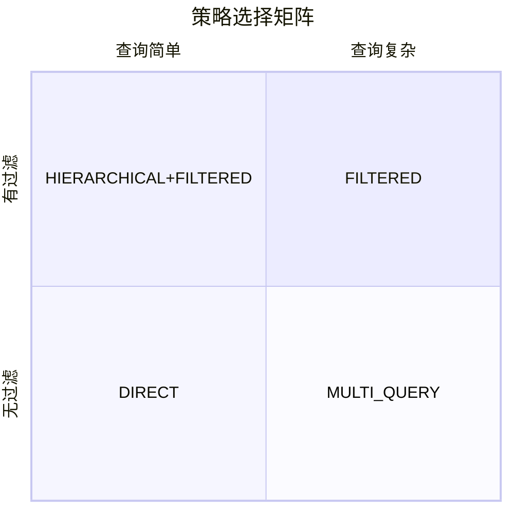
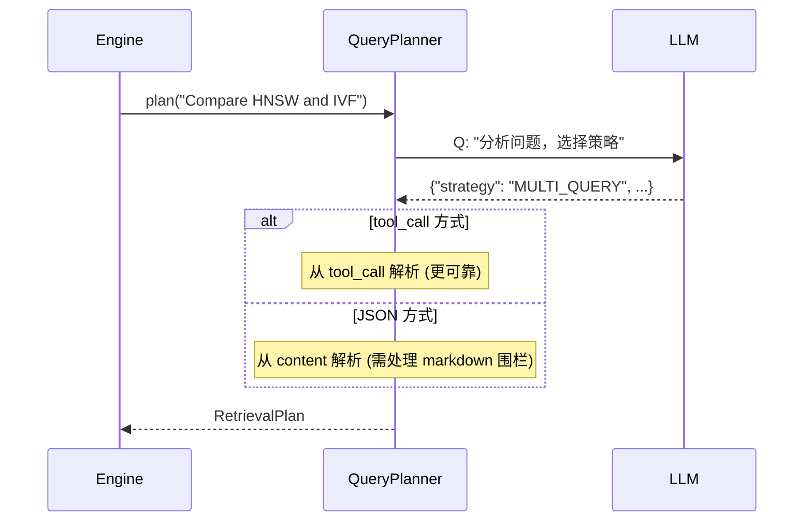

# 第六章：检索策略与规划

> Query Planner — 让 LLM 决定怎么搜。

## 前置知识

> 📎 **参考**: [距离度量](../prerequisites/05_距离度量_zh.md)

---

## 学习目标

- 理解四种检索策略及其适用场景
- 掌握 QueryPlanner 的设计
- 学会解析 LLM 生成的检索计划

---

## 6.1 四种策略



| 策略 | 场景 | 示例 | 轮数 |
|------|------|------|------|
| DIRECT | 简单事实查询 | "什么是 RAG？" | 1 |
| FILTERED | 带条件约束 | "2024年的RAG论文" | 1 |
| MULTI_QUERY | 多角度复杂 | "比较HNSW和IVF" | 1-2 |
| HIERARCHICAL | 开放探索 | "深度学习的最新进展" | 2-5 |

---

## 6.2 QueryPlanner 工作流



优先从 tool_call 解析的原因：

```
LLM 直接返回 tool_call:
  {"name": "vector_search", "arguments": {"query": "..."}}
  → 结构确定，无需额外解析

LLM 返回 JSON 文本:
  ```json
  {"strategy": "MULTI_QUERY", ...}
  ```
  → 需要去除 markdown 围栏、处理 JSON 解析异常
```

---

## 6.3 回退机制

```python
def _fallback_plan(self, question: str) -> RetrievalPlan:
    # 当 LLM 返回内容无法解析时，退化为 DIRECT 搜索
    return RetrievalPlan(
        strategy=SearchStrategy.DIRECT,
        reasoning="Fallback: LLM response parsing failed",
        steps=[SearchStep(query=question, k=10)],
    )
```

> **容错设计**: 无论 LLM 返回什么，系统都能以 DIRECT 策略继续工作。

---

## 思考题

1. tool_call 方式比 JSON 文本方式好在哪？还有什么其他方式？
2. 如果 LLM 选择了错误的策略 (如复杂问题选了 DIRECT)，会有什么影响？
3. HIERARCHICAL 策略的实现应该怎么设计？和 MULTI_QUERY 的核心区别是什么？

## 动手练习

1. 给 `RetrievalPlan` 添加 `confidence: float` 字段，表示 LLM 对该策略的信心度
2. 实现一个简单的 HIERARCHICAL 策略：第一轮搜"深度学习"，第二轮搜"Transformer"
3. 修改 QueryPlanner，让它可以接受用户指定的策略 (不经过 LLM)

---

## 附录：本章与面试题库映射

请完成本章后练习 [INTERVIEW_BANK.md](../INTERVIEW_BANK.md) 中对应分区题目，并阅读 [_CHAPTER_TEMPLATE.md](../_CHAPTER_TEMPLATE.md) 自检是否覆盖「点/线/面/动手/反思/参考」。

**全局架构：** [ARCHITECTURE.md](../../ARCHITECTURE.md) · **选型：** [TECH.md](../../../TECH.md) · **运行：** [RUN.md](../../../RUN.md)
